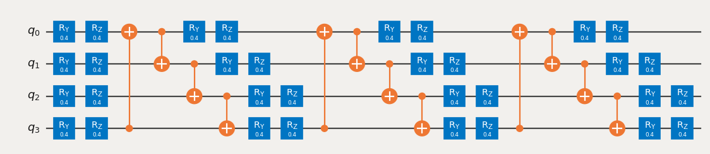
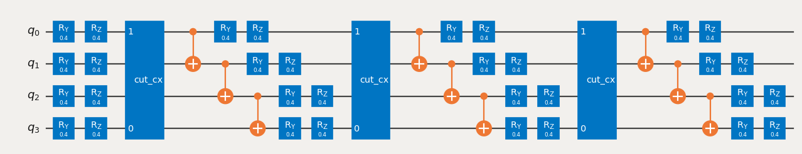

{/* doqumentation-source-hash: 30356817 */}

import TutorialFeedback from '@site/src/components/TutorialFeedback';

<OpenInLabBanner notebookPath="qiskit-addons/cutting/02_gate_cutting_to_reduce_circuit_depth.ipynb" />


في هذا البرنامج التعليمي، سنقلل عمق الدائرة عن طريق قطع الـ Gates البعيدة، تجنبًا لـ Swap Gates التي كانت ستُدرج بسبب عملية التوجيه.

فيما يلي الخطوات التي سنتبعها في هذا [نمط Qiskit](https://quantum.cloud.ibm.com/docs/guides/intro-to-patterns):

- **الخطوة 1: تعيين المسألة إلى دوائر كمومية وعوامل**:
    - تعيين هاميلتونيان على دائرة كمومية.
- **الخطوة 2: التحسين للعتاد المستهدف** [_يستخدم إضافة القطع_]:
    - <font color='#0F62FE'>قطع الدائرة والعنصر القابل للرصد.</font>
    - Transpile التجارب الفرعية للعتاد.
- **الخطوة 3: التنفيذ على العتاد المستهدف**:
    - تشغيل التجارب الفرعية المستخلصة في الخطوة 2 باستخدام primitive من نوع `Sampler`.
- **الخطوة 4: المعالجة اللاحقة للنتائج** [_يستخدم إضافة القطع_]:
    - <font color='#0F62FE'>دمج نتائج الخطوة 3 لإعادة بناء القيمة المتوقعة للعنصر القابل للرصد المعني.</font>
## الخطوة 1: التعيين {#step-1-map}

### إنشاء دائرة للتشغيل على Backend {#create-a-circuit-to-run-on-the-backend}

```python
# Added by doQumentation — required packages for this notebook
!pip install -q numpy qiskit qiskit-addon-cutting qiskit-aer qiskit-ibm-runtime
```

```python
from qiskit.circuit.library import efficient_su2

circuit = efficient_su2(num_qubits=4, entanglement="circular")
circuit.assign_parameters([0.4] * len(circuit.parameters), inplace=True)
circuit.draw("mpl", scale=0.8)
```



### تحديد عنصر قابل للرصد {#specify-an-observable}

```python
from qiskit.quantum_info import SparsePauliOp

observable = SparsePauliOp(["ZZII", "IZZI", "-IIZZ", "XIXI", "ZIZZ", "IXIX"])
```

## الخطوة 2: التحسين {#step-2-optimize}

### تحديد Backend {#specify-a-backend}

يمكنك توفير إما backend وهمي أو backend عتاد حقيقي من Qiskit Runtime.

```python
from qiskit_ibm_runtime.fake_provider import FakeManilaV2

backend = FakeManilaV2()
```

### Transpile الدائرة وتصور عمليات Swap وتسجيل العمق {#transpile-the-circuit-visualize-the-swaps-and-note-the-depth}

نختار تخطيطًا يتطلب عمليتَي Swap لتنفيذ الـ Gates بين Qubits 3 و0 وعمليتَي Swap إضافيتَين لإعادة الـ Qubits إلى مواضعها الأولية.

```python
from qiskit.transpiler import generate_preset_pass_manager

pass_manager = generate_preset_pass_manager(
    optimization_level=1, backend=backend, initial_layout=[0, 1, 2, 3]
)

transpiled_qc = pass_manager.run(circuit)
print(f"Transpiled circuit depth: {transpiled_qc.depth(lambda x: len(x.qubits) >= 2)}")
```

```text
Transpiled circuit depth: 30
```

```python
transpiled_qc.draw("mpl", scale=0.4, idle_wires=False, fold=-1)
```


### استبدال الـ Gates البعيدة بـ `TwoQubitQPDGate`s عن طريق تحديد مؤشراتها {#replace-distant-gates-with-twoqubitqpdgates-by-specifying-their-indices}

ستقوم `cut_gates` باستبدال الـ Gates عند المؤشرات المحددة بـ `TwoQubitQPDGate`s وستُعيد أيضًا قائمة من كائنات `QPDBasis` — واحد لكل تحليل Gate.

```python
from qiskit_addon_cutting import cut_gates

# Find the indices of the distant gates
cut_indices = [
    i
    for i, instruction in enumerate(circuit.data)
    if {circuit.find_bit(q)[0] for q in instruction.qubits} == {0, 3}
]

# Decompose distant CNOTs into TwoQubitQPDGate instances
qpd_circuit, bases = cut_gates(circuit, cut_indices)

qpd_circuit.draw("mpl", scale=0.8)
```



### توليد التجارب الفرعية للتشغيل على Backend {#generate-the-subexperiments-to-run-on-the-backend}

تقبل `generate_cutting_experiments` دائرة تحتوي على كائنات `TwoQubitQPDGate` والعناصر القابلة للرصد بوصفها `PauliList`.

لمحاكاة القيمة المتوقعة للدائرة كاملة الحجم، يُولَّد عدد كبير من التجارب الفرعية من التوزيع الاحتمالي شبه الكمومي المشترك للـ Gates المحللة ثم تُنفَّذ على Backend واحد أو أكثر. يتحكم `num_samples` في عدد العينات المأخوذة من التوزيع، ويُعطى معامل مدمج واحد لكل عينة فريدة. لمزيد من المعلومات حول طريقة حساب المعاملات، راجع [المواد الشارحة](../explanation/index.rst).

**ملاحظة:** الوسيط `observables` الممرر إلى `generate_cutting_experiments` من نوع `PauliList`. يُهمَل كلٌّ من معاملات الحدود والأطوار في العناصر القابلة للرصد أثناء تحليل المسألة وتنفيذ التجارب الفرعية. ويمكن إعادة تطبيقها أثناء إعادة بناء القيمة المتوقعة.

```python
import numpy as np
from qiskit_addon_cutting import generate_cutting_experiments

# Generate the subexperiments and sampling coefficients
subexperiments, coefficients = generate_cutting_experiments(
    circuits=qpd_circuit, observables=observable.paulis, num_samples=np.inf
)
```

### حساب العبء الزائد للأخذ بالعينات للقطوع المختارة {#calculate-the-sampling-overhead-for-the-chosen-cuts}

نقطع هنا ثلاثة CNOT Gates، مما ينتج عنه عبء زائد للأخذ بالعينات يبلغ $9^3$.

لمزيد من المعلومات حول العبء الزائد للأخذ بالعينات الناجم عن قطع الدوائر، راجع [المواد الشارحة](../explanation/index.rst).

```python
print(f"Sampling overhead: {np.prod([basis.overhead for basis in bases])}")
```

```text
Sampling overhead: 729.0
```

### إثبات أن التجارب الفرعية لـ QPD ستكون أكثر سطحيةً بعد قطع الـ Gates البعيدة {#demonstrate-that-the-qpd-subexperiments-will-be-shallower-after-cutting-distant-gates}

فيما يلي مثال على تجربة فرعية مختارة عشوائيًا مُولَّدة من دائرة QPD. لقد تقلص عمقها بأكثر من النصف. يجب توليد عدد كبير من هذه التجارب الفرعية الاحتمالية وتقييمها لإعادة بناء القيمة المتوقعة للدائرة الأعمق.

```python
# Transpile the decomposed circuit to the same layout
transpiled_qpd_circuit = pass_manager.run(subexperiments[100])

print(
    f"Original circuit depth after transpile: {transpiled_qc.depth(lambda x: len(x.qubits) >= 2)}"
)
print(
    f"QPD subexperiment depth after transpile: {transpiled_qpd_circuit.depth(lambda x: len(x.qubits) >= 2)}"
)
transpiled_qpd_circuit.draw("mpl", scale=0.8, idle_wires=False, fold=-1)
```

```text
Original circuit depth after transpile: 30
QPD subexperiment depth after transpile: 7
```


### تهيئة التجارب الفرعية للـ Backend {#prepare-subexperiments-for-the-backend}

```python
# Transpile the subeperiments to the backend's instruction set architecture (ISA)
isa_subexperiments = pass_manager.run(subexperiments)
```

## الخطوة 3: التنفيذ {#step-3-execute}

### تشغيل التجارب الفرعية باستخدام Qiskit Runtime Sampler primitive {#run-the-subexperiments-using-the-qiskit-runtime-sampler-primitive}

```python
from qiskit_ibm_runtime import SamplerV2

# Set up the Qiskit Runtime Sampler primitive.  For a fake backend, this will use a local simulator.
sampler = SamplerV2(backend)

# Submit the subexperiments
job = sampler.run(isa_subexperiments)
```

```python
# Retrieve the results
results = job.result()
```

## الخطوة 4: المعالجة اللاحقة {#step-4-post-process}

### إعادة بناء القيمة المتوقعة {#reconstruct-the-expectation-value}

أعِد بناء القيم المتوقعة لكل حد من حدود العنصر القابل للرصد ثم ادمجها لإعادة بناء القيمة المتوقعة للعنصر القابل للرصد الأصلي.

```python
from qiskit_addon_cutting import reconstruct_expectation_values

reconstructed_expval_terms = reconstruct_expectation_values(
    results,
    coefficients,
    observable.paulis,
)
# Reconstruct final expectation value
reconstructed_expval = np.dot(reconstructed_expval_terms, observable.coeffs)
```

### مقارنة القيمة المتوقعة المُعاد بناؤها بالقيمة المتوقعة الدقيقة المستخلصة من الدائرة والعنصر القابل للرصد الأصليين {#compare-the-reconstructed-expectation-value-with-the-exact-expectation-value-from-the-original-circuit-and-observable}

```python
from qiskit_aer.primitives import EstimatorV2

estimator = EstimatorV2()
exact_expval = estimator.run([(circuit, observable)]).result()[0].data.evs
print(f"Reconstructed expectation value: {np.real(np.round(reconstructed_expval, 8))}")
print(f"Exact expectation value: {np.round(exact_expval, 8)}")
print(f"Error in estimation: {np.real(np.round(reconstructed_expval-exact_expval, 8))}")
print(
    f"Relative error in estimation: {np.real(np.round((reconstructed_expval-exact_expval) / exact_expval, 8))}"
)
```

```text
Reconstructed expectation value: 0.44018555
Exact expectation value: 0.50497603
Error in estimation: -0.06479049
Relative error in estimation: -0.12830408
```

<TutorialFeedback />
