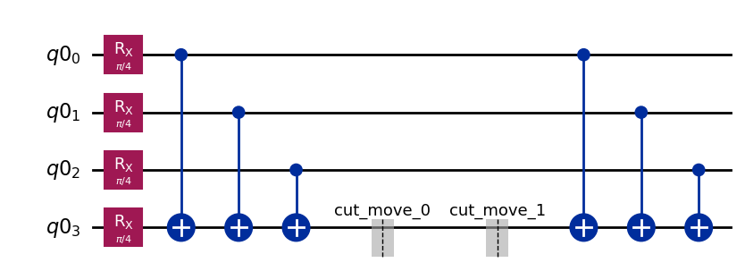

{/* doqumentation-source-hash: cf00a5bc */}

import TutorialFeedback from '@site/src/components/TutorialFeedback';

<OpenInLabBanner notebookPath="qiskit-addons/cutting/03_wire_cutting_via_move_instruction.ipynb" />


في هذا البرنامج التعليمي، سنعيد بناء قيم التوقع لدائرة Circuit مؤلفة من سبعة Qubit، وذلك بتقسيمها إلى دائرتين Circuit كل منهما أربعة Qubit باستخدام قطع الأسلاك.

فيما يلي الخطوات التي سنتبعها في هذا [نمط Qiskit](https://quantum.cloud.ibm.com/docs/guides/intro-to-patterns):

- **الخطوة 1: تعيين المسألة إلى دوائر Circuit ومؤثرات كمومية**:
    - تعيين هاميلتونيان على دائرة Circuit كمومية.
- **الخطوة 2: التحسين للعتاد المستهدف** [_تستخدم الإضافة الخاصة بالقطع_]:
    - <font color='#0F62FE'>قطع الدائرة Circuit والعنصر القابل للرصد.</font>
    - نقل التجارب الفرعية عبر Transpiler للعتاد.
- **الخطوة 3: التنفيذ على العتاد المستهدف**:
    - تشغيل التجارب الفرعية الناتجة عن الخطوة 2 باستخدام البدائي `Sampler`.
- **الخطوة 4: المعالجة اللاحقة للنتائج** [_تستخدم الإضافة الخاصة بالقطع_]:
    - <font color='#0F62FE'>دمج نتائج الخطوة 3 لإعادة بناء قيمة التوقع للعنصر القابل للرصد المعني.</font>
## الخطوة 1: التعيين {#step-1-map}

### إنشاء دائرة Circuit للقطع {#create-a-circuit-to-cut}

أولاً، نبدأ بدائرة Circuit مستوحاة من الشكل 1(a) في [arXiv:2302.03366v1](https://arxiv.org/abs/2302.03366v1).

```python
# Added by doQumentation — required packages for this notebook
!pip install -q numpy qiskit qiskit-addon-cutting qiskit-aer qiskit-ibm-runtime
```

```python
import numpy as np
from qiskit import QuantumCircuit

qc_0 = QuantumCircuit(7)
for i in range(7):
    qc_0.rx(np.pi / 4, i)
qc_0.cx(0, 3)
qc_0.cx(1, 3)
qc_0.cx(2, 3)
qc_0.cx(3, 4)
qc_0.cx(3, 5)
qc_0.cx(3, 6)
qc_0.cx(0, 3)
qc_0.cx(1, 3)
qc_0.cx(2, 3)
```

```text
<qiskit.circuit.instructionset.InstructionSet at 0x7f16ab191a80>
```

```python
qc_0.draw("mpl")
```


### تحديد عنصر قابل للرصد {#specify-an-observable}

```python
from qiskit.quantum_info import SparsePauliOp

observable = SparsePauliOp(["ZIIIIII", "IIIZIII", "IIIIIIZ"])
```

## الخطوة 2: التحسين {#step-2-optimize}

### إنشاء دائرة Circuit جديدة مع وضع تعليمات `Move` في مواضع القطع المطلوبة {#create-a-new-circuit-where-move-instructions-have-been-placed-at-the-desired-cut-locations}

بالنظر إلى الدائرة Circuit أعلاه، نريد وضع قطعَين للأسلاك على خط Qubit الأوسط، بحيث يمكن فصل الدائرة Circuit إلى دائرتين Circuit كل منهما أربعة Qubit. إحدى طرق تحقيق ذلك هي وضع تعليمات `Move` ثنائية Qubit يدوياً تنقل الحالة من سلك Qubit إلى آخر. وتعليمة `Move` مكافئة مفاهيمياً لعملية إعادة ضبط على Qubit الثاني، تليها بوابة Gate من نوع SWAP. ويتمثل أثر هذه التعليمة في نقل حالة Qubit الأول (المصدر) إلى Qubit الثاني (الوجهة)، مع استبعاد الحالة الواردة لـ Qubit الثاني. ولكي يعمل هذا على النحو المقصود، من الضروري أن لا يشترك Qubit الثاني (الوجهة) في أي تشابك مع بقية النظام؛ وإلا فإن عملية إعادة الضبط ستتسبب في انهيار جزئي لحالة بقية النظام.

هنا، نبني دائرة Circuit جديدة بإضافة Qubit واحد إضافي مع وضع عمليات `Move` في مكانها. في هذا المثال، يمكننا إعادة استخدام Qubit واحد: يصبح Qubit المصدر لأول تعليمة `Move` هو Qubit الوجهة لتعليمة `Move` الثانية.

ملاحظة: كبديل للتعامل المباشر مع تعليمات `Move`، يمكن اختيار تحديد قطع الأسلاك باستخدام تعليمة `CutWire` أحادية Qubit. توجد دالة `cut_wires` لتحويل تعليمات `CutWire` إلى تعليمات `Move` على Qubit مخصصة حديثاً. غير أنه على عكس الطريقة اليدوية، لا تتيح هذه الطريقة التلقائية إعادة استخدام أسلاك Qubit. راجع [دليل الإرشادات](../how-tos/how_to_specify_cut_wires.ipynb) الخاص بـ `CutWire` للاطلاع على التفاصيل.

```python
from qiskit_addon_cutting.instructions import Move

qc_1 = QuantumCircuit(8)
for i in [*range(4), *range(5, 8)]:
    qc_1.rx(np.pi / 4, i)
qc_1.cx(0, 3)
qc_1.cx(1, 3)
qc_1.cx(2, 3)
qc_1.append(Move(), [3, 4])
qc_1.cx(4, 5)
qc_1.cx(4, 6)
qc_1.cx(4, 7)
qc_1.append(Move(), [4, 3])
qc_1.cx(0, 3)
qc_1.cx(1, 3)
qc_1.cx(2, 3)

qc_1.draw("mpl")
```


### إنشاء عنصر قابل للرصد يتوافق مع الدائرة Circuit الجديدة {#create-observable-to-go-with-the-new-circuit}

يتوافق هذا العنصر القابل للرصد مع `observable`، لكن يجب مراعاة سلك Qubit الإضافي الذي أُضيف بشكل صحيح (أي إدراج "I" في الفهرس 4). لاحظ أنه في Qiskit، يقابل تمثيل السلسلة النصية لـ Qubit-0 الحرفَ الأيمن في سلسلة باولي.

```python
observable_expanded = SparsePauliOp(["ZIIIIIII", "IIIIZIII", "IIIIIIIZ"])
```

### فصل الدائرة Circuit والعناصر القابلة للرصد {#separate-the-circuit-and-observables}

كما في البرامج التعليمية السابقة، سيُجمَّع Qubit التي تحمل تسمية قسم مشتركة معاً، وستُقطع البوابات Gates غير المحلية الممتدة عبر أكثر من قسم.

```python
from qiskit_addon_cutting import partition_problem

partitioned_problem = partition_problem(
    circuit=qc_1, partition_labels="AAAABBBB", observables=observable_expanded.paulis
)
subcircuits = partitioned_problem.subcircuits
subobservables = partitioned_problem.subobservables
bases = partitioned_problem.bases
```

### تصور المسألة المحللة {#visualize-the-decomposed-problem}

```python
subobservables
```

```text
{'A': PauliList(['IIII', 'ZIII', 'IIIZ']),
 'B': PauliList(['ZIII', 'IIII', 'IIII'])}
```

```python
subcircuits["A"].draw("mpl")
```



```python
subcircuits["B"].draw("mpl")
```


### حساب عبء أخذ العينات للقطوع المختارة {#calculate-the-sampling-overhead-for-the-chosen-cuts}

نقطع هنا سلكَين، مما ينتج عنه عبء أخذ عينات يساوي $4^4$.

لمزيد من المعلومات حول عبء أخذ العينات الناجم عن قطع الدائرة Circuit، راجع [المواد التوضيحية](../explanation/index.rst).

```python
print(f"Sampling overhead: {np.prod([basis.overhead for basis in bases])}")
```

```text
Sampling overhead: 256.0
```

### توليد التجارب الفرعية للتشغيل على Backend {#generate-the-subexperiments-to-run-on-the-backend}

تقبل دالة `generate_cutting_experiments` وسيطَي `circuits`/`observables` على شكل قواميس تعيّن تسميات أقسام Qubit إلى `subcircuit`/`subobservables` المقابلة لها.

لمحاكاة قيمة التوقع للدائرة Circuit بحجمها الكامل، يُولَّد عدد كبير من التجارب الفرعية من التوزيع الاحتمالي شبه الكمومي المشترك للبوابات Gates المحللة، ثم تُنفَّذ على Backend واحد أو أكثر. يتحكم `num_samples` في عدد العينات المأخوذة من التوزيع، ويُعطى معامل مدمج واحد لكل عينة فريدة. لمزيد من المعلومات حول كيفية حساب المعاملات، راجع [المواد التوضيحية](../explanation/index.rst).

```python
from qiskit_addon_cutting import generate_cutting_experiments

subexperiments, coefficients = generate_cutting_experiments(
    circuits=subcircuits, observables=subobservables, num_samples=np.inf
)
```

### اختيار Backend {#choose-a-backend}

نستخدم هنا Backend وهمياً، مما سيؤدي إلى تشغيل Qiskit Runtime في الوضع المحلي (أي على محاكي محلي).

```python
from qiskit_ibm_runtime.fake_provider import FakeManilaV2

backend = FakeManilaV2()
```

### إعداد التجارب الفرعية للـ Backend {#prepare-the-subexperiments-for-the-backend}

يجب نقل الدوائر Circuit عبر Transpiler مع تحديد Backend كهدف قبل إرسالها إلى Qiskit Runtime.

```python
from qiskit.transpiler import generate_preset_pass_manager

# Transpile the subexperiments to ISA circuits
pass_manager = generate_preset_pass_manager(optimization_level=1, backend=backend)
isa_subexperiments = {
    label: pass_manager.run(partition_subexpts)
    for label, partition_subexpts in subexperiments.items()
}
```

## الخطوة 3: التنفيذ {#step-3-execute}

### تشغيل التجارب الفرعية باستخدام البدائي Sampler في Qiskit Runtime {#run-the-subexperiments-using-the-qiskit-runtime-sampler-primitive}

```python
from qiskit_ibm_runtime import SamplerV2, Batch

# Submit each partition's subexperiments to the Qiskit Runtime Sampler
# primitive, in a single batch so that the jobs will run back-to-back.
with Batch(backend=backend) as batch:
    sampler = SamplerV2(mode=batch)
    jobs = {
        label: sampler.run(subsystem_subexpts, shots=2**12)
        for label, subsystem_subexpts in isa_subexperiments.items()
    }
```

```text
/home/garrison/Qiskit/qiskit-ibm-runtime/qiskit_ibm_runtime/session.py:157: UserWarning: Session is not supported in local testing mode or when using a simulator.
  warnings.warn(
```

```python
# Retrieve results
results = {label: job.result() for label, job in jobs.items()}
```

## الخطوة 4: المعالجة اللاحقة {#step-4-post-process}

### إعادة بناء قيمة التوقع {#reconstruct-the-expectation-value}

نعيد بناء قيم التوقع لكل حد من حدود العنصر القابل للرصد ثم ندمجها لإعادة بناء قيمة التوقع للعنصر القابل للرصد الأصلي.

```python
from qiskit_addon_cutting import reconstruct_expectation_values

reconstructed_expval_terms = reconstruct_expectation_values(
    results,
    coefficients,
    subobservables,
)
reconstructed_expval = np.dot(reconstructed_expval_terms, observable.coeffs)
```

### مقارنة قيمة التوقع المعاد بناؤها بقيمة التوقع الدقيقة المستخرجة من الدائرة Circuit والعنصر القابل للرصد الأصليين {#compare-the-reconstructed-expectation-value-with-the-exact-expectation-value-from-the-original-circuit-and-observable}

```python
from qiskit_aer.primitives import EstimatorV2

estimator = EstimatorV2()
exact_expval = estimator.run([(qc_0, observable)]).result()[0].data.evs
print(f"Reconstructed expectation value: {np.real(np.round(reconstructed_expval, 8))}")
print(f"Exact expectation value: {np.round(exact_expval, 8)}")
print(f"Error in estimation: {np.real(np.round(reconstructed_expval-exact_expval, 8))}")
print(
    f"Relative error in estimation: {np.real(np.round((reconstructed_expval-exact_expval) / exact_expval, 8))}"
)
```

```text
Reconstructed expectation value: 1.51319069
Exact expectation value: 1.59099026
Error in estimation: -0.07779957
Relative error in estimation: -0.04890009
```

<TutorialFeedback />
