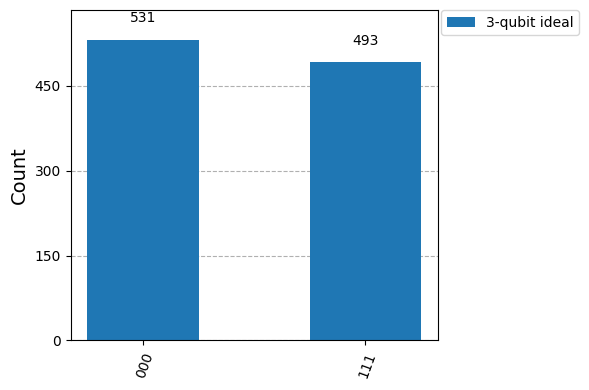

{/* doqumentation-source-hash: baae5bd5 */}

<OpenInLabBanner notebookPath="workshop/06_divincenzo_criteria_lab-2.ipynb" />

## مقدمة {#introduction}

حدّد الفيزيائي ديفيد ديفينتسنزو خمسة متطلبات رئيسية لأي تطبيق فيزيائي لحاسوب كمي، إضافةً إلى معيارين إضافيين للاتصالات الكمية. في هذا الكتيّب، سنـ**ختبر كل معيار من معايير ديفينتسنزو من خلال عروض توضيحية عملية باستخدام Qiskit**. بدلاً من التعمق في النظرية، يشرح كل قسم باختصار معياراً واحداً ثم يقدم تمارين برمجية باستخدام Qiskit 2. ستتمكن من تشغيل الـ Circuit على المحاكيات وأجهزة IBM Quantum الحقيقية لـ**استكشاف كل مبدأ بطريقة تطبيقية**.

**معايير ديفينتسنزو الخمسة للحوسبة الكمية**:

1. **نظام فيزيائي قابل للتوسع ذو Qubit محددة الخصائص جيداً.**
2. **القدرة على تهيئة Qubit** إلى حالة مرجعية بسيطة (مثل |00…0〉).
3. **أزمنة تماسك طويلة** (زمن تماسك الـ Qubit أطول بكثير من زمن تشغيل الـ Gate).
4. **مجموعة شاملة من الـ Gate الكمية** (قادرة على تنفيذ أي عملية أحادية اتجاه).
5. **قدرة قياس خاصة بكل Qubit** (قراءة حالة كل Qubit على حدة).

*(وصف ديفينتسنزو أيضاً معيارين للاتصالات الكمية: القدرة على التحويل بين الـ Qubit الثابتة و"الطائرة"، وإرسال الـ Qubit الطائرة بدقة بين المواقع. وقد أدرجنا هذين المعيارين في نشاط موصى به في نهاية هذا الكتيّب.)*

يتوافق كل قسم من الأقسام التالية مع معيار واحد. سنستخدم Qiskit لتوضيح المفهوم بالكود و**تجارب تفاعلية** يمكنك تجربتها. على سبيل المثال، سنرى كيف يؤثر توسيع عدد الـ Qubit وعمق الـ Circuit على النتائج (المعيار 1)، وكيفية إعادة تعيين حالات الـ Qubit وتهيئتها (المعيار 2)، وكيفية قياس الـ Qubit على المحاكيات مقابل الأجهزة الحقيقية (المعيار 4)، وكيف يؤلف Qiskit الـ Gate الشاملة (المعيار 3)، وكيف يؤثر التماسك المحدود (T₁، T₂) على العمليات الحسابية (المعيار 5). بنهاية هذا الكتيّب، ستمتلك حدساً أعمق حول ما يعنيه كل معيار من معايير ديفينتسنزو عملياً وكيف يتيح Qiskit التجريب بها.

```python
# Added by doQumentation — required packages for this notebook
!pip install -q numpy
```

```python
# Install necessary packages
!pip install qiskit[visualization] qiskit-ibm-runtime qiskit-aer qiskit_ibm_runtime
```

## 1. المعيار 1 – Qubit قابلة للتوسع ومحددة الخصائص جيداً {#criterion-1-scalable-well-characterized-qubits}

**المعيار 1:** *"نظام فيزيائي قابل للتوسع ذو Qubit محددة الخصائص جيداً."* يعني هذا أننا بحاجة إلى منصة أجهزة كمية يمكننا فيها **زيادة عدد الـ Qubit** والتحكم فيها بشكل موثوق. ينبغي أن تكون خصائص كل Qubit (مستويات الطاقة، معدلات الخطأ، الترابط، وما إلى ذلك) مفهومة جيداً. في جوهر الأمر، نريد بناء دوائر أكبر دون أن ينهار النظام. في الممارسة العملية، مع توسع عدد الـ Qubit أو عمق الـ Circuit، تتراكم الأخطاء وظاهرة فقدان التماسك، لذا فإن إثبات *قابلية التوسع* يعني أيضاً فهم كيفية تأثير الحجم المتزايد على الأداء.

**هدف العرض التوضيحي:** استخدام Qiskit لإظهار تأثير توسيع دائرة (من حيث عدد الـ Qubit أو عمق الـ Gate) على دقة المخرجات. سنحاكي سيناريو مثالياً مقابل سيناريو مشوّش لنرى كيف يستسلم النظام الأكبر أو الدائرة الأعمق لفقدان التماسك والأخطاء.

أولاً، لنبنِ حالة متشابكة صغيرة (حالة GHZ) على 3 Qubit، ثم حالة أكبر على 5 Qubit، كاختبار توسع بسيط. حالة GHZ لـ *n* Qubit هي $\frac{1}{\sqrt{2}}(|0...0\rangle + |1...1\rangle)$. في المحاكاة المثالية، قياس حالة GHZ ذات n Qubit يُنتج فقط نتيجتين (إما الكل 0 أو الكل 1) باحتمال متساوٍ. سنقارن **المخرج المثالي** بـ**المخرج المشوَّش** مع زيادة n أو عمق الـ Circuit.

```python
from qiskit import QuantumCircuit
from qiskit_aer import AerSimulator
from qiskit.visualization import plot_histogram
from qiskit.transpiler.preset_passmanagers import generate_preset_pass_manager
from qiskit_ibm_runtime import SamplerV2 as Sampler

# 3-qubit GHZ circuit
qc3 = QuantumCircuit(3, 3)
qc3.h(0)
qc3.cx(0, 1)
qc3.cx(1, 2)
qc3.measure([0, 1, 2], [0, 1, 2])

# 5-qubit GHZ circuit (scaling up the number of qubits)
qc5 = QuantumCircuit(5, 5)
qc5.h(0)
qc5.cx(0, range(1, 5))    # entangle qubit 0 with all others
qc5.measure(range(5), range(5))

# Transpile for a simulator backend
sim_backend = AerSimulator()
pm = generate_preset_pass_manager(backend=sim_backend, optimization_level=1)
isa_qc3 = pm.run(qc3)
isa_qc5 = pm.run(qc5)

# Run ideal simulations (no noise)
sampler = Sampler(mode=sim_backend)

job3 = sampler.run([isa_qc3], shots=1024)
result3 = job3.result()
counts3 = result3[0].data.c.get_counts()

job5 = sampler.run([isa_qc5], shots=1024)
result5 = job5.result()
counts5 = result5[0].data.c.get_counts()

print("3-qubit GHZ counts (ideal):", counts3)
plot_histogram(counts3, legend=['3-qubit ideal'], figsize=(6,4))
```

```text
3-qubit GHZ counts (ideal): {'000': 531, '111': 493}
```



```python
print("5-qubit GHZ counts (ideal):", counts5)
plot_histogram(counts5, legend=['5-qubit ideal'], figsize=(6,4))
```

```text
5-qubit GHZ counts (ideal): {'11111': 535, '00000': 489}
```


**النتيجة المتوقعة (الحالة المثالية):** تُنتج حالة GHZ ذات 3 Qubit مثالياً نحو 50% `000` و50% `111` في التعدادات. أما حالة GHZ ذات 5 Qubit فتُنتج نحو 50% `00000` و50% `11111`. لا تظهر سلاسل بت أخرى لأن الحالة في الوضع المثالي متماسكة ومتشابكة تماماً. ينبغي أن ترى شريطين طويلين في المخطط الرسومي لكل دائرة يتوافقان مع نتيجتَي الكل-أصفار والكل-آحاد.

بعد ذلك، دعونا نرى ما يحدث في **بيئة مشوَّشة**. سنستخدم قدرات نموذج الضوضاء في Qiskit Aer لمحاكاة أخطاء جهاز حقيقي. على سبيل المثال، يمكننا أخذ خصائص Backend من IBM لإنشاء نموذج ضوضاء يتضمن أخطاء الـ Gate، وأزمنة الـ Gate المحدودة، وانحلال الـ Qubit (T₁)، وتبدد الطور (T₂)، وأخطاء القراءة. هنا، سنستخدم **Backend وهمية** تمثل جهاز IBM Quantum Brisbane لتوليد نموذج ضوضاء، وإعادة تشغيل دوائر GHZ من خلاله.
### التمرين 1أ: المحاكاة مع الضوضاء {#exercise-1a-simulate-with-noise}
أكمل الكود أدناه لمحاكاة دوائر GHZ على محاكي مشوَّش مبني على الـ Backend `FakeBrisbane`. سيُظهر هذا كيف يتدهور الأداء مع توسع النظام في بيئة ضوضاء واقعية.

```python
from qiskit_ibm_runtime.fake_provider import FakeBrisbane

# We will reuse the ideal circuits qc3 and qc5 and their results from the previous cell.

# --- YOUR CODE HERE ---

# 1. Create a fake backend for IBM Quantum Brisbane
###brisbane_backend = ...

# 2. Create a noisy AerSimulator from the fake backend's properties
###noisy_sim = ...

# 3. Transpile the circuits for the noisy simulator (this adapts them to the device's specific gates and connectivity)
###pm = ...

###isa_qc3_noisy = ...

###isa_qc5_noisy = ...

# 4. Run the noisy simulations using the Sampler and get the counts
###sampler = ...

###job3 = ...

###result3_noisy = ...

###counts3_noisy = ...

###job5 = ...

###result5_noisy = ...

###counts5_noisy = ...

# --- END YOUR CODE ---

# This part is done for you to print and plot the results:
print("3-qubit GHZ counts (noisy):", counts3_noisy)
plot_histogram(counts3_noisy, legend=['3-qubit noisy'], figsize=(6,4))
```

```python
print("5-qubit GHZ counts (noisy):", counts5_noisy)
plot_histogram(counts5_noisy, legend=['5-qubit noisy'], figsize=(6,4))
```

### التمرين 1ب: التشغيل على حاسوب IBM Quantum حقيقي {#exercise-1b-run-on-real-ibm-quantum-computer}
الكود أدناه يُشغِّل دوائر GHZ على حاسوب IBM Quantum حقيقي. سيُظهر هذا كيف يتدهور الأداء على جهاز حقيقي.

```python
# your_api_key = "deleteThisAndPasteYourAPIKeyHere"
# your_crn = "deleteThisAndPasteYourCRNHere"

# QiskitRuntimeService.save_account(
#     channel="ibm_quantum_platform",
#     token=your_api_key,
#     instance=your_crn,
#     name="fallfest-2025",
# )

# Check that the account has been saved properly
# service = QiskitRuntimeService(name="fallfest-2025")
# print(service.saved_accounts())

# We will reuse the ideal circuits qc3 and qc5 and their results from the previous cell.

from qiskit_ibm_runtime import QiskitRuntimeService

service = QiskitRuntimeService(name="fallfest-2025")
real_backend = service.least_busy(operational=True, simulator=False)
print("Running on " + real_backend.name)

pm = generate_preset_pass_manager(backend=real_backend, optimization_level=1)
isa_qc3r = pm.run(qc3)
isa_qc5r = pm.run(qc5)

sampler = Sampler(mode=real_backend)

job3r = sampler.run([isa_qc3r], shots=1024)
result3r = job3r.result()
counts3r = result3r[0].data.c.get_counts()

job5r = sampler.run([isa_qc5r], shots=1024)
result5r = job5r.result()
counts5r = result5r[0].data.c.get_counts()

print("3-qubit GHZ counts (real):", counts3r)
plot_histogram(counts3r, legend=['3-qubit real'], figsize=(6,4))
```

```python
print("5-qubit GHZ counts (real):", counts5r)
plot_histogram(counts5r, legend=['5-qubit real'], figsize=(6,4))
```

**النتيجة المتوقعة (المشوَّشة مقابل المثالية):** مع الضوضاء، سواء في المحاكاة أو على جهاز حقيقي، تكون حالة GHZ **أقل دقةً**. ستشهد نتائج إضافية تتجاوز الكل-أصفار والكل-آحاد. بالنسبة لـ 3 Qubit، بدلاً من 100% في `000`/`111`، يتسرب بعض الاحتمال إلى سلاسل بت أخرى (مثل `001`، `010`، وما إلى ذلك) بسبب أخطاء الـ Gate أو فقدان التماسك الذي يُقلب بعض الـ Qubit. أما بالنسبة لـ 5 Qubit، فالتأثير أكثر وضوحاً؛ إذ تتراكم في الدائرة الأكبر (المزيد من الـ Qubit وبوابات CNOT) مزيداً من الأخطاء، فتنخفض قمم الكل-أصفار والكل-آحاد، وتظهر نتائج أخرى كثيرة. يُوضح هذا النمط تحدي *قابلية التوسع*: كلما توسعنا، أصبح الحفاظ على دقة عالية أصعب من دون تصحيح الأخطاء.

**الاستنتاج:** يحتاج الحاسوب الكمي القابل للتوسع إلى الحفاظ على الترابطات الكمية مع نمو النظام. تُظهر أمثلتنا كيف أن زيادة عدد الـ Qubit وعمق الـ Gate تتسبب في انخفاض دقة المخرجات عند وجود ضوضاء. ستتناول المعايير المتبقية الحفاظ على سلوك الـ Qubit (خطأ منخفض، قابلة للتهيئة، إلخ) مع التوسع.
## 2. المعيار 2 – تهيئة Qubit {#criterion-2-qubit-initialization}

**المعيار 2:** *"القدرة على تهيئة حالة الـ Qubit إلى حالة مرجعية بسيطة، مثل |000…〉."* ينبغي أن تبدأ جميع الـ Qubit بشكل موثوق في حالة مرجعية معروفة (عادةً حالة الأساس |0〉 لكل Qubit). التهيئة ضرورية لضمان بدء الخوارزميات من صفحة نظيفة. في الممارسة العملية، على أجهزة IBM الكمية، تُعاد كل Qubit تلقائياً إلى |0〉 عند بدء تنفيذ كل دائرة. يوفر Qiskit أيضاً تعليمات لإعادة تعيين الـ Qubit أو تحضير حالات مخصصة أثناء الحساب.

**هدف العرض التوضيحي:** إظهار كيفية تهيئة الـ Qubit في Qiskit، سواء في البداية أو في منتصف الدائرة. سنوضح استخدام تعليمة `reset` وأساليب تحضير الحالة.
### التمرين 2: تحضير حالة محددة {#exercise-2-prepare-a-specific-state}
في كتلة الكود أدناه، أكمل الـ `QuantumCircuit` لتحضير الحالة $|10\rangle$. يعني هذا أن الـ Qubit 0 ينبغي أن تكون في الحالة $|0\rangle$ والـ Qubit 1 في الحالة $|1\rangle$. استخدم الـ Gate والتعليمة المناسبتين لتحقيق ذلك.

```python
from qiskit import QuantumCircuit
from qiskit_aer import AerSimulator

# Create a circuit to initialize qubits to |10> and verify by measurement
qc_init = QuantumCircuit(2, 2)

# --- YOUR CODE HERE ---

# 1. Set qubit 1 to the |1> state

# 2. Explicitly reset qubit 0 to the |0> state

# --- END YOUR CODE ---

qc_init.measure([0, 1], [0, 1])
qc_init.draw('mpl')
```

```python
# Run the circuit and check the outcome
sim_backend = AerSimulator()
pm = generate_preset_pass_manager(backend=sim_backend, optimization_level=1)
isa_qc_init = pm.run(qc_init)

sampler = Sampler(mode=sim_backend)

job = sampler.run([isa_qc_init], shots=1024)
result = job.result()
counts = result[0].data.c.get_counts()

print("Outcome of |10> state measured in Z-basis:", counts)
plot_histogram(counts)
```

ينبغي أن ترى `10` (ثنائي لـ qubit1=1، qubit0=0) باحتمال 100% من المحاكاة، مما يعني أن الـ Qubit 1 جرى تحضيرها بنجاح في |1〉 والـ Qubit 0 في |0〉.

الآن، لتحضير حالة أعم، يتيح Qiskit التهيئة إلى حالات اعتباطية باستخدام الأسلوب `initialize`. على سبيل المثال، لنحضّر Qubit في الحالة $|+\rangle = (|0\rangle+|1\rangle)/\sqrt{2}$، وهي حالة تراكب، وزوجاً من الـ Qubit في حالة Bell $(|00\rangle+|11\rangle)/\sqrt{2}$:

```python
import numpy as np

# Initialize a single qubit in |+> state and measure in Z-basis
qc_plus = QuantumCircuit(1, 1)
state_plus = [1/np.sqrt(2), 1/np.sqrt(2)]   # amplitude for |0> and |1>
qc_plus.initialize(state_plus, 0)
qc_plus.measure(0, 0)

# Initialize two qubits in a Bell state manually
qc_bell = QuantumCircuit(2, 2)
bell_state = [1/np.sqrt(2), 0, 0, 1/np.sqrt(2)]  # amplitudes for |00>,|01>,|10>,|11>
qc_bell.initialize(bell_state, [0, 1])
qc_bell.measure([0, 1], [0, 1])

# Transpile and run the initialization circuits
isa_qc_plus = pm.run(qc_plus)
job_plus = sampler.run([isa_qc_plus], shots=1024)
result_plus = job_plus.result()
counts_plus = result_plus[0].data.c.get_counts()

print("Outcome of |+> state measured in Z-basis:", counts_plus)

isa_qc_bell = pm.run(qc_bell)
job_bell = sampler.run([isa_qc_bell], shots=1024)
result_bell = job_bell.result()
counts_bell = result_bell[0].data.c.get_counts()

print("Outcome of Bell state measured in Z-basis:", counts_bell)
```

```text
Outcome of |+> state measured in Z-basis: {'1': 499, '0': 525}
Outcome of Bell state measured in Z-basis: {'00': 508, '11': 516}
```

**النتائج المتوقعة:** ستُنتج حالة |+〉 للـ Qubit الواحدة، عند قياسها، `0` و`1` بنسبة 50% تقريباً لكل منهما. ينبغي أن يُعطي قياس حالة Bell نحو 50% `00` و50% `11`. إذا رأيت هذه النتائج، فهذا يؤكد نجاح تهيئتنا لتلك الحالات.

**التهيئة في منتصف الدائرة:** يمكن استخدام `reset` في Qiskit في منتصف الدائرة لإعادة تهيئة Qubit إلى |0〉 أثناء التنفيذ. على سبيل المثال، في أكواد تصحيح الأخطاء أو الخوارزميات التكرارية، كثيراً ما يُقاس Qubit ثم يُعاد تعيينه لإعادة استخدامه. عملية `reset` حتمية؛ إذ تُفرغ أي حالة موجودة وتُعيد الـ Qubit إلى حالة الأساس.

**مثال على الجهاز:** على أجهزة مثل **ibmq_brisbane** (127 Qubit) أو أي جهاز IBM، تبدأ جميع الـ Qubit في |0〉 بشكل افتراضي عند تشغيل مهمة. إذا احتجت إلى حالة بداية مختلفة، ستطبّق بوابات في البداية (كما فعلنا باستخدام X للحصول على |1〉). إعادة التهيئة المستمرة (لتصحيح الأخطاء الكمية) موضوع بحث نشط لأن تنفيذها بسرعة أمر صعب. لحسن الحظ، للاستخدام الأساسي، تتوفر القدرة على البدء من جديد في |0…0〉 وأوضحنا كيفية تحقيق حالات بداية مرغوبة أخرى أيضاً.
## 3. المعيار الثالث – زمن الترابط الطويل (تبدد الترابط مقابل زمن البوابة) {#3-criterion-3--long-coherence-time-decoherence-vs-gate-time}

**المعيار الثالث:** *"أزمنة تبدد ترابط طويلة وذات صلة، أطول بكثير من زمن تشغيل البوابة."* يتناول هذا المعيار ضرورة أن تحافظ الكيوبتات على حالتها الكمية لفترة كافية لإجراء العمليات اللازمة. لكل Qubit **زمن T₁** (زمن استرخاء الطاقة، وهو مدى سرعة تحلل الحالة |1〉 إلى |0〉) و**زمن T₂** (زمن تبدد الطور، وهو مدى سرعة فقدان الترابط الطوري النسبي). لكي يعمل الحاسوب الكمي بشكل صحيح، يجب أن تتجاوز هذه الأزمنة بكثير مدة عمليات البوابة.

**هدف العرض التوضيحي:** دراسة ترابط الكيوبت في Qiskit بإظهار كيف يؤثر تبدد الترابط على نتائج الدائرة مع ازدياد طول التنفيذ. سنستخدم Backend وهمياً بأزمنة T1/T2 معروفة لمحاكاة هذا التأثير.

**لإظهار تأثير الترابط المحدود**، سنحاكي تجربة تحلل T1. سنهيئ Qubit في الحالة |1〉، ننتظر لبعض الوقت باستخدام تعليمة `delay`، ثم نقيس. نتوقع أن ينخفض احتمال قياس |1〉 مع زيادة التأخير.

```python
# This part is done for you. We are creating a list of circuits,
# each with a different delay time.

time_delays_ns = [0, 50000, 100000, 150000, 200000, 250000, 300000]  # delay durations in ns

decay_expts = []
for delay in time_delays_ns:
    qc = QuantumCircuit(1, 1)
    qc.x(0)  # initialize qubit to |1>
    if delay > 0:
        qc.delay(delay, 0, unit='ns')  # wait 'delay' nanoseconds
    qc.measure(0, 0)
    decay_expts.append(qc)

decay_expts[1].draw('mpl') # Visualize one of the circuits
```


### التمرين الثالث: محاكاة تجربة تحلل T1 {#exercise-3-simulate-a-t1-decay-experiment}

استخدم الآن محاكياً مع ضوضاء مبنياً على `FakeVigo` (الذي يمتلك أزمنة T1 تبلغ نحو 50-100 ميكروثانية) لتشغيل هذه الدوائر. سيطبق المحاكي تلقائياً أخطاء T1/T2 أثناء تعليمات `delay`. قم بترجمة الدوائر لهذا Backend وتنفيذها.

```python
from qiskit_ibm_runtime.fake_provider import FakeVigoV2 as FakeVigo
from qiskit_aer import AerSimulator

# --- YOUR CODE HERE ---

# 1. Create a noisy simulator from the FakeVigo backend
###sim_vigo = ...

# 2. Transpile the list of circuits for this simulator
###pm = ...

###isa_decay_expts = ...

# 3. Use the Sampler to run all the transpiled circuits in a single job
###sampler = ...

###job = ...

###result = ...

# --- END YOUR CODE ---

# This part is done for you to analyze and print the results.
for idx, (delay, qc) in enumerate(zip(time_delays_ns, isa_decay_expts)):
    counts = result[idx].data.c.get_counts()
    p1 = counts.get('1', 0) / 1000  # Assuming 1000 shots
    print(f"Delay {delay} ns: P(qubit=1) = {p1:.3f}")
```

## 4. المعيار الرابع – مجموعة بوابات كمية شاملة {#4-criterion-4--universal-set-of-quantum-gates}

**المعيار الرابع:** *"مجموعة 'شاملة' من البوابات الكمية."* يعني هذا أن أجهزتنا يجب أن تتيح لنا إجراء *أي* عملية حسابية كمية عبر تركيب مجموعة محدودة من البوابات الأساسية. في الحوسبة الكلاسيكية، تُعدّ بوابة NAND شاملة؛ أما في الحوسبة الكمية، فهناك خيارات عديدة لمجموعات البوابات الشاملة (مثل \{H, T, CNOT\} أو البوابات الأصلية لجهاز معين). على سبيل المثال، تمتلك أجهزة IBM مجموعة من العمليات الأصلية كالتدويرات الاحادية العشوائية و CNOTs بين كيوبتات معينة، وهي معاً تشكل مجموعة شاملة. غالباً ما تتمثل مهمة Qiskit في **تجميع البوابات عالية المستوى إلى بوابات أساسية**.

**هدف العرض التوضيحي:** توضيح شمولية البوابة بإظهار كيف يحلل Qiskit البوابات. سنأخذ بوابة غير أصلية (مثل بوابة Toffoli ثلاثية الكيوبتات، CCX) ونرى كيف تتحلل إلى البوابات الأساسية للجهاز. يُثبت هذا أن مجموعة البوابات المُقدَّمة هي بالفعل *شاملة* – فهي قادرة على إنتاج العملية الأكثر تعقيداً.

أولاً، لنرَ ما هي البوابات الأساسية لـ Backend IBM نموذجي. سنستعلم عن تهيئة جهاز (أو نسخته الوهمية). على سبيل المثال، البوابات الأساسية لـ ibmq_brisbane:
يجب أن تلاحظ أن الاحتمال `P(qubit=1)` ينخفض مع زيادة وقت التأخير، وفق منحنى تحلل أسي مميز لاسترخاء T1. يُظهر هذا بشكل مباشر كيف يؤدي زمن الترابط المحدود إلى أخطاء حسابية إذا تشغّل الدائرة لوقت طويل جداً.

**التأثير على الخوارزميات:** إذا جربت خوارزمية أطول (بعدد كبير من البوابات المتسلسلة)، قد يقترب إجمالي وقت التنفيذ من T2 أو يتجاوزه، مما يتسبب في فقدان الحالة لترابطها قبل النهاية. لهذا السبب، يُعدّ تحسين أزمنة الترابط وتسريع البوابات من أكثر الأهداف الحيوية في أبحاث الأجهزة الكمية.

```python
from qiskit_ibm_runtime.fake_provider import FakeBrisbane
fake_brisbane = FakeBrisbane()
print("Basis gates for ibmq_brisbane:", fake_brisbane.configuration().basis_gates)
```

```text
Basis gates for ibmq_brisbane: ['ecr', 'id', 'rz', 'sx', 'x']
```

قد يُخرج هذا شيئاً مثل `['id', 'rz', 'sx', 'x', 'ecr']`. هذه هي العمليات الأولية التي يدعمها الجهاز بشكل أصلي (الهوية/لا عملية، تدوير RZ، بوابة الجذر التربيعي لـ X، بوابة X، وX المتحكم بها). يجب تأليف أي بوابة أخرى من هذه البوابات. هذه المجموعة معروفة بأنها شاملة للحوسبة الكمية (أساساً التدويرات أحادية الكيوبت بالإضافة إلى بوابة تشابك ثنائية الكيوبت تُشكّل مجموعة شاملة).

الآن، خذ **بوابة Toffoli (CCX)** كحالة اختبار. تقلب CCX كيوبت الهدف فقط إذا كان كلا كيوبتي التحكم يساويان 1. إنها ليست بوابة أصلية على أجهزة IBM. يُوفر Qiskit تعليمة `ccx`، لكنها ستُحلَّل في الخلفية.

### التمرين الرابع: تحليل بوابة Toffoli {#exercise-4-decompose-a-toffoli-gate}

أكمل الكود أدناه لبناء دائرة بها بوابة Toffoli (CCX) ثم استخدم Qiskit لتحليلها إلى البوابات الأساسية لـ Backend الخاص بـ `FakeBrisbane`.

```python
from qiskit import QuantumCircuit
from qiskit_ibm_runtime.fake_provider import FakeBrisbane

# The fake_brisbane backend from the previous cell is reused here.

# --- YOUR CODE HERE ---

# 1. Create a circuit that can accommodate a Toffoli gate
###qc_toffoli = ...

# Apply a CCX gate with controls on qubits 0, 1 and target on qubit 2

# 2. Transpile the circuit to the fake Brisbane backend
###pm = ...

###isa_qc_toffoli = ...

# --- END YOUR CODE ---

print("Toffoli circuit before decomposition:")
print(qc_toffoli)

print("\nToffoli circuit after transpiling to Brisbane basis:")
# The .draw() method will now show the decomposed circuit
print(isa_qc_toffoli.draw(fold=120))
```

في المخرجات بعد الترجمة، يجب أن ترى CCX مُستبدَلة بتسلسل من بوابات أكثر أساسية مثل `rz` و`sx` و`ecr`. يُثبت هذا أن البوابات الأصلية كافية للتعبير عن بوابة Toffoli.

**الشمولية في التطبيق:** يوضح التمرين أعلاه أن بوابة ثلاثية الكيوبتات معقدة بُنيت من بوابات أبسط. بوجه عام، يمكن تأليف **أي** متحول وحدوي متعدد الكيوبتات من بوابات أحادية وثنائية. يُعدّ Transpiler مكوناً أساسياً في أي حزمة برمجيات كمية، إذ يجسر الفجوة بين الخوارزميات المجردة التي نريد تشغيلها والعمليات الفيزيائية التي يمكن لجهاز كمي محدد تنفيذها فعلاً.

**مثال على الجهاز:** يستخدم جهاز **ibmq_brisbane** معمارية Eagle مع البوابات الأساسية المُبيَّنة أعلاه. هذا يعني أن أي خوارزمية تُرسل إلى تلك الأجهزة ستُحوَّل إلى تسلسلات من تلك العمليات. يتعلق هذا المعيار في جوهره بـ**القابلية للتحكم**؛ أي أن لدينا ما يكفي من عناصر التحكم لإجراء أي عملية مطلوبة على كيوبتاتنا.

## 5. المعيار الخامس – قياس الكيوبت {#5-criterion-5--qubit-measurement}

**المعيار الخامس:** *"قدرة قياس خاصة بكل كيوبت."* يجب أن تكون حالة كل Qubit قابلة للقياس (عادةً في الأساس الحسابي، |0〉 أو |1〉). بعبارة أخرى، بعد تشغيل دائرة كمية، نحتاج إلى قراءة كل Qubit كبت كلاسيكي 0/1. يتعلق هذا المعيار بامتلاك كاشفات موثوقة لكل كيوبت والقدرة على تحديد أي كيوبتات يجري قياسها.

**هدف العرض التوضيحي:** إظهار كيفية إجراء القياسات في Qiskit على المحاكيات والأجهزة الفعلية، وتسليط الضوء على الاختلافات (كضوضاء القياس). سنقيس بعض الكيوبتات في حالات متعددة ونفحص النتائج. سنُظهر أيضاً كيف قد تظهر أخطاء القراءة بمقارنة نتائج المحاكي والأجهزة.

أولاً، مثال بسيط على القياس:

```python
qc_measure = QuantumCircuit(2, 2)
qc_measure.x(0)              # qubit 0 -> |1>, qubit 1 stays |0>
qc_measure.measure([0, 1], [0, 1])
qc_measure.draw('mpl')
```


```python
sim_backend = AerSimulator()
pm = generate_preset_pass_manager(backend=sim_backend, optimization_level=1)
isa_qc_measure = pm.run(qc_measure)
job = sampler.run([isa_qc_measure], shots=1000)
result = job.result()
counts = result[0].data.c.get_counts()

print("Simulator measurement counts:", counts)
```

```text
Simulator measurement counts: {'01': 1000}
```

نتوقع 1000 عدد من `01` في المحاكي. الآن، لنرَ **خطأ القياس** في العمل بمحاكاته. يمكننا إضافة خطأ قراءة إلى محاكي Aer. تتيح لنا Qiskit Aer تعريف `ReadoutError` وإرفاقه بالكيوبتات في نموذج الضوضاء.

### التمرين الخامس: محاكاة خطأ القراءة {#exercise-5-simulate-readout-error}

أكمل الكود لتعريف نموذج بسيط لخطأ القراءة حيث يبلغ احتمال قياس كل كيوبت بشكل غير صحيح 2% (تُقرأ الـ 0 كـ 1، أو تُقرأ الـ 1 كـ 0). ثم شغّل دائرة القياس مع هذا النموذج للضوضاء.

```python
from qiskit_aer.noise import NoiseModel, ReadoutError

# --- YOUR CODE HERE ---

# 1. Define a 2% readout error for each single qubit.
# The format is a list of lists of probabilities: [[P(0|0), P(1|0)], [P(0|1), P(1|1)]]
# P(A|B) is the probability of measuring A given the state was |B>.
###ro_error = ...

# 2. Create a new noise model
###noise_model_ro = ...

# 3. Add the readout error to all qubits in the noise model
... # Hint: Use the add_all_qubit_readout_error method

# --- END YOUR CODE ---

sim_backend.set_options(noise_model=noise_model_ro)
pm = generate_preset_pass_manager(backend=sim_backend, optimization_level=1)
isa_qc_measure = pm.run(qc_measure)

# Run the measurement circuit with readout noise
sampler = Sampler(mode=sim_backend)

job = sampler.run([isa_qc_measure], shots=1024)
result = job.result()
counts = result[0].data.c.get_counts()

print("Simulation with 2% readout error:", counts)
```

ستُظهر هذه المخرجات المحاكاة بعض الأعداد الخاطئة (مثل `11` و`00` و`10`) على غرار ما قد تُنتجه الأجهزة الفعلية، مما يوضح تأثير القياس غير الكامل.

**مثال على الجهاز:** على جهاز فعلي مثل **ibmq_brisbane**، يمكنك تشغيل نفس الدائرة وستحصل على الأرجح على أعداد غير صفرية مشابهة للنتائج الخاطئة. تُدرج بيانات معايرة الجهاز خطأ القراءة لكل كيوبت. تُعدّ القدرة على استهداف وقراءة كيوبتات محددة أمراً بالغ الأهمية، كما أن فهم خصائص أخطائها مفتاح الحصول على نتائج ذات معنى. جرى توضيح التشغيل على جهاز فعلي في **التمرين 1ب: التشغيل على حاسوب IBM Quantum الفعلي**.

## معايير التواصل الكمي (الكيوبتات الطائرة) {#quantum-communication-criteria-flying-qubits}

أدرج ديفينشنزو أيضاً معيارين خاصين بالتواصل الكمي، مهمَّين لبناء حاسوب كمي متشابك الشبكة:

6. **القدرة على التحويل المتبادل بين الكيوبتات الثابتة والطائرة.** (مثل: تحويل كيوبت في معالج إلى فوتون يمكنه السفر.)
7. **القدرة على نقل الكيوبتات الطائرة بأمانة بين المواقع.** (مثل: إرسال كيوبت فوتوني عبر ألياف ضوئية دون فقدان المعلومات الكمية.)

هذه المعايير تتجاوز نطاق استخدام Qiskit المعتاد لأن Qiskit يتعامل أساساً مع كيوبتات ثابتة على شريحة. غير أنه يمكننا توضيح *مفهوم* هذه المعايير بمثال بسيط: **الإرسال الكمي**. يُظهر الإرسال الكمي تحويل حالة كيوبت ثابت إلى معلومات يحملها زوج متشابك (الجزء "الطائر") والتواصل الكلاسيكي، الذي يُستخدم لاحقاً لإعادة بناء الحالة على كيوبت ثابت آخر في مكان آخر.

### النشاط المُوصى به: خذ وحدة *الإرسال الكمي* من Qiskit in Classrooms {#recommended-activity-take-the-qiskit-in-classrooms-quantum-teleportation-module}

ستُرشدك وحدة [الإرسال الكمي](https://quantum.cloud.ibm.com/learning/en/modules/computer-science/quantum-teleportation) من Qiskit in Classrooms بقلم الدكتورة Katie McCormick خلال أحد أكثر البروتوكولات جاذبية في نظرية المعلومات الكمية: الإرسال الكمي، حيث تُرسل حالة كمية (كيوبت) من أليس إلى بوب باستخدام التشابك وبيتَي كلاسيكيَّين فحسب. ستتعلم إجراء الإرسال الكامل خطوة بخطوة — كيفية تحضير زوج Bell المتشابك، وإجراء قياس أساس Bell من جانب أليس، ونقل النتائج الكلاسيكية، وتطبيق البوابة الكمية الصحيحة على كيوبت بوب لاستعادة الحالة الأصلية تماماً. على طول الطريق، ستستكشف سبب عدم انتهاك الإرسال الكمي لنظرية عدم الاستنساخ أو تجاوز سرعة الضوء. من خلال تمارين عملية باستخدام أجهزة IBM Quantum أو المحاكيات، ستكتسب فهماً تطبيقياً للقياس والتشابك والتحكم المُسترجَع في العمل.

من خلال إتقان الإرسال الكمي، ستفهم كيفية ترميز المعلومات الكمية ونقلها واستعادتها بين عُقد مستقلة — مما يرسي الأساس للشبكات الكمية وأنظمة المُكرِّر ومخططات الاتصال الآمن والحوسبة الكمية المعيارية قابلة للتوسع.

**الصلة بالمعيارين 6 و7:** في شبكة كمية فعلية، سيُنشأ الزوج المتشابك المشترك عبر توزيع كيوبتات "طائرة" (كالفوتونات) بين موقعَي أليس وبوب (المعيار 7: النقل الأمين). يُسهم بروتوكول الإرسال نفسه بعد ذلك في تحويل حالة الكيوبت الثابت لدى أليس إلى نصفها من الزوج المتشابك، مما يجعله في حكم "المُرسَل" إلى بوب (المعيار 6: التحويل المتبادل). يتيح لنا Qiskit محاكاة منطق البروتوكول بشكل مثالي، مُقدِّماً نموذجاً مفاهيمياً لكيفية استيفاء هذه المعايير في معماريات الاتصال.

## الخلاصة والملخص {#conclusion--summary}

صممنا سلسلة من التمارين المرتكزة على الكود لتوضيح معايير ديفينشنزو باستخدام Qiskit. من خلال هذه الأمثلة العملية، استكشفت كيف تستوفي منصة الحوسبة الكمية الفعلية كل متطلب:

- **قابلية التوسع**: بناء دوائر على كيوبتات أكثر وفهم تحجيم الضوضاء.
- **التهيئة**: استخدام إعادة الضبط وتحضير الحالة لبدء العمليات الحسابية بشكل موثوق في حالات معروفة.
- **البوابات الشاملة**: ترجمة العمليات المعقدة إلى البوابات الأساسية للجهاز، مما يُثبت قدرتنا على إجراء أي عملية حسابية.
- **القياس**: قراءة الكيوبتات والتعامل مع أخطاء القراءة الواقعية.
- **الترابط**: مشاهدة تأثير T₁ وT₂ المحدودَين على دقة الخوارزمية والحاجة إلى أن تكون العمليات سريعة نسبياً مقارنةً بتبدد الترابط.

للاكتمال، تطرقنا أيضاً إلى جوانب التواصل الكمي عبر وحدة [الإرسال الكمي](https://quantum.cloud.ibm.com/learning/en/modules/computer-science/quantum-teleportation) من Qiskit in Classrooms، مرتبطين بذلك المعيارَين الأخيرَين (الكيوبتات الطائرة).

أخيراً، تجدر الإشارة إلى كيفية تكامل هذه المعايير في حاسوب كمي فعلي كأجهزة IBM. جهاز مثل **ibmq_brisbane** يضم 127 كيوبت فائق التوصيل (المعيار 1)، يبدأ كل منها في الحالة |0〉 (المعيار 2)، مع مجموعة بوابات معايَرة ومُجمِّعات لتحقيق الشمولية (المعيار 4)، ومُرنِّنات قراءة ميكروويف لكل كيوبت (المعيار 5)، وأزمنة ترابط بمقدار مئات الميكروثانية مقابل عمليات بالنانوثانية (المعيار 3). أما لتجارب التواصل الكمي، فتستكشف IBM وغيرها تحويل الميكروويف إلى بصريات لكيوبتات طائرة، وتشابك كيوبتات بعيدة (المعيارَين 6 و7)؛ وتلك مجالات بحث نشطة.
