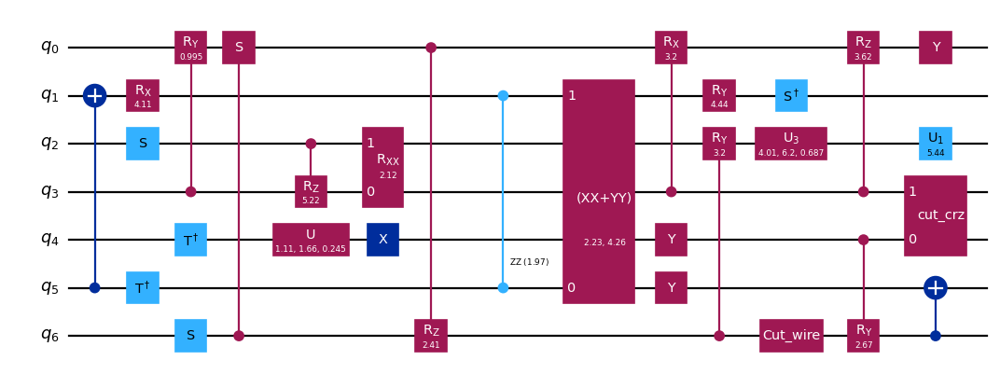

{/* doqumentation-source-hash: 781aa50d */}

import TutorialFeedback from '@site/src/components/TutorialFeedback';

<OpenInLabBanner notebookPath="qiskit-addons/cutting/03_wire_cutting_via_move_instruction.ipynb" />


V tomto tutoriálu rekonstruujeme očekávané hodnoty sedmiqubitového Circuit tím, že ho rozdělíme na dva čtyřqubitové Circuit pomocí řezání drátů.

Toto jsou kroky, které podnikneme v rámci tohoto [Qiskit vzoru](https://quantum.cloud.ibm.com/docs/guides/intro-to-patterns):

- **Krok 1: Mapování problému na kvantové Circuit a operátory**:
    - Namapuj hamiltonián na kvantový Circuit.
- **Krok 2: Optimalizace pro cílový hardware** [_Využívá addon pro řezání_]:
    - <font color='#0F62FE'>Rozřež Circuit a pozorovatelnou.</font>
    - Transpiluj dílčí experimenty pro hardware.
- **Krok 3: Spuštění na cílovém hardware**:
    - Spusť dílčí experimenty získané v Kroku 2 pomocí primitiva `Sampler`.
- **Krok 4: Post-processing výsledků** [_Využívá addon pro řezání_]:
    - <font color='#0F62FE'>Zkombinuj výsledky Kroku 3 a rekonstruuj očekávanou hodnotu sledované pozorovatelné.</font>
## Krok 1: Mapování {#step-1-map}

### Vytvoření Circuit k řezání {#create-a-circuit-to-cut}

Nejprve vyjdeme z Circuit inspirovaného obr. 1(a) z [arXiv:2302.03366v1](https://arxiv.org/abs/2302.03366v1).

```python
# Added by doQumentation — required packages for this notebook
!pip install -q numpy qiskit qiskit-addon-cutting qiskit-aer qiskit-ibm-runtime
```

```python
import numpy as np
from qiskit import QuantumCircuit

qc_0 = QuantumCircuit(7)
for i in range(7):
    qc_0.rx(np.pi / 4, i)
qc_0.cx(0, 3)
qc_0.cx(1, 3)
qc_0.cx(2, 3)
qc_0.cx(3, 4)
qc_0.cx(3, 5)
qc_0.cx(3, 6)
qc_0.cx(0, 3)
qc_0.cx(1, 3)
qc_0.cx(2, 3)
```

```text
<qiskit.circuit.instructionset.InstructionSet at 0x7f16ab191a80>
```

```python
qc_0.draw("mpl")
```


### Specifikace pozorovatelné {#specify-an-observable}

```python
from qiskit.quantum_info import SparsePauliOp

observable = SparsePauliOp(["ZIIIIII", "IIIZIII", "IIIIIIZ"])
```

## Krok 2: Optimalizace {#krok-2-optimalizace}

### Vytvoření nového Circuit, kde byly instrukce `Move` umístěny na požadovaná místa řezu {#create-a-new-circuit-where-move-instructions-have-been-placed-at-the-desired-cut-locations}

Na základě výše uvedeného Circuit chceme umístit dva řezy drátů na prostřední qubitovou linku, aby se Circuit mohl rozdělit na dva Circuit o čtyřech Qubitech každý. Jedním ze způsobů, jak toho dosáhnout, je ručně umístit dvouqubitové instrukce `Move`, které přenesou stav z jednoho qubitového drátu na druhý. Instrukce `Move` je koncepčně ekvivalentní operaci reset na druhém Qubitu, po níž následuje Gate SWAP. Účinkem této instrukce je přenos stavu prvního (zdrojového) Qubitu na druhý (cílový) Qubit, přičemž příchozí stav druhého Qubitu je zahozen. Aby to fungovalo podle záměru, je důležité, aby druhý (cílový) Qubit nesdílel žádné provázání se zbytkem systému; v opačném případě by operace reset způsobila částečný kolaps stavu zbytku systému.

Zde sestavíme nový Circuit s jedním dalším Qubitem a s operacemi `Move` na příslušných místech. V tomto příkladu je možné Qubit znovu použít: zdrojový Qubit první instrukce `Move` se stane cílovým Qubitem druhé instrukce `Move`.

Poznámka: Jako alternativu k přímé práci s instrukcemi `Move` lze místa řezů drátů označit pomocí jednoqubitové instrukce `CutWire`. Funkce `cut_wires` slouží k transformaci instrukcí `CutWire` na instrukce `Move` na nově alokovaných Qubitech. Na rozdíl od ruční metody však tato automatická metoda neumožňuje opětovné použití qubitových drátů. Podrobnosti najdeš v [návodech](../how-tos/how_to_specify_cut_wires.ipynb) pro `CutWire`.

```python
from qiskit_addon_cutting.instructions import Move

qc_1 = QuantumCircuit(8)
for i in [*range(4), *range(5, 8)]:
    qc_1.rx(np.pi / 4, i)
qc_1.cx(0, 3)
qc_1.cx(1, 3)
qc_1.cx(2, 3)
qc_1.append(Move(), [3, 4])
qc_1.cx(4, 5)
qc_1.cx(4, 6)
qc_1.cx(4, 7)
qc_1.append(Move(), [4, 3])
qc_1.cx(0, 3)
qc_1.cx(1, 3)
qc_1.cx(2, 3)

qc_1.draw("mpl")
```



### Vytvoření pozorovatelné k novému Circuit {#create-observable-to-go-with-the-new-circuit}

Tato pozorovatelná odpovídá `observable`, ale musíme správně zohlednit přidaný extra qubitový drát (tj. vložíme „I" na index 4). Pozor, v Qiskitu odpovídá v řetězcové reprezentaci Qubit-0 znaku Pauliho operátoru zcela vpravo.

```python
observable_expanded = SparsePauliOp(["ZIIIIIII", "IIIIZIII", "IIIIIIIZ"])
```

### Oddělení Circuit a pozorovatelných {#separate-the-circuit-and-observables}

Stejně jako v předchozích tutoriálech budou Qubity sdílející stejný štítek oddílu seskupeny dohromady a nelokalní Gate přesahující více než jeden oddíl budou rozřezány.

```python
from qiskit_addon_cutting import partition_problem

partitioned_problem = partition_problem(
    circuit=qc_1, partition_labels="AAAABBBB", observables=observable_expanded.paulis
)
subcircuits = partitioned_problem.subcircuits
subobservables = partitioned_problem.subobservables
bases = partitioned_problem.bases
```

### Vizualizace rozloženého problému {#visualize-the-decomposed-problem}

```python
subobservables
```

```text
{'A': PauliList(['IIII', 'ZIII', 'IIIZ']),
 'B': PauliList(['ZIII', 'IIII', 'IIII'])}
```

```python
subcircuits["A"].draw("mpl")
```


```python
subcircuits["B"].draw("mpl")
```


### Výpočet vzorkovací režie pro zvolené řezy {#calculate-the-sampling-overhead-for-the-chosen-cuts}

Zde řežeme dva dráty, což vede ke vzorkovací režii $4^4$.

Více informací o vzorkovací režii způsobené řezáním Circuit najdeš ve [vysvětlujících materiálech](../explanation/index.rst).

```python
print(f"Sampling overhead: {np.prod([basis.overhead for basis in bases])}")
```

```text
Sampling overhead: 256.0
```

### Generování dílčích experimentů ke spuštění na Backend {#generate-the-subexperiments-to-run-on-the-backend}

Funkce `generate_cutting_experiments` přijímá argumenty `circuits`/`observables` jako slovníky mapující štítky qubitových oddílů na příslušné `subcircuit`/`subobservables`.

Pro simulaci očekávané hodnoty Circuit v plné velikosti se z kvazipravděpodobnostního rozdělení rozložených Gate vygeneruje mnoho dílčích experimentů, které jsou poté spuštěny na jednom nebo více Backend. Počet vzorků odebraných z rozdělení se ovládá parametrem `num_samples` a pro každý unikátní vzorek je uveden jeden kombinovaný koeficient. Více informací o výpočtu koeficientů najdeš ve [vysvětlujících materiálech](../explanation/index.rst).

```python
from qiskit_addon_cutting import generate_cutting_experiments

subexperiments, coefficients = generate_cutting_experiments(
    circuits=subcircuits, observables=subobservables, num_samples=np.inf
)
```

### Volba Backend {#volba-backend}

Zde používáme falešný Backend, jehož výsledkem bude spuštění Qiskit Runtime v lokálním režimu (tj. na lokálním simulátoru).

```python
from qiskit_ibm_runtime.fake_provider import FakeManilaV2

backend = FakeManilaV2()
```

### Příprava dílčích experimentů pro Backend {#prepare-the-subexperiments-for-the-backend}

Před odesláním do Qiskit Runtime musíme Circuit transpilovat s naším Backend jako cílem.

```python
from qiskit.transpiler import generate_preset_pass_manager

# Transpile the subexperiments to ISA circuits
pass_manager = generate_preset_pass_manager(optimization_level=1, backend=backend)
isa_subexperiments = {
    label: pass_manager.run(partition_subexpts)
    for label, partition_subexpts in subexperiments.items()
}
```

## Krok 3: Spuštění {#step-3-execute}

### Spuštění dílčích experimentů pomocí primitiva Sampler z Qiskit Runtime {#run-the-subexperiments-using-the-qiskit-runtime-sampler-primitive}

```python
from qiskit_ibm_runtime import SamplerV2, Batch

# Submit each partition's subexperiments to the Qiskit Runtime Sampler
# primitive, in a single batch so that the jobs will run back-to-back.
with Batch(backend=backend) as batch:
    sampler = SamplerV2(mode=batch)
    jobs = {
        label: sampler.run(subsystem_subexpts, shots=2**12)
        for label, subsystem_subexpts in isa_subexperiments.items()
    }
```

```text
/home/garrison/Qiskit/qiskit-ibm-runtime/qiskit_ibm_runtime/session.py:157: UserWarning: Session is not supported in local testing mode or when using a simulator.
  warnings.warn(
```

```python
# Retrieve results
results = {label: job.result() for label, job in jobs.items()}
```

## Krok 4: Post-processing {#krok-4-post-processing}

### Rekonstrukce očekávané hodnoty {#reconstruct-the-expectation-value}

Rekonstruuj očekávané hodnoty pro každý člen pozorovatelné a zkombinuj je k rekonstrukci očekávané hodnoty původní pozorovatelné.

```python
from qiskit_addon_cutting import reconstruct_expectation_values

reconstructed_expval_terms = reconstruct_expectation_values(
    results,
    coefficients,
    subobservables,
)
reconstructed_expval = np.dot(reconstructed_expval_terms, observable.coeffs)
```

### Porovnání rekonstruované očekávané hodnoty s přesnou očekávanou hodnotou z původního Circuit a pozorovatelné {#compare-the-reconstructed-expectation-value-with-the-exact-expectation-value-from-the-original-circuit-and-observable}

```python
from qiskit_aer.primitives import EstimatorV2

estimator = EstimatorV2()
exact_expval = estimator.run([(qc_0, observable)]).result()[0].data.evs
print(f"Reconstructed expectation value: {np.real(np.round(reconstructed_expval, 8))}")
print(f"Exact expectation value: {np.round(exact_expval, 8)}")
print(f"Error in estimation: {np.real(np.round(reconstructed_expval-exact_expval, 8))}")
print(
    f"Relative error in estimation: {np.real(np.round((reconstructed_expval-exact_expval) / exact_expval, 8))}"
)
```

```text
Reconstructed expectation value: 1.51319069
Exact expectation value: 1.59099026
Error in estimation: -0.07779957
Relative error in estimation: -0.04890009
```

<TutorialFeedback />
