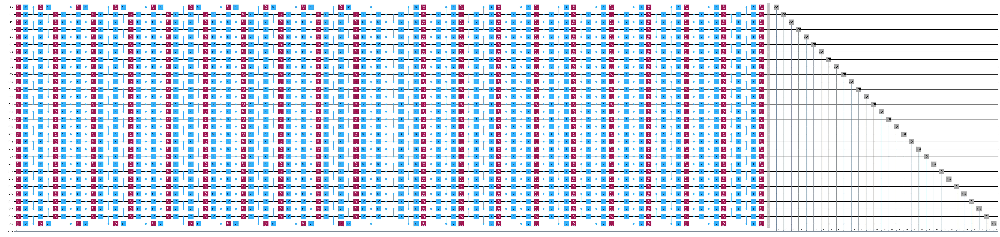
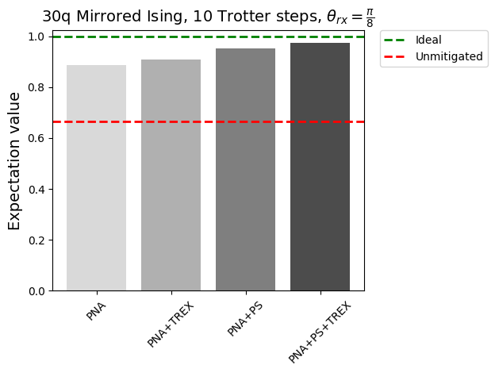

{/* doqumentation-source-hash: 3f45752c */}

import TutorialFeedback from '@site/src/components/TutorialFeedback';

<OpenInLabBanner notebookPath="qiskit-addons/pna/01_generate_noise_mitigating_observable.ipynb" />


V tomto tutoriálu se naučíš, jak využít nejnovější nástroje v ekosystému Qiskit k implementaci plně přizpůsobitelného pracovního postupu s mitigací chyb. Představíme techniku PNA a použijeme ji k mitigaci chyb Gate. Použijeme také TREX k mitigaci chyb při čtení výsledků a post-selekci k mitigaci chyb, které nejsou zachyceny v naučeném modelu šumu.

**Přehled**
- Stručný přehled techniky ``PNA``
- Vytvoření Trotterizovaného kvantového Circuit a pozorovatelné veličiny. Transpilace do Backend a zahrnutí měření pro post-selekci.
- Použití ``samplomatic`` k twirl vrstvám 2Q Gate a měření. Nalezení unikátních 2Q vrstev ke snížení nákladů na učení šumu.
- Použití ``NoiseLearnerV3`` k naučení chybového modelu ovlivňujícího 2Q Gate a měření.
- Použití ``qiskit-addon-pna`` ke generování pozorovatelné veličiny mitigující šum
- Použití primitiva ``qiskit-ibm-runtime.Executor`` ke generování surových vzorků z QPU zachycujících každý shot pro každou twirlingovou randomizaci a měřenou bázi
- Použití ``qiskit-addon-utils`` k post-procesování dat na mitigovanou očekávanou hodnotu.
### Co je propagovaná absorpce šumu (PNA)? {#what-is-propagated-noise-absorption-pna}

***Technika pro mitigaci chyb Gate, která propaguje pozorovatelnou veličinu inverzním šumovým kanálem ovlivňujícím 2qubitové Gate, čímž vzniká pozorovatelná veličina mitigující šum.***
2Q Gate v experimentu, který chceme spustit, budou ovlivněny výrazným šumem.

Pokud naučíme model šumu, můžeme aplikovat jeho inverzi a šum zrušit.

Namísto implementace inverzního šumového kanálu jeho vzorkováním na QPU jako v PEC ho můžeme implementovat klasicky v měřené pozorovatelné veličině pomocí Pauliho propagace. Výsledkem je složitější pozorovatelná veličina, jejíž měření má efekt mitigace naučeného šumu Gate.

### Generování zrcadleného Trotterova obvodu a observablu {#generate-the-mirrored-trotter-circuit-and-observable}

Pro tento experiment budeme studovat časovou dynamiku 30-uzlového modelu kicked Ising na 1D spinovém řetězci. Uvažovaný Hamiltonián je:

$H = -J\sum\limits_{\langle i,j \rangle} Z_iZ_j + h\sum\limits_iX_i$,

kde $J>0$ popisuje vazbu nejbližších sousedních spinů, $i<j$, a globální transverzální pole $h$ je nastaveno na $\frac{\pi}{8}$. Čím dále je $h$ od Cliffordova úhlu (tj. $\theta=n\frac{\pi}{2}, n \in \mathbb{Z}$), tím obtížnější je propagace generátorů anti-šumu skrze obvod.

Jako observable zvolíme průměrnou jednouzlovou magnetizaci, $\frac{1}{N} \sum_{i=1}^{N} \langle z_i \rangle$, kde $N$ je počet uzlů.

```python
# Added by doQumentation — required packages for this notebook
!pip install -q matplotlib numpy qiskit qiskit-addon-pna qiskit-addon-utils qiskit-ibm-runtime samplomatic
```

```python
import numpy as np
from qiskit import QuantumCircuit
from qiskit.quantum_info import Pauli, SparsePauliOp

num_qubits = 30
num_trotter_steps = 10
rx_angle = np.pi / 8

# Avg single-site magnetization
id_pauli = Pauli("I" * num_qubits)
observable = SparsePauliOp([id_pauli.dot(Pauli("Z"), [i]) for i in range(num_qubits)]) / num_qubits

# Implement Trotterized kicked-Ising model
circuit = QuantumCircuit(num_qubits)
for _step in range(num_trotter_steps):
    circuit.rx(rx_angle, range(num_qubits))
    for first_qubit in (1, 2):
        for idx in range(first_qubit, num_qubits, 2):
            # equivalent to Rzz(-pi/2):
            circuit.sdg([idx - 1, idx])
            circuit.cz(idx - 1, idx)
circuit.compose(circuit.inverse(), inplace=True)
circuit.measure_active()
circuit.draw("mpl", fold=-1)
```



Dále vybereme řetězec Qubitů na ``ibm_kingston``, které vykazují nízké chybové hodnoty, a transpilujeme obvod na Backend.

```python
from qiskit.transpiler import generate_preset_pass_manager
from qiskit_ibm_runtime import QiskitRuntimeService

backend_name = "ibm_kingston"
service = QiskitRuntimeService()
backend = service.backend(backend_name, use_fractional_gates=True)

# Use a chain of low-noise qubits
layout = [
    44,
    45,
    46,
    47,
    57,
    67,
    68,
    69,
    78,
    89,
    88,
    87,
    97,
    107,
    106,
    105,
    117,
    125,
    126,
    127,
    128,
    129,
    118,
    109,
    110,
    111,
    98,
    91,
    92,
    93,
]

pm = generate_preset_pass_manager(backend=backend, initial_layout=layout, optimization_level=0)
isa_circuit = pm.run(circuit)
isa_observable = observable.apply_layout(isa_circuit.layout)
isa_circuit.draw("mpl", fold=-1)
```

```text
qiskit_runtime_service._discover_account:WARNING:2025-11-10 14:30:57,148: Loading account with the given token. A saved account will not be used.
```


### Twirl the 2-qubit gate layers and measurements and find unique layers {#twirl-the-2-qubit-gate-layers-and-measurements-and-find-unique-layers}

Zde zajistíme, aby pass manager opatřil boxy anotacemi ``Twirl`` a ``InjectNoise``, které nám umožňují naučit se šum ovlivňující náš Circuit a přiřadit ho k odpovídající vrstvě Circuit.

- ``enable_gates/enable_measure: True``: Zahrne všechny vrstvy 2q Gate a terminální měření do boxů. Jednoqubitové Gate budou uvnitř boxů ponechány s okolními hradly.
- ``measure_annotations: all`` Přidá anotace `Twirl` a `ChangeBasis` k boxy měření.
- ``twirling_strategy: active``: Twirl na všech aktivních Qubitech v každém boxu obsahujícím propletací Gate.
- ``inject_noise_targets: gates``: Anotace ``InjectNoise`` budou přidány ke všem boxům s anotací ``Twirl``, které obsahují propletací Gate.
- ``inject_noise_strategy: uniform_modification``: Všechny vrstvy šumu budou škálovány stejným způsobem.

```python
from samplomatic.transpiler import generate_boxing_pass_manager

# Box up circuit with Twirl and InjectNoise annotations
pm = generate_boxing_pass_manager(
    enable_gates=True,
    enable_measures=True,
    measure_annotations="all",
    twirling_strategy="active",
    inject_noise_targets="gates",
    inject_noise_strategy="uniform_modification",
    remove_barriers=True,
)
boxed_circuit = pm.run(isa_circuit)
```

```python
draw_circ = QuantumCircuit(boxed_circuit.num_qubits)
draw_circ.append(boxed_circuit.data[0], qargs=boxed_circuit.data[0].qubits)
draw_circ.append(boxed_circuit.data[1], qargs=boxed_circuit.data[1].qubits)
draw_circ.draw("mpl", fold=-1, scale=0.3, idle_wires=False)
```


### Generate the template circuit and samplex, define how the circuit will be sampled {#generate-the-template-circuit-and-samplex-define-how-the-circuit-will-be-sampled}

Zde také přidáme měření spektátorů a post-selekce, která jsou potřebná k provedení post-selekce na vzorcích výstupu z ``Executor``.

```python
import samplomatic
from qiskit.transpiler import PassManager
from qiskit_addon_utils.noise_management.post_selection.transpiler.passes import (
    AddPostSelectionMeasures,
    AddSpectatorMeasures,
)

# Build template circuit and samplex for later use with the "Executor"
template_circuit, samplex = samplomatic.build(boxed_circuit)

# Add post-selection instructions to the template circuit
post_selection_pm = PassManager(
    [
        AddSpectatorMeasures(backend.coupling_map),
        AddPostSelectionMeasures(x_pulse_type="rx"),
    ]
)
template_circuit = post_selection_pm.run(template_circuit)
```

```python
draw_circ = template_circuit.copy_empty_like()
draw_circ.data = template_circuit.data[:324]
draw_circ.draw("mpl", fold=-1, scale=0.3, idle_wires=False)
```


#### Naučit se šum {#learn-the-noise}

Než spustíme experimenty, naučíme se model šumu ovlivňujícího zapletovací hradla a měření v obvodu. Přesný model šumu je nezbytný pro efektivní zmírnění chyb. Naučit se šum těsně před provedením experimentů dává největší šanci, že model šumu věrně popisuje skutečný šum ovlivňující hradla během provádění.

Než se naučíme šum, musíme najít jedinečné dvouqubitové vrstvy v našem obvodu, abychom minimalizovali počet snímků potřebných k naučení šumu pro celý obvod. Použijeme ``find_unique_box_instructions`` z ``samplomatic``, které nám poskytne jedinečné vrstvy z boxovaného obvodu, včetně vrstvy měření. To jsou vrstvy, které předáváme učiteli šumu.

Jakmile víme, které vrstvy máme, můžeme se šum naučit. Zvažujeme několik parametrů:

- `num_randomizations`: Počet náhodných obvodů použitých na jednu konfiguraci učícího obvodu
- `shots_per_randomization`: Celkový počet snímků na jeden náhodný učící obvod
- `layer_pair_depths`: Hloubky obvodu (měřené počtem párů) používané v učících experimentech.
- `post_selection`: Během učení budeme používat post-selekci na základě hran pomocí `rx` hradel k implementaci pulsů po měření

```python
from qiskit_ibm_runtime.noise_learner_v3.noise_learner_v3 import NoiseLearnerV3
from qiskit_ibm_runtime.options import NoiseLearnerV3Options
from samplomatic.utils import find_unique_box_instructions

# Load noise learner data from a shared job
load_saved_nl_result = True

# Noise learning parameters
num_randomizations_nl = 64
shots_per_randomization_nl = 128
strategy = "edge"
enable_postsel = True
x_pulse_type = "rx"

# Find the unique instructions (layers) from boxed-up circuit
unique_2q_layers_and_meas = find_unique_box_instructions(
    boxed_circuit, normalize_annotations=None, undress_boxes=True
)

noise_learner_params = {
    "num_randomizations": num_randomizations_nl,
    "shots_per_randomization": shots_per_randomization_nl,
    "layer_pair_depths": [1, 2, 4, 8, 12, 16, 24, 32, 40, 48],
    "post_selection": {
        "enable": enable_postsel,
        "strategy": strategy,
        "x_pulse_type": x_pulse_type,
    },
    "experimental": {},
}
# set the options
noise_learner_options = NoiseLearnerV3Options(**noise_learner_params)

# run the noise learner job
noise_learner = NoiseLearnerV3(backend, noise_learner_options)
noise_learner_job = noise_learner.run(unique_2q_layers_and_meas)
noise_learner_result = noise_learner_job.result()

nl_metadata = noise_learner_params | {"layout": layout}
```

```python
import matplotlib.pyplot as plt

hw_rates_1q = []
hw_rates_2q = []
for nlr in noise_learner_result[:2]:
    plm_list = nlr.to_pauli_lindblad_map().to_sparse_list()
    hw_rates_1q += [rate for (pstr, qubits, rate) in plm_list if len(pstr) == 1]
    hw_rates_2q += [rate for (pstr, qubits, rate) in plm_list if len(pstr) == 2]
hw_rates_1q = sorted(hw_rates_1q)
hw_rates_2q = sorted(hw_rates_2q)
median_1q = hw_rates_1q[len(hw_rates_1q) // 2]
median_2q = hw_rates_2q[len(hw_rates_2q) // 2]
fig, ax = plt.subplots(1, 1, figsize=(14, 5))
ax.scatter(
    (hw_rates_1q),
    [(i) / (len(hw_rates_1q) - 1) for i in range(len(hw_rates_1q))],
    color="red",
    label="1q rates",
)
ax.set_xscale("log")
ax.set_ylim(0, 1.1)
ax.vlines(median_1q, 0, 1, color="red")
ax.text(median_1q * 1.1, 0.1, f"{median_1q:.2e}")
ax.scatter(
    (hw_rates_2q),
    [(i) / (len(hw_rates_2q) - 1) for i in range(len(hw_rates_2q))],
    color="blue",
    label="2q rates",
)
ax.set_xscale("log")
ax.set_ylim(0, 1.1)
ax.vlines(median_2q, 0, 1, color="blue")
ax.text(median_2q * 1.1, 0.2, f"{median_2q:.2e}")
ax.set_title("Learned noise rates")
ax.set_xlabel("Noise rate")
ax.set_yticks([])
plt.legend()
```

```text
<matplotlib.legend.Legend at 0x321dd63f0>
```


#### Přiřazení circuit boxů k naučenému šumu {#associate-circuit-boxes-with-learned-noise}

Zde vytvoříme mapování mezi referenčními ID ``InjectNoise`` každého boxu a naučeným modelem šumu (`PauliLindbladMap`), který ovlivňuje entanglující gate v daném boxu.

```python
from samplomatic.annotations import InjectNoise
from samplomatic.utils import get_annotation

# map inject noise refs to pauli lindblad maps
refs_to_noise_models = {}
for instruction, result in zip(unique_2q_layers_and_meas, noise_learner_result, strict=False):
    if inject_noise_annot := get_annotation(instruction.operation, InjectNoise):
        refs_to_noise_models[inject_noise_annot.ref] = result.to_pauli_lindblad_map()
```

#### Propagace observablu skrze naučený anti-šum za účelem získání šum-zmírňujícího observablu {#propagate-the-observable-through-the-learned-anti-noise-to-get-a-noise-mitigating-observable}

Jak bylo popsáno výše, tento proces probíhá ve dvou krocích. Nejprve propagujeme generátor anti-šumu na konec Circuit. Poté propagujeme observable skrze tento vyvinutý generátor. Tento postup se opakuje pro každý generátor anti-šumu v Circuit. V této implementaci je každý generátor v dané vrstvě propagován na konec Circuit paralelně. Navíc je k provedení dopředné propagace anti-šumu i zpětné propagace observablu paralelně využito Pythonové multiprocessing. Tím se zabraňuje hromadění vyvinutých generátorů v paměti a zároveň se maximálně využívají výpočetní prostředky.

Při spuštění PNA budeš vždy muset poskytnout zašuměný Circuit a observable. Pokud je tvůj zašuměný Circuit boxovaný Circuit s anotacemi `InjectNoise`, budeš muset poskytnout mapování, které jsme vytvořili v předchozím kroku. Lze také předat neboxovaný Circuit obsahující instrukce ``PauliLindbladError`` z ``qiskit-aer``. V takovém případě není nutné ``refs_to_noise_models`` zadávat. Kromě primárních vstupů by uživatelé měli zvážit:

- `max_err_terms`: Počet členů, které se mají zachovat v každém generátoru anti-šumu při jeho dopředné propagaci. Větší hodnota obecně zvyšuje přesnost, avšak toto chování není zaručeně monotónní.
- `max_obs_terms`: Počet členů, které se mají zachovat v šum-zmírňujícím observablu, $\tilde{O}$, při jeho zpětné propagaci skrze vyvinutý anti-šum. Větší hodnoty obecně zvyšují přesnost, avšak není zaručeno, že tak činí monotónně.
- `num_processes`: Počet jader vyhrazených pro tento proces. Pamatuj, že generátory jsou dopředně propagovány a aplikovány na observable paralelně.
- `search_step`: Krok zpětné propagace využívá hladovou metodu k přibližné konjugaci dvou operátorů v Pauliho bázi. Tuto metodu lze urychlit zvýšením hodnoty ``search_step``. Více informací najdeš v [dokumentaci pauli-prop](https://qiskit.github.io/pauli-prop/).
- `num_to_measure`: Ačkoli tato proměnná není vstupem funkce ``generate_noise_mitigating_observable``, používáme ji k řízení toho, kolik členů z $\tilde{O}$ skutečně chceme měřit. Zde budeme měřit pouze prvních 30 členů, což jsou původní členy našeho observablu. Tyto členy jsou nyní přeškálovány tak, aby jejich měření mělo efekt zmírnění naučeného šumu gate. Přestože měříme pouze 30 členů z $\tilde{O}$, stále je často užitečné nechat ho růst do velké velikosti, protože to zvyšuje přesnost škálovacích faktorů vedoucích členů.

```python
from qiskit_addon_pna import generate_noise_mitigating_observable

# PNA parameters
num_processes = 8
max_err_terms = 10_000
max_obs_terms = 10_000
num_to_measure = num_qubits

obs_tilde_isa = generate_noise_mitigating_observable(
    boxed_circuit,
    isa_observable,
    refs_to_noise_models,
    max_err_terms=max_err_terms,
    max_obs_terms=max_obs_terms,
    num_processes=num_processes,
    print_progress=True,
    search_step=8,
)
p_2_v = {p: v for v, p in enumerate(layout)}
obs_tilde_virtual = SparsePauliOp.from_sparse_list(
    [
        (pstr, [p_2_v[p] for p in p_qubits], coeff)
        for (pstr, p_qubits, coeff) in obs_tilde_isa.to_sparse_list()
    ],
    num_qubits=num_qubits,
)
obs_tilde_virtual = obs_tilde_virtual[np.argsort(np.abs(obs_tilde_virtual.coeffs))[::-1]][
    :num_to_measure
]
```

```text
Finished! 13560 / 13560 generators propagated.
```

```python
obs_tilde_isa = obs_tilde_isa[np.argsort(np.abs(obs_tilde_isa.coeffs))][::-1]
plt.xscale("log")
plt.yscale("log")
plt.title(r"$\tilde{O}$ coeff magnitudes")
plt.ylabel("Magnitude")
plt.xlabel("Pauli term index")
plt.plot(np.abs(obs_tilde_isa.coeffs), ".")
```

```text
[<matplotlib.lines.Line2D at 0x16b69e840>]
```


#### Transformace měřicích bází do kanonické formy {#transform-the-measurement-bases-to-canonical-form}

Dále najdeme minimální sadu bází, které je třeba změřit, abychom plně pokryli každý Pauliho člen v měřené observabili (***mnoho observabilí lze měřit současně, pokud komutují qubit po qubitu***). Protože měříme pouze členy naší původní observably, což je součet všech jednočlenných Pauliho operátorů `Z`, postačuje jediná báze -- báze všech-`Z`.

Kromě nalezení sady Pauliho měřicích bází musíme tyto Pauliho členy namapovat do kanonické formy, kterou očekává primitiv ``Executor``. Více informací o konvenci kanonického uspořádání qubitů najdeš v [dokumentaci samplomatic](https://qiskit.github.io/samplomatic/guides/samplex_io.html#qubit-ordering-convention).

```python
from qiskit_addon_utils.exp_vals.measurement_bases import get_measurement_bases

meas_box = boxed_circuit.data[-1]
canonical_qubits = [
    idx for idx, qubit in enumerate(boxed_circuit.qubits) if qubit in meas_box.qubits
]
c_2_p = {c: p for c, p in enumerate(canonical_qubits)}  # canonical -> physical
p_2_v = {p: v for v, p in enumerate(layout)}  # physical -> virtual
c_2_v = {c: p_2_v[p] for c, p in c_2_p.items()}  # canonical -> virtual
meas_bases, bases_reverser = get_measurement_bases(obs_tilde_virtual)
meas_bases_canonical = [
    np.array([base[c_2_v[c]] for c in range(num_qubits)], dtype=np.uint8) for base in meas_bases
]
```

#### Specifikace způsobu vzorkování v ``QuantumProgram`` {#specify-how-to-sample-in-the-quantumprogram}

``QuantumProgram`` je místo, kde specifikujeme, jak experiment vzorkovat:

- ``template_circuit``: Circuit obsahující všechny brány potřebné k implementaci všech požadovaných randomizací (z twirlingových randomizací, parametrů atd.).
- ``samplex``: Objekt definující pravděpodobnostní rozdělení přes všechny možné randomizace Circuit, ze kterých se vzorkuje.
- ``samplex_arguments``: Vazby nezbytné k úplné definici samplexu
    - ``basis_changes``: Zde specifikujeme sadu bází k měření, která pokryje všechny Pauliho členy v měřené observabili.
    - ``noise_scales.ref``: Nastavíme škálu každé šumové vrstvy na `0.0`, aby do vzorků nebyl vnesen žádný dodatečný šum.
    - ``pauli_lindblad_maps``: Vyžadováno při předání ``noise_scales``. Pouze mapuje šumové vrstvy na příslušný model šumu.
- ``shape``: N-tice tvaru rozšiřující implicitní tvar definovaný ``samplex_arguments``. Netriviální osy zavedené tímto rozšířením enumerují randomizace.

```python
from qiskit_ibm_runtime import QuantumProgram

# Control the # of shots during execution
shots_per_randomization_exec = 64
num_randomizations_exec = 6144

# Zero out the noise to prevent noise from being injected during execution.
# We only added InjectNoise annotations so PNA could associate the noise
# to layers in the circuit
samplex_inputs = {f"noise_scales.{ref}": 0.0 for ref in refs_to_noise_models}
samplex_inputs |= {"pauli_lindblad_maps": refs_to_noise_models}

# Specify the bases to measure
bases_broadcastable = np.expand_dims(np.array(meas_bases_canonical), axis=1)
samplex_inputs |= {"basis_changes": {"basis0": bases_broadcastable}}

# Convert samplex_inputs into a dict to pass to QuantumProgram
samplex_arguments = samplex.inputs().make_broadcastable().bind(**samplex_inputs)

# Instantiate the QuantumProgram with the specified parameters
program = QuantumProgram(shots=shots_per_randomization_exec)
program.append(
    circuit=template_circuit,
    samplex=samplex,
    samplex_arguments=samplex_arguments,
    shape=(num_randomizations_exec),
)
```

#### Vzorkování Circuit pomocí prototypu primitiva ``Executor`` {#sample-the-circuit-using-the-executor-primitive-prototype}

Nyní, když jsme definovali náš ``QuantumProgram``, je spuštění experimentu jednoduché. Stačí vytvořit instanci objektu ``Executor``, poskytnout mu Backend a spustit program.

```python
from qiskit_ibm_runtime import Executor

# Execute (sample) the circuit
executor = Executor(backend)
job_exec = executor.run(program)
exec_results = job_exec.result()
```
#### Post-process the samples to calculate an error-mitigated expectation value {#post-process-the-samples-to-calculate-an-error-mitigated-expectation-value}

Pro výpočet střední hodnoty s potlačením chyb provedeme následující kroky:

- Vypočítáme škálovací faktory TREX na základě naučeného šumu ovlivňujícího měření
- Vygenerujeme masku pro zachování pouze vzorků s post-selekcí
- Použijeme funkci ``executor_expectation_values`` z balíčku ``qiskit-addon-utils`` ke kombinaci všech dat do střední hodnoty s potlačením chyb.

```python
from qiskit_addon_utils.exp_vals.expectation_values import executor_expectation_values
from qiskit_addon_utils.noise_management import trex_factors
from qiskit_addon_utils.noise_management.post_selection import PostSelector

# Computing the TREX factors
measurement_noise_map = noise_learner_result[2].to_pauli_lindblad_map()
trex_rescale_factors = trex_factors(measurement_noise_map, bases_reverser)

# Post-select the results
post_selector = PostSelector.from_circuit(
    circuit=template_circuit, coupling_map=backend.coupling_map
)

# Compute the ps mask for filtering results
mask = post_selector.compute_mask(exec_results[0], strategy="edge")

# Compute expvals using post selected results
results = executor_expectation_values(
    exec_results[0]["meas"],
    bases_reverser,
    meas_basis_axis=0,
    avg_axis=1,
    measurement_flips=exec_results[0]["measurement_flips.meas"],
    pauli_signs=exec_results[0].get("pauli_signs", None),
    postselect_mask=mask,
    rescale_factors=trex_rescale_factors,
)
```

```python
bases_reverser_unmit = {Pauli("Z" * num_qubits): [observable]}
args = [
    (bases_reverser_unmit, None, None),
    (bases_reverser, None, None),
    (bases_reverser, None, trex_rescale_factors),
    (bases_reverser, mask, None),
    (bases_reverser, mask, trex_rescale_factors),
]

evs = []
for reverser, postsel_mask, factors in args:
    # Compute expvals using post selected results
    res_ps = executor_expectation_values(
        exec_results[0]["meas"],
        reverser,
        meas_basis_axis=0,
        avg_axis=1,
        measurement_flips=exec_results[0]["measurement_flips.meas"],
        pauli_signs=exec_results[0].get("pauli_signs", None),
        postselect_mask=postsel_mask,
        rescale_factors=factors,
    )
    res_ps = np.array(res_ps)
    evs.append(res_ps[:, 0][0])

experiments = ["PNA", "PNA+TREX", "PNA+PS", "PNA+PS+TREX"]
colors = ["#d9d9d9", "#b0b0b0", "#7f7f7f", "#4c4c4c"]
plt.bar(experiments, evs[1:], color=colors)
plt.axhline(y=1, color="green", linestyle="--", linewidth=2, label="Ideal")
plt.axhline(y=evs[0], color="red", linestyle="--", linewidth=2, label="Unmitigated")
plt.ylabel("Expectation value", fontsize=14)

plt.title(r"30q Mirrored Ising, 10 Trotter steps, $\theta_{rx}=\frac{\pi}{8}$", fontsize=14)
plt.legend(loc="upper left", bbox_to_anchor=(1.05, 1), borderaxespad=0.0)
plt.xticks(rotation=45)
plt.tight_layout()
plt.show()
```



<TutorialFeedback />
