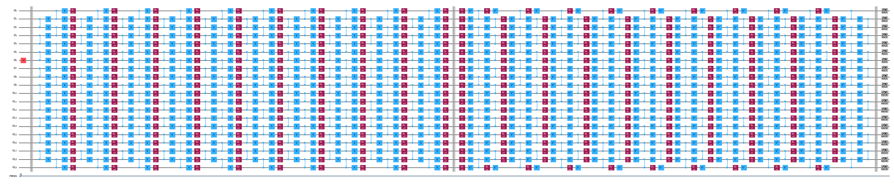
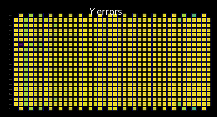
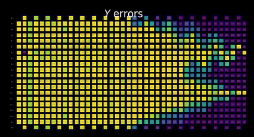
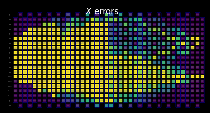

{/* doqumentation-source-hash: 3238351c */}

import TutorialFeedback from '@site/src/components/TutorialFeedback';

<OpenInLabBanner notebookPath="qiskit-addons/slc/01_getting_started.ipynb" />


##  Pozadí {#background}
Tento tutoriál ukazuje, jak zmírnit chyby pomocí doplňku Shaded lightcone (SLC). Tento doplněk je rozvojem [techniky pravděpodobnostního rušení chyb (PEC)](https://quantum.cloud.ibm.com/docs/guides/error-mitigation-and-suppression-techniques#probabilistic-error-cancellation-pec), při níž uživatel naučí šum jedinečných vrstev v Circuit a poté šum ruší pomocí jednoQubitových Gate a technik post-processingu. Ve srovnání s jinými metodami nabízí PEC robustnější hranice zkreslení zmírněného výsledku, ale obvykle trpí vyšší režijní zátěží z hlediska času QPU. Během PEC se pro kompenzaci útlumu střední hodnoty způsobeného šumem průměrný výsledek přeškáluje faktorem $\gamma = \exp(\sum_{l,\sigma} 2\lambda_{l,\sigma})$, kde $\lambda_{l,\sigma}$ je naučená míra šumu chybového Pauliho $\sigma$ ve vrstvě $l$ v Circuit. Toto přeškálování zvyšuje rozptyl faktorem $\gamma^2$, a tedy také násobí počet spuštění Circuit potřebných na QPU faktorem $\gamma^2$, což označujeme jako náklady na vzorkování nebo overhead vzorkování. Protože $\gamma$ roste exponenciálně, je PEC často omezeno na mělké nebo máloQubitové Circuit. Více o PEC se dozvíš v [Probabilistic error cancellation with sparse Pauli-Lindblad models on noisy quantum processors.](https://arxiv.org/abs/2201.09866)

Pokud dokážeme identifikovat chyby, které není třeba zmírňovat, můžeme tyto náklady na vzorkování exponenciálně snížit. Prvním krokem tímto směrem je implementace lokálně uvědomělého zmírňování chyb, které využívá rychle vypočitatelný konvenční „světelný kužel" ke snížení overheadu PEC tím, že ohraničuje citlivost pozorovatelné veličiny na chyby v celém Circuit, čímž rozšiřuje proveditelnost PEC na větší měřítka pro některé problémy. Chyby mimo tento světelný kužel nemohou ovlivnit měřený výsledek, a proto mohou být vyloučeny z procedury rušení chyb. Toto vyloučení snižuje overhead vzorkování — v některých případech výrazně — bez zavedení dalšího zkreslení. Konkrétně při měření lokální pozorovatelné $O$ v Circuit s pevnou hloubkou se požadovaný overhead vzorkování nakonec ustálí při škálování počtu Qubitů v Circuit (viz Obr. 2b v [Locality and Error Mitigation of Quantum Circuits.](https://arxiv.org/abs/2303.06496))

Stínované světelné kužely (SLC) jdou dále a využívají klasické simulace k těsnějšímu ohraničení citlivosti na chyby v celém Circuit. To vyměňuje část času QPU za čas CPU a snižuje overhead vzorkování potřebný k renormalizaci zkreslení. Místo tvrdého mezního bodu je každé potenciální chybě v Circuit přiřazen odstupňovaný „stín", který shora ohraničuje náchylnost pozorovatelné veličiny na danou chybu. Tato upřesněná charakterizace umožňuje efektivnější a cílenější aplikace PEC se sníženým rozptylem, přičemž dává uživateli možnost řízeně ladit zkreslení v odhadování pozorovatelné. Více podrobností najdeš v [Lightcone shading for classically accelerated quantum error mitigation](https://arxiv.org/abs/2409.04401).

Náš pracovní postup pro doplněk SLC využívá nový rámec Samplomatic a Executor, který uživatelům umožňuje mít modulárnější kontrolu nad nastavením provádění pro potlačení a zmírňování chyb při zachování snadného použití pro pokročilé uživatele. Pro hlubší pochopení výhod tohoto rámce a jeho obecných funkcí viz tutoriál [Hello samplomatic](https://github.com/qiskit-community/qdc-challenges-2025/blob/main/day3_tutorials/Track_A/hello_samplomatic/Samplomatic%20-%20Hello%20World.ipynb).

### Pracovní postup pro stínování světelných kuželů, učení šumu a injekci antišumu {#workflow-for-lightcone-shading-noise-learning-and-anti-noise-injection}
Pro modelování šumu QPU jsme se rozhodli použít řídký Pauliho-Lindbladův model šumu s 1- a 2-Qubitovými Pauliho mírami chyb, lokálně generovanými na každém Qubitu a hraně zařízení. S touto volbou je pracovní postup zmírňování chyb SLC prezentovaný v tomto tutoriálu následující:

a. CPU — Ohraničení dopadu každé chyby pro 1- a 2-Qubitové Pauliho chyby

  1. Dopředná propagace (ohraničení dopadu na pozorovatelnou). Propaguj každou chybu na konec Circuit a vypočítej její komutátor s pozorovatelnou.  
      - Během evoluce zkracuj termy operátoru, aby výpočet zůstal zvládnutelný.  
      - Tato ohraničení dále zpřesni volnou zpětnou propagací pozorovatelné na základě kvantových rychlostních limitů.
  2. Zpětná propagace (ohraničení dopadu na počáteční stav). Propaguj každou chybu na začátek Circuit a vypočítej její komutátor s počátečním stavem.

b. QPU — Učení měr šumu. Použij `NoiseLearner` k odhadnutí měr Pauliho-Lindbladova modelu šumu.

c. CPU — Prioritizace zmírňování

  1. Aktualizuj sloučená ohraničení naučenými mírami šumu. Zkombinuj dopředná a zpětná ohraničení, která byla dříve vypočítána, a aktualizuj je naučenými mírami šumu.  
  2. Seřaď komponenty šumu k zmírnění pomocí vypočítaných ohraničení a naučených měr. Prioritizuj každou možnou chybu šumu na základě jejího odhadovaného dopadu na zkreslení a s tím spojeného výdaje na opravu. 

d. QPU — Vlož antišum a spusť. Proveď Circuit zájmu s antišumem (inverzním šumem) specifikovaným pomocí anotací `Box`.

e. CPU — Odhad pozorovatelné. Vypočítej střední hodnotu a použij post-selekci založenou na měřeních ke snížení dopadu nemarkovského šumu.

### Přehled učení šumu {#noise-learning-overview}
Učení šumu je běžným krokem v několika metodách zmírňování chyb, prováděným pomocí [NoiseLearner](https://quantum.cloud.ibm.com/docs/en/guides/noise-learning), a lze ho vidět v našem tutoriálu [PEA error mitigation](https://quantum.cloud.ibm.com/docs/tutorials/probabilistic-error-amplification) i v našem [tutoriálu Propagated noise absorption (PNA)](https://github.com/qiskit-community/qdc-challenges-2025/blob/main/day3_tutorials/Track_A/pna/propagated_noise_absorption.ipynb). V `NoiseLearnerV3` může uživatel konkrétně identifikovat vrstvy šumu, které mají být naučeny, jako objekty [`CircuitInstruction`](https://quantum.cloud.ibm.com/docs/api/qiskit/qiskit.circuit.CircuitInstruction), což uživatelům umožňuje vypočítat požadované SLC hranice šumu pro každou vrstvu způsobem popsaným výše. Naučený Pauliho-Lindbladův model poskytuje koeficienty pro použití v prioritizaci PEC-SLC. Způsob, jakým jsou Gate shromažďovány do vrstev, lze určit pomocí pomocných funkcí `generate_boxing_pass_manager` a `unique_2q_instructions`, a poté předat do pomocné funkce SLC `generate_noise_model_paulis`, jak je popsáno v Kroku 2 níže.

| **Část 1** | **Část 2** | **Část 3** |
|-----------|-----------|-----------|
| Pauliho twirl vrstev dvouQubitových Gate | Opakování identických párů vrstev a učení šumu | Odvození věrnosti (chyba pro každý kanál šumu) |
|  |  |  |

### Přehled post-processingu {#post-processing-overview}
Po spuštění na kvantovém hardwaru pomocí rámce Samplomatic a Executor převedeme naše měření bitových řetězců na požadovanou hodnotu pozorovatelné. V případě našeho zrcadleného Isingova Circuit ideálně dostaneme měřenou pozorovatelnou hodnotu 1, protože všechny Qubity by se ideálně měly vrátit do svého počátečního bodu $\ket{0}$. Při výpočtu hodnoty pozorovatelné s naší funkcí `expectation_values` použijeme několik post-processingových technik, které snižují dopad šumu. Patří sem odstraňování měření ovlivněných nemarkovským šumem, zmírňování chyb čtení, jakož i zohledňování podrobností naší implementace PEC. Podrobnosti jsou diskutovány v Kroku 4 níže.
## Požadavky {#requirements}
Před zahájením tohoto tutoriálu se ujisti, že máš nainstalované následující balíčky:

- Qiskit IBM Runtime s primitivem Executor (`pip install "qiskit-ibm-runtime @ git+https://github.com/Qiskit/qiskit-ibm-runtime.git"`)
- Qiskit addon Shaded lightcone 0.1 (`pip install "qiskit-addon-slc~=0.1.0`")
- Qiskit addon utils (`pip install "qiskit-addon-utils~=0.3.0"`)
- Samplomatic v0.16 nebo novější (`pip install samplomatic`)
- Podpora vizualizace Qiskit (`pip install "qiskit[visualization]"`)
## Krok 0. Nastavení {#step-0-setup}
Nejprve importuj balíčky a funkce potřebné k úspěšnému spuštění tohoto notebooku.

```python
# Added by doQumentation — required packages for this notebook
!pip install -q matplotlib numpy qiskit qiskit-addon-slc qiskit-addon-utils qiskit-ibm-runtime samplomatic
```

```python
import logging

logging.basicConfig(level=logging.INFO, format="%(asctime)s %(levelname)s %(module)s %(message)s")

# Setting this value prevents itertools.starmap deadlock on UNIX systems
from multiprocessing import set_start_method

set_start_method("spawn")

# Needed to prevent PySCF from parallelizing internally (SLC only)
%set_env OMP_NUM_THREADS=1
```

```text
env: OMP_NUM_THREADS=1
```

```python
import pickle

import numpy as np
import samplomatic
from matplotlib import pyplot as plt
from qiskit import QuantumCircuit
from qiskit.quantum_info import SparsePauliOp
from qiskit.transpiler import PassManager, generate_preset_pass_manager
from qiskit_addon_slc.bounds import (
    compute_backward_bounds,
    compute_forward_bounds,
    compute_local_scales,
    merge_bounds,
    tighten_with_speed_limit,
)
from qiskit_addon_slc.utils import generate_noise_model_paulis, map_modifier_ref_to_ref
from qiskit_addon_slc.visualization import draw_shaded_lightcone
from qiskit_addon_utils.exp_vals.expectation_values import executor_expectation_values
from qiskit_addon_utils.exp_vals.measurement_bases import get_measurement_bases
from qiskit_addon_utils.noise_management import gamma_from_noisy_boxes, trex_factors
from qiskit_addon_utils.noise_management.post_selection import PostSelector
from qiskit_addon_utils.noise_management.post_selection.transpiler.passes import (
    AddPostSelectionMeasures,
    AddSpectatorMeasures,
)
from qiskit_ibm_runtime import Executor, QiskitRuntimeService, QuantumProgram
from qiskit_ibm_runtime.noise_learner_v3 import NoiseLearnerV3
from qiskit_ibm_runtime.options import NoiseLearnerV3Options
from samplomatic.transpiler import generate_boxing_pass_manager
from samplomatic.utils import find_unique_box_instructions
```
## Krok 1. Mapování problému {#step-1-map-the-problem}
Pro jednoduchost ukázky vybereme 1D zrcadlový Isingův řetězec. 1D Isingův řetězec poskytuje příjemně hustou strukturu Circuit, která je vhodná pro demonstraci implementací PEC. Zrcadlový Circuit zjednodušuje znalost očekávaného výsledku (měli bychom naměřit pozorovatelnou hodnotu 1).

Dále chceme spustit zrcadlový Circuit, takže pro každý Gate ve druhé polovině Circuit musí existovat inverzní Gate v první polovině. Protože měřená pozorovatelná **$<X_6 Z_{13}>$** má měření v ne-Z-bázi a exekutor zohledňuje požadovanou bázi na konci Circuit, poskytujeme funkci `prepare_basis`, která vkládá příslušné Gate na začátek zrcadlového Circuit. Tento detail je specifický pro naši demonstraci zrcadlového Circuit. Funkce `get_measurement_bases` nám umožňuje snadno identifikovat, které Gate jsou potřeba a kam je přidat, a také sledovat jemnosti indexování Qubit vyplývající z konvencí v anotaci `box`, jak je popsáno v části „Příprava kanonických bázových měření".

```python
num_qubits = 20
target_obs_sparse = [("XZ", [6, 13], 1.0)]
```

```python
observable = SparsePauliOp.from_sparse_list(target_obs_sparse, num_qubits=num_qubits)
```

```python
bases_virt, reverser_virt = get_measurement_bases(observable)
```

```python
num_trotter_steps = 10
rx_angle = np.pi / 4
```

```python
def construct_ising_circuit(
    num_qubits: int, num_trotter_steps: int, rx_angle: float, barrier: bool = True
) -> QuantumCircuit:
    circuit = QuantumCircuit(num_qubits)

    for _step in range(num_trotter_steps):
        circuit.rx(rx_angle, range(num_qubits))
        if barrier:
            circuit.barrier()
        for first_qubit in (1, 2):
            for idx in range(first_qubit, num_qubits, 2):
                # equivalent to Rzz(-pi/2):
                circuit.sdg([idx - 1, idx])
                circuit.cz(idx - 1, idx)
        if barrier:
            circuit.barrier()

    return circuit

def prepare_basis(circuit: QuantumCircuit, basis: list[int]) -> QuantumCircuit:
    # basis is a list of integer values from 0 to 3. These map to the basis measurement as:
    # 0 = I; 1 = Z; 2 = X; 3 = Y
    assert len(basis) == circuit.num_qubits

    out_circ = circuit.copy_empty_like()
    for qb, bas in enumerate(basis):
        if bas in {0, 1}:
            continue
        if bas == 2:
            out_circ.h(qb)
        elif bas == 3:
            out_circ.rx(-np.pi / 2, qb)

    out_circ.barrier()
    out_circ.compose(circuit, inplace=True)
    return out_circ

def mirror_circuit(circuit: QuantumCircuit, *, inverse_first: bool = False) -> QuantumCircuit:
    mirror_circ = circuit.copy_empty_like()
    mirror_circ.compose(circuit.inverse() if inverse_first else circuit, inplace=True)
    mirror_circ.barrier()
    mirror_circ.compose(circuit if inverse_first else circuit.inverse(), inplace=True)
    mirror_circ.measure_active()
    return mirror_circ
```

```python
# Instantiate circuit
circuit = construct_ising_circuit(num_qubits, num_trotter_steps, rx_angle, barrier=False)
mirrored_circuit = mirror_circuit(circuit, inverse_first=True)
mirrored_circuit = prepare_basis(mirrored_circuit, bases_virt[0])
```

```python
mirrored_circuit.draw("mpl", fold=-1, scale=0.3, idle_wires=False, measure_arrows=False)
```


## Krok 2. Optimalizace {#step-2-optimize}
Optimalizujeme podrobnosti spojené s Circuit, který chceme spustit, s observable, jež chceme měřit, a s parametry učení šumu. Jako výchozí bod zajistíme, aby byl Backend instanciován s povolenou volbou frakčních Gate. Tyto frakční Gate umožní větší citlivost při některých filtrováních po-selekci.

```python
token = "<YOUR_TOKEN>"
instance = "<YOUR_INSTANCE>"

# This is used to retrieve shared results
shared_service = QiskitRuntimeService(
    channel="ibm_quantum_platform",
    token=token,
    instance=instance,
)

# This is used to run on real hardware
service = service = QiskitRuntimeService()
```

```text
qiskit_runtime_service._discover_account:WARNING:2025-11-10 11:19:40,108: Loading account with the given token. A saved account will not be used.
```

```python
backend = service.backend("ibm_kingston", use_fractional_gates=True)
```

Nejprve transpilujeme náš Circuit do ISA instrukcí, [jak je vyžadováno pro spuštění na našich QPU](https://www.ibm.com/quantum/blog/isa-circuits). Pro data shromážděná v tomto experimentu ručně vybereme Qubit na základě vyhodnocení řetězce nejvyšší kvality.

```python
layout = [44, 45, 46, 47, 57, 67, 68, 69, 78, 89, 88, 87, 97, 107, 106, 105, 104, 103, 96, 83]
```

```python
isa_pm = generate_preset_pass_manager(backend=backend, initial_layout=layout, optimization_level=0)

isa_circuit = isa_pm.run(mirrored_circuit)
assert isa_circuit.layout.final_index_layout() == layout

isa_observable = observable.apply_layout(layout, num_qubits=isa_circuit.num_qubits)
```

```text
2025-11-10 11:19:57,810 INFO base_tasks Pass: ContainsInstruction - 0.00715 (ms)
2025-11-10 11:19:57,811 INFO base_tasks Pass: UnitarySynthesis - 0.00525 (ms)
2025-11-10 11:19:57,811 INFO base_tasks Pass: HighLevelSynthesis - 0.02599 (ms)
2025-11-10 11:19:57,811 INFO base_tasks Pass: BasisTranslator - 0.09131 (ms)
2025-11-10 11:19:57,811 INFO base_tasks Pass: SetLayout - 0.02623 (ms)
2025-11-10 11:19:57,812 INFO base_tasks Pass: FullAncillaAllocation - 0.14400 (ms)
2025-11-10 11:19:57,812 INFO base_tasks Pass: EnlargeWithAncilla - 0.06318 (ms)
2025-11-10 11:19:57,813 INFO base_tasks Pass: ApplyLayout - 0.29802 (ms)
2025-11-10 11:19:57,813 INFO base_tasks Pass: CheckMap - 0.07820 (ms)
2025-11-10 11:19:57,814 INFO base_tasks Pass: FilterOpNodes - 0.33283 (ms)
2025-11-10 11:19:57,814 INFO base_tasks Pass: UnitarySynthesis - 0.00691 (ms)
2025-11-10 11:19:57,814 INFO base_tasks Pass: HighLevelSynthesis - 0.13208 (ms)
2025-11-10 11:19:57,816 INFO base_tasks Pass: BasisTranslator - 1.00303 (ms)
2025-11-10 11:19:57,818 INFO base_tasks Pass: FoldRzzAngle - 1.78719 (ms)
2025-11-10 11:19:57,818 INFO base_tasks Pass: ContainsInstruction - 0.00691 (ms)
2025-11-10 11:19:57,818 INFO base_tasks Pass: InstructionDurationCheck - 0.00405 (ms)
```

```python
wire_order = layout + [q for q in range(isa_circuit.num_qubits) if q not in layout]
isa_circuit.draw(
    "mpl", fold=-1, scale=0.3, idle_wires=False, wire_order=wire_order, measure_arrows=False
)
```


### Zabalení Circuit do boxů {#box-the-circuit}
Pro snadnou implementaci využijeme transpilační pass `generate_boxing_pass_manager`, který umístí instrukce Circuit do anotovaných boxů. Tyto boxy jasně označují místa, kde má být v případě PEC do Circuit vložen antišum. Podrobnosti o nastavení najdeš v [dokumentaci Samplomatic.](https://qiskit.github.io/samplomatic/)

Poznámka: SLC workflow vyžaduje použití `inject_noise_strategy="individual_modification"` v dalším kroku procesu, protože to umožňuje jednoznačně identifikovat každý `BoxOp` v Circuit.

Funkce `find_unique_box_instructions` prochází poskytnutý boxovaný Circuit a identifikuje ty, které mají jedinečné 2Q vrstvy nebo měření, za účelem noise learningu a noise injekce.

```python
# Box circuit with Twirl and InjectNoise annotations
boxes_pm = generate_boxing_pass_manager(
    twirling_strategy="active",
    inject_noise_strategy="individual_modification",
    inject_noise_targets="gates",
    measure_annotations="all",
)

boxed_circuit = boxes_pm.run(isa_circuit)

# Find the unique instructions (layers) from boxed circuit
unique_2q_instructions = find_unique_box_instructions(
    boxed_circuit, normalize_annotations=None, undress_boxes=True
)
```

```text
2025-11-10 11:20:01,088 INFO base_tasks Pass: RemoveBarriers - 0.02289 (ms)
2025-11-10 11:20:01,100 INFO base_tasks Pass: GroupGatesIntoBoxes - 12.38990 (ms)
2025-11-10 11:20:01,101 INFO base_tasks Pass: GroupMeasIntoBoxes - 0.47898 (ms)
2025-11-10 11:20:01,104 INFO base_tasks Pass: AddTerminalRightDressedBoxes - 2.88177 (ms)
2025-11-10 11:20:01,111 INFO base_tasks Pass: AddInjectNoise - 6.66904 (ms)
```

```python
boxed_circuit.draw(
    "mpl", fold=-1, scale=0.3, idle_wires=False, wire_order=wire_order, measure_arrows=False
)
```


### Příprava měření kanonických bází {#prepare-canonical-bases-measurements}
Kvůli způsobu, jakým jsou Qubit označovány při identifikaci jedinečných 2Q vrstev, je třeba věnovat zvláštní pozornost sledování pořadí Qubit. Níže zavádíme pojem `canonical_qubits` jako prostředek pro správnou aktualizaci pořadí Qubit při předávání executoru, a to v důsledku toho, jak je pořadí Qubit zachyceno při boxování Circuit a hledání jedinečných instrukcí. Podrobnosti najdeš v dokumentaci [Qubit ordering convention](https://qiskit.github.io/samplomatic/guides/samplex_io.html#qubit-ordering-convention).

```python
# Determine the canonical qubits order
meas_box = boxed_circuit.data[-1]
canonical_qubits = [
    idx for idx, qubit in enumerate(boxed_circuit.qubits) if qubit in meas_box.qubits
]

# map canonical qubit to physical (isa) qubit
c_2_p = {c: p for c, p in enumerate(canonical_qubits)}
# map physical (isa) qubit to virtual qubit (index in original circuit)
p_2_v = {p: v for v, p in enumerate(layout)}
# compute map between virtual and canonical qubit indices.
c_2_v = {c: p_2_v[p] for c, p in c_2_p.items()}

assert len(c_2_v) == num_qubits

bases_canon = [
    np.array([base_i[c_2_v[c]] for c in range(num_qubits)], dtype=np.uint8) for base_i in bases_virt
]
```
### Pracovní postup pro stínování světelného kužele, učení šumu a injekci anti-šumu {#workflow-for-lightcone-shading-noise-learning-and-anti-noise-injection-step2}

> **Poznámka**: Pro implementaci SLC-PEC v tomto tutoriálu spouštíme výpočty SLC hranic **před** dokončením učení šumu, aby byl obsluhovaný Circuit spuštěn co nejblíže v čase naučenému modelu šumu. V principu lze tento pracovní postup dále vylepšit tak, aby se prováděl souběžně. Konkrétně lze spustit úlohu učení šumu paralelně s odhadem hranic šumu. Pro libovolný kvantový Circuit může výpočet hranic šumu škálovat se slabě exponenciální závislostí. Proto může být vhodné využít paralelizované spouštění při snaze maximalizovat efektivitu pracovního postupu. Za tímto účelem to krátce demonstrujeme zahrnutím clusterových prostředků (128 vláken) a ukazujeme, jak při stejném časovém limitu výpočtu dosáhnout přesnější sady hranic pro zadaný Circuit ve srovnání s laptopem (8 vláken). Dále, ačkoli to v tomto pracovním postupu není implementováno, můžeš paralelizovat spouštění QPU pro učení šumu a výpočty hranic šumu, abys dosáhl/a nejefektivnějšího pracovního postupu.

#### Předpověď Pauliho termů modelu šumu k naučení {#predict-to-be-learned-noise-model-paulis}

Funkce `generate_noise_model_paulis` prochází každou ohraničenou vrstvou zadaného Circuitu a generuje všechny relevantní Pauliho termy váhy jedna a váhy dva, přičemž zohledňuje konektivitu Qubitů v Circuitu a vybírá termy relevantní pro aktivní uzly a hrany. Tyto termy se pak používají k výpočtu dopředných a zpětných hranic šumu.

```python
noise_model_paulis = generate_noise_model_paulis(
    unique_2q_instructions, backend.coupling_map, boxed_circuit
)
```

```python
noise_model_rates = {ref: None for ref in noise_model_paulis}
```

##### a. Výpočet a zpřesnění dopředných hranic {#a-compute-and-tighten-forward-bounds}

Funkce `compute_forward_bounds` vyhodnocuje komutační vztahy mezi Gates v každé vrstvě a výše vygenerovanými Pauliho termy z hlediska toho, jak chyby šířené dopředu ovlivňují požadovanou observablu $A$. Pro Gates, které komutují s Pauliho termy, se nic neprovádí. Cliffordovy Gates jsou posouvány k začátku Circuitu. Pro non-Cliffordovy Gates aproximujeme jejich vliv na cílové observably, aby byly později upřednostněny při rušení šumu (poté, co jsou všechny hranice sloučeny). Tato hranice je dosažena nejprve aplikací normy L2 (konkrétně odmocniny součtu čtverců koeficientů příslušných Pauliho termů). Pokud je zapojeno příliš mnoho Qubitových termů, přejdeme na volnější hranici využívající trojúhelníkovou nerovnost.

#### Prostředky na úrovni laptopu {#laptop-level-resources}

```python
slc_atol = 1e-8
slc_eigval_max_qubits = 18
slc_evolution_max_terms = 1000
slc_num_processes = 8
slc_timeout = 60
```

```python
forward_bounds = compute_forward_bounds(
    boxed_circuit,
    noise_model_paulis,
    isa_observable,
    evolution_max_terms=slc_evolution_max_terms,
    eigval_max_qubits=slc_eigval_max_qubits,
    atol=slc_atol,
    num_processes=slc_num_processes,
    timeout=slc_timeout,
)
```

```text
2025-11-10 11:20:04,344 INFO forward Evolving Pauli error terms forwards through the circuit.
2025-11-10 11:20:04,344 INFO forward Modelling errors as though they happen *after* each noise layer.
2025-11-10 11:20:04,345 INFO remove_measure Removing ANY Measure operations from the provided circuit!
2025-11-10 11:20:04,453 INFO circuit_iter Noisy box 'm39'
2025-11-10 11:20:05,254 INFO circuit_iter Noisy box 'm38'
2025-11-10 11:20:05,304 INFO circuit_iter Noisy box 'm37'
2025-11-10 11:20:05,382 INFO circuit_iter Noisy box 'm36'
2025-11-10 11:20:05,467 INFO circuit_iter Noisy box 'm35'
2025-11-10 11:20:05,580 INFO circuit_iter Noisy box 'm34'
2025-11-10 11:20:05,705 INFO circuit_iter Noisy box 'm33'
2025-11-10 11:20:05,857 INFO circuit_iter Noisy box 'm32'
2025-11-10 11:20:06,034 INFO circuit_iter Noisy box 'm31'
2025-11-10 11:20:06,221 INFO circuit_iter Noisy box 'm30'
2025-11-10 11:20:06,449 INFO circuit_iter Noisy box 'm29'
2025-11-10 11:20:06,724 INFO circuit_iter Noisy box 'm28'
2025-11-10 11:20:07,628 INFO circuit_iter Noisy box 'm27'
2025-11-10 11:20:09,110 INFO circuit_iter Noisy box 'm26'
2025-11-10 11:20:11,696 INFO circuit_iter Noisy box 'm25'
2025-11-10 11:20:16,100 INFO circuit_iter Noisy box 'm24'
2025-11-10 11:20:21,781 INFO circuit_iter Noisy box 'm23'
2025-11-10 11:20:30,244 INFO circuit_iter Noisy box 'm22'
2025-11-10 11:20:40,416 INFO circuit_iter Noisy box 'm21'
2025-11-10 11:20:53,437 INFO circuit_iter Noisy box 'm20'
2025-11-10 11:21:06,038 INFO circuit_iter Noisy box 'm19'
2025-11-10 11:21:06,038 WARNING commutator_bounds Bounds computation timed out.
2025-11-10 11:21:06,039 INFO circuit_iter Noisy box 'm18'
2025-11-10 11:21:06,039 INFO circuit_iter Noisy box 'm17'
2025-11-10 11:21:06,039 INFO circuit_iter Noisy box 'm16'
2025-11-10 11:21:06,040 INFO circuit_iter Noisy box 'm15'
2025-11-10 11:21:06,040 INFO circuit_iter Noisy box 'm14'
2025-11-10 11:21:06,040 INFO circuit_iter Noisy box 'm13'
2025-11-10 11:21:06,040 INFO circuit_iter Noisy box 'm12'
2025-11-10 11:21:06,041 INFO circuit_iter Noisy box 'm11'
2025-11-10 11:21:06,041 INFO circuit_iter Noisy box 'm10'
2025-11-10 11:21:06,041 INFO circuit_iter Noisy box 'm9'
2025-11-10 11:21:06,042 INFO circuit_iter Noisy box 'm8'
2025-11-10 11:21:06,042 INFO circuit_iter Noisy box 'm7'
2025-11-10 11:21:06,042 INFO circuit_iter Noisy box 'm6'
2025-11-10 11:21:06,042 INFO circuit_iter Noisy box 'm5'
2025-11-10 11:21:06,043 INFO circuit_iter Noisy box 'm4'
2025-11-10 11:21:06,043 INFO circuit_iter Noisy box 'm3'
2025-11-10 11:21:06,043 INFO circuit_iter Noisy box 'm2'
2025-11-10 11:21:06,043 INFO circuit_iter Noisy box 'm1'
2025-11-10 11:21:06,044 INFO circuit_iter Noisy box 'm0'
```
#### Vizualizace SLC pro ruční kontrolu {#visualize-the-slc-for-manual-inspection-1}

Chování stínovaných hranic můžeš interpretovat tak, že zkoumáš, jak měření a Pauliho termy interagují s lokálními chybami. Tyto vzory jsou charakteristické pro tento problém časového vývoje kicked Ising Hamiltoniánu a objevují se také v článku [Lightcone Shading for Classically Accelerated Quantum Error Mitigation](https://arxiv.org/abs/2409.04401), přičemž mají několik charakteristických rysů:

- Jasně rozlišíme dva kužely vznikající ze dvou non-identity Pauliho operátorů v observablu.
- Vidíme, že měření X na Qubitu 6 komutuje s chybou X v nejpravější vrstvě.
- Vidíme, že Pauliho Z na Qubitu 13 komutuje s chybou Z v nejpravější vrstvě.
- Jakmile dosáhneme výše zadaného timeoutu, zbývající vrstvy vlevo jsou zcela vyplněny triviálními hranicemi s hodnotou dvě.

```python
for p in "XYZ":
    display(
        draw_shaded_lightcone(
            boxed_circuit,
            forward_bounds,
            noise_model_paulis,
            pauli_filter=p,
            scale=0.15,
            fold=-1,
            idle_wires=False,
            wire_order=wire_order,
            measure_arrows=False,
        )
    )
```


#### b. Vypočítání a zpřesnění dopředných mezí {#b-compute-and-tighten-forward-bounds}
Dále zpřesníme meze pomocí funkce `tighten_with_speed_limit`, která sleduje, jak se pozorovatelná veličina šíří zpětně skrz obvod, a toto šíření využívá ke stanovení horních mezí vlivu každého operátoru šumu. Výsledná mez je vždy ta menší z právě vypočítané dopředné meze a meze získané zpětnou propagací.

```python
forward_bounds_tighter = tighten_with_speed_limit(
    forward_bounds, boxed_circuit, noise_model_paulis, isa_observable
)
```

```text
2025-11-10 11:21:08,270 INFO speed_limit Tighting bounds using information propagation speed limits
2025-11-10 11:21:08,270 INFO speed_limit Modelling errors as though they happen *after* each noise layer.
2025-11-10 11:21:08,298 INFO remove_measure Removing ANY Measure operations from the provided circuit!
2025-11-10 11:21:08,310 INFO circuit_iter Noisy box 'm39'
2025-11-10 11:21:08,314 INFO circuit_iter Noisy box 'm38'
2025-11-10 11:21:08,317 INFO circuit_iter Noisy box 'm37'
2025-11-10 11:21:08,319 INFO circuit_iter Noisy box 'm36'
2025-11-10 11:21:08,323 INFO circuit_iter Noisy box 'm35'
2025-11-10 11:21:08,325 INFO circuit_iter Noisy box 'm34'
2025-11-10 11:21:08,328 INFO circuit_iter Noisy box 'm33'
2025-11-10 11:21:08,330 INFO circuit_iter Noisy box 'm32'
2025-11-10 11:21:08,334 INFO circuit_iter Noisy box 'm31'
2025-11-10 11:21:08,336 INFO circuit_iter Noisy box 'm30'
2025-11-10 11:21:08,338 INFO circuit_iter Noisy box 'm29'
2025-11-10 11:21:08,340 INFO circuit_iter Noisy box 'm28'
2025-11-10 11:21:08,344 INFO circuit_iter Noisy box 'm27'
2025-11-10 11:21:08,346 INFO circuit_iter Noisy box 'm26'
2025-11-10 11:21:08,349 INFO circuit_iter Noisy box 'm25'
2025-11-10 11:21:08,351 INFO circuit_iter Noisy box 'm24'
2025-11-10 11:21:08,355 INFO circuit_iter Noisy box 'm23'
2025-11-10 11:21:08,357 INFO circuit_iter Noisy box 'm22'
2025-11-10 11:21:08,360 INFO circuit_iter Noisy box 'm21'
2025-11-10 11:21:08,362 INFO circuit_iter Noisy box 'm20'
2025-11-10 11:21:08,367 INFO circuit_iter Noisy box 'm19'
2025-11-10 11:21:08,369 INFO circuit_iter Noisy box 'm18'
2025-11-10 11:21:08,372 INFO circuit_iter Noisy box 'm17'
2025-11-10 11:21:08,375 INFO circuit_iter Noisy box 'm16'
2025-11-10 11:21:08,378 INFO circuit_iter Noisy box 'm15'
2025-11-10 11:21:08,380 INFO circuit_iter Noisy box 'm14'
2025-11-10 11:21:08,383 INFO circuit_iter Noisy box 'm13'
2025-11-10 11:21:08,386 INFO circuit_iter Noisy box 'm12'
2025-11-10 11:21:08,389 INFO circuit_iter Noisy box 'm11'
2025-11-10 11:21:08,391 INFO circuit_iter Noisy box 'm10'
2025-11-10 11:21:08,394 INFO circuit_iter Noisy box 'm9'
2025-11-10 11:21:08,396 INFO circuit_iter Noisy box 'm8'
2025-11-10 11:21:08,399 INFO circuit_iter Noisy box 'm7'
2025-11-10 11:21:08,401 INFO circuit_iter Noisy box 'm6'
2025-11-10 11:21:08,404 INFO circuit_iter Noisy box 'm5'
2025-11-10 11:21:08,406 INFO circuit_iter Noisy box 'm4'
2025-11-10 11:21:08,410 INFO circuit_iter Noisy box 'm3'
2025-11-10 11:21:08,412 INFO circuit_iter Noisy box 'm2'
2025-11-10 11:21:08,415 INFO circuit_iter Noisy box 'm1'
2025-11-10 11:21:08,417 INFO circuit_iter Noisy box 'm0'
```

#### Vizualizace SLC pro ruční kontrolu {#visualize-the-slc-for-manual-inspection-2}

Meze lze dále zpřesnit zohledněním omezení světelného kužele. Tím v zásadě dosáhneme plynulejšího přechodu mezi vypočítanými mezemi a triviálními mezemi stanovenými po vypršení časového limitu. Zde tento efekt není příliš patrný, protože světelné kužele již dosáhly okraje obvodu.

```python
for p in "XYZ":
    display(
        draw_shaded_lightcone(
            boxed_circuit,
            forward_bounds_tighter,
            noise_model_paulis,
            pauli_filter=p,
            scale=0.15,
            fold=-1,
            idle_wires=False,
            wire_order=wire_order,
            measure_arrows=False,
        )
    )
```


#### c. Výpočet zpětných mezí {#c-compute-backward-bounds}

Tato část predikce šumu vyhodnocuje, jak může chyba v určité vrstvě ovlivnit vstupní stav $\rho$. Funkce `compute_backward_bounds` nejprve invertuje Circuit, odstraní měřicí Gate a poté provede podobnou analýzu, jaká byla provedena při výpočtech dopředných mezí.

```python
backward_bounds = compute_backward_bounds(
    boxed_circuit,
    noise_model_paulis,
    evolution_max_terms=slc_evolution_max_terms,
    num_processes=slc_num_processes,
    timeout=slc_timeout,
)
```

```text
2025-11-10 11:21:10,666 INFO backward Evolving Pauli error terms backwards through the circuit.
2025-11-10 11:21:10,666 INFO backward Modelling errors as though they happen *after* each noise layer.
2025-11-10 11:21:10,667 INFO remove_measure Removing ANY Measure operations from the provided circuit!
2025-11-10 11:21:10,774 INFO circuit_iter Noisy box 'm0'
2025-11-10 11:21:11,640 INFO circuit_iter Noisy box 'm1'
2025-11-10 11:21:11,681 INFO circuit_iter Noisy box 'm2'
2025-11-10 11:21:11,867 INFO circuit_iter Noisy box 'm3'
2025-11-10 11:21:12,078 INFO circuit_iter Noisy box 'm4'
2025-11-10 11:21:12,329 INFO circuit_iter Noisy box 'm5'
2025-11-10 11:21:12,637 INFO circuit_iter Noisy box 'm6'
2025-11-10 11:21:13,110 INFO circuit_iter Noisy box 'm7'
2025-11-10 11:21:13,705 INFO circuit_iter Noisy box 'm8'
2025-11-10 11:21:14,384 INFO circuit_iter Noisy box 'm9'
2025-11-10 11:21:15,213 INFO circuit_iter Noisy box 'm10'
2025-11-10 11:21:15,946 INFO circuit_iter Noisy box 'm11'
2025-11-10 11:21:16,754 INFO circuit_iter Noisy box 'm12'
2025-11-10 11:21:17,557 INFO circuit_iter Noisy box 'm13'
2025-11-10 11:21:18,447 INFO circuit_iter Noisy box 'm14'
2025-11-10 11:21:19,453 INFO circuit_iter Noisy box 'm15'
2025-11-10 11:21:20,472 INFO circuit_iter Noisy box 'm16'
2025-11-10 11:21:21,479 INFO circuit_iter Noisy box 'm17'
2025-11-10 11:21:22,660 INFO circuit_iter Noisy box 'm18'
2025-11-10 11:21:23,705 INFO circuit_iter Noisy box 'm19'
2025-11-10 11:21:24,849 INFO circuit_iter Noisy box 'm20'
2025-11-10 11:21:26,030 INFO circuit_iter Noisy box 'm21'
2025-11-10 11:21:27,111 INFO circuit_iter Noisy box 'm22'
2025-11-10 11:21:28,354 INFO circuit_iter Noisy box 'm23'
2025-11-10 11:21:29,554 INFO circuit_iter Noisy box 'm24'
2025-11-10 11:21:30,897 INFO circuit_iter Noisy box 'm25'
2025-11-10 11:21:32,113 INFO circuit_iter Noisy box 'm26'
2025-11-10 11:21:33,622 INFO circuit_iter Noisy box 'm27'
2025-11-10 11:21:34,962 INFO circuit_iter Noisy box 'm28'
2025-11-10 11:21:36,504 INFO circuit_iter Noisy box 'm29'
2025-11-10 11:21:38,021 INFO circuit_iter Noisy box 'm30'
2025-11-10 11:21:39,750 INFO circuit_iter Noisy box 'm31'
2025-11-10 11:21:41,237 INFO circuit_iter Noisy box 'm32'
2025-11-10 11:21:42,974 INFO circuit_iter Noisy box 'm33'
2025-11-10 11:21:44,527 INFO circuit_iter Noisy box 'm34'
2025-11-10 11:21:46,535 INFO circuit_iter Noisy box 'm35'
2025-11-10 11:21:48,152 INFO circuit_iter Noisy box 'm36'
2025-11-10 11:21:50,074 INFO circuit_iter Noisy box 'm37'
2025-11-10 11:21:51,814 INFO circuit_iter Noisy box 'm38'
2025-11-10 11:21:53,943 INFO circuit_iter Noisy box 'm39'
```

#### Vizualizace SLC pro ruční kontrolu {#visualize-the-slc-for-manual-inspection-3}

Z výpočtu zpětných mezí lze vidět, jak struktura počátečního stavu řídí rané chování šíření chyb:

- Jasně vidíme, jak se Z chyby zpočátku komutují s počátečním stavem |0⟩.
- Pouze na Qubitu 6, kde inicializujeme vlastní stav +1 báze X, se Z chyba nekomutuje, zatímco X chyba se komutuje.

```python
for p in "XYZ":
    display(
        draw_shaded_lightcone(
            boxed_circuit,
            backward_bounds,
            noise_model_paulis,
            pauli_filter=p,
            scale=0.15,
            fold=-1,
            idle_wires=False,
            wire_order=wire_order,
            measure_arrows=False,
        )
    )
```





#### Náhled sloučených mezí bez naučených rychlostí šumu {#preview-merged-bounds-without-learned-noise-rates}

Funkce `merged_bounds` určuje bod v Circuit, kde přepnutí ze zpětných mezí na dopředné meze minimalizuje celkovou odhadovanou odchylku na požadované observabili. Tato odchylka se počítá jako součet příspěvků zpětných mezí pro všechna šumová místa před tímto bodem a příspěvků dopředných mezí pro všechna šumová místa za ním. V současné době se to provádí jednotně pro všechny Qubity.

> **Důležitá poznámka**: Bod přepnutí z dopředných na zpětné meze závisí na naučených rychlostech šumu.

```python
merged_bounds = merge_bounds(
    boxed_circuit,
    forward_bounds_tighter,
    backward_bounds,
    noise_model_rates,
)
```

```text
2025-11-10 11:21:58,304 WARNING merge Missing noise rates. Partitioning backward/forward commutator bounds by assuming uniform error rates.
2025-11-10 11:21:58,305 WARNING merge Optimal spacetime partitioning not implemented!Just partitioning list of noisy boxes.
2025-11-10 11:21:58,305 INFO merge Determined Box idx for partitioning to be 20.
```
### Vizualizace SLC pro ruční inspekci {#visualize-the-slc-for-manual-inspection}

Po sloučení zpětných a zpřísněných dopředných hranic se chování kombinovaných SLC stane zřejmým:

- Výše uvedená funkce nám říká, že je zvolena hranice, na které dochází k přechodu od zpětných ke zpřísněným dopředným hranicím.
- Níže můžeme vidět, že SLC nyní obsahují částečné zpětné a částečné zpřísněné dopředné hranice.

```python
for p in "XYZ":
    display(
        draw_shaded_lightcone(
            boxed_circuit,
            merged_bounds,
            noise_model_paulis,
            pauli_filter=p,
            scale=0.15,
            fold=-1,
            idle_wires=False,
            wire_order=wire_order,
            measure_arrows=False,
        )
    )
```





#### Prostředky na úrovni clusteru {#cluster-level-resources}
Zde ukazujeme, jak využití 128 vláken na clusteru umožňuje projít podstatně větší část tohoto rozsáhlejšího obvodu při stejném výpočetním čase, jaký máme k dispozici na laptopu.

```python
with open("exp_data/merged_bounds_cluster.pickle", "rb") as file:
    merged_bounds_cluster = pickle.load(file)
```

```python
for p in "XYZ":
    display(
        draw_shaded_lightcone(
            boxed_circuit,
            merged_bounds_cluster,
            noise_model_paulis,
            pauli_filter=p,
            scale=0.15,
            fold=-1,
            idle_wires=False,
            wire_order=wire_order,
            measure_arrows=False,
        )
    )
```




## Krok 3. Spuštění {#step-3-execute}
V této části začínáme tu část pracovního postupu, která využívá skutečné kvantové zařízení. U této metody zmírnění chyb založené na učení existují dva kroky: 

1. Naučit se šum pomocí `NoiseLeanerV3`.
2. Spustit obvod pro zmírnění chyb s novým frameworkem Samplomatic a Estimator. 

S ohraničenými chybami z našeho kvantového Circuit musíme zjistit přidružené míry šumu, abychom mohli upřednostnit náš chybový rozpočet, určit vzorkovací režii a spustit výpočet na QPU. Kromě toho nám tyto informace o mírách šumu umožňují ukázat, jak díky využití výkonných výpočetních prostředků z našeho clusteru snižujeme vzorkovací režii při zachování stejné reziduální zaujatosti.
### a. Zjištění měr šumu {#a-learn-noise-rates}

Learner šumu umožňuje charakterizovat šumové procesy ovlivňující Gate v jednom nebo více Circuit, na základě Pauliho-Lindbladova šumového modelu popsaného v článku [Probabilistic error cancellation with sparse Pauli-Lindblad models on noisy quantum processors](https://arxiv.org/abs/2201.09866). Metoda `run()` spouští úlohu učení šumu pro poskytnuté jedinečné dvouQubitové vrstvy, na základě možností zadaných v konfiguraci learneru šumu. V těchto možnostech můžeš upravit strategii Pauliho twirling, která pomáhá zajistit, aby byl hardware dobře popsán Pauliho-Lindbladovým šumovým modelem.

Detaily tvého šumového modelu jsou náchylné k časovému posunu. Proto nastavujeme parametr, který zajistí přepočítání naučeného šumového modelu pro experimenty starší čtyř hodin. Jde o hrubé pravidlo a měl bys ho pečlivě zvážit při aplikaci na vlastní práci.

```python
post_selection_enabled = True
load_cached_noise_results = True
```

```python
noise_learner_options = NoiseLearnerV3Options(
    num_randomizations=64,
    shots_per_randomization=128,
    layer_pair_depths=[1, 2, 4, 8, 12, 16, 24, 32, 40, 48],
    post_selection={
        "enable": post_selection_enabled,
        "strategy": "edge",
        "x_pulse_type": "rx",
    },
)

noise_learner = NoiseLearnerV3(backend, noise_learner_options)
```

```python
if load_cached_noise_results:
    noise_learner_job = shared_service.job("d46ssf71gh7s7398k9a0")
else:
    noise_learner_job = noise_learner.run(unique_2q_instructions)
```

```python
noise_learner_result = noise_learner_job.result()
```

```python
if post_selection_enabled:
    print("Minimum fraction of shots kept for noise learning experiments: ", end="")
    print(
        f"{min([min(d.values()) for d in [nlr.metadata['post_selection']['fraction_kept'] for nlr in noise_learner_result[:2]]]):.2f}"
    )
```

```text
Minimum fraction of shots kept for noise learning experiments: 0.58
```

```python
# Get a dict mapping InjectNoise.ref to QubitSparsePaulilist
refs_2_plm = noise_learner_result.to_dict(unique_2q_instructions, require_refs=False)
```
### b.i. Aktualizace sloučených hranic se skutečně naučenými mírami šumu {#b-i-update-merged-bounds-with-actual-learned-noise-rates}

Nyní, když byl naučen konkrétní šumový model, můžeme na předpovězené hranice šumu aplikovat naučené míry šumu a získat konečné určení toho, které hranice mají největší vliv na minimalizaci zkreslení.

```python
merged_bounds = merge_bounds(
    boxed_circuit,
    forward_bounds_tighter,
    backward_bounds,
    refs_2_plm,
)
```

```text
2025-11-10 11:22:03,755 WARNING merge Optimal spacetime partitioning not implemented!Just partitioning list of noisy boxes.
2025-11-10 11:22:03,756 INFO merge Determined Box idx for partitioning to be 20.
```

#### b.ii. Výpočet `local_scales` pro hardwarové spuštění {#b-ii-compute-the-local-scales-for-the-hardware-execution}

`compute_local_scales` se podívá na každou možnou chybu šumu v Circuit a odhadne, nakolik by tato chyba mohla zkreslovat výsledné měření, a také jak nákladná by byla její oprava. Chyby pak seřadí podle toho, jak výhodné je je zmírnit, a vybere podmnožinu, která co nejvíce snižuje zkreslení, přičemž nepřekračuje povolený rozpočet na vzorkovací náklady (nebo dosahuje požadované přesnosti). Výsledkem je sada škálovacích faktorů označujících, které chyby budou aktivně zmírňovány a které zůstanou nezmírněny (`local_scales`), spolu s předpokládanými celkovými náklady na vzorkování (`sampling_costs`) a zbývajícím zkreslením (`residual_bias_bound`).

Schopnost řídit požadované zbývající zkreslení je klíčovou vlastností implementace PEC v SLC. Zatímco v [původní implementaci](https://arxiv.org/abs/2201.09866) vždy vzorkovací overhead cílil na nulové zkreslení, zde můžeme požadovaný vzorkovací overhead ladit s kompromisem v očekávaném zbývajícím zkreslení. To pomáhá udržet se v rámci pevného vzorkovacího rozpočtu, což může být obzvlášť užitečné při počátečním prototypování workflow.

```python
id_map = map_modifier_ref_to_ref(boxed_circuit)
```

```python
summed_rates = 0.0
for _box_id, noise_id in id_map.items():
    learned_plm = refs_2_plm[noise_id]
    summed_rates += np.sum(learned_plm.rates)
    # print(f"{_box_id}:\tgamma = {np.exp(2 * summed_rates):1.6e}\tsampling cost = {np.exp(4 * summed_rates):1.6e}")
total_gamma = np.exp(2 * summed_rates)
print(f"Full PEC gamma={total_gamma}, sampling cost (gamma^2) = {total_gamma**2}")
```

```text
Full PEC gamma=128.56055005423153, sampling cost (gamma^2) = 16527.81503024657
```

```python
biases = []
costs = []
for bias in [0.0, *np.arange(0.001, 0.102, 0.01).tolist()]:
    _, cost_, bias_ = compute_local_scales(
        boxed_circuit,
        merged_bounds,
        refs_2_plm,
        sampling_cost_budget=np.inf,
        bias_tolerance=bias,
    )
    biases.append(bias_)
    costs.append(cost_)
```

```python
biases_cluster = []
costs_cluster = []
for bias in [0.0, *np.arange(0.001, 0.102, 0.01).tolist()]:
    _, cost_, bias_ = compute_local_scales(
        boxed_circuit,
        merged_bounds_cluster,
        refs_2_plm,
        sampling_cost_budget=np.inf,
        bias_tolerance=bias,
    )
    biases_cluster.append(bias_)
    costs_cluster.append(cost_)
```

#### Výhody clusterů pro snížení vzorkovacího overheadu při daném čase klasického výpočtu {#benefits-of-clusters-for-reducing-sampling-overhead-for-a-given-classical-compute-time}

```python
xticks = np.arange(0, 11)

fig, ax = plt.subplots()
ax.scatter([0], [total_gamma**2], marker="D", c="tab:orange", label="full PEC")
ax.plot(100 * np.array(biases), np.array(costs), "o-", c="tab:blue", label="local PEC+SLC")
ax.plot(
    100 * np.array(biases_cluster),
    np.array(costs_cluster),
    "o-",
    c="tab:green",
    label="cluster PEC+SLC",
)
ax.set_yscale("log")
ax.set_ylim([100, 50000])
ax.set_xticks(xticks, [f"{x:.1f}" for x in xticks])

ax.set_xlabel("Remaining Bias [%]")
ax.set_ylabel(r"Sampling Overhead, $\gamma^2$")
ax.grid()
ax.legend()
fig.suptitle("PEC sampling overhead reduction due to SLC")
```

```text
Text(0.5, 0.98, 'PEC sampling overhead reduction due to SLC')
```


```python
chosen_bias_thres = 0.1
```

```python
local_scales, sampling_cost, residual_bias_bound = compute_local_scales(
    boxed_circuit,
    merged_bounds_cluster,
    refs_2_plm,
    sampling_cost_budget=np.inf,
    bias_tolerance=chosen_bias_thres,
)
print(
    f"PEC+SLC sampling cost (gamma^2) = {sampling_cost} w/ remaining bias = {100 * residual_bias_bound:.1f}%"
)
```

```text
PEC+SLC sampling cost (gamma^2) = 563.1803982530477 w/ remaining bias = 9.3%
```
### c. Spuštění sledovaného obvodu s antihlukem {#c-execute-the-circuit-of-interest-with-antinoise}
#### c.i. Příprava šablonového Circuit pomocí `samplex` {#c-i-prepare-template-circuit-by-using-samplex}
`samplex` je výstupem metody `build` třídy Samplomatic a kóduje veškeré informace potřebné k vygenerování náhodných parametrů pro `template_circuit`. Tyto parametry se pak používají k nastavení objektů `QuantumProgram`, které jsou následně spuštěny na QPU prostřednictvím primitivu `Executor`. Každý `QuantumProgram` může obsahovat několik položek, které si lze představit jako dvojici `template` a `samplex`.

Podrobnosti najdeš v tutoriálu [Hello samplomatic](https://github.com/qiskit-community/qdc-challenges-2025/blob/main/day3_tutorials/Track_A/hello_samplomatic/Samplomatic%20-%20Hello%20World.ipynb).

```python
# Build template circuit and samplex for later use with the "Executor"
template_circuit, samplex = samplomatic.build(boxed_circuit)
```

```python
# Set up postselection if it's been enabled
if post_selection_enabled:
    # Set up post selection PM (to add PS instructions)
    post_selection_pm = PassManager(
        [
            AddSpectatorMeasures(backend.coupling_map),
            AddPostSelectionMeasures(x_pulse_type="rx"),
        ]
    )
    final_template_circuit = post_selection_pm.run(template_circuit)
else:
    final_template_circuit = template_circuit
```

```text
2025-11-10 11:22:04,839 INFO base_tasks Pass: AddSpectatorMeasures - 3.41392 (ms)
2025-11-10 11:22:04,843 INFO base_tasks Pass: AddPostSelectionMeasures - 2.88510 (ms)
```

#### c.ii. Nastavení `QuantumProgram` {#c-ii-set-up-the-quantumprogram}

```python
num_randomizations = 4096
shots_per_randomization = 64
chunk_size = 256
```

```python
# Set up QuantumProgram
program = QuantumProgram(shots=shots_per_randomization, noise_maps=refs_2_plm)

# no EM

# Collect up a dict of the other arguments that need to be bound to samplex_inputs
samplex_inputs = {f"noise_scales.{ref}": float(0) for ref in local_scales}
samplex_inputs |= {"basis_changes": {"basis0": bases_canon[0]}}

# Convert samplex_inputs into a dict to pass to QuantumProgram
samplex_arguments = samplex.inputs().bind(**samplex_inputs).make_broadcastable()

program.append(
    circuit=final_template_circuit,
    samplex=samplex,
    samplex_arguments=samplex_arguments,
    shape=(num_randomizations,),
    chunk_size=chunk_size,
)

# plain PEC

# Collect a dict of the other arguments that need to be bound to samplex_inputs
samplex_inputs = {f"noise_scales.{ref}": float(-1) for ref in local_scales}
samplex_inputs |= {"basis_changes": {"basis0": bases_canon[0]}}

# Convert samplex_inputs into a dict to pass to QuantumProgram
samplex_arguments = samplex.inputs().bind(**samplex_inputs).make_broadcastable()

program.append(
    circuit=final_template_circuit,
    samplex=samplex,
    samplex_arguments=samplex_arguments,
    shape=(num_randomizations,),
    chunk_size=chunk_size,
)

# PEC+SLC

# Collect a dict of the other arguments that need to be bound to samplex_inputs
samplex_inputs = {f"noise_scales.{ref}": float(-1) for ref in local_scales}
samplex_inputs |= {"basis_changes": {"basis0": bases_canon[0]}}
samplex_inputs |= {"local_scales": local_scales}

# Convert samplex_inputs into a dict to pass to QuantumProgram
samplex_arguments = samplex.inputs().bind(**samplex_inputs).make_broadcastable()

program.append(
    circuit=final_template_circuit,
    samplex=samplex,
    samplex_arguments=samplex_arguments,
    shape=(num_randomizations,),
    chunk_size=chunk_size,
)
```

#### c.iii. Spuštění programu pomocí primitivu `Executor` {#c-iii-execute-program-with-the-executor-primitive}

```python
executor = Executor(backend)
```

```python
load_cached_executor_results = True
```

```python
if load_cached_executor_results:
    job_exec = shared_service.job("d46t1q6qsa9s73cb28g0")
else:
    job_exec = executor.run(program)
```

```python
results_exec = job_exec.result()
```
## Krok 4. Post-processing {#step-4-post-process}
Při výpočtu konečné střední hodnoty pomocí `expectation_values` implementujeme několik užitečných technik post-processingu, které pomáhají zajistit co nejvyšší kvalitu výsledků. Nejprve aplikujeme [twirled readout mitigation, TREX](https://quantum.cloud.ibm.com/docs/guides/error-mitigation-and-suppression-techniques#twirled-readout-error-extinction-trex), která zohledňuje chyby vznikající při procesu čtení. Poté opravujeme chyby způsobené ne-Markovianským šumem na našich Heron backendech pomocí metody post-selekce. Tato metoda měří aktivní a spektátorské Qubity, poté aplikuje pomalou rotaci na každý Qubit a znovu měří. V případech, kdy dvě měření nepotvrzují očekávaný převrácený Qubit, jsou tyto snímky zahozeny pomocí `mask` z funkce `PostSelector`. V rámci výpočtu masky lze nastavit konkrétní strategii filtrování na základě jednoQubitových uzlů nebo sousedních spektátorských hran, což může ovlivnit jak počet odfiltrovaných snímků, tak kvalitu výsledků.

```python
measurement_noise_map = noise_learner_result[2].to_pauli_lindblad_map()
trex_scale_factors = trex_factors(measurement_noise_map, reverser_virt)
```

```python
post_selection_strategy = "node"
```

```python
def post_process_conv(datum, steps=16, gamma=None, ps=False, trex=False):
    meas = datum["meas"]
    flips = datum["measurement_flips.meas"]
    signs = datum.get("pauli_signs", None)

    meas_basis_axis = None
    avg_axis = 0

    mask = None
    if ps and post_selection_enabled:
        # Post-select the results
        post_selector = PostSelector.from_circuit(
            circuit=final_template_circuit, coupling_map=backend.coupling_map
        )

        # Compute the ps mask for filtering results
        mask = post_selector.compute_mask(datum, strategy=post_selection_strategy)

        # Compute fraction of shots kept from post selection
        total_num_shots = num_randomizations * shots_per_randomization
        ps_ratio = np.sum(mask) * 100 / total_num_shots / len(bases_canon)
        print(
            f"With {post_selection_strategy}-based post selection ({ps_ratio:.1f}% of shots kept):"
        )

    results = []
    for i in range(steps, num_randomizations + 1, steps):
        # Compute mitigated expvals w/out postselectoion
        res = executor_expectation_values(
            meas[:i],
            reverser_virt,
            meas_basis_axis,
            avg_axis=avg_axis,
            measurement_flips=flips[:i],
            pauli_signs=signs[:i] if signs is not None else None,
            postselect_mask=mask[:i] if mask is not None else None,
            rescale_factors=trex_scale_factors if trex else None,
            gamma_factor=gamma,
        )
        results.append(res[0])
    return results
```

```python
gamma_pec = gamma_from_noisy_boxes(refs_2_plm, id_map)
gamma_slc = gamma_from_noisy_boxes(refs_2_plm, id_map, local_scales)
```

```python
steps = 16
```

```python
results = {}

for label, result_idx, gamma, use_ps, use_trex in [
    ("PEC", 1, gamma_pec, True, True),
    ("PEC+SLC", 2, gamma_slc, True, True),
    ("Unmitigated", 0, None, False, False),
]:
    res = post_process_conv(
        results_exec[result_idx], steps=steps, gamma=gamma, ps=use_ps, trex=use_trex
    )
    results[label] = res
```

```text
With node-based post selection (27.0% of shots kept):
With node-based post selection (26.8% of shots kept):
```

Z analýzy experimentálních výsledků můžeme přímo porovnat chování různých přístupů: PEC, PEC v kombinaci se SLC a základní linii nemitigovaných výsledků. Několik konkrétních detailů k zdůraznění:

- Nemitigované výsledky zůstávají mimo požadovaný rozsah zkreslení a nejsou ovlivněny vzorkovací režií.
- Vzhledem k vysokým vzorkovacím nákladům vypočítaným výše (~10 tis.), samotný PEC nekonverguje v rámci použitých limitů randomizace.
- PEC + SLC naproti tomu konverguje mnohem rychleji.
- Chybové hranice se také snižují výrazně rychleji u PEC + SLC než u samotného PEC.

```python
fig, ax = plt.subplots(1, 1, figsize=(12, 6))

ax.axhline(1.0, color="black", label="Exact")
ax.fill_between([-50, 4100], -10, 0, color="grey", alpha=0.25, label="Unphysical")
ax.fill_between([-50, 4100], 1, 10, color="grey", alpha=0.25)
ax.fill_between([-50, 4100], 0.9, 1.1, color="red", alpha=0.25, label="10% bias")

for label, res in results.items():
    ax.errorbar(
        list(range(steps, num_randomizations + 1, steps)),
        [r[0] for r in res],
        yerr=[r[1] for r in res],
        alpha=0.75,
        marker="o",
        linestyle="",
        markerfacecolor="none",
        label=label,
    )

ax.set_ylabel(r"$\langle X_{6}Z_{13}\rangle$")
ax.set_xlabel("# randomizations")
ax.grid()

ax.legend(ncols=2)
ax.set_ylim([-0.1, 2.0])
ax.set_xlim([-50, 4100])
```

```text
(-50.0, 4100.0)
```


<TutorialFeedback />
