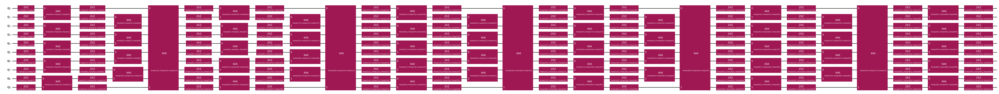

{/* doqumentation-source-hash: f202cfc1 */}

import TutorialFeedback from '@site/src/components/TutorialFeedback';

<OpenInLabBanner notebookPath="qiskit-addons/aqc-tensor/01_initial_state_aqc.ipynb" />


In diesem Notebook arbeiten wir die Schritte eines [Qiskit-Musters](https://quantum.cloud.ibm.com/docs/guides/intro-to-patterns) durch und nutzen dabei **näherungsweise Quantenkompilierung mit Tensornetzwerken (AQC-Tensor)**, um eine geringere Schaltkreistiefe zu erreichen, als normalerweise für die Trotter-Zeitentwicklung erforderlich wäre.

Dies sind die Schritte, die wir unternehmen werden:

- **Schritt 1: Auf Quantenproblem abbilden**
    - Hamiltonoperator und Observable(s) unseres Problems initialisieren
    - <font color='#0F62FE'>Einen Ziel-Tensornetzwerkzustand für den anfänglichen Schaltkreisabschnitt generieren</font>
    - <font color='#0F62FE'>Einen flachen Schaltkreis generieren, der den zu komprimierenden Abschnitt annähert</font>
    - <font color='#0F62FE'>Einen allgemeinen Ansatz aus diesem Schaltkreis generieren</font>
    - <font color='#0F62FE'>Die Parameter optimieren, um den Ansatz so nah wie möglich an das Ziel heranzubringen</font>
    - <font color='#0F62FE'>Nachfolgende Trotter-Schritte zum optimierten Ansatz hinzufügen</font>
- **Schritt 2: Für Zielhardware optimieren**
    - Den Schaltkreis für die Hardware transpilieren
- **Schritt 3: Experimente ausführen**
    - Zur Vereinfachung ein gefälschtes Backend verwenden
- **Schritt 4: Ergebnisse rekonstruieren**
    - Nicht zutreffend; stattdessen geben wir einfach die gemessene Observable aus
## Schritt 1: Auf Quantenschaltkreis und Operator abbilden {#step-1-map-to-quantum-circuit-and-operator}

### Einen Modell-Hamiltonoperator und eine Observable einrichten {#set-up-a-model-hamiltonian-and-observable}

In diesem Notebook verwenden wir das Ising-Modell auf einem Kreis mit 10 Stellen:
$$
\hat{\mathcal{H}}_{\text{Ising}} = \sum_{i=1}^{10} J_{i,(i+1)} Z_i Z_{(i+1)} + h_i X_i \, ,
$$
wobei die periodischen Randbedingungen bedeuten, dass für $i=10$ gilt $i+1=11\rightarrow1$, $J$ die Kopplungsstärke zwischen zwei Stellen ist und $h$ das externe Magnetfeld.

```python
# Added by doQumentation — required packages for this notebook
!pip install -q qiskit qiskit-addon-aqc-tensor qiskit-addon-utils qiskit-ibm-runtime quimb scipy
```

```python
from qiskit.transpiler import CouplingMap
from qiskit_addon_utils.problem_generators import generate_xyz_hamiltonian

# Generate some coupling map to use for this example
coupling_map = CouplingMap.from_heavy_hex(3, bidirectional=False)

# Choose a 10-qubit circle on this coupling map
reduced_coupling_map = coupling_map.reduce([0, 13, 1, 14, 10, 16, 4, 15, 3, 9])

# Get a qubit operator describing the Ising field model
hamiltonian = generate_xyz_hamiltonian(
    reduced_coupling_map,
    coupling_constants=(0.0, 0.0, 1.0),
    ext_magnetic_field=(0.4, 0.0, 0.0),
)
```

Die Observable, die wir messen werden, ist die Gesamtmagnetisierung.

```python
from qiskit.quantum_info import SparsePauliOp

L = reduced_coupling_map.size()
observable = SparsePauliOp.from_sparse_list([("Z", [i], 1 / L / 2) for i in range(L)], num_qubits=L)
```

### Festlegen, wie viel der Zeitentwicklung klassisch simuliert werden soll {#determine-how-much-of-the-time-evolution-to-simulate-classically}

Unser übergeordnetes Ziel ist die Simulation der Zeitentwicklung des obigen Modell-Hamiltonoperators. Dazu verwenden wir Trotter-Entwicklung, die wir in zwei Abschnitte aufteilen:

1. Einen anfänglichen Abschnitt, der mit Matrixproduktzuständen (MPS) simulierbar ist. Diesen Abschnitt werden wir mittels AQC „kompilieren", wie in https://arxiv.org/abs/2301.08609 vorgestellt.
2. Einen nachfolgenden Abschnitt des Schaltkreises, der auf Hardware ausgeführt wird.
Wir planen, AQC-Tensor zu verwenden, um unseren Zeitentwicklungsschaltkreis bis zur Zeit $t=4$ zu komprimieren und dann mithilfe gewöhnlicher Trotter-Schritte bis $t=5$ weiterzuentwickeln.
### Schaltkreise vor und nach der Aufteilung generieren {#generate-circuits-before-and-after-split}

Nachdem wir uns entschieden haben, bei $t=4$ aufzuteilen, werden wir zwei Schaltkreise generieren:

1. Einen „Ziel"-Schaltkreis für den AQC-Abschnitt der Entwicklung, von $t_i=0$ bis $t_f=4$. Da dieser von einem Tensornetzwerk-Simulator simuliert wird, beeinflusst die Anzahl der Schichten die Ausführungszeit nur um einen konstanten Faktor, sodass wir genauso gut eine großzügige Anzahl von Schichten verwenden können, um den Trotter-Fehler zu minimieren.

```python
from qiskit.synthesis import SuzukiTrotter
from qiskit_addon_utils.problem_generators import generate_time_evolution_circuit

aqc_evolution_time = 4.0
aqc_target_num_trotter_steps = 45

aqc_target_circuit = generate_time_evolution_circuit(
    hamiltonian,
    synthesis=SuzukiTrotter(reps=aqc_target_num_trotter_steps),
    time=aqc_evolution_time,
)
```

2. Einen nachfolgenden Entwicklungsschaltkreis, der von $t_i=4$ bis $t_f=5$ entwickelt. Da dieser auf Quantenhardware ausgeführt wird, ist es wünschenswert, so wenige Trotter-Schichten wie möglich zu verwenden.

```python
subsequent_evolution_time = 1.0
subsequent_num_trotter_steps = 5

subsequent_circuit = generate_time_evolution_circuit(
    hamiltonian,
    synthesis=SuzukiTrotter(reps=subsequent_num_trotter_steps),
    time=subsequent_evolution_time,
)
```

Zum späteren Vergleich generieren wir auch noch einen dritten Schaltkreis: einen, der für `aqc_evolution_time` entwickelt, aber die gleiche Entwicklungszeit pro Trotter-Schritt hat wie der nachfolgende Schaltkreis. Dies ist der Schaltkreis, mit dem wir gearbeitet hätten, wenn wir keine großzügige Anzahl von Trotter-Schritten für den Zielschaltkreis verwendet hätten. Wir werden diesen als den _Vergleichsschaltkreis_ bezeichnen.

```python
aqc_comparison_num_trotter_steps = int(
    subsequent_num_trotter_steps / subsequent_evolution_time * aqc_evolution_time
)
aqc_comparison_num_trotter_steps
```

```text
20
```

```python
comparison_circuit = generate_time_evolution_circuit(
    hamiltonian,
    synthesis=SuzukiTrotter(reps=aqc_comparison_num_trotter_steps),
    time=aqc_evolution_time,
)
```

### Einen Ansatz und Anfangsparameter aus einem Trotter-Schaltkreis mit weniger Schritten generieren {#generate-an-ansatz-and-initial-parameters-from-a-trotter-circuit-with-fewer-steps}

Zunächst konstruieren wir einen „guten" Schaltkreis, der die gleiche Entwicklungszeit wie der Zielschaltkreis hat, aber mit weniger Trotter-Schritten (und damit weniger Schichten).

Dann übergeben wir diesen „guten" Schaltkreis an die Funktion `generate_ansatz_from_circuit` von AQC-Tensor. Diese Funktion analysiert die Zwei-Qubit-Konnektivität des Schaltkreises und gibt zwei Dinge zurück:
1. einen allgemeinen, parametrisierten Ansatz-Schaltkreis mit der gleichen Zwei-Qubit-Konnektivität wie der Eingabeschaltkreis; und
2. Parameter, die bei Einsetzen in den Ansatz den eingegebenen (guten) Schaltkreis ergeben.

Bald werden wir diese Parameter nehmen und sie iterativ anpassen, um den Ansatz-Schaltkreis so nah wie möglich an den Ziel-MPS heranzubringen.

```python
from qiskit_addon_aqc_tensor import generate_ansatz_from_circuit

aqc_ansatz_num_trotter_steps = 5

aqc_good_circuit = generate_time_evolution_circuit(
    hamiltonian,
    synthesis=SuzukiTrotter(reps=aqc_ansatz_num_trotter_steps),
    time=aqc_evolution_time,
)

aqc_ansatz, aqc_initial_parameters = generate_ansatz_from_circuit(
    aqc_good_circuit, qubits_initially_zero=True
)
aqc_ansatz.draw("mpl", fold=-1)
```



```python
print(f"Comparison circuit: depth {comparison_circuit.depth()}")
print(f"Target circuit: depth {aqc_target_circuit.depth()}")
print(f"Ansatz circuit: depth {aqc_ansatz.depth()}, with {len(aqc_initial_parameters)} parameters")
```

```text
Comparison circuit: depth 120
Target circuit: depth 270
Ansatz circuit: depth 23, with 515 parameters
```

### Einstellungen für die Tensornetzwerk-Simulation auswählen {#choose-settings-for-tensor-network-simulation}

Hier verwenden wir den auf [quimb](http://quimb.readthedocs.io/) basierenden Tensornetzwerk-Simulator. In diesem Beispiel verwenden wir quimbs Matrixproduktzustand-(MPS-)Simulator und nutzen [JAX](https://docs.jax.dev/en/latest/) für automatische Differentiation. Weitere Informationen zur Verwendung des quimb-Simulators findest du in der [API-Dokumentation](../stubs/qiskit_addon_aqc_tensor.simulation.quimb.QuimbSimulator.rst).

```python
from functools import partial

import quimb.tensor

from qiskit_addon_aqc_tensor.simulation.quimb import QuimbSimulator

simulator_settings = QuimbSimulator(
    partial(quimb.tensor.CircuitMPS, max_bond=100, cutoff=1e-8),
    autodiff_backend="jax",
)
```

### Matrixproduktzustand-Darstellung des AQC-Zielzustands konstruieren {#construct-matrix-product-state-representation-of-the-aqc-target-state}

Als nächstes bauen wir eine Matrixprodukt-Darstellung des Zustands auf, der durch AQC angenähert werden soll.

```python
from qiskit_addon_aqc_tensor.simulation import tensornetwork_from_circuit

aqc_target_mps = tensornetwork_from_circuit(aqc_target_circuit, simulator_settings)
```

Da wir eine großzügige Anzahl von Trotter-Schritten für den Zielzustand gewählt haben, hat dieser tatsächlich weniger Trotter-Fehler als der Vergleichsschaltkreis. Wir können die Fidelity ($| \langle \psi_1 | \psi_2 \rangle |^2$) des vom Vergleichsschaltkreis vorbereiteten Zustands gegenüber dem Zielzustand berechnen:

```python
from qiskit_addon_aqc_tensor.simulation import compute_overlap

comparison_mps = tensornetwork_from_circuit(comparison_circuit, simulator_settings)
comparison_fidelity = abs(compute_overlap(comparison_mps, aqc_target_mps)) ** 2
comparison_fidelity
```

```text
0.9996761790297157
```

### Die Parameter des Ansatzes mithilfe von MPS-Berechnungen optimieren {#optimize-the-parameters-of-the-ansatz-using-mps-calculations}

Hier minimieren wir die einfachstmögliche Kostenfunktion, `MaximizeStateFidelity`, mithilfe des L-BFGS-Optimierers aus scipy.

Wir wählen einen Stoppunkt für die Fidelity so, dass sie über dem Wert liegt, den der Vergleichsschaltkreis ohne AQC erreicht hätte. Sobald dieser erreicht ist, hat der komprimierte Schaltkreis sowohl weniger Trotter-Fehler _als auch_ eine geringere Tiefe als der ursprüngliche Schaltkreis. Mit mehr Rechenzeit können weitere Optimierungsschritte durchgeführt werden, um die Fidelity noch weiter zu erhöhen.

```python
from scipy.optimize import OptimizeResult, minimize

from qiskit_addon_aqc_tensor.objective import MaximizeStateFidelity

objective = MaximizeStateFidelity(aqc_target_mps, aqc_ansatz, simulator_settings)

stopping_point = 1 - comparison_fidelity

def callback(intermediate_result: OptimizeResult):
    print(f"Intermediate result: Fidelity {1 - intermediate_result.fun:.8}")
    if intermediate_result.fun < stopping_point:
        # Good enough for now
        raise StopIteration

result = minimize(
    objective.loss_function,
    aqc_initial_parameters,
    method="L-BFGS-B",
    jac=True,
    options={"maxiter": 100},
    callback=callback,
)
if result.status not in (
    0,
    1,
    99,
):  # 0 => success; 1 => max iterations reached; 99 => early termination via StopIteration
    raise RuntimeError(f"Optimization failed: {result.message} (status={result.status})")

print(f"Done after {result.nit} iterations.")
aqc_final_parameters = result.x
```

```text
Intermediate result: Fidelity 0.95080335
Intermediate result: Fidelity 0.98408927
Intermediate result: Fidelity 0.99140876
Intermediate result: Fidelity 0.9951876
Intermediate result: Fidelity 0.99563147
Intermediate result: Fidelity 0.99646297
Intermediate result: Fidelity 0.99679298
Intermediate result: Fidelity 0.99715793
Intermediate result: Fidelity 0.99756604
Intermediate result: Fidelity 0.99804283
Intermediate result: Fidelity 0.99832283
Intermediate result: Fidelity 0.99856583
Intermediate result: Fidelity 0.99868698
Intermediate result: Fidelity 0.998867
Intermediate result: Fidelity 0.99902237
Intermediate result: Fidelity 0.99912174
Intermediate result: Fidelity 0.99919705
Intermediate result: Fidelity 0.99926724
Intermediate result: Fidelity 0.99938605
Intermediate result: Fidelity 0.99951297
Intermediate result: Fidelity 0.99956172
Intermediate result: Fidelity 0.99962274
Intermediate result: Fidelity 0.99963919
Intermediate result: Fidelity 0.99967423
Intermediate result: Fidelity 0.9997101
Done after 25 iterations.
```

### Den endgültigen Schaltkreis für die Übergabe an den Transpiler konstruieren {#construct-the-final-circuit-to-pass-to-the-transpiler}

```python
final_circuit = aqc_ansatz.assign_parameters(aqc_final_parameters)
final_circuit.compose(subsequent_circuit, inplace=True)
final_circuit.draw("mpl", fold=-1)
```


## Schritt 2: Für die Ausführung auf Zielhardware transpilieren {#step-2-transpile-for-execution-on-target-hardware}

In Schritt 2 eines [Qiskit-Musters](https://quantum.cloud.ibm.com/docs/guides/intro-to-patterns) transpilieren wir diesen Schaltkreis und alle gewünschten Observable(s) für die Ausführung auf einem Zielgerät. Hier verwenden wir ein gefälschtes Backend, das von `qiskit-ibm-runtime` bereitgestellt wird.

```python
from qiskit import transpile
from qiskit_ibm_runtime.fake_provider import FakeMelbourneV2

backend = FakeMelbourneV2()

isa_circuit = transpile(final_circuit, backend)
isa_observable = observable.apply_layout(isa_circuit.layout)
```

Der resultierende ISA-Schaltkreis kann dann zur Ausführung an das Backend gesendet werden (Schritt 3 eines [Qiskit-Musters](https://quantum.cloud.ibm.com/docs/guides/intro-to-patterns)).
## Schritt 3: Auf Quantenhardware ausführen {#step-3-execute-on-quantum-hardware}

```python
from qiskit_ibm_runtime import EstimatorV2 as Estimator

estimator = Estimator(backend)
job = estimator.run([(isa_circuit, isa_observable)])
pub_result = job.result()[0]
```

## Schritt 4: Rekonstruieren {#step-4-reconstruct}

Eine Rekonstruktion ist in unserem Fall nicht erforderlich. Wir können uns das Ergebnis direkt ansehen.

```python
pub_result.data.evs[()]
```

```text
np.float64(0.047998046875000006)
```

<TutorialFeedback />
