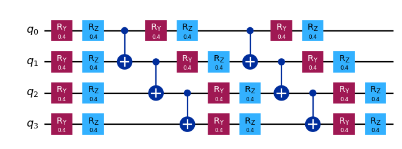

{/* doqumentation-source-hash: 00531414 */}

import TutorialFeedback from '@site/src/components/TutorialFeedback';

<OpenInLabBanner notebookPath="qiskit-addons/cutting/01_gate_cutting_to_reduce_circuit_width.ipynb" />


In diesem Notebook arbeiten wir die Schritte eines [Qiskit-Musters](https://quantum.cloud.ibm.com/docs/guides/intro-to-patterns) durch und verwenden dabei **Circuit Cutting**, um die Anzahl der Qubits in einem Circuit zu reduzieren. Wir schneiden Gates, damit wir den Erwartungswert eines Vier-Qubit-Circuits mithilfe von Zwei-Qubit-Experimenten rekonstruieren können.

Dies sind die Schritte, die wir unternehmen werden:

- **Schritt 1: Problem auf Quantencircuits und Operatoren abbilden**:
    - Den Hamiltonian auf einen Quantencircuit abbilden.
- **Schritt 2: Für Zielhardware optimieren** [_Verwendet das Cutting-Addon_]:
    - <font color='#0F62FE'>Den Circuit und das Observable schneiden.</font>
    - Die Teilexperimente für die Hardware transpilieren.
- **Schritt 3: Auf Zielhardware ausführen**:
    - Die in Schritt 2 erhaltenen Teilexperimente mithilfe eines `Sampler`-Primitives ausführen.
- **Schritt 4: Ergebnisse nachverarbeiten** [_Verwendet das Cutting-Addon_]:
    - <font color='#0F62FE'>Die Ergebnisse aus Schritt 3 kombinieren, um den Erwartungswert des betreffenden Observables zu rekonstruieren.</font>
## Schritt 1: Abbilden {#step-1-map}

### Einen Circuit zum Schneiden erstellen {#create-a-circuit-to-cut}

```python
# Added by doQumentation — required packages for this notebook
!pip install -q numpy qiskit qiskit-addon-cutting qiskit-aer qiskit-ibm-runtime
```

```python
from qiskit.circuit.library import efficient_su2

qc = efficient_su2(4, entanglement="linear", reps=2)
qc.assign_parameters([0.4] * len(qc.parameters), inplace=True)

qc.draw("mpl", scale=0.8)
```



### Ein Observable festlegen {#specify-an-observable}

```python
from qiskit.quantum_info import SparsePauliOp

observable = SparsePauliOp(["ZZII", "IZZI", "-IIZZ", "XIXI", "ZIZZ", "IXIX"])
```

## Schritt 2: Optimieren {#step-2-optimize}

### Den Circuit und das Observable gemäß einer festgelegten Qubit-Partitionierung trennen {#separate-the-circuit-and-observable-according-to-a-specified-qubit-partitioning}

Jedes Label in `partition_labels` entspricht dem `circuit`-Qubit am selben Index. Qubits mit demselben Partitions-Label werden gruppiert, und nicht-lokale Gates, die mehr als eine Partition überspannen, werden geschnitten.

**Hinweis:** Das ``observables``-Argument für `partition_problem` hat den Typ `PauliList`. Koeffizienten und Phasen der Observable-Terme werden bei der Zerlegung des Problems und der Ausführung der Teilexperimente ignoriert. Sie können bei der Rekonstruktion des Erwartungswertes erneut angewendet werden.

```python
from qiskit_addon_cutting import partition_problem

partitioned_problem = partition_problem(
    circuit=qc, partition_labels="AABB", observables=observable.paulis
)
subcircuits = partitioned_problem.subcircuits
subobservables = partitioned_problem.subobservables
bases = partitioned_problem.bases
```

### Das zerlegte Problem visualisieren {#visualize-the-decomposed-problem}

```python
subobservables
```

```text
{'A': PauliList(['II', 'ZI', 'ZZ', 'XI', 'ZZ', 'IX']),
 'B': PauliList(['ZZ', 'IZ', 'II', 'XI', 'ZI', 'IX'])}
```

```python
subcircuits["A"].draw("mpl", scale=0.8)
```


```python
subcircuits["B"].draw("mpl", scale=0.8)
```


### Den Sampling-Overhead für die gewählten Schnitte berechnen {#calculate-the-sampling-overhead-for-the-chosen-cuts}

Hier schneiden wir zwei CNOT-Gates, was zu einem Sampling-Overhead von $9^2$ führt.

Weitere Informationen zum Sampling-Overhead beim Circuit Cutting findest du im [Erklärungsmaterial](../explanation/index.rst).

```python
import numpy as np

print(f"Sampling overhead: {np.prod([basis.overhead for basis in bases])}")
```

```text
Sampling overhead: 81.0
```

### Die Teilexperimente generieren, die auf dem Backend ausgeführt werden sollen {#generate-the-subexperiments-to-run-on-the-backend}

`generate_cutting_experiments` akzeptiert `circuits`/`observables`-Argumente als Dictionaries, die Qubit-Partitions-Labels den entsprechenden `subcircuit`/`subobservables` zuordnen.

Um den Erwartungswert des vollständig großen Circuits zu simulieren, werden viele Teilexperimente aus der gemeinsamen Quasiwahrscheinlichkeitsverteilung der zerlegten Gates generiert und anschließend auf einem oder mehreren Backends ausgeführt. Die Anzahl der aus der Verteilung entnommenen Stichproben wird durch `num_samples` gesteuert, und für jede eindeutige Stichprobe wird ein kombinierter Koeffizient angegeben. Weitere Informationen zur Berechnung der Koeffizienten findest du im [Erklärungsmaterial](../explanation/index.rst).

```python
from qiskit_addon_cutting import generate_cutting_experiments

subexperiments, coefficients = generate_cutting_experiments(
    circuits=subcircuits, observables=subobservables, num_samples=np.inf
)
```

### Ein Backend auswählen {#choose-a-backend}

Hier verwenden wir ein Fake-Backend, was dazu führt, dass Qiskit Runtime im lokalen Modus ausgeführt wird (d. h. auf einem lokalen Simulator).

```python
from qiskit_ibm_runtime.fake_provider import FakeManilaV2

backend = FakeManilaV2()
```

### Die Teilexperimente für das Backend vorbereiten {#prepare-the-subexperiments-for-the-backend}

Wir müssen die Circuits mit unserem Backend als Ziel transpilieren, bevor wir sie an Qiskit Runtime übermitteln.

```python
from qiskit.transpiler import generate_preset_pass_manager

# Transpile the subexperiments to ISA circuits
pass_manager = generate_preset_pass_manager(optimization_level=1, backend=backend)
isa_subexperiments = {
    label: pass_manager.run(partition_subexpts)
    for label, partition_subexpts in subexperiments.items()
}
```

## Schritt 3: Ausführen {#step-3-execute}

### Die Teilexperimente mit dem Qiskit Runtime Sampler-Primitive ausführen {#run-the-subexperiments-using-the-qiskit-runtime-sampler-primitive}

```python
from qiskit_ibm_runtime import SamplerV2, Batch

# Submit each partition's subexperiments to the Qiskit Runtime Sampler
# primitive, in a single batch so that the jobs will run back-to-back.
with Batch(backend=backend) as batch:
    sampler = SamplerV2(mode=batch)
    jobs = {
        label: sampler.run(subsystem_subexpts, shots=2**12)
        for label, subsystem_subexpts in isa_subexperiments.items()
    }
```

```text
/home/garrison/Qiskit/qiskit-ibm-runtime/qiskit_ibm_runtime/session.py:157: UserWarning: Session is not supported in local testing mode or when using a simulator.
  warnings.warn(
```

```python
# Retrieve results
results = {label: job.result() for label, job in jobs.items()}
```

## Schritt 4: Nachverarbeiten {#step-4-post-process}

### Den Erwartungswert rekonstruieren {#reconstruct-the-expectation-value}

Erwartungswerte für jeden Observable-Term rekonstruieren und kombinieren, um den Erwartungswert für das ursprüngliche Observable zu rekonstruieren.

```python
from qiskit_addon_cutting import reconstruct_expectation_values

# Get expectation values for each observable term
reconstructed_expval_terms = reconstruct_expectation_values(
    results,
    coefficients,
    subobservables,
)

# Reconstruct final expectation value
reconstructed_expval = np.dot(reconstructed_expval_terms, observable.coeffs)
```

### Den rekonstruierten Erwartungswert mit dem exakten Erwartungswert aus dem ursprünglichen Circuit und Observable vergleichen {#compare-the-reconstructed-expectation-value-with-the-exact-expectation-value-from-the-original-circuit-and-observable}

```python
from qiskit_aer.primitives import EstimatorV2

estimator = EstimatorV2()
exact_expval = estimator.run([(qc, observable)]).result()[0].data.evs
print(f"Reconstructed expectation value: {np.real(np.round(reconstructed_expval, 8))}")
print(f"Exact expectation value: {np.round(exact_expval, 8)}")
print(f"Error in estimation: {np.real(np.round(reconstructed_expval-exact_expval, 8))}")
print(
    f"Relative error in estimation: {np.real(np.round((reconstructed_expval-exact_expval) / exact_expval, 8))}"
)
```

```text
Reconstructed expectation value: 0.6991539
Exact expectation value: 0.56254612
Error in estimation: 0.13660778
Relative error in estimation: 0.24283836
```

<TutorialFeedback />
