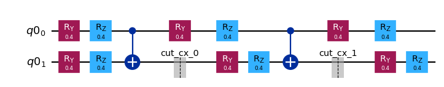
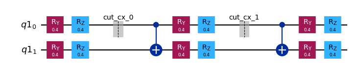

{/* doqumentation-source-hash: 00531414 */}

import TutorialFeedback from '@site/src/components/TutorialFeedback';

<OpenInLabBanner notebookPath="qiskit-addons/cutting/01_gate_cutting_to_reduce_circuit_width.ipynb" />


En este notebook, seguiremos los pasos de un [patrón de Qiskit](https://quantum.cloud.ibm.com/docs/guides/intro-to-patterns) usando **circuit cutting** para reducir el número de Qubits en un Circuit. Cortaremos Gates para poder reconstruir el valor esperado de un Circuit de cuatro Qubits usando solo experimentos de dos Qubits.

Estos son los pasos que seguiremos:

- **Paso 1: Mapear el problema a circuits cuánticos y operadores**:
    - Mapear el hamiltoniano a un Circuit cuántico.
- **Paso 2: Optimizar para el hardware objetivo** [_Usa el cutting addon_]:
    - <font color='#0F62FE'>Cortar el Circuit y el observable.</font>
    - Transpilar los subexperimentos para el hardware.
- **Paso 3: Ejecutar en el hardware objetivo**:
    - Ejecutar los subexperimentos obtenidos en el Paso 2 usando una primitiva `Sampler`.
- **Paso 4: Post-procesar los resultados** [_Usa el cutting addon_]:
    - <font color='#0F62FE'>Combinar los resultados del Paso 3 para reconstruir el valor esperado del observable en cuestión.</font>
## Paso 1: Mapear {#step-1-map}

### Crear un Circuit para cortar {#create-a-circuit-to-cut}

```python
# Added by doQumentation — required packages for this notebook
!pip install -q numpy qiskit qiskit-addon-cutting qiskit-aer qiskit-ibm-runtime
```

```python
from qiskit.circuit.library import efficient_su2

qc = efficient_su2(4, entanglement="linear", reps=2)
qc.assign_parameters([0.4] * len(qc.parameters), inplace=True)

qc.draw("mpl", scale=0.8)
```


### Especificar un observable {#specify-an-observable}

```python
from qiskit.quantum_info import SparsePauliOp

observable = SparsePauliOp(["ZZII", "IZZI", "-IIZZ", "XIXI", "ZIZZ", "IXIX"])
```

## Paso 2: Optimizar {#step-2-optimize}

### Separar el Circuit y el observable según una partición de Qubits especificada {#separate-the-circuit-and-observable-according-to-a-specified-qubit-partitioning}

Cada etiqueta en `partition_labels` corresponde al Qubit del `circuit` en el mismo índice. Los Qubits que comparten una etiqueta de partición común se agruparán, y los Gates no locales que abarquen más de una partición serán cortados.

**Nota:** El argumento ``observables`` de `partition_problem` es de tipo `PauliList`. Los coeficientes y las fases de los términos del observable se ignoran durante la descomposición del problema y la ejecución de los subexperimentos. Pueden volver a aplicarse durante la reconstrucción del valor esperado.

```python
from qiskit_addon_cutting import partition_problem

partitioned_problem = partition_problem(
    circuit=qc, partition_labels="AABB", observables=observable.paulis
)
subcircuits = partitioned_problem.subcircuits
subobservables = partitioned_problem.subobservables
bases = partitioned_problem.bases
```

### Visualizar el problema descompuesto {#visualize-the-decomposed-problem}

```python
subobservables
```

```text
{'A': PauliList(['II', 'ZI', 'ZZ', 'XI', 'ZZ', 'IX']),
 'B': PauliList(['ZZ', 'IZ', 'II', 'XI', 'ZI', 'IX'])}
```

```python
subcircuits["A"].draw("mpl", scale=0.8)
```



```python
subcircuits["B"].draw("mpl", scale=0.8)
```



### Calcular la sobrecarga de muestreo para los cortes elegidos {#calculate-the-sampling-overhead-for-the-chosen-cuts}

Aquí cortamos dos Gates CNOT, lo que resulta en una sobrecarga de muestreo de $9^2$.

Para más información sobre la sobrecarga de muestreo generada por el circuit cutting, consulta el [material explicativo](../explanation/index.rst).

```python
import numpy as np

print(f"Sampling overhead: {np.prod([basis.overhead for basis in bases])}")
```

```text
Sampling overhead: 81.0
```

### Generar los subexperimentos para ejecutar en el Backend {#generate-the-subexperiments-to-run-on-the-backend}

`generate_cutting_experiments` acepta los argumentos `circuits`/`observables` como diccionarios que mapean etiquetas de partición de Qubits a los respectivos `subcircuit`/`subobservables`.

Para simular el valor esperado del Circuit de tamaño completo, se generan muchos subexperimentos a partir de la distribución de cuasiprobabilidad conjunta de los Gates descompuestos y luego se ejecutan en uno o más Backends. El número de muestras tomadas de la distribución se controla con `num_samples`, y se da un coeficiente combinado para cada muestra única. Para más información sobre cómo se calculan los coeficientes, consulta el [material explicativo](../explanation/index.rst).

```python
from qiskit_addon_cutting import generate_cutting_experiments

subexperiments, coefficients = generate_cutting_experiments(
    circuits=subcircuits, observables=subobservables, num_samples=np.inf
)
```

### Elegir un Backend {#choose-a-backend}

Aquí usamos un Backend falso, lo que hará que Qiskit Runtime se ejecute en modo local (es decir, en un simulador local).

```python
from qiskit_ibm_runtime.fake_provider import FakeManilaV2

backend = FakeManilaV2()
```

### Preparar los subexperimentos para el Backend {#prepare-the-subexperiments-for-the-backend}

Debemos transpilar los circuits con nuestro Backend como objetivo antes de enviarlos a Qiskit Runtime.

```python
from qiskit.transpiler import generate_preset_pass_manager

# Transpile the subexperiments to ISA circuits
pass_manager = generate_preset_pass_manager(optimization_level=1, backend=backend)
isa_subexperiments = {
    label: pass_manager.run(partition_subexpts)
    for label, partition_subexpts in subexperiments.items()
}
```

## Paso 3: Ejecutar {#step-3-execute}

### Ejecutar los subexperimentos usando la primitiva Sampler de Qiskit Runtime {#run-the-subexperiments-using-the-qiskit-runtime-sampler-primitive}

```python
from qiskit_ibm_runtime import SamplerV2, Batch

# Submit each partition's subexperiments to the Qiskit Runtime Sampler
# primitive, in a single batch so that the jobs will run back-to-back.
with Batch(backend=backend) as batch:
    sampler = SamplerV2(mode=batch)
    jobs = {
        label: sampler.run(subsystem_subexpts, shots=2**12)
        for label, subsystem_subexpts in isa_subexperiments.items()
    }
```

```text
/home/garrison/Qiskit/qiskit-ibm-runtime/qiskit_ibm_runtime/session.py:157: UserWarning: Session is not supported in local testing mode or when using a simulator.
  warnings.warn(
```

```python
# Retrieve results
results = {label: job.result() for label, job in jobs.items()}
```

## Paso 4: Post-procesar {#step-4-post-process}

### Reconstruir el valor esperado {#reconstruct-the-expectation-value}

Reconstruye los valores esperados para cada término del observable y combínalos para reconstruir el valor esperado del observable original.

```python
from qiskit_addon_cutting import reconstruct_expectation_values

# Get expectation values for each observable term
reconstructed_expval_terms = reconstruct_expectation_values(
    results,
    coefficients,
    subobservables,
)

# Reconstruct final expectation value
reconstructed_expval = np.dot(reconstructed_expval_terms, observable.coeffs)
```

### Comparar el valor esperado reconstruido con el valor esperado exacto del Circuit y observable originales {#compare-the-reconstructed-expectation-value-with-the-exact-expectation-value-from-the-original-circuit-and-observable}

```python
from qiskit_aer.primitives import EstimatorV2

estimator = EstimatorV2()
exact_expval = estimator.run([(qc, observable)]).result()[0].data.evs
print(f"Reconstructed expectation value: {np.real(np.round(reconstructed_expval, 8))}")
print(f"Exact expectation value: {np.round(exact_expval, 8)}")
print(f"Error in estimation: {np.real(np.round(reconstructed_expval-exact_expval, 8))}")
print(
    f"Relative error in estimation: {np.real(np.round((reconstructed_expval-exact_expval) / exact_expval, 8))}"
)
```

```text
Reconstructed expectation value: 0.6991539
Exact expectation value: 0.56254612
Error in estimation: 0.13660778
Relative error in estimation: 0.24283836
```

<TutorialFeedback />
