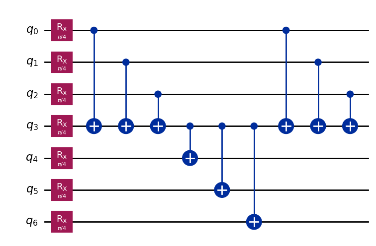
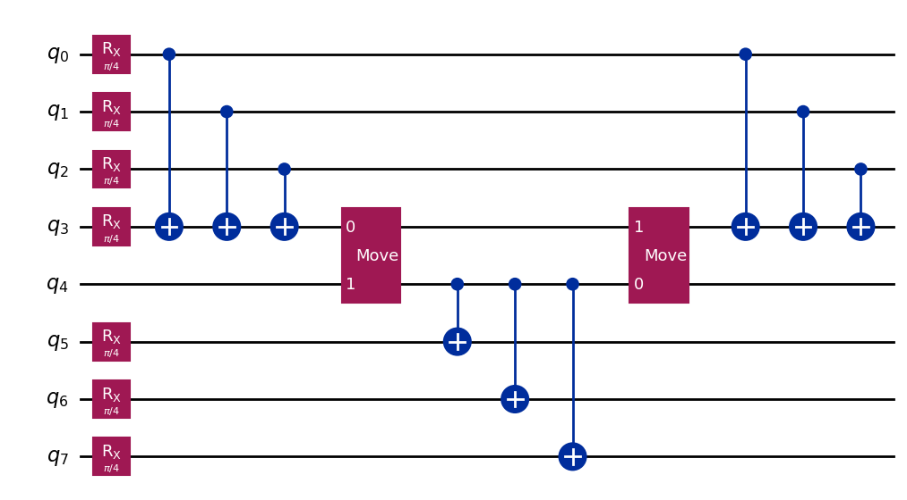
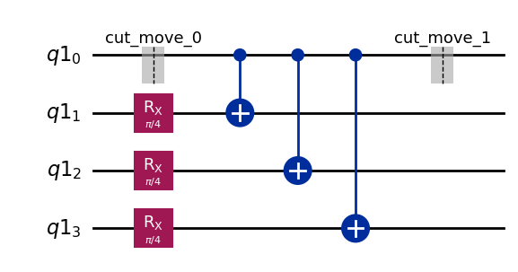

{/* doqumentation-source-hash: cf00a5bc */}

import TutorialFeedback from '@site/src/components/TutorialFeedback';

<OpenInLabBanner notebookPath="qiskit-addons/cutting/03_wire_cutting_via_move_instruction.ipynb" />


Dans ce tutoriel, nous allons reconstruire les valeurs d'espérance d'un Circuit à sept Qubits en le divisant en deux circuits à quatre Qubits chacun à l'aide de la coupure de fil.

Voici les étapes que nous allons suivre dans ce [modèle Qiskit](https://quantum.cloud.ibm.com/docs/guides/intro-to-patterns) :

- **Étape 1 : Mapper le problème sur des circuits et des opérateurs quantiques** :
    - Mapper le hamiltonien sur un circuit quantique.
- **Étape 2 : Optimiser pour le matériel cible** [_Utilise l'addon de coupure_] :
    - <font color='#0F62FE'>Couper le Circuit et l'observable.</font>
    - Transpiler les sous-expériences pour le matériel.
- **Étape 3 : Exécuter sur le matériel cible** :
    - Lancer les sous-expériences obtenues à l'Étape 2 en utilisant la primitive `Sampler`.
- **Étape 4 : Post-traiter les résultats** [_Utilise l'addon de coupure_] :
    - <font color='#0F62FE'>Combiner les résultats de l'Étape 3 pour reconstruire la valeur d'espérance de l'observable en question.</font>
## Étape 1 : Mapper {#step-1-map}

### Créer un Circuit à couper {#create-a-circuit-to-cut}

Pour commencer, nous partons d'un Circuit inspiré de la Fig. 1(a) de [arXiv:2302.03366v1](https://arxiv.org/abs/2302.03366v1).

```python
# Added by doQumentation — required packages for this notebook
!pip install -q numpy qiskit qiskit-addon-cutting qiskit-aer qiskit-ibm-runtime
```

```python
import numpy as np
from qiskit import QuantumCircuit

qc_0 = QuantumCircuit(7)
for i in range(7):
    qc_0.rx(np.pi / 4, i)
qc_0.cx(0, 3)
qc_0.cx(1, 3)
qc_0.cx(2, 3)
qc_0.cx(3, 4)
qc_0.cx(3, 5)
qc_0.cx(3, 6)
qc_0.cx(0, 3)
qc_0.cx(1, 3)
qc_0.cx(2, 3)
```

```text
<qiskit.circuit.instructionset.InstructionSet at 0x7f16ab191a80>
```

```python
qc_0.draw("mpl")
```



### Spécifier un observable {#specify-an-observable}

```python
from qiskit.quantum_info import SparsePauliOp

observable = SparsePauliOp(["ZIIIIII", "IIIZIII", "IIIIIIZ"])
```

## Étape 2 : Optimiser {#step-2-optimize}

### Créer un nouveau Circuit dans lequel des instructions `Move` ont été placées aux emplacements de coupure souhaités {#create-a-new-circuit-where-move-instructions-have-been-placed-at-the-desired-cut-locations}

Étant donné le Circuit ci-dessus, nous souhaitons placer deux coupures de fil sur la ligne du Qubit central, afin que le Circuit puisse se séparer en deux circuits de quatre Qubits chacun. Une façon de faire cela est de placer manuellement des instructions `Move` à deux Qubits qui transfèrent l'état d'un fil de Qubit à un autre. Une instruction `Move` est conceptuellement équivalente à une opération de réinitialisation sur le second Qubit, suivie d'une Gate SWAP. L'effet de cette instruction est de transférer l'état du premier Qubit (source) vers le second Qubit (destination), tout en éliminant l'état entrant du second Qubit. Pour que cela fonctionne comme prévu, il est important que le second Qubit (destination) ne partage aucun enchevêtrement avec le reste du système ; sinon, l'opération de réinitialisation entraînera un effondrement partiel de l'état du reste du système.

Ici, nous construisons un nouveau Circuit avec un Qubit supplémentaire et les opérations `Move` en place. Dans cet exemple, nous pouvons réutiliser un Qubit : le Qubit source du premier `Move` devient le Qubit destination du second `Move`.

Remarque : En alternative au travail direct avec les instructions `Move`, on peut choisir de marquer les coupures de fil à l'aide d'une instruction `CutWire` à un seul Qubit. La fonction `cut_wires` existe pour transformer les `CutWire`s en instructions `Move` sur des Qubits nouvellement alloués. Cependant, contrairement à la méthode manuelle, cette méthode automatique ne permet pas la réutilisation des fils de Qubit. Consulte le [guide pratique](../how-tos/how_to_specify_cut_wires.ipynb) sur `CutWire` pour plus de détails.

```python
from qiskit_addon_cutting.instructions import Move

qc_1 = QuantumCircuit(8)
for i in [*range(4), *range(5, 8)]:
    qc_1.rx(np.pi / 4, i)
qc_1.cx(0, 3)
qc_1.cx(1, 3)
qc_1.cx(2, 3)
qc_1.append(Move(), [3, 4])
qc_1.cx(4, 5)
qc_1.cx(4, 6)
qc_1.cx(4, 7)
qc_1.append(Move(), [4, 3])
qc_1.cx(0, 3)
qc_1.cx(1, 3)
qc_1.cx(2, 3)

qc_1.draw("mpl")
```



### Créer un observable correspondant au nouveau Circuit {#create-observable-to-go-with-the-new-circuit}

Cet observable correspond à `observable`, mais nous devons correctement tenir compte du fil de Qubit supplémentaire qui a été ajouté (c'est-à-dire que nous insérons un "I" à l'index 4). Remarque : dans Qiskit, la représentation en chaîne du Qubit-0 correspond au caractère de Pauli le plus à droite.

```python
observable_expanded = SparsePauliOp(["ZIIIIIII", "IIIIZIII", "IIIIIIIZ"])
```

### Séparer le Circuit et les observables {#separate-the-circuit-and-observables}

Comme dans les tutoriels précédents, les Qubits partageant une même étiquette de partition seront regroupés, et les Gates non locales couvrant plus d'une partition seront coupées.

```python
from qiskit_addon_cutting import partition_problem

partitioned_problem = partition_problem(
    circuit=qc_1, partition_labels="AAAABBBB", observables=observable_expanded.paulis
)
subcircuits = partitioned_problem.subcircuits
subobservables = partitioned_problem.subobservables
bases = partitioned_problem.bases
```

### Visualiser le problème décomposé {#visualize-the-decomposed-problem}

```python
subobservables
```

```text
{'A': PauliList(['IIII', 'ZIII', 'IIIZ']),
 'B': PauliList(['ZIII', 'IIII', 'IIII'])}
```

```python
subcircuits["A"].draw("mpl")
```


```python
subcircuits["B"].draw("mpl")
```



### Calculer le surcoût d'échantillonnage pour les coupures choisies {#calculate-the-sampling-overhead-for-the-chosen-cuts}

Ici, nous coupons deux fils, ce qui entraîne un surcoût d'échantillonnage de $4^4$.

Pour plus d'informations sur le surcoût d'échantillonnage engendré par la coupure de circuit, consulte le [matériel explicatif](../explanation/index.rst).

```python
print(f"Sampling overhead: {np.prod([basis.overhead for basis in bases])}")
```

```text
Sampling overhead: 256.0
```

### Générer les sous-expériences à exécuter sur le Backend {#generate-the-subexperiments-to-run-on-the-backend}

`generate_cutting_experiments` accepte les arguments `circuits`/`observables` sous forme de dictionnaires associant les étiquettes de partition des Qubits aux `subcircuit`/`subobservables` respectifs.

Pour simuler la valeur d'espérance du Circuit complet, de nombreuses sous-expériences sont générées à partir de la distribution de quasi-probabilité conjointe des Gates décomposées, puis exécutées sur un ou plusieurs Backends. Le nombre d'échantillons prélevés dans la distribution est contrôlé par `num_samples`, et un coefficient combiné est donné pour chaque échantillon unique. Pour plus d'informations sur la façon dont les coefficients sont calculés, consulte le [matériel explicatif](../explanation/index.rst).

```python
from qiskit_addon_cutting import generate_cutting_experiments

subexperiments, coefficients = generate_cutting_experiments(
    circuits=subcircuits, observables=subobservables, num_samples=np.inf
)
```

### Choisir un Backend {#choose-a-backend}

Ici, nous utilisons un faux Backend, ce qui entraînera l'exécution de Qiskit Runtime en mode local (c'est-à-dire sur un simulateur local).

```python
from qiskit_ibm_runtime.fake_provider import FakeManilaV2

backend = FakeManilaV2()
```

### Préparer les sous-expériences pour le Backend {#prepare-the-subexperiments-for-the-backend}

Nous devons Transpiler les circuits avec notre Backend comme cible avant de les soumettre à Qiskit Runtime.

```python
from qiskit.transpiler import generate_preset_pass_manager

# Transpile the subexperiments to ISA circuits
pass_manager = generate_preset_pass_manager(optimization_level=1, backend=backend)
isa_subexperiments = {
    label: pass_manager.run(partition_subexpts)
    for label, partition_subexpts in subexperiments.items()
}
```

## Étape 3 : Exécuter {#step-3-execute}

### Lancer les sous-expériences en utilisant la primitive Sampler de Qiskit Runtime {#run-the-subexperiments-using-the-qiskit-runtime-sampler-primitive}

```python
from qiskit_ibm_runtime import SamplerV2, Batch

# Submit each partition's subexperiments to the Qiskit Runtime Sampler
# primitive, in a single batch so that the jobs will run back-to-back.
with Batch(backend=backend) as batch:
    sampler = SamplerV2(mode=batch)
    jobs = {
        label: sampler.run(subsystem_subexpts, shots=2**12)
        for label, subsystem_subexpts in isa_subexperiments.items()
    }
```

```text
/home/garrison/Qiskit/qiskit-ibm-runtime/qiskit_ibm_runtime/session.py:157: UserWarning: Session is not supported in local testing mode or when using a simulator.
  warnings.warn(
```

```python
# Retrieve results
results = {label: job.result() for label, job in jobs.items()}
```

## Étape 4 : Post-traitement {#step-4-post-process}

### Reconstruire la valeur d'espérance {#reconstruct-the-expectation-value}

Reconstruire les valeurs d'espérance pour chaque terme de l'observable et les combiner pour reconstruire la valeur d'espérance de l'observable d'origine.

```python
from qiskit_addon_cutting import reconstruct_expectation_values

reconstructed_expval_terms = reconstruct_expectation_values(
    results,
    coefficients,
    subobservables,
)
reconstructed_expval = np.dot(reconstructed_expval_terms, observable.coeffs)
```

### Comparer la valeur d'espérance reconstruite avec la valeur d'espérance exacte du Circuit et de l'observable d'origine {#compare-the-reconstructed-expectation-value-with-the-exact-expectation-value-from-the-original-circuit-and-observable}

```python
from qiskit_aer.primitives import EstimatorV2

estimator = EstimatorV2()
exact_expval = estimator.run([(qc_0, observable)]).result()[0].data.evs
print(f"Reconstructed expectation value: {np.real(np.round(reconstructed_expval, 8))}")
print(f"Exact expectation value: {np.round(exact_expval, 8)}")
print(f"Error in estimation: {np.real(np.round(reconstructed_expval-exact_expval, 8))}")
print(
    f"Relative error in estimation: {np.real(np.round((reconstructed_expval-exact_expval) / exact_expval, 8))}"
)
```

```text
Reconstructed expectation value: 1.51319069
Exact expectation value: 1.59099026
Error in estimation: -0.07779957
Relative error in estimation: -0.04890009
```

<TutorialFeedback />
