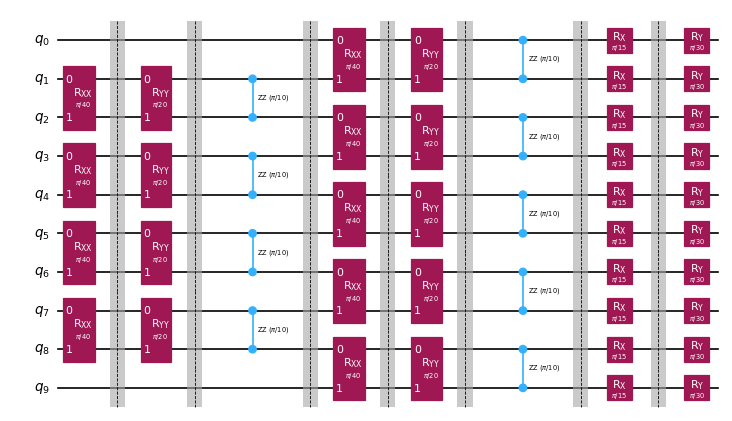

{/* doqumentation-source-hash: 43a12650 */}

import TutorialFeedback from '@site/src/components/TutorialFeedback';

<OpenInLabBanner notebookPath="qiskit-addons/obp/01_getting_started.ipynb" />


La rétropropagation d'opérateurs est une technique qui consiste à absorber des opérations depuis la fin d'un circuit quantique dans un opérateur de Pauli, réduisant généralement la profondeur du circuit au prix de termes supplémentaires dans l'opérateur. L'objectif est de rétropropager autant que possible à travers le circuit sans laisser l'opérateur devenir trop grand.

Une façon de permettre une rétropropagation plus profonde dans le circuit, tout en empêchant l'opérateur de devenir trop grand, est de tronquer les termes avec de petits coefficients, plutôt que de les ajouter à l'opérateur. Tronquer des termes peut entraîner moins de circuits quantiques à exécuter, mais cela introduit une certaine erreur dans le calcul final de la valeur d'espérance proportionnelle à la magnitude des coefficients des termes tronqués.
Dans ce tutoriel, tu vas implémenter un [modèle Qiskit](https://quantum.cloud.ibm.com/docs/guides/serverless#qiskit-patterns-with-quantum-serverless) pour simuler la dynamique quantique d'une chaîne de spins de Heisenberg en utilisant la rétropropagation d'opérateurs :

- **Étape 1 : Correspondance avec le problème quantique**
    - Faire correspondre le Hamiltonien à évolution temporelle à un circuit quantique
- **Étape 2 : Optimiser le problème**
    - Découper le circuit en tranches
    - <font color="#0F62FE">Rétropropager les tranches du circuit sur une observable de Pauli</font>
    - Combiner les tranches restantes en un circuit unique
    - Transpiler le circuit pour le Backend
- **Étape 3 : Exécuter les expériences**
    - Calculer la valeur d'espérance en utilisant le circuit réduit et l'observable étendue avec un [StatevectorEstimator](https://quantum.cloud.ibm.com/docs/api/qiskit/qiskit.primitives.StatevectorEstimator) pour des raisons de simplicité dans ce notebook
- **Étape 4 : Reconstruire les résultats**
    - N/A

**Remarque :** Qiskit décrit de façon générale les [couches](https://quantum.cloud.ibm.com/docs/api/qiskit/qiskit.dagcircuit.DAGCircuit) comme des partitions de profondeur 1 du circuit sur tous les qubits. Ce package utilise le terme **tranches** pour décrire des couches de profondeur arbitraire. La fonction [qiskit_addon_obp.backpropagate](https://qiskit.github.io/qiskit-addon-obp/stubs/qiskit_addon_obp.backpropagate.html) est conçue pour rétropropager des tranches entières à la fois, donc le choix de la façon de découper le circuit quantique peut avoir un impact majeur sur l'efficacité de la rétropropagation pour un problème donné. Tu en apprendras plus sur les **tranches** ci-dessous.
## Étape 1 : Correspondance avec le problème quantique {#step-1-map-to-quantum-problem}
### Faire correspondre l'évolution temporelle d'un modèle de Heisenberg quantique à une expérience quantique. {#map-the-time-evolution-of-a-quantum-heisenberg-model-to-a-quantum-experiment}

Le package [qiskit_addon_utils](https://qiskit.github.io/qiskit-addon-utils/) fournit des fonctionnalités réutilisables à diverses fins.

Son module [qiskit_addon_utils.problem_generators](https://qiskit.github.io/qiskit-addon-utils/stubs/qiskit_addon_utils.problem_generators.html) fournit des fonctions pour générer des Hamiltoniens de type Heisenberg sur un graphe de connectivité donné.
Ce graphe peut être soit un [rustworkx.PyGraph](https://www.rustworkx.org/apiref/rustworkx.PyGraph.html) soit une [CouplingMap](https://quantum.cloud.ibm.com/docs/api/qiskit/qiskit.transpiler.CouplingMap), ce qui le rend facile à utiliser dans des flux de travail centrés sur Qiskit.

Dans ce qui suit, nous générons d'abord une `CouplingMap` heavy-hex à partir de laquelle nous découpons une chaîne linéaire de 10 qubits. Note que les indices de cette nouvelle `reduced_coupling_map` sont à nouveau basés sur zéro.

```python
# Added by doQumentation — required packages for this notebook
!pip install -q numpy qiskit qiskit-addon-obp qiskit-addon-utils qiskit-ibm-runtime rustworkx
```

```python
from qiskit.transpiler import CouplingMap

coupling_map = CouplingMap.from_heavy_hex(3, bidirectional=False)

# Choose a 10-qubit linear chain on this coupling map
reduced_coupling_map = coupling_map.reduce([0, 13, 1, 14, 10, 16, 5, 12, 8, 18])
```

```python
from rustworkx.visualization import graphviz_draw

graphviz_draw(reduced_coupling_map.graph, method="circo")
```


Ensuite, nous générons un opérateur de Pauli modélisant un Hamiltonien XYZ de Heisenberg.

$$\hat{H} = \sum_{(j,k)\in E} (J_{x} \sigma_j^{x} \sigma_{k}^{x} +
    J_{y} \sigma_j^{y} \sigma_{k}^{y} + J_{z} \sigma_j^{z} \sigma_{k}^{z}) +
    \sum_{j\in V} (h_{x} \sigma_j^{x} + h_{y} \sigma_j^{y} + h_{z} \sigma_j^{z})$$

Où $G(V,E)$ est le graphe de la carte de couplage fournie.

```python
import numpy as np
from qiskit_addon_utils.problem_generators import generate_xyz_hamiltonian

# Get a qubit operator describing the Heisenberg XYZ model
hamiltonian = generate_xyz_hamiltonian(
    reduced_coupling_map,
    coupling_constants=(np.pi / 8, np.pi / 4, np.pi / 2),
    ext_magnetic_field=(np.pi / 3, np.pi / 6, np.pi / 9),
)
print(hamiltonian)
```

```text
SparsePauliOp(['IIIIIIIXXI', 'IIIIIIIYYI', 'IIIIIIIZZI', 'IIIIIXXIII', 'IIIIIYYIII', 'IIIIIZZIII', 'IIIXXIIIII', 'IIIYYIIIII', 'IIIZZIIIII', 'IXXIIIIIII', 'IYYIIIIIII', 'IZZIIIIIII', 'IIIIIIIIXX', 'IIIIIIIIYY', 'IIIIIIIIZZ', 'IIIIIIXXII', 'IIIIIIYYII', 'IIIIIIZZII', 'IIIIXXIIII', 'IIIIYYIIII', 'IIIIZZIIII', 'IIXXIIIIII', 'IIYYIIIIII', 'IIZZIIIIII', 'XXIIIIIIII', 'YYIIIIIIII', 'ZZIIIIIIII', 'IIIIIIIIIX', 'IIIIIIIIIY', 'IIIIIIIIIZ', 'IIIIIIIIXI', 'IIIIIIIIYI', 'IIIIIIIIZI', 'IIIIIIIXII', 'IIIIIIIYII', 'IIIIIIIZII', 'IIIIIIXIII', 'IIIIIIYIII', 'IIIIIIZIII', 'IIIIIXIIII', 'IIIIIYIIII', 'IIIIIZIIII', 'IIIIXIIIII', 'IIIIYIIIII', 'IIIIZIIIII', 'IIIXIIIIII', 'IIIYIIIIII', 'IIIZIIIIII', 'IIXIIIIIII', 'IIYIIIIIII', 'IIZIIIIIII', 'IXIIIIIIII', 'IYIIIIIIII', 'IZIIIIIIII', 'XIIIIIIIII', 'YIIIIIIIII', 'ZIIIIIIIII'],
              coeffs=[0.39269908+0.j, 0.78539816+0.j, 1.57079633+0.j, 0.39269908+0.j,
 0.78539816+0.j, 1.57079633+0.j, 0.39269908+0.j, 0.78539816+0.j,
 1.57079633+0.j, 0.39269908+0.j, 0.78539816+0.j, 1.57079633+0.j,
 0.39269908+0.j, 0.78539816+0.j, 1.57079633+0.j, 0.39269908+0.j,
 0.78539816+0.j, 1.57079633+0.j, 0.39269908+0.j, 0.78539816+0.j,
 1.57079633+0.j, 0.39269908+0.j, 0.78539816+0.j, 1.57079633+0.j,
 0.39269908+0.j, 0.78539816+0.j, 1.57079633+0.j, 1.04719755+0.j,
 0.52359878+0.j, 0.34906585+0.j, 1.04719755+0.j, 0.52359878+0.j,
 0.34906585+0.j, 1.04719755+0.j, 0.52359878+0.j, 0.34906585+0.j,
 1.04719755+0.j, 0.52359878+0.j, 0.34906585+0.j, 1.04719755+0.j,
 0.52359878+0.j, 0.34906585+0.j, 1.04719755+0.j, 0.52359878+0.j,
 0.34906585+0.j, 1.04719755+0.j, 0.52359878+0.j, 0.34906585+0.j,
 1.04719755+0.j, 0.52359878+0.j, 0.34906585+0.j, 1.04719755+0.j,
 0.52359878+0.j, 0.34906585+0.j, 1.04719755+0.j, 0.52359878+0.j,
 0.34906585+0.j])
```

À partir de l'opérateur qubit, nous pouvons générer un circuit quantique qui modélise son évolution temporelle.
Une fois encore, le module [qiskit_addon_utils.problem_generators](https://qiskit.github.io/qiskit-addon-utils/stubs/qiskit_addon_utils.problem_generators.html) vient à la rescousse avec une fonction pratique pour faire exactement cela :

```python
from qiskit.synthesis import LieTrotter
from qiskit_addon_utils.problem_generators import generate_time_evolution_circuit

circuit = generate_time_evolution_circuit(
    hamiltonian,
    time=0.2,
    synthesis=LieTrotter(reps=2),
)
circuit.draw("mpl", style="iqp", scale=0.6)
```


## Étape 2 : Optimiser le problème {#step-2-optimize-the-problem}
### Créer des tranches de circuit pour la rétropropagation {#create-circuit-slices-to-backpropagate}

Souviens-toi que la fonction ``backpropagate`` rétropropagera des tranches de circuit entières à la fois, donc le choix de la façon de découper peut avoir un impact sur l'efficacité de la rétropropagation pour un problème donné. Ici, nous allons regrouper les Gate du même type en tranches en utilisant la fonction [slice_by_gate_types](https://qiskit.github.io/qiskit-addon-utils/stubs/qiskit_addon_utils.slicing.slice_by_gate_types.html).

Pour une discussion plus détaillée sur le découpage de circuits, consulte ce [guide pratique](https://qiskit.github.io/qiskit-addon-utils/how_tos/create_circuit_slices.html) du package [qiskit-addon-utils](https://qiskit.github.io/qiskit-addon-utils/index.html).

```python
from qiskit_addon_utils.slicing import slice_by_gate_types

slices = slice_by_gate_types(circuit)
print(f"Separated the circuit into {len(slices)} slices.")
```

```text
Separated the circuit into 18 slices.
```

### Contraindre la croissance de l'opérateur pendant la rétropropagation {#constrain-how-large-the-operator-may-grow-during-backpropagation}

Pendant la rétropropagation, le nombre de termes dans l'opérateur tendra généralement à approcher $4^N$ rapidement, où $N$ est le nombre de qubits. La taille de l'opérateur peut être bornée en spécifiant l'argument ``operator_budget`` de la fonction ``backpropagate``, qui accepte une instance d'[OperatorBudget](https://qiskit.github.io/qiskit-addon-obp/stubs/qiskit_addon_obp.utils.simplify.OperatorBudget.html).

Ici, nous spécifions que la rétropropagation doit s'arrêter lorsque le nombre de groupes de Pauli commutatifs qubit-par-qubit dans l'opérateur dépasse 8.

```python
from qiskit_addon_obp.utils.simplify import OperatorBudget

op_budget = OperatorBudget(max_qwc_groups=8)
```

### Rétropropager des tranches depuis le circuit {#backpropagate-slices-from-the-circuit}

D'abord, nous allons spécifier l'observable Pauli-Z sur le qubit 0, et nous allons rétropropager des tranches depuis le circuit d'évolution temporelle jusqu'à ce que les termes dans l'observable ne puissent plus être combinés en 8 groupes de Pauli commutatifs qubit-par-qubit ou moins.

Tu verras ci-dessous que nous avons rétropropagé 7 tranches mais n'avons utilisé que 6 des 8 groupes de Pauli alloués. Cela implique que rétropropager une tranche de plus ferait dépasser le nombre de groupes de Pauli 8. Nous pouvons vérifier que c'est bien le cas en inspectant les métadonnées retournées.

```python
from qiskit.quantum_info import SparsePauliOp
from qiskit_addon_obp import backpropagate
from qiskit_addon_utils.slicing import combine_slices

# Specify a single-qubit observable
observable = SparsePauliOp("IIIIIIIIIZ")

# Backpropagate slices onto the observable
bp_obs, remaining_slices, metadata = backpropagate(observable, slices, operator_budget=op_budget)
# Recombine the slices remaining after backpropagation
bp_circuit = combine_slices(remaining_slices, include_barriers=True)

print(f"Backpropagated {metadata.num_backpropagated_slices} slices.")
print(
    f"New observable has {len(bp_obs.paulis)} terms, which can be combined into {len(bp_obs.group_commuting(qubit_wise=True))} groups."
)
print(
    f"Note that backpropagating one more slice would result in {metadata.backpropagation_history[-1].num_paulis[0]} terms "
    f"across {metadata.backpropagation_history[-1].num_qwc_groups} groups."
)
print("The remaining circuit after backpropagation looks as follows:")
bp_circuit.draw("mpl", scale=0.6)
```

```text
Backpropagated 7 slices.
New observable has 18 terms, which can be combined into 8 groups.
Note that backpropagating one more slice would result in 27 terms across 12 groups.
The remaining circuit after backpropagation looks as follows:
```


Ensuite, nous allons spécifier le même problème avec les mêmes contraintes sur la taille de l'observable en sortie. Cependant, cette fois, nous allouons un budget d'erreur à chaque tranche en utilisant la fonction [setup_budet](https://qiskit.github.io/qiskit-addon-obp/stubs/qiskit_addon_obp.utils.truncating.setup_budget.html). Les termes de Pauli avec de petits coefficients seront tronqués de chaque tranche jusqu'à ce que le budget d'erreur soit atteint, et le budget restant sera ajouté au budget de la tranche suivante.

Pour activer cette troncature, nous devons configurer notre budget d'erreur comme suit :

```python
from qiskit_addon_obp.utils.truncating import setup_budget

truncation_error_budget = setup_budget(max_error_per_slice=0.005)
```

Note qu'en allouant une erreur de `5e-3` par tranche pour la troncature, nous sommes capables de retirer 3 tranches supplémentaires du circuit, tout en restant dans le budget initial de 8 groupes de Pauli commutatifs dans l'observable. Par défaut, `backpropagate` utilise la norme L1 des coefficients tronqués pour borner l'erreur totale due à la troncature. Pour d'autres options, consulte le [guide pratique sur la spécification de p_norm](https://qiskit.github.io/qiskit-addon-obp/how_tos/bound_error_using_p_norm.html).

Dans cet exemple particulier où nous avons rétropropagé 10 tranches, l'erreur de troncature totale ne devrait pas dépasser ``(5e-3 error/slice) * (10 slices) = 5e-2``.
Pour une discussion plus approfondie sur la distribution d'un budget d'erreur sur tes tranches, consulte [ce guide pratique](https://qiskit.github.io/qiskit-addon-obp/how_tos/truncate_operator_terms.html).

```python
# Run the same experiment but truncate observable terms with small coefficients
bp_obs_trunc, remaining_slices_trunc, metadata = backpropagate(
    observable, slices, operator_budget=op_budget, truncation_error_budget=truncation_error_budget
)

# Recombine the slices remaining after backpropagation
bp_circuit_trunc = combine_slices(remaining_slices_trunc, include_barriers=True)

print(f"Backpropagated {metadata.num_backpropagated_slices} slices.")
print(
    f"New observable has {len(bp_obs_trunc.paulis)} terms, which can be combined into {len(bp_obs_trunc.group_commuting(qubit_wise=True))} groups.\n"
    f"After truncation, the error in our observable is bounded by {metadata.accumulated_error(0):.3e}"
)
print(
    f"Note that backpropagating one more slice would result in {metadata.backpropagation_history[-1].num_paulis[0]} terms "
    f"across {metadata.backpropagation_history[-1].num_qwc_groups} groups."
)
print("The remaining circuit after backpropagation looks as follows:")
bp_circuit_trunc.draw("mpl", scale=0.6)
```

```text
Backpropagated 10 slices.
New observable has 19 terms, which can be combined into 8 groups.
After truncation, the error in our observable is bounded by 4.933e-02
Note that backpropagating one more slice would result in 27 terms across 13 groups.
The remaining circuit after backpropagation looks as follows:
```



### Maintenant que nous avons nos ansatze réduits et nos observables étendues, nous pouvons transpiler nos expériences vers le Backend. {#now-that-we-have-our-reduced-ansatze-and-expanded-observables-we-can-transpile-our-experiments-to-the-backend}

Ici, nous allons utiliser le [FakeMelbourneV2](https://quantum.cloud.ibm.com/docs/api/qiskit-ibm-runtime/fake-provider-fake-melbourne-v2) à 14 qubits de [qiskit-ibm-runtime](https://quantum.cloud.ibm.com/docs/api/qiskit-ibm-runtime) pour démontrer comment transpiler vers un Backend QPU.

```python
from qiskit.transpiler.preset_passmanagers import generate_preset_pass_manager
from qiskit_ibm_runtime.fake_provider import FakeMelbourneV2

# Specify a backend and a pass manager for transpilation
backend = FakeMelbourneV2()
pm = generate_preset_pass_manager(backend=backend, optimization_level=1)

# Transpile original experiment
circuit_isa = pm.run(circuit)
observable_isa = observable.apply_layout(circuit_isa.layout)

# Transpile backpropagated experiment
bp_circuit_isa = pm.run(bp_circuit)
bp_obs_isa = bp_obs.apply_layout(bp_circuit_isa.layout)

# Transpile the backpropagated experiment with truncated observable terms
bp_circuit_trunc_isa = pm.run(bp_circuit_trunc)
bp_obs_trunc_isa = bp_obs_trunc.apply_layout(bp_circuit_trunc_isa.layout)
```

## Étape 3 : Exécuter les expériences quantiques {#step-3-execute-quantum-experiments}
### Calculer la valeur d'espérance {#calculate-expectation-value}

Enfin, nous pouvons exécuter les expériences rétropropagées et les comparer avec l'expérience complète en utilisant le [StatevectorEstimator](https://quantum.cloud.ibm.com/docs/api/qiskit/qiskit.primitives.StatevectorEstimator) sans bruit. Nous pouvons voir que la valeur d'espérance rétropropagée sans troncature est équivalente à la valeur exacte dans les limites de la précision numérique.

La valeur d'espérance sur l'opérateur avec des termes tronqués présente une certaine erreur de l'ordre de ``1e-4``, ce qui est dans la tolérance attendue.

**Remarque :** Nous utilisons un Estimator primitif basé sur les vecteurs d'état pour illustrer l'effet de la troncature sur la sortie. Pour exécuter sur le Backend vers lequel les expériences ont été transpilées à l'étape 2, il faudrait importer l'[EstimatorV2](https://quantum.cloud.ibm.com/docs/api/qiskit-ibm-runtime/estimator-v2) depuis ``qiskit-ibm-runtime`` et passer l'instance du Backend dans le constructeur.

```python
from qiskit.primitives import StatevectorEstimator as Estimator

estimator = Estimator()

# Run the experiments using Estimator primitive
result_exact = estimator.run([(circuit_isa, observable_isa)]).result()[0].data.evs.item()
result_bp = estimator.run([(bp_circuit_isa, bp_obs_isa)]).result()[0].data.evs.item()
result_bp_trunc = (
    estimator.run([(bp_circuit_trunc_isa, bp_obs_trunc_isa)]).result()[0].data.evs.item()
)

print(f"Exact expectation value: {result_exact}")
print(f"Backpropagated expectation value: {result_bp}")
print(f"Backpropagated expectation value with truncation: {result_bp_trunc}")
print(f"    - Expected Error for truncated observable: {metadata.accumulated_error(0):.3e}")
print(f"    - Observed Error for truncated observable: {abs(result_exact - result_bp_trunc):.3e}")
```

```text
Exact expectation value: 0.8854160687717507
Backpropagated expectation value: 0.8854160687717532
Backpropagated expectation value with truncation: 0.8850236647156059
    - Expected Error for truncated observable: 4.933e-02
    - Observed Error for truncated observable: 3.924e-04
```

<TutorialFeedback />
