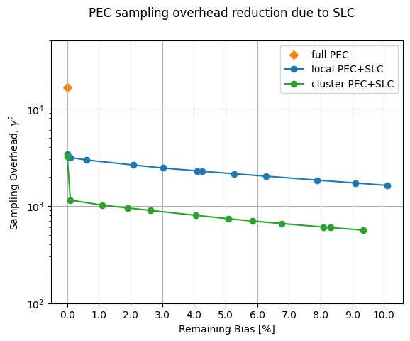

{/* doqumentation-source-hash: d7518943 */}

import TutorialFeedback from '@site/src/components/TutorialFeedback';

<OpenInLabBanner notebookPath="qiskit-addons/slc/01_getting_started.ipynb" />


## Contexte {#background}
Ce tutoriel montre comment atténuer les erreurs en utilisant l'addon Shaded lightcone (SLC). Cet addon est une évolution de la [technique d'annulation probabiliste des erreurs (PEC)](https://quantum.cloud.ibm.com/docs/guides/error-mitigation-and-suppression-techniques#probabilistic-error-cancellation-pec), dans laquelle un utilisateur apprend le bruit des couches uniques d'un Circuit, puis annule ce bruit en appliquant des portes à un seul Qubit et des techniques de post-traitement. Comparée à d'autres méthodes, la PEC offre des limites plus robustes sur le biais du résultat atténué, mais tend à souffrir d'un coût plus élevé en termes de temps QPU. Lors de la PEC, pour compenser l'atténuation de la valeur d'espérance par le bruit, le résultat moyen est redimensionné par un facteur $\gamma = \exp(\sum_{l,\sigma} 2\lambda_{l,\sigma})$, où $\lambda_{l,\sigma}$ est le taux de bruit appris de l'erreur Pauli $\sigma$ à la couche $l$ dans le Circuit. Ce redimensionnement augmente la variance d'un facteur $\gamma^2$, et multiplie ainsi également le nombre d'exécutions de Circuit nécessaires sur le QPU par $\gamma^2$, ce que nous appelons le coût d'échantillonnage ou la surcharge d'échantillonnage. Parce que $\gamma$ croît de façon exponentielle, la PEC est souvent limitée aux circuits peu profonds ou à peu de Qubits. En savoir plus sur la PEC dans [Probabilistic error cancellation with sparse Pauli-Lindblad models on noisy quantum processors.](https://arxiv.org/abs/2201.09866) 

Si tu peux identifier les erreurs qui n'ont pas besoin d'être atténuées, tu peux réduire ce coût d'échantillonnage de façon exponentielle. Une première étape dans cette direction est la mise en œuvre d'une atténuation des erreurs localement consciente, qui utilise un « cône de lumière » conventionnel rapidement calculable pour réduire la surcharge PEC en limitant la sensibilité d'un observable aux erreurs dans tout le Circuit, étendant la faisabilité de la PEC à des échelles plus grandes pour certains problèmes. Les erreurs en dehors de ce cône de lumière ne peuvent pas affecter le résultat mesuré et peuvent donc être exclues de la procédure d'annulation des erreurs. Cette exclusion diminue la surcharge d'échantillonnage, dans certains cas de façon substantielle, sans introduire de biais supplémentaire. En particulier, pour mesurer un observable local $O$ d'un Circuit de profondeur fixe, la surcharge d'échantillonnage requise finit par atteindre un plateau lors du passage à l'échelle du nombre de Qubits dans le Circuit (voir Fig. 2b dans [Locality and Error Mitigation of Quantum Circuits.](https://arxiv.org/abs/2303.06496))

Les cônes de lumière ombrés (SLC) vont plus loin, en utilisant des simulations classiques pour limiter plus précisément la sensibilité aux erreurs dans tout le Circuit. Cela échange du temps QPU contre du temps CPU et réduit la surcharge d'échantillonnage nécessaire pour renormaliser le biais. Au lieu d'une coupure nette, chaque erreur potentielle dans le Circuit se voit attribuer une « ombre » graduée qui borne supérieurement la susceptibilité de l'observable à cette erreur. Cette caractérisation affinée permet des applications plus efficaces et ciblées de la PEC avec une variance réduite, tout en donnant à l'utilisateur la possibilité d'ajuster de façon contrôlable le biais dans l'estimation de l'observable. Voir [Lightcone shading for classically accelerated quantum error mitigation](https://arxiv.org/abs/2409.04401) pour plus de détails.

Notre flux de travail pour l'addon SLC s'appuie sur le nouveau framework Samplomatic et Executor, permettant aux utilisateurs d'avoir un contrôle plus modulaire des paramètres d'exécution pour la suppression et l'atténuation des erreurs, tout en conservant la facilité d'utilisation pour les utilisateurs avancés. Pour une compréhension plus approfondie des avantages de ce framework et de ses fonctionnalités générales, consulte le tutoriel [Hello samplomatic](https://github.com/qiskit-community/qdc-challenges-2025/blob/main/day3_tutorials/Track_A/hello_samplomatic/Samplomatic%20-%20Hello%20World.ipynb).

### Flux de travail pour l'ombrage du cône de lumière, l'apprentissage du bruit et l'injection d'anti-bruit {#workflow-for-lightcone-shading-noise-learning-and-anti-noise-injection}
Pour modéliser le bruit du QPU, nous avons choisi d'utiliser un modèle de bruit Pauli-Lindblad épars avec des taux d'erreur Pauli à 1 et 2 Qubits, générés localement sur chaque Qubit et chaque arête du dispositif. Avec ce choix, le flux de travail d'atténuation des erreurs SLC présenté dans ce tutoriel est le suivant :

a. CPU — Borner l'impact par erreur des erreurs Pauli à 1 et 2 Qubits

  1. Propagation en avant (borne l'effet sur l'observable). Propage chaque erreur jusqu'à la fin du Circuit et calcule son commutateur avec l'observable.  
      - Tronque les termes opérateurs pendant l'évolution pour garder le calcul tractable.  
      - Resserre davantage ces bornes par une rétropropagation lâche de l'observable basée sur des limites de vitesse quantique.
  2. Propagation en arrière (borne l'effet sur l'état initial). Propage chaque erreur jusqu'au début du Circuit et calcule son commutateur avec l'état initial.

b. QPU — Apprendre les taux de bruit. Utilise `NoiseLearner` pour estimer les taux du modèle de bruit Pauli-Lindblad.

c. CPU — Prioriser l'atténuation

  1. Mettre à jour les bornes fusionnées avec les taux de bruit appris. Combine les bornes en avant et en arrière précédemment calculées et les met à jour avec les taux de bruit appris.  
  2. Classer les composantes de bruit à atténuer en utilisant les bornes calculées et les taux appris. Priorise chaque erreur de bruit possible en fonction de son impact estimé sur le biais et du coût associé à sa correction. 

d. QPU — Insérer l'anti-bruit et exécuter. Exécute le Circuit d'intérêt avec l'anti-bruit (inverse du bruit) spécifié en utilisant des annotations `Box`.

e. CPU — Estimer l'observable. Calcule la valeur d'espérance, en appliquant une post-sélection basée sur les mesures pour réduire l'impact du bruit non markovien.

### Vue d'ensemble de l'apprentissage du bruit {#noise-learning-overview}
L'apprentissage du bruit est une étape commune à plusieurs méthodes d'atténuation des erreurs, réalisée par le [NoiseLearner](https://quantum.cloud.ibm.com/docs/en/guides/noise-learning), et peut être observé dans notre tutoriel [PEA error mitigation](https://quantum.cloud.ibm.com/docs/tutorials/probabilistic-error-amplification), ainsi que dans notre [tutoriel Propagated noise absorption (PNA)](https://github.com/qiskit-community/qdc-challenges-2025/blob/main/day3_tutorials/Track_A/pna/propagated_noise_absorption.ipynb). Dans `NoiseLearnerV3`, un utilisateur peut spécifiquement identifier les couches de bruit à apprendre comme des objets [`CircuitInstruction`](https://quantum.cloud.ibm.com/docs/api/qiskit/qiskit.circuit.CircuitInstruction), ce qui permet aux utilisateurs de calculer les bornes de bruit SLC souhaitées pour chaque couche de la manière décrite ci-dessus. Le modèle Pauli-Lindblad appris fournit des coefficients à utiliser dans la priorisation PEC-SLC. La façon dont les Gates sont rassemblées en couches peut être déterminée en utilisant les fonctions pratiques `generate_boxing_pass_manager` et `unique_2q_instructions`, puis alimentées dans la fonction utilitaire SLC `generate_noise_model_paulis`, comme décrit à l'Étape 2 ci-dessous.

| **Partie 1** | **Partie 2** | **Partie 3** |
|-----------|-----------|-----------|
| Twirl Pauli des couches de Gates à 2 Qubits | Répéter les paires de couches identité et apprendre le bruit | Dériver une fidélité (erreur pour chaque canal de bruit) |
|  |  |  |

### Vue d'ensemble du post-traitement {#post-processing-overview}
Après exécution sur du matériel quantique en utilisant le framework Samplomatic et Executor, nous convertissons nos mesures de chaînes de bits en la valeur d'observable souhaitée. Dans le cas de notre Circuit Ising en miroir, nous obtiendrons idéalement un observable mesuré de 1, car tous les Qubits devraient idéalement revenir à leur point de départ $\ket{0}$. Lors du calcul de la valeur d'observable avec notre fonction `expectation_values`, nous appliquerons quelques techniques de post-traitement qui réduisent l'impact du bruit. Cela comprend la suppression des mesures affectées par le bruit non markovien, l'atténuation des erreurs de lecture, ainsi que la prise en compte des détails de notre implémentation PEC. Les détails sont abordés à l'Étape 4 ci-dessous.
## Requirements
Avant de commencer ce tutoriel, assure-toi d'avoir installé les packages suivants :

- Qiskit IBM Runtime avec la primitive Executor (`pip install "qiskit-ibm-runtime @ git+https://github.com/Qiskit/qiskit-ibm-runtime.git"`)
- Qiskit addon Shaded lightcone 0.1 (`pip install "qiskit-addon-slc~=0.1.0`")
- Qiskit addon utils (`pip install "qiskit-addon-utils~=0.3.0"`)
- Samplomatic v0.16 ou plus (`pip install samplomatic`)
- Support de visualisation Qiskit (`pip install "qiskit[visualization]"`)
## Step 0. Setup
Commence par importer les packages et les fonctions nécessaires pour exécuter ce notebook correctement.

```python
# Added by doQumentation — required packages for this notebook
!pip install -q matplotlib numpy qiskit qiskit-addon-slc qiskit-addon-utils qiskit-ibm-runtime samplomatic
```

```python
import logging

logging.basicConfig(level=logging.INFO, format="%(asctime)s %(levelname)s %(module)s %(message)s")

# Setting this value prevents itertools.starmap deadlock on UNIX systems
from multiprocessing import set_start_method

set_start_method("spawn")

# Needed to prevent PySCF from parallelizing internally (SLC only)
%set_env OMP_NUM_THREADS=1
```

```text
env: OMP_NUM_THREADS=1
```

```python
import pickle

import numpy as np
import samplomatic
from matplotlib import pyplot as plt
from qiskit import QuantumCircuit
from qiskit.quantum_info import SparsePauliOp
from qiskit.transpiler import PassManager, generate_preset_pass_manager
from qiskit_addon_slc.bounds import (
    compute_backward_bounds,
    compute_forward_bounds,
    compute_local_scales,
    merge_bounds,
    tighten_with_speed_limit,
)
from qiskit_addon_slc.utils import generate_noise_model_paulis, map_modifier_ref_to_ref
from qiskit_addon_slc.visualization import draw_shaded_lightcone
from qiskit_addon_utils.exp_vals.expectation_values import executor_expectation_values
from qiskit_addon_utils.exp_vals.measurement_bases import get_measurement_bases
from qiskit_addon_utils.noise_management import gamma_from_noisy_boxes, trex_factors
from qiskit_addon_utils.noise_management.post_selection import PostSelector
from qiskit_addon_utils.noise_management.post_selection.transpiler.passes import (
    AddPostSelectionMeasures,
    AddSpectatorMeasures,
)
from qiskit_ibm_runtime import Executor, QiskitRuntimeService, QuantumProgram
from qiskit_ibm_runtime.noise_learner_v3 import NoiseLearnerV3
from qiskit_ibm_runtime.options import NoiseLearnerV3Options
from samplomatic.transpiler import generate_boxing_pass_manager
from samplomatic.utils import find_unique_box_instructions
```
## Étape 1. Modéliser le problème {#step-1-map-the-problem}
Pour faciliter la démonstration, nous choisissons une chaîne d'Ising miroir à 1D. La chaîne d'Ising à 1D produit une structure de Circuit bien dense, ce qui est pratique pour illustrer les implémentations de la PEC. Un Circuit miroir permet de connaître facilement le résultat attendu (c'est-à-dire qu'on doit mesurer un observable de 1).

De plus, nous voulons exécuter un Circuit miroir ; ainsi, pour chaque Gate dans la seconde moitié du Circuit, il doit y avoir une Gate inverse dans la première moitié. Comme l'observable mesurée **$<X_6 Z_{13}>$** comporte des mesures en dehors de la base Z, et que l'executor prend en compte la base souhaitée en fin de Circuit, nous fournissons une fonction `prepare_basis` qui insère les Gates appropriées au début du Circuit miroir. Ce détail est propre à notre démonstration avec Circuit miroir. La fonction `get_measurement_bases` nous permet d'identifier facilement quelles Gates sont nécessaires et où les ajouter, tout en gardant une trace des subtilités d'indexation des Qubit découlant des conventions de l'annotation `box` comme discuté dans la section « Préparer les mesures en bases canoniques ».

```python
num_qubits = 20
target_obs_sparse = [("XZ", [6, 13], 1.0)]
```

```python
observable = SparsePauliOp.from_sparse_list(target_obs_sparse, num_qubits=num_qubits)
```

```python
bases_virt, reverser_virt = get_measurement_bases(observable)
```

```python
num_trotter_steps = 10
rx_angle = np.pi / 4
```

```python
def construct_ising_circuit(
    num_qubits: int, num_trotter_steps: int, rx_angle: float, barrier: bool = True
) -> QuantumCircuit:
    circuit = QuantumCircuit(num_qubits)

    for _step in range(num_trotter_steps):
        circuit.rx(rx_angle, range(num_qubits))
        if barrier:
            circuit.barrier()
        for first_qubit in (1, 2):
            for idx in range(first_qubit, num_qubits, 2):
                # equivalent to Rzz(-pi/2):
                circuit.sdg([idx - 1, idx])
                circuit.cz(idx - 1, idx)
        if barrier:
            circuit.barrier()

    return circuit

def prepare_basis(circuit: QuantumCircuit, basis: list[int]) -> QuantumCircuit:
    # basis is a list of integer values from 0 to 3. These map to the basis measurement as:
    # 0 = I; 1 = Z; 2 = X; 3 = Y
    assert len(basis) == circuit.num_qubits

    out_circ = circuit.copy_empty_like()
    for qb, bas in enumerate(basis):
        if bas in {0, 1}:
            continue
        if bas == 2:
            out_circ.h(qb)
        elif bas == 3:
            out_circ.rx(-np.pi / 2, qb)

    out_circ.barrier()
    out_circ.compose(circuit, inplace=True)
    return out_circ

def mirror_circuit(circuit: QuantumCircuit, *, inverse_first: bool = False) -> QuantumCircuit:
    mirror_circ = circuit.copy_empty_like()
    mirror_circ.compose(circuit.inverse() if inverse_first else circuit, inplace=True)
    mirror_circ.barrier()
    mirror_circ.compose(circuit if inverse_first else circuit.inverse(), inplace=True)
    mirror_circ.measure_active()
    return mirror_circ
```

```python
# Instantiate circuit
circuit = construct_ising_circuit(num_qubits, num_trotter_steps, rx_angle, barrier=False)
mirrored_circuit = mirror_circuit(circuit, inverse_first=True)
mirrored_circuit = prepare_basis(mirrored_circuit, bases_virt[0])
```

```python
mirrored_circuit.draw("mpl", fold=-1, scale=0.3, idle_wires=False, measure_arrows=False)
```


## Étape 2. Optimiser {#step-2-optimize}
Nous allons optimiser les détails associés au circuit à exécuter, à l'observable à mesurer et aux paramètres d'apprentissage du bruit. Pour commencer, nous nous assurons d'instancier un backend avec les portes fractionnaires activées comme option. Ces portes fractionnaires permettront une plus grande sensibilité dans certains de nos filtrages de post-sélection.

```python
token = "<YOUR_TOKEN>"
instance = "<YOUR_INSTANCE>"

# This is used to retrieve shared results
shared_service = QiskitRuntimeService(
    channel="ibm_quantum_platform",
    token=token,
    instance=instance,
)

# This is used to run on real hardware
service = service = QiskitRuntimeService()
```

```text
qiskit_runtime_service._discover_account:WARNING:2025-11-10 11:19:40,108: Loading account with the given token. A saved account will not be used.
```

```python
backend = service.backend("ibm_kingston", use_fractional_gates=True)
```

Tout d'abord, nous allons transpiler notre circuit en instructions ISA, [comme requis pour l'exécution sur nos QPUs](https://www.ibm.com/quantum/blog/isa-circuits). Pour les données collectées dans cette expérience, nous sélectionnons manuellement nos Qubits en nous basant sur l'évaluation de la chaîne de meilleure qualité.

```python
layout = [44, 45, 46, 47, 57, 67, 68, 69, 78, 89, 88, 87, 97, 107, 106, 105, 104, 103, 96, 83]
```

```python
isa_pm = generate_preset_pass_manager(backend=backend, initial_layout=layout, optimization_level=0)

isa_circuit = isa_pm.run(mirrored_circuit)
assert isa_circuit.layout.final_index_layout() == layout

isa_observable = observable.apply_layout(layout, num_qubits=isa_circuit.num_qubits)
```

```text
2025-11-10 11:19:57,810 INFO base_tasks Pass: ContainsInstruction - 0.00715 (ms)
2025-11-10 11:19:57,811 INFO base_tasks Pass: UnitarySynthesis - 0.00525 (ms)
2025-11-10 11:19:57,811 INFO base_tasks Pass: HighLevelSynthesis - 0.02599 (ms)
2025-11-10 11:19:57,811 INFO base_tasks Pass: BasisTranslator - 0.09131 (ms)
2025-11-10 11:19:57,811 INFO base_tasks Pass: SetLayout - 0.02623 (ms)
2025-11-10 11:19:57,812 INFO base_tasks Pass: FullAncillaAllocation - 0.14400 (ms)
2025-11-10 11:19:57,812 INFO base_tasks Pass: EnlargeWithAncilla - 0.06318 (ms)
2025-11-10 11:19:57,813 INFO base_tasks Pass: ApplyLayout - 0.29802 (ms)
2025-11-10 11:19:57,813 INFO base_tasks Pass: CheckMap - 0.07820 (ms)
2025-11-10 11:19:57,814 INFO base_tasks Pass: FilterOpNodes - 0.33283 (ms)
2025-11-10 11:19:57,814 INFO base_tasks Pass: UnitarySynthesis - 0.00691 (ms)
2025-11-10 11:19:57,814 INFO base_tasks Pass: HighLevelSynthesis - 0.13208 (ms)
2025-11-10 11:19:57,816 INFO base_tasks Pass: BasisTranslator - 1.00303 (ms)
2025-11-10 11:19:57,818 INFO base_tasks Pass: FoldRzzAngle - 1.78719 (ms)
2025-11-10 11:19:57,818 INFO base_tasks Pass: ContainsInstruction - 0.00691 (ms)
2025-11-10 11:19:57,818 INFO base_tasks Pass: InstructionDurationCheck - 0.00405 (ms)
```

```python
wire_order = layout + [q for q in range(isa_circuit.num_qubits) if q not in layout]
isa_circuit.draw(
    "mpl", fold=-1, scale=0.3, idle_wires=False, wire_order=wire_order, measure_arrows=False
)
```


### Encadrer le Circuit {#box-the-circuit}
Pour faciliter l'implémentation, nous allons utiliser le pass de transpilation `generate_boxing_pass_manager`, qui place les instructions du Circuit dans des boîtes annotées. Ces boîtes indiquent clairement où, dans le cas de la PEC, l'antinoise doit être injectée dans le Circuit. Pour plus de détails sur les paramètres, consulte la [documentation Samplomatic.](https://qiskit.github.io/samplomatic/)

Note que le workflow SLC nécessite l'utilisation de `inject_noise_strategy="individual_modification"` plus tard dans le processus, car cela nous permet d'identifier de manière unique chaque `BoxOp` dans le Circuit.

La fonction `find_unique_box_instructions` itère à travers le Circuit encadré fourni et identifie ceux qui ont des couches 2Q uniques ou des mesures, dans le but d'apprentissage du bruit et d'injection du bruit.

```python
# Box circuit with Twirl and InjectNoise annotations
boxes_pm = generate_boxing_pass_manager(
    twirling_strategy="active",
    inject_noise_strategy="individual_modification",
    inject_noise_targets="gates",
    measure_annotations="all",
)

boxed_circuit = boxes_pm.run(isa_circuit)

# Find the unique instructions (layers) from boxed circuit
unique_2q_instructions = find_unique_box_instructions(
    boxed_circuit, normalize_annotations=None, undress_boxes=True
)
```

```text
2025-11-10 11:20:01,088 INFO base_tasks Pass: RemoveBarriers - 0.02289 (ms)
2025-11-10 11:20:01,100 INFO base_tasks Pass: GroupGatesIntoBoxes - 12.38990 (ms)
2025-11-10 11:20:01,101 INFO base_tasks Pass: GroupMeasIntoBoxes - 0.47898 (ms)
2025-11-10 11:20:01,104 INFO base_tasks Pass: AddTerminalRightDressedBoxes - 2.88177 (ms)
2025-11-10 11:20:01,111 INFO base_tasks Pass: AddInjectNoise - 6.66904 (ms)
```

```python
boxed_circuit.draw(
    "mpl", fold=-1, scale=0.3, idle_wires=False, wire_order=wire_order, measure_arrows=False
)
```


### Préparer les mesures en bases canoniques {#prepare-canonical-bases-measurements}
En raison de la façon dont les Qubits sont étiquetés lors de l'identification des couches 2Q uniques, il faut prendre soin de garder une trace de l'ordre des Qubits. Ci-dessous, nous introduisons la notion de `canonical_qubits` comme moyen de mettre à jour de manière appropriée l'ordre des Qubits lors de sa fourniture à l'executor, en raison de la façon dont l'ordre des Qubits est capturé lors de l'encadrement des Circuits et de la recherche d'instructions uniques. Consulte la documentation [Convention d'ordre des Qubits](https://qiskit.github.io/samplomatic/guides/samplex_io.html#qubit-ordering-convention) pour plus de détails.

```python
# Determine the canonical qubits order
meas_box = boxed_circuit.data[-1]
canonical_qubits = [
    idx for idx, qubit in enumerate(boxed_circuit.qubits) if qubit in meas_box.qubits
]

# map canonical qubit to physical (isa) qubit
c_2_p = {c: p for c, p in enumerate(canonical_qubits)}
# map physical (isa) qubit to virtual qubit (index in original circuit)
p_2_v = {p: v for v, p in enumerate(layout)}
# compute map between virtual and canonical qubit indices.
c_2_v = {c: p_2_v[p] for c, p in c_2_p.items()}

assert len(c_2_v) == num_qubits

bases_canon = [
    np.array([base_i[c_2_v[c]] for c in range(num_qubits)], dtype=np.uint8) for base_i in bases_virt
]
```
### Workflow pour l'ombrage du cône de lumière, l'apprentissage du bruit et l'injection d'anti-bruit {#workflow-for-lightcone-shading-noise-learning-and-anti-noise-injection}

> **Remarque** : Pour l'implémentation de SLC-PEC dans ce tutoriel, nous effectuons les calculs de bornes SLC **avant** que l'apprentissage du bruit soit terminé, afin que le circuit à atténuer soit exécuté le plus près possible dans le temps du modèle de bruit appris. En principe, ce workflow peut être encore amélioré pour s'exécuter simultanément. En particulier, un job d'apprentissage du bruit est lancé pendant qu'en parallèle, les bornes de bruit sont estimées. Pour un circuit quantique arbitraire, le calcul des bornes de bruit peut évoluer avec une dépendance faiblement exponentielle. Ainsi, il peut être judicieux d'utiliser une exécution parallélisée pour maximiser l'efficacité du workflow. À cette fin, nous le démontrons brièvement en incluant des ressources basées sur des clusters (128 threads) et en montrant comment tu peux obtenir un ensemble de bornes plus raffiné pour un circuit donné lorsque tu es contraint à des limites de temps de calcul égales, comparé à notre laptop (8 threads). De plus, bien que non implémenté dans ce workflow, tu peux paralléliser les exécutions QPU pour l'apprentissage du bruit et les calculs de bornes de bruit afin d'obtenir le workflow le plus efficace possible.

#### Prédire les Paulis du modèle de bruit à apprendre {#predict-to-be-learned-noise-model-paulis}

La fonction `generate_noise_model_paulis` parcourt chaque couche encadrée du circuit fourni et génère tous les termes de Pauli pertinents de poids un et de poids deux, en tenant compte de la connectivité des qubits du circuit, et en sélectionnant les termes pertinents pour les nœuds et arêtes actifs. Ces termes sont ensuite utilisés pour calculer les bornes de bruit avant et arrière.

```python
noise_model_paulis = generate_noise_model_paulis(
    unique_2q_instructions, backend.coupling_map, boxed_circuit
)
```

```python
noise_model_rates = {ref: None for ref in noise_model_paulis}
```

##### a. Calculer et affiner les bornes avant {#a-compute-and-tighten-forward-bounds}

La fonction `compute_forward_bounds` évalue les relations de commutation entre les portes de chaque couche et les termes de Pauli générés ci-dessus, en termes d'impact des erreurs de propagation avant sur l'observable souhaité $A$. Pour les portes qui commutent avec les termes de Pauli, rien n'est fait. Pour les portes Clifford, elles sont poussées vers le début du circuit. Pour les portes non-Clifford, nous approximons leur influence sur les observables cibles afin de les prioriser ultérieurement pour la suppression du bruit (après que toutes les bornes ont été fusionnées). Cette borne est obtenue en appliquant d'abord la norme L2 (c'est-à-dire la racine carrée de la somme des carrés des coefficients des termes de Pauli pertinents). Lorsque trop de termes de qubits sont impliqués, nous revenons à une borne plus lâche qui utilise l'inégalité triangulaire.
#### Ressources au niveau laptop {#laptop-level-resources}

```python
slc_atol = 1e-8
slc_eigval_max_qubits = 18
slc_evolution_max_terms = 1000
slc_num_processes = 8
slc_timeout = 60
```

```python
forward_bounds = compute_forward_bounds(
    boxed_circuit,
    noise_model_paulis,
    isa_observable,
    evolution_max_terms=slc_evolution_max_terms,
    eigval_max_qubits=slc_eigval_max_qubits,
    atol=slc_atol,
    num_processes=slc_num_processes,
    timeout=slc_timeout,
)
```

```text
2025-11-10 11:20:04,344 INFO forward Evolving Pauli error terms forwards through the circuit.
2025-11-10 11:20:04,344 INFO forward Modelling errors as though they happen *after* each noise layer.
2025-11-10 11:20:04,345 INFO remove_measure Removing ANY Measure operations from the provided circuit!
2025-11-10 11:20:04,453 INFO circuit_iter Noisy box 'm39'
2025-11-10 11:20:05,254 INFO circuit_iter Noisy box 'm38'
2025-11-10 11:20:05,304 INFO circuit_iter Noisy box 'm37'
2025-11-10 11:20:05,382 INFO circuit_iter Noisy box 'm36'
2025-11-10 11:20:05,467 INFO circuit_iter Noisy box 'm35'
2025-11-10 11:20:05,580 INFO circuit_iter Noisy box 'm34'
2025-11-10 11:20:05,705 INFO circuit_iter Noisy box 'm33'
2025-11-10 11:20:05,857 INFO circuit_iter Noisy box 'm32'
2025-11-10 11:20:06,034 INFO circuit_iter Noisy box 'm31'
2025-11-10 11:20:06,221 INFO circuit_iter Noisy box 'm30'
2025-11-10 11:20:06,449 INFO circuit_iter Noisy box 'm29'
2025-11-10 11:20:06,724 INFO circuit_iter Noisy box 'm28'
2025-11-10 11:20:07,628 INFO circuit_iter Noisy box 'm27'
2025-11-10 11:20:09,110 INFO circuit_iter Noisy box 'm26'
2025-11-10 11:20:11,696 INFO circuit_iter Noisy box 'm25'
2025-11-10 11:20:16,100 INFO circuit_iter Noisy box 'm24'
2025-11-10 11:20:21,781 INFO circuit_iter Noisy box 'm23'
2025-11-10 11:20:30,244 INFO circuit_iter Noisy box 'm22'
2025-11-10 11:20:40,416 INFO circuit_iter Noisy box 'm21'
2025-11-10 11:20:53,437 INFO circuit_iter Noisy box 'm20'
2025-11-10 11:21:06,038 INFO circuit_iter Noisy box 'm19'
2025-11-10 11:21:06,038 WARNING commutator_bounds Bounds computation timed out.
2025-11-10 11:21:06,039 INFO circuit_iter Noisy box 'm18'
2025-11-10 11:21:06,039 INFO circuit_iter Noisy box 'm17'
2025-11-10 11:21:06,039 INFO circuit_iter Noisy box 'm16'
2025-11-10 11:21:06,040 INFO circuit_iter Noisy box 'm15'
2025-11-10 11:21:06,040 INFO circuit_iter Noisy box 'm14'
2025-11-10 11:21:06,040 INFO circuit_iter Noisy box 'm13'
2025-11-10 11:21:06,040 INFO circuit_iter Noisy box 'm12'
2025-11-10 11:21:06,041 INFO circuit_iter Noisy box 'm11'
2025-11-10 11:21:06,041 INFO circuit_iter Noisy box 'm10'
2025-11-10 11:21:06,041 INFO circuit_iter Noisy box 'm9'
2025-11-10 11:21:06,042 INFO circuit_iter Noisy box 'm8'
2025-11-10 11:21:06,042 INFO circuit_iter Noisy box 'm7'
2025-11-10 11:21:06,042 INFO circuit_iter Noisy box 'm6'
2025-11-10 11:21:06,042 INFO circuit_iter Noisy box 'm5'
2025-11-10 11:21:06,043 INFO circuit_iter Noisy box 'm4'
2025-11-10 11:21:06,043 INFO circuit_iter Noisy box 'm3'
2025-11-10 11:21:06,043 INFO circuit_iter Noisy box 'm2'
2025-11-10 11:21:06,043 INFO circuit_iter Noisy box 'm1'
2025-11-10 11:21:06,044 INFO circuit_iter Noisy box 'm0'
```
#### Visualiser le SLC pour une inspection manuelle {#visualize-the-slc-for-manual-inspection}

Tu peux interpréter le comportement des bornes ombrées en examinant comment les mesures et les termes de Pauli interagissent avec les erreurs locales. Ces motifs sont caractéristiques de ce problème d'évolution temporelle du Hamiltonien d'Ising impulsionnel et apparaissent également dans l'article [Lightcone Shading for Classically Accelerated Quantum Error Mitigation](https://arxiv.org/abs/2409.04401), avec plusieurs caractéristiques révélatrices :

- On peut clairement distinguer les deux cônes provenant des deux Paulis non identité dans l'observable.
- On peut voir que la mesure X sur le Qubit 6 commute avec l'erreur X dans la couche la plus à droite.
- On peut voir que le Pauli Z sur le Qubit 13 commute avec l'erreur Z dans la couche la plus à droite.
- Lorsqu'on atteint le délai d'expiration spécifié ci-dessus, les couches restantes à gauche sont entièrement remplies de bornes triviales de deux.

```python
for p in "XYZ":
    display(
        draw_shaded_lightcone(
            boxed_circuit,
            forward_bounds,
            noise_model_paulis,
            pauli_filter=p,
            scale=0.15,
            fold=-1,
            idle_wires=False,
            wire_order=wire_order,
            measure_arrows=False,
        )
    )
```


#### b. Calculer et resserrer les bornes avant {#b-compute-and-tighten-forward-bounds}
On resserre ensuite les bornes en utilisant la fonction `tighten_with_speed_limit`, qui suit comment l'observable se propage en arrière dans le Circuit et utilise cette propagation pour placer des bornes supérieures sur l'effet de chaque opérateur de bruit, en prenant la plus petite des bornes avant calculées précédemment et de la borne de propagation en arrière.

```python
forward_bounds_tighter = tighten_with_speed_limit(
    forward_bounds, boxed_circuit, noise_model_paulis, isa_observable
)
```

```text
2025-11-10 11:21:08,270 INFO speed_limit Tighting bounds using information propagation speed limits
2025-11-10 11:21:08,270 INFO speed_limit Modelling errors as though they happen *after* each noise layer.
2025-11-10 11:21:08,298 INFO remove_measure Removing ANY Measure operations from the provided circuit!
2025-11-10 11:21:08,310 INFO circuit_iter Noisy box 'm39'
2025-11-10 11:21:08,314 INFO circuit_iter Noisy box 'm38'
2025-11-10 11:21:08,317 INFO circuit_iter Noisy box 'm37'
2025-11-10 11:21:08,319 INFO circuit_iter Noisy box 'm36'
2025-11-10 11:21:08,323 INFO circuit_iter Noisy box 'm35'
2025-11-10 11:21:08,325 INFO circuit_iter Noisy box 'm34'
2025-11-10 11:21:08,328 INFO circuit_iter Noisy box 'm33'
2025-11-10 11:21:08,330 INFO circuit_iter Noisy box 'm32'
2025-11-10 11:21:08,334 INFO circuit_iter Noisy box 'm31'
2025-11-10 11:21:08,336 INFO circuit_iter Noisy box 'm30'
2025-11-10 11:21:08,338 INFO circuit_iter Noisy box 'm29'
2025-11-10 11:21:08,340 INFO circuit_iter Noisy box 'm28'
2025-11-10 11:21:08,344 INFO circuit_iter Noisy box 'm27'
2025-11-10 11:21:08,346 INFO circuit_iter Noisy box 'm26'
2025-11-10 11:21:08,349 INFO circuit_iter Noisy box 'm25'
2025-11-10 11:21:08,351 INFO circuit_iter Noisy box 'm24'
2025-11-10 11:21:08,355 INFO circuit_iter Noisy box 'm23'
2025-11-10 11:21:08,357 INFO circuit_iter Noisy box 'm22'
2025-11-10 11:21:08,360 INFO circuit_iter Noisy box 'm21'
2025-11-10 11:21:08,362 INFO circuit_iter Noisy box 'm20'
2025-11-10 11:21:08,367 INFO circuit_iter Noisy box 'm19'
2025-11-10 11:21:08,369 INFO circuit_iter Noisy box 'm18'
2025-11-10 11:21:08,372 INFO circuit_iter Noisy box 'm17'
2025-11-10 11:21:08,375 INFO circuit_iter Noisy box 'm16'
2025-11-10 11:21:08,378 INFO circuit_iter Noisy box 'm15'
2025-11-10 11:21:08,380 INFO circuit_iter Noisy box 'm14'
2025-11-10 11:21:08,383 INFO circuit_iter Noisy box 'm13'
2025-11-10 11:21:08,386 INFO circuit_iter Noisy box 'm12'
2025-11-10 11:21:08,389 INFO circuit_iter Noisy box 'm11'
2025-11-10 11:21:08,391 INFO circuit_iter Noisy box 'm10'
2025-11-10 11:21:08,394 INFO circuit_iter Noisy box 'm9'
2025-11-10 11:21:08,396 INFO circuit_iter Noisy box 'm8'
2025-11-10 11:21:08,399 INFO circuit_iter Noisy box 'm7'
2025-11-10 11:21:08,401 INFO circuit_iter Noisy box 'm6'
2025-11-10 11:21:08,404 INFO circuit_iter Noisy box 'm5'
2025-11-10 11:21:08,406 INFO circuit_iter Noisy box 'm4'
2025-11-10 11:21:08,410 INFO circuit_iter Noisy box 'm3'
2025-11-10 11:21:08,412 INFO circuit_iter Noisy box 'm2'
2025-11-10 11:21:08,415 INFO circuit_iter Noisy box 'm1'
2025-11-10 11:21:08,417 INFO circuit_iter Noisy box 'm0'
```

#### Visualiser le SLC pour une inspection manuelle {#visualize-the-slc-for-manual-inspection}

On peut resserrer davantage les bornes en tenant compte de la limitation du cône de lumière. En principe, cela nous donne une transition plus douce des bornes calculées aux bornes triviales fixées après l'atteinte du délai d'expiration. Ici, l'effet n'est pas aussi visible car les cônes de lumière ont déjà atteint le bord du Circuit.

```python
for p in "XYZ":
    display(
        draw_shaded_lightcone(
            boxed_circuit,
            forward_bounds_tighter,
            noise_model_paulis,
            pauli_filter=p,
            scale=0.15,
            fold=-1,
            idle_wires=False,
            wire_order=wire_order,
            measure_arrows=False,
        )
    )
```


#### c. Calculer les bornes arrière {#c-compute-backward-bounds}

Cette partie de la prédiction du bruit évalue comment une erreur à une couche particulière peut affecter l'état d'entrée $\rho$. La fonction `compute_backward_bounds` inverse d'abord le circuit, supprime les portes de mesure, puis procède à une analyse similaire à celle effectuée pour les calculs de bornes avant.

```python
backward_bounds = compute_backward_bounds(
    boxed_circuit,
    noise_model_paulis,
    evolution_max_terms=slc_evolution_max_terms,
    num_processes=slc_num_processes,
    timeout=slc_timeout,
)
```

```text
2025-11-10 11:21:10,666 INFO backward Evolving Pauli error terms backwards through the circuit.
2025-11-10 11:21:10,666 INFO backward Modelling errors as though they happen *after* each noise layer.
2025-11-10 11:21:10,667 INFO remove_measure Removing ANY Measure operations from the provided circuit!
2025-11-10 11:21:10,774 INFO circuit_iter Noisy box 'm0'
2025-11-10 11:21:11,640 INFO circuit_iter Noisy box 'm1'
2025-11-10 11:21:11,681 INFO circuit_iter Noisy box 'm2'
2025-11-10 11:21:11,867 INFO circuit_iter Noisy box 'm3'
2025-11-10 11:21:12,078 INFO circuit_iter Noisy box 'm4'
2025-11-10 11:21:12,329 INFO circuit_iter Noisy box 'm5'
2025-11-10 11:21:12,637 INFO circuit_iter Noisy box 'm6'
2025-11-10 11:21:13,110 INFO circuit_iter Noisy box 'm7'
2025-11-10 11:21:13,705 INFO circuit_iter Noisy box 'm8'
2025-11-10 11:21:14,384 INFO circuit_iter Noisy box 'm9'
2025-11-10 11:21:15,213 INFO circuit_iter Noisy box 'm10'
2025-11-10 11:21:15,946 INFO circuit_iter Noisy box 'm11'
2025-11-10 11:21:16,754 INFO circuit_iter Noisy box 'm12'
2025-11-10 11:21:17,557 INFO circuit_iter Noisy box 'm13'
2025-11-10 11:21:18,447 INFO circuit_iter Noisy box 'm14'
2025-11-10 11:21:19,453 INFO circuit_iter Noisy box 'm15'
2025-11-10 11:21:20,472 INFO circuit_iter Noisy box 'm16'
2025-11-10 11:21:21,479 INFO circuit_iter Noisy box 'm17'
2025-11-10 11:21:22,660 INFO circuit_iter Noisy box 'm18'
2025-11-10 11:21:23,705 INFO circuit_iter Noisy box 'm19'
2025-11-10 11:21:24,849 INFO circuit_iter Noisy box 'm20'
2025-11-10 11:21:26,030 INFO circuit_iter Noisy box 'm21'
2025-11-10 11:21:27,111 INFO circuit_iter Noisy box 'm22'
2025-11-10 11:21:28,354 INFO circuit_iter Noisy box 'm23'
2025-11-10 11:21:29,554 INFO circuit_iter Noisy box 'm24'
2025-11-10 11:21:30,897 INFO circuit_iter Noisy box 'm25'
2025-11-10 11:21:32,113 INFO circuit_iter Noisy box 'm26'
2025-11-10 11:21:33,622 INFO circuit_iter Noisy box 'm27'
2025-11-10 11:21:34,962 INFO circuit_iter Noisy box 'm28'
2025-11-10 11:21:36,504 INFO circuit_iter Noisy box 'm29'
2025-11-10 11:21:38,021 INFO circuit_iter Noisy box 'm30'
2025-11-10 11:21:39,750 INFO circuit_iter Noisy box 'm31'
2025-11-10 11:21:41,237 INFO circuit_iter Noisy box 'm32'
2025-11-10 11:21:42,974 INFO circuit_iter Noisy box 'm33'
2025-11-10 11:21:44,527 INFO circuit_iter Noisy box 'm34'
2025-11-10 11:21:46,535 INFO circuit_iter Noisy box 'm35'
2025-11-10 11:21:48,152 INFO circuit_iter Noisy box 'm36'
2025-11-10 11:21:50,074 INFO circuit_iter Noisy box 'm37'
2025-11-10 11:21:51,814 INFO circuit_iter Noisy box 'm38'
2025-11-10 11:21:53,943 INFO circuit_iter Noisy box 'm39'
```

#### Visualiser le SLC pour une inspection manuelle {#visualize-the-slc-for-manual-inspection}

À partir du calcul des bornes arrière, on peut voir comment la structure de l'état initial gouverne le comportement précoce de la propagation des erreurs :

- On peut clairement voir comment les erreurs Z commutent initialement avec l'état initial |0⟩.
- Ce n'est que sur le Qubit 6, où on initialise l'état propre de valeur propre +1 de la base X, qu'une erreur Z ne commute pas, tandis qu'une erreur X commute bien.

```python
for p in "XYZ":
    display(
        draw_shaded_lightcone(
            boxed_circuit,
            backward_bounds,
            noise_model_paulis,
            pauli_filter=p,
            scale=0.15,
            fold=-1,
            idle_wires=False,
            wire_order=wire_order,
            measure_arrows=False,
        )
    )
```


#### Aperçu des bornes fusionnées sans taux de bruit appris {#preview-merged-bounds-without-learned-noise-rates}

La fonction `merged_bounds` détermine le point du circuit où le passage des bornes arrière aux bornes avant minimise le biais total estimé sur l'observable souhaitée. Ce biais est calculé comme la somme des contributions des bornes arrière pour toutes les positions de bruit avant ce point, plus les contributions des bornes avant pour toutes les positions de bruit après celui-ci. Actuellement, cela est fait de manière uniforme pour tous les Qubits.

> **Note importante** : Le point de basculement des bornes avant vers les bornes arrière dépend des taux de bruit appris.

```python
merged_bounds = merge_bounds(
    boxed_circuit,
    forward_bounds_tighter,
    backward_bounds,
    noise_model_rates,
)
```

```text
2025-11-10 11:21:58,304 WARNING merge Missing noise rates. Partitioning backward/forward commutator bounds by assuming uniform error rates.
2025-11-10 11:21:58,305 WARNING merge Optimal spacetime partitioning not implemented!Just partitioning list of noisy boxes.
2025-11-10 11:21:58,305 INFO merge Determined Box idx for partitioning to be 20.
```
### Visualiser le SLC pour une inspection manuelle {#visualize-the-slc-for-manual-inspection}

Après avoir fusionné les bornes arrière et les bornes avant resserrées, le comportement des SLCs combinés devient clair :

- La fonction ci-dessus nous indique qu'une partition est choisie à laquelle s'effectue le passage des bornes arrière aux bornes avant resserrées.
- On peut voir ci-dessous que les SLCs contiennent désormais des bornes arrière partielles et des bornes avant resserrées partielles.

```python
for p in "XYZ":
    display(
        draw_shaded_lightcone(
            boxed_circuit,
            merged_bounds,
            noise_model_paulis,
            pauli_filter=p,
            scale=0.15,
            fold=-1,
            idle_wires=False,
            wire_order=wire_order,
            measure_arrows=False,
        )
    )
```


#### Ressources au niveau du cluster {#cluster-level-resources}
Ici, nous montrons comment l'utilisation de 128 threads sur un cluster nous permet de propager à travers une portion plus importante de ce circuit plus grand, tout en étant limités au même temps de calcul que sur un ordinateur portable.

```python
with open("exp_data/merged_bounds_cluster.pickle", "rb") as file:
    merged_bounds_cluster = pickle.load(file)
```

```python
for p in "XYZ":
    display(
        draw_shaded_lightcone(
            boxed_circuit,
            merged_bounds_cluster,
            noise_model_paulis,
            pauli_filter=p,
            scale=0.15,
            fold=-1,
            idle_wires=False,
            wire_order=wire_order,
            measure_arrows=False,
        )
    )
```


## Étape 3. Exécuter {#step-3-execute}
Dans cette section, nous commençons la partie du flux de travail qui utilise un vrai dispositif quantique. Pour cette méthode d'atténuation des erreurs basée sur l'apprentissage, il y a deux étapes à cela :

1. Apprendre le bruit en utilisant `NoiseLeanerV3`.
2. Exécuter un circuit d'atténuation des erreurs avec le nouveau framework Samplomatic et Estimator.

Avec les erreurs bornées de notre circuit quantique, nous devons apprendre les taux de bruit associés pour prioriser notre budget d'erreur, déterminer les frais généraux d'échantillonnage, et exécuter sur un QPU. De plus, avec ces informations sur les taux de bruit, nous pouvons également mettre en évidence comment, en utilisant les ressources de calcul puissantes de notre cluster, nous réduisons les frais généraux d'échantillonnage tout en maintenant le même biais résiduel.
### a. Apprendre les taux de bruit {#a-learn-noise-rates}

Le noise learner permet de caractériser les processus de bruit affectant les Gates dans un ou plusieurs circuits d'intérêt, en s'appuyant sur le modèle de bruit de Pauli-Lindblad décrit dans l'article [Probabilistic error cancellation with sparse Pauli-Lindblad models on noisy quantum processors](https://arxiv.org/abs/2201.09866). La méthode `run()` lance un job d'apprentissage du bruit pour les couches à 2 Qubits uniques fournies, en fonction des options spécifiées dans la configuration du noise learner. Dans ces options, tu peux ajuster la stratégie de Pauli-twirling, qui aide à s'assurer que le matériel est bien décrit par le modèle de bruit de Pauli-Lindblad.

Les détails de ton modèle de bruit risquent de dériver avec le temps. C'est pourquoi nous définissons un paramètre pour s'assurer que le modèle de bruit appris est recalculé pour les expériences datant de plus de quatre heures. Il s'agit d'une règle empirique approximative qui doit être examinée attentivement lorsque tu l'appliques à ton propre travail.

```python
post_selection_enabled = True
load_cached_noise_results = True
```

```python
noise_learner_options = NoiseLearnerV3Options(
    num_randomizations=64,
    shots_per_randomization=128,
    layer_pair_depths=[1, 2, 4, 8, 12, 16, 24, 32, 40, 48],
    post_selection={
        "enable": post_selection_enabled,
        "strategy": "edge",
        "x_pulse_type": "rx",
    },
)

noise_learner = NoiseLearnerV3(backend, noise_learner_options)
```

```python
if load_cached_noise_results:
    noise_learner_job = shared_service.job("d46ssf71gh7s7398k9a0")
else:
    noise_learner_job = noise_learner.run(unique_2q_instructions)
```

```python
noise_learner_result = noise_learner_job.result()
```

```python
if post_selection_enabled:
    print("Minimum fraction of shots kept for noise learning experiments: ", end="")
    print(
        f"{min([min(d.values()) for d in [nlr.metadata['post_selection']['fraction_kept'] for nlr in noise_learner_result[:2]]]):.2f}"
    )
```

```text
Minimum fraction of shots kept for noise learning experiments: 0.58
```

```python
# Get a dict mapping InjectNoise.ref to QubitSparsePaulilist
refs_2_plm = noise_learner_result.to_dict(unique_2q_instructions, require_refs=False)
```

### b.i. Mettre à jour les bornes fusionnées avec les taux de bruit réels appris {#bi-update-merged-bounds-with-actual-learned-noise-rates}

Maintenant que le modèle de bruit spécifique a été appris, nous pouvons appliquer les taux de bruit appris aux bornes de bruit prédites et obtenir une détermination finale des bornes qui ont le plus d'impact sur la minimisation du biais.

```python
merged_bounds = merge_bounds(
    boxed_circuit,
    forward_bounds_tighter,
    backward_bounds,
    refs_2_plm,
)
```

```text
2025-11-10 11:22:03,755 WARNING merge Optimal spacetime partitioning not implemented!Just partitioning list of noisy boxes.
2025-11-10 11:22:03,756 INFO merge Determined Box idx for partitioning to be 20.
```

#### b.ii. Calculer les `local_scales` pour l'exécution sur le matériel {#bii-compute-the-local-scales-for-the-hardware-execution}

`compute_local_scales` examine chaque erreur de bruit possible dans le circuit et estime dans quelle mesure cette erreur pourrait biaiser la mesure finale, ainsi que le coût de sa correction. Il classe ensuite les erreurs en fonction de leur intérêt à être atténuées et sélectionne le sous-ensemble qui réduit le biais autant que possible, tout en restant dans le budget de coût d'échantillonnage autorisé (ou en atteignant la précision souhaitée). Le résultat est un ensemble de facteurs d'échelle indiquant quelles erreurs seront activement atténuées et lesquelles seront laissées sans atténuation (`local_scales`), ainsi que le coût total prédit des frais généraux d'échantillonnage (`sampling_costs`) et le biais résiduel restant (`residual_bias_bound`).

La capacité à contrôler le biais résiduel souhaité est une caractéristique critique de l'implémentation SLC de PEC. Alors que dans l'[implémentation originale](https://arxiv.org/abs/2201.09866), les frais généraux d'échantillonnage visaient toujours un biais nul, nous pouvons ajuster les frais généraux d'échantillonnage requis avec un compromis sur le biais résiduel attendu. Cela aide l'utilisateur à rester dans un budget d'échantillonnage fixe, ce qui peut être particulièrement utile lors du prototypage initial d'un flux de travail.

```python
id_map = map_modifier_ref_to_ref(boxed_circuit)
```

```python
summed_rates = 0.0
for _box_id, noise_id in id_map.items():
    learned_plm = refs_2_plm[noise_id]
    summed_rates += np.sum(learned_plm.rates)
    # print(f"{_box_id}:\tgamma = {np.exp(2 * summed_rates):1.6e}\tsampling cost = {np.exp(4 * summed_rates):1.6e}")
total_gamma = np.exp(2 * summed_rates)
print(f"Full PEC gamma={total_gamma}, sampling cost (gamma^2) = {total_gamma**2}")
```

```text
Full PEC gamma=128.56055005423153, sampling cost (gamma^2) = 16527.81503024657
```

```python
biases = []
costs = []
for bias in [0.0, *np.arange(0.001, 0.102, 0.01).tolist()]:
    _, cost_, bias_ = compute_local_scales(
        boxed_circuit,
        merged_bounds,
        refs_2_plm,
        sampling_cost_budget=np.inf,
        bias_tolerance=bias,
    )
    biases.append(bias_)
    costs.append(cost_)
```

```python
biases_cluster = []
costs_cluster = []
for bias in [0.0, *np.arange(0.001, 0.102, 0.01).tolist()]:
    _, cost_, bias_ = compute_local_scales(
        boxed_circuit,
        merged_bounds_cluster,
        refs_2_plm,
        sampling_cost_budget=np.inf,
        bias_tolerance=bias,
    )
    biases_cluster.append(bias_)
    costs_cluster.append(cost_)
```
#### Avantages des clusters pour réduire la surcharge d'échantillonnage pour un temps de calcul classique donné {#benefits-of-clusters-for-reducing-sampling-overhead-for-a-given-classical-compute-time}

```python
xticks = np.arange(0, 11)

fig, ax = plt.subplots()
ax.scatter([0], [total_gamma**2], marker="D", c="tab:orange", label="full PEC")
ax.plot(100 * np.array(biases), np.array(costs), "o-", c="tab:blue", label="local PEC+SLC")
ax.plot(
    100 * np.array(biases_cluster),
    np.array(costs_cluster),
    "o-",
    c="tab:green",
    label="cluster PEC+SLC",
)
ax.set_yscale("log")
ax.set_ylim([100, 50000])
ax.set_xticks(xticks, [f"{x:.1f}" for x in xticks])

ax.set_xlabel("Remaining Bias [%]")
ax.set_ylabel(r"Sampling Overhead, $\gamma^2$")
ax.grid()
ax.legend()
fig.suptitle("PEC sampling overhead reduction due to SLC")
```

```text
Text(0.5, 0.98, 'PEC sampling overhead reduction due to SLC')
```



```python
chosen_bias_thres = 0.1
```

```python
local_scales, sampling_cost, residual_bias_bound = compute_local_scales(
    boxed_circuit,
    merged_bounds_cluster,
    refs_2_plm,
    sampling_cost_budget=np.inf,
    bias_tolerance=chosen_bias_thres,
)
print(
    f"PEC+SLC sampling cost (gamma^2) = {sampling_cost} w/ remaining bias = {100 * residual_bias_bound:.1f}%"
)
```

```text
PEC+SLC sampling cost (gamma^2) = 563.1803982530477 w/ remaining bias = 9.3%
```

### c. Exécuter le circuit d'intérêt avec l'anti-bruit {#c-execute-the-circuit-of-interest-with-antinoise}
#### c.i. Préparer le circuit modèle en utilisant `samplex` {#ci-prepare-template-circuit-by-using-samplex}
Le `samplex` est une sortie de la méthode `build` de Samplomatic, qui encode toutes les informations nécessaires pour générer des paramètres aléatoires pour `template_circuit`. Ces paramètres sont ensuite utilisés pour configurer les objets `QuantumProgram`, qui sont à leur tour exécutés sur un QPU avec la primitive `Executor`. Chaque `QuantumProgram` peut contenir plusieurs éléments, que tu peux considérer comme une paire de `template` et `samplex`.

Consulte le tutoriel [Hello samplomatic](https://github.com/qiskit-community/qdc-challenges-2025/blob/main/day3_tutorials/Track_A/hello_samplomatic/Samplomatic%20-%20Hello%20World.ipynb) pour plus de détails.

```python
# Build template circuit and samplex for later use with the "Executor"
template_circuit, samplex = samplomatic.build(boxed_circuit)
```

```python
# Set up postselection if it's been enabled
if post_selection_enabled:
    # Set up post selection PM (to add PS instructions)
    post_selection_pm = PassManager(
        [
            AddSpectatorMeasures(backend.coupling_map),
            AddPostSelectionMeasures(x_pulse_type="rx"),
        ]
    )
    final_template_circuit = post_selection_pm.run(template_circuit)
else:
    final_template_circuit = template_circuit
```

```text
2025-11-10 11:22:04,839 INFO base_tasks Pass: AddSpectatorMeasures - 3.41392 (ms)
2025-11-10 11:22:04,843 INFO base_tasks Pass: AddPostSelectionMeasures - 2.88510 (ms)
```

#### c.ii. Configurer le `QuantumProgram` {#cii-set-up-the-quantumprogram}

```python
num_randomizations = 4096
shots_per_randomization = 64
chunk_size = 256
```

```python
# Set up QuantumProgram
program = QuantumProgram(shots=shots_per_randomization, noise_maps=refs_2_plm)

# no EM

# Collect up a dict of the other arguments that need to be bound to samplex_inputs
samplex_inputs = {f"noise_scales.{ref}": float(0) for ref in local_scales}
samplex_inputs |= {"basis_changes": {"basis0": bases_canon[0]}}

# Convert samplex_inputs into a dict to pass to QuantumProgram
samplex_arguments = samplex.inputs().bind(**samplex_inputs).make_broadcastable()

program.append(
    circuit=final_template_circuit,
    samplex=samplex,
    samplex_arguments=samplex_arguments,
    shape=(num_randomizations,),
    chunk_size=chunk_size,
)

# plain PEC

# Collect a dict of the other arguments that need to be bound to samplex_inputs
samplex_inputs = {f"noise_scales.{ref}": float(-1) for ref in local_scales}
samplex_inputs |= {"basis_changes": {"basis0": bases_canon[0]}}

# Convert samplex_inputs into a dict to pass to QuantumProgram
samplex_arguments = samplex.inputs().bind(**samplex_inputs).make_broadcastable()

program.append(
    circuit=final_template_circuit,
    samplex=samplex,
    samplex_arguments=samplex_arguments,
    shape=(num_randomizations,),
    chunk_size=chunk_size,
)

# PEC+SLC

# Collect a dict of the other arguments that need to be bound to samplex_inputs
samplex_inputs = {f"noise_scales.{ref}": float(-1) for ref in local_scales}
samplex_inputs |= {"basis_changes": {"basis0": bases_canon[0]}}
samplex_inputs |= {"local_scales": local_scales}

# Convert samplex_inputs into a dict to pass to QuantumProgram
samplex_arguments = samplex.inputs().bind(**samplex_inputs).make_broadcastable()

program.append(
    circuit=final_template_circuit,
    samplex=samplex,
    samplex_arguments=samplex_arguments,
    shape=(num_randomizations,),
    chunk_size=chunk_size,
)
```

#### c.iii. Exécuter le programme avec la primitive `Executor` {#ciii-execute-program-with-the-executor-primitive}

```python
executor = Executor(backend)
```

```python
load_cached_executor_results = True
```

```python
if load_cached_executor_results:
    job_exec = shared_service.job("d46t1q6qsa9s73cb28g0")
else:
    job_exec = executor.run(program)
```

```python
results_exec = job_exec.result()
```
## Étape 4. Post-traitement {#step-4-post-process}
Au moment de calculer la valeur d'espérance finale qui nous intéresse à l'aide de `expectation_values`, nous allons mettre en œuvre quelques techniques de post-traitement bénéfiques pour nous assurer d'obtenir les résultats de la meilleure qualité possible. Tout d'abord, nous appliquons notre [atténuation de lecture par torsion, TREX](https://quantum.cloud.ibm.com/docs/guides/error-mitigation-and-suppression-techniques#twirled-readout-error-extinction-trex), qui tient compte des erreurs survenant pendant le processus de lecture. Ensuite, nous corrigeons les erreurs dues au bruit non-markovien sur nos backends Heron en utilisant une méthode de post-sélection. Cette méthode mesure les qubits actifs et les qubits spectateurs, puis applique une rotation lente à chaque qubit, puis effectue une nouvelle mesure. Dans les cas où les deux mesures ne confirment pas un qubit retourné comme attendu, ces shots sont éliminés en appliquant un `mask` issu de la fonction `PostSelector`. Au sein du calcul du masque, une stratégie spécifique peut être définie pour filtrer selon les nœuds à qubit unique ou les arêtes spectateurs voisines, ce qui peut influencer à la fois le nombre de shots filtrés et la qualité des résultats.

```python
measurement_noise_map = noise_learner_result[2].to_pauli_lindblad_map()
trex_scale_factors = trex_factors(measurement_noise_map, reverser_virt)
```

```python
post_selection_strategy = "node"
```

```python
def post_process_conv(datum, steps=16, gamma=None, ps=False, trex=False):
    meas = datum["meas"]
    flips = datum["measurement_flips.meas"]
    signs = datum.get("pauli_signs", None)

    meas_basis_axis = None
    avg_axis = 0

    mask = None
    if ps and post_selection_enabled:
        # Post-select the results
        post_selector = PostSelector.from_circuit(
            circuit=final_template_circuit, coupling_map=backend.coupling_map
        )

        # Compute the ps mask for filtering results
        mask = post_selector.compute_mask(datum, strategy=post_selection_strategy)

        # Compute fraction of shots kept from post selection
        total_num_shots = num_randomizations * shots_per_randomization
        ps_ratio = np.sum(mask) * 100 / total_num_shots / len(bases_canon)
        print(
            f"With {post_selection_strategy}-based post selection ({ps_ratio:.1f}% of shots kept):"
        )

    results = []
    for i in range(steps, num_randomizations + 1, steps):
        # Compute mitigated expvals w/out postselectoion
        res = executor_expectation_values(
            meas[:i],
            reverser_virt,
            meas_basis_axis,
            avg_axis=avg_axis,
            measurement_flips=flips[:i],
            pauli_signs=signs[:i] if signs is not None else None,
            postselect_mask=mask[:i] if mask is not None else None,
            rescale_factors=trex_scale_factors if trex else None,
            gamma_factor=gamma,
        )
        results.append(res[0])
    return results
```

```python
gamma_pec = gamma_from_noisy_boxes(refs_2_plm, id_map)
gamma_slc = gamma_from_noisy_boxes(refs_2_plm, id_map, local_scales)
```

```python
steps = 16
```

```python
results = {}

for label, result_idx, gamma, use_ps, use_trex in [
    ("PEC", 1, gamma_pec, True, True),
    ("PEC+SLC", 2, gamma_slc, True, True),
    ("Unmitigated", 0, None, False, False),
]:
    res = post_process_conv(
        results_exec[result_idx], steps=steps, gamma=gamma, ps=use_ps, trex=use_trex
    )
    results[label] = res
```

```text
With node-based post selection (27.0% of shots kept):
With node-based post selection (26.8% of shots kept):
```

En examinant les résultats expérimentaux, nous pouvons comparer directement le comportement des différentes approches : PEC, PEC combiné avec SLC, et la référence des résultats non atténués. Voici quelques détails spécifiques à souligner :

- Les résultats non atténués restent en dehors de la plage de biais souhaitée et ne sont pas affectés par le surcoût d'échantillonnage.
- Compte tenu du coût d'échantillonnage élevé calculé ci-dessus (~10k), le PEC seul ne converge pas dans les limites de randomisation utilisées.
- PEC + SLC, en revanche, converge beaucoup plus rapidement.
- Les bornes d'erreur diminuent également significativement plus vite pour PEC + SLC que pour le PEC seul.

```python
fig, ax = plt.subplots(1, 1, figsize=(12, 6))

ax.axhline(1.0, color="black", label="Exact")
ax.fill_between([-50, 4100], -10, 0, color="grey", alpha=0.25, label="Unphysical")
ax.fill_between([-50, 4100], 1, 10, color="grey", alpha=0.25)
ax.fill_between([-50, 4100], 0.9, 1.1, color="red", alpha=0.25, label="10% bias")

for label, res in results.items():
    ax.errorbar(
        list(range(steps, num_randomizations + 1, steps)),
        [r[0] for r in res],
        yerr=[r[1] for r in res],
        alpha=0.75,
        marker="o",
        linestyle="",
        markerfacecolor="none",
        label=label,
    )

ax.set_ylabel(r"$\langle X_{6}Z_{13}\rangle$")
ax.set_xlabel("# randomizations")
ax.grid()

ax.legend(ncols=2)
ax.set_ylim([-0.1, 2.0])
ax.set_xlim([-50, 4100])
```

```text
(-50.0, 4100.0)
```


<TutorialFeedback />
