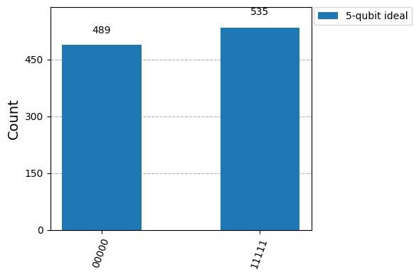

{/* doqumentation-source-hash: baae5bd5 */}

<OpenInLabBanner notebookPath="workshop/06_divincenzo_criteria_lab-2.ipynb" />

## Introduction

Le physicien David DiVincenzo a défini cinq exigences clés pour toute implémentation physique d'un ordinateur quantique, ainsi que deux critères supplémentaires pour la communication quantique. Dans ce notebook, nous allons **découvrir chaque critère de DiVincenzo à travers des démonstrations pratiques avec Qiskit**. Plutôt que d'approfondir la théorie, chaque section explique brièvement un critère puis propose des exercices de code avec Qiskit 2. Tu pourras exécuter des circuits sur des simulateurs et de vrais appareils IBM Quantum pour **explorer chaque principe de façon concrète**.

**Les cinq critères de DiVincenzo pour le calcul quantique** :

1. **Un système physique évolutif avec des qubits bien caractérisés.**
2. **Capacité d'initialiser les qubits** dans un état fiduciel simple (par ex. |00…0〉).
3. **Des temps de décohérence longs** (la cohérence du qubit doit être bien supérieure au temps d'opération d'une Gate).
4. **Un ensemble universel de Gates quantiques** (capable d'effectuer des opérations unitaires arbitraires).
5. **Capacité de mesure spécifique à chaque qubit** (lire l'état de chaque qubit).

*(DiVincenzo a également décrit deux critères pour la communication quantique : la capacité d'interconvertir des qubits stationnaires et des qubits « volants », et de transmettre fidèlement des qubits volants entre différents endroits. Nous les abordons dans une activité recommandée à la fin de ce notebook.)*

Chacune des sections suivantes correspond à un critère. Nous utiliserons Qiskit pour illustrer le concept avec du code et des **expériences interactives** que tu peux essayer. Par exemple, nous verrons comment l'augmentation du nombre de qubits et de la profondeur du Circuit affecte les résultats (Critère 1), comment réinitialiser et préparer des états de qubit (Critère 2), comment mesurer des qubits sur des simulateurs par rapport à des appareils réels (Critère 4), comment Qiskit compose des Gates universelles (Critère 3), et comment la cohérence finie (T₁, T₂) impacte les calculs (Critère 5). À la fin, tu auras une intuition plus profonde de ce que signifie chaque critère de DiVincenzo en pratique et comment Qiskit permet de les expérimenter.

```python
# Added by doQumentation — required packages for this notebook
!pip install -q numpy
```

```python
# Install necessary packages
!pip install qiskit[visualization] qiskit-ibm-runtime qiskit-aer qiskit_ibm_runtime
```

## 1. Critère 1 – Qubits évolutifs et bien caractérisés {#1-criterion-1-scalable-well-characterized-qubits}

**Critère 1 :** *« Un système physique évolutif avec des qubits bien caractérisés. »* Cela signifie que nous avons besoin d'une plateforme matérielle quantique où l'on peut **augmenter le nombre de qubits** tout en les contrôlant de manière fiable. Les propriétés de chaque qubit (niveaux d'énergie, taux d'erreur, connectivité, etc.) doivent être bien comprises. En résumé, nous voulons construire des circuits plus grands sans que le système ne se dégrade. En pratique, à mesure que l'on augmente le nombre de qubits ou la profondeur du Circuit, les erreurs et la décohérence s'accumulent, donc démontrer l'*évolutivité* signifie aussi comprendre comment l'augmentation de taille affecte les performances.

**Objectif de la démonstration :** Utiliser Qiskit pour montrer l'effet de l'augmentation d'un Circuit (en nombre de qubits ou en profondeur de Gate) sur la fidélité de sortie. Nous allons simuler un scénario idéal par rapport à un scénario bruité pour voir comment un système plus grand ou un Circuit plus profond succombe à la décohérence et aux erreurs.

Commençons par construire un petit état intriqué (état GHZ) sur 3 qubits, puis un plus grand sur 5 qubits, comme test d'évolutivité simple. Un état GHZ de *n* qubits est $\frac{1}{\sqrt{2}}(|0...0\rangle + |1...1\rangle)$. Dans une simulation idéale, mesurer un état GHZ à n qubits ne donne que deux résultats (tous les 0 ou tous les 1) avec une probabilité égale. Nous allons comparer la **sortie idéale** à une **sortie bruitée** au fur et à mesure que l'on augmente n ou la profondeur du Circuit.

```python
from qiskit import QuantumCircuit
from qiskit_aer import AerSimulator
from qiskit.visualization import plot_histogram
from qiskit.transpiler.preset_passmanagers import generate_preset_pass_manager
from qiskit_ibm_runtime import SamplerV2 as Sampler

# 3-qubit GHZ circuit
qc3 = QuantumCircuit(3, 3)
qc3.h(0)
qc3.cx(0, 1)
qc3.cx(1, 2)
qc3.measure([0, 1, 2], [0, 1, 2])

# 5-qubit GHZ circuit (scaling up the number of qubits)
qc5 = QuantumCircuit(5, 5)
qc5.h(0)
qc5.cx(0, range(1, 5))    # entangle qubit 0 with all others
qc5.measure(range(5), range(5))

# Transpile for a simulator backend
sim_backend = AerSimulator()
pm = generate_preset_pass_manager(backend=sim_backend, optimization_level=1)
isa_qc3 = pm.run(qc3)
isa_qc5 = pm.run(qc5)

# Run ideal simulations (no noise)
sampler = Sampler(mode=sim_backend)

job3 = sampler.run([isa_qc3], shots=1024)
result3 = job3.result()
counts3 = result3[0].data.c.get_counts()

job5 = sampler.run([isa_qc5], shots=1024)
result5 = job5.result()
counts5 = result5[0].data.c.get_counts()

print("3-qubit GHZ counts (ideal):", counts3)
plot_histogram(counts3, legend=['3-qubit ideal'], figsize=(6,4))
```

```text
3-qubit GHZ counts (ideal): {'000': 531, '111': 493}
```


```python
print("5-qubit GHZ counts (ideal):", counts5)
plot_histogram(counts5, legend=['5-qubit ideal'], figsize=(6,4))
```

```text
5-qubit GHZ counts (ideal): {'11111': 535, '00000': 489}
```



**Résultat attendu (cas idéal) :** L'état GHZ à 3 qubits donne idéalement environ 50 % `000` et 50 % `111` dans les comptages. L'état GHZ à 5 qubits donne ~50 % `00000` et 50 % `11111`. Aucune autre chaîne de bits n'apparaît car l'état est idéalement parfaitement cohérent et intriqué. Tu devrais voir deux grandes barres sur l'histogramme pour chaque Circuit, correspondant aux résultats tout-zéros et tout-uns.

Voyons maintenant ce qui se passe dans un **environnement bruité**. Nous allons utiliser les capacités de modèle de bruit de Qiskit Aer pour imiter les erreurs d'un vrai appareil. Par exemple, nous pouvons utiliser les propriétés d'un Backend IBM pour créer un modèle de bruit incluant des erreurs de Gate, des temps de Gate finis, la relaxation du qubit (T₁), le déphasage (T₂) et les erreurs de lecture. Ici, nous utiliserons un **faux Backend** représentant l'appareil IBM Quantum Brisbane pour générer un modèle de bruit, puis nous exécuterons à nouveau les circuits GHZ à travers ce modèle.
### Exercice 1a : Simuler avec du bruit {#exercise-1a-simulate-with-noise}
Complète le code ci-dessous pour simuler les circuits GHZ sur un simulateur bruité basé sur le Backend `FakeBrisbane`. Cela te montrera comment les performances se dégradent à mesure que le système évolue dans un environnement de bruit réaliste.

```python
from qiskit_ibm_runtime.fake_provider import FakeBrisbane

# We will reuse the ideal circuits qc3 and qc5 and their results from the previous cell.

# --- YOUR CODE HERE ---

# 1. Create a fake backend for IBM Quantum Brisbane
###brisbane_backend = ...

# 2. Create a noisy AerSimulator from the fake backend's properties
###noisy_sim = ...

# 3. Transpile the circuits for the noisy simulator (this adapts them to the device's specific gates and connectivity)
###pm = ...

###isa_qc3_noisy = ...

###isa_qc5_noisy = ...

# 4. Run the noisy simulations using the Sampler and get the counts
###sampler = ...

###job3 = ...

###result3_noisy = ...

###counts3_noisy = ...

###job5 = ...

###result5_noisy = ...

###counts5_noisy = ...

# --- END YOUR CODE ---

# This part is done for you to print and plot the results:
print("3-qubit GHZ counts (noisy):", counts3_noisy)
plot_histogram(counts3_noisy, legend=['3-qubit noisy'], figsize=(6,4))
```

```python
print("5-qubit GHZ counts (noisy):", counts5_noisy)
plot_histogram(counts5_noisy, legend=['5-qubit noisy'], figsize=(6,4))
```

### Exercice 1b : Exécuter sur un vrai ordinateur IBM Quantum {#exercise-1b-run-on-real-ibm-quantum-computer}
Le code ci-dessous exécute les circuits GHZ sur un vrai ordinateur IBM Quantum. Cela te montrera comment les performances se dégradent sur un vrai appareil.

```python
# your_api_key = "deleteThisAndPasteYourAPIKeyHere"
# your_crn = "deleteThisAndPasteYourCRNHere"

# QiskitRuntimeService.save_account(
#     channel="ibm_quantum_platform",
#     token=your_api_key,
#     instance=your_crn,
#     name="fallfest-2025",
# )

# Check that the account has been saved properly
# service = QiskitRuntimeService(name="fallfest-2025")
# print(service.saved_accounts())

# We will reuse the ideal circuits qc3 and qc5 and their results from the previous cell.

from qiskit_ibm_runtime import QiskitRuntimeService

service = QiskitRuntimeService(name="fallfest-2025")
real_backend = service.least_busy(operational=True, simulator=False)
print("Running on " + real_backend.name)

pm = generate_preset_pass_manager(backend=real_backend, optimization_level=1)
isa_qc3r = pm.run(qc3)
isa_qc5r = pm.run(qc5)

sampler = Sampler(mode=real_backend)

job3r = sampler.run([isa_qc3r], shots=1024)
result3r = job3r.result()
counts3r = result3r[0].data.c.get_counts()

job5r = sampler.run([isa_qc5r], shots=1024)
result5r = job5r.result()
counts5r = result5r[0].data.c.get_counts()

print("3-qubit GHZ counts (real):", counts3r)
plot_histogram(counts3r, legend=['3-qubit real'], figsize=(6,4))
```

```python
print("5-qubit GHZ counts (real):", counts5r)
plot_histogram(counts5r, legend=['5-qubit real'], figsize=(6,4))
```

**Résultat attendu (bruité vs idéal) :** Avec du bruit, que ce soit en simulation ou sur un vrai appareil, l'état GHZ est **moins parfait**. Tu verras des résultats supplémentaires au-delà de tout-0 et tout-1. Pour 3 qubits, au lieu de 100 % dans `000`/`111`, une certaine probabilité fuite vers d'autres chaînes de bits (par ex. `001`, `010`, etc.) en raison d'erreurs de Gate ou de décohérence qui font basculer certains qubits. Pour 5 qubits, l'effet est encore plus prononcé ; le Circuit plus grand (plus de qubits et de gates CNOT) accumule plus d'erreurs, donc les pics tout-0 et tout-1 sont plus bas et de nombreux autres résultats apparaissent. Cette tendance illustre le défi de l'*évolutivité* : à mesure que l'on évolue, maintenir une haute fidélité devient plus difficile sans correction d'erreurs.

**Observation :** Un ordinateur quantique évolutif doit préserver les corrélations quantiques à mesure que le système grandit. Nos exemples montrent comment l'augmentation du nombre de qubits et de la profondeur des Gates entraîne une baisse de la fidélité des résultats en présence de bruit. Les critères restants traiteront du maintien de ces qubits en bon état (faible erreur, initialisables, etc.) au fur et à mesure que l'on évolue.
## 2. Critère 2 – Initialisation des qubits {#2-criterion-2-qubit-initialization}

**Critère 2 :** *« La capacité d'initialiser l'état des qubits dans un état fiduciel simple, tel que |000…〉. »* Tous les qubits doivent démarrer de manière fiable dans un état de référence connu (typiquement l'état fondamental |0〉 pour chaque qubit). L'initialisation est essentielle pour que les algorithmes commencent avec une ardoise vierge. En pratique, sur les appareils quantiques IBM, chaque qubit est automatiquement réinitialisé à |0〉 au début de chaque exécution de Circuit. Qiskit fournit également des instructions pour réinitialiser des qubits ou préparer des états personnalisés pendant un calcul.

**Objectif de la démonstration :** Montrer comment initialiser des qubits dans Qiskit, aussi bien au début qu'en milieu de Circuit. Nous allons démontrer l'utilisation de l'instruction `reset` et des méthodes de préparation d'états.
### Exercice 2 : Préparer un état spécifique {#exercise-2-prepare-a-specific-state}
Dans le bloc de code ci-dessous, complète le `QuantumCircuit` pour préparer l'état $|10\rangle$. Cela signifie que le qubit 0 doit être dans l'état $|0\rangle$ et le qubit 1 dans l'état $|1\rangle$. Utilise la Gate et l'instruction appropriées pour y parvenir.

```python
from qiskit import QuantumCircuit
from qiskit_aer import AerSimulator

# Create a circuit to initialize qubits to |10> and verify by measurement
qc_init = QuantumCircuit(2, 2)

# --- YOUR CODE HERE ---

# 1. Set qubit 1 to the |1> state

# 2. Explicitly reset qubit 0 to the |0> state

# --- END YOUR CODE ---

qc_init.measure([0, 1], [0, 1])
qc_init.draw('mpl')
```

```python
# Run the circuit and check the outcome
sim_backend = AerSimulator()
pm = generate_preset_pass_manager(backend=sim_backend, optimization_level=1)
isa_qc_init = pm.run(qc_init)

sampler = Sampler(mode=sim_backend)

job = sampler.run([isa_qc_init], shots=1024)
result = job.result()
counts = result[0].data.c.get_counts()

print("Outcome of |10> state measured in Z-basis:", counts)
plot_histogram(counts)
```

Tu devrais voir `10` (binaire pour qubit1=1, qubit0=0) avec une probabilité de 100 % depuis la simulation, ce qui signifie que le qubit 1 a été préparé avec succès dans |1〉 et le qubit 0 dans |0〉.

Maintenant, pour une préparation d'état plus générale, Qiskit permet l'initialisation vers des états arbitraires en utilisant la méthode `initialize`. Par exemple, préparons un qubit dans l'état $|+\rangle = (|0\rangle+|1\rangle)/\sqrt{2}$, qui est un état de superposition, et une paire de qubits dans l'état de Bell $(|00\rangle+|11\rangle)/\sqrt{2}$ :

```python
import numpy as np

# Initialize a single qubit in |+> state and measure in Z-basis
qc_plus = QuantumCircuit(1, 1)
state_plus = [1/np.sqrt(2), 1/np.sqrt(2)]   # amplitude for |0> and |1>
qc_plus.initialize(state_plus, 0)
qc_plus.measure(0, 0)

# Initialize two qubits in a Bell state manually
qc_bell = QuantumCircuit(2, 2)
bell_state = [1/np.sqrt(2), 0, 0, 1/np.sqrt(2)]  # amplitudes for |00>,|01>,|10>,|11>
qc_bell.initialize(bell_state, [0, 1])
qc_bell.measure([0, 1], [0, 1])

# Transpile and run the initialization circuits
isa_qc_plus = pm.run(qc_plus)
job_plus = sampler.run([isa_qc_plus], shots=1024)
result_plus = job_plus.result()
counts_plus = result_plus[0].data.c.get_counts()

print("Outcome of |+> state measured in Z-basis:", counts_plus)

isa_qc_bell = pm.run(qc_bell)
job_bell = sampler.run([isa_qc_bell], shots=1024)
result_bell = job_bell.result()
counts_bell = result_bell[0].data.c.get_counts()

print("Outcome of Bell state measured in Z-basis:", counts_bell)
```

```text
Outcome of |+> state measured in Z-basis: {'1': 499, '0': 525}
Outcome of Bell state measured in Z-basis: {'00': 508, '11': 516}
```

**Résultats attendus :** L'état |+〉 d'un seul qubit, lorsqu'il est mesuré, donnera `0` et `1` avec une probabilité d'environ 50 % chacun. La mesure de l'état de Bell devrait donner environ 50 % `00` et 50 % `11`. Si tu observes ces résultats, cela confirme que notre initialisation vers ces états a réussi.

**Initialisation en milieu de Circuit :** L'instruction `reset` de Qiskit peut être utilisée au milieu d'un Circuit pour réinitialiser un qubit à |0〉 à la volée. Par exemple, dans les codes de correction d'erreurs ou les algorithmes itératifs, on mesure souvent un qubit puis on le réinitialise pour le réutiliser. L'opération `reset` est déterministe ; elle abandonne tout état existant et ramène le qubit à l'état fondamental.

**Exemple sur appareil :** Sur du matériel comme **ibmq_brisbane** (127 qubits) ou tout appareil IBM, tous les qubits commencent dans |0〉 par défaut lorsqu'une tâche est exécutée. Si tu as besoin d'un état de départ différent, tu appliquerais des Gates au début (comme nous l'avons fait avec X pour obtenir |1〉). La réinitialisation continue (pour la correction d'erreurs quantiques) est un sujet de recherche actif car la réaliser rapidement est un défi. Heureusement, pour une utilisation basique, la capacité de repartir de zéro dans |0…0〉 est disponible et nous avons démontré comment atteindre d'autres états de départ souhaités également.
## 3. Critère 3 – Longue durée de cohérence (Décohérence vs temps de Gate) {#3-criterion-3-long-coherence-time-decoherence-vs-gate-time}

**Critère 3 :** *"Des temps de décohérence pertinents longs, bien plus longs que le temps d'opération des Gates."* Cela répond au besoin pour les Qubits de maintenir leur état quantique suffisamment longtemps pour effectuer les opérations nécessaires. Chaque Qubit possède un **temps T₁** (temps de relaxation d'énergie, à quelle vitesse |1〉 se désintègre vers |0〉) et un **temps T₂** (temps de déphasage, à quelle vitesse la cohérence de phase relative se perd). Pour qu'un ordinateur quantique fonctionne, ces échelles de temps doivent dépasser largement la durée des opérations de Gate.

**Objectif de la démo :** Étudier la cohérence des Qubits dans Qiskit en montrant comment la décohérence impacte les résultats du Circuit au fur et à mesure que la longueur d'exécution augmente. Nous allons utiliser un faux Backend avec des temps T1/T2 connus pour simuler cet effet.

Pour **démontrer l'impact d'une cohérence finie**, nous allons simuler une expérience de décroissance T1. Nous allons préparer un Qubit dans l'état |1〉, attendre un certain temps grâce à une instruction `delay`, puis mesurer. On s'attend à ce que la probabilité de mesurer |1〉 diminue à mesure que le délai augmente.

```python
# This part is done for you. We are creating a list of circuits,
# each with a different delay time.

time_delays_ns = [0, 50000, 100000, 150000, 200000, 250000, 300000]  # delay durations in ns

decay_expts = []
for delay in time_delays_ns:
    qc = QuantumCircuit(1, 1)
    qc.x(0)  # initialize qubit to |1>
    if delay > 0:
        qc.delay(delay, 0, unit='ns')  # wait 'delay' nanoseconds
    qc.measure(0, 0)
    decay_expts.append(qc)

decay_expts[1].draw('mpl') # Visualize one of the circuits
```


### Exercice 3 : Simuler une expérience de décroissance T1 {#exercise-3-simulate-a-t1-decay-experiment}

Maintenant, utilise un simulateur bruité basé sur `FakeVigo` (qui a des temps T1 d'environ 50-100 µs) pour exécuter ces circuits. Le simulateur va automatiquement appliquer les erreurs T1/T2 pendant les instructions `delay`. Transpile les circuits pour ce Backend et exécute-les.

```python
from qiskit_ibm_runtime.fake_provider import FakeVigoV2 as FakeVigo
from qiskit_aer import AerSimulator

# --- YOUR CODE HERE ---

# 1. Create a noisy simulator from the FakeVigo backend
###sim_vigo = ...

# 2. Transpile the list of circuits for this simulator
###pm = ...

###isa_decay_expts = ...

# 3. Use the Sampler to run all the transpiled circuits in a single job
###sampler = ...

###job = ...

###result = ...

# --- END YOUR CODE ---

# This part is done for you to analyze and print the results.
for idx, (delay, qc) in enumerate(zip(time_delays_ns, isa_decay_expts)):
    counts = result[idx].data.c.get_counts()
    p1 = counts.get('1', 0) / 1000  # Assuming 1000 shots
    print(f"Delay {delay} ns: P(qubit=1) = {p1:.3f}")
```

## 4. Critère 4 – Ensemble universel de Gates quantiques {#4-criterion-4-universal-set-of-quantum-gates}

**Critère 4 :** *"Un ensemble 'universel' de Gates quantiques."* Cela signifie que notre matériel doit nous permettre d'effectuer *n'importe quel* calcul quantique en composant un ensemble fini de Gates de base. En informatique classique, NAND est universel ; en quantique, il existe de nombreux choix d'ensembles de Gates universels (par exemple \{H, T, CNOT\} ou les Gates natives d'une machine donnée). Les appareils IBM, par exemple, disposent d'un ensemble d'opérations natives comme des rotations arbitraires à un seul Qubit et des CNOT entre certains Qubits, qui ensemble sont universels. Le rôle du Transpiler Qiskit est souvent de **compiler des Gates de haut niveau vers ces Gates de base**.

**Objectif de la démo :** Illustrer l'universalité des Gates en montrant comment Qiskit décompose des Gates. Nous allons prendre une Gate non-native (comme une Gate de Toffoli à 3 Qubits, CCX) et voir comment elle se décompose en Gates de base du dispositif. Cela démontre que l'ensemble de Gates fourni est bien *universel* – il peut produire l'opération plus complexe.

D'abord, regardons quelles sont les Gates de base pour un Backend IBM typique. Nous allons interroger la configuration d'un dispositif (ou sa version fictive). Par exemple, les Gates de base de ibmq_brisbane :
Tu devrais observer que la probabilité `P(qubit=1)` diminue à mesure que le délai augmente, suivant une courbe de décroissance exponentielle caractéristique de la relaxation T1. Cela démontre directement comment un temps de cohérence fini entraîne des erreurs de calcul si le Circuit s'exécute trop longtemps.

**Impact sur les algorithmes :** Si tu essaies un algorithme plus long (avec de nombreuses Gates séquentielles), le temps d'exécution total pourrait approcher ou dépasser T2, faisant perdre au Circuit sa cohérence avant la fin. C'est pourquoi l'amélioration des temps de cohérence et l'accélération des Gates sont deux des objectifs les plus critiques de la recherche sur le matériel quantique.

```python
from qiskit_ibm_runtime.fake_provider import FakeBrisbane
fake_brisbane = FakeBrisbane()
print("Basis gates for ibmq_brisbane:", fake_brisbane.configuration().basis_gates)
```

```text
Basis gates for ibmq_brisbane: ['ecr', 'id', 'rz', 'sx', 'x']
```

Cela peut afficher quelque chose comme `['id', 'rz', 'sx', 'x', 'ecr']`. Ce sont les opérations primitives que le matériel prend en charge nativement (Identité/no-op, rotation RZ, Gate sqrt(X), Gate X, et X contrôlé). Toute autre Gate doit être composée à partir de celles-ci. Cet ensemble est reconnu comme universel pour le calcul quantique (essentiellement des rotations à un seul Qubit plus une Gate d'intrication à deux Qubits forment un ensemble universel).

Maintenant, prends une **Gate de Toffoli (CCX)** comme cas de test. CCX inverse un Qubit cible uniquement si deux Qubits de contrôle sont tous deux à 1. Ce n'est pas une Gate native sur le matériel IBM. Qiskit fournit une instruction `ccx`, mais en coulisses elle va la décomposer.
### Exercice 4 : Décomposer une Gate de Toffoli {#exercise-4-decompose-a-toffoli-gate}

Complète le code ci-dessous pour construire un Circuit avec une Gate de Toffoli (CCX) et utilise ensuite Qiskit pour la décomposer dans les Gates de base natives du Backend `FakeBrisbane`.

```python
from qiskit import QuantumCircuit
from qiskit_ibm_runtime.fake_provider import FakeBrisbane

# The fake_brisbane backend from the previous cell is reused here.

# --- YOUR CODE HERE ---

# 1. Create a circuit that can accommodate a Toffoli gate
###qc_toffoli = ...

# Apply a CCX gate with controls on qubits 0, 1 and target on qubit 2

# 2. Transpile the circuit to the fake Brisbane backend
###pm = ...

###isa_qc_toffoli = ...

# --- END YOUR CODE ---

print("Toffoli circuit before decomposition:")
print(qc_toffoli)

print("\nToffoli circuit after transpiling to Brisbane basis:")
# The .draw() method will now show the decomposed circuit
print(isa_qc_toffoli.draw(fold=120))
```

Dans la sortie transpilée, tu devrais voir le CCX remplacé par une séquence de Gates plus basiques comme `rz`, `sx` et `ecr`. Cela prouve que les Gates natives sont suffisantes pour exprimer le Toffoli.

**L'universalité en pratique :** L'exercice ci-dessus montre qu'une Gate complexe à 3 Qubits a été construite à partir de Gates plus simples. En général, **n'importe quelle** unitaire multi-Qubit peut être composée à partir de Gates à 1 et 2 Qubits. Le Transpiler est un composant crucial de tout stack logiciel quantique, car il fait le pont entre les algorithmes abstraits que nous voulons exécuter et les opérations physiques qu'un dispositif quantique spécifique peut réellement effectuer.

**Exemple sur dispositif :** Le dispositif **ibmq_brisbane** utilise l'architecture Eagle avec les Gates de base montrées ci-dessus. Cela signifie que tout algorithme envoyé à ces machines sera converti en séquences de ces opérations. Ce critère porte essentiellement sur la **contrôlabilité** ; nous disposons de suffisamment de leviers de contrôle pour effectuer toute opération nécessaire sur nos Qubits.
## 5. Critère 5 – Mesure des Qubits {#5-criterion-5-qubit-measurement}

**Critère 5 :** *"Une capacité de mesure spécifique à chaque Qubit."* L'état de chaque Qubit doit être mesurable (généralement dans la base computationnelle, |0〉 ou |1〉). En d'autres termes, après l'exécution d'un Circuit quantique, nous devons lire chaque Qubit sous la forme d'un bit classique 0/1. Ce critère concerne la disponibilité de détecteurs fiables pour chaque Qubit et la possibilité de sélectionner quels Qubits mesurer.

**Objectif de la démo :** Montrer comment effectuer des mesures dans Qiskit sur des simulateurs et des dispositifs réels, et mettre en évidence les différences (comme le bruit de mesure). Nous allons mesurer quelques Qubits dans divers états et examiner les résultats. Nous allons également démontrer comment des erreurs de lecture peuvent apparaître en comparant les résultats du simulateur et du matériel.

D'abord, un exemple de mesure simple :

```python
qc_measure = QuantumCircuit(2, 2)
qc_measure.x(0)              # qubit 0 -> |1>, qubit 1 stays |0>
qc_measure.measure([0, 1], [0, 1])
qc_measure.draw('mpl')
```


```python
sim_backend = AerSimulator()
pm = generate_preset_pass_manager(backend=sim_backend, optimization_level=1)
isa_qc_measure = pm.run(qc_measure)
job = sampler.run([isa_qc_measure], shots=1000)
result = job.result()
counts = result[0].data.c.get_counts()

print("Simulator measurement counts:", counts)
```

```text
Simulator measurement counts: {'01': 1000}
```

On s'attend à 1000 comptes de `01` sur le simulateur. Maintenant, voyons **l'erreur de mesure** en action en la simulant. Nous pouvons ajouter une erreur de lecture à notre simulateur Aer. Qiskit Aer nous permet de définir une `ReadoutError` et de l'attacher aux Qubits dans un modèle de bruit.
### Exercice 5 : Simuler une erreur de lecture {#exercise-5-simulate-readout-error}

Complète le code pour définir un modèle d'erreur de lecture simple où chaque Qubit a 2% de chance d'être mesuré incorrectement (un 0 est lu comme un 1, ou un 1 comme un 0). Ensuite, exécute le Circuit de mesure avec ce modèle de bruit.

```python
from qiskit_aer.noise import NoiseModel, ReadoutError

# --- YOUR CODE HERE ---

# 1. Define a 2% readout error for each single qubit.
# The format is a list of lists of probabilities: [[P(0|0), P(1|0)], [P(0|1), P(1|1)]]
# P(A|B) is the probability of measuring A given the state was |B>.
###ro_error = ...

# 2. Create a new noise model
###noise_model_ro = ...

# 3. Add the readout error to all qubits in the noise model
... # Hint: Use the add_all_qubit_readout_error method

# --- END YOUR CODE ---

sim_backend.set_options(noise_model=noise_model_ro)
pm = generate_preset_pass_manager(backend=sim_backend, optimization_level=1)
isa_qc_measure = pm.run(qc_measure)

# Run the measurement circuit with readout noise
sampler = Sampler(mode=sim_backend)

job = sampler.run([isa_qc_measure], shots=1024)
result = job.result()
counts = result[0].data.c.get_counts()

print("Simulation with 2% readout error:", counts)
```

Cette sortie simulée va afficher quelques comptes erronés (comme `11`, `00`, `10`) similaires à ce que le vrai matériel pourrait produire, démontrant l'impact d'une mesure imparfaite.

**Exemple sur dispositif :** Sur un vrai dispositif comme **ibmq_brisbane**, tu pourrais exécuter le même Circuit et verrais probablement des comptes non nuls similaires pour les résultats incorrects. Les données de calibration du dispositif listent une erreur de lecture pour chaque Qubit. Être capable de cibler et de lire des Qubits spécifiques est crucial, et comprendre leurs caractéristiques d'erreur est essentiel pour obtenir des résultats significatifs. L'exécution sur un vrai dispositif a été démontrée dans **l'Exercice 1b : Exécuter sur un vrai ordinateur IBM Quantum**.
## Critères de Communication Quantique (Qubits Volants) {#quantum-communication-criteria-flying-qubits}

DiVincenzo a également listé deux critères spécifiques à la communication quantique, importants pour la construction d'un ordinateur quantique en réseau :

6. **Capacité à interconvertir les Qubits stationnaires et volants.** (Par exemple, mapper un Qubit dans un processeur vers un photon capable de voyager.)
7. **Capacité à transmettre fidèlement des Qubits volants entre des emplacements.** (Par exemple, envoyer un Qubit photonique à travers une fibre sans perdre l'information quantique.)

Ces aspects dépassent l'utilisation standard de Qiskit car Qiskit traite principalement des Qubits stationnaires sur une puce. Cependant, nous pouvons illustrer le *concept* de ces critères avec un exemple simple : la **téléportation quantique**. La téléportation montre comment l'état d'un Qubit stationnaire est converti en information transportée par une paire intriquée (la partie « volante ») et par la communication classique, qui est ensuite utilisée pour reconstruire l'état sur un autre Qubit stationnaire ailleurs.
### Activité recommandée : Suivre le module *Quantum Teleportation* de Qiskit in Classrooms {#recommended-activity-take-the-qiskit-in-classrooms-quantum-teleportation-module}

Le module [Quantum Teleportation](https://quantum.cloud.ibm.com/learning/en/modules/computer-science/quantum-teleportation) de Qiskit in Classrooms par Dr. Katie McCormick va te guider à travers l'un des protocoles les plus captivants de l'information quantique : la téléportation quantique, où un état quantique (un Qubit) est envoyé d'Alice à Bob en utilisant l'intrication et seulement deux bits classiques. Tu apprendras la procédure complète de téléportation étape par étape — comment préparer la paire de Bell intriquée, effectuer une mesure dans la base de Bell du côté d'Alice, transmettre les résultats classiques, et appliquer la Gate quantique correcte sur le Qubit de Bob pour récupérer parfaitement l'état original. En chemin, tu exploreras pourquoi la téléportation de l'information d'un Qubit ne viole pas le théorème de non-clonage ni ne dépasse la vitesse de la lumière. À travers des exercices pratiques utilisant le matériel IBM Quantum ou des simulateurs, tu acquérras une compréhension pratique de la mesure, de l'intrication et du contrôle par rétroaction en action.

En maîtrisant la téléportation quantique, tu comprendras comment encoder, transmettre et récupérer de l'information quantique entre des nœuds distincts — posant les bases des réseaux quantiques, des systèmes de répéteurs, des schémas de communication sécurisée et du calcul quantique modulaire scalable.
**Lien avec les critères 6 & 7 :** Dans un vrai réseau quantique, la paire intriquée partagée serait créée en distribuant des Qubits « volants » (comme des photons) entre les emplacements d'Alice et Bob (Critère 7 : transmission fidèle). Le protocole de téléportation lui-même sert alors de moyen pour mapper l'état du Qubit stationnaire d'Alice sur sa moitié de la paire intriquée, l'« envoyant » effectivement à Bob (Critère 6 : interconversion). Qiskit nous permet de simuler parfaitement la logique du protocole, fournissant un modèle conceptuel de la façon dont ces critères sont satisfaits dans les architectures de communication.
## Conclusion & Résumé {#conclusion-summary}

Nous avons conçu une série d'exercices axés sur le code pour illustrer les critères de DiVincenzo en utilisant Qiskit. À travers ces exemples pratiques, tu as exploré comment une vraie plateforme de calcul quantique satisfait chaque exigence :

- **Scalabilité** : construire des Circuits sur plus de Qubits et comprendre la mise à l'échelle du bruit.
- **Initialisation** : utiliser les réinitialisations et la préparation d'états pour démarrer de manière fiable les calculs dans des états connus.
- **Gates Universelles** : transcompiler des opérations complexes vers les Gates de base d'une machine, prouvant que nous pouvons effectuer n'importe quel calcul.
- **Mesure** : lire les Qubits et gérer les erreurs de lecture réalistes.
- **Cohérence** : voir l'effet des T₁, T₂ finis sur la fidélité des algorithmes et la nécessité que les opérations soient rapides par rapport à la décohérence.

Pour être complet, nous avons également abordé les aspects de la communication quantique via le module [Quantum Teleportation](https://quantum.cloud.ibm.com/learning/en/modules/computer-science/quantum-teleportation) de Qiskit in Classrooms, reliant les deux derniers critères (Qubits volants).

Enfin, il convient de noter comment ces critères se rejoignent dans un vrai ordinateur quantique comme celui d'IBM. Un dispositif comme **ibmq_brisbane** a 127 Qubits supraconducteurs (Critère 1), chacun démarrant en |0〉 (Critère 2), avec un ensemble de Gates calibré et des compilateurs pour l'universalité (Critère 4), des résonateurs de lecture micro-ondes pour chaque Qubit (Critère 5), et des temps de cohérence de l'ordre de centaines de microsecondes contre des opérations en nanosecondes (Critère 3). Pour les expériences de réseaux quantiques, IBM et d'autres explorent la transduction micro-onde vers optique pour les Qubits volants, et l'intrication de Qubits distants (Critères 6 & 7) ; ce sont des domaines de recherche actifs.

En complétant les exercices de ce notebook, tu n'as pas seulement vu les définitions des critères de DiVincenzo, mais tu les as *touchés* à travers le code ; en développant une intuition sur ce que chaque exigence signifie pour le vrai matériel et les algorithmes quantiques. N'hésite pas à étendre ces expériences, et bonne informatique quantique !
