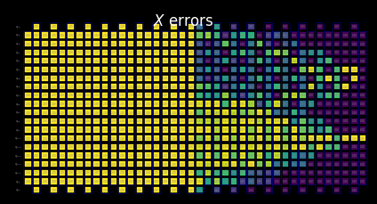

{/* doqumentation-source-hash: d7518943 */}

import TutorialFeedback from '@site/src/components/TutorialFeedback';

<OpenInLabBanner notebookPath="qiskit-addons/slc/01_getting_started.ipynb" />


##  רקע {#background}
מדריך זה מדגים כיצד להפחית שגיאות באמצעות תוסף Shaded lightcone (SLC). תוסף זה הוא התפתחות של [טכניקת ביטול שגיאות הסתברותי (PEC)](https://quantum.cloud.ibm.com/docs/guides/error-mitigation-and-suppression-techniques#probabilistic-error-cancellation-pec), שבה משתמש לומד את הרעש של שכבות ייחודיות ב-Circuit ואז מבטל את הרעש על ידי החלת שערי Qubit בודדים וטכניקות עיבוד-לאחר. בהשוואה לשיטות אחרות, PEC מציע גבולות חזקים יותר על ההטיה של התוצאה המצומצמת, אך נוטה לסבול מעומס גבוה יותר מבחינת זמן QPU. במהלך PEC, כדי לפצות על הנחתת ערך ההצפנה על ידי הרעש, התוצאה הממוצעת משוקללת מחדש בגורם $\gamma = \exp(\sum_{l,\sigma} 2\lambda_{l,\sigma})$, כאשר $\lambda_{l,\sigma}$ הוא קצב הרעש הנלמד של שגיאת פאולי $\sigma$ בשכבה $l$ ב-Circuit. שינוי הגודל הזה מגדיל את השונות בגורם $\gamma^2$, ולכן גם מכפיל את מספר ביצועי ה-Circuit הנדרשים ב-QPU ב-$\gamma^2$, שאנחנו מכנים עלות הדגימה או עומס הדגימה. מכיוון ש-$\gamma$ גדל בצורה אקספוננציאלית, PEC מוגבל לרוב ל-Circuitים רדודים או עם מעט Qubitים. למד עוד על PEC ב-[Probabilistic error cancellation with sparse Pauli-Lindblad models on noisy quantum processors.](https://arxiv.org/abs/2201.09866) 

אם נוכל לזהות שגיאות שאין צורך לצמצם, נוכל להפחית את עלות הדגימה הזו בצורה אקספוננציאלית. צעד ראשון בכיוון זה הוא יישום צמצום שגיאות מודע מקומית, המשתמש ב"חרוט אור" קונבנציונלי הניתן לחישוב מהיר כדי להפחית את עומס PEC על ידי הגבלת הרגישות של תוחלת ל שגיאות לאורך ה-Circuit, ובכך להרחיב את הישימות של PEC לסדר גודל גדול יותר עבור חלק מהבעיות. שגיאות מחוץ לחרוט האור הזה אינן יכולות להשפיע על התוצאה הנמדדת ולכן ניתן לא לכלול אותן בהליך ביטול השגיאות. הוצאה זו מפחיתה את עומס הדגימה, במקרים מסוימים באופן מהותי, מבלי להכניס הטיה נוספת. בפרט, למדידת תוחלת מקומית $O$ של Circuit בעומק קבוע, עומס הדגימה הנדרש בסופו של דבר מתייצב בעת הגדלת מספר ה-Qubitים ב-Circuit (ראה איור 2b ב-[Locality and Error Mitigation of Quantum Circuits.](https://arxiv.org/abs/2303.06496))

חרוטי אור מוצללים (SLC) הולכים צעד נוסף, ומשתמשים בסימולציות קלאסיות כדי לקבוע בצורה הדוקה יותר את הרגישות לשגיאות לאורך ה-Circuit. זה מחליף חלק מזמן QPU בזמן CPU ומפחית את עומס הדגימה הנדרש לנרמול ההטיה. במקום חתך חד, לכל שגיאה פוטנציאלית ב-Circuit מוקצה "גוון" מדורג שמגביל מלמעלה את הרגישות של התוחלת לאותה שגיאה. אפיון מעודן זה מאפשר יישומים יעילים וממוקדים יותר של PEC עם שונות מופחתת, תוך מתן למשתמש היכולת לכוונן באופן נשלט את ההטיה באמדן התוחלת. ראה [Lightcone shading for classically accelerated quantum error mitigation](https://arxiv.org/abs/2409.04401) לפרטים נוספים.

תהליך העבודה שלנו עבור תוסף SLC מנצל את מסגרת Samplomatic ו-Executor החדשה, המאפשרת למשתמשים שליטה מודולרית יותר על הגדרות הביצוע לצמצום ומניעת שגיאות, תוך שמירה על קלות שימוש למשתמשים מתקדמים. להבנה מעמיקה יותר של היתרונות של מסגרת זו ותכונותיה הכלליות, עיין במדריך [Hello samplomatic](https://github.com/qiskit-community/qdc-challenges-2025/blob/main/day3_tutorials/Track_A/hello_samplomatic/Samplomatic%20-%20Hello%20World.ipynb).

### תהליך עבודה עבור הצללת חרוט אור, למידת רעש, והזרקת אנטי-רעש {#workflow-for-lightcone-shading-noise-learning-and-anti-noise-injection}
למידול רעש ה-QPU, בחרנו להשתמש במודל רעש Pauli-Lindblad דליל עם קצבי שגיאת פאולי של 1 ו-2 Qubitים, שנוצרים מקומית על כל Qubit וקצה של המכשיר. עם בחירה זו, תהליך עבודה צמצום השגיאות SLC המוצג במדריך זה הוא כדלקמן:

א. CPU — הגבלת ההשפעה לכל שגיאה של שגיאות פאולי של 1 ו-2 Qubitים

  1. התפשטות קדימה (הגבלת ההשפעה על התוחלת). מפיצים כל שגיאה לסוף ה-Circuit ומחשבים את הקומוטטור שלה עם התוחלת.  
      - קוצצים איברי אופרטור במהלך האבולוציה כדי לשמור על החישוב אפשרי.  
      - מהדקים עוד יותר את הגבולות הללו על ידי התפשטות לאחור רופפת של התוחלת המבוססת על גבולות מהירות קוונטיים.
  2. התפשטות לאחור (הגבלת ההשפעה על המצב ההתחלתי). מפיצים כל שגיאה לתחילת ה-Circuit ומחשבים את הקומוטטור שלה עם המצב ההתחלתי.

ב. QPU — למידת קצבי רעש. משתמשים ב-`NoiseLearner` כדי לאמוד קצבים של מודל רעש ה-Pauli-Lindblad.

ג. CPU — תעדוף צמצום

  1. עדכון גבולות ממוזגים עם קצבי רעש נלמדים. משלבים גבולות קדימה ולאחור שחושבו קודם לכן ומעדכנים אותם עם קצבי רעש נלמדים.  
  2. מדרגים רכיבי רעש לצמצום על ידי שימוש בגבולות המחושבים ובקצבים הנלמדים. מתעדפים כל שגיאת רעש אפשרית על פי ההשפעה המשוערת שלה על ההטיה ועל עלות התיקון הנלווית. 

ד. QPU — הוספת אנטי-רעש והרצה. מריצים את ה-Circuit המבוקש עם אנטי-רעש (רעש הפוך) המצוין באמצעות הערות `Box`.

ה. CPU — אמדן התוחלת. מחשבים את ערך הציפיה, תוך החלת סינון לאחר מדידה להפחתת השפעת רעש לא-מרקובי.

### סקירת למידת רעש {#noise-learning-overview}
למידת רעש היא שלב נפוץ במספר שיטות צמצום שגיאות, המבוצעת על ידי [NoiseLearner](https://quantum.cloud.ibm.com/docs/en/guides/noise-learning), וניתן לראות אותה במדריך [PEA error mitigation](https://quantum.cloud.ibm.com/docs/tutorials/probabilistic-error-amplification) שלנו, וכן ב[מדריך Propagated noise absorption (PNA)](https://github.com/qiskit-community/qdc-challenges-2025/blob/main/day3_tutorials/Track_A/pna/propagated_noise_absorption.ipynb). ב-`NoiseLearnerV3`, משתמש יכול לזהות באופן ספציפי את שכבות הרעש שיש ללמוד כאובייקטי [`CircuitInstruction`](https://quantum.cloud.ibm.com/docs/api/qiskit/qiskit.circuit.CircuitInstruction), מה שמאפשר למשתמשים לחשב את גבולות רעש SLC הרצויים לכל שכבה בדרך המתוארת לעיל. מודל Pauli-Lindblad הנלמד מספק מקדמים לשימוש בתעדוף PEC-SLC. האופן שבו השערים נאספים לשכבות ניתן לקביעה באמצעות פונקציות הנוחות `generate_boxing_pass_manager` ו-`unique_2q_instructions`, ולאחר מכן מוזנים לפונקציית כלי ה-SLC `generate_noise_model_paulis`, כמתואר בשלב 2 להלן.

| **חלק 1** | **חלק 2** | **חלק 3** |
|-----------|-----------|-----------|
| סיבוב פאולי של שכבות שערים דו-Qubit | חזרה על זוגות זהות של שכבות ולמידת רעש | גזירת נאמנות (שגיאה לכל ערוץ רעש) |
|  |  |  |

### סקירת עיבוד לאחר {#post-processing-overview}
לאחר ביצוע על חומרת קוונטום באמצעות מסגרת Samplomatic ו-Executor, אנו ממירים את מדידות מחרוזת הסיביות לערך התוחלת הרצוי. במקרה של Circuit האיזינג המשוקף שלנו, נקבל באופן אידיאלי תוחלת נמדדת של 1, מכיוון שכל ה-Qubitים אמורים לחזור באופן אידיאלי לנקודת ההתחלה שלהם $\ket{0}$. בעת חישוב ערך התוחלת עם פונקציית `expectation_values` שלנו, נחיל מספר טכניקות עיבוד-לאחר המפחיתות את השפעת הרעש. זה כולל הסרת shots שהושפעו מרעש לא-מרקובי, צמצום שגיאות קריאה, וכן התחשבות בפרטים של יישום PEC שלנו. פרטים נדונים בשלב 4 להלן.

## דרישות מוקדמות {#requirements}
לפני שתתחיל מדריך זה, ודא שהחבילות הבאות מותקנות:

- Qiskit IBM Runtime עם פרימיטיב Executor (`pip install "qiskit-ibm-runtime @ git+https://github.com/Qiskit/qiskit-ibm-runtime.git"`)
- Qiskit addon Shaded lightcone 0.1 (`pip install "qiskit-addon-slc~=0.1.0`")
- Qiskit addon utils (`pip install "qiskit-addon-utils~=0.3.0"`)
- Samplomatic v0.16 ומעלה (`pip install samplomatic`)
- תמיכה בהדמיה של Qiskit (`pip install "qiskit[visualization]"`)
## שלב 0. הגדרה {#step-0-setup}
ראשית, ייבא את החבילות והפונקציות הנדרשות להרצה מוצלחת של מחברת זו.

```python
# Added by doQumentation — required packages for this notebook
!pip install -q matplotlib numpy qiskit qiskit-addon-slc qiskit-addon-utils qiskit-ibm-runtime samplomatic
```

```python
import logging

logging.basicConfig(level=logging.INFO, format="%(asctime)s %(levelname)s %(module)s %(message)s")

# Setting this value prevents itertools.starmap deadlock on UNIX systems
from multiprocessing import set_start_method

set_start_method("spawn")

# Needed to prevent PySCF from parallelizing internally (SLC only)
%set_env OMP_NUM_THREADS=1
```

```text
env: OMP_NUM_THREADS=1
```

```python
import pickle

import numpy as np
import samplomatic
from matplotlib import pyplot as plt
from qiskit import QuantumCircuit
from qiskit.quantum_info import SparsePauliOp
from qiskit.transpiler import PassManager, generate_preset_pass_manager
from qiskit_addon_slc.bounds import (
    compute_backward_bounds,
    compute_forward_bounds,
    compute_local_scales,
    merge_bounds,
    tighten_with_speed_limit,
)
from qiskit_addon_slc.utils import generate_noise_model_paulis, map_modifier_ref_to_ref
from qiskit_addon_slc.visualization import draw_shaded_lightcone
from qiskit_addon_utils.exp_vals.expectation_values import executor_expectation_values
from qiskit_addon_utils.exp_vals.measurement_bases import get_measurement_bases
from qiskit_addon_utils.noise_management import gamma_from_noisy_boxes, trex_factors
from qiskit_addon_utils.noise_management.post_selection import PostSelector
from qiskit_addon_utils.noise_management.post_selection.transpiler.passes import (
    AddPostSelectionMeasures,
    AddSpectatorMeasures,
)
from qiskit_ibm_runtime import Executor, QiskitRuntimeService, QuantumProgram
from qiskit_ibm_runtime.noise_learner_v3 import NoiseLearnerV3
from qiskit_ibm_runtime.options import NoiseLearnerV3Options
from samplomatic.transpiler import generate_boxing_pass_manager
from samplomatic.utils import find_unique_box_instructions
```

## שלב 1. מיפוי הבעיה {#step-1-map-the-problem}
לנוחות ההדגמה, אנו בוחרים שרשרת איזינג מראה חד-מימדית. שרשרת האיזינג החד-מימדית מספקת מבנה Circuit צפוף בצורה נחמדה, שנוח להצגת יישומי PEC. Circuit מראה מקל על ידיעת התוצאה הצפויה (כלומר, עלינו למדוד תוחלת של 1).

יתר על כן, אנחנו רוצים להריץ Circuit מראה, כך שעבור כל שער בחצי השני של ה-Circuit, יצטרך להיות שער הפוך בחצי הראשון. מכיוון שלתוחלת הנמדדת **$<X_6 Z_{13}>$** יש מדידות שאינן בבסיס Z, וה-Executor מתחשב בבסיס הרצוי בסוף ה-Circuit, אנו מספקים פונקציית `prepare_basis` שמוסיפה את השערים המתאימים בתחילת Circuit המראה. פרט זה ספציפי להדגמת ה-Circuit המשוקף שלנו. הפונקציה `get_measurement_bases` מאפשרת לנו לזהות בקלות אילו שערים נדרשים ואיפה לצרף אותם, וכן לעקוב אחר עדינויות אינדקס ה-Qubit הנובעות מאמנות בהערת `box` כנדון בסעיף "הכן מדידות בסיסים קנוניים".

```python
num_qubits = 20
target_obs_sparse = [("XZ", [6, 13], 1.0)]
```

```python
observable = SparsePauliOp.from_sparse_list(target_obs_sparse, num_qubits=num_qubits)
```

```python
bases_virt, reverser_virt = get_measurement_bases(observable)
```

```python
num_trotter_steps = 10
rx_angle = np.pi / 4
```

```python
def construct_ising_circuit(
    num_qubits: int, num_trotter_steps: int, rx_angle: float, barrier: bool = True
) -> QuantumCircuit:
    circuit = QuantumCircuit(num_qubits)

    for _step in range(num_trotter_steps):
        circuit.rx(rx_angle, range(num_qubits))
        if barrier:
            circuit.barrier()
        for first_qubit in (1, 2):
            for idx in range(first_qubit, num_qubits, 2):
                # equivalent to Rzz(-pi/2):
                circuit.sdg([idx - 1, idx])
                circuit.cz(idx - 1, idx)
        if barrier:
            circuit.barrier()

    return circuit

def prepare_basis(circuit: QuantumCircuit, basis: list[int]) -> QuantumCircuit:
    # basis is a list of integer values from 0 to 3. These map to the basis measurement as:
    # 0 = I; 1 = Z; 2 = X; 3 = Y
    assert len(basis) == circuit.num_qubits

    out_circ = circuit.copy_empty_like()
    for qb, bas in enumerate(basis):
        if bas in {0, 1}:
            continue
        if bas == 2:
            out_circ.h(qb)
        elif bas == 3:
            out_circ.rx(-np.pi / 2, qb)

    out_circ.barrier()
    out_circ.compose(circuit, inplace=True)
    return out_circ

def mirror_circuit(circuit: QuantumCircuit, *, inverse_first: bool = False) -> QuantumCircuit:
    mirror_circ = circuit.copy_empty_like()
    mirror_circ.compose(circuit.inverse() if inverse_first else circuit, inplace=True)
    mirror_circ.barrier()
    mirror_circ.compose(circuit if inverse_first else circuit.inverse(), inplace=True)
    mirror_circ.measure_active()
    return mirror_circ
```

```python
# Instantiate circuit
circuit = construct_ising_circuit(num_qubits, num_trotter_steps, rx_angle, barrier=False)
mirrored_circuit = mirror_circuit(circuit, inverse_first=True)
mirrored_circuit = prepare_basis(mirrored_circuit, bases_virt[0])
```

```python
mirrored_circuit.draw("mpl", fold=-1, scale=0.3, idle_wires=False, measure_arrows=False)
```


## שלב 2. אופטימיזציה {#step-2-optimize}
נבצע אופטימיזציה של פרטים הקשורים ל-Circuit שיורץ, לאובזרבבל שיימדד ולפרמטרים של לימוד הרעש. כנקודת פתיחה, נוודא שאנחנו יוצרים מופע של Backend עם תמיכה ב-fractional gates. שערים אלה יאפשרו רגישות גבוהה יותר בחלק מסינוני ה-post-selection שלנו.

```python
token = "<YOUR_TOKEN>"
instance = "<YOUR_INSTANCE>"

# This is used to retrieve shared results
shared_service = QiskitRuntimeService(
    channel="ibm_quantum_platform",
    token=token,
    instance=instance,
)

# This is used to run on real hardware
service = service = QiskitRuntimeService()
```

```text
qiskit_runtime_service._discover_account:WARNING:2025-11-10 11:19:40,108: Loading account with the given token. A saved account will not be used.
```

```python
backend = service.backend("ibm_kingston", use_fractional_gates=True)
```

ראשית, נבצע transpile ל-Circuit שלנו להוראות ISA, [כנדרש להרצה על ה-QPUs שלנו](https://www.ibm.com/quantum/blog/isa-circuits). עבור הנתונים שנאספו בניסוי זה, בחרנו ידנית את ה-Qubits שלנו בהתבסס על הערכה של שרשרת האיכות הגבוהה ביותר.

```python
layout = [44, 45, 46, 47, 57, 67, 68, 69, 78, 89, 88, 87, 97, 107, 106, 105, 104, 103, 96, 83]
```

```python
isa_pm = generate_preset_pass_manager(backend=backend, initial_layout=layout, optimization_level=0)

isa_circuit = isa_pm.run(mirrored_circuit)
assert isa_circuit.layout.final_index_layout() == layout

isa_observable = observable.apply_layout(layout, num_qubits=isa_circuit.num_qubits)
```

```text
2025-11-10 11:19:57,810 INFO base_tasks Pass: ContainsInstruction - 0.00715 (ms)
2025-11-10 11:19:57,811 INFO base_tasks Pass: UnitarySynthesis - 0.00525 (ms)
2025-11-10 11:19:57,811 INFO base_tasks Pass: HighLevelSynthesis - 0.02599 (ms)
2025-11-10 11:19:57,811 INFO base_tasks Pass: BasisTranslator - 0.09131 (ms)
2025-11-10 11:19:57,811 INFO base_tasks Pass: SetLayout - 0.02623 (ms)
2025-11-10 11:19:57,812 INFO base_tasks Pass: FullAncillaAllocation - 0.14400 (ms)
2025-11-10 11:19:57,812 INFO base_tasks Pass: EnlargeWithAncilla - 0.06318 (ms)
2025-11-10 11:19:57,813 INFO base_tasks Pass: ApplyLayout - 0.29802 (ms)
2025-11-10 11:19:57,813 INFO base_tasks Pass: CheckMap - 0.07820 (ms)
2025-11-10 11:19:57,814 INFO base_tasks Pass: FilterOpNodes - 0.33283 (ms)
2025-11-10 11:19:57,814 INFO base_tasks Pass: UnitarySynthesis - 0.00691 (ms)
2025-11-10 11:19:57,814 INFO base_tasks Pass: HighLevelSynthesis - 0.13208 (ms)
2025-11-10 11:19:57,816 INFO base_tasks Pass: BasisTranslator - 1.00303 (ms)
2025-11-10 11:19:57,818 INFO base_tasks Pass: FoldRzzAngle - 1.78719 (ms)
2025-11-10 11:19:57,818 INFO base_tasks Pass: ContainsInstruction - 0.00691 (ms)
2025-11-10 11:19:57,818 INFO base_tasks Pass: InstructionDurationCheck - 0.00405 (ms)
```

```python
wire_order = layout + [q for q in range(isa_circuit.num_qubits) if q not in layout]
isa_circuit.draw(
    "mpl", fold=-1, scale=0.3, idle_wires=False, wire_order=wire_order, measure_arrows=False
)
```


### הכנסה לתיבות (Box) של ה-Circuit {#box-the-circuit}
לנוחות המימוש, נשתמש בפאס הטרנספיילציה `generate_boxing_pass_manager`, שממקם את הוראות ה-Circuit בתיבות עם הערות. תיבות אלה מצביעות בבירור היכן, במקרה של PEC, יש להזריק antinoise לתוך ה-Circuit. לפרטים על ההגדרות, ראו את [תיעוד Samplomatic.](https://qiskit.github.io/samplomatic/)

שימו לב שתהליך העבודה של SLC דורש שימוש ב-`inject_noise_strategy="individual_modification"` בשלב מאוחר יותר, כיוון שהדבר מאפשר לנו לזהות כל `BoxOp` ב-Circuit באופן ייחודי.

הפונקציה `find_unique_box_instructions` עוברת על ה-Circuit עם התיבות שסופק ומזהה את אלה שיש להם שכבות 2Q ייחודיות או מדידות, לצורך לימוד רעש והזרקת רעש.

```python
# Box circuit with Twirl and InjectNoise annotations
boxes_pm = generate_boxing_pass_manager(
    twirling_strategy="active",
    inject_noise_strategy="individual_modification",
    inject_noise_targets="gates",
    measure_annotations="all",
)

boxed_circuit = boxes_pm.run(isa_circuit)

# Find the unique instructions (layers) from boxed circuit
unique_2q_instructions = find_unique_box_instructions(
    boxed_circuit, normalize_annotations=None, undress_boxes=True
)
```

```text
2025-11-10 11:20:01,088 INFO base_tasks Pass: RemoveBarriers - 0.02289 (ms)
2025-11-10 11:20:01,100 INFO base_tasks Pass: GroupGatesIntoBoxes - 12.38990 (ms)
2025-11-10 11:20:01,101 INFO base_tasks Pass: GroupMeasIntoBoxes - 0.47898 (ms)
2025-11-10 11:20:01,104 INFO base_tasks Pass: AddTerminalRightDressedBoxes - 2.88177 (ms)
2025-11-10 11:20:01,111 INFO base_tasks Pass: AddInjectNoise - 6.66904 (ms)
```

```python
boxed_circuit.draw(
    "mpl", fold=-1, scale=0.3, idle_wires=False, wire_order=wire_order, measure_arrows=False
)
```


### הכנת מדידות בסיס קנוני {#prepare-canonical-bases-measurements}
בשל הדרך שבה ה-Qubits מתויגים בזיהוי שכבות 2Q ייחודיות, יש לשים לב במיוחד לסדר ה-Qubits. להלן אנו מציגים את המושג `canonical_qubits` כאמצעי לעדכון מתאים של סדר ה-Qubits כשמוסרים אותו ל-executor, כתוצאה מהאופן שבו מסדר ה-Qubit נלכד בזמן הכנסה לתיבות ומציאת הוראות ייחודיות. ראו את תיעוד [מוסכמת סדר Qubit](https://qiskit.github.io/samplomatic/guides/samplex_io.html#qubit-ordering-convention) לפרטים.

```python
# Determine the canonical qubits order
meas_box = boxed_circuit.data[-1]
canonical_qubits = [
    idx for idx, qubit in enumerate(boxed_circuit.qubits) if qubit in meas_box.qubits
]

# map canonical qubit to physical (isa) qubit
c_2_p = {c: p for c, p in enumerate(canonical_qubits)}
# map physical (isa) qubit to virtual qubit (index in original circuit)
p_2_v = {p: v for v, p in enumerate(layout)}
# compute map between virtual and canonical qubit indices.
c_2_v = {c: p_2_v[p] for c, p in c_2_p.items()}

assert len(c_2_v) == num_qubits

bases_canon = [
    np.array([base_i[c_2_v[c]] for c in range(num_qubits)], dtype=np.uint8) for base_i in bases_virt
]
```

### תהליך העבודה לצלילת lightcone, לימוד רעש והזרקת anti-noise {#workflow-for-lightcone-shading-noise-learning-and-anti-noise-injection}

> **הערה**: למימוש SLC-PEC בהדרכה זו, אנחנו מריצים חישובי גבולות SLC **לפני** שלימוד הרעש הושלם, כך שה-Circuit שיש למתן מורץ קרוב בזמן ככל האפשר למודל הרעש הנלמד. מבחינה עקרונית, תהליך עבודה זה ניתן לשיפור נוסף על-ידי הרצה בו-זמנית. כלומר, עבודת לימוד רעש מורצת בזמן שבמקביל מוערכים גבולות הרעש. עבור Circuit קוונטי שרירותי, חישוב גבול הרעש עלול לדרג בתלות מעריכית חלשה. לכן, ייתכן שכדאי להשתמש בהרצה מקבילה כדי למקסם את יעילות תהליך העבודה. לשם כך, אנו מדגימים בקצרה זאת על-ידי הכללת משאבי אשכול (128 חוטים) והצגה כיצד ניתן להשיג מערכת גבולות מעודנת יותר עבור Circuit נתון כשמוגבלים לאותה כמות זמן חישוב כמו המחשב הנייד שלנו (8 חוטים). יתרה מזאת, אף שאינו מיושם בתהליך עבודה זה, ניתן להקביל את הרצות ה-QPU ללימוד רעש ולחישובי גבולות רעש כדי להשיג את תהליך העבודה היעיל ביותר.

#### חיזוי פאולי-מודל הרעש שיילמד {#predict-to-be-learned-noise-model-paulis}

הפונקציה `generate_noise_model_paulis` עוברת על כל שכבה עם תיבות של ה-Circuit שסופק ומייצרת את כל איברי ה-Pauli הרלוונטיים ממשקל אחד ושניים, תוך התחשבות בקישוריות ה-Qubit של ה-Circuit, ובחירת איברים הרלוונטיים לצמתים ולקשתות הפעילים. איברים אלה משמשים לאחר מכן לחישוב גבולות רעש קדמיים ואחוריים.

```python
noise_model_paulis = generate_noise_model_paulis(
    unique_2q_instructions, backend.coupling_map, boxed_circuit
)
```

```python
noise_model_rates = {ref: None for ref in noise_model_paulis}
```

##### א. חישוב והידוק גבולות קדמיים {#a-compute-and-tighten-forward-bounds}

הפונקציה `compute_forward_bounds` מעריכה את יחסי ה-commutation בין ה-Gates בכל שכבה ואיברי ה-Pauli שנוצרו לעיל, מבחינת האופן שבו שגיאות בהפצה קדמית משפיעות על האובזרבבל הרצוי $A$. עבור Gates שמתחלפות עם איברי ה-Pauli, לא נעשה דבר. עבור Gates מסוג Clifford, הן נדחפות לכיוון תחילת ה-Circuit. עבור Gates שאינן Clifford, אנו מקרבים את השפעתן על האובזרבבלים המטרה כדי לתת להם עדיפות לביטול רעש בהמשך (אחרי שכל הגבולות מוזגו). גבול זה מושג תחילה על-ידי החלת נורמת L2 (כלומר, שורש ריבועי של סכום הריבועים של מקדמי איברי ה-Pauli הרלוונטיים). כשיש יותר מדי איברי Qubit מעורבים, אנחנו חוזרים לגבול רופף יותר המשתמש באי-שוויון המשולש.
#### משאבי מחשב נייד {#laptop-level-resources}

```python
slc_atol = 1e-8
slc_eigval_max_qubits = 18
slc_evolution_max_terms = 1000
slc_num_processes = 8
slc_timeout = 60
```

```python
forward_bounds = compute_forward_bounds(
    boxed_circuit,
    noise_model_paulis,
    isa_observable,
    evolution_max_terms=slc_evolution_max_terms,
    eigval_max_qubits=slc_eigval_max_qubits,
    atol=slc_atol,
    num_processes=slc_num_processes,
    timeout=slc_timeout,
)
```

```text
2025-11-10 11:20:04,344 INFO forward Evolving Pauli error terms forwards through the circuit.
2025-11-10 11:20:04,344 INFO forward Modelling errors as though they happen *after* each noise layer.
2025-11-10 11:20:04,345 INFO remove_measure Removing ANY Measure operations from the provided circuit!
2025-11-10 11:20:04,453 INFO circuit_iter Noisy box 'm39'
2025-11-10 11:20:05,254 INFO circuit_iter Noisy box 'm38'
2025-11-10 11:20:05,304 INFO circuit_iter Noisy box 'm37'
2025-11-10 11:20:05,382 INFO circuit_iter Noisy box 'm36'
2025-11-10 11:20:05,467 INFO circuit_iter Noisy box 'm35'
2025-11-10 11:20:05,580 INFO circuit_iter Noisy box 'm34'
2025-11-10 11:20:05,705 INFO circuit_iter Noisy box 'm33'
2025-11-10 11:20:05,857 INFO circuit_iter Noisy box 'm32'
2025-11-10 11:20:06,034 INFO circuit_iter Noisy box 'm31'
2025-11-10 11:20:06,221 INFO circuit_iter Noisy box 'm30'
2025-11-10 11:20:06,449 INFO circuit_iter Noisy box 'm29'
2025-11-10 11:20:06,724 INFO circuit_iter Noisy box 'm28'
2025-11-10 11:20:07,628 INFO circuit_iter Noisy box 'm27'
2025-11-10 11:20:09,110 INFO circuit_iter Noisy box 'm26'
2025-11-10 11:20:11,696 INFO circuit_iter Noisy box 'm25'
2025-11-10 11:20:16,100 INFO circuit_iter Noisy box 'm24'
2025-11-10 11:20:21,781 INFO circuit_iter Noisy box 'm23'
2025-11-10 11:20:30,244 INFO circuit_iter Noisy box 'm22'
2025-11-10 11:20:40,416 INFO circuit_iter Noisy box 'm21'
2025-11-10 11:20:53,437 INFO circuit_iter Noisy box 'm20'
2025-11-10 11:21:06,038 INFO circuit_iter Noisy box 'm19'
2025-11-10 11:21:06,038 WARNING commutator_bounds Bounds computation timed out.
2025-11-10 11:21:06,039 INFO circuit_iter Noisy box 'm18'
2025-11-10 11:21:06,039 INFO circuit_iter Noisy box 'm17'
2025-11-10 11:21:06,039 INFO circuit_iter Noisy box 'm16'
2025-11-10 11:21:06,040 INFO circuit_iter Noisy box 'm15'
2025-11-10 11:21:06,040 INFO circuit_iter Noisy box 'm14'
2025-11-10 11:21:06,040 INFO circuit_iter Noisy box 'm13'
2025-11-10 11:21:06,040 INFO circuit_iter Noisy box 'm12'
2025-11-10 11:21:06,041 INFO circuit_iter Noisy box 'm11'
2025-11-10 11:21:06,041 INFO circuit_iter Noisy box 'm10'
2025-11-10 11:21:06,041 INFO circuit_iter Noisy box 'm9'
2025-11-10 11:21:06,042 INFO circuit_iter Noisy box 'm8'
2025-11-10 11:21:06,042 INFO circuit_iter Noisy box 'm7'
2025-11-10 11:21:06,042 INFO circuit_iter Noisy box 'm6'
2025-11-10 11:21:06,042 INFO circuit_iter Noisy box 'm5'
2025-11-10 11:21:06,043 INFO circuit_iter Noisy box 'm4'
2025-11-10 11:21:06,043 INFO circuit_iter Noisy box 'm3'
2025-11-10 11:21:06,043 INFO circuit_iter Noisy box 'm2'
2025-11-10 11:21:06,043 INFO circuit_iter Noisy box 'm1'
2025-11-10 11:21:06,044 INFO circuit_iter Noisy box 'm0'
```

#### ויזואליזציה של ה-SLC לבדיקה ידנית {#visualize-the-slc-for-manual-inspection}

ניתן לפרש את התנהגות הגבולות המוצללים על-ידי בחינת האופן שבו המדידות ואיברי ה-Pauli מקיימים אינטראקציה עם השגיאות המקומיות. דפוסים אלה אופייניים לבעיית אבולוציית הזמן של Hamiltonian Ising המובלעת (kicked) ומופיעים גם בעבודה [Lightcone Shading for Classically Accelerated Quantum Error Mitigation](https://arxiv.org/abs/2409.04401), עם מספר מאפיינים בולטים:

- ניתן להבחין בבירור בשני הקונוסים הנובעים משני פאולי שאינם זהות (non-identity) באובזרבבל.
- ניתן לראות שמדידת ה-X על Qubit 6 מתחלפת עם שגיאת ה-X בשכבה הימנית ביותר.
- ניתן לראות שה-Pauli Z על Qubit 13 מתחלפת עם שגיאת ה-Z בשכבה הימנית ביותר.
- כשמגיעים לתפוגה שהוגדרה לעיל, שאר השכבות משמאל מתמלאות לחלוטין בגבולות טריוויאליים של שניים.

```python
for p in "XYZ":
    display(
        draw_shaded_lightcone(
            boxed_circuit,
            forward_bounds,
            noise_model_paulis,
            pauli_filter=p,
            scale=0.15,
            fold=-1,
            idle_wires=False,
            wire_order=wire_order,
            measure_arrows=False,
        )
    )
```


#### ב. חישוב והידוק גבולות קדמיים {#b-compute-and-tighten-forward-bounds}
לאחר מכן אנחנו מהדקים את הגבולות על-ידי שימוש בפונקציה `tighten_with_speed_limit`, שעוקבת אחר האופן שבו האובזרבבל מתפשט לאחור דרך ה-Circuit ומשתמשת בהתפשטות זו כדי להציב גבולות עליונים על ההשפעה של כל אופרטור רעש, תוך בחירת הקטן מבין הגבול הקדמי שחושב זה עתה לבין גבול ההפצה לאחור.

```python
forward_bounds_tighter = tighten_with_speed_limit(
    forward_bounds, boxed_circuit, noise_model_paulis, isa_observable
)
```

```text
2025-11-10 11:21:08,270 INFO speed_limit Tighting bounds using information propagation speed limits
2025-11-10 11:21:08,270 INFO speed_limit Modelling errors as though they happen *after* each noise layer.
2025-11-10 11:21:08,298 INFO remove_measure Removing ANY Measure operations from the provided circuit!
2025-11-10 11:21:08,310 INFO circuit_iter Noisy box 'm39'
2025-11-10 11:21:08,314 INFO circuit_iter Noisy box 'm38'
2025-11-10 11:21:08,317 INFO circuit_iter Noisy box 'm37'
2025-11-10 11:21:08,319 INFO circuit_iter Noisy box 'm36'
2025-11-10 11:21:08,323 INFO circuit_iter Noisy box 'm35'
2025-11-10 11:21:08,325 INFO circuit_iter Noisy box 'm34'
2025-11-10 11:21:08,328 INFO circuit_iter Noisy box 'm33'
2025-11-10 11:21:08,330 INFO circuit_iter Noisy box 'm32'
2025-11-10 11:21:08,334 INFO circuit_iter Noisy box 'm31'
2025-11-10 11:21:08,336 INFO circuit_iter Noisy box 'm30'
2025-11-10 11:21:08,338 INFO circuit_iter Noisy box 'm29'
2025-11-10 11:21:08,340 INFO circuit_iter Noisy box 'm28'
2025-11-10 11:21:08,344 INFO circuit_iter Noisy box 'm27'
2025-11-10 11:21:08,346 INFO circuit_iter Noisy box 'm26'
2025-11-10 11:21:08,349 INFO circuit_iter Noisy box 'm25'
2025-11-10 11:21:08,351 INFO circuit_iter Noisy box 'm24'
2025-11-10 11:21:08,355 INFO circuit_iter Noisy box 'm23'
2025-11-10 11:21:08,357 INFO circuit_iter Noisy box 'm22'
2025-11-10 11:21:08,360 INFO circuit_iter Noisy box 'm21'
2025-11-10 11:21:08,362 INFO circuit_iter Noisy box 'm20'
2025-11-10 11:21:08,367 INFO circuit_iter Noisy box 'm19'
2025-11-10 11:21:08,369 INFO circuit_iter Noisy box 'm18'
2025-11-10 11:21:08,372 INFO circuit_iter Noisy box 'm17'
2025-11-10 11:21:08,375 INFO circuit_iter Noisy box 'm16'
2025-11-10 11:21:08,378 INFO circuit_iter Noisy box 'm15'
2025-11-10 11:21:08,380 INFO circuit_iter Noisy box 'm14'
2025-11-10 11:21:08,383 INFO circuit_iter Noisy box 'm13'
2025-11-10 11:21:08,386 INFO circuit_iter Noisy box 'm12'
2025-11-10 11:21:08,389 INFO circuit_iter Noisy box 'm11'
2025-11-10 11:21:08,391 INFO circuit_iter Noisy box 'm10'
2025-11-10 11:21:08,394 INFO circuit_iter Noisy box 'm9'
2025-11-10 11:21:08,396 INFO circuit_iter Noisy box 'm8'
2025-11-10 11:21:08,399 INFO circuit_iter Noisy box 'm7'
2025-11-10 11:21:08,401 INFO circuit_iter Noisy box 'm6'
2025-11-10 11:21:08,404 INFO circuit_iter Noisy box 'm5'
2025-11-10 11:21:08,406 INFO circuit_iter Noisy box 'm4'
2025-11-10 11:21:08,410 INFO circuit_iter Noisy box 'm3'
2025-11-10 11:21:08,412 INFO circuit_iter Noisy box 'm2'
2025-11-10 11:21:08,415 INFO circuit_iter Noisy box 'm1'
2025-11-10 11:21:08,417 INFO circuit_iter Noisy box 'm0'
```

#### ויזואליזציה של ה-SLC לבדיקה ידנית {#visualize-the-slc-for-manual-inspection}

ניתן להדק עוד יותר את הגבולות על-ידי התחשבות במגבלת ה-lightcone. מבחינה עקרונית, הדבר מאפשר לנו מעבר חלק יותר מהגבולות המחושבים לגבולות הטריוויאליים שנקבעו לאחר שהגיע ה-timeout. כאן, ההשפעה אינה נראית לעין כיוון שה-lightcones כבר הגיעו לקצה ה-Circuit.

```python
for p in "XYZ":
    display(
        draw_shaded_lightcone(
            boxed_circuit,
            forward_bounds_tighter,
            noise_model_paulis,
            pauli_filter=p,
            scale=0.15,
            fold=-1,
            idle_wires=False,
            wire_order=wire_order,
            measure_arrows=False,
        )
    )
```




#### c. חישוב גבולות לאחור {#c-compute-backward-bounds}

חלק זה של חיזוי הרעש מעריך כיצד שגיאה בשכבה מסוימת יכולה להשפיע על מצב הקלט $\rho$. הפונקציה `compute_backward_bounds` מהפכת תחילה את המעגל, מסירה שערי מדידה, ולאחר מכן מבצעת ניתוח דומה לזה שנעשה עבור חישובי הגבולות קדימה.

```python
backward_bounds = compute_backward_bounds(
    boxed_circuit,
    noise_model_paulis,
    evolution_max_terms=slc_evolution_max_terms,
    num_processes=slc_num_processes,
    timeout=slc_timeout,
)
```

```text
2025-11-10 11:21:10,666 INFO backward Evolving Pauli error terms backwards through the circuit.
2025-11-10 11:21:10,666 INFO backward Modelling errors as though they happen *after* each noise layer.
2025-11-10 11:21:10,667 INFO remove_measure Removing ANY Measure operations from the provided circuit!
2025-11-10 11:21:10,774 INFO circuit_iter Noisy box 'm0'
2025-11-10 11:21:11,640 INFO circuit_iter Noisy box 'm1'
2025-11-10 11:21:11,681 INFO circuit_iter Noisy box 'm2'
2025-11-10 11:21:11,867 INFO circuit_iter Noisy box 'm3'
2025-11-10 11:21:12,078 INFO circuit_iter Noisy box 'm4'
2025-11-10 11:21:12,329 INFO circuit_iter Noisy box 'm5'
2025-11-10 11:21:12,637 INFO circuit_iter Noisy box 'm6'
2025-11-10 11:21:13,110 INFO circuit_iter Noisy box 'm7'
2025-11-10 11:21:13,705 INFO circuit_iter Noisy box 'm8'
2025-11-10 11:21:14,384 INFO circuit_iter Noisy box 'm9'
2025-11-10 11:21:15,213 INFO circuit_iter Noisy box 'm10'
2025-11-10 11:21:15,946 INFO circuit_iter Noisy box 'm11'
2025-11-10 11:21:16,754 INFO circuit_iter Noisy box 'm12'
2025-11-10 11:21:17,557 INFO circuit_iter Noisy box 'm13'
2025-11-10 11:21:18,447 INFO circuit_iter Noisy box 'm14'
2025-11-10 11:21:19,453 INFO circuit_iter Noisy box 'm15'
2025-11-10 11:21:20,472 INFO circuit_iter Noisy box 'm16'
2025-11-10 11:21:21,479 INFO circuit_iter Noisy box 'm17'
2025-11-10 11:21:22,660 INFO circuit_iter Noisy box 'm18'
2025-11-10 11:21:23,705 INFO circuit_iter Noisy box 'm19'
2025-11-10 11:21:24,849 INFO circuit_iter Noisy box 'm20'
2025-11-10 11:21:26,030 INFO circuit_iter Noisy box 'm21'
2025-11-10 11:21:27,111 INFO circuit_iter Noisy box 'm22'
2025-11-10 11:21:28,354 INFO circuit_iter Noisy box 'm23'
2025-11-10 11:21:29,554 INFO circuit_iter Noisy box 'm24'
2025-11-10 11:21:30,897 INFO circuit_iter Noisy box 'm25'
2025-11-10 11:21:32,113 INFO circuit_iter Noisy box 'm26'
2025-11-10 11:21:33,622 INFO circuit_iter Noisy box 'm27'
2025-11-10 11:21:34,962 INFO circuit_iter Noisy box 'm28'
2025-11-10 11:21:36,504 INFO circuit_iter Noisy box 'm29'
2025-11-10 11:21:38,021 INFO circuit_iter Noisy box 'm30'
2025-11-10 11:21:39,750 INFO circuit_iter Noisy box 'm31'
2025-11-10 11:21:41,237 INFO circuit_iter Noisy box 'm32'
2025-11-10 11:21:42,974 INFO circuit_iter Noisy box 'm33'
2025-11-10 11:21:44,527 INFO circuit_iter Noisy box 'm34'
2025-11-10 11:21:46,535 INFO circuit_iter Noisy box 'm35'
2025-11-10 11:21:48,152 INFO circuit_iter Noisy box 'm36'
2025-11-10 11:21:50,074 INFO circuit_iter Noisy box 'm37'
2025-11-10 11:21:51,814 INFO circuit_iter Noisy box 'm38'
2025-11-10 11:21:53,943 INFO circuit_iter Noisy box 'm39'
```

#### ויזואליזציה של ה-SLC לבדיקה ידנית {#visualize-the-slc-for-manual-inspection}

מחישוב הגבולות לאחור, אפשר לראות כיצד מבנה המצב ההתחלתי מנהל את ההתנהגות הראשונית של התפשטות השגיאות:

- ניתן לראות בבירור כיצד שגיאות Z מתחילות בקומוטציה עם מצב ההתחלה |0⟩.
- רק ב-Qubit מספר 6, שבו אנחנו מאתחלים את מצב הייגן +1 של בסיס ה-X, שגיאת Z לא מתחלפת, בעוד שגיאת X כן מתחלפת.

```python
for p in "XYZ":
    display(
        draw_shaded_lightcone(
            boxed_circuit,
            backward_bounds,
            noise_model_paulis,
            pauli_filter=p,
            scale=0.15,
            fold=-1,
            idle_wires=False,
            wire_order=wire_order,
            measure_arrows=False,
        )
    )
```


#### תצוגה מקדימה של גבולות ממוזגים ללא קצבי רעש נלמדים {#preview-merged-bounds-without-learned-noise-rates}

הפונקציה `merged_bounds` קובעת את נקודת המעבר במעגל, שבה המעבר מגבולות לאחור לגבולות קדימה ממזער את ההטיה הכוללת המשוערת על האוֹבסרבבל הרצוי. הטיה זו מחושבת כסכום של תרומות הגבול לאחור עבור כל מיקומי הרעש לפני אותה נקודה, בתוספת תרומות הגבול קדימה עבור כל מיקומי הרעש אחריה. כרגע, זה נעשה באופן אחיד לכל ה-Qubits.

> **הערה חשובה**: נקודת המעבר מגבולות קדימה לגבולות לאחור תלויה בקצבי הרעש הנלמדים.

```python
merged_bounds = merge_bounds(
    boxed_circuit,
    forward_bounds_tighter,
    backward_bounds,
    noise_model_rates,
)
```

```text
2025-11-10 11:21:58,304 WARNING merge Missing noise rates. Partitioning backward/forward commutator bounds by assuming uniform error rates.
2025-11-10 11:21:58,305 WARNING merge Optimal spacetime partitioning not implemented!Just partitioning list of noisy boxes.
2025-11-10 11:21:58,305 INFO merge Determined Box idx for partitioning to be 20.
```

### ויזואליזציה של ה-SLC לבדיקה ידנית {#visualize-the-slc-for-manual-inspection}

לאחר מיזוג הגבולות לאחור עם הגבולות קדימה המהודקים, ההתנהגות של ה-SLCs המשולבים הופכת ברורה:

- הפונקציה לעיל מודיעה לנו שנבחרת חלוקה שבה מתרחש המעבר מגבולות לאחור לגבולות קדימה מהודקים.
- ניתן לראות למטה שה-SLCs מכילים כעת גבולות חלקיים לאחור וגבולות חלקיים קדימה מהודקים.

```python
for p in "XYZ":
    display(
        draw_shaded_lightcone(
            boxed_circuit,
            merged_bounds,
            noise_model_paulis,
            pauli_filter=p,
            scale=0.15,
            fold=-1,
            idle_wires=False,
            wire_order=wire_order,
            measure_arrows=False,
        )
    )
```


#### משאבי רמת-אשכול {#cluster-level-resources}

כאן אנחנו מדגימים כיצד שימוש ב-128 Threads באשכול מאפשר לנו להתקדם דרך חלק משמעותי יותר של המעגל הגדול הזה, כאשר מוגבלים לאותו זמן חישוב כמו המחשב הנישא שלנו.

```python
with open("exp_data/merged_bounds_cluster.pickle", "rb") as file:
    merged_bounds_cluster = pickle.load(file)
```

```python
for p in "XYZ":
    display(
        draw_shaded_lightcone(
            boxed_circuit,
            merged_bounds_cluster,
            noise_model_paulis,
            pauli_filter=p,
            scale=0.15,
            fold=-1,
            idle_wires=False,
            wire_order=wire_order,
            measure_arrows=False,
        )
    )
```


## שלב 3. ביצוע {#step-3-execute}

בחלק זה אנחנו מתחילים את חלק תהליך העבודה שמשתמש במכשיר קוונטי אמיתי. עבור שיטת הפחתת שגיאות מבוססת-למידה זו, יש שני שלבים לכך:

1. לימוד הרעש על ידי שימוש ב-`NoiseLeanerV3`.
2. ביצוע מעגל הפחתת שגיאות עם מסגרת Samplomatic ו-Estimator החדשה.

עם השגיאות החסומות ממעגל הקוונטי שלנו, עלינו ללמוד את קצבי הרעש המשויכים כדי לתעדף את תקציב השגיאות שלנו, לקבוע את עלות הדגימה, ולהריץ על QPU. בנוסף, עם מידע קצב רעש זה, אנחנו יכולים גם להדגיש כיצד, על ידי שימוש במשאבי החישוב החזקים מהאשכול שלנו, אנחנו מפחיתים את עלות הדגימה תוך שמירה על אותה הטיה שיורית.

### א. לימוד קצבי רעש {#a-learn-noise-rates}

לומד הרעש מאפשר אפיון תהליכי הרעש המשפיעים על השערים במעגל אחד או יותר המעניינים, בהתבסס על מודל הרעש Pauli-Lindblad המתואר במאמר [Probabilistic error cancellation with sparse Pauli-Lindblad models on noisy quantum processors](https://arxiv.org/abs/2201.09866). המתודה `run()` מפעילה עבודת לימוד רעש עבור שכבות 2-Qubit הייחודיות המסופקות, בהתאם להגדרות שצוינו בתצורת לומד הרעש. בהגדרות אלה, ניתן לשנות את אסטרטגיית ה-Pauli-twirling, שעוזרת להבטיח שהחומרה מתוארת היטב על ידי מודל הרעש Pauli-Lindblad.

פרטי מודל הרעש שלך עלולים להשתנות עם הזמן. לכן, אנחנו מגדירים פרמטר כדי להבטיח שמודל הרעש הנלמד יחושב מחדש עבור ניסויים ישנים מארבע שעות. זוהי כלל אצבע גס שיש לשקול בזהירות בעת יישומו בעבודתך שלך.

```python
post_selection_enabled = True
load_cached_noise_results = True
```

```python
noise_learner_options = NoiseLearnerV3Options(
    num_randomizations=64,
    shots_per_randomization=128,
    layer_pair_depths=[1, 2, 4, 8, 12, 16, 24, 32, 40, 48],
    post_selection={
        "enable": post_selection_enabled,
        "strategy": "edge",
        "x_pulse_type": "rx",
    },
)

noise_learner = NoiseLearnerV3(backend, noise_learner_options)
```

```python
if load_cached_noise_results:
    noise_learner_job = shared_service.job("d46ssf71gh7s7398k9a0")
else:
    noise_learner_job = noise_learner.run(unique_2q_instructions)
```

```python
noise_learner_result = noise_learner_job.result()
```

```python
if post_selection_enabled:
    print("Minimum fraction of shots kept for noise learning experiments: ", end="")
    print(
        f"{min([min(d.values()) for d in [nlr.metadata['post_selection']['fraction_kept'] for nlr in noise_learner_result[:2]]]):.2f}"
    )
```

```text
Minimum fraction of shots kept for noise learning experiments: 0.58
```

```python
# Get a dict mapping InjectNoise.ref to QubitSparsePaulilist
refs_2_plm = noise_learner_result.to_dict(unique_2q_instructions, require_refs=False)
```

### b.i. עדכון גבולות ממוזגים עם קצבי רעש נלמדים בפועל {#bi-update-merged-bounds}

כעת, לאחר שמודל הרעש הספציפי נלמד, אנחנו יכולים להחיל את קצבי הרעש הנלמדים על גבולות הרעש החזויים ולקבל קביעה סופית של אילו גבולות משפיעים הכי הרבה על מזעור ההטיה.

```python
merged_bounds = merge_bounds(
    boxed_circuit,
    forward_bounds_tighter,
    backward_bounds,
    refs_2_plm,
)
```

```text
2025-11-10 11:22:03,755 WARNING merge Optimal spacetime partitioning not implemented!Just partitioning list of noisy boxes.
2025-11-10 11:22:03,756 INFO merge Determined Box idx for partitioning to be 20.
```

#### b.ii. חישוב ה-`local_scales` לביצוע בחומרה {#bii-compute-the-local-scales}

`compute_local_scales` בוחן כל שגיאת רעש אפשרית במעגל ומעריך כמה אותה שגיאה עשויה להטות את המדידה הסופית, וכן כמה יעלה לתקן אותה. לאחר מכן היא מדרגת את השגיאות לפי כדאיות ההפחתה שלהן ובוחרת את הקבוצה המצמצמת את ההטיה כמה שאפשר, תוך שהיא נשארת בתוך תקציב עלות הדגימה המותרת (או מגיעה לדיוק רצוי). התוצאה היא קבוצת גורמי קנה-מידה המציינים אילו שגיאות יוקצנו להפחתה פעילה ואילו יישארו ללא הפחתה (`local_scales`), יחד עם עלות דגימה כוללת חזויה (`sampling_costs`) והטיה שיורית (`residual_bias_bound`).

היכולת לשלוט בהטיה השיורית הרצויה היא תכונה קריטית של מימוש SLC של PEC. בעוד שב[מימוש המקורי](https://arxiv.org/abs/2201.09866) עלות הדגימה תמיד כיוונה לאפס הטיה, אנחנו יכולים לכוון את עלות הדגימה הנדרשת תוך פשרה בהטיה שיורית הצפויה. זה עוזר למשתמש להישאר בתוך תקציב דגימה קבוע, דבר שיכול להיות שימושי במיוחד בעת אב-טיפוס ראשוני של תהליך עבודה.

```python
id_map = map_modifier_ref_to_ref(boxed_circuit)
```

```python
summed_rates = 0.0
for _box_id, noise_id in id_map.items():
    learned_plm = refs_2_plm[noise_id]
    summed_rates += np.sum(learned_plm.rates)
    # print(f"{_box_id}:\tgamma = {np.exp(2 * summed_rates):1.6e}\tsampling cost = {np.exp(4 * summed_rates):1.6e}")
total_gamma = np.exp(2 * summed_rates)
print(f"Full PEC gamma={total_gamma}, sampling cost (gamma^2) = {total_gamma**2}")
```

```text
Full PEC gamma=128.56055005423153, sampling cost (gamma^2) = 16527.81503024657
```

```python
biases = []
costs = []
for bias in [0.0, *np.arange(0.001, 0.102, 0.01).tolist()]:
    _, cost_, bias_ = compute_local_scales(
        boxed_circuit,
        merged_bounds,
        refs_2_plm,
        sampling_cost_budget=np.inf,
        bias_tolerance=bias,
    )
    biases.append(bias_)
    costs.append(cost_)
```

```python
biases_cluster = []
costs_cluster = []
for bias in [0.0, *np.arange(0.001, 0.102, 0.01).tolist()]:
    _, cost_, bias_ = compute_local_scales(
        boxed_circuit,
        merged_bounds_cluster,
        refs_2_plm,
        sampling_cost_budget=np.inf,
        bias_tolerance=bias,
    )
    biases_cluster.append(bias_)
    costs_cluster.append(cost_)
```
#### יתרונות של אשכולות להפחתת תקורת הדגימה עבור זמן חישוב קלאסי נתון {#benefits-of-clusters-for-reducing-sampling-overhead-for-a-given-classical-compute-time}

```python
xticks = np.arange(0, 11)

fig, ax = plt.subplots()
ax.scatter([0], [total_gamma**2], marker="D", c="tab:orange", label="full PEC")
ax.plot(100 * np.array(biases), np.array(costs), "o-", c="tab:blue", label="local PEC+SLC")
ax.plot(
    100 * np.array(biases_cluster),
    np.array(costs_cluster),
    "o-",
    c="tab:green",
    label="cluster PEC+SLC",
)
ax.set_yscale("log")
ax.set_ylim([100, 50000])
ax.set_xticks(xticks, [f"{x:.1f}" for x in xticks])

ax.set_xlabel("Remaining Bias [%]")
ax.set_ylabel(r"Sampling Overhead, $\gamma^2$")
ax.grid()
ax.legend()
fig.suptitle("PEC sampling overhead reduction due to SLC")
```

```text
Text(0.5, 0.98, 'PEC sampling overhead reduction due to SLC')
```


```python
chosen_bias_thres = 0.1
```

```python
local_scales, sampling_cost, residual_bias_bound = compute_local_scales(
    boxed_circuit,
    merged_bounds_cluster,
    refs_2_plm,
    sampling_cost_budget=np.inf,
    bias_tolerance=chosen_bias_thres,
)
print(
    f"PEC+SLC sampling cost (gamma^2) = {sampling_cost} w/ remaining bias = {100 * residual_bias_bound:.1f}%"
)
```

```text
PEC+SLC sampling cost (gamma^2) = 563.1803982530477 w/ remaining bias = 9.3%
```

### ג. הרצת ה-Circuit עם אנטי-רעש {#c-execute-the-circuit-of-interest-with-antinoise}
#### ג.i. הכנת Circuit תבנית באמצעות `samplex` {#ci-prepare-template-circuit-by-using-samplex}
ה-`samplex` הוא פלט של מתודת ה-`build` של Samplomatic, שמקודדת את כל המידע הדרוש ליצירת פרמטרים אקראיים עבור `template_circuit`. אלה משמשים לאחר מכן להגדרת אובייקטי ה-`QuantumProgram`, שמורצים בתורם על QPU באמצעות ה-Executor primitive. כל `QuantumProgram` יכול להכיל מספר פריטים, שאפשר לחשוב עליהם כזוג של `template` ו-`samplex`.

ראה את המדריך [Hello samplomatic](https://github.com/qiskit-community/qdc-challenges-2025/blob/main/day3_tutorials/Track_A/hello_samplomatic/Samplomatic%20-%20Hello%20World.ipynb) לפרטים נוספים.

```python
# Build template circuit and samplex for later use with the "Executor"
template_circuit, samplex = samplomatic.build(boxed_circuit)
```

```python
# Set up postselection if it's been enabled
if post_selection_enabled:
    # Set up post selection PM (to add PS instructions)
    post_selection_pm = PassManager(
        [
            AddSpectatorMeasures(backend.coupling_map),
            AddPostSelectionMeasures(x_pulse_type="rx"),
        ]
    )
    final_template_circuit = post_selection_pm.run(template_circuit)
else:
    final_template_circuit = template_circuit
```

```text
2025-11-10 11:22:04,839 INFO base_tasks Pass: AddSpectatorMeasures - 3.41392 (ms)
2025-11-10 11:22:04,843 INFO base_tasks Pass: AddPostSelectionMeasures - 2.88510 (ms)
```

#### ג.ii. הגדרת ה-`QuantumProgram` {#cii-set-up-the-quantumprogram}

```python
num_randomizations = 4096
shots_per_randomization = 64
chunk_size = 256
```

```python
# Set up QuantumProgram
program = QuantumProgram(shots=shots_per_randomization, noise_maps=refs_2_plm)

# no EM

# Collect up a dict of the other arguments that need to be bound to samplex_inputs
samplex_inputs = {f"noise_scales.{ref}": float(0) for ref in local_scales}
samplex_inputs |= {"basis_changes": {"basis0": bases_canon[0]}}

# Convert samplex_inputs into a dict to pass to QuantumProgram
samplex_arguments = samplex.inputs().bind(**samplex_inputs).make_broadcastable()

program.append(
    circuit=final_template_circuit,
    samplex=samplex,
    samplex_arguments=samplex_arguments,
    shape=(num_randomizations,),
    chunk_size=chunk_size,
)

# plain PEC

# Collect a dict of the other arguments that need to be bound to samplex_inputs
samplex_inputs = {f"noise_scales.{ref}": float(-1) for ref in local_scales}
samplex_inputs |= {"basis_changes": {"basis0": bases_canon[0]}}

# Convert samplex_inputs into a dict to pass to QuantumProgram
samplex_arguments = samplex.inputs().bind(**samplex_inputs).make_broadcastable()

program.append(
    circuit=final_template_circuit,
    samplex=samplex,
    samplex_arguments=samplex_arguments,
    shape=(num_randomizations,),
    chunk_size=chunk_size,
)

# PEC+SLC

# Collect a dict of the other arguments that need to be bound to samplex_inputs
samplex_inputs = {f"noise_scales.{ref}": float(-1) for ref in local_scales}
samplex_inputs |= {"basis_changes": {"basis0": bases_canon[0]}}
samplex_inputs |= {"local_scales": local_scales}

# Convert samplex_inputs into a dict to pass to QuantumProgram
samplex_arguments = samplex.inputs().bind(**samplex_inputs).make_broadcastable()

program.append(
    circuit=final_template_circuit,
    samplex=samplex,
    samplex_arguments=samplex_arguments,
    shape=(num_randomizations,),
    chunk_size=chunk_size,
)
```

#### ג.iii. הרצת התוכנית עם ה-Executor primitive {#ciii-execute-program-with-the-executor-primitive}

```python
executor = Executor(backend)
```

```python
load_cached_executor_results = True
```

```python
if load_cached_executor_results:
    job_exec = shared_service.job("d46t1q6qsa9s73cb28g0")
else:
    job_exec = executor.run(program)
```

```python
results_exec = job_exec.result()
```

## שלב 4. עיבוד לאחר ביצוע {#step-4-post-process}
כשאנחנו מחשבים את ערך הציפייה הסופי באמצעות `expectation_values`, נממש כמה טכניקות עיבוד לאחר ביצוע שמסייעות להבטיח שנקבל את התוצאות באיכות הגבוהה ביותר האפשרית. ראשית, אנחנו מיישמים את [twirled readout mitigation, TREX](https://quantum.cloud.ibm.com/docs/guides/error-mitigation-and-suppression-techniques#twirled-readout-error-extinction-trex), שמתחשב בשגיאות המתרחשות במהלך תהליך הקריאה. לאחר מכן, אנחנו מתקנים שגיאות הנובעות מרעש לא-מרקובי בבאקאנדים מסוג Heron שלנו באמצעות שיטת בחירה לאחר ביצוע. שיטה זו מודדת Qubitים פעילים ו-Qubitים ספקטטוריים, מיישמת סיבוב איטי על כל Qubit, ואז מודדת שוב. במקרים שבהם שתי המדידות אינן מאשרות היפוך Qubit כצפוי, הצילומים הללו נדחים על ידי יישום `mask` מפונקציית ה-`PostSelector`. בתוך חישוב המסכה, ניתן להגדיר אסטרטגיה ספציפית לסינון על בסיס צמתים חד-Qubit או קצוות ספקטוריים שכנים, מה שיכול להשפיע הן על מספר הצילומים שנסוננו והן על איכות התוצאות.

```python
measurement_noise_map = noise_learner_result[2].to_pauli_lindblad_map()
trex_scale_factors = trex_factors(measurement_noise_map, reverser_virt)
```

```python
post_selection_strategy = "node"
```

```python
def post_process_conv(datum, steps=16, gamma=None, ps=False, trex=False):
    meas = datum["meas"]
    flips = datum["measurement_flips.meas"]
    signs = datum.get("pauli_signs", None)

    meas_basis_axis = None
    avg_axis = 0

    mask = None
    if ps and post_selection_enabled:
        # Post-select the results
        post_selector = PostSelector.from_circuit(
            circuit=final_template_circuit, coupling_map=backend.coupling_map
        )

        # Compute the ps mask for filtering results
        mask = post_selector.compute_mask(datum, strategy=post_selection_strategy)

        # Compute fraction of shots kept from post selection
        total_num_shots = num_randomizations * shots_per_randomization
        ps_ratio = np.sum(mask) * 100 / total_num_shots / len(bases_canon)
        print(
            f"With {post_selection_strategy}-based post selection ({ps_ratio:.1f}% of shots kept):"
        )

    results = []
    for i in range(steps, num_randomizations + 1, steps):
        # Compute mitigated expvals w/out postselectoion
        res = executor_expectation_values(
            meas[:i],
            reverser_virt,
            meas_basis_axis,
            avg_axis=avg_axis,
            measurement_flips=flips[:i],
            pauli_signs=signs[:i] if signs is not None else None,
            postselect_mask=mask[:i] if mask is not None else None,
            rescale_factors=trex_scale_factors if trex else None,
            gamma_factor=gamma,
        )
        results.append(res[0])
    return results
```

```python
gamma_pec = gamma_from_noisy_boxes(refs_2_plm, id_map)
gamma_slc = gamma_from_noisy_boxes(refs_2_plm, id_map, local_scales)
```

```python
steps = 16
```

```python
results = {}

for label, result_idx, gamma, use_ps, use_trex in [
    ("PEC", 1, gamma_pec, True, True),
    ("PEC+SLC", 2, gamma_slc, True, True),
    ("Unmitigated", 0, None, False, False),
]:
    res = post_process_conv(
        results_exec[result_idx], steps=steps, gamma=gamma, ps=use_ps, trex=use_trex
    )
    results[label] = res
```

```text
With node-based post selection (27.0% of shots kept):
With node-based post selection (26.8% of shots kept):
```

מבחינת התוצאות הניסיוניות, אנחנו יכולים להשוות ישירות בין ההתנהגות של גישות שונות: PEC, שילוב של PEC עם SLC, וקו הבסיס של תוצאות ללא הפחתה. כמה פרטים ספציפיים שכדאי להדגיש:

- תוצאות ללא הפחתה נשארות מחוץ לטווח ההטיה הרצוי ואינן מושפעות מתקורת הדגימה.
- בהתחשב בעלות הדגימה הגבוהה שחושבה לעיל (~10k), PEC לבדו אינו מתכנס בתוך מגבלות האקראיות בשימוש.
- PEC + SLC, לעומת זאת, מתכנס הרבה יותר מהר.
- גבולות השגיאה יורדים גם הם באופן משמעותי מהיר יותר עבור PEC + SLC לעומת PEC רגיל.

```python
fig, ax = plt.subplots(1, 1, figsize=(12, 6))

ax.axhline(1.0, color="black", label="Exact")
ax.fill_between([-50, 4100], -10, 0, color="grey", alpha=0.25, label="Unphysical")
ax.fill_between([-50, 4100], 1, 10, color="grey", alpha=0.25)
ax.fill_between([-50, 4100], 0.9, 1.1, color="red", alpha=0.25, label="10% bias")

for label, res in results.items():
    ax.errorbar(
        list(range(steps, num_randomizations + 1, steps)),
        [r[0] for r in res],
        yerr=[r[1] for r in res],
        alpha=0.75,
        marker="o",
        linestyle="",
        markerfacecolor="none",
        label=label,
    )

ax.set_ylabel(r"$\langle X_{6}Z_{13}\rangle$")
ax.set_xlabel("# randomizations")
ax.grid()

ax.legend(ncols=2)
ax.set_ylim([-0.1, 2.0])
ax.set_xlim([-50, 4100])
```

```text
(-50.0, 4100.0)
```


<TutorialFeedback />
