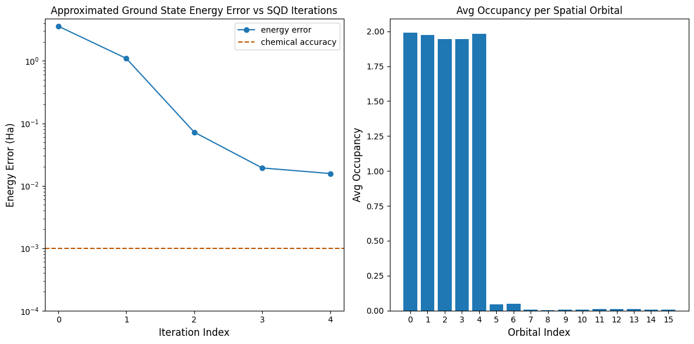

{/* doqumentation-source-hash: 16b72ae6 */}

import TutorialFeedback from '@site/src/components/TutorialFeedback';

<OpenInLabBanner notebookPath="qiskit-addons/sqd/01_chemistry_hamiltonian.ipynb" />


Dalam tutorial ini kita mengimplementasikan sebuah [pola Qiskit](https://quantum.cloud.ibm.com/docs/guides/intro-to-patterns) yang menunjukkan cara memproses ulang sampel kuantum yang berisik untuk menemukan pendekatan ground state dari Hamiltonian kimia: molekul $N_2$ pada kesetimbangan dalam basis set 6-31G. Kita akan mengikuti [pendekatan diagonalisasi kuantum berbasis sampel](https://arxiv.org/abs/2405.05068) untuk memproses sampel yang diambil dari ansatz Circuit kuantum ``36``-Qubit (dalam hal ini, Circuit LUCJ). Untuk memperhitungkan efek noise kuantum, teknik pemulihan konfigurasi digunakan.

Pola ini dapat dijelaskan dalam empat langkah:

1. **Langkah 1: Pemetaan ke masalah kuantum**
    - Buat ansatz untuk mengestimasi ground state
2. **Langkah 2: Optimasi masalah**
    - Transpile ansatz untuk backend
3. **Langkah 3: Jalankan eksperimen**
    - Ambil sampel dari ansatz menggunakan primitif ``Sampler``
4. **Langkah 4: Proses ulang hasil**
   - Loop pemulihan konfigurasi self-consistent
       - Proses ulang seluruh set sampel bitstring, menggunakan pengetahuan awal tentang jumlah partikel dan rata-rata hunian orbital yang dihitung pada iterasi terbaru.
       - Buat kumpulan subsampel secara probabilistik dari bitstring yang telah dipulihkan.
       - Proyeksikan dan diagonalisasikan Hamiltonian molekuler pada setiap subruang yang disampel.
       - Simpan energi ground state minimum yang ditemukan di semua kumpulan dan perbarui rata-rata hunian orbital.

Untuk contoh ini, Hamiltonian elektron-berinteraksi memiliki bentuk umum:

$$
\hat{H} = \sum_{ \substack{pr\\\sigma} } h_{pr} \, \hat{a}^\dagger_{p\sigma} \hat{a}_{r\sigma}
+ 
\sum_{ \substack{prqs\\\sigma\tau} }
\frac{(pr|qs)}{2} \, 
\hat{a}^\dagger_{p\sigma}
\hat{a}^\dagger_{q\tau}
\hat{a}_{s\tau}
\hat{a}_{r\sigma}
$$

$\hat{a}^\dagger_{p\sigma}$/$\hat{a}_{p\sigma}$ adalah operator kreasi/anihilasi fermionik yang terkait dengan elemen basis set ke-$p$ dan spin $\sigma$. $h_{pr}$ dan $(pr|qs)$ adalah integral elektronik satu- dan dua-badan.

Alur kerja SQD dengan pemulihan konfigurasi self-consistent digambarkan dalam diagram berikut.


SQD diketahui bekerja dengan baik ketika eigenstate target bersifat jarang: fungsi gelombang didukung dalam satu set state basis $\mathcal{S} = \{|x\rangle \}$ yang ukurannya tidak bertambah secara eksponensial seiring ukuran masalah. Dalam skenario ini, diagonalisasi Hamiltonian yang diproyeksikan ke subruang yang didefinisikan oleh $\mathcal{S}$:
$$
H_\mathcal{S} = P_\mathcal{S} H  P_\mathcal{S} \textrm{ with } P_\mathcal{S} = \sum_{x \in \mathcal{S}} |x \rangle \langle x |;
$$
menghasilkan pendekatan yang baik untuk eigenstate target. Peran perangkat kuantum adalah menghasilkan sampel dari anggota $\mathcal{S}$ saja. Pertama, sebuah Circuit kuantum mempersiapkan state $|\Psi\rangle$ di perangkat kuantum. Pengkodean Jordan-Wigner digunakan. Akibatnya, anggota basis komputasi merepresentasikan state Fock (konfigurasi/determinan elektronik). Circuit disampel dalam basis komputasi, menghasilkan set konfigurasi berisik $\tilde{\mathcal{X}}$. Konfigurasi direpresentasikan oleh bitstring. Set $\tilde{\mathcal{X}}$ kemudian dimasukkan ke blok pemrosesan ulang klasik, di mana [teknik pemulihan konfigurasi self-consistent](https://arxiv.org/abs/2405.05068) digunakan. Dalam kerangka SQD, peran perangkat kuantum adalah menghasilkan distribusi probabilitas.
### Langkah 1: Petakan masalah ke Circuit kuantum {#step-1-map-problem-to-a-quantum-circuit}

Dalam tutorial ini, kita akan mendekati energi ground state molekul $N_2$. Pertama, kita akan menentukan molekul dan propertinya. Selanjutnya, kita akan membuat ansatz [local unitary cluster Jastrow (LUCJ)](https://pubs.rsc.org/en/content/articlelanding/2023/sc/d3sc02516k) (Circuit kuantum) untuk menghasilkan sampel dari komputer kuantum guna estimasi energi ground state.

Pertama, kita akan menentukan molekul dan propertinya.

```python
# Added by doQumentation — required packages for this notebook
!pip install -q ffsim matplotlib numpy pyscf qiskit qiskit-addon-sqd qiskit-ibm-runtime
```

```python
import warnings

warnings.filterwarnings("ignore")

import pyscf
import pyscf.cc
import pyscf.mcscf

# Specify molecule properties
open_shell = False
spin_sq = 0

# Build N2 molecule
mol = pyscf.gto.Mole()
mol.build(
    atom=[["N", (0, 0, 0)], ["N", (1.0, 0, 0)]],
    basis="6-31g",
    symmetry="Dooh",
)

# Define active space
n_frozen = 2
active_space = range(n_frozen, mol.nao_nr())

# Get molecular integrals
scf = pyscf.scf.RHF(mol).run()
num_orbitals = len(active_space)
n_electrons = int(sum(scf.mo_occ[active_space]))
num_elec_a = (n_electrons + mol.spin) // 2
num_elec_b = (n_electrons - mol.spin) // 2
cas = pyscf.mcscf.CASCI(scf, num_orbitals, (num_elec_a, num_elec_b))
mo = cas.sort_mo(active_space, base=0)
hcore, nuclear_repulsion_energy = cas.get_h1cas(mo)
eri = pyscf.ao2mo.restore(1, cas.get_h2cas(mo), num_orbitals)

# Compute exact energy
exact_energy = cas.run().e_tot
```

```text
converged SCF energy = -108.835236570775
CASCI E = -109.046671778080  E(CI) = -32.8155692383188  S^2 = 0.0000000
```

Selanjutnya, kita akan membuat ansatz. Ansatz ``LUCJ`` adalah Circuit kuantum terparameter, dan kita akan menginisialisasinya dengan amplitudo `t2` dan `t1` yang diperoleh dari perhitungan CCSD.

```python
# Get CCSD t2 amplitudes for initializing the ansatz
ccsd = pyscf.cc.CCSD(scf, frozen=[i for i in range(mol.nao_nr()) if i not in active_space]).run()
t1 = ccsd.t1
t2 = ccsd.t2
```

```text
E(CCSD) = -109.0398256929734  E_corr = -0.2045891221988311
```

Kita akan menggunakan paket [ffsim](https://github.com/qiskit-community/ffsim/tree/main) untuk membuat dan menginisialisasi ansatz dengan amplitudo `t2` dan `t1` yang dihitung di atas. Karena molekul kita memiliki state Hartree-Fock closed-shell, kita akan menggunakan varian spin-balanced dari ansatz UCJ, [UCJOpSpinBalanced](https://qiskit-community.github.io/ffsim/api/ffsim.html#ffsim.UCJOpSpinBalanced).

Karena hardware IBM target kita memiliki topologi heavy-hex, kita akan mengadopsi [pola _zig-zag_ untuk interaksi Qubit](https://pubs.rsc.org/en/content/articlehtml/2023/sc/d3sc02516k). Dalam pola ini, orbital (yang direpresentasikan oleh Qubit) dengan spin yang sama terhubung dengan topologi garis (lingkaran merah dan biru) di mana setiap garis mengambil bentuk zig-zag karena konektivitas heavy-hex dari hardware target. Juga, karena topologi heavy-hex, orbital untuk spin yang berbeda memiliki koneksi antara setiap orbital ke-4 (0, 4, 8, dst.) (lingkaran ungu).


```python
import ffsim
from qiskit import QuantumCircuit, QuantumRegister

n_reps = 1
alpha_alpha_indices = [(p, p + 1) for p in range(num_orbitals - 1)]
alpha_beta_indices = [(p, p) for p in range(0, num_orbitals, 4)]

ucj_op = ffsim.UCJOpSpinBalanced.from_t_amplitudes(
    t2=t2,
    t1=t1,
    n_reps=n_reps,
    interaction_pairs=(alpha_alpha_indices, alpha_beta_indices),
)

nelec = (num_elec_a, num_elec_b)

# create an empty quantum circuit
qubits = QuantumRegister(2 * num_orbitals, name="q")
circuit = QuantumCircuit(qubits)

# prepare Hartree-Fock state as the reference state and append it to the quantum circuit
circuit.append(ffsim.qiskit.PrepareHartreeFockJW(num_orbitals, nelec), qubits)

# apply the UCJ operator to the reference state
circuit.append(ffsim.qiskit.UCJOpSpinBalancedJW(ucj_op), qubits)
circuit.measure_all()
```

### Langkah 2: Optimasi masalah {#step-2-optimize-the-problem}
Selanjutnya, kita akan mengoptimalkan Circuit kita untuk hardware target. Kita perlu memilih perangkat hardware yang akan digunakan sebelum mengoptimalkan Circuit kita. Kita akan menggunakan fake backend 127-Qubit dari ``qiskit_ibm_runtime`` untuk mengemulasi perangkat nyata. Untuk menjalankan pada QPU nyata, cukup ganti fake backend dengan backend nyata. Lihat [dokumentasi Qiskit IBM Runtime](https://quantum.cloud.ibm.com/docs/guides/get-started-with-primitives#get-started-with-sampler) untuk info lebih lanjut.

```python
from qiskit_ibm_runtime.fake_provider import FakeSherbrooke

backend = FakeSherbrooke()
```

Selanjutnya, kami merekomendasikan langkah-langkah berikut untuk mengoptimalkan ansatz dan membuatnya kompatibel dengan hardware.

- Pilih Qubit fisik (`initial_layout`) dari hardware target yang mengikuti pola zig-zag yang dijelaskan di atas. Menyusun Qubit dalam pola ini menghasilkan Circuit yang efisien dan kompatibel dengan hardware dengan lebih sedikit Gate.
- Buat staged pass manager menggunakan fungsi [generate_preset_pass_manager](https://quantum.cloud.ibm.com/docs/api/qiskit/transpiler_preset#generate_preset_pass_manager) dari Qiskit dengan pilihan `backend` dan `initial_layout` kamu.
- Set tahap `pre_init` dari staged pass manager kamu ke `ffsim.qiskit.PRE_INIT`. `ffsim.qiskit.PRE_INIT` mencakup pass Transpiler Qiskit yang mendekomposisi Gate menjadi rotasi orbital dan kemudian menggabungkan rotasi orbital, sehingga menghasilkan lebih sedikit Gate di Circuit akhir.
- Jalankan pass manager pada Circuit kamu.

```python
from qiskit.transpiler.preset_passmanagers import generate_preset_pass_manager

spin_a_layout = [0, 14, 18, 19, 20, 33, 39, 40, 41, 53, 60, 61, 62, 72, 81, 82]
spin_b_layout = [2, 3, 4, 15, 22, 23, 24, 34, 43, 44, 45, 54, 64, 65, 66, 73]
initial_layout = spin_a_layout + spin_b_layout

pass_manager = generate_preset_pass_manager(
    optimization_level=3, backend=backend, initial_layout=initial_layout
)

# without PRE_INIT passes
isa_circuit = pass_manager.run(circuit)
print(f"Gate counts (w/o pre-init passes): {isa_circuit.count_ops()}")

# with PRE_INIT passes
# We will use the circuit generated by this pass manager for hardware execution
pass_manager.pre_init = ffsim.qiskit.PRE_INIT
isa_circuit = pass_manager.run(circuit)
print(f"Gate counts (w/ pre-init passes): {isa_circuit.count_ops()}")
```

```text
Gate counts (w/o pre-init passes): OrderedDict({'rz': 4420, 'sx': 3432, 'ecr': 1366, 'x': 239, 'measure': 32, 'barrier': 1})
Gate counts (w/ pre-init passes): OrderedDict({'rz': 2460, 'sx': 2156, 'ecr': 730, 'x': 71, 'measure': 32, 'barrier': 1})
```

### Langkah 3: Jalankan eksperimen {#step-3-execute-experiments}
Setelah mengoptimalkan Circuit untuk eksekusi hardware, kita siap menjalankannya di hardware target dan mengumpulkan sampel untuk estimasi energi ground state. Karena kita hanya memiliki satu Circuit, kita akan menggunakan [mode eksekusi Job](https://quantum.cloud.ibm.com/docs/guides/execution-modes) Qiskit Runtime dan mengeksekusi Circuit kita.

***Catatan: Kami telah mengomentari kode untuk menjalankan Circuit pada QPU dan meninggalkannya sebagai referensi pengguna. Alih-alih menjalankan pada hardware nyata di panduan ini, kita hanya akan menghasilkan sampel acak yang diambil dari distribusi uniform.***

```python
import numpy as np
from qiskit_addon_sqd.counts import generate_bit_array_uniform

# from qiskit_ibm_runtime import SamplerV2 as Sampler

# sampler = Sampler(mode=backend)
# job = sampler.run([isa_circuit], shots=10_000)
# primitive_result = job.result()
# pub_result = primitive_result[0]
# bit_array = pub_result.data.meas

rng = np.random.default_rng(24)
bit_array = generate_bit_array_uniform(10_000, num_orbitals * 2, rand_seed=rng)
```

### Langkah 4: Proses ulang hasil {#step-4-post-process-results}
Sekarang, kita jalankan algoritma SQD menggunakan fungsi `diagonalize_fermionic_hamiltonian`. Lihat [dokumentasi API](../apidocs/qiskit_addon_sqd.fermion.rst#qiskit_addon_sqd.fermion.diagonalize_fermionic_hamiltonian) untuk penjelasan argumen fungsi ini.

Solver yang disertakan dalam addon SQD menggunakan implementasi CI terseleksi dari PySCF, khususnya [pyscf.fci.selected_ci.kernel_fixed_space](https://pyscf.org/pyscf_api_docs/pyscf.fci.html#pyscf.fci.selected_ci.kernel_fixed_space). Contoh di bawah ini juga menunjukkan cara meneruskan argumen kata kunci ke fungsi tersebut melalui solver yang disertakan. Di sini kita meneruskan argumen `max_cycle`.

```python
from functools import partial

from qiskit_addon_sqd.fermion import SCIResult, diagonalize_fermionic_hamiltonian, solve_sci_batch

# SQD options
energy_tol = 1e-3
occupancies_tol = 1e-3
max_iterations = 5

# Eigenstate solver options
num_batches = 1
samples_per_batch = 300
symmetrize_spin = True
carryover_threshold = 1e-4
max_cycle = 200

# Pass options to the built-in eigensolver. If you just want to use the defaults,
# you can omit this step, in which case you would not specify the sci_solver argument
# in the call to diagonalize_fermionic_hamiltonian below.
sci_solver = partial(solve_sci_batch, spin_sq=0.0, max_cycle=max_cycle)

# List to capture intermediate results
result_history = []

def callback(results: list[SCIResult]):
    result_history.append(results)
    iteration = len(result_history)
    print(f"Iteration {iteration}")
    for i, result in enumerate(results):
        print(f"\tSubsample {i}")
        print(f"\t\tEnergy: {result.energy + nuclear_repulsion_energy}")
        print(f"\t\tSubspace dimension: {np.prod(result.sci_state.amplitudes.shape)}")

result = diagonalize_fermionic_hamiltonian(
    hcore,
    eri,
    bit_array,
    samples_per_batch=samples_per_batch,
    norb=num_orbitals,
    nelec=nelec,
    num_batches=num_batches,
    energy_tol=energy_tol,
    occupancies_tol=occupancies_tol,
    max_iterations=max_iterations,
    sci_solver=sci_solver,
    symmetrize_spin=symmetrize_spin,
    carryover_threshold=carryover_threshold,
    callback=callback,
    seed=rng,
)
```

```text
Iteration 1
	Subsample 0
		Energy: -105.45358671756313
		Subspace dimension: 5476
Iteration 2
	Subsample 0
		Energy: -107.95172900082163
		Subspace dimension: 249001
Iteration 3
	Subsample 0
		Energy: -108.97460330369815
		Subspace dimension: 339889
Iteration 4
	Subsample 0
		Energy: -109.02739376648793
		Subspace dimension: 440896
Iteration 5
	Subsample 0
		Energy: -109.030972328451
		Subspace dimension: 597529
```

Sekarang, kita plot hasilnya.

Plot pertama menunjukkan bahwa setelah beberapa iterasi kita mengestimasi energi ground state dalam ``~16 mH`` (akurasi kimia biasanya diterima sebagai ``1 kcal/mol`` $\approx$ ``1.6 mH``). Ingat, sampel kuantum dalam demo ini adalah noise murni. Sinyal di sini berasal dari pengetahuan *a priori* tentang struktur elektronik dan Hamiltonian molekuler.

Plot kedua menunjukkan rata-rata hunian setiap orbital spasial setelah iterasi terakhir. Kita dapat melihat bahwa elektron spin-up dan spin-down sama-sama menempati lima orbital pertama dengan probabilitas tinggi dalam solusi kita.

```python
import matplotlib.pyplot as plt

# Data for energies plot
x1 = range(len(result_history))
min_e = [
    min(result, key=lambda res: res.energy).energy + nuclear_repulsion_energy
    for result in result_history
]
e_diff = [abs(e - exact_energy) for e in min_e]
yt1 = [1.0, 1e-1, 1e-2, 1e-3, 1e-4]

# Chemical accuracy (+/- 1 milli-Hartree)
chem_accuracy = 0.001

# Data for avg spatial orbital occupancy
y2 = np.sum(result.orbital_occupancies, axis=0)
x2 = range(len(y2))

fig, axs = plt.subplots(1, 2, figsize=(12, 6))

# Plot energies
axs[0].plot(x1, e_diff, label="energy error", marker="o")
axs[0].set_xticks(x1)
axs[0].set_xticklabels(x1)
axs[0].set_yticks(yt1)
axs[0].set_yticklabels(yt1)
axs[0].set_yscale("log")
axs[0].set_ylim(1e-4)
axs[0].axhline(y=chem_accuracy, color="#BF5700", linestyle="--", label="chemical accuracy")
axs[0].set_title("Approximated Ground State Energy Error vs SQD Iterations")
axs[0].set_xlabel("Iteration Index", fontdict={"fontsize": 12})
axs[0].set_ylabel("Energy Error (Ha)", fontdict={"fontsize": 12})
axs[0].legend()

# Plot orbital occupancy
axs[1].bar(x2, y2, width=0.8)
axs[1].set_xticks(x2)
axs[1].set_xticklabels(x2)
axs[1].set_title("Avg Occupancy per Spatial Orbital")
axs[1].set_xlabel("Orbital Index", fontdict={"fontsize": 12})
axs[1].set_ylabel("Avg Occupancy", fontdict={"fontsize": 12})

print(f"Exact energy: {exact_energy:.5f} Ha")
print(f"SQD energy: {min_e[-1]:.5f} Ha")
print(f"Absolute error: {e_diff[-1]:.5f} Ha")
plt.tight_layout()
plt.show()
```

```text
Exact energy: -109.04667 Ha
SQD energy: -109.03097 Ha
Absolute error: 0.01570 Ha
```



<TutorialFeedback />
