{/* doqumentation-source-hash: 768fc01c */}

<OpenInLabBanner notebookPath="workshop/04_Hands-on Introduction to Qiskit.ipynb" />

Di notebook ini kita akan menjelajahi cara memprogram quantum gates dan quantum circuits dengan Qiskit, bahkan cara mengeksekusinya di simulator dan komputer kuantum nyata menggunakan pola Qiskit. Nanti kita juga akan memperkenalkan berbagai cara pengkodean informasi dan akan mengakhiri dengan contoh bonus Quantum Teleportation.
## Sebelum memulai {#before-you-begin}

Ikuti petunjuk [Install and set up](https://docs.quantum.ibm.com/guides/install-qiskit) jika belum, termasuk langkah-langkah untuk [Menyiapkan penggunaan IBM Quantum™ Platform](https://docs.quantum.ibm.com/guides/setup-channel#set-up-to-use-ibm-quantum-platform).

Direkomendasikan menggunakan lingkungan pengembangan [Jupyter](https://jupyter.org/install) untuk berinteraksi dengan komputer kuantum. Pastikan menginstal dukungan visualisasi tambahan yang disarankan (`'qiskit[visualization]'`). Kamu juga butuh paket `matplotlib` untuk bagian kedua contoh ini.

Untuk belajar komputasi kuantum secara umum, kunjungi [Kursus dasar-dasar informasi kuantum](https://learning.quantum.ibm.com/course/basics-of-quantum-information) di IBM Quantum Learning
## Impor {#imports}

```python
# Added by doQumentation — required packages for this notebook
!pip install -q matplotlib numpy qiskit qiskit-aer qiskit-ibm-runtime
```

```python
# Import necessary modules for this notebook
import time
import qiskit

from qiskit import QuantumCircuit
from qiskit.quantum_info import Statevector
from qiskit.visualization import plot_bloch_multivector, plot_state_qsphere
from qiskit_aer import AerSimulator
from qiskit.quantum_info import SparsePauliOp
from qiskit.transpiler.preset_passmanagers import generate_preset_pass_manager
from qiskit_ibm_runtime import EstimatorV2 as Estimator
from qiskit_ibm_runtime import SamplerV2 as Sampler
from qiskit_ibm_runtime import QiskitRuntimeService
from qiskit.visualization import plot_histogram
print(qiskit.__version__)
```

```text
2.3.1
```

Untuk mengeksekusi quantum circuits di perangkat keras, kamu perlu menyiapkan akun terlebih dahulu.
Caranya sebagai berikut:

1. Buka [IBM Quantum&reg; Platform yang telah diperbarui](https://quantum.cloud.ibm.com/).
2. Pergi ke sudut kanan atas (seperti pada gambar di atas), buat token API-mu, dan salin ke lokasi yang aman.
3. Di sel berikutnya, ganti `deleteThisAndPasteYourAPIKeyHere` dengan kunci API-mu.
4. Pergi ke sudut kiri bawah (seperti pada gambar di atas) dan **buat instans**. Pastikan memilih paket open.
5. Setelah instans dibuat, salin kode CRN yang terkait. Mungkin perlu refresh untuk melihat instans tersebut.
6. Di sel di bawah, ganti `deleteThisAndPasteYourCRNHere` dengan kode CRN-mu.

Lihat [panduan ini](https://quantum.cloud.ibm.com/docs/guides/cloud-setup) untuk detail lebih lanjut tentang cara menyiapkan akun IBM Cloud&reg;-mu.

<div class="alert alert-block alert-warning">
    
⚠️ **Catatan:** Perlakukan kunci API-mu seperti kata sandi yang aman. Lihat panduan [Cloud setup](https://quantum.cloud.ibm.com/docs/guides/cloud-setup#cloud-save) untuk informasi lebih lanjut tentang penggunaan kunci API di lingkungan aman maupun tidak tepercaya.
</div>

```python
#your_api_key = "deleteThisAndPasteYourAPIKeyHere"
#your_crn = "deleteThisAndPasteYourCRNHere"

QiskitRuntimeService.save_account(
    channel="ibm_quantum_platform",
    token=your_api_key,
    instance=your_crn,
    overwrite=True
)
```

# 1. Quantum Gates dan Quantum Circuits {#1-quantum-gates-and-quantum-circuits}
Quantum circuits adalah model untuk komputasi kuantum di mana sebuah komputasi adalah rangkaian quantum gates. Mari kita lihat beberapa quantum gates yang populer.

### X Gate {#x-gate}
X gate setara dengan rotasi mengelilingi sumbu-X pada bola Bloch sebesar $\pi$ radian.
Gate ini memetakan $|0\rangle$ ke $|1\rangle$ dan $|1\rangle$ ke $|0\rangle$. Ini adalah padanan kuantum dari gerbang NOT pada komputer klasik dan kadang disebut bit-flip.

$X = \begin{pmatrix}
0 & 1 \\
1 & 0 \\
\end{pmatrix}$

```python
# Let's apply an X-gate on a |0> qubit
qc = QuantumCircuit(1)
qc.x(0)
qc.draw(output='mpl')
```


```python
# Let's see Bloch sphere visualization
sv = Statevector(qc)
plot_bloch_multivector(sv)
```


### H Gate {#h-gate}
Hadamard gate merepresentasikan rotasi sebesar $\pi$ di sekitar sumbu yang berada di tengah-tengah antara sumbu $X$ dan sumbu $Z$.
Gate ini memetakan state basis $|0\rangle$ ke $\frac{|0\rangle + |1\rangle}{\sqrt{2}}$, yang berarti pengukuran akan memiliki probabilitas yang sama antara `1` atau `0`, menciptakan 'superposisi' state. State ini juga ditulis sebagai $|+\rangle$.

$H = \frac{1}{\sqrt{2}}\begin{pmatrix}
1 & 1 \\
1 & -1 \\
\end{pmatrix}$

```python
# Let's apply an H-gate on a |0> qubit
qc = QuantumCircuit(1)
qc.x(0)
qc.h(0)
qc.draw(output='mpl')
```

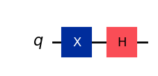

```python
# Let's see Bloch sphere visualization
sv = Statevector(qc)
plot_bloch_multivector(sv)
```


### CX Gate (CNOT Gate) {#cx-gate-cnot-gate}
Gerbang controlled NOT (atau CNOT atau CX) bekerja pada dua Qubit. Gate ini melakukan operasi NOT (setara dengan menerapkan X gate) pada Qubit kedua hanya ketika Qubit pertama adalah $|1\rangle$, dan membiarkannya tidak berubah di kasus lain. Catatan: Qiskit menomori bit dalam string dari kanan ke kiri.

$CX = \begin{pmatrix}
1 & 0 & 0 & 0\\
0 & 1 & 0 & 0\\
0 & 0 & 0 & 1\\
0 & 0 & 1 & 0\\
\end{pmatrix}$

```python
# Let's apply a CX-gate on |11>
qc = QuantumCircuit(2)
qc.x(0)
qc.x(1)
qc.cx(0,1)
qc.draw(output='mpl')
```


```python
sv=Statevector(qc)
plot_state_qsphere(sv)
```


Buat Bell state pertama

$$ |\phi^+ \rangle = \frac{1}{\sqrt 2}(|00 \rangle + |11 \rangle) $$

```python
# Create a Bell state circuit

qc = QuantumCircuit(2)
qc.h(0)
qc.cx(0,1)

# Draw the circuit
qc.draw("mpl")
```

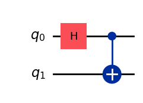

```python
# Plot the state using q-sphere visualization
sv = Statevector(qc)
plot_state_qsphere(sv)
# q-sphere is useful for visualizing states when Bloch sphere fails to
```


Buat Bell state kedua

$$ |\phi^- \rangle = \frac{1}{\sqrt 2}(|00 \rangle - |11 \rangle) $$

```python
# Create a circuit with the second Bell state

qc = QuantumCircuit(2)
qc.x(0)
qc.h(0)
qc.cx(0,1)

qc.draw("mpl")
```


Penjelasannya adalah:
$$
H|1\rangle=\frac{1}{\sqrt{2} }(|0\rangle-|1\rangle) = |-\rangle 
$$

```python
# Get the statevector of the circuit
sv = Statevector(qc)

# Plot the state using qsphere visualization
plot_state_qsphere(sv)
```


Buat state GHZ 3-Qubit

$$ |GHZ \rangle = \frac{1}{\sqrt 2}(|000 \rangle + |111 \rangle) $$

```python
# Create a circuit with 3-qubit GHZ state

qc= QuantumCircuit(3)
qc.h(0)
qc.cx(0,1)
qc.cx(0,2)

qc.draw("mpl")
```


```python
# Get the statevector of the circuit
sv = Statevector(qc)

# Plot the state using qsphere visualization
plot_state_qsphere(sv)
```


Buat state logo Qiskit

$$ |Qiskit \rangle = \frac{1}{\sqrt 2}(|0010 \rangle + |1101 \rangle) $$

```python
# Create a circuit with the Qiskit logo state

qc = QuantumCircuit(4)
qc.h(0)
qc.cx(0,1)
qc.cx(0,2)
qc.cx(0,3)
qc.x(1)

# Draw the circuit
qc.draw("mpl")
```

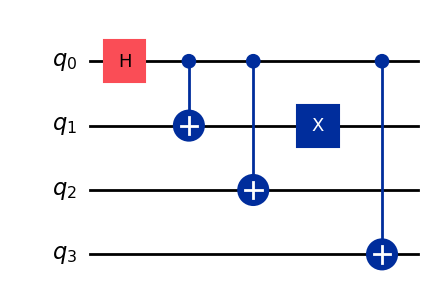

```python
# Get the statevector of the circuit
sv = Statevector(qc)

# Plot the state using qsphere visualization
plot_state_qsphere(sv)
```

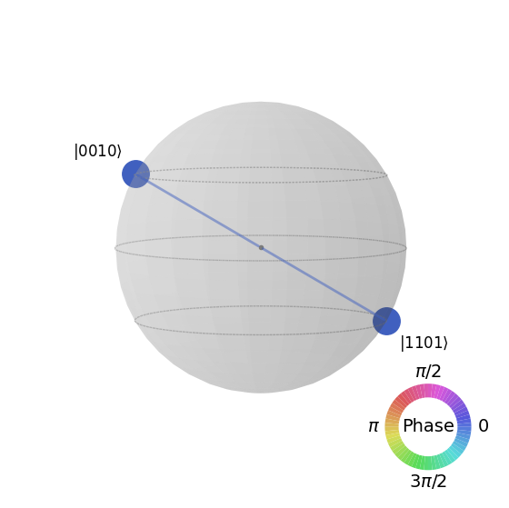

# 2. Buat dan jalankan program kuantum sederhana {#2-create-and-run-a-simple-quantum-program}

Empat langkah untuk menulis program kuantum menggunakan pola Qiskit adalah:

1.  Petakan masalah ke format native kuantum.

2.  Optimalkan circuits dan operator.

3.  Eksekusi menggunakan fungsi primitive kuantum.

4.  Analisis hasilnya.
## 2.1 Petakan masalah ke format native quantum {#21-map-the-problem-to-a-quantum-native-format}

Dalam program quantum, *quantum circuit* adalah format native untuk merepresentasikan instruksi quantum, dan *operator* merepresentasikan observable yang akan diukur. Saat membuat Circuit, kamu biasanya membuat objek [`QuantumCircuit`](https://docs.quantum.ibm.com/api/qiskit/qiskit.circuit.QuantumCircuit#quantumcircuit-class) baru, lalu menambahkan instruksi ke dalamnya secara berurutan.

Cell kode berikut membuat Circuit yang menghasilkan state GHZ, yaitu state di mana tiga Qubit sepenuhnya saling terbelit satu sama lain.

<div class="alert alert-info">

  Qiskit SDK menggunakan penomoran bit LSb 0 di mana digit ke-$n$ memiliki nilai $1 \ll n$ atau $2^n$. Untuk detail lebih lanjut, lihat topik [Bit-ordering in the Qiskit SDK](https://docs.quantum.ibm.com/guides/bit-ordering).

</div>

```python
# Create a GHZ state circuit

qc = QuantumCircuit(3)
qc.h(0)
qc.cx(0,1)
qc.cx(0,2)
# Draw the circuit
qc.draw("mpl")
```

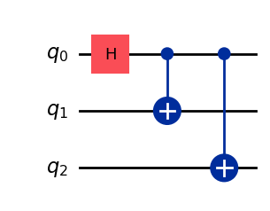

Lihat [`QuantumCircuit`](https://docs.quantum.ibm.com/api/qiskit/qiskit.circuit.QuantumCircuit#quantumcircuit-class) di dokumentasi untuk semua operasi yang tersedia.

Saat membuat quantum circuit, kamu juga harus mempertimbangkan jenis data apa yang ingin dikembalikan setelah eksekusi. Qiskit menyediakan dua cara untuk mengembalikan data: kamu bisa mendapatkan distribusi probabilitas untuk sekumpulan Qubit yang kamu pilih untuk diukur, atau kamu bisa mendapatkan nilai ekspektasi dari suatu observable. Siapkan workload-mu untuk mengukur Circuit dengan salah satu dari dua cara ini menggunakan [Qiskit primitives](https://docs.quantum.ibm.com/guides/get-started-with-primitives) (dijelaskan secara detail di Langkah 3).

Contoh ini mengukur nilai ekspektasi dengan menggunakan submodul `qiskit.quantum_info`, yang ditentukan menggunakan operator (objek matematis yang digunakan untuk merepresentasikan aksi atau proses yang mengubah state quantum). Cell kode berikut membuat enam operator Pauli tiga-Qubit: `ZZZ`, `ZZX`, `ZII`, `XXI`, `ZZI` dan `III`.

```python
# Set up six different observables.

observables_labels = ["ZZZ", "ZZX", "ZII", "XXI", "ZZI", "III"]

observables = [SparsePauliOp(label) for label in observables_labels]
print(observables)
```

```text
[SparsePauliOp(['ZZZ'],
              coeffs=[1.+0.j]), SparsePauliOp(['ZZX'],
              coeffs=[1.+0.j]), SparsePauliOp(['ZII'],
              coeffs=[1.+0.j]), SparsePauliOp(['XXI'],
              coeffs=[1.+0.j]), SparsePauliOp(['ZZI'],
              coeffs=[1.+0.j]), SparsePauliOp(['III'],
              coeffs=[1.+0.j])]
```

<div class="alert alert-info">

  Di sini, operator seperti `ZZI` adalah singkatan dari produk tensor $Z\otimes Z\otimes I$, yang berarti mengukur Z pada Qubit 2 dan Z pada Qubit 1 bersama-sama, dan mendapatkan informasi tentang korelasi antara Qubit 2 dan Qubit 1. Nilai ekspektasi seperti ini biasanya juga ditulis sebagai $\langle Z_2 Z_1 \rangle$.

  Jika state yang kita amati adalah state GHZ tiga-Qubit, maka pengukuran $\langle Z_2 Z_1 \rangle$ seharusnya bernilai 1.

</div>

<span id="optimize" />

## 2.2 Optimalkan Circuit dan operator {#22-optimize-the-circuits-and-operators}

Saat mengeksekusi Circuit di perangkat, penting untuk mengoptimalkan sekumpulan instruksi yang terdapat dalam Circuit dan meminimalkan kedalaman keseluruhan (kira-kira jumlah instruksi) dari Circuit tersebut. Ini memastikan kamu mendapatkan hasil terbaik yang mungkin dengan mengurangi efek error dan noise. Selain itu, instruksi Circuit harus sesuai dengan [Instruction Set Architecture (ISA)](https://docs.quantum.ibm.com/guides/transpile#instruction-set-architecture) perangkat Backend dan harus mempertimbangkan basis Gate dan konektivitas Qubit perangkat tersebut.

Kode berikut membuat instance perangkat nyata untuk mengirimkan job dan mengubah Circuit serta observable agar sesuai dengan ISA Backend tersebut.
Jika kamu belum menyimpan kredensialmu sebelumnya, ikuti petunjuk [di sini](https://docs.quantum.ibm.com/guides/setup-channel#iqp) untuk autentikasi dengan API token-mu.

```python
# Choose a real backend
service = QiskitRuntimeService(channel='ibm_quantum_platform',)
backend = service.least_busy(min_num_qubits=156)
# print backend details
print(
    f"Name: {backend.name}\n"
    f"Version: {backend.backend_version}\n"
    f"No. of qubits: {backend.num_qubits}\n"
    f"Processor type: {backend.processor_type}\n"
)
```

```text
Name: ibm_marrakesh
Version: 1.0.21
No. of qubits: 156
Processor type: {'family': 'Heron', 'revision': '2'}
```

```python
# option to use the AerSimulator instead of a real quantum device
seed_sim=42
backend=AerSimulator.from_backend(backend,seed_simulator=seed_sim)
```

Transpile Circuit ke ISA circuit

```python
# Convert to an ISA circuit and layout-mapped observables.

pm = generate_preset_pass_manager(backend=backend, optimization_level=2)
isa_circuit = pm.run(qc) 

isa_circuit.draw("mpl", idle_wires=False)
```


```python
mapped_observables = [
    observable.apply_layout(isa_circuit.layout) for observable in observables
]
print(mapped_observables)
```

```text
[SparsePauliOp(['IIIIIIIIIIIIIIIIZIIIIIZIIIIIIIIIIIIZIIIIIIIIIIIIIIIIIIIIIIIIIIIIIIIIIIIIIIIIIIIIIIIIIIIIIIIIIIIIIIIIIIIIIIIIIIIIIIIIIIIIIIIIIIIIIIIII'],
              coeffs=[1.+0.j]), SparsePauliOp(['IIIIIIIIIIIIIIIIZIIIIIXIIIIIIIIIIIIZIIIIIIIIIIIIIIIIIIIIIIIIIIIIIIIIIIIIIIIIIIIIIIIIIIIIIIIIIIIIIIIIIIIIIIIIIIIIIIIIIIIIIIIIIIIIIIIII'],
              coeffs=[1.+0.j]), SparsePauliOp(['IIIIIIIIIIIIIIIIZIIIIIIIIIIIIIIIIIIIIIIIIIIIIIIIIIIIIIIIIIIIIIIIIIIIIIIIIIIIIIIIIIIIIIIIIIIIIIIIIIIIIIIIIIIIIIIIIIIIIIIIIIIIIIIIIIIII'],
              coeffs=[1.+0.j]), SparsePauliOp(['IIIIIIIIIIIIIIIIXIIIIIIIIIIIIIIIIIIXIIIIIIIIIIIIIIIIIIIIIIIIIIIIIIIIIIIIIIIIIIIIIIIIIIIIIIIIIIIIIIIIIIIIIIIIIIIIIIIIIIIIIIIIIIIIIIIII'],
              coeffs=[1.+0.j]), SparsePauliOp(['IIIIIIIIIIIIIIIIZIIIIIIIIIIIIIIIIIIZIIIIIIIIIIIIIIIIIIIIIIIIIIIIIIIIIIIIIIIIIIIIIIIIIIIIIIIIIIIIIIIIIIIIIIIIIIIIIIIIIIIIIIIIIIIIIIIII'],
              coeffs=[1.+0.j]), SparsePauliOp(['IIIIIIIIIIIIIIIIIIIIIIIIIIIIIIIIIIIIIIIIIIIIIIIIIIIIIIIIIIIIIIIIIIIIIIIIIIIIIIIIIIIIIIIIIIIIIIIIIIIIIIIIIIIIIIIIIIIIIIIIIIIIIIIIIIIII'],
              coeffs=[1.+0.j])]
```

## 2.3 Eksekusi menggunakan quantum primitives {#23-execute-using-the-quantum-primitives}

Komputer quantum bisa menghasilkan hasil acak, jadi kamu biasanya mengumpulkan sampel output dengan menjalankan Circuit berkali-kali. Kamu bisa memperkirakan nilai observable menggunakan kelas `Estimator`. `Estimator` adalah salah satu dari dua [primitives](https://docs.quantum.ibm.com/guides/get-started-with-primitives); yang lainnya adalah `Sampler`, yang bisa digunakan untuk mendapatkan data dari komputer quantum. Objek-objek ini memiliki metode `run()` yang mengeksekusi pilihan Circuit, observable, dan parameter (jika berlaku), menggunakan [primitive unified bloc (PUB).](https://docs.quantum.ibm.com/guides/primitives#sampler)
Saat menjalankan kode ini pada hardware quantum nyata, pertimbangkan untuk menerapkan [teknik mitigasi dan supresi error](https://quantum.cloud.ibm.com/docs/en/guides/error-mitigation-and-suppression-techniques) untuk mengurangi noise intrinsik komputer quantum.

```python
# Construct the Estimator instance.
estimator = Estimator(mode=backend)
estimator.options.resilience_level = 1
estimator.options.default_shots = 5000
```

Kirimkan job menggunakan Estimator primitive.

```python
# One pub, with one circuit to run against six different observables.
job = estimator.run([(isa_circuit, mapped_observables)]) 

# Use the job ID to retrieve your job data later
print(f">>> Job ID: {job.job_id()}")
```

```text
>>> Job ID: 97ecd036-1767-49b0-a1dc-c71638c3c3c4
```

```text
/Users/jma/miniconda3/envs/3122/lib/python3.12/site-packages/qiskit_ibm_runtime/fake_provider/local_service.py:187: UserWarning: The resilience_level option has no effect in local testing mode.
  warnings.warn("The resilience_level option has no effect in local testing mode.")
```

Setelah job dikirimkan, kamu bisa menunggu sampai job selesai dalam instance Python yang sedang berjalan, atau menggunakan `job_id` untuk mengambil data di lain waktu. (Lihat [bagian tentang mengambil kembali job](https://docs.quantum.ibm.com/guides/monitor-job#retrieve-job-results-at-a-later-time) untuk detailnya.)

Setelah job selesai, periksa outputnya melalui atribut `result()` dari job.

```python
# This is the result of the entire submission.  You submitted one Pub,
# so this contains one inner result (and some metadata of its own).
job_result = job.result()

# This is the result from our single pub, which had six observables,
# so contains information on all six.
pub_result = job.result()[0]
```

Sekarang kita juga bisa mengeksekusi Circuit menggunakan Sampler primitive

```python
# We include the measurements in the circuit
qc.measure_all()
sampler = Sampler(mode=backend)
```

```python
qc.draw(output="mpl")
```

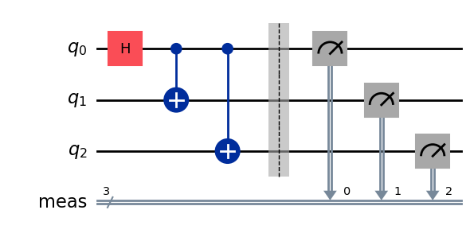

Kirimkan job menggunakan Sampler primitive.

```python
job_sampler = sampler.run(pm.run([qc]))

# Use the job ID to retrieve your job data later
print(f">>> Job ID: {job_sampler.job_id()}")
# Get the results
results_sampler = job_sampler.result()
```

```text
>>> Job ID: a6ee4d2f-c80d-4a86-9a76-e4b1a74502e7
```

## 2.4 Analisis hasilnya {#24-analyze-the-results}

Langkah analisis biasanya adalah tempat di mana kamu memproses hasil menggunakan, misalnya, mitigasi error pengukuran atau zero noise extrapolation (ZNE). Kamu bisa memasukkan hasil ini ke workflow lain untuk analisis lebih lanjut atau menyiapkan plot nilai dan data kunci. Secara umum, langkah ini spesifik untuk masalahmu. Untuk contoh ini, plot setiap nilai ekspektasi yang diukur untuk Circuit kita.

Nilai ekspektasi dan deviasi standar untuk observable yang kamu tentukan ke Estimator diakses melalui atribut `PubResult.data.evs` dan `PubResult.data.stds` dari hasil job. Untuk mendapatkan hasil dari Sampler, gunakan fungsi `PubResult.data.meas.get_counts()`, yang akan mengembalikan `dict` pengukuran dalam bentuk bitstring sebagai key dan jumlah sebagai nilai yang sesuai. Untuk informasi lebih lanjut, lihat [Mulai dengan Sampler.](https://docs.quantum.ibm.com/guides/get-started-with-primitives#get-started-with-sampler)

```python
# Plot the result
from matplotlib import pyplot as plt
values = pub_result.data.evs
errors = pub_result.data.stds
# plotting graph
# Plotting with error bars
plt.errorbar(observables_labels, values, yerr=errors, fmt='-o', capsize=5)
plt.xlabel("Observables")
plt.ylabel("Values")
plt.title("Plot of Observables vs Values with Error Bars")
plt.grid(True)
plt.tight_layout()
plt.show()
```


Kita melihat bahwa observable $ZZI$ dan $III$ memiliki nilai ekspektasi 1, karena $ZZI$ menghasilkan dua tanda minus yang saling menghilangkan, dan $III$ bertindak sebagai identitas, membiarkan state GHZ tidak berubah. Sisa observable memiliki nilai ekspektasi 0, karena operator $Z$-nya menghasilkan jumlah tanda minus yang ganjil, atau operator $X$ membalik sejumlah Qubit yang membuat state yang bertumpang tindih menjadi ortogonal.

Sekarang kita plot hasil untuk Sampler

```python
counts_list = results_sampler[0].data.meas.get_counts()
print(counts_list)
print(f"Outcomes : {counts_list}")
display(plot_histogram(counts_list, title="GHZ state"))
```

```text
{'111': 480, '000': 503, '101': 8, '100': 9, '001': 3, '011': 6, '010': 10, '110': 5}
Outcomes : {'111': 480, '000': 503, '101': 8, '100': 9, '001': 3, '011': 6, '010': 10, '110': 5}
```


## 2.5 Skala ke jumlah Qubit yang besar {#25-scale-to-large-numbers-of-qubits}

Dalam komputasi quantum, pekerjaan skala utility sangat penting untuk membuat kemajuan di bidang ini. Pekerjaan semacam itu membutuhkan komputasi yang dilakukan dalam skala yang jauh lebih besar; bekerja dengan Circuit yang mungkin menggunakan lebih dari 100 Qubit dan lebih dari 1000 Gate. Contoh ini mengambil langkah kecil ke arah tersebut dengan menskalakan masalah GHZ ke $n=10$ Qubit. Ini menggunakan alur kerja Qiskit patterns dan diakhiri dengan mengukur nilai ekspektasi $\langle Z_0 Z_i \rangle$.

### Langkah 1. Petakan masalahnya {#step-1-map-the-problem}

Tulis fungsi yang mengembalikan `QuantumCircuit` yang mempersiapkan state GHZ $n$-Qubit (pada dasarnya Bell state yang diperluas), lalu gunakan fungsi tersebut untuk mempersiapkan state GHZ 10-Qubit dan kumpulkan observable yang akan diukur.

```python
def get_qc_for_n_qubit_GHZ_state(n: int) -> QuantumCircuit:

    qc = QuantumCircuit(n) 
    qc.h(0)
    for i in range(n-1):
        qc.cx(i, i+1)
    return qc
n = 10
qc_n_GHZ = get_qc_for_n_qubit_GHZ_state(n)
qc_n_GHZ.draw("mpl")
```

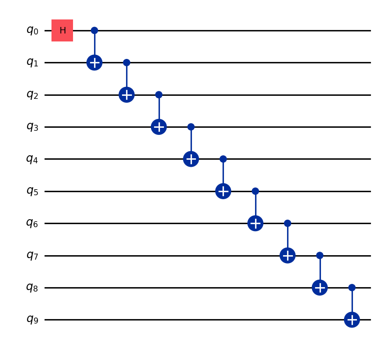

Selanjutnya, petakan ke operator yang menjadi perhatian. Contoh ini menggunakan operator `ZZ` antar Qubit untuk memeriksa perilaku saat mereka semakin jauh terpisah. Nilai ekspektasi antar Qubit yang jauh yang semakin tidak akurat (terdistorsi) akan mengungkapkan tingkat noise yang ada.

```python
# ZZII...II, ZIZI...II, ... , ZIII...IZ
operator_strings = [
    "Z" + i * "I" + "Z" + "I" * (n-i-2) for i in range(n-1) 
]
print(operator_strings)
print(len(operator_strings))

operators = [SparsePauliOp(operator) for operator in operator_strings]
```

```text
['ZZIIIIIIII', 'ZIZIIIIIII', 'ZIIZIIIIII', 'ZIIIZIIIII', 'ZIIIIZIIII', 'ZIIIIIZIII', 'ZIIIIIIZII', 'ZIIIIIIIZI', 'ZIIIIIIIIZ']
9
```

### Langkah 2. Optimalkan masalah untuk eksekusi pada Backend quantum {#step-2-optimize-the-problem-for-execution-on-quantum-backend}

Ubah Circuit dan observable agar sesuai dengan ISA Backend.

```python
# Convert to an ISA circuit and layout-mapped observables.
pm = generate_preset_pass_manager(backend=backend, optimization_level=2)
isa_circuit = pm.run(qc_n_GHZ) 
isa_operators_list = [operator.apply_layout(isa_circuit.layout) for operator in operators]
```

### Langkah 3. Eksekusi pada Backend {#step-3-execute-on-backend}

Kirimkan job dan jika kamu mengeksekusinya pada hardware, aktifkan supresi error dengan menggunakan teknik untuk mengurangi error yang disebut [dynamical decoupling.](https://docs.quantum.ibm.com/api/qiskit-ibm-runtime/options-dynamical-decoupling-options) Tingkat resilience menentukan seberapa besar ketahanan terhadap error yang dibangun. Tingkat yang lebih tinggi menghasilkan hasil yang lebih akurat, dengan biaya waktu pemrosesan yang lebih lama. Untuk penjelasan lebih lanjut tentang opsi yang ditetapkan dalam kode berikut, lihat [Configure error mitigation for Qiskit Runtime.](https://docs.quantum.ibm.com/guides/configure-error-mitigation)

```python
# Submit the circuit to Estimator
job = estimator.run([(isa_circuit, isa_operators_list)])
job_id = job.job_id()
```

```text
/Users/jma/miniconda3/envs/3122/lib/python3.12/site-packages/qiskit_ibm_runtime/fake_provider/local_service.py:187: UserWarning: The resilience_level option has no effect in local testing mode.
  warnings.warn("The resilience_level option has no effect in local testing mode.")
```

### Langkah 4. Pasca-proses hasil {#step-4-post-process-results}

Untuk lebih memahami perilaku state quantum yang terbelit pada hardware nyata, kita analisis korelasi berpasangan antar Qubit dalam basis Z. Secara khusus, kita melihat nilai ekspektasi ⟨Z₀Zᵢ⟩, yang mengukur seberapa kuat Qubit 0 berkorelasi dengan setiap Qubit i lainnya. Khususnya kita akan memplot: 
$$
\langle Z_i Z_0 \rangle / \langle Z_1 Z_0 \rangle 
$$
<div class="alert alert-success">

Nilai apa dari $\langle Z_i Z_0 \rangle / \langle Z_1 Z_0 \rangle $ yang kamu harapkan muncul dalam plot?

Pilihan:

a) Menurun seiring kita meningkatkan $i$

b) Konstan di 1

c) Deviasi kecil di sekitar 1

d) Bergantian antara 1 dan 0 untuk nilai $i$ ganjil dan genap

</div>

```python
data = list(range(1, len(operators) + 1))  # Distance between the Z operators
result = job.result()[0]
values = result.data.evs  # Expectation value at each Z operator.
values = [
    v / values[0] for v in values
]  # Normalize the expectation values to evaluate how they decay with distance.

plt.plot(data, values, marker="o", label=f"{n}-qubit GHZ state")
plt.xlabel("Distance between qubits $i$")
plt.ylabel(r"$\langle Z_i Z_0 \rangle / \langle Z_1 Z_0 \rangle $")
plt.legend()
plt.show()
```


Dalam plot ini kita melihat bahwa $\langle Z_0 Z_i \rangle$ berfluktuasi di sekitar nilai 1, meskipun dalam simulasi ideal semua $\langle Z_0 Z_i \rangle$ seharusnya bernilai 1.

Seperti yang bisa kamu lihat, hasil eksperimen 10 Qubit sudah bagus namun masih memiliki beberapa error. Salah satu cara untuk meningkatkan hasil adalah dengan mengimplementasikan state GHZ dengan lebih efisien.

Biasanya state GHZ diimplementasikan dengan urutan Gate CNOT seperti tangga. Namun, kamu bisa mengimplementasikan state GHZ dengan lebih efisien, mengurangi kedalaman 2-Qubit dari `n` menjadi `n/2` atau kurang.
<div class="alert alert-info">

Salah satu metrik penting untuk mengukur seberapa akurat hasil yang akan didapat, atau seberapa kecil noise untuk sebuah Circuit, adalah kedalaman Gate 2-Qubit. Ini karena tingkat error untuk Gate 2-Qubit (~10 kali lebih tinggi dari Gate single-Qubit) mendominasi error keseluruhan Circuit. Gunakan kode berikut untuk mendapatkan kedalaman Gate 2-Qubit dari sebuah Circuit.

```
qc.depth(lambda x: x.operation.num_qubits == 2)
```

</div>

```python
def better_ghz(n):
    "fan out"
    s = int(n / 2)
    qc = QuantumCircuit(n)
    qc.h(s)
    for m in range(s, 0, -1):
        qc.cx(m, m - 1)
        if not (n % 2 == 0 and m == s): 
            qc.cx(n - m - 1, n - m)
    return qc

better_ghz(n).draw("mpl")
```

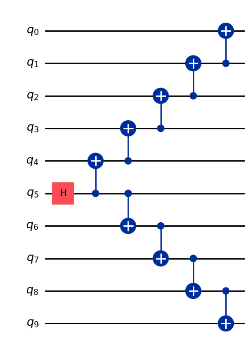

```python
# Check 2-qubit gate depth before transpilation
qc_better_ghz = better_ghz(n)
qc_better_ghz.depth(lambda x: x.operation.num_qubits == 2)
```

```text
5
```

Hal menarik yang perlu diperhatikan di sini adalah bahwa kita berhasil mengurangi [**kedalaman quantum**](https://www.youtube.com/watch?v=7AVIc7SkX3M) dari Circuit yang ingin kita eksekusi hanya dengan berpikir cerdas dan menemukan cara berbeda untuk memprogramnya. Namun, akan ada situasi dan algoritma di mana kita tidak bisa mengandalkan trik cerdas seperti ini. Di sinilah Transpiler sangat berguna, ia membantu kita mengoptimalkan semua aspek ini secara efisien, sehingga kita tidak perlu terlalu khawatir tentangnya.
# 3. Menyandikan Informasi {#3-encoding-information}

## 3.1 Amplitude encoding {#31-amplitude-encoding}

Sekarang setelah kita melihat cara membuat quantum circuit, menarik untuk menjelajahi bagaimana kita bisa menyandikan informasi klasik ke dalam state quantum. Salah satu metode yang powerful adalah amplitude encoding, di mana amplitudo state quantum merepresentasikan komponen dari vektor klasik.

Mari kita pertimbangkan contoh sederhana. Misalkan kita ingin menyandikan vektor klasik

$$
\vec{x} = \begin{bmatrix} x_0 \\ x_1 \\ x_2 \\ x_3 \end{bmatrix}
$$

ke dalam state quantum dari dua Qubit. Tujuannya adalah mempersiapkan state quantum:

$$
\ket{\psi} = x_0\ket{00} + x_1\ket{01} + x_2\ket{10} + x_3\ket{11}
$$
di mana $ x_0, x_1, x_2, x_3 \in \mathbb{R} $ (atau $ \mathbb{C} $) dan vektornya ternormalisasi sehingga:

$$
|x_0|^2 + |x_1|^2 + |x_2|^2 + |x_3|^2 = 1
$$

Sekarang kita perhatikan contoh khusus: $ \vec{x} = [0.8924,  0.3696, 0.2391, 0.0990] $

Maka keadaan kuantum yang bersesuaian adalah:

$$
\begin{aligned}
\ket{\psi} &= 0.8924\,\ket{00}
+ 0.3696\,\ket{01}
+ 0.2391\,\ket{10}
+ 0.0990\,\ket{11}
\end{aligned}
$$
Keadaan ini bisa disiapkan menggunakan kombinasi rotation Gate $R_y$ dengan sudut $\pi/6$ dan $\pi/4$ untuk Qubit 0 dan 1 secara berturut-turut

```python
from qiskit import QuantumCircuit
from qiskit_aer import AerSimulator
import numpy as np

qc = QuantumCircuit(2)

qc.ry(np.pi / 6, 0)
qc.ry(np.pi / 4, 1)

simulator = AerSimulator()
qc.save_statevector()
result = simulator.run(qc).result()
statevector = result.get_statevector()

print("Statevector:", statevector)
qc.draw(output="mpl")
```

```text
Statevector: Statevector([0.8923991 +0.j, 0.23911762+0.j, 0.36964381+0.j,
             0.09904576+0.j],
            dims=(2, 2))
```

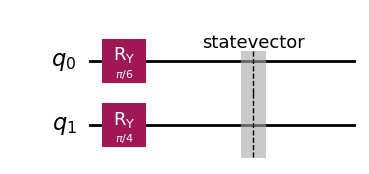

```python
from qiskit.quantum_info import Statevector

# Define our vector
v = np.array([0.8924,  0.3696, 0.2391, 0.0990]) 
v = v/np.linalg.norm(v)
# Create a statevector from the vector
state = Statevector(v)

# Initialize a quantum circuit with 2 qubits
qc = QuantumCircuit(2)
qc.initialize(state.data, [0, 1])

# Optional: simulate the state
print("Statevector:", state)

# Visualize the circuit
qc.decompose().decompose().decompose().decompose().decompose().draw("mpl")
```

```text
Statevector: Statevector([0.89242154+0.j, 0.36960892+0.j, 0.23910577+0.j,
             0.09900239+0.j],
            dims=(2, 2))
```

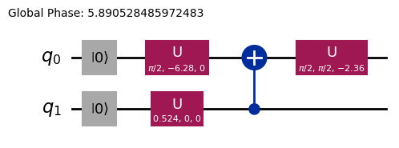

Jadi kita sudah melihat cara mengkodekan informasi menggunakan rotational Gate.
## 3.2 Angle encoding dan Circuit berparameter {#32-angle-encoding-dan-circuit-berparameter}

Salah satu cara yang menarik untuk mengkodekan informasi ke komputer kuantum adalah merancang Circuit kuantum yang memuat beberapa sudut rotasi $\vec{\theta}$ atau parameter yang bisa disetel untuk merepresentasikan sekumpulan fungsi $f(\vec{\theta})$. Misalnya, mari kita perhatikan Circuit kuantum berparameter berikut ini:

```python
from qiskit import QuantumCircuit
from qiskit.circuit import Parameter

# Define a symbolic parameter
theta = Parameter("θ")

qc = QuantumCircuit(2)
# We applied a parametrized RX gate
qc.rx(theta, 0)
qc.cx(0, 1)
qc.draw("mpl")
```

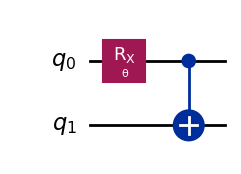

Secara matematis, kita bisa menganalisis sekumpulan fungsi apa yang bisa kita representasikan dengan Circuit ini:

$$ 
\text{CNOT}_{01} \, R_x^{\{0\}}(\theta) |00\rangle = \text{CNOT}_{01} \left( \cos(\theta/2)\ket{00} - i\sin(\theta/2)\ket{10} \right) = \cos(\theta/2)\ket{00} - i\sin(\theta/2)\ket{11}
$$
Cukup jelas bahwa jumlah keadaan yang bisa kita representasikan dengan Circuit kuantum ini terbatas, karena kita tidak bisa merepresentasikan keadaan $\ket{10}$ atau $\ket{01}$ misalnya. Namun, sekumpulan keadaan yang bisa kita representasikan mulai bertambah luas ketika kita menambahkan lebih banyak rotasi di tempat yang tepat:

```python
from qiskit import QuantumCircuit
from qiskit.circuit import Parameter

# Define a symbolic parameter
theta1 = Parameter("θ1")
theta2 = Parameter("θ2")

qc = QuantumCircuit(2)
qc.rx(theta1, 0)
qc.rx(theta2, 1)
qc.cx(0, 1)
qc.draw("mpl")
```

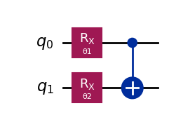

Dalam kasus ini, keadaan kuantum yang akan kita representasikan adalah:

$$
\begin{align*}
\text{CNOT}_{01} \, R_x^{\{1}}(\theta_2) R_x^{\{0}}(\theta_1) \ket{00}
&= \text{CNOT}_{01} \, R_x^{\{1}}(\theta_2)\left( \cos(\theta_1/2)\ket{00} - i\sin(\theta_1/2)\ket{10} \right) \\
&= \text{CNOT}_{01}\left( \cos(\theta_1/2)\cos(\theta_2/2)\ket{00} - i\cos(\theta_1/2)\sin(\theta_2/2)\ket{01} \right. \\
&\quad \left. - i\sin(\theta_1/2)\cos(\theta_2/2)\ket{10} + \sin(\theta_1/2)\sin(\theta_2/2)\ket{11} \right) \\
&= \cos(\theta_1/2)\cos(\theta_2/2)\ket{00} - i\cos(\theta_1/2)\sin(\theta_2/2)\ket{01} \\
&\quad + \sin(\theta_1/2)\sin(\theta_2/2)\ket{10} - i\sin(\theta_1/2)\cos(\theta_2/2)\ket{11} 
\end{align*}
$$
Kita bisa melihat bahwa Circuit ini menghasilkan sekumpulan keadaan kuantum yang lebih luas dibandingkan Circuit sebelumnya. Khususnya, sekarang bisa menghasilkan keadaan dengan amplitudo tak-nol untuk $\ket{01}$ atau $\ket{10}$ yang sebelumnya tidak mungkin dengan Circuit di atas. Namun, Circuit ini masih belum merupakan generator keadaan kuantum universal, meskipun mungkin sudah cukup ekspresif untuk merancang Circuit dengan fleksibilitas tertentu dalam merepresentasikan fungsi-fungsi tertentu. Secara umum, semakin banyak parameter (sudut) independen yang kita tambahkan, semakin ekspresif Circuit tersebut dalam mengaproksimasi keadaan kuantum sembarang.
## Ansatz dan Circuit library {#ansatz-dan-circuit-library}

Jenis Circuit kuantum berparameter seperti ini bisa digunakan untuk membangun [Ansatz](https://quantum.cloud.ibm.com/learning/en/courses/quantum-chem-with-vqe/ansatz), yaitu keadaan kuantum percobaan yang bertujuan mengaproksimasi solusi suatu masalah. Ansatz ini merupakan komponen utama dari [Algoritma Kuantum Variasional](https://quantum.cloud.ibm.com/learning/en/courses/variational-algorithm-design/variational-algorithms), sebuah kelas algoritma kuantum-klasik hibrida yang menggunakan komputer kuantum untuk mengevaluasi fungsi biaya dan optimizer klasik untuk meminimumkannya. Kita akan membahas topik-topik ini secara detail di Unit berikutnya, tapi untuk sekarang, kita akan memperkenalkan cara membangun ansatz sederhana menggunakan [Circuit library di Qiskit](https://quantum.cloud.ibm.com/docs/en/api/qiskit/circuit_library). 

```python
from qiskit.circuit.library import efficient_su2

SU2_ansatz = efficient_su2(4, su2_gates=["rx", "y"], entanglement="linear", reps=1)
SU2_ansatz.decompose().draw(output="mpl")
```


Kita sudah melihat cara membangun Ansatz sederhana menggunakan fungsi `efficient_su2` dari `qiskit.circuit.library` yang mampu menghasilkan beragam keadaan kuantum dengan menyetel parameter $\vec{\theta}$-nya.
# Kesimpulan {#kesimpulan}

Di notebook ini, kamu sudah belajar cara membangun Circuit kuantum, mulai dari membangun Gate kuantum hingga mendefinisikan dan mengukur observable, serta cara menjalankan Circuit-Circuit ini secara efisien di simulator maupun perangkat keras kuantum sungguhan. Kamu juga sudah melihat pentingnya desain Circuit yang cermat untuk meminimalkan kesalahan saat bekerja dengan perangkat kuantum nyata, serta strategi untuk menskalakan Circuit ke jumlah Qubit yang lebih banyak, terutama melalui contoh keadaan GHZ. Selain itu, kamu sudah mengeksplorasi berbagai teknik pengkodean informasi klasik ke keadaan kuantum, termasuk amplitude encoding dan angle encoding. Dengan semua ini, kamu sudah siap untuk beralih ke sesi berikutnya dan mulai bekerja dengan algoritma kuantum.
## Menginstal Qiskit Code Assistant di VSCode {#menginstal-qiskit-code-assistant-di-vscode}
Klik [tautan](https://quantum.cloud.ibm.com/docs/en/guides/qiskit-code-assistant-vscode) ini dan ikuti instruksinya.

# Bonus: Teleportasi Kuantum {#bonus-teleportasi-kuantum}
Saat kamu mendengar istilah teleportasi kuantum, mungkin kamu membayangkan teknologi fiksi ilmiah futuristik yang menghancurkan suatu objek di satu tempat dan memunculkannya kembali di tempat yang jauh. Tapi teleportasi kuantum tidak seperti itu sama sekali. Dalam kenyataannya, yang "diteleportasi" bukan materi, melainkan informasi.

Teleportasi kuantum memungkinkan transfer keadaan kuantum sebuah Qubit dari satu lokasi ke lokasi lain. Meskipun transfer ini tampak seketika, ia tidak melanggar hukum fisika. Bagaimana bisa begitu? Yuk kita telusuri!

Teleportasi kuantum adalah sebuah protokol yang memungkinkan pengirim (Alice) mengirimkan keadaan $|\psi\rangle$ dari Qubit `q` ke penerima (Bob) menggunakan dua sumber daya utama: sepasang Qubit yang terjerat `a` dan `b` yang dibagi bersama, serta dua bit informasi klasik `c0` dan `c1`.

Pada dasarnya yang dibutuhkan protokol ini adalah:
*   `q`: Qubit Alice, awalnya dalam keadaan $|\psi\rangle$ yang ingin diteleportasi.
*   `a`: Setengah bagian Alice dari pasangan Qubit yang terjerat bersama.
*   `b`: Setengah bagian Bob dari pasangan Qubit yang terjerat bersama.
*   `c0`, `c1`: Bit klasik untuk menyimpan hasil pengukuran Alice.

Dan bagaimana cara kerjanya? Alurnya adalah sebagai berikut

1.  **Siapkan keadaan Alice $|\psi\rangle$ pada `q`.** Kita akan membuat keadaan tertentu seperti $|+\rangle$ untuk verifikasi.
2.  **Buat keterjeratan:** Buat pasangan Bell antara `a` dan `b`.
3.  **Operasi Alice:** Alice melakukan "pengukuran Bell" pada dua Qubit miliknya (`q` dan `a`) dan menyimpan hasil klasiknya di `c0` dan `c1`.
4.  **Komunikasi klasik:** Alice mengirimkan dua bit klasiknya (`c0`, `c1`) kepada Bob.
5.  **Koreksi Bob:** Bob menerapkan Gate kuantum tertentu (X dan/atau Z) pada Qubit-nya (`b`), bergantung pada nilai `c0` dan `c1` yang diterimanya.

Jika semuanya dilakukan dengan benar, Qubit Bob `b` akan berakhir dalam keadaan $|\psi\rangle$, keadaan asli dari Qubit Alice `q`!

Untuk penjelasan dan eksplorasi teleportasi kuantum yang lebih mendalam, termasuk penjelasan matematis mengapa protokol ini bekerja, kamu bisa merujuk ke sumber belajar IBM Quantum: [Quantum Teleportation](https://quantum.cloud.ibm.com/learning/courses/basics-of-quantum-information/entanglement-in-action/quantum-teleportation). Ini merupakan bagian dari kursus [Basics of Quantum Information](https://quantum.cloud.ibm.com/learning/courses/basics-of-quantum-information).

```python

import matplotlib.pyplot as plt
from qiskit import QuantumCircuit, QuantumRegister, ClassicalRegister
from qiskit_aer import AerSimulator
from qiskit.visualization import plot_histogram, plot_bloch_multivector

# Define individual quantum registers for each qubit
q = QuantumRegister(1, name='q')  # message qubit
a = QuantumRegister(1, name='a')  # Alice's entangled qubit
b = QuantumRegister(1, name='b')  # Bob's entangled qubit

# Classical register for Alice's measurements
cr_alice = ClassicalRegister(2, name='c_alice')

# Create quantum circuit
teleport_qc = QuantumCircuit(q, a, b, cr_alice, name='Teleportation')

# Step 1: Prepare message state |+⟩ on q
teleport_qc.h(q[0])
teleport_qc.barrier()

# Step 2: Create entanglement between a and b
teleport_qc.h(a[0])
teleport_qc.cx(a[0], b[0])
teleport_qc.barrier()

# Step 3: Alice's Bell measurement
teleport_qc.cx(q[0], a[0])
teleport_qc.h(q[0])
teleport_qc.barrier()

# Step 4: Alice measures q and a
teleport_qc.measure(q[0], cr_alice[0])
teleport_qc.measure(a[0], cr_alice[1])
teleport_qc.barrier()

# Step 5: Bob's conditional measurements
with teleport_qc.if_test((cr_alice[1], 1)):
    teleport_qc.x(b[0])
with teleport_qc.if_test((cr_alice[0], 1)):
    teleport_qc.z(b[0])

# Draw the circuit
teleport_qc.draw(output='mpl')
```


Setelah menjalankan protokol, muncul pertanyaan penting: bagaimana kita memverifikasi bahwa teleportasi berhasil? Kita tidak bisa langsung 'melihat' keadaan Qubit Bob setelah protokol berjalan. Namun, karena kita *menyiapkan* keadaan awal Alice $|\psi\rangle$ (kita memilih $|+\rangle$), kita bisa menggunakan simulasi khusus untuk memeriksa apakah Qubit Bob `b` berakhir dalam keadaan yang sama.

Kita akan menggunakan `AerSimulator` dengan `save_statevector` untuk memeriksa apakah Qubit Bob `b` berakhir dalam keadaan awal Alice ($|+\rangle$). Simulator ini menghitung vektor keadaan kuantum akhir.
kemudian merepresentasikannya menggunakan `plot_bloch_multivector` untuk memvisualisasikan Qubit Bob (`b`) dibandingkan dengan keadaan awal Alice (`q`).

```python
# Simulate the teleportation circuit
sv_simulator = AerSimulator(method='statevector')
teleport_qc_sv = teleport_qc.copy()
teleport_qc_sv.save_statevector()

# Execute the circuit on the statevector simulator
job_sv = sv_simulator.run(teleport_qc_sv)
result_sv = job_sv.result()

# Get the final statevector
final_statevector = result_sv.get_statevector()
print("Visualizing final qubit states:")
display(plot_bloch_multivector(final_statevector))
print("Note that Alice's qubits have collapsed to |00⟩, |01⟩, |10⟩, or |11⟩, while Bob's qubit is in the original state |+⟩.")
```

```text
Visualizing final qubit states:
```

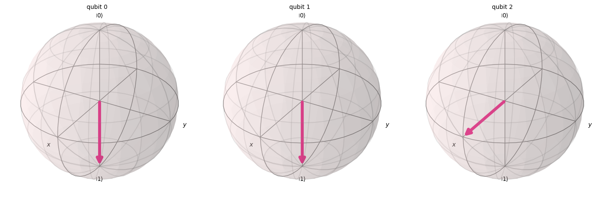

```text
Note that Alice's qubits have collapsed to |00⟩, |01⟩, |10⟩, or |11⟩, while Bob's qubit is in the original state |+⟩.
```

Seperti yang bisa kita lihat dari visualisasi, dua Qubit pertama (milik Alice) telah collapsed ke 0 atau 1. Sementara itu, Qubit ketiga (milik Bob), yang direpresentasikan di Bloch sphere ketiga, menunjuk ke arah sumbu-x, menandakan bahwa ia berada dalam keadaan $|+\rangle$, jadi kita berhasil mengimplementasikan protokol teleportasi kuantum!

### Ringkasan {#ringkasan}

Pada tahap ini ada baiknya kita membuat ringkasan singkat dari apa yang sudah kita capai:
- Alice telah mengirimkan sebuah *keadaan kuantum yang tidak diketahui* kepada Bob.
- Tidak ada partikel fisik yang dipindahkan.
- Keadaan asli pada Qubit Alice hancur, sesuai dengan teorema No-Cloning.
