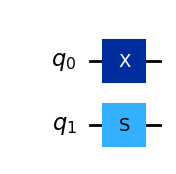
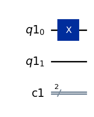
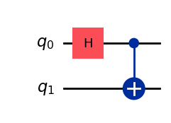
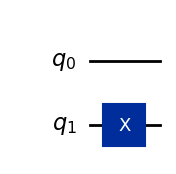
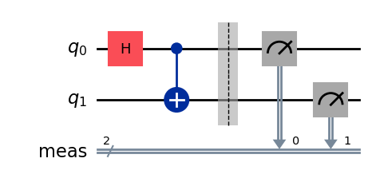
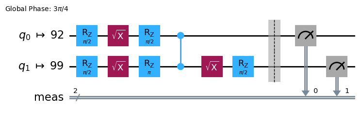
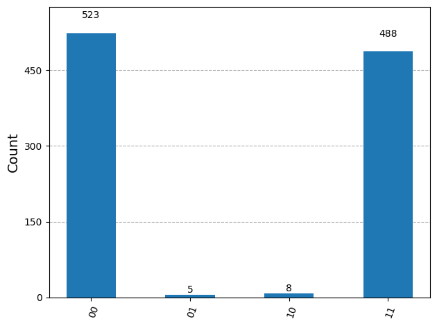
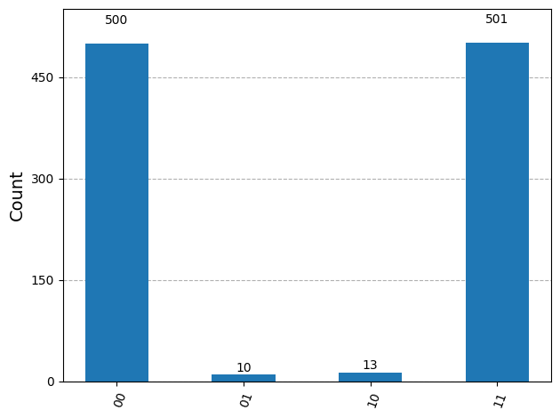
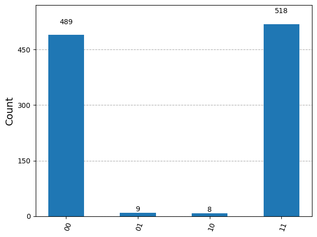

{/* doqumentation-source-hash: 5c6f4674 */}

<OpenInLabBanner notebookPath="workshop/05_Hello_World_Qiskit_Malaysia_Workshop_Nov25.ipynb" />

Di notebook ini kamu akan mempelajari alur kerja Qiskit Patterns, dan menggunakan [Sampler primitive](https://docs.quantum.ibm.com/guides/get-started-with-primitives) dari Qiskit.

Tutorial ini sebagian menggunakan konten dari [IBM Quantum Documentation: Hello World](https://docs.quantum.ibm.com/guides/hello-world).

Link berguna:
1. Silakan [buat akun IBM Cloud](https://cloud.ibm.com/registration?utm_content=quantum-trial&target=https%3A%2F%2Fquantum.cloud.ibm.com&error_uri=) untuk mengakses [IBM Quantum Platform](https://quantum.cloud.ibm.com/).
    - Buat kamu yang punya email universitas: [dapatkan feature code di sini untuk memperpanjang masa uji coba gratis](https://github.com/academic-initiative/documentation/blob/main/academic-initiative/how-to/How-to-request-and-IBM-Cloud-Feature-Code/readme.md).
    - Buat kamu yang tidak punya email universitas: [instruksi untuk mengaktifkan akun](https://cloud.ibm.com/docs/account?topic=account-upgrading-account). Aktifkan akunmu sepenuhnya dengan mendaftarkan kartu kredit. Kartu kreditmu tidak akan ditagih dalam proses ini atau secara acak setelah didaftarkan. Aktivasi ini memungkinkan kamu untuk terus mengakses sumber daya gratis di IBM Cloud dan platform IBM Quantum setelah masa uji coba berakhir (30 hari).
2. Kita akan menggunakan platform berbasis cloud untuk menyiapkan lingkungan coding. Kamu bisa menggunakan [QBraid](https://www.qbraid.com/) atau [Google Colab](https://colab.google/).
3. Setelah notebook ini, kita akan melihat [protokol Quantum Teleportation](https://quantum.cloud.ibm.com/learning/en/modules/computer-science/quantum-teleportation).

Link tambahan - komunitas Qiskit dan sumber belajar lebih lanjut:
- [Grok sphere](https://javafxpert.github.io/grok-bloch/)
- [IBM Quantum Composer](https://quantum.cloud.ibm.com/composer)
- [IBM Quantum Learning](https://quantum.cloud.ibm.com/learning/en)
- [Kuliah Qiskit Global Summer School 2025](https://www.youtube.com/watch?v=maJaB4-WfFg&list=PLOFEBzvs-VvoIfbpOb_geVnwFmbW6ij0m)
- [Sertifikasi Qiskit v2.X](https://www.ibm.com/training/certification/ibm-certified-quantum-computation-using-qiskit-v2x-developer-associate-C9008400)
- [Program Qiskit advocate](https://www.ibm.com/quantum/blog/qiskit-advocate-program)
- [Magang musim panas quantum](https://www.ibm.com/au-en/careers/search?field_keyword_18[0]=Internship&q=quantum)
- [YouTube Qiskit](https://www.youtube.com/qiskit)
## Install Qiskit {#install-qiskit}

Kamu bisa menggunakan lingkungan jupyter lab online (lihat panduan [Lingkungan lab online](quantum.cloud.ibm.com/docs/en/guides/online-lab-environments)) atau menginstal Qiskit secara lokal.

Ikuti panduan instalasi Qiskit [Install the Qiskit SDK and the Qiskit Runtime client](https://quantum.cloud.ibm.com/docs/en/guides/install-qiskit) untuk menyelesaikan langkah-langkah berikut:

	- Install Qiskit termasuk paket visualisasi tambahan: `pip install qiskit[visualization]`

	- Install qiskit-ibm-runtime: `pip install qiskit-ibm-runtime`

	- Install jupyter: `pip install jupyter`

Pastikan versi Python yang kamu gunakan di lingkunganmu adalah python>=3.10, agar kompatibel dengan versi Qiskit terbaru:

```python
# Added by doQumentation — required packages for this notebook
!pip install -q IPython
```

```python
from platform import python_version

print(python_version())
```

```text
3.13.7
```

Jika kamu perlu mengupgrade Python dan tidak tahu caranya, silakan lihat panduan ini tentang cara upgrade Python tergantung OS kamu: [How to update Python](https://4geeks.com/how-to/how-to-update-python-version)

```python
%pip install qiskit[visualization]
%pip install qiskit-ibm-runtime
%pip install
%pip install qiskit-aer
```

```text
zsh:1: no matches found: qiskit[visualization]
Note: you may need to restart the kernel to use updated packages.
Requirement already satisfied: qiskit-ibm-runtime in /Users/astricornish/miniforge3/envs/um-qiskit/lib/python3.13/site-packages (0.43.0)
Requirement already satisfied: requests>=2.19 in /Users/astricornish/miniforge3/envs/um-qiskit/lib/python3.13/site-packages (from qiskit-ibm-runtime) (2.32.5)
Requirement already satisfied: requests-ntlm>=1.1.0 in /Users/astricornish/miniforge3/envs/um-qiskit/lib/python3.13/site-packages (from qiskit-ibm-runtime) (1.3.0)
Requirement already satisfied: numpy>=1.13 in /Users/astricornish/miniforge3/envs/um-qiskit/lib/python3.13/site-packages (from qiskit-ibm-runtime) (2.3.3)
Requirement already satisfied: urllib3>=1.21.1 in /Users/astricornish/miniforge3/envs/um-qiskit/lib/python3.13/site-packages (from qiskit-ibm-runtime) (2.5.0)
Requirement already satisfied: python-dateutil>=2.8.0 in /Users/astricornish/miniforge3/envs/um-qiskit/lib/python3.13/site-packages (from qiskit-ibm-runtime) (2.9.0.post0)
Requirement already satisfied: ibm-platform-services>=0.22.6 in /Users/astricornish/miniforge3/envs/um-qiskit/lib/python3.13/site-packages (from qiskit-ibm-runtime) (0.69.0)
Requirement already satisfied: pydantic>=2.5.0 in /Users/astricornish/miniforge3/envs/um-qiskit/lib/python3.13/site-packages (from qiskit-ibm-runtime) (2.12.2)
Requirement already satisfied: qiskit>=1.4.1 in /Users/astricornish/miniforge3/envs/um-qiskit/lib/python3.13/site-packages (from qiskit-ibm-runtime) (2.2.1)
Requirement already satisfied: packaging in /Users/astricornish/miniforge3/envs/um-qiskit/lib/python3.13/site-packages (from qiskit-ibm-runtime) (25.0)
Requirement already satisfied: ibm_cloud_sdk_core<4.0.0,>=3.24.2 in /Users/astricornish/miniforge3/envs/um-qiskit/lib/python3.13/site-packages (from ibm-platform-services>=0.22.6->qiskit-ibm-runtime) (3.24.2)
Requirement already satisfied: PyJWT<3.0.0,>=2.10.1 in /Users/astricornish/miniforge3/envs/um-qiskit/lib/python3.13/site-packages (from ibm_cloud_sdk_core<4.0.0,>=3.24.2->ibm-platform-services>=0.22.6->qiskit-ibm-runtime) (2.10.1)
Requirement already satisfied: six>=1.5 in /Users/astricornish/miniforge3/envs/um-qiskit/lib/python3.13/site-packages (from python-dateutil>=2.8.0->qiskit-ibm-runtime) (1.17.0)
Requirement already satisfied: charset_normalizer<4,>=2 in /Users/astricornish/miniforge3/envs/um-qiskit/lib/python3.13/site-packages (from requests>=2.19->qiskit-ibm-runtime) (3.4.4)
Requirement already satisfied: idna<4,>=2.5 in /Users/astricornish/miniforge3/envs/um-qiskit/lib/python3.13/site-packages (from requests>=2.19->qiskit-ibm-runtime) (3.11)
Requirement already satisfied: certifi>=2017.4.17 in /Users/astricornish/miniforge3/envs/um-qiskit/lib/python3.13/site-packages (from requests>=2.19->qiskit-ibm-runtime) (2025.10.5)
Requirement already satisfied: annotated-types>=0.6.0 in /Users/astricornish/miniforge3/envs/um-qiskit/lib/python3.13/site-packages (from pydantic>=2.5.0->qiskit-ibm-runtime) (0.7.0)
Requirement already satisfied: pydantic-core==2.41.4 in /Users/astricornish/miniforge3/envs/um-qiskit/lib/python3.13/site-packages (from pydantic>=2.5.0->qiskit-ibm-runtime) (2.41.4)
Requirement already satisfied: typing-extensions>=4.14.1 in /Users/astricornish/miniforge3/envs/um-qiskit/lib/python3.13/site-packages (from pydantic>=2.5.0->qiskit-ibm-runtime) (4.15.0)
Requirement already satisfied: typing-inspection>=0.4.2 in /Users/astricornish/miniforge3/envs/um-qiskit/lib/python3.13/site-packages (from pydantic>=2.5.0->qiskit-ibm-runtime) (0.4.2)
Requirement already satisfied: rustworkx>=0.15.0 in /Users/astricornish/miniforge3/envs/um-qiskit/lib/python3.13/site-packages (from qiskit>=1.4.1->qiskit-ibm-runtime) (0.17.1)
Requirement already satisfied: scipy>=1.5 in /Users/astricornish/miniforge3/envs/um-qiskit/lib/python3.13/site-packages (from qiskit>=1.4.1->qiskit-ibm-runtime) (1.16.2)
Requirement already satisfied: dill>=0.3 in /Users/astricornish/miniforge3/envs/um-qiskit/lib/python3.13/site-packages (from qiskit>=1.4.1->qiskit-ibm-runtime) (0.4.0)
Requirement already satisfied: stevedore>=3.0.0 in /Users/astricornish/miniforge3/envs/um-qiskit/lib/python3.13/site-packages (from qiskit>=1.4.1->qiskit-ibm-runtime) (5.5.0)
Requirement already satisfied: cryptography>=1.3 in /Users/astricornish/miniforge3/envs/um-qiskit/lib/python3.13/site-packages (from requests-ntlm>=1.1.0->qiskit-ibm-runtime) (46.0.2)
Requirement already satisfied: pyspnego>=0.4.0 in /Users/astricornish/miniforge3/envs/um-qiskit/lib/python3.13/site-packages (from requests-ntlm>=1.1.0->qiskit-ibm-runtime) (0.12.0)
Requirement already satisfied: cffi>=2.0.0 in /Users/astricornish/miniforge3/envs/um-qiskit/lib/python3.13/site-packages (from cryptography>=1.3->requests-ntlm>=1.1.0->qiskit-ibm-runtime) (2.0.0)
Requirement already satisfied: pycparser in /Users/astricornish/miniforge3/envs/um-qiskit/lib/python3.13/site-packages (from cffi>=2.0.0->cryptography>=1.3->requests-ntlm>=1.1.0->qiskit-ibm-runtime) (2.23)
Note: you may need to restart the kernel to use updated packages.
ERROR: You must give at least one requirement to install (see "pip help install")
Note: you may need to restart the kernel to use updated packages.
Requirement already satisfied: qiskit-aer in /Users/astricornish/miniforge3/envs/um-qiskit/lib/python3.13/site-packages (0.17.2)
Requirement already satisfied: qiskit>=1.1.0 in /Users/astricornish/miniforge3/envs/um-qiskit/lib/python3.13/site-packages (from qiskit-aer) (2.2.1)
Requirement already satisfied: numpy>=1.16.3 in /Users/astricornish/miniforge3/envs/um-qiskit/lib/python3.13/site-packages (from qiskit-aer) (2.3.3)
Requirement already satisfied: scipy>=1.0 in /Users/astricornish/miniforge3/envs/um-qiskit/lib/python3.13/site-packages (from qiskit-aer) (1.16.2)
Requirement already satisfied: psutil>=5 in /Users/astricornish/miniforge3/envs/um-qiskit/lib/python3.13/site-packages (from qiskit-aer) (7.1.0)
Requirement already satisfied: python-dateutil>=2.8.0 in /Users/astricornish/miniforge3/envs/um-qiskit/lib/python3.13/site-packages (from qiskit-aer) (2.9.0.post0)
Requirement already satisfied: six>=1.5 in /Users/astricornish/miniforge3/envs/um-qiskit/lib/python3.13/site-packages (from python-dateutil>=2.8.0->qiskit-aer) (1.17.0)
Requirement already satisfied: rustworkx>=0.15.0 in /Users/astricornish/miniforge3/envs/um-qiskit/lib/python3.13/site-packages (from qiskit>=1.1.0->qiskit-aer) (0.17.1)
Requirement already satisfied: dill>=0.3 in /Users/astricornish/miniforge3/envs/um-qiskit/lib/python3.13/site-packages (from qiskit>=1.1.0->qiskit-aer) (0.4.0)
Requirement already satisfied: stevedore>=3.0.0 in /Users/astricornish/miniforge3/envs/um-qiskit/lib/python3.13/site-packages (from qiskit>=1.1.0->qiskit-aer) (5.5.0)
Requirement already satisfied: typing-extensions in /Users/astricornish/miniforge3/envs/um-qiskit/lib/python3.13/site-packages (from qiskit>=1.1.0->qiskit-aer) (4.15.0)
Note: you may need to restart the kernel to use updated packages.
```

### Lakukan impor yang diperlukan {#make-the-necessary-imports}

Ayo lakukan impor yang diperlukan untuk tutorial ini.

```python
from qiskit import QuantumCircuit, QuantumRegister, ClassicalRegister
import qiskit_ibm_runtime
from qiskit.transpiler.preset_passmanagers import generate_preset_pass_manager
from qiskit_ibm_runtime import SamplerV2 as Sampler
from qiskit.quantum_info import SparsePauliOp
from qiskit.quantum_info import Statevector
from qiskit.visualization import plot_bloch_multivector, plot_state_qsphere
from IPython.display import display, Latex
```

## Siapkan akun IBM Quantum Platform kamu {#setting-ibm-cloud}

Untuk menjalankan quantum Circuit di hardware nyata, kamu perlu akun IBM Cloud.

Ikuti instruksi dalam panduan ini [Siapkan akun IBM Cloud kamu](https://quantum.cloud.ibm.com/docs/en/guides/cloud-setup) untuk menyelesaikan langkah-langkah berikut:

1. Buat akun IBM Cloud jika kamu belum punya.
2. Login atau buat akun [IBM Quantum Platform](https://quantum.cloud.ibm.com/) dengan IBMid.
2. Akses dashboard IBM Quantum Platform kamu, **buat API token kamu**, dan salin ke lokasi yang aman. (Lihat gambar referensi pertama di bawah.)
3. Di sel kode setelah gambar referensi, ganti `deleteThisAndPasteYourAPIKeyHere` dengan API key kamu.
4. Pergi ke halaman Instances dari menu utama ☰ dan **buat instance kamu**. Jika kamu bukan bagian dari institusi Network, pilih open plan. (Lihat gambar referensi kedua di bawah.)
5. Setelah instance dibuat, salin kode CRN-nya. (CRN singkatan dari _Cloud Resource Names_) Kamu mungkin perlu menyegarkan halaman untuk melihat instance.
6.  Di sel kode setelah gambar referensi, ganti `deleteThisAndPasteYourCRNHere` dengan kode CRN kamu.

 **Catatan:** Perlakukan API key kamu seperti password yang aman. Lihat panduan [Siapkan akun IBM Cloud kamu](https://quantum.cloud.ibm.com/docs/guides/cloud-setup#cloud-save) untuk informasi lebih lanjut tentang menggunakan API key di lingkungan aman maupun tidak aman.

```python
#@title personals
your_api_key = "YOUR_API_KEY"
your_crn = "YOUR_CRN"
```

```python
from qiskit_ibm_runtime import QiskitRuntimeService
# Save your API key to access real devices

your_api_key = your_api_key
your_crn = your_crn

QiskitRuntimeService.save_account(
    channel="ibm_cloud",
    token=your_api_key,
    instance=your_crn,
    set_as_default=True,
    overwrite=True,
)
```

## Buat dan jalankan algoritma quantum sederhana menggunakan kerangka kerja Qiskit pattern {#qiskit-pattern}

Kerangka konseptual Qiskit pattern bisa dianggap sebagai anatomi dari sebuah algoritma quantum.

Empat langkah untuk menulis program quantum menggunakan Qiskit patterns adalah:

1.  Petakan masalah ke format native quantum.

2.  Optimalkan Circuit dan operator.

3.  Jalankan menggunakan fungsi primitive Qiskit.

4.  Analisis hasilnya.

### Langkah 1. Petakan masalah ke format native quantum {#step-1-map-the-problem-to-a-quantum-native-format}

Dalam program quantum, *quantum Circuit* adalah format native untuk merepresentasikan instruksi quantum, dan *operator* merepresentasikan observable yang akan diukur. Saat membuat Circuit, biasanya kamu membuat objek [`QuantumCircuit`](https://docs.quantum.ibm.com/api/qiskit/qiskit.circuit.QuantumCircuit#quantumcircuit-class) baru, lalu menambahkan instruksi ke dalamnya secara berurutan.

### Demonstrasi: Membangun quantum Circuit dasar di Qiskit {#build-circuits}

Ayo coba membangun beberapa Circuit sederhana dengan Qiskit.

```python
# Simple quantum circuit with two qubits and two classical bits

# Create quantum circuit with 2 qubits and 2 classical bits
qc = QuantumCircuit(2)

# Add gates to your circuit
qc.x(0)
qc.s(1)

# Draw the output using MatPlotLib
qc.draw(output='mpl')
```



```python
# Quantum circuit with a Quantum Register named 'qr' that has two qubits, and a Classical Register named 'cr' with two classical bits

# Create a quantum register with 2 qubits, register label is 'qr'
qreg = QuantumRegister(2)

# Create a classical register with 2 qubits, register label is 'cr'
creg = ClassicalRegister(2)

# Create a quantum circuit with registers qreg and creg
qc = QuantumCircuit(qreg, creg)

# Add gates to your registers
qc.x(qreg[0])

# Draw the quantum circuit
qc.draw(output='mpl')
```



### Latihan: Membangun quantum Circuit dasar di Qiskit {#build-circuits}

<div class="alert alert-success">

Buat Circuit untuk Bell state $\frac{|00\rangle + |11\rangle}{\sqrt{2}}$

</div>

```python
# Create a new circuit with two qubits
qc = QuantumCircuit(2)

# Add a Hadamard gate to qubit 0
qc.h(0)

# Perform a controlled-X gate on qubit 1, controlled by qubit 0
qc.cx(0,1)

# Return a drawing of the circuit using MatPlotLib ("mpl").
qc.draw('mpl')
```



State awal dari quantum Circuit adalah state $\ket{00}$.

State akhirnya adalah:

```python
# Use Statevector to fetch the statevector of the circuit
sv = Statevector(qc)
sv.draw(output='latex')
```

$$\frac{\sqrt{2}}{2} |00\rangle+\frac{\sqrt{2}}{2} |11\rangle$$

**Catatan tentang penomoran bit di Qiskit**

Qiskit menomori bit dalam sebuah string dari kanan ke kiri. Qiskit SDK menggunakan penomoran bit LSb 0. Saat menampilkan atau menginterpretasikan daftar $n$ bit (atau Qubit) sebagai string, bit $n−1$ adalah bit paling kiri, dan bit $0$ adalah bit paling kanan. Ini karena kita biasanya menulis angka dengan digit paling signifikan di sebelah kiri, dan di Qiskit, bit $n−1$ diinterpretasikan sebagai bit paling signifikan. Untuk detail lebih lanjut, lihat topik [Bit-ordering in the Qiskit SDK](https://docs.quantum.ibm.com/guides/bit-ordering).

```python
#LSB ordering example
qc2 = QuantumCircuit(2)
qc2.x(1)

qc2.draw("mpl")
```



```python
sv2 = Statevector(qc2)
sv2.draw(output='latex')
```

$$ |10\rangle$$

**Apakah kita perlu Gate pengukuran?**

Saat membuat quantum Circuit, kamu juga harus mempertimbangkan jenis data apa yang ingin dikembalikan setelah eksekusi. Qiskit menyediakan dua cara untuk mengembalikan data: kamu bisa mendapatkan nilai ekspektasi dari sebuah observable, atau kamu bisa mendapatkan distribusi probabilitas untuk sekumpulan Qubit yang kamu pilih untuk diukur. Persiapkan beban kerja kamu untuk mengukur Circuit dengan salah satu dari dua cara ini menggunakan [Qiskit primitives](https://docs.quantum.ibm.com/guides/get-started-with-primitives).

- `Sampler` primitive - mengembalikan distribusi probabilitas untuk sekumpulan Qubit yang kamu pilih untuk diukur. Contoh:


- `Estimator` primitive - mengembalikan nilai ekspektasi dari sebuah observable. Contoh:


Kita akan menggunakan Sampler hari ini, jadi kita perlu menambahkan Gate pengukuran ke Circuit kita.

```python
# Use measure_all, which adds a barrier, applies measurement gates on all qubits, creates a classical register called `meas`
qc.measure_all()
qc.draw('mpl')
```


### Step 2. Optimalkan Circuit untuk Hardware Target {#step-2-optimize-the-circuits-for-the-target-hardware}

Saat menjalankan circuit di perangkat, penting untuk mengoptimalkan sekumpulan instruksi yang ada di dalam circuit dan meminimalkan kedalaman keseluruhan (secara kasar, jumlah instruksi) dari circuit tersebut. Ini memastikan kamu mendapatkan hasil terbaik dengan mengurangi efek kesalahan dan noise. Selain itu, instruksi dalam circuit harus sesuai dengan [Instruction Set Architecture (ISA)](https://docs.quantum.ibm.com/guides/transpile#instruction-set-architecture) perangkat Backend dan harus mempertimbangkan gate basis serta konektivitas Qubit perangkat tersebut.

Kode berikut membuat instance simulator untuk mengirimkan job, dan mengubah Circuit serta observable agar sesuai dengan ISA Backend tersebut. Perlu diketahui bahwa kita akan menggunakan perangkat nyata nanti.

```python
# option:
from qiskit_ibm_runtime.fake_provider import FakeTorino
backend = FakeTorino()
```

```python
print(
    f"Name: {backend.name}\n"
    f"Version: {backend.version}\n"
    f"Native gate set: {backend.operation_names}\n"
)

#to view other properties you can use properties()
# refer to https://docs.quantum.ibm.com/guides/get-qpu-information
```

```text
Name: fake_torino
Version: 2
Native gate set: ['for_loop', 'delay', 'cz', 'id', 'sx', 'measure', 'reset', 'switch_case', 'if_else', 'rz', 'x']
```

```python
# Convert to an ISA circuit
pm = generate_preset_pass_manager(backend=backend, optimization_level=3)

isa_circuit_sampler = pm.run(qc)

isa_circuit_sampler.draw("mpl", idle_wires=False)
```



### Step 3. Eksekusi Menggunakan Qiskit Primitives {#step-3-execute-using-the-qiskit-primitives}

Komputer quantum bisa menghasilkan hasil yang acak, jadi biasanya kamu mengumpulkan sampel dari output dengan menjalankan circuit berkali-kali. Kamu bisa memperkirakan nilai observable menggunakan class `Estimator`. `Sampler` bisa dipakai untuk mendapatkan data dari komputer quantum. Objek-objek ini memiliki metode `run()` yang menjalankan pilihan Circuit, observable, dan parameter (jika ada), menggunakan [primitive unified bloc (PUB).](https://docs.quantum.ibm.com/guides/primitive-input-output#pubs)

```python
# Create a sampler instance using the selected backend
sampler = Sampler(backend)

# Run the sampler primitive on ISA circuit for specified number of shots (1024)

job_sampler = sampler.run([isa_circuit_sampler], shots=1024)

# Save the result of the job

result_sampler = job_sampler.result()
```

### Step 4. Proses Hasil (Post-process) {#step-4-post-process-the-results}

Langkah ini melibatkan pemrosesan hasil yang kamu dapatkan. Kamu bisa memasukkan hasil ini ke dalam alur kerja lain untuk analisis lebih lanjut, atau menyiapkan plot dari nilai dan data utama. Secara umum, langkah ini spesifik untuk masalahmu.

- Untuk `Sampler`, kita membuat plot distribusi probabilitas yang diperoleh dengan mengambil sampel dari circuit quantum sebanyak shots yang kamu tentukan menggunakan `plot_histogram`.

```python
from qiskit.visualization import plot_histogram

counts = result_sampler[0].data.meas.get_counts()
# Note: meas is the default name of the classical register when using measure_all().
# If you specify a classical register, then use the name you assign

# Plot the result
plot_histogram(counts)
```



# Menjalankan Program di Perangkat Nyata {#real-device}

Kalau kamu ingin menjalankan kode ini di perangkat nyata, kamu bisa menggunakan kode berikut.

```python
from qiskit_ibm_runtime import QiskitRuntimeService

# View the list of backends you have access to

service = QiskitRuntimeService()

service.backends()
```

```text
management.get:WARNING:2025-11-03 14:24:36,838: Loading default saved account
```

```text
[<IBMBackend('ibm_fez')>,
 <IBMBackend('ibm_brisbane')>,
 <IBMBackend('ibm_torino')>,
 <IBMBackend('ibm_marrakesh')>]
```

```python
# Get backend
backend_real = service.least_busy(simulator=False, operational=True)

#backend_real = service.backend(name="insert_backend_name") # use this if you want to choose a specific backend

sampler = Sampler(backend_real)

pm = generate_preset_pass_manager(backend=backend_real, optimization_level=3)
isa_circuit = pm.run(qc)

job = sampler.run([isa_circuit], shots=1024)
```

```python
print(job.job_id)
```

```text
<bound method BasePrimitiveJob.job_id of <RuntimeJobV2('d444lcg7i53s73e4n6tg', 'sampler')>>
```

```python
result = job.result()
```

```python
print(
    f"Name: {backend_real.name}\n"
    f"Version: {backend_real.version}\n"
    f"Native gate set: {backend_real.operation_names}\n"
)
```

```text
Name: ibm_fez
Version: 2
Native gate set: ['delay', 'cz', 'id', 'sx', 'measure', 'reset', 'if_else', 'rz', 'x']
```

```python
counts = result[0].data.meas.get_counts()

plot_histogram(counts)
```



### Mengambil Hasil dari Job yang Sudah Selesai {#fetching-results-from-a-completed-job}

Cell di bawah ini menunjukkan cara mengambil hasil dari job yang sudah selesai.

```python
service = QiskitRuntimeService()
retrieved_job = service.job('d40mquhsg33c73dhhs00')
result = retrieved_job.result()
counts = result[0].data.meas.get_counts()
plot_histogram(counts)
```

```text
management.get:WARNING:2025-11-03 14:24:55,135: Loading default saved account
```


