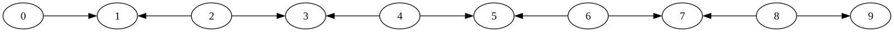
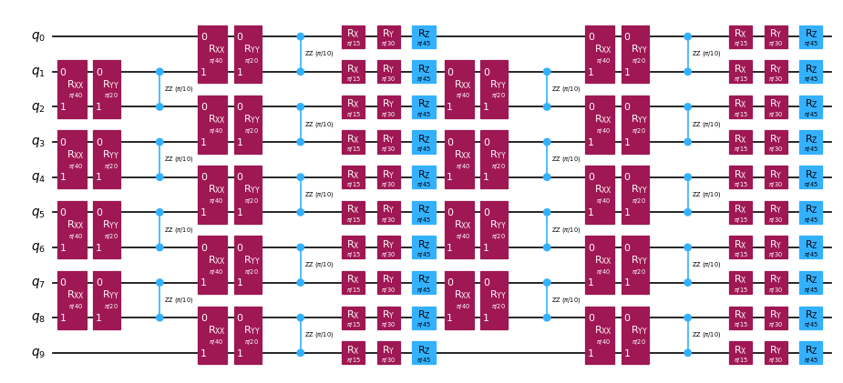

{/* doqumentation-source-hash: 43a12650 */}

import TutorialFeedback from '@site/src/components/TutorialFeedback';

<OpenInLabBanner notebookPath="qiskit-addons/obp/01_getting_started.ipynb" />


La backpropagation degli operatori è una tecnica che consiste nell'assorbire le operazioni dalla fine di un circuito quantistico in un operatore di Pauli, riducendo generalmente la profondità del circuito al costo di termini aggiuntivi nell'operatore. L'obiettivo è retropropagare quanto più possibile del circuito senza lasciare che l'operatore cresca troppo.

Un modo per consentire una backpropagation più profonda nel circuito, evitando al contempo che l'operatore cresca eccessivamente, è troncare i termini con coefficienti piccoli, anziché aggiungerli all'operatore. Il troncamento dei termini può produrre un minor numero di circuiti quantistici da eseguire, ma introduce un certo errore nel calcolo finale del valore di aspettazione proporzionale alla grandezza dei coefficienti dei termini troncati.
In questo tutorial implementeremo un [Qiskit pattern](https://quantum.cloud.ibm.com/docs/guides/serverless#qiskit-patterns-with-quantum-serverless) per simulare la dinamica quantistica di una catena di spin di Heisenberg usando la backpropagation degli operatori:

- **Step 1: Mappa al problema quantistico**
    - Mappa l'Hamiltoniano tempo-evoluto su un circuito quantistico
- **Step 2: Ottimizza il problema**
    - Suddividi il circuito in slice
    - <font color="#0F62FE">Retropropaga le slice dal circuito su un'osservabile di Pauli</font>
    - Combina le slice rimanenti in un unico circuito
    - Transpila il circuito per il Backend
- **Step 3: Esegui gli esperimenti**
    - Calcola il valore di aspettazione usando il circuito ridotto e l'osservabile espansa con un [StatevectorEstimator](https://quantum.cloud.ibm.com/docs/api/qiskit/qiskit.primitives.StatevectorEstimator) per semplicità in questo notebook
- **Step 4: Ricostruisci i risultati**
    - N.A.

**Nota:** Qiskit descrive approssimativamente i [layer](https://quantum.cloud.ibm.com/docs/api/qiskit/qiskit.dagcircuit.DAGCircuit) come partizioni di profondità 1 del circuito su tutti i Qubit. Questo pacchetto utilizza il termine **slice** per descrivere layer di profondità arbitraria. La funzione [qiskit_addon_obp.backpropagate](https://qiskit.github.io/qiskit-addon-obp/stubs/qiskit_addon_obp.backpropagate.html) è progettata per retropropagare intere slice alla volta, quindi la scelta di come suddividere il circuito quantistico può avere un impatto significativo sulle prestazioni della backpropagation per un dato problema. Troverai ulteriori informazioni sulle **slice** di seguito.
## Step 1: Mappa al problema quantistico {#step-1-map-to-quantum-problem}
### Mappa l'evoluzione temporale di un modello di Heisenberg quantistico su un esperimento quantistico. {#map-the-time-evolution-of-a-quantum-heisenberg-model-to-a-quantum-experiment}

Il pacchetto [qiskit_addon_utils](https://qiskit.github.io/qiskit-addon-utils/) fornisce alcune funzionalità riutilizzabili per vari scopi.

Il suo modulo [qiskit_addon_utils.problem_generators](https://qiskit.github.io/qiskit-addon-utils/stubs/qiskit_addon_utils.problem_generators.html) fornisce funzioni per generare Hamiltoniani di tipo Heisenberg su un grafo di connettività dato.
Questo grafo può essere un [rustworkx.PyGraph](https://www.rustworkx.org/apiref/rustworkx.PyGraph.html) o una [CouplingMap](https://quantum.cloud.ibm.com/docs/api/qiskit/qiskit.transpiler.CouplingMap), il che lo rende facile da usare nei workflow centrati su Qiskit.

Di seguito, generiamo prima una `CouplingMap` heavy-hex da cui ricaviamo una catena lineare di 10 Qubit. Nota che gli indici di questa nuova `reduced_coupling_map` sono di nuovo a base zero.

```python
# Added by doQumentation — required packages for this notebook
!pip install -q numpy qiskit qiskit-addon-obp qiskit-addon-utils qiskit-ibm-runtime rustworkx
```

```python
from qiskit.transpiler import CouplingMap

coupling_map = CouplingMap.from_heavy_hex(3, bidirectional=False)

# Choose a 10-qubit linear chain on this coupling map
reduced_coupling_map = coupling_map.reduce([0, 13, 1, 14, 10, 16, 5, 12, 8, 18])
```

```python
from rustworkx.visualization import graphviz_draw

graphviz_draw(reduced_coupling_map.graph, method="circo")
```



Successivamente, generiamo un operatore di Pauli che modella un Hamiltoniano di Heisenberg XYZ.

$$\hat{H} = \sum_{(j,k)\in E} (J_{x} \sigma_j^{x} \sigma_{k}^{x} +
    J_{y} \sigma_j^{y} \sigma_{k}^{y} + J_{z} \sigma_j^{z} \sigma_{k}^{z}) +
    \sum_{j\in V} (h_{x} \sigma_j^{x} + h_{y} \sigma_j^{y} + h_{z} \sigma_j^{z})$$

Dove $G(V,E)$ è il grafo della coupling map fornita.

```python
import numpy as np
from qiskit_addon_utils.problem_generators import generate_xyz_hamiltonian

# Get a qubit operator describing the Heisenberg XYZ model
hamiltonian = generate_xyz_hamiltonian(
    reduced_coupling_map,
    coupling_constants=(np.pi / 8, np.pi / 4, np.pi / 2),
    ext_magnetic_field=(np.pi / 3, np.pi / 6, np.pi / 9),
)
print(hamiltonian)
```

```text
SparsePauliOp(['IIIIIIIXXI', 'IIIIIIIYYI', 'IIIIIIIZZI', 'IIIIIXXIII', 'IIIIIYYIII', 'IIIIIZZIII', 'IIIXXIIIII', 'IIIYYIIIII', 'IIIZZIIIII', 'IXXIIIIIII', 'IYYIIIIIII', 'IZZIIIIIII', 'IIIIIIIIXX', 'IIIIIIIIYY', 'IIIIIIIIZZ', 'IIIIIIXXII', 'IIIIIIYYII', 'IIIIIIZZII', 'IIIIXXIIII', 'IIIIYYIIII', 'IIIIZZIIII', 'IIXXIIIIII', 'IIYYIIIIII', 'IIZZIIIIII', 'XXIIIIIIII', 'YYIIIIIIII', 'ZZIIIIIIII', 'IIIIIIIIIX', 'IIIIIIIIIY', 'IIIIIIIIIZ', 'IIIIIIIIXI', 'IIIIIIIIYI', 'IIIIIIIIZI', 'IIIIIIIXII', 'IIIIIIIYII', 'IIIIIIIZII', 'IIIIIIXIII', 'IIIIIIYIII', 'IIIIIIZIII', 'IIIIIXIIII', 'IIIIIYIIII', 'IIIIIZIIII', 'IIIIXIIIII', 'IIIIYIIIII', 'IIIIZIIIII', 'IIIXIIIIII', 'IIIYIIIIII', 'IIIZIIIIII', 'IIXIIIIIII', 'IIYIIIIIII', 'IIZIIIIIII', 'IXIIIIIIII', 'IYIIIIIIII', 'IZIIIIIIII', 'XIIIIIIIII', 'YIIIIIIIII', 'ZIIIIIIIII'],
              coeffs=[0.39269908+0.j, 0.78539816+0.j, 1.57079633+0.j, 0.39269908+0.j,
 0.78539816+0.j, 1.57079633+0.j, 0.39269908+0.j, 0.78539816+0.j,
 1.57079633+0.j, 0.39269908+0.j, 0.78539816+0.j, 1.57079633+0.j,
 0.39269908+0.j, 0.78539816+0.j, 1.57079633+0.j, 0.39269908+0.j,
 0.78539816+0.j, 1.57079633+0.j, 0.39269908+0.j, 0.78539816+0.j,
 1.57079633+0.j, 0.39269908+0.j, 0.78539816+0.j, 1.57079633+0.j,
 0.39269908+0.j, 0.78539816+0.j, 1.57079633+0.j, 1.04719755+0.j,
 0.52359878+0.j, 0.34906585+0.j, 1.04719755+0.j, 0.52359878+0.j,
 0.34906585+0.j, 1.04719755+0.j, 0.52359878+0.j, 0.34906585+0.j,
 1.04719755+0.j, 0.52359878+0.j, 0.34906585+0.j, 1.04719755+0.j,
 0.52359878+0.j, 0.34906585+0.j, 1.04719755+0.j, 0.52359878+0.j,
 0.34906585+0.j, 1.04719755+0.j, 0.52359878+0.j, 0.34906585+0.j,
 1.04719755+0.j, 0.52359878+0.j, 0.34906585+0.j, 1.04719755+0.j,
 0.52359878+0.j, 0.34906585+0.j, 1.04719755+0.j, 0.52359878+0.j,
 0.34906585+0.j])
```

Dall'operatore sui Qubit, possiamo generare un circuito quantistico che modella la sua evoluzione temporale.
Ancora una volta, il modulo [qiskit_addon_utils.problem_generators](https://qiskit.github.io/qiskit-addon-utils/stubs/qiskit_addon_utils.problem_generators.html) ci viene in soccorso con una comoda funzione per fare proprio questo:

```python
from qiskit.synthesis import LieTrotter
from qiskit_addon_utils.problem_generators import generate_time_evolution_circuit

circuit = generate_time_evolution_circuit(
    hamiltonian,
    time=0.2,
    synthesis=LieTrotter(reps=2),
)
circuit.draw("mpl", style="iqp", scale=0.6)
```



## Step 2: Ottimizza il problema {#step-2-optimize-the-problem}
### Crea le slice del circuito da retropropagare {#create-circuit-slices-to-backpropagate}

Ricorda che la funzione ``backpropagate`` retropropagherà intere slice del circuito alla volta, quindi la scelta di come suddividere può influire sulle prestazioni della backpropagation per un dato problema. Qui raggrupperemo i Gate dello stesso tipo in slice usando la funzione [slice_by_gate_types](https://qiskit.github.io/qiskit-addon-utils/stubs/qiskit_addon_utils.slicing.slice_by_gate_types.html).

Per una discussione più dettagliata sul suddividere i Circuit in slice, consulta questa [guida how-to](https://qiskit.github.io/qiskit-addon-utils/how_tos/create_circuit_slices.html) del pacchetto [qiskit-addon-utils](https://qiskit.github.io/qiskit-addon-utils/index.html).

```python
from qiskit_addon_utils.slicing import slice_by_gate_types

slices = slice_by_gate_types(circuit)
print(f"Separated the circuit into {len(slices)} slices.")
```

```text
Separated the circuit into 18 slices.
```

### Limita quanto può crescere l'operatore durante la backpropagation {#constrain-how-large-the-operator-may-grow-during-backpropagation}

Durante la backpropagation, il numero di termini nell'operatore si avvicinerà generalmente a $4^N$ rapidamente, dove $N$ è il numero di Qubit. La dimensione dell'operatore può essere limitata specificando il kwarg ``operator_budget`` della funzione ``backpropagate``, che accetta un'istanza di [OperatorBudget](https://qiskit.github.io/qiskit-addon-obp/stubs/qiskit_addon_obp.utils.simplify.OperatorBudget.html).

Qui specifichiamo che la backpropagation deve fermarsi quando il numero di gruppi di Pauli che commutano qubit per qubit nell'operatore supera 8.

```python
from qiskit_addon_obp.utils.simplify import OperatorBudget

op_budget = OperatorBudget(max_qwc_groups=8)
```

### Retropropaga le slice dal circuito {#backpropagate-slices-from-the-circuit}

Per prima cosa, specifichiamo l'osservabile Pauli-Z sul Qubit 0 e retropropagheremo le slice dal circuito di evoluzione temporale finché i termini nell'osservabile non possono più essere combinati in 8 o meno gruppi di Pauli che commutano qubit per qubit.

Di seguito vedrai che abbiamo retropropagato 7 slice ma abbiamo usato solo 6 degli 8 gruppi di Pauli assegnati. Ciò implica che retropropagare un'altra slice causerebbe il superamento di 8 gruppi di Pauli. Possiamo verificare che sia questo il caso ispezionando i metadati restituiti.

```python
from qiskit.quantum_info import SparsePauliOp
from qiskit_addon_obp import backpropagate
from qiskit_addon_utils.slicing import combine_slices

# Specify a single-qubit observable
observable = SparsePauliOp("IIIIIIIIIZ")

# Backpropagate slices onto the observable
bp_obs, remaining_slices, metadata = backpropagate(observable, slices, operator_budget=op_budget)
# Recombine the slices remaining after backpropagation
bp_circuit = combine_slices(remaining_slices, include_barriers=True)

print(f"Backpropagated {metadata.num_backpropagated_slices} slices.")
print(
    f"New observable has {len(bp_obs.paulis)} terms, which can be combined into {len(bp_obs.group_commuting(qubit_wise=True))} groups."
)
print(
    f"Note that backpropagating one more slice would result in {metadata.backpropagation_history[-1].num_paulis[0]} terms "
    f"across {metadata.backpropagation_history[-1].num_qwc_groups} groups."
)
print("The remaining circuit after backpropagation looks as follows:")
bp_circuit.draw("mpl", scale=0.6)
```

```text
Backpropagated 7 slices.
New observable has 18 terms, which can be combined into 8 groups.
Note that backpropagating one more slice would result in 27 terms across 12 groups.
The remaining circuit after backpropagation looks as follows:
```


Successivamente, specificheremo lo stesso problema con gli stessi vincoli sulla dimensione dell'osservabile di output. Tuttavia, questa volta assegneremo un budget di errore a ciascuna slice usando la funzione [setup_budet](https://qiskit.github.io/qiskit-addon-obp/stubs/qiskit_addon_obp.utils.truncating.setup_budget.html). I termini di Pauli con coefficienti piccoli verranno troncati da ciascuna slice finché il budget di errore non è esaurito, e il budget residuo verrà aggiunto al budget della slice successiva.

Per abilitare questo troncamento, dobbiamo configurare il nostro budget di errore come segue:

```python
from qiskit_addon_obp.utils.truncating import setup_budget

truncation_error_budget = setup_budget(max_error_per_slice=0.005)
```

Nota che allocando un errore di `5e-3` per slice per il troncamento, siamo in grado di rimuovere 3 slice in più dal circuito, rimanendo entro il budget originale di 8 gruppi di Pauli che commutano nell'osservabile. Per impostazione predefinita, `backpropagate` utilizza la norma L1 dei coefficienti troncati per limitare l'errore totale dovuto al troncamento. Per altre opzioni consulta la [guida how-to sulla specifica della p_norm](https://qiskit.github.io/qiskit-addon-obp/how_tos/bound_error_using_p_norm.html).

In questo particolare esempio in cui abbiamo retropropagato 10 slice, l'errore totale di troncamento non dovrebbe superare ``(5e-3 error/slice) * (10 slices) = 5e-2``.
Per ulteriori discussioni sulla distribuzione di un budget di errore tra le tue slice, consulta [questa guida how-to](https://qiskit.github.io/qiskit-addon-obp/how_tos/truncate_operator_terms.html).

```python
# Run the same experiment but truncate observable terms with small coefficients
bp_obs_trunc, remaining_slices_trunc, metadata = backpropagate(
    observable, slices, operator_budget=op_budget, truncation_error_budget=truncation_error_budget
)

# Recombine the slices remaining after backpropagation
bp_circuit_trunc = combine_slices(remaining_slices_trunc, include_barriers=True)

print(f"Backpropagated {metadata.num_backpropagated_slices} slices.")
print(
    f"New observable has {len(bp_obs_trunc.paulis)} terms, which can be combined into {len(bp_obs_trunc.group_commuting(qubit_wise=True))} groups.\n"
    f"After truncation, the error in our observable is bounded by {metadata.accumulated_error(0):.3e}"
)
print(
    f"Note that backpropagating one more slice would result in {metadata.backpropagation_history[-1].num_paulis[0]} terms "
    f"across {metadata.backpropagation_history[-1].num_qwc_groups} groups."
)
print("The remaining circuit after backpropagation looks as follows:")
bp_circuit_trunc.draw("mpl", scale=0.6)
```

```text
Backpropagated 10 slices.
New observable has 19 terms, which can be combined into 8 groups.
After truncation, the error in our observable is bounded by 4.933e-02
Note that backpropagating one more slice would result in 27 terms across 13 groups.
The remaining circuit after backpropagation looks as follows:
```


### Ora che abbiamo i nostri ansatz ridotti e le osservabili espanse, possiamo transpilare i nostri esperimenti per il Backend. {#now-that-we-have-our-reduced-ansatze-and-expanded-observables-we-can-transpile-our-experiments-to-the-backend}

Qui utilizzeremo il [FakeMelbourneV2](https://quantum.cloud.ibm.com/docs/api/qiskit-ibm-runtime/fake-provider-fake-melbourne-v2) a 14 Qubit di [qiskit-ibm-runtime](https://quantum.cloud.ibm.com/docs/api/qiskit-ibm-runtime) per dimostrare come effettuare la transpilazione verso un Backend QPU.

```python
from qiskit.transpiler.preset_passmanagers import generate_preset_pass_manager
from qiskit_ibm_runtime.fake_provider import FakeMelbourneV2

# Specify a backend and a pass manager for transpilation
backend = FakeMelbourneV2()
pm = generate_preset_pass_manager(backend=backend, optimization_level=1)

# Transpile original experiment
circuit_isa = pm.run(circuit)
observable_isa = observable.apply_layout(circuit_isa.layout)

# Transpile backpropagated experiment
bp_circuit_isa = pm.run(bp_circuit)
bp_obs_isa = bp_obs.apply_layout(bp_circuit_isa.layout)

# Transpile the backpropagated experiment with truncated observable terms
bp_circuit_trunc_isa = pm.run(bp_circuit_trunc)
bp_obs_trunc_isa = bp_obs_trunc.apply_layout(bp_circuit_trunc_isa.layout)
```

## Step 3: Esegui gli esperimenti quantistici {#step-3-execute-quantum-experiments}
### Calcola il valore di aspettazione {#calculate-expectation-value}

Infine, possiamo eseguire gli esperimenti con backpropagation e confrontarli con l'esperimento completo usando il [StatevectorEstimator](https://quantum.cloud.ibm.com/docs/api/qiskit/qiskit.primitives.StatevectorEstimator) senza rumore. Possiamo vedere che il valore di aspettazione con backpropagation senza troncamento è equivalente al valore esatto entro i limiti della precisione numerica.

Il valore di aspettazione sull'operatore con termini troncati presenta un errore dell'ordine di ``1e-4``, che rientra nella tolleranza prevista.

**Nota:** Utilizziamo un primitivo ``Estimator`` basato su statevector per illustrare l'effetto del troncamento sull'output. Per eseguire sul Backend su cui gli esperimenti sono stati transpilati nel Step 2, occorrerebbe importare [EstimatorV2](https://quantum.cloud.ibm.com/docs/api/qiskit-ibm-runtime/estimator-v2) da ``qiskit-ibm-runtime`` e passare l'istanza del Backend al costruttore.

```python
from qiskit.primitives import StatevectorEstimator as Estimator

estimator = Estimator()

# Run the experiments using Estimator primitive
result_exact = estimator.run([(circuit_isa, observable_isa)]).result()[0].data.evs.item()
result_bp = estimator.run([(bp_circuit_isa, bp_obs_isa)]).result()[0].data.evs.item()
result_bp_trunc = (
    estimator.run([(bp_circuit_trunc_isa, bp_obs_trunc_isa)]).result()[0].data.evs.item()
)

print(f"Exact expectation value: {result_exact}")
print(f"Backpropagated expectation value: {result_bp}")
print(f"Backpropagated expectation value with truncation: {result_bp_trunc}")
print(f"    - Expected Error for truncated observable: {metadata.accumulated_error(0):.3e}")
print(f"    - Observed Error for truncated observable: {abs(result_exact - result_bp_trunc):.3e}")
```

```text
Exact expectation value: 0.8854160687717507
Backpropagated expectation value: 0.8854160687717532
Backpropagated expectation value with truncation: 0.8850236647156059
    - Expected Error for truncated observable: 4.933e-02
    - Observed Error for truncated observable: 3.924e-04
```

<TutorialFeedback />
