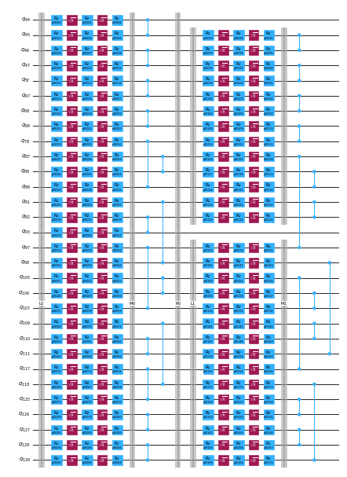

{/* doqumentation-source-hash: 3f45752c */}

import TutorialFeedback from '@site/src/components/TutorialFeedback';

<OpenInLabBanner notebookPath="qiskit-addons/pna/01_generate_noise_mitigating_observable.ipynb" />


In questo tutorial impareremo come sfruttare gli strumenti più recenti dell'ecosistema Qiskit per implementare un flusso di lavoro completamente personalizzabile con mitigazione degli errori. Introdurremo la tecnica PNA e la useremo per mitigare gli errori dei Gate. Utilizzeremo anche TREX per mitigare gli errori di lettura e la post-selezione per mitigare gli errori non catturati nel modello di rumore appreso.

**Schema**
- Panoramica sintetica di ``PNA``
- Creare un Circuit quantistico trotterizzato e un osservabile. Transpilarlo sul Backend e includere le misurazioni di post-selezione.
- Usare ``samplomatic`` per twirl dei layer di Gate a 2Q e delle misurazioni. Trovare i layer a 2Q unici per ridurre il costo dell'apprendimento del rumore.
- Usare ``NoiseLearnerV3`` per apprendere il modello di errore che influisce sui Gate a 2Q e sulle misurazioni.
- Usare ``qiskit-addon-pna`` per generare un osservabile che mitiga il rumore
- Usare la primitiva ``qiskit-ibm-runtime.Executor`` per generare i campioni grezzi della QPU che rispecchiano ogni shot per ogni randomizzazione di twirling e base misurata
- Usare ``qiskit-addon-utils`` per post-elaborare i dati in un valore atteso mitigato.
### Che cos'è l'assorbimento del rumore propagato (PNA)? {#what-is-propagated-noise-absorption-pna}

***Una tecnica per mitigare gli errori dei Gate propagando l'osservabile attraverso il canale di rumore inverso che influisce sui Gate a 2 qubit, dando luogo a un osservabile che mitiga il rumore.***
I Gate a 2Q nell'esperimento che vogliamo eseguire saranno influenzati da un rumore sostanziale.

Se apprendiamo il modello di rumore, possiamo applicarne l'inverso e cancellare il rumore.

Invece di implementare il canale di rumore inverso campionandolo sulla QPU come in PEC, possiamo implementarlo classicamente nell'osservabile misurato usando la propagazione di Pauli. Questo produce un osservabile più complesso che, quando misurato, ha l'effetto di mitigare il rumore dei Gate appreso.

### Generare il Circuit di Trotter speculare e l'osservabile {#generate-the-mirrored-trotter-circuit-and-observable}

Per questo esperimento, studieremo la dinamica temporale di un modello di Ising kicked a 30 siti su una catena di spin 1D. L'Hamiltoniano considerato è:

$H = -J\sum\limits_{\langle i,j \rangle} Z_iZ_j + h\sum\limits_iX_i$,

dove $J>0$ descrive il coupling degli spin primi vicini, $i<j$, e il campo trasverso globale, $h$, è impostato a $\frac{\pi}{8}$. Più $h$ si allontana da un angolo di Clifford (cioè $\theta=n\frac{\pi}{2}, n \in \mathbb{Z}$), più diventa difficile propagare i generatori anti-rumore attraverso il Circuit.

Per la scelta dell'osservabile, considereremo la magnetizzazione media per sito, $\frac{1}{N} \sum_{i=1}^{N} \langle z_i \rangle$, dove $N$ è il numero di siti.

```python
# Added by doQumentation — required packages for this notebook
!pip install -q matplotlib numpy qiskit qiskit-addon-pna qiskit-addon-utils qiskit-ibm-runtime samplomatic
```

```python
import numpy as np
from qiskit import QuantumCircuit
from qiskit.quantum_info import Pauli, SparsePauliOp

num_qubits = 30
num_trotter_steps = 10
rx_angle = np.pi / 8

# Avg single-site magnetization
id_pauli = Pauli("I" * num_qubits)
observable = SparsePauliOp([id_pauli.dot(Pauli("Z"), [i]) for i in range(num_qubits)]) / num_qubits

# Implement Trotterized kicked-Ising model
circuit = QuantumCircuit(num_qubits)
for _step in range(num_trotter_steps):
    circuit.rx(rx_angle, range(num_qubits))
    for first_qubit in (1, 2):
        for idx in range(first_qubit, num_qubits, 2):
            # equivalent to Rzz(-pi/2):
            circuit.sdg([idx - 1, idx])
            circuit.cz(idx - 1, idx)
circuit.compose(circuit.inverse(), inplace=True)
circuit.measure_active()
circuit.draw("mpl", fold=-1)
```


Successivamente, sceglieremo una catena di qubit su ``ibm_kingston`` che riportano tassi di errore bassi e transpileremo il Circuit sul Backend.

```python
from qiskit.transpiler import generate_preset_pass_manager
from qiskit_ibm_runtime import QiskitRuntimeService

backend_name = "ibm_kingston"
service = QiskitRuntimeService()
backend = service.backend(backend_name, use_fractional_gates=True)

# Use a chain of low-noise qubits
layout = [
    44,
    45,
    46,
    47,
    57,
    67,
    68,
    69,
    78,
    89,
    88,
    87,
    97,
    107,
    106,
    105,
    117,
    125,
    126,
    127,
    128,
    129,
    118,
    109,
    110,
    111,
    98,
    91,
    92,
    93,
]

pm = generate_preset_pass_manager(backend=backend, initial_layout=layout, optimization_level=0)
isa_circuit = pm.run(circuit)
isa_observable = observable.apply_layout(isa_circuit.layout)
isa_circuit.draw("mpl", fold=-1)
```

```text
qiskit_runtime_service._discover_account:WARNING:2025-11-10 14:30:57,148: Loading account with the given token. A saved account will not be used.
```


### Twirl dei layer di Gate a 2 qubit e delle misurazioni e ricerca dei layer unici {#twirl-the-2-qubit-gate-layers-and-measurements-and-find-unique-layers}

Qui ci assicuriamo che il pass manager annoti le box con le annotazioni ``Twirl`` e ``InjectNoise``, che ci consentono di apprendere il rumore che influirà sul nostro Circuit e di associarlo al layer del Circuit corrispondente.

- ``enable_gates/enable_measure: True``: Raggruppa in box tutti i layer di Gate a 2q e le misurazioni terminali. I Gate a singolo qubit verranno vestiti a sinistra all'interno delle box.
- ``measure_annotations: all`` Includi le annotazioni `Twirl` e `ChangeBasis` sulla box di misurazione
- ``twirling_strategy: active``: Twirl di tutti i qubit attivi in ogni box contenente Gate di entanglement
- ``inject_noise_targets: gates``: Le annotazioni ``InjectNoise`` devono essere aggiunte a tutte le box con annotazione ``Twirl`` contenenti Gate di entanglement
- ``inject_noise_strategy: uniform_modification``: Tutti i layer di rumore devono essere scalati in modo equivalente.

```python
from samplomatic.transpiler import generate_boxing_pass_manager

# Box up circuit with Twirl and InjectNoise annotations
pm = generate_boxing_pass_manager(
    enable_gates=True,
    enable_measures=True,
    measure_annotations="all",
    twirling_strategy="active",
    inject_noise_targets="gates",
    inject_noise_strategy="uniform_modification",
    remove_barriers=True,
)
boxed_circuit = pm.run(isa_circuit)
```

```python
draw_circ = QuantumCircuit(boxed_circuit.num_qubits)
draw_circ.append(boxed_circuit.data[0], qargs=boxed_circuit.data[0].qubits)
draw_circ.append(boxed_circuit.data[1], qargs=boxed_circuit.data[1].qubits)
draw_circ.draw("mpl", fold=-1, scale=0.3, idle_wires=False)
```


### Generare il Circuit template e il samplex, definire come verrà campionato il Circuit {#generate-the-template-circuit-and-samplex-define-how-the-circuit-will-be-sampled}

Qui aggiungiamo anche le misurazioni spettatore e di post-selezione, necessarie per eseguire la post-selezione sui campioni in uscita da ``Executor``.

```python
import samplomatic
from qiskit.transpiler import PassManager
from qiskit_addon_utils.noise_management.post_selection.transpiler.passes import (
    AddPostSelectionMeasures,
    AddSpectatorMeasures,
)

# Build template circuit and samplex for later use with the "Executor"
template_circuit, samplex = samplomatic.build(boxed_circuit)

# Add post-selection instructions to the template circuit
post_selection_pm = PassManager(
    [
        AddSpectatorMeasures(backend.coupling_map),
        AddPostSelectionMeasures(x_pulse_type="rx"),
    ]
)
template_circuit = post_selection_pm.run(template_circuit)
```

```python
draw_circ = template_circuit.copy_empty_like()
draw_circ.data = template_circuit.data[:324]
draw_circ.draw("mpl", fold=-1, scale=0.3, idle_wires=False)
```



#### Apprendere il rumore {#learn-the-noise}

Prima di eseguire gli esperimenti, apprendiamo il modello di rumore che colpisce i Gate entangling e le misurazioni nel Circuit. Avere un modello di rumore accurato è necessario per mitigare efficacemente gli errori. Apprendere il rumore appena prima di eseguire gli esperimenti offre le migliori probabilità che il modello di rumore descriva fedelmente il rumore effettivo che colpisce i Gate durante l'esecuzione.

Prima di apprendere il rumore, dobbiamo trovare i layer a 2 Qubit unici nel nostro Circuit, così da minimizzare il numero di shot necessari per apprendere il rumore per l'intero Circuit. Usiamo ``find_unique_box_instructions`` da ``samplomatic`` per ottenere i layer unici dal Circuit inscatolato, incluso il layer di misurazione. Questi sono i layer che passiamo al noise learner.

Una volta noti i layer, possiamo apprendere il rumore. Ci sono alcuni parametri da considerare:

- `num_randomizations`: Il numero di Circuit casuali da usare per ogni configurazione del Circuit di apprendimento
- `shots_per_randomization`: Numero totale di shot da usare per ogni Circuit di apprendimento casuale
- `layer_pair_depths`: Le profondità del Circuit (misurate in numero di coppie) da usare negli esperimenti di apprendimento.
- `post_selection`: Utilizzeremo la post-selezione basata sugli archi durante l'apprendimento, usando gate `rx` per implementare i pulse post-misurazione

```python
from qiskit_ibm_runtime.noise_learner_v3.noise_learner_v3 import NoiseLearnerV3
from qiskit_ibm_runtime.options import NoiseLearnerV3Options
from samplomatic.utils import find_unique_box_instructions

# Load noise learner data from a shared job
load_saved_nl_result = True

# Noise learning parameters
num_randomizations_nl = 64
shots_per_randomization_nl = 128
strategy = "edge"
enable_postsel = True
x_pulse_type = "rx"

# Find the unique instructions (layers) from boxed-up circuit
unique_2q_layers_and_meas = find_unique_box_instructions(
    boxed_circuit, normalize_annotations=None, undress_boxes=True
)

noise_learner_params = {
    "num_randomizations": num_randomizations_nl,
    "shots_per_randomization": shots_per_randomization_nl,
    "layer_pair_depths": [1, 2, 4, 8, 12, 16, 24, 32, 40, 48],
    "post_selection": {
        "enable": enable_postsel,
        "strategy": strategy,
        "x_pulse_type": x_pulse_type,
    },
    "experimental": {},
}
# set the options
noise_learner_options = NoiseLearnerV3Options(**noise_learner_params)

# run the noise learner job
noise_learner = NoiseLearnerV3(backend, noise_learner_options)
noise_learner_job = noise_learner.run(unique_2q_layers_and_meas)
noise_learner_result = noise_learner_job.result()

nl_metadata = noise_learner_params | {"layout": layout}
```

```python
import matplotlib.pyplot as plt

hw_rates_1q = []
hw_rates_2q = []
for nlr in noise_learner_result[:2]:
    plm_list = nlr.to_pauli_lindblad_map().to_sparse_list()
    hw_rates_1q += [rate for (pstr, qubits, rate) in plm_list if len(pstr) == 1]
    hw_rates_2q += [rate for (pstr, qubits, rate) in plm_list if len(pstr) == 2]
hw_rates_1q = sorted(hw_rates_1q)
hw_rates_2q = sorted(hw_rates_2q)
median_1q = hw_rates_1q[len(hw_rates_1q) // 2]
median_2q = hw_rates_2q[len(hw_rates_2q) // 2]
fig, ax = plt.subplots(1, 1, figsize=(14, 5))
ax.scatter(
    (hw_rates_1q),
    [(i) / (len(hw_rates_1q) - 1) for i in range(len(hw_rates_1q))],
    color="red",
    label="1q rates",
)
ax.set_xscale("log")
ax.set_ylim(0, 1.1)
ax.vlines(median_1q, 0, 1, color="red")
ax.text(median_1q * 1.1, 0.1, f"{median_1q:.2e}")
ax.scatter(
    (hw_rates_2q),
    [(i) / (len(hw_rates_2q) - 1) for i in range(len(hw_rates_2q))],
    color="blue",
    label="2q rates",
)
ax.set_xscale("log")
ax.set_ylim(0, 1.1)
ax.vlines(median_2q, 0, 1, color="blue")
ax.text(median_2q * 1.1, 0.2, f"{median_2q:.2e}")
ax.set_title("Learned noise rates")
ax.set_xlabel("Noise rate")
ax.set_yticks([])
plt.legend()
```

```text
<matplotlib.legend.Legend at 0x321dd63f0>
```


#### Associare le box del Circuit al rumore appreso {#associate-circuit-boxes-with-learned-noise}

Qui creiamo una mappatura tra gli ID di riferimento ``InjectNoise`` di ogni box e il modello di rumore appreso (`PauliLindbladMap`) che colpisce i Gate entangling in quella box.

```python
from samplomatic.annotations import InjectNoise
from samplomatic.utils import get_annotation

# map inject noise refs to pauli lindblad maps
refs_to_noise_models = {}
for instruction, result in zip(unique_2q_layers_and_meas, noise_learner_result, strict=False):
    if inject_noise_annot := get_annotation(instruction.operation, InjectNoise):
        refs_to_noise_models[inject_noise_annot.ref] = result.to_pauli_lindblad_map()
```

#### Propagare l'osservabile attraverso l'anti-rumore appreso per ottenere un osservabile di mitigazione del rumore {#propagate-the-observable-through-the-learned-anti-noise-to-get-a-noise-mitigating-observable}

Come discusso sopra, questo avviene in due passi. Prima, propaghiamo un generatore di anti-rumore fino alla fine del Circuit. Dopodiché, propaghiamo l'osservabile attraverso quel generatore evoluto. Questo processo viene ripetuto per ogni generatore di anti-rumore nel Circuit. In questa implementazione, ogni generatore in un dato layer viene propagato fino alla fine del Circuit in parallelo. Inoltre, il multiprocessing di Python viene usato per eseguire in parallelo sia la propagazione in avanti dell'anti-rumore sia la back-propagation dell'osservabile. Questo evita l'accumulo di generatori evoluti in memoria e massimizza le risorse di calcolo.

Quando si esegue PNA, dovrai sempre fornire un Circuit rumoroso e un osservabile. Se il tuo Circuit rumoroso è un Circuit inscatolato con annotazioni `InjectNoise`, dovrai fornire la mappatura creata nel passo precedente. È anche possibile passare un Circuit non inscatolato contenente istruzioni ``PauliLindbladError`` da ``qiskit-aer``. In quel caso, non è necessario fornire ``refs_to_noise_models``. Oltre agli input primari, gli utenti vorranno considerare:

- `max_err_terms`: Il numero di termini da mantenere in ogni generatore di anti-rumore mentre viene propagato in avanti. Consentire un valore più alto generalmente aumenta la precisione, ma questo comportamento non è garantito come monotono.
- `max_obs_terms`: Il numero di termini da mantenere nell'osservabile di mitigazione del rumore, $\tilde{O}$, mentre viene back-propagato attraverso l'anti-rumore evoluto. Valori più grandi generalmente aumentano la precisione, ma non è garantito che lo facciano in modo monotono.
- `num_processes`: Il numero di core da dedicare al processo. Ricorda, i generatori vengono propagati in avanti e applicati all'osservabile in parallelo.
- `search_step`: Il passo di back-propagation usa un metodo greedy per coniugare approssimativamente due operatori nella base di Pauli. Questo metodo può essere velocizzato aumentando ``search_step``. Consulta la [documentazione di pauli-prop](https://qiskit.github.io/pauli-prop/) per maggiori informazioni.
- `num_to_measure`: Sebbene questa variabile non sia un input di ``generate_noise_mitigating_observable``, la usiamo per controllare quanti termini di $\tilde{O}$ vogliamo effettivamente misurare. Qui misureremo solo i primi 30 termini, che sono i termini originali nel nostro osservabile. I termini sono stati ora riscalati in modo tale che misurarli abbia l'effetto di mitigare il rumore del Gate appreso. Sebbene misuriamo solo 30 termini di $\tilde{O}$, è spesso comunque utile consentirgli di crescere di dimensioni, poiché ciò aumenta la precisione dei fattori di scala dei termini principali.

```python
from qiskit_addon_pna import generate_noise_mitigating_observable

# PNA parameters
num_processes = 8
max_err_terms = 10_000
max_obs_terms = 10_000
num_to_measure = num_qubits

obs_tilde_isa = generate_noise_mitigating_observable(
    boxed_circuit,
    isa_observable,
    refs_to_noise_models,
    max_err_terms=max_err_terms,
    max_obs_terms=max_obs_terms,
    num_processes=num_processes,
    print_progress=True,
    search_step=8,
)
p_2_v = {p: v for v, p in enumerate(layout)}
obs_tilde_virtual = SparsePauliOp.from_sparse_list(
    [
        (pstr, [p_2_v[p] for p in p_qubits], coeff)
        for (pstr, p_qubits, coeff) in obs_tilde_isa.to_sparse_list()
    ],
    num_qubits=num_qubits,
)
obs_tilde_virtual = obs_tilde_virtual[np.argsort(np.abs(obs_tilde_virtual.coeffs))[::-1]][
    :num_to_measure
]
```

```text
Finished! 13560 / 13560 generators propagated.
```

```python
obs_tilde_isa = obs_tilde_isa[np.argsort(np.abs(obs_tilde_isa.coeffs))][::-1]
plt.xscale("log")
plt.yscale("log")
plt.title(r"$\tilde{O}$ coeff magnitudes")
plt.ylabel("Magnitude")
plt.xlabel("Pauli term index")
plt.plot(np.abs(obs_tilde_isa.coeffs), ".")
```

```text
[<matplotlib.lines.Line2D at 0x16b69e840>]
```


#### Trasforma le basi di misura in forma canonica {#transform-the-measurement-bases-to-canonical-form}

Successivamente, troveremo un insieme minimale di basi da misurare in modo da coprire completamente ogni termine di Pauli nell'osservabile misurato (***molti osservabili possono essere misurati simultaneamente se commutano qubit per qubit***). Poiché stiamo misurando solo i termini del nostro osservabile originale, che è la somma di tutti i Pauli a `Z` singolo, è sufficiente una sola base -- la base all-`Z`.

Oltre a trovare un insieme di basi di misura di Pauli, dobbiamo mappare questi termini di Pauli nella forma canonica attesa dalla primitiva ``Executor``. Per ulteriori informazioni sull'ordinamento canonico dei qubit, visita la [documentazione di samplomatic](https://qiskit.github.io/samplomatic/guides/samplex_io.html#qubit-ordering-convention).

```python
from qiskit_addon_utils.exp_vals.measurement_bases import get_measurement_bases

meas_box = boxed_circuit.data[-1]
canonical_qubits = [
    idx for idx, qubit in enumerate(boxed_circuit.qubits) if qubit in meas_box.qubits
]
c_2_p = {c: p for c, p in enumerate(canonical_qubits)}  # canonical -> physical
p_2_v = {p: v for v, p in enumerate(layout)}  # physical -> virtual
c_2_v = {c: p_2_v[p] for c, p in c_2_p.items()}  # canonical -> virtual
meas_bases, bases_reverser = get_measurement_bases(obs_tilde_virtual)
meas_bases_canonical = [
    np.array([base[c_2_v[c]] for c in range(num_qubits)], dtype=np.uint8) for base in meas_bases
]
```

#### Specifica come campionare nel ``QuantumProgram`` {#specify-how-to-sample-in-the-quantumprogram}

Il ``QuantumProgram`` è il luogo in cui specifichiamo come campionare l'esperimento:

- ``template_circuit``: Il Circuit contenente tutti i gate necessari per implementare tutte le randomizzazioni desiderate (dalle randomizzazioni di twirling, dai parametri, ecc.).
- ``samplex``: Un oggetto che definisce una distribuzione di probabilità su tutte le possibili randomizzazioni del Circuit da cui campionare.
- ``samplex_arguments``: I legami necessari per definire completamente il samplex
    - ``basis_changes``: Qui è dove specifichiamo un insieme di basi da misurare che copriranno tutti i termini di Pauli nell'osservabile misurato.
    - ``noise_scales.ref``: Impostiamo la scala di ogni strato di rumore a `0.0` per evitare che venga iniettato rumore aggiuntivo nei nostri campioni
    - ``pauli_lindblad_maps``: Necessario se vengono passati i ``noise_scales``. Mappa semplicemente gli strati di rumore al modello di rumore associato.
- ``shape``: Una tupla di forma per estendere la forma implicita definita da ``samplex_arguments``. Gli assi non banali introdotti da questa estensione enumerano le randomizzazioni.

```python
from qiskit_ibm_runtime import QuantumProgram

# Control the # of shots during execution
shots_per_randomization_exec = 64
num_randomizations_exec = 6144

# Zero out the noise to prevent noise from being injected during execution.
# We only added InjectNoise annotations so PNA could associate the noise
# to layers in the circuit
samplex_inputs = {f"noise_scales.{ref}": 0.0 for ref in refs_to_noise_models}
samplex_inputs |= {"pauli_lindblad_maps": refs_to_noise_models}

# Specify the bases to measure
bases_broadcastable = np.expand_dims(np.array(meas_bases_canonical), axis=1)
samplex_inputs |= {"basis_changes": {"basis0": bases_broadcastable}}

# Convert samplex_inputs into a dict to pass to QuantumProgram
samplex_arguments = samplex.inputs().make_broadcastable().bind(**samplex_inputs)

# Instantiate the QuantumProgram with the specified parameters
program = QuantumProgram(shots=shots_per_randomization_exec)
program.append(
    circuit=template_circuit,
    samplex=samplex,
    samplex_arguments=samplex_arguments,
    shape=(num_randomizations_exec),
)
```

#### Campiona il Circuit utilizzando il prototipo della primitiva ``Executor`` {#sample-the-circuit-using-the-executor-primitive-prototype}

Ora che abbiamo definito il nostro ``QuantumProgram``, eseguire l'esperimento è semplice. Basta istanziare l'oggetto ``Executor``, fornirgli il Backend e avviare il programma.

```python
from qiskit_ibm_runtime import Executor

# Execute (sample) the circuit
executor = Executor(backend)
job_exec = executor.run(program)
exec_results = job_exec.result()
```

#### Post-processa i campioni per calcolare un valore di aspettazione con mitigazione degli errori {#post-process-the-samples-to-calculate-an-error-mitigated-expectation-value}

Per calcolare un valore di aspettazione con mitigazione degli errori, eseguiremo:

- Calcolo dei fattori di scala TREX in base al rumore appreso che influisce sulle misurazioni
- Generazione di una maschera per conservare solo i campioni post-selezionati
- Utilizzo della funzione ``executor_expectation_values`` da ``qiskit-addon-utils`` per combinare tutti i dati in un valore di aspettazione con mitigazione degli errori.

```python
from qiskit_addon_utils.exp_vals.expectation_values import executor_expectation_values
from qiskit_addon_utils.noise_management import trex_factors
from qiskit_addon_utils.noise_management.post_selection import PostSelector

# Computing the TREX factors
measurement_noise_map = noise_learner_result[2].to_pauli_lindblad_map()
trex_rescale_factors = trex_factors(measurement_noise_map, bases_reverser)

# Post-select the results
post_selector = PostSelector.from_circuit(
    circuit=template_circuit, coupling_map=backend.coupling_map
)

# Compute the ps mask for filtering results
mask = post_selector.compute_mask(exec_results[0], strategy="edge")

# Compute expvals using post selected results
results = executor_expectation_values(
    exec_results[0]["meas"],
    bases_reverser,
    meas_basis_axis=0,
    avg_axis=1,
    measurement_flips=exec_results[0]["measurement_flips.meas"],
    pauli_signs=exec_results[0].get("pauli_signs", None),
    postselect_mask=mask,
    rescale_factors=trex_rescale_factors,
)
```

```python
bases_reverser_unmit = {Pauli("Z" * num_qubits): [observable]}
args = [
    (bases_reverser_unmit, None, None),
    (bases_reverser, None, None),
    (bases_reverser, None, trex_rescale_factors),
    (bases_reverser, mask, None),
    (bases_reverser, mask, trex_rescale_factors),
]

evs = []
for reverser, postsel_mask, factors in args:
    # Compute expvals using post selected results
    res_ps = executor_expectation_values(
        exec_results[0]["meas"],
        reverser,
        meas_basis_axis=0,
        avg_axis=1,
        measurement_flips=exec_results[0]["measurement_flips.meas"],
        pauli_signs=exec_results[0].get("pauli_signs", None),
        postselect_mask=postsel_mask,
        rescale_factors=factors,
    )
    res_ps = np.array(res_ps)
    evs.append(res_ps[:, 0][0])

experiments = ["PNA", "PNA+TREX", "PNA+PS", "PNA+PS+TREX"]
colors = ["#d9d9d9", "#b0b0b0", "#7f7f7f", "#4c4c4c"]
plt.bar(experiments, evs[1:], color=colors)
plt.axhline(y=1, color="green", linestyle="--", linewidth=2, label="Ideal")
plt.axhline(y=evs[0], color="red", linestyle="--", linewidth=2, label="Unmitigated")
plt.ylabel("Expectation value", fontsize=14)

plt.title(r"30q Mirrored Ising, 10 Trotter steps, $\theta_{rx}=\frac{\pi}{8}$", fontsize=14)
plt.legend(loc="upper left", bbox_to_anchor=(1.05, 1), borderaxespad=0.0)
plt.xticks(rotation=45)
plt.tight_layout()
plt.show()
```


<TutorialFeedback />
