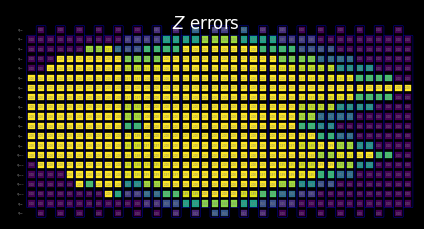
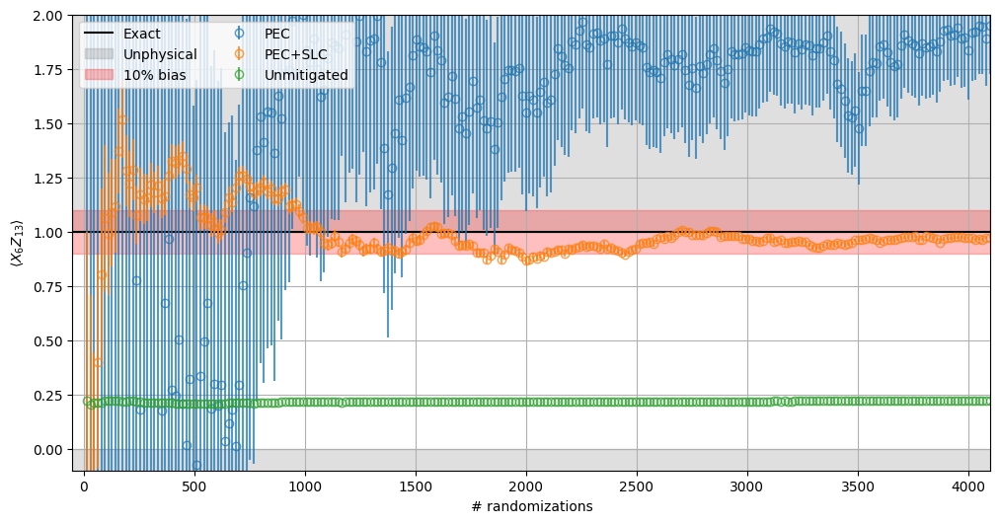

{/* doqumentation-source-hash: d7518943 */}

import TutorialFeedback from '@site/src/components/TutorialFeedback';

<OpenInLabBanner notebookPath="qiskit-addons/slc/01_getting_started.ipynb" />


##  Background
Questo tutorial mostra come mitigare gli errori usando l'addon Shaded lightcone (SLC). Questo addon è un'evoluzione della [tecnica di cancellazione probabilistica degli errori (PEC)](https://quantum.cloud.ibm.com/docs/guides/error-mitigation-and-suppression-techniques#probabilistic-error-cancellation-pec), in cui un utente apprende il rumore dei layer unici in un circuito e poi cancella il rumore applicando Gate su singolo Qubit e tecniche di post-elaborazione. Rispetto ad altri metodi, PEC offre limiti più robusti sul bias del risultato mitigato, ma tende a soffrire di un overhead maggiore in termini di tempo QPU. Durante PEC, per compensare l'attenuazione del valore di aspettativa causata dal rumore, il risultato medio viene riscalato di un fattore $\gamma = \exp(\sum_{l,\sigma} 2\lambda_{l,\sigma})$, dove $\lambda_{l,\sigma}$ è il tasso di rumore appreso dell'errore Pauli $\sigma$ al layer $l$ nel Circuit. Questo riscalamento aumenta la varianza di un fattore $\gamma^2$, e quindi moltiplica anche il numero di esecuzioni del Circuit necessarie sul QPU per $\gamma^2$, che chiamiamo costo di campionamento o overhead di campionamento. Poiché $\gamma$ cresce esponenzialmente, PEC è spesso limitato a Circuit poco profondi o con pochi Qubit. Scopri di più su PEC in [Probabilistic error cancellation with sparse Pauli-Lindblad models on noisy quantum processors.](https://arxiv.org/abs/2201.09866) 

Se riusciamo a identificare gli errori che non devono essere mitigati, possiamo ridurre esponenzialmente questo costo di campionamento. Un primo passo in questa direzione è l'implementazione della mitigazione degli errori consapevole localmente, che usa un "cono di luce" convenzionale calcolabile rapidamente per ridurre l'overhead di PEC limitando la sensibilità di un'osservabile agli errori lungo tutto il Circuit, estendendo la fattibilità di PEC a scale maggiori per alcuni problemi. Gli errori al di fuori di questo cono di luce non possono influenzare il risultato misurato e possono quindi essere esclusi dalla procedura di cancellazione degli errori. Questa esclusione riduce l'overhead di campionamento, in alcuni casi sostanzialmente, senza introdurre bias aggiuntivo. In particolare, per misurare un'osservabile locale $O$ di un Circuit a profondità fissa, l'overhead di campionamento richiesto raggiunge eventualmente un plateau quando si scala il numero di Qubit nel Circuit (vedi Fig. 2b in [Locality and Error Mitigation of Quantum Circuits.](https://arxiv.org/abs/2303.06496))

I coni di luce ombreggiati (SLC) vanno oltre, usando simulazioni classiche per limitare più strettamente la sensibilità agli errori lungo tutto il Circuit. Questo scambia un po' di tempo QPU con tempo CPU e riduce l'overhead di campionamento necessario per rinormalizzare il bias. Invece di un taglio netto, a ogni potenziale errore nel Circuit viene assegnata un'"ombra" graduata che limita superiormente la suscettibilità dell'osservabile a quell'errore. Questa caratterizzazione raffinata consente applicazioni di PEC più efficienti e mirate con varianza ridotta, dando all'utente la possibilità di regolare in modo controllabile il bias nella stima dell'osservabile. Vedi [Lightcone shading for classically accelerated quantum error mitigation](https://arxiv.org/abs/2409.04401) per maggiori dettagli.

Il nostro workflow per l'addon SLC sfrutta il nuovo framework Samplomatic ed Executor, permettendo agli utenti di avere un controllo più modulare delle impostazioni di esecuzione per la soppressione e la mitigazione degli errori, mantenendo al tempo stesso la facilità d'uso per gli utenti avanzati. Per una comprensione più approfondita dei vantaggi di questo framework e delle sue funzionalità generali, fai riferimento al tutorial [Hello samplomatic](https://github.com/qiskit-community/qdc-challenges-2025/blob/main/day3_tutorials/Track_A/hello_samplomatic/Samplomatic%20-%20Hello%20World.ipynb).

### Workflow per l'ombreggiatura del cono di luce, l'apprendimento del rumore e l'iniezione dell'anti-rumore {#workflow-for-lightcone-shading-noise-learning-and-anti-noise-injection}
Per modellare il rumore del QPU, abbiamo scelto di usare un modello di rumore sparse Pauli-Lindblad con tassi di errore Pauli a 1 e 2 Qubit, generati localmente su ogni Qubit e arco del dispositivo. Con questa scelta, il workflow di mitigazione degli errori SLC presentato in questo tutorial è il seguente:

a. CPU — Limitare l'impatto per errore degli errori Pauli a 1 e 2 Qubit

  1. Propagazione in avanti (limitare l'effetto sull'osservabile). Propagare ogni errore fino alla fine del Circuit e calcolarne il commutatore con l'osservabile.  
      - Troncare i termini dell'operatore durante l'evoluzione per mantenere il calcolo trattabile.  
      - Restringere ulteriormente questi limiti tramite una back-propagation approssimata dell'osservabile basata sui limiti di velocità quantistica.
  2. Propagazione all'indietro (limitare l'effetto sullo stato iniziale). Propagare ogni errore fino all'inizio del Circuit e calcolarne il commutatore con lo stato iniziale.

b. QPU — Apprendere i tassi di rumore. Usare `NoiseLearner` per stimare i tassi del modello di rumore Pauli-Lindblad.

c. CPU — Stabilire le priorità di mitigazione

  1. Aggiornare i limiti fusi con i tassi di rumore appresi. Combinare i limiti in avanti e all'indietro calcolati in precedenza e aggiornarli con i tassi di rumore appresi.  
  2. Classificare le componenti di rumore da mitigare usando i limiti calcolati e i tassi appresi. Stabilire le priorità di ogni possibile errore di rumore in base al suo impatto stimato sul bias e alla spesa associata per correggerlo. 

d. QPU — Inserire l'anti-rumore ed eseguire. Eseguire il Circuit di interesse con l'anti-rumore (rumore inverso) specificato usando le annotazioni `Box`.

e. CPU — Stimare l'osservabile. Calcolare il valore di aspettativa, applicando la post-selezione basata sulle misure per ridurre l'impatto del rumore non-Markoviano.

### Panoramica sull'apprendimento del rumore {#noise-learning-overview}
L'apprendimento del rumore è un passaggio comune in diversi metodi di mitigazione degli errori, eseguito dal [NoiseLearner](https://quantum.cloud.ibm.com/docs/en/guides/noise-learning), e può essere visto nel nostro tutorial di [mitigazione degli errori PEA](https://quantum.cloud.ibm.com/docs/tutorials/probabilistic-error-amplification), oltre che nel nostro [tutorial sull'assorbimento del rumore propagato (PNA)](https://github.com/qiskit-community/qdc-challenges-2025/blob/main/day3_tutorials/Track_A/pna/propagated_noise_absorption.ipynb). In `NoiseLearnerV3`, un utente può identificare specificamente i layer di rumore da apprendere come oggetti [`CircuitInstruction`](https://quantum.cloud.ibm.com/docs/api/qiskit/qiskit.circuit.CircuitInstruction), il che consente agli utenti di calcolare i limiti di rumore SLC desiderati per ogni layer nel modo descritto sopra. Il modello Pauli-Lindblad appreso fornisce i coefficienti da usare nella prioritizzazione PEC-SLC. Il modo in cui i Gate vengono raccolti nei layer può essere determinato usando le funzioni di convenienza `generate_boxing_pass_manager` e `unique_2q_instructions`, e poi fornito alla funzione di utilità SLC `generate_noise_model_paulis`, come descritto nel Passo 2 qui sotto.

| **Parte 1** | **Parte 2** | **Parte 3** |
|-----------|-----------|-----------|
| Pauli-twirl dei layer di Gate a due Qubit | Ripetere coppie di layer identiche e apprendere il rumore | Derivare una fedeltà (errore per ogni canale di rumore) |
|  |  |  |

### Panoramica sulla post-elaborazione {#post-processing-overview}
Dopo l'esecuzione sull'hardware quantistico usando il framework Samplomatic ed Executor, convertiamo le misure delle stringhe di bit nel valore dell'osservabile desiderato. Nel caso del nostro Circuit Ising a specchio, otterremo idealmente un'osservabile misurata di 1, poiché tutti i Qubit dovrebbero idealmente tornare al loro punto di partenza $\ket{0}$. Quando si calcola il valore dell'osservabile con la nostra funzione `expectation_values`, applicheremo alcune tecniche di post-elaborazione che riducono l'impatto del rumore. Questo include la rimozione degli shot influenzati dal rumore non-Markoviano, la mitigazione degli errori di readout e la considerazione dei dettagli della nostra implementazione PEC. I dettagli sono discussi nel Passo 4 qui sotto.
## Requisiti {#requirements}
Prima di iniziare questo tutorial, assicurati di avere i seguenti pacchetti installati:

- Qiskit IBM Runtime con il primitivo Executor (`pip install "qiskit-ibm-runtime @ git+https://github.com/Qiskit/qiskit-ibm-runtime.git"`)
- Qiskit addon Shaded lightcone 0.1 (`pip install "qiskit-addon-slc~=0.1.0`")
- Qiskit addon utils (`pip install "qiskit-addon-utils~=0.3.0"`)
- Samplomatic v0.16 o superiore(`pip install samplomatic`)
- Supporto per la visualizzazione Qiskit (`pip install "qiskit[visualization]"`)
## Step 0. Configurazione {#step-0-setup}
Prima di tutto, importa i pacchetti e le funzioni necessari per eseguire correttamente questo notebook.

```python
# Added by doQumentation — required packages for this notebook
!pip install -q matplotlib numpy qiskit qiskit-addon-slc qiskit-addon-utils qiskit-ibm-runtime samplomatic
```

```python
import logging

logging.basicConfig(level=logging.INFO, format="%(asctime)s %(levelname)s %(module)s %(message)s")

# Setting this value prevents itertools.starmap deadlock on UNIX systems
from multiprocessing import set_start_method

set_start_method("spawn")

# Needed to prevent PySCF from parallelizing internally (SLC only)
%set_env OMP_NUM_THREADS=1
```

```text
env: OMP_NUM_THREADS=1
```

```python
import pickle

import numpy as np
import samplomatic
from matplotlib import pyplot as plt
from qiskit import QuantumCircuit
from qiskit.quantum_info import SparsePauliOp
from qiskit.transpiler import PassManager, generate_preset_pass_manager
from qiskit_addon_slc.bounds import (
    compute_backward_bounds,
    compute_forward_bounds,
    compute_local_scales,
    merge_bounds,
    tighten_with_speed_limit,
)
from qiskit_addon_slc.utils import generate_noise_model_paulis, map_modifier_ref_to_ref
from qiskit_addon_slc.visualization import draw_shaded_lightcone
from qiskit_addon_utils.exp_vals.expectation_values import executor_expectation_values
from qiskit_addon_utils.exp_vals.measurement_bases import get_measurement_bases
from qiskit_addon_utils.noise_management import gamma_from_noisy_boxes, trex_factors
from qiskit_addon_utils.noise_management.post_selection import PostSelector
from qiskit_addon_utils.noise_management.post_selection.transpiler.passes import (
    AddPostSelectionMeasures,
    AddSpectatorMeasures,
)
from qiskit_ibm_runtime import Executor, QiskitRuntimeService, QuantumProgram
from qiskit_ibm_runtime.noise_learner_v3 import NoiseLearnerV3
from qiskit_ibm_runtime.options import NoiseLearnerV3Options
from samplomatic.transpiler import generate_boxing_pass_manager
from samplomatic.utils import find_unique_box_instructions
```
## Step 1. Map the problem
Per semplicità di dimostrazione, selezioniamo una catena di Ising speculare 1D. La catena di Ising 1D offre una struttura del Circuit ben densa, utile per illustrare le implementazioni PEC. Un Circuit speculare rende semplice conoscere il risultato atteso (in particolare, si dovrebbe misurare un osservabile pari a 1).

Inoltre, poiché vogliamo eseguire un Circuit speculare, per ogni Gate nella seconda metà del Circuit deve esserci un Gate inverso nella prima metà. Poiché l'osservabile misurato **$<X_6 Z_{13}>$** ha misurazioni in base non-Z, e il Executor tiene conto della base desiderata alla fine del Circuit, forniamo una funzione `prepare_basis` che inserisce i Gate appropriati all'inizio del Circuit speculare. Questo dettaglio è specifico alla nostra dimostrazione con Circuit speculare. La funzione `get_measurement_bases` ci permette di identificare facilmente quali Gate sono necessari e dove aggiungerli, oltre a tenere traccia delle sottigliezze degli indici dei Qubit derivanti dalle convenzioni dell'annotazione `box` discusse nella sezione "Prepara le misurazioni nelle basi canoniche".

```python
num_qubits = 20
target_obs_sparse = [("XZ", [6, 13], 1.0)]
```

```python
observable = SparsePauliOp.from_sparse_list(target_obs_sparse, num_qubits=num_qubits)
```

```python
bases_virt, reverser_virt = get_measurement_bases(observable)
```

```python
num_trotter_steps = 10
rx_angle = np.pi / 4
```

```python
def construct_ising_circuit(
    num_qubits: int, num_trotter_steps: int, rx_angle: float, barrier: bool = True
) -> QuantumCircuit:
    circuit = QuantumCircuit(num_qubits)

    for _step in range(num_trotter_steps):
        circuit.rx(rx_angle, range(num_qubits))
        if barrier:
            circuit.barrier()
        for first_qubit in (1, 2):
            for idx in range(first_qubit, num_qubits, 2):
                # equivalent to Rzz(-pi/2):
                circuit.sdg([idx - 1, idx])
                circuit.cz(idx - 1, idx)
        if barrier:
            circuit.barrier()

    return circuit

def prepare_basis(circuit: QuantumCircuit, basis: list[int]) -> QuantumCircuit:
    # basis is a list of integer values from 0 to 3. These map to the basis measurement as:
    # 0 = I; 1 = Z; 2 = X; 3 = Y
    assert len(basis) == circuit.num_qubits

    out_circ = circuit.copy_empty_like()
    for qb, bas in enumerate(basis):
        if bas in {0, 1}:
            continue
        if bas == 2:
            out_circ.h(qb)
        elif bas == 3:
            out_circ.rx(-np.pi / 2, qb)

    out_circ.barrier()
    out_circ.compose(circuit, inplace=True)
    return out_circ

def mirror_circuit(circuit: QuantumCircuit, *, inverse_first: bool = False) -> QuantumCircuit:
    mirror_circ = circuit.copy_empty_like()
    mirror_circ.compose(circuit.inverse() if inverse_first else circuit, inplace=True)
    mirror_circ.barrier()
    mirror_circ.compose(circuit if inverse_first else circuit.inverse(), inplace=True)
    mirror_circ.measure_active()
    return mirror_circ
```

```python
# Instantiate circuit
circuit = construct_ising_circuit(num_qubits, num_trotter_steps, rx_angle, barrier=False)
mirrored_circuit = mirror_circuit(circuit, inverse_first=True)
mirrored_circuit = prepare_basis(mirrored_circuit, bases_virt[0])
```

```python
mirrored_circuit.draw("mpl", fold=-1, scale=0.3, idle_wires=False, measure_arrows=False)
```


## Passo 2. Ottimizza {#step-2-optimize}
Ottimizzeremo i dettagli relativi al circuito da eseguire, all'osservabile da misurare e ai parametri di noise learning. Come punto di partenza, ci assicuriamo di istanziare un backend con i gate frazionari attivati come opzione. Questi gate frazionari consentiranno una maggiore sensibilità in alcune delle nostre operazioni di post-selezione.

```python
token = "<YOUR_TOKEN>"
instance = "<YOUR_INSTANCE>"

# This is used to retrieve shared results
shared_service = QiskitRuntimeService(
    channel="ibm_quantum_platform",
    token=token,
    instance=instance,
)

# This is used to run on real hardware
service = service = QiskitRuntimeService()
```

```text
qiskit_runtime_service._discover_account:WARNING:2025-11-10 11:19:40,108: Loading account with the given token. A saved account will not be used.
```

```python
backend = service.backend("ibm_kingston", use_fractional_gates=True)
```

Prima di tutto, traspilaremo il nostro circuito in istruzioni ISA, [come richiesto per l'esecuzione sui nostri QPU](https://www.ibm.com/quantum/blog/isa-circuits). Per i dati raccolti in questo esperimento, selezioniamo manualmente i nostri qubit sulla base della valutazione della catena di qualità più alta.

```python
layout = [44, 45, 46, 47, 57, 67, 68, 69, 78, 89, 88, 87, 97, 107, 106, 105, 104, 103, 96, 83]
```

```python
isa_pm = generate_preset_pass_manager(backend=backend, initial_layout=layout, optimization_level=0)

isa_circuit = isa_pm.run(mirrored_circuit)
assert isa_circuit.layout.final_index_layout() == layout

isa_observable = observable.apply_layout(layout, num_qubits=isa_circuit.num_qubits)
```

```text
2025-11-10 11:19:57,810 INFO base_tasks Pass: ContainsInstruction - 0.00715 (ms)
2025-11-10 11:19:57,811 INFO base_tasks Pass: UnitarySynthesis - 0.00525 (ms)
2025-11-10 11:19:57,811 INFO base_tasks Pass: HighLevelSynthesis - 0.02599 (ms)
2025-11-10 11:19:57,811 INFO base_tasks Pass: BasisTranslator - 0.09131 (ms)
2025-11-10 11:19:57,811 INFO base_tasks Pass: SetLayout - 0.02623 (ms)
2025-11-10 11:19:57,812 INFO base_tasks Pass: FullAncillaAllocation - 0.14400 (ms)
2025-11-10 11:19:57,812 INFO base_tasks Pass: EnlargeWithAncilla - 0.06318 (ms)
2025-11-10 11:19:57,813 INFO base_tasks Pass: ApplyLayout - 0.29802 (ms)
2025-11-10 11:19:57,813 INFO base_tasks Pass: CheckMap - 0.07820 (ms)
2025-11-10 11:19:57,814 INFO base_tasks Pass: FilterOpNodes - 0.33283 (ms)
2025-11-10 11:19:57,814 INFO base_tasks Pass: UnitarySynthesis - 0.00691 (ms)
2025-11-10 11:19:57,814 INFO base_tasks Pass: HighLevelSynthesis - 0.13208 (ms)
2025-11-10 11:19:57,816 INFO base_tasks Pass: BasisTranslator - 1.00303 (ms)
2025-11-10 11:19:57,818 INFO base_tasks Pass: FoldRzzAngle - 1.78719 (ms)
2025-11-10 11:19:57,818 INFO base_tasks Pass: ContainsInstruction - 0.00691 (ms)
2025-11-10 11:19:57,818 INFO base_tasks Pass: InstructionDurationCheck - 0.00405 (ms)
```

```python
wire_order = layout + [q for q in range(isa_circuit.num_qubits) if q not in layout]
isa_circuit.draw(
    "mpl", fold=-1, scale=0.3, idle_wires=False, wire_order=wire_order, measure_arrows=False
)
```


### Inscatola il circuito {#box-the-circuit}
Per semplicità di implementazione, utilizzeremo il pass di traspilazone `generate_boxing_pass_manager`, che inserisce le istruzioni del circuito in box annotati. Questi box indicano chiaramente dove, nel caso del PEC, l'antinoise deve essere iniettato nel circuito. Per dettagli sulle impostazioni, consulta la [documentazione di Samplomatic.](https://qiskit.github.io/samplomatic/)

Nota che il workflow SLC prevede l'uso di `inject_noise_strategy="individual_modification"` più avanti nel processo, poiché questo ci permette di identificare in modo univoco ogni `BoxOp` nel circuito.

La funzione `find_unique_box_instructions` scorre il circuito boxato fornito e identifica quelli con layer 2Q o misure uniche, ai fini del noise learning e dell'iniezione di noise.

```python
# Box circuit with Twirl and InjectNoise annotations
boxes_pm = generate_boxing_pass_manager(
    twirling_strategy="active",
    inject_noise_strategy="individual_modification",
    inject_noise_targets="gates",
    measure_annotations="all",
)

boxed_circuit = boxes_pm.run(isa_circuit)

# Find the unique instructions (layers) from boxed circuit
unique_2q_instructions = find_unique_box_instructions(
    boxed_circuit, normalize_annotations=None, undress_boxes=True
)
```

```text
2025-11-10 11:20:01,088 INFO base_tasks Pass: RemoveBarriers - 0.02289 (ms)
2025-11-10 11:20:01,100 INFO base_tasks Pass: GroupGatesIntoBoxes - 12.38990 (ms)
2025-11-10 11:20:01,101 INFO base_tasks Pass: GroupMeasIntoBoxes - 0.47898 (ms)
2025-11-10 11:20:01,104 INFO base_tasks Pass: AddTerminalRightDressedBoxes - 2.88177 (ms)
2025-11-10 11:20:01,111 INFO base_tasks Pass: AddInjectNoise - 6.66904 (ms)
```

```python
boxed_circuit.draw(
    "mpl", fold=-1, scale=0.3, idle_wires=False, wire_order=wire_order, measure_arrows=False
)
```


### Prepara le misure nelle basi canoniche {#prepare-canonical-bases-measurements}
A causa di come i qubit vengono etichettati quando si identificano i layer 2Q unici, è necessario prestare particolare attenzione al tracciamento dell'ordinamento dei qubit. Di seguito, introduciamo la nozione di `canonical_qubits` come mezzo per aggiornare appropriatamente l'ordinamento dei qubit quando lo si fornisce all'executor, come risultato del modo in cui l'ordine dei qubit viene catturato nel boxing dei circuiti e nell'individuazione delle istruzioni uniche. Consulta la documentazione sulla [convenzione di ordinamento dei Qubit](https://qiskit.github.io/samplomatic/guides/samplex_io.html#qubit-ordering-convention) per i dettagli.

```python
# Determine the canonical qubits order
meas_box = boxed_circuit.data[-1]
canonical_qubits = [
    idx for idx, qubit in enumerate(boxed_circuit.qubits) if qubit in meas_box.qubits
]

# map canonical qubit to physical (isa) qubit
c_2_p = {c: p for c, p in enumerate(canonical_qubits)}
# map physical (isa) qubit to virtual qubit (index in original circuit)
p_2_v = {p: v for v, p in enumerate(layout)}
# compute map between virtual and canonical qubit indices.
c_2_v = {c: p_2_v[p] for c, p in c_2_p.items()}

assert len(c_2_v) == num_qubits

bases_canon = [
    np.array([base_i[c_2_v[c]] for c in range(num_qubits)], dtype=np.uint8) for base_i in bases_virt
]
```
### Flusso di lavoro per lo shading del cono di luce, l'apprendimento del rumore e l'iniezione anti-rumore {#workflow-for-lightcone-shading-noise-learning-and-anti-noise-injection}

> **Nota**: Per l'implementazione di SLC-PEC in questo tutorial, eseguiamo i calcoli dei limiti SLC **prima** che l'apprendimento del rumore sia stato completato, in modo che il circuito da mitigare venga eseguito il più vicino possibile nel tempo al modello di rumore appreso. In linea di principio, questo flusso di lavoro può essere ulteriormente migliorato per eseguire le operazioni simultaneamente. In particolare, un job di apprendimento del rumore viene eseguito mentre, in parallelo, vengono stimati i limiti del rumore. Per un circuito quantistico arbitrario, il calcolo dei limiti del rumore può scalare con una dipendenza debolmente esponenziale. Come tale, potrebbe essere opportuno utilizzare l'esecuzione parallelizzata quando si cerca di massimizzare l'efficienza del flusso di lavoro. A questo scopo, lo dimostriamo brevemente includendo risorse basate su cluster (128 thread) e mostrando come puoi ottenere un insieme più raffinato di limiti per un circuito fornito quando vincolato a limiti di tempo di calcolo uguali, rispetto al nostro laptop (8 thread). Inoltre, sebbene non implementato in questo flusso di lavoro, puoi parallelizzare le esecuzioni QPU per l'apprendimento del rumore e i calcoli dei limiti del rumore per ottenere il flusso di lavoro più efficiente.

#### Prevedere i Pauli del modello di rumore da apprendere {#predict-to-be-learned-noise-model-paulis}

La funzione `generate_noise_model_paulis` scorre ogni layer inscatolato del circuito fornito e genera tutti i termini di Pauli rilevanti di peso uno e peso due, tenendo conto della connettività dei qubit del circuito e selezionando i termini rilevanti per i nodi e gli archi attivi. Questi termini vengono poi utilizzati per calcolare i limiti del rumore in avanti e all'indietro.

```python
noise_model_paulis = generate_noise_model_paulis(
    unique_2q_instructions, backend.coupling_map, boxed_circuit
)
```

```python
noise_model_rates = {ref: None for ref in noise_model_paulis}
```

##### a. Calcolare e stringere i limiti in avanti {#a-compute-and-tighten-forward-bounds}

La funzione `compute_forward_bounds` valuta le relazioni di commutazione tra i gate in ogni layer e i termini di Pauli generati sopra, in termini di come gli errori di propagazione in avanti influenzano l'osservabile desiderato $A$. Per i gate che commutano con i termini di Pauli, non viene fatto nulla. Per i Clifford gate, vengono spinti verso l'inizio del circuito. Per i gate non-Clifford, approssimiamo la loro influenza sulle osservabili target per essere poi prioritizzati per la cancellazione del rumore (dopo che tutti i limiti sono stati uniti). Questo limite viene ottenuto applicando prima la norma L2 (ovvero, la radice quadrata della somma dei quadrati dei coefficienti dei termini di Pauli rilevanti). Quando sono coinvolti troppi termini di qubit, ricorriamo a un limite più lasco che usa la disuguaglianza triangolare.
#### Risorse a livello laptop {#laptop-level-resources}

```python
slc_atol = 1e-8
slc_eigval_max_qubits = 18
slc_evolution_max_terms = 1000
slc_num_processes = 8
slc_timeout = 60
```

```python
forward_bounds = compute_forward_bounds(
    boxed_circuit,
    noise_model_paulis,
    isa_observable,
    evolution_max_terms=slc_evolution_max_terms,
    eigval_max_qubits=slc_eigval_max_qubits,
    atol=slc_atol,
    num_processes=slc_num_processes,
    timeout=slc_timeout,
)
```

```text
2025-11-10 11:20:04,344 INFO forward Evolving Pauli error terms forwards through the circuit.
2025-11-10 11:20:04,344 INFO forward Modelling errors as though they happen *after* each noise layer.
2025-11-10 11:20:04,345 INFO remove_measure Removing ANY Measure operations from the provided circuit!
2025-11-10 11:20:04,453 INFO circuit_iter Noisy box 'm39'
2025-11-10 11:20:05,254 INFO circuit_iter Noisy box 'm38'
2025-11-10 11:20:05,304 INFO circuit_iter Noisy box 'm37'
2025-11-10 11:20:05,382 INFO circuit_iter Noisy box 'm36'
2025-11-10 11:20:05,467 INFO circuit_iter Noisy box 'm35'
2025-11-10 11:20:05,580 INFO circuit_iter Noisy box 'm34'
2025-11-10 11:20:05,705 INFO circuit_iter Noisy box 'm33'
2025-11-10 11:20:05,857 INFO circuit_iter Noisy box 'm32'
2025-11-10 11:20:06,034 INFO circuit_iter Noisy box 'm31'
2025-11-10 11:20:06,221 INFO circuit_iter Noisy box 'm30'
2025-11-10 11:20:06,449 INFO circuit_iter Noisy box 'm29'
2025-11-10 11:20:06,724 INFO circuit_iter Noisy box 'm28'
2025-11-10 11:20:07,628 INFO circuit_iter Noisy box 'm27'
2025-11-10 11:20:09,110 INFO circuit_iter Noisy box 'm26'
2025-11-10 11:20:11,696 INFO circuit_iter Noisy box 'm25'
2025-11-10 11:20:16,100 INFO circuit_iter Noisy box 'm24'
2025-11-10 11:20:21,781 INFO circuit_iter Noisy box 'm23'
2025-11-10 11:20:30,244 INFO circuit_iter Noisy box 'm22'
2025-11-10 11:20:40,416 INFO circuit_iter Noisy box 'm21'
2025-11-10 11:20:53,437 INFO circuit_iter Noisy box 'm20'
2025-11-10 11:21:06,038 INFO circuit_iter Noisy box 'm19'
2025-11-10 11:21:06,038 WARNING commutator_bounds Bounds computation timed out.
2025-11-10 11:21:06,039 INFO circuit_iter Noisy box 'm18'
2025-11-10 11:21:06,039 INFO circuit_iter Noisy box 'm17'
2025-11-10 11:21:06,039 INFO circuit_iter Noisy box 'm16'
2025-11-10 11:21:06,040 INFO circuit_iter Noisy box 'm15'
2025-11-10 11:21:06,040 INFO circuit_iter Noisy box 'm14'
2025-11-10 11:21:06,040 INFO circuit_iter Noisy box 'm13'
2025-11-10 11:21:06,040 INFO circuit_iter Noisy box 'm12'
2025-11-10 11:21:06,041 INFO circuit_iter Noisy box 'm11'
2025-11-10 11:21:06,041 INFO circuit_iter Noisy box 'm10'
2025-11-10 11:21:06,041 INFO circuit_iter Noisy box 'm9'
2025-11-10 11:21:06,042 INFO circuit_iter Noisy box 'm8'
2025-11-10 11:21:06,042 INFO circuit_iter Noisy box 'm7'
2025-11-10 11:21:06,042 INFO circuit_iter Noisy box 'm6'
2025-11-10 11:21:06,042 INFO circuit_iter Noisy box 'm5'
2025-11-10 11:21:06,043 INFO circuit_iter Noisy box 'm4'
2025-11-10 11:21:06,043 INFO circuit_iter Noisy box 'm3'
2025-11-10 11:21:06,043 INFO circuit_iter Noisy box 'm2'
2025-11-10 11:21:06,043 INFO circuit_iter Noisy box 'm1'
2025-11-10 11:21:06,044 INFO circuit_iter Noisy box 'm0'
```
#### Visualizza l'SLC per ispezione manuale {#visualize-the-slc-for-manual-inspection}

Puoi interpretare il comportamento dei bounds ombreggiati esaminando come le misurazioni e i termini di Pauli interagiscono con gli errori locali. Questi pattern sono caratteristici di questo problema di evoluzione temporale dell'Hamiltoniano di Ising kicked e compaiono anche nell'articolo [Lightcone Shading for Classically Accelerated Quantum Error Mitigation](https://arxiv.org/abs/2409.04401), con diverse caratteristiche tipiche:

- Possiamo distinguere chiaramente i due coni originati dai due Pauli non identità nell'osservabile.
- Possiamo vedere che la misurazione X sul qubit 6 commuta con l'errore X nel layer più a destra.
- Possiamo vedere che il Pauli Z sul qubit 13 commuta con l'errore Z nel layer più a destra.
- Quando raggiungiamo il timeout specificato sopra, i layer rimanenti a sinistra vengono riempiti interamente con bounds banali pari a due.

```python
for p in "XYZ":
    display(
        draw_shaded_lightcone(
            boxed_circuit,
            forward_bounds,
            noise_model_paulis,
            pauli_filter=p,
            scale=0.15,
            fold=-1,
            idle_wires=False,
            wire_order=wire_order,
            measure_arrows=False,
        )
    )
```


#### b. Calcola e restringi i forward bounds {#b-compute-and-tighten-forward-bounds}
Successivamente restringiamo i bounds utilizzando la funzione `tighten_with_speed_limit`, che traccia come l'osservabile si propaga all'indietro attraverso il Circuit e utilizza tale propagazione per porre dei limiti superiori sull'effetto di ogni operatore di rumore, prendendo il minore tra il forward bound appena calcolato e il bound di propagazione all'indietro.

```python
forward_bounds_tighter = tighten_with_speed_limit(
    forward_bounds, boxed_circuit, noise_model_paulis, isa_observable
)
```

```text
2025-11-10 11:21:08,270 INFO speed_limit Tighting bounds using information propagation speed limits
2025-11-10 11:21:08,270 INFO speed_limit Modelling errors as though they happen *after* each noise layer.
2025-11-10 11:21:08,298 INFO remove_measure Removing ANY Measure operations from the provided circuit!
2025-11-10 11:21:08,310 INFO circuit_iter Noisy box 'm39'
2025-11-10 11:21:08,314 INFO circuit_iter Noisy box 'm38'
2025-11-10 11:21:08,317 INFO circuit_iter Noisy box 'm37'
2025-11-10 11:21:08,319 INFO circuit_iter Noisy box 'm36'
2025-11-10 11:21:08,323 INFO circuit_iter Noisy box 'm35'
2025-11-10 11:21:08,325 INFO circuit_iter Noisy box 'm34'
2025-11-10 11:21:08,328 INFO circuit_iter Noisy box 'm33'
2025-11-10 11:21:08,330 INFO circuit_iter Noisy box 'm32'
2025-11-10 11:21:08,334 INFO circuit_iter Noisy box 'm31'
2025-11-10 11:21:08,336 INFO circuit_iter Noisy box 'm30'
2025-11-10 11:21:08,338 INFO circuit_iter Noisy box 'm29'
2025-11-10 11:21:08,340 INFO circuit_iter Noisy box 'm28'
2025-11-10 11:21:08,344 INFO circuit_iter Noisy box 'm27'
2025-11-10 11:21:08,346 INFO circuit_iter Noisy box 'm26'
2025-11-10 11:21:08,349 INFO circuit_iter Noisy box 'm25'
2025-11-10 11:21:08,351 INFO circuit_iter Noisy box 'm24'
2025-11-10 11:21:08,355 INFO circuit_iter Noisy box 'm23'
2025-11-10 11:21:08,357 INFO circuit_iter Noisy box 'm22'
2025-11-10 11:21:08,360 INFO circuit_iter Noisy box 'm21'
2025-11-10 11:21:08,362 INFO circuit_iter Noisy box 'm20'
2025-11-10 11:21:08,367 INFO circuit_iter Noisy box 'm19'
2025-11-10 11:21:08,369 INFO circuit_iter Noisy box 'm18'
2025-11-10 11:21:08,372 INFO circuit_iter Noisy box 'm17'
2025-11-10 11:21:08,375 INFO circuit_iter Noisy box 'm16'
2025-11-10 11:21:08,378 INFO circuit_iter Noisy box 'm15'
2025-11-10 11:21:08,380 INFO circuit_iter Noisy box 'm14'
2025-11-10 11:21:08,383 INFO circuit_iter Noisy box 'm13'
2025-11-10 11:21:08,386 INFO circuit_iter Noisy box 'm12'
2025-11-10 11:21:08,389 INFO circuit_iter Noisy box 'm11'
2025-11-10 11:21:08,391 INFO circuit_iter Noisy box 'm10'
2025-11-10 11:21:08,394 INFO circuit_iter Noisy box 'm9'
2025-11-10 11:21:08,396 INFO circuit_iter Noisy box 'm8'
2025-11-10 11:21:08,399 INFO circuit_iter Noisy box 'm7'
2025-11-10 11:21:08,401 INFO circuit_iter Noisy box 'm6'
2025-11-10 11:21:08,404 INFO circuit_iter Noisy box 'm5'
2025-11-10 11:21:08,406 INFO circuit_iter Noisy box 'm4'
2025-11-10 11:21:08,410 INFO circuit_iter Noisy box 'm3'
2025-11-10 11:21:08,412 INFO circuit_iter Noisy box 'm2'
2025-11-10 11:21:08,415 INFO circuit_iter Noisy box 'm1'
2025-11-10 11:21:08,417 INFO circuit_iter Noisy box 'm0'
```

#### Visualizza l'SLC per ispezione manuale {#visualize-the-slc-for-manual-inspection}

Possiamo restringere ulteriormente i bounds tenendo conto della limitazione del cono di luce. In linea di principio, questo ci fornisce una transizione più fluida dai bounds calcolati ai bounds banali stabiliti dopo il raggiungimento del timeout. Qui, l'effetto non è così visibile perché i coni di luce hanno già raggiunto il bordo del Circuit.

```python
for p in "XYZ":
    display(
        draw_shaded_lightcone(
            boxed_circuit,
            forward_bounds_tighter,
            noise_model_paulis,
            pauli_filter=p,
            scale=0.15,
            fold=-1,
            idle_wires=False,
            wire_order=wire_order,
            measure_arrows=False,
        )
    )
```


#### c. Calcola i limiti backward {#c-compute-backward-bounds}

Questa parte della previsione del rumore valuta come un errore in un determinato layer possa influenzare lo stato di input $\rho$. La funzione `compute_backward_bounds` prima inverte il circuito, rimuove i gate di misura, e poi procede con un'analisi simile a quella eseguita per il calcolo dei limiti forward.

```python
backward_bounds = compute_backward_bounds(
    boxed_circuit,
    noise_model_paulis,
    evolution_max_terms=slc_evolution_max_terms,
    num_processes=slc_num_processes,
    timeout=slc_timeout,
)
```

```text
2025-11-10 11:21:10,666 INFO backward Evolving Pauli error terms backwards through the circuit.
2025-11-10 11:21:10,666 INFO backward Modelling errors as though they happen *after* each noise layer.
2025-11-10 11:21:10,667 INFO remove_measure Removing ANY Measure operations from the provided circuit!
2025-11-10 11:21:10,774 INFO circuit_iter Noisy box 'm0'
2025-11-10 11:21:11,640 INFO circuit_iter Noisy box 'm1'
2025-11-10 11:21:11,681 INFO circuit_iter Noisy box 'm2'
2025-11-10 11:21:11,867 INFO circuit_iter Noisy box 'm3'
2025-11-10 11:21:12,078 INFO circuit_iter Noisy box 'm4'
2025-11-10 11:21:12,329 INFO circuit_iter Noisy box 'm5'
2025-11-10 11:21:12,637 INFO circuit_iter Noisy box 'm6'
2025-11-10 11:21:13,110 INFO circuit_iter Noisy box 'm7'
2025-11-10 11:21:13,705 INFO circuit_iter Noisy box 'm8'
2025-11-10 11:21:14,384 INFO circuit_iter Noisy box 'm9'
2025-11-10 11:21:15,213 INFO circuit_iter Noisy box 'm10'
2025-11-10 11:21:15,946 INFO circuit_iter Noisy box 'm11'
2025-11-10 11:21:16,754 INFO circuit_iter Noisy box 'm12'
2025-11-10 11:21:17,557 INFO circuit_iter Noisy box 'm13'
2025-11-10 11:21:18,447 INFO circuit_iter Noisy box 'm14'
2025-11-10 11:21:19,453 INFO circuit_iter Noisy box 'm15'
2025-11-10 11:21:20,472 INFO circuit_iter Noisy box 'm16'
2025-11-10 11:21:21,479 INFO circuit_iter Noisy box 'm17'
2025-11-10 11:21:22,660 INFO circuit_iter Noisy box 'm18'
2025-11-10 11:21:23,705 INFO circuit_iter Noisy box 'm19'
2025-11-10 11:21:24,849 INFO circuit_iter Noisy box 'm20'
2025-11-10 11:21:26,030 INFO circuit_iter Noisy box 'm21'
2025-11-10 11:21:27,111 INFO circuit_iter Noisy box 'm22'
2025-11-10 11:21:28,354 INFO circuit_iter Noisy box 'm23'
2025-11-10 11:21:29,554 INFO circuit_iter Noisy box 'm24'
2025-11-10 11:21:30,897 INFO circuit_iter Noisy box 'm25'
2025-11-10 11:21:32,113 INFO circuit_iter Noisy box 'm26'
2025-11-10 11:21:33,622 INFO circuit_iter Noisy box 'm27'
2025-11-10 11:21:34,962 INFO circuit_iter Noisy box 'm28'
2025-11-10 11:21:36,504 INFO circuit_iter Noisy box 'm29'
2025-11-10 11:21:38,021 INFO circuit_iter Noisy box 'm30'
2025-11-10 11:21:39,750 INFO circuit_iter Noisy box 'm31'
2025-11-10 11:21:41,237 INFO circuit_iter Noisy box 'm32'
2025-11-10 11:21:42,974 INFO circuit_iter Noisy box 'm33'
2025-11-10 11:21:44,527 INFO circuit_iter Noisy box 'm34'
2025-11-10 11:21:46,535 INFO circuit_iter Noisy box 'm35'
2025-11-10 11:21:48,152 INFO circuit_iter Noisy box 'm36'
2025-11-10 11:21:50,074 INFO circuit_iter Noisy box 'm37'
2025-11-10 11:21:51,814 INFO circuit_iter Noisy box 'm38'
2025-11-10 11:21:53,943 INFO circuit_iter Noisy box 'm39'
```

#### Visualizza l'SLC per un'ispezione manuale {#visualize-the-slc-for-manual-inspection}

Dal calcolo dei limiti backward, possiamo vedere come la struttura dello stato iniziale governi il comportamento iniziale della propagazione degli errori:

- Possiamo vedere chiaramente come gli errori Z commutino inizialmente con lo stato iniziale |0⟩.
- Solo sul Qubit 6, dove inizializziamo l'autostato +1 della base X, un errore Z non riesce a commutare, mentre un errore X commuta.

```python
for p in "XYZ":
    display(
        draw_shaded_lightcone(
            boxed_circuit,
            backward_bounds,
            noise_model_paulis,
            pauli_filter=p,
            scale=0.15,
            fold=-1,
            idle_wires=False,
            wire_order=wire_order,
            measure_arrows=False,
        )
    )
```


#### Anteprima dei limiti unificati senza tassi di rumore appresi {#preview-merged-bounds-without-learned-noise-rates}

La funzione `merged_bounds` determina il punto nel circuito in cui passare dai limiti backward ai limiti forward minimizza il bias totale stimato sull'osservabile desiderato. Questo bias è calcolato come la somma dei contributi dei limiti backward per tutte le posizioni di rumore prima di quel punto, più i contributi dei limiti forward per tutte le posizioni di rumore dopo di esso. Attualmente, questo viene fatto in modo uniforme per tutti i Qubit.

> **Nota importante**: Il punto in cui passare dai limiti forward a quelli backward dipende dai tassi di rumore appresi.

```python
merged_bounds = merge_bounds(
    boxed_circuit,
    forward_bounds_tighter,
    backward_bounds,
    noise_model_rates,
)
```

```text
2025-11-10 11:21:58,304 WARNING merge Missing noise rates. Partitioning backward/forward commutator bounds by assuming uniform error rates.
2025-11-10 11:21:58,305 WARNING merge Optimal spacetime partitioning not implemented!Just partitioning list of noisy boxes.
2025-11-10 11:21:58,305 INFO merge Determined Box idx for partitioning to be 20.
```
### Visualizza l'SLC per l'ispezione manuale {#visualize-the-slc-for-manual-inspection}

Dopo aver unito i limiti backward e quelli forward ristretti, il comportamento degli SLC combinati diventa chiaro:

- La funzione precedente ci indica che viene scelto un punto di partizionamento in cui avviene il passaggio dai limiti backward a quelli forward ristretti.
- Possiamo vedere di seguito che gli SLC contengono ora limiti backward parziali e limiti forward ristretti parziali.

```python
for p in "XYZ":
    display(
        draw_shaded_lightcone(
            boxed_circuit,
            merged_bounds,
            noise_model_paulis,
            pauli_filter=p,
            scale=0.15,
            fold=-1,
            idle_wires=False,
            wire_order=wire_order,
            measure_arrows=False,
        )
    )
```


#### Risorse a livello di cluster {#cluster-level-resources}
Qui dimostriamo come l'utilizzo di 128 thread su un cluster consenta di propagarsi attraverso una porzione più sostanziale di questo circuito di dimensioni maggiori, rimanendo nello stesso tempo di calcolo del laptop.

```python
with open("exp_data/merged_bounds_cluster.pickle", "rb") as file:
    merged_bounds_cluster = pickle.load(file)
```

```python
for p in "XYZ":
    display(
        draw_shaded_lightcone(
            boxed_circuit,
            merged_bounds_cluster,
            noise_model_paulis,
            pauli_filter=p,
            scale=0.15,
            fold=-1,
            idle_wires=False,
            wire_order=wire_order,
            measure_arrows=False,
        )
    )
```



## Step 3. Execute
In questa sezione iniziamo la parte del flusso di lavoro che utilizza un vero dispositivo quantistico. Per questo metodo di mitigazione degli errori basato sull'apprendimento, ci sono due passaggi: 

1. Apprendere il rumore usando `NoiseLeanerV3`.
2. Eseguire un circuito di mitigazione degli errori con il nuovo framework Samplomatic ed Estimator. 

Con gli errori limitati del nostro circuito quantistico, dobbiamo apprendere i tassi di rumore associati per prioritizzare il nostro budget di errori, determinare l'overhead di campionamento ed eseguire su una QPU. Inoltre, con queste informazioni sui tassi di rumore, possiamo anche evidenziare come, sfruttando le potenti risorse di calcolo del nostro cluster, si riduca l'overhead di campionamento mantenendo lo stesso bias residuo.
### a. Apprendere i tassi di rumore {#a-learn-noise-rates}

Il noise learner permette la caratterizzazione dei processi di rumore che influenzano i Gate in uno o più Circuit di interesse, basandosi sul modello di rumore di Pauli-Lindblad descritto nel paper [Probabilistic error cancellation with sparse Pauli-Lindblad models on noisy quantum processors](https://arxiv.org/abs/2201.09866). Il metodo `run()` avvia un job di apprendimento del rumore per i layer univoci a 2-Qubit forniti, in base alle opzioni specificate nella configurazione del noise learner. In queste opzioni, puoi regolare la strategia di Pauli-twirling, che aiuta a garantire che l'hardware sia ben descritto dal modello di rumore di Pauli-Lindblad.

I dettagli del tuo modello di rumore rischiano di derivare nel tempo. Per questo motivo, impostiamo un parametro per assicurarci che il modello di rumore appreso venga ricalcolato per gli esperimenti più vecchi di quattro ore. Questa è una regola empirica approssimativa e dovrebbe essere considerata attentamente quando la si applica al proprio lavoro.

```python
post_selection_enabled = True
load_cached_noise_results = True
```

```python
noise_learner_options = NoiseLearnerV3Options(
    num_randomizations=64,
    shots_per_randomization=128,
    layer_pair_depths=[1, 2, 4, 8, 12, 16, 24, 32, 40, 48],
    post_selection={
        "enable": post_selection_enabled,
        "strategy": "edge",
        "x_pulse_type": "rx",
    },
)

noise_learner = NoiseLearnerV3(backend, noise_learner_options)
```

```python
if load_cached_noise_results:
    noise_learner_job = shared_service.job("d46ssf71gh7s7398k9a0")
else:
    noise_learner_job = noise_learner.run(unique_2q_instructions)
```

```python
noise_learner_result = noise_learner_job.result()
```

```python
if post_selection_enabled:
    print("Minimum fraction of shots kept for noise learning experiments: ", end="")
    print(
        f"{min([min(d.values()) for d in [nlr.metadata['post_selection']['fraction_kept'] for nlr in noise_learner_result[:2]]]):.2f}"
    )
```

```text
Minimum fraction of shots kept for noise learning experiments: 0.58
```

```python
# Get a dict mapping InjectNoise.ref to QubitSparsePaulilist
refs_2_plm = noise_learner_result.to_dict(unique_2q_instructions, require_refs=False)
```

### b.i. Aggiornare i bounds uniti con i tassi di rumore effettivamente appresi {#bi-update-merged-bounds-with-actual-learned-noise-rates}

Ora che il modello di rumore specifico è stato appreso, possiamo applicare i tassi di rumore appresi ai bounds di rumore previsti e ottenere una determinazione finale di quali bounds abbiano il maggiore impatto sulla minimizzazione del bias.

```python
merged_bounds = merge_bounds(
    boxed_circuit,
    forward_bounds_tighter,
    backward_bounds,
    refs_2_plm,
)
```

```text
2025-11-10 11:22:03,755 WARNING merge Optimal spacetime partitioning not implemented!Just partitioning list of noisy boxes.
2025-11-10 11:22:03,756 INFO merge Determined Box idx for partitioning to be 20.
```

#### b.ii. Calcolare i `local_scales` per l'esecuzione hardware {#bii-compute-the-local-scales-for-the-hardware-execution}

`compute_local_scales` esamina ogni possibile errore di rumore nel Circuit e stima quanto quell'errore potrebbe distorcere la misurazione finale, nonché quanto sarebbe costoso correggerlo. Ordina quindi gli errori in base alla loro convenienza da mitigare e seleziona il sottoinsieme che riduce il bias il più possibile, rimanendo entro il budget di costo di campionamento consentito (o raggiungendo una precisione desiderata). Il risultato è un insieme di fattori di scala che indicano quali errori saranno attivamente mitigati e quali saranno lasciati non mitigati (`local_scales`), insieme al costo totale di overhead di campionamento previsto (`sampling_costs`) e al bias residuo rimanente (`residual_bias_bound`).

La possibilità di controllare il bias residuo desiderato è una caratteristica critica dell'implementazione SLC di PEC. Mentre nell'[implementazione originale](https://arxiv.org/abs/2201.09866), l'overhead di campionamento mirava sempre a zero bias, possiamo regolare l'overhead di campionamento richiesto con un compromesso nel bias residuo atteso. Questo aiuta l'utente a rimanere entro un budget di campionamento fisso, il che può essere particolarmente utile quando si prototipa inizialmente un flusso di lavoro.

```python
id_map = map_modifier_ref_to_ref(boxed_circuit)
```

```python
summed_rates = 0.0
for _box_id, noise_id in id_map.items():
    learned_plm = refs_2_plm[noise_id]
    summed_rates += np.sum(learned_plm.rates)
    # print(f"{_box_id}:\tgamma = {np.exp(2 * summed_rates):1.6e}\tsampling cost = {np.exp(4 * summed_rates):1.6e}")
total_gamma = np.exp(2 * summed_rates)
print(f"Full PEC gamma={total_gamma}, sampling cost (gamma^2) = {total_gamma**2}")
```

```text
Full PEC gamma=128.56055005423153, sampling cost (gamma^2) = 16527.81503024657
```

```python
biases = []
costs = []
for bias in [0.0, *np.arange(0.001, 0.102, 0.01).tolist()]:
    _, cost_, bias_ = compute_local_scales(
        boxed_circuit,
        merged_bounds,
        refs_2_plm,
        sampling_cost_budget=np.inf,
        bias_tolerance=bias,
    )
    biases.append(bias_)
    costs.append(cost_)
```

```python
biases_cluster = []
costs_cluster = []
for bias in [0.0, *np.arange(0.001, 0.102, 0.01).tolist()]:
    _, cost_, bias_ = compute_local_scales(
        boxed_circuit,
        merged_bounds_cluster,
        refs_2_plm,
        sampling_cost_budget=np.inf,
        bias_tolerance=bias,
    )
    biases_cluster.append(bias_)
    costs_cluster.append(cost_)
```
#### Vantaggi dei cluster per ridurre l'overhead di campionamento per un dato tempo di calcolo classico {#benefits-of-clusters-for-reducing-sampling-overhead-for-a-given-classical-compute-time}

```python
xticks = np.arange(0, 11)

fig, ax = plt.subplots()
ax.scatter([0], [total_gamma**2], marker="D", c="tab:orange", label="full PEC")
ax.plot(100 * np.array(biases), np.array(costs), "o-", c="tab:blue", label="local PEC+SLC")
ax.plot(
    100 * np.array(biases_cluster),
    np.array(costs_cluster),
    "o-",
    c="tab:green",
    label="cluster PEC+SLC",
)
ax.set_yscale("log")
ax.set_ylim([100, 50000])
ax.set_xticks(xticks, [f"{x:.1f}" for x in xticks])

ax.set_xlabel("Remaining Bias [%]")
ax.set_ylabel(r"Sampling Overhead, $\gamma^2$")
ax.grid()
ax.legend()
fig.suptitle("PEC sampling overhead reduction due to SLC")
```

```text
Text(0.5, 0.98, 'PEC sampling overhead reduction due to SLC')
```


```python
chosen_bias_thres = 0.1
```

```python
local_scales, sampling_cost, residual_bias_bound = compute_local_scales(
    boxed_circuit,
    merged_bounds_cluster,
    refs_2_plm,
    sampling_cost_budget=np.inf,
    bias_tolerance=chosen_bias_thres,
)
print(
    f"PEC+SLC sampling cost (gamma^2) = {sampling_cost} w/ remaining bias = {100 * residual_bias_bound:.1f}%"
)
```

```text
PEC+SLC sampling cost (gamma^2) = 563.1803982530477 w/ remaining bias = 9.3%
```

### c. Eseguire il Circuit di interesse con il rumore inverso {#c-execute-the-circuit-of-interest-with-antinoise}
#### c.i. Preparare il Circuit template usando `samplex` {#ci-prepare-template-circuit-by-using-samplex}
`samplex` è un output del metodo `build` di Samplomatic, che codifica tutte le informazioni necessarie per generare parametri randomizzati per `template_circuit`. Questi vengono poi utilizzati per configurare gli oggetti `QuantumProgram`, che a loro volta vengono eseguiti su un QPU con il primitivo `Executor`. Ogni `QuantumProgram` può contenere diversi elementi, che puoi considerare come una coppia di `template` e `samplex`.

Consulta il tutorial [Hello samplomatic](https://github.com/qiskit-community/qdc-challenges-2025/blob/main/day3_tutorials/Track_A/hello_samplomatic/Samplomatic%20-%20Hello%20World.ipynb) per i dettagli.

```python
# Build template circuit and samplex for later use with the "Executor"
template_circuit, samplex = samplomatic.build(boxed_circuit)
```

```python
# Set up postselection if it's been enabled
if post_selection_enabled:
    # Set up post selection PM (to add PS instructions)
    post_selection_pm = PassManager(
        [
            AddSpectatorMeasures(backend.coupling_map),
            AddPostSelectionMeasures(x_pulse_type="rx"),
        ]
    )
    final_template_circuit = post_selection_pm.run(template_circuit)
else:
    final_template_circuit = template_circuit
```

```text
2025-11-10 11:22:04,839 INFO base_tasks Pass: AddSpectatorMeasures - 3.41392 (ms)
2025-11-10 11:22:04,843 INFO base_tasks Pass: AddPostSelectionMeasures - 2.88510 (ms)
```

#### c.ii. Configurare il `QuantumProgram` {#cii-set-up-the-quantumprogram}

```python
num_randomizations = 4096
shots_per_randomization = 64
chunk_size = 256
```

```python
# Set up QuantumProgram
program = QuantumProgram(shots=shots_per_randomization, noise_maps=refs_2_plm)

# no EM

# Collect up a dict of the other arguments that need to be bound to samplex_inputs
samplex_inputs = {f"noise_scales.{ref}": float(0) for ref in local_scales}
samplex_inputs |= {"basis_changes": {"basis0": bases_canon[0]}}

# Convert samplex_inputs into a dict to pass to QuantumProgram
samplex_arguments = samplex.inputs().bind(**samplex_inputs).make_broadcastable()

program.append(
    circuit=final_template_circuit,
    samplex=samplex,
    samplex_arguments=samplex_arguments,
    shape=(num_randomizations,),
    chunk_size=chunk_size,
)

# plain PEC

# Collect a dict of the other arguments that need to be bound to samplex_inputs
samplex_inputs = {f"noise_scales.{ref}": float(-1) for ref in local_scales}
samplex_inputs |= {"basis_changes": {"basis0": bases_canon[0]}}

# Convert samplex_inputs into a dict to pass to QuantumProgram
samplex_arguments = samplex.inputs().bind(**samplex_inputs).make_broadcastable()

program.append(
    circuit=final_template_circuit,
    samplex=samplex,
    samplex_arguments=samplex_arguments,
    shape=(num_randomizations,),
    chunk_size=chunk_size,
)

# PEC+SLC

# Collect a dict of the other arguments that need to be bound to samplex_inputs
samplex_inputs = {f"noise_scales.{ref}": float(-1) for ref in local_scales}
samplex_inputs |= {"basis_changes": {"basis0": bases_canon[0]}}
samplex_inputs |= {"local_scales": local_scales}

# Convert samplex_inputs into a dict to pass to QuantumProgram
samplex_arguments = samplex.inputs().bind(**samplex_inputs).make_broadcastable()

program.append(
    circuit=final_template_circuit,
    samplex=samplex,
    samplex_arguments=samplex_arguments,
    shape=(num_randomizations,),
    chunk_size=chunk_size,
)
```

#### c.iii. Eseguire il programma con il primitivo `Executor` {#ciii-execute-program-with-the-executor-primitive}

```python
executor = Executor(backend)
```

```python
load_cached_executor_results = True
```

```python
if load_cached_executor_results:
    job_exec = shared_service.job("d46t1q6qsa9s73cb28g0")
else:
    job_exec = executor.run(program)
```

```python
results_exec = job_exec.result()
```
## Step 4. Post-process
Calcoliamo il valore di aspettazione finale di interesse utilizzando `expectation_values`, e implementeremo alcune tecniche di post-processing utili per assicurarci di ottenere i risultati di qualità più alta possibile. Per prima cosa, applichiamo la nostra [mitigazione della lettura twirled, TREX](https://quantum.cloud.ibm.com/docs/guides/error-mitigation-and-suppression-techniques#twirled-readout-error-extinction-trex), che tiene conto degli errori che si verificano durante il processo di lettura. Poi, correggiamo gli errori dovuti al rumore non-markoviano sui nostri backend Heron usando un metodo di post-selezione. Questo metodo misura i qubit attivi e spettatori, poi applica una rotazione lenta a ciascun qubit, e poi misura di nuovo. Nei casi in cui le due misurazioni non confermano un qubit capovolto come previsto, questi shot vengono scartati applicando una `mask` dalla funzione `PostSelector`. All'interno del calcolo della maschera, è possibile impostare una strategia specifica per filtrare in base a nodi a singolo qubit o a bordi spettatori vicini, che può influenzare sia il numero di shot filtrati che la qualità dei risultati.

```python
measurement_noise_map = noise_learner_result[2].to_pauli_lindblad_map()
trex_scale_factors = trex_factors(measurement_noise_map, reverser_virt)
```

```python
post_selection_strategy = "node"
```

```python
def post_process_conv(datum, steps=16, gamma=None, ps=False, trex=False):
    meas = datum["meas"]
    flips = datum["measurement_flips.meas"]
    signs = datum.get("pauli_signs", None)

    meas_basis_axis = None
    avg_axis = 0

    mask = None
    if ps and post_selection_enabled:
        # Post-select the results
        post_selector = PostSelector.from_circuit(
            circuit=final_template_circuit, coupling_map=backend.coupling_map
        )

        # Compute the ps mask for filtering results
        mask = post_selector.compute_mask(datum, strategy=post_selection_strategy)

        # Compute fraction of shots kept from post selection
        total_num_shots = num_randomizations * shots_per_randomization
        ps_ratio = np.sum(mask) * 100 / total_num_shots / len(bases_canon)
        print(
            f"With {post_selection_strategy}-based post selection ({ps_ratio:.1f}% of shots kept):"
        )

    results = []
    for i in range(steps, num_randomizations + 1, steps):
        # Compute mitigated expvals w/out postselectoion
        res = executor_expectation_values(
            meas[:i],
            reverser_virt,
            meas_basis_axis,
            avg_axis=avg_axis,
            measurement_flips=flips[:i],
            pauli_signs=signs[:i] if signs is not None else None,
            postselect_mask=mask[:i] if mask is not None else None,
            rescale_factors=trex_scale_factors if trex else None,
            gamma_factor=gamma,
        )
        results.append(res[0])
    return results
```

```python
gamma_pec = gamma_from_noisy_boxes(refs_2_plm, id_map)
gamma_slc = gamma_from_noisy_boxes(refs_2_plm, id_map, local_scales)
```

```python
steps = 16
```

```python
results = {}

for label, result_idx, gamma, use_ps, use_trex in [
    ("PEC", 1, gamma_pec, True, True),
    ("PEC+SLC", 2, gamma_slc, True, True),
    ("Unmitigated", 0, None, False, False),
]:
    res = post_process_conv(
        results_exec[result_idx], steps=steps, gamma=gamma, ps=use_ps, trex=use_trex
    )
    results[label] = res
```

```text
With node-based post selection (27.0% of shots kept):
With node-based post selection (26.8% of shots kept):
```

Dall'esame dei risultati sperimentali, possiamo confrontare direttamente il comportamento di diversi approcci: PEC, PEC combinato con SLC, e la linea di base dei risultati non mitigati. Alcuni dettagli specifici da evidenziare:

- I risultati non mitigati rimangono al di fuori dell'intervallo di bias desiderato e non sono influenzati dall'overhead di campionamento.
- Dato l'elevato costo di campionamento calcolato sopra (~10k), il solo PEC non converge entro i limiti di randomizzazione utilizzati.
- PEC + SLC, al contrario, converge molto più rapidamente.
- Anche i limiti di errore diminuiscono significativamente più velocemente per PEC + SLC rispetto al solo PEC.

```python
fig, ax = plt.subplots(1, 1, figsize=(12, 6))

ax.axhline(1.0, color="black", label="Exact")
ax.fill_between([-50, 4100], -10, 0, color="grey", alpha=0.25, label="Unphysical")
ax.fill_between([-50, 4100], 1, 10, color="grey", alpha=0.25)
ax.fill_between([-50, 4100], 0.9, 1.1, color="red", alpha=0.25, label="10% bias")

for label, res in results.items():
    ax.errorbar(
        list(range(steps, num_randomizations + 1, steps)),
        [r[0] for r in res],
        yerr=[r[1] for r in res],
        alpha=0.75,
        marker="o",
        linestyle="",
        markerfacecolor="none",
        label=label,
    )

ax.set_ylabel(r"$\langle X_{6}Z_{13}\rangle$")
ax.set_xlabel("# randomizations")
ax.grid()

ax.legend(ncols=2)
ax.set_ylim([-0.1, 2.0])
ax.set_xlim([-50, 4100])
```

```text
(-50.0, 4100.0)
```



<TutorialFeedback />
