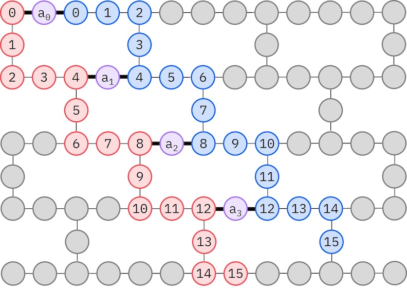

{/* doqumentation-source-hash: 16b72ae6 */}

import TutorialFeedback from '@site/src/components/TutorialFeedback';

<OpenInLabBanner notebookPath="qiskit-addons/sqd/01_chemistry_hamiltonian.ipynb" />


In questo tutorial implementiamo un [pattern Qiskit](https://quantum.cloud.ibm.com/docs/guides/intro-to-patterns) che mostra come post-elaborare campioni quantistici rumorosi per trovare un'approssimazione allo stato fondamentale di un Hamiltoniano chimico: la molecola $N_2$ all'equilibrio nel set di basi 6-31G. Seguiremo un [approccio di diagonalizzazione quantistica basata su campioni](https://arxiv.org/abs/2405.05068) per elaborare campioni prelevati da un ansatz di circuito quantistico a ``36`` qubit (in questo caso, un circuito LUCJ). Per tenere conto dell'effetto del rumore quantistico, viene utilizzata la tecnica di recupero della configurazione.

Il pattern può essere descritto in quattro passaggi:

1. **Passaggio 1: Mappatura al problema quantistico**
    - Generare un ansatz per stimare lo stato fondamentale
2. **Passaggio 2: Ottimizzare il problema**
    - Transpilare l'ansatz per il backend
3. **Passaggio 3: Eseguire gli esperimenti**
    - Estrarre campioni dall'ansatz usando la primitiva ``Sampler``
4. **Passaggio 4: Post-elaborare i risultati**
   - Ciclo di recupero della configurazione auto-consistente
       - Post-elaborare l'insieme completo di campioni di bitstring, usando la conoscenza a priori del numero di particelle e l'occupazione orbitale media calcolata all'iterazione più recente.
       - Creare probabilisticamente batch di sottocampioni da bitstring recuperate.
       - Proiettare e diagonalizzare l'Hamiltoniano molecolare su ciascun sottospazio campionato.
       - Salvare l'energia dello stato fondamentale minima trovata in tutti i batch e aggiornare l'occupazione orbitale media.

Per questo esempio, l'Hamiltoniano degli elettroni interagenti assume la forma generica:

$$
\hat{H} = \sum_{ \substack{pr\\\sigma} } h_{pr} \, \hat{a}^\dagger_{p\sigma} \hat{a}_{r\sigma}
+ 
\sum_{ \substack{prqs\\\sigma\tau} }
\frac{(pr|qs)}{2} \, 
\hat{a}^\dagger_{p\sigma}
\hat{a}^\dagger_{q\tau}
\hat{a}_{s\tau}
\hat{a}_{r\sigma}
$$

$\hat{a}^\dagger_{p\sigma}$/$\hat{a}_{p\sigma}$ sono gli operatori fermionic di creazione/annichilazione associati al $p$-esimo elemento del set di basi e allo spin $\sigma$. $h_{pr}$ e $(pr|qs)$ sono gli integrali elettronici a uno e due corpi.

Il flusso di lavoro SQD con recupero della configurazione auto-consistente è illustrato nel seguente diagramma.


È noto che SQD funziona bene quando l'autostato target è sparso: la funzione d'onda è supportata in un insieme di stati di base $\mathcal{S} = \{|x\rangle \}$ la cui dimensione non cresce esponenzialmente con la dimensione del problema. In questo scenario, la diagonalizzazione dell'Hamiltoniano proiettato nel sottospazio definito da $\mathcal{S}$:
$$
H_\mathcal{S} = P_\mathcal{S} H  P_\mathcal{S} \textrm{ with } P_\mathcal{S} = \sum_{x \in \mathcal{S}} |x \rangle \langle x |;
$$
produce una buona approssimazione all'autostato target. Il ruolo del dispositivo quantistico è quello di produrre campioni dei membri di $\mathcal{S}$ soltanto. Prima, un circuito quantistico prepara lo stato $|\Psi\rangle$ nel dispositivo quantistico. Viene usata la codifica Jordan-Wigner. Di conseguenza, i membri della base computazionale rappresentano stati di Fock (configurazioni/determinanti elettronici). Il circuito viene campionato nella base computazionale, producendo l'insieme di configurazioni rumorose $\tilde{\mathcal{X}}$. Le configurazioni sono rappresentate da bitstring. L'insieme $\tilde{\mathcal{X}}$ viene poi passato al blocco di post-elaborazione classica, dove viene utilizzata la [tecnica di recupero della configurazione auto-consistente](https://arxiv.org/abs/2405.05068). Nel framework SQD, il ruolo del dispositivo quantistico è quello di produrre una distribuzione di probabilità.
### Passaggio 1: Mappare il problema su un circuito quantistico {#step-1-map-problem-to-a-quantum-circuit}

In questo tutorial, approssimeremo l'energia dello stato fondamentale di una molecola $N_2$. Prima, specificheremo la molecola e le sue proprietà. Poi, creeremo un ansatz [local unitary cluster Jastrow (LUCJ)](https://pubs.rsc.org/en/content/articlelanding/2023/sc/d3sc02516k) (circuito quantistico) per generare campioni da un computer quantistico per la stima dell'energia dello stato fondamentale.

Prima, specificheremo la molecola e le sue proprietà.

```python
# Added by doQumentation — required packages for this notebook
!pip install -q ffsim matplotlib numpy pyscf qiskit qiskit-addon-sqd qiskit-ibm-runtime
```

```python
import warnings

warnings.filterwarnings("ignore")

import pyscf
import pyscf.cc
import pyscf.mcscf

# Specify molecule properties
open_shell = False
spin_sq = 0

# Build N2 molecule
mol = pyscf.gto.Mole()
mol.build(
    atom=[["N", (0, 0, 0)], ["N", (1.0, 0, 0)]],
    basis="6-31g",
    symmetry="Dooh",
)

# Define active space
n_frozen = 2
active_space = range(n_frozen, mol.nao_nr())

# Get molecular integrals
scf = pyscf.scf.RHF(mol).run()
num_orbitals = len(active_space)
n_electrons = int(sum(scf.mo_occ[active_space]))
num_elec_a = (n_electrons + mol.spin) // 2
num_elec_b = (n_electrons - mol.spin) // 2
cas = pyscf.mcscf.CASCI(scf, num_orbitals, (num_elec_a, num_elec_b))
mo = cas.sort_mo(active_space, base=0)
hcore, nuclear_repulsion_energy = cas.get_h1cas(mo)
eri = pyscf.ao2mo.restore(1, cas.get_h2cas(mo), num_orbitals)

# Compute exact energy
exact_energy = cas.run().e_tot
```

```text
converged SCF energy = -108.835236570775
CASCI E = -109.046671778080  E(CI) = -32.8155692383188  S^2 = 0.0000000
```

Successivamente, creeremo l'ansatz. L'ansatz ``LUCJ`` è un circuito quantistico parametrizzato, e lo inizializzeremo con le ampiezze `t2` e `t1` ottenute da un calcolo CCSD.

```python
# Get CCSD t2 amplitudes for initializing the ansatz
ccsd = pyscf.cc.CCSD(scf, frozen=[i for i in range(mol.nao_nr()) if i not in active_space]).run()
t1 = ccsd.t1
t2 = ccsd.t2
```

```text
E(CCSD) = -109.0398256929734  E_corr = -0.2045891221988311
```

Utilizzeremo il pacchetto [ffsim](https://github.com/qiskit-community/ffsim/tree/main) per creare e inizializzare l'ansatz con le ampiezze `t2` e `t1` calcolate sopra. Poiché la nostra molecola ha uno stato Hartree-Fock a shell chiusa, useremo la variante spin-bilanciata dell'ansatz UCJ, [UCJOpSpinBalanced](https://qiskit-community.github.io/ffsim/api/ffsim.html#ffsim.UCJOpSpinBalanced).

Poiché il nostro hardware IBM target ha una topologia heavy-hex, adotteremo il [pattern _zig-zag_ per le interazioni tra qubit](https://pubs.rsc.org/en/content/articlehtml/2023/sc/d3sc02516k). In questo pattern, gli orbitali (rappresentati da qubit) con lo stesso spin sono connessi con una topologia a linea (cerchi rossi e blu) dove ogni linea assume una forma zig-zag a causa della connettività heavy-hex dell'hardware target. Ancora, a causa della topologia heavy-hex, gli orbitali con spin diversi hanno connessioni ogni 4° orbitale (0, 4, 8, ecc.) (cerchi viola).



```python
import ffsim
from qiskit import QuantumCircuit, QuantumRegister

n_reps = 1
alpha_alpha_indices = [(p, p + 1) for p in range(num_orbitals - 1)]
alpha_beta_indices = [(p, p) for p in range(0, num_orbitals, 4)]

ucj_op = ffsim.UCJOpSpinBalanced.from_t_amplitudes(
    t2=t2,
    t1=t1,
    n_reps=n_reps,
    interaction_pairs=(alpha_alpha_indices, alpha_beta_indices),
)

nelec = (num_elec_a, num_elec_b)

# create an empty quantum circuit
qubits = QuantumRegister(2 * num_orbitals, name="q")
circuit = QuantumCircuit(qubits)

# prepare Hartree-Fock state as the reference state and append it to the quantum circuit
circuit.append(ffsim.qiskit.PrepareHartreeFockJW(num_orbitals, nelec), qubits)

# apply the UCJ operator to the reference state
circuit.append(ffsim.qiskit.UCJOpSpinBalancedJW(ucj_op), qubits)
circuit.measure_all()
```

### Passaggio 2: Ottimizzare il problema {#step-2-optimize-the-problem}
Successivamente, ottimizzeremo il nostro circuito per un hardware target. Dobbiamo scegliere il dispositivo hardware da usare prima di ottimizzare il nostro circuito. Useremo un backend fake a 127 qubit di ``qiskit_ibm_runtime`` per emulare un dispositivo reale. Per eseguire su una vera QPU, basta sostituire il backend fake con un backend reale. Consulta la [documentazione di Qiskit IBM Runtime](https://quantum.cloud.ibm.com/docs/guides/get-started-with-primitives#get-started-with-sampler) per maggiori informazioni.

```python
from qiskit_ibm_runtime.fake_provider import FakeSherbrooke

backend = FakeSherbrooke()
```

Successivamente, raccomandiamo i seguenti passaggi per ottimizzare l'ansatz e renderlo compatibile con l'hardware.

- Selezionare i qubit fisici (`initial_layout`) dall'hardware target che aderisce al pattern zig-zag descritto sopra. Disporre i qubit in questo pattern porta a un circuito efficiente compatibile con l'hardware con meno gate.
- Generare un pass manager a stadi usando la funzione [generate_preset_pass_manager](https://quantum.cloud.ibm.com/docs/api/qiskit/transpiler_preset#generate_preset_pass_manager) di Qiskit con la tua scelta di `backend` e `initial_layout`.
- Impostare lo stadio `pre_init` del tuo pass manager a stadi su `ffsim.qiskit.PRE_INIT`. `ffsim.qiskit.PRE_INIT` include i pass del Transpiler Qiskit che decompongono le gate in rotazioni orbitali e poi uniscono le rotazioni orbitali, risultando in meno gate nel circuito finale.
- Eseguire il pass manager sul tuo circuito. 

```python
from qiskit.transpiler.preset_passmanagers import generate_preset_pass_manager

spin_a_layout = [0, 14, 18, 19, 20, 33, 39, 40, 41, 53, 60, 61, 62, 72, 81, 82]
spin_b_layout = [2, 3, 4, 15, 22, 23, 24, 34, 43, 44, 45, 54, 64, 65, 66, 73]
initial_layout = spin_a_layout + spin_b_layout

pass_manager = generate_preset_pass_manager(
    optimization_level=3, backend=backend, initial_layout=initial_layout
)

# without PRE_INIT passes
isa_circuit = pass_manager.run(circuit)
print(f"Gate counts (w/o pre-init passes): {isa_circuit.count_ops()}")

# with PRE_INIT passes
# We will use the circuit generated by this pass manager for hardware execution
pass_manager.pre_init = ffsim.qiskit.PRE_INIT
isa_circuit = pass_manager.run(circuit)
print(f"Gate counts (w/ pre-init passes): {isa_circuit.count_ops()}")
```

```text
Gate counts (w/o pre-init passes): OrderedDict({'rz': 4420, 'sx': 3432, 'ecr': 1366, 'x': 239, 'measure': 32, 'barrier': 1})
Gate counts (w/ pre-init passes): OrderedDict({'rz': 2460, 'sx': 2156, 'ecr': 730, 'x': 71, 'measure': 32, 'barrier': 1})
```

### Passaggio 3: Eseguire gli esperimenti {#step-3-execute-experiments}
Dopo aver ottimizzato il circuito per l'esecuzione su hardware, siamo pronti a eseguirlo sull'hardware target e raccogliere campioni per la stima dell'energia dello stato fondamentale. Poiché abbiamo un solo circuito, useremo la [modalità di esecuzione Job](https://quantum.cloud.ibm.com/docs/guides/execution-modes) di Qiskit Runtime ed eseguiremo il nostro circuito.

***Nota: Abbiamo commentato il codice per eseguire il circuito su una QPU e lo abbiamo lasciato come riferimento per l'utente. Invece di eseguire su hardware reale in questa guida, genereremo semplicemente campioni casuali estratti dalla distribuzione uniforme.***

```python
import numpy as np
from qiskit_addon_sqd.counts import generate_bit_array_uniform

# from qiskit_ibm_runtime import SamplerV2 as Sampler

# sampler = Sampler(mode=backend)
# job = sampler.run([isa_circuit], shots=10_000)
# primitive_result = job.result()
# pub_result = primitive_result[0]
# bit_array = pub_result.data.meas

rng = np.random.default_rng(24)
bit_array = generate_bit_array_uniform(10_000, num_orbitals * 2, rand_seed=rng)
```

### Passaggio 4: Post-elaborare i risultati {#step-4-post-process-results}
Ora, eseguiamo l'algoritmo SQD usando la funzione `diagonalize_fermionic_hamiltonian`. Consulta la [documentazione API](../apidocs/qiskit_addon_sqd.fermion.rst#qiskit_addon_sqd.fermion.diagonalize_fermionic_hamiltonian) per le spiegazioni degli argomenti di questa funzione.

Il solver incluso nell'addon SQD usa l'implementazione di PySCF del CI selezionato, nello specifico [pyscf.fci.selected_ci.kernel_fixed_space](https://pyscf.org/pyscf_api_docs/pyscf.fci.html#pyscf.fci.selected_ci.kernel_fixed_space). L'esempio seguente mostra anche come passare argomenti keyword a quella funzione tramite il solver incluso. Qui passiamo l'argomento `max_cycle`.

```python
from functools import partial

from qiskit_addon_sqd.fermion import SCIResult, diagonalize_fermionic_hamiltonian, solve_sci_batch

# SQD options
energy_tol = 1e-3
occupancies_tol = 1e-3
max_iterations = 5

# Eigenstate solver options
num_batches = 1
samples_per_batch = 300
symmetrize_spin = True
carryover_threshold = 1e-4
max_cycle = 200

# Pass options to the built-in eigensolver. If you just want to use the defaults,
# you can omit this step, in which case you would not specify the sci_solver argument
# in the call to diagonalize_fermionic_hamiltonian below.
sci_solver = partial(solve_sci_batch, spin_sq=0.0, max_cycle=max_cycle)

# List to capture intermediate results
result_history = []

def callback(results: list[SCIResult]):
    result_history.append(results)
    iteration = len(result_history)
    print(f"Iteration {iteration}")
    for i, result in enumerate(results):
        print(f"\tSubsample {i}")
        print(f"\t\tEnergy: {result.energy + nuclear_repulsion_energy}")
        print(f"\t\tSubspace dimension: {np.prod(result.sci_state.amplitudes.shape)}")

result = diagonalize_fermionic_hamiltonian(
    hcore,
    eri,
    bit_array,
    samples_per_batch=samples_per_batch,
    norb=num_orbitals,
    nelec=nelec,
    num_batches=num_batches,
    energy_tol=energy_tol,
    occupancies_tol=occupancies_tol,
    max_iterations=max_iterations,
    sci_solver=sci_solver,
    symmetrize_spin=symmetrize_spin,
    carryover_threshold=carryover_threshold,
    callback=callback,
    seed=rng,
)
```

```text
Iteration 1
	Subsample 0
		Energy: -105.45358671756313
		Subspace dimension: 5476
Iteration 2
	Subsample 0
		Energy: -107.95172900082163
		Subspace dimension: 249001
Iteration 3
	Subsample 0
		Energy: -108.97460330369815
		Subspace dimension: 339889
Iteration 4
	Subsample 0
		Energy: -109.02739376648793
		Subspace dimension: 440896
Iteration 5
	Subsample 0
		Energy: -109.030972328451
		Subspace dimension: 597529
```

Ora, tracciamo i risultati.

Il primo grafico mostra che dopo alcune iterazioni stimiamo l'energia dello stato fondamentale entro ``~16 mH`` (la precisione chimica è tipicamente accettata come ``1 kcal/mol`` $\approx$ ``1.6 mH``). Ricorda, i campioni quantistici in questa demo erano puro rumore. Il segnale qui proviene dalla conoscenza *a priori* della struttura elettronica e dell'Hamiltoniano molecolare.

Il secondo grafico mostra l'occupazione media di ciascun orbitale spaziale dopo l'iterazione finale. Possiamo vedere che sia gli elettroni con spin-up che quelli con spin-down occupano i primi cinque orbitali con alta probabilità nelle nostre soluzioni.

```python
import matplotlib.pyplot as plt

# Data for energies plot
x1 = range(len(result_history))
min_e = [
    min(result, key=lambda res: res.energy).energy + nuclear_repulsion_energy
    for result in result_history
]
e_diff = [abs(e - exact_energy) for e in min_e]
yt1 = [1.0, 1e-1, 1e-2, 1e-3, 1e-4]

# Chemical accuracy (+/- 1 milli-Hartree)
chem_accuracy = 0.001

# Data for avg spatial orbital occupancy
y2 = np.sum(result.orbital_occupancies, axis=0)
x2 = range(len(y2))

fig, axs = plt.subplots(1, 2, figsize=(12, 6))

# Plot energies
axs[0].plot(x1, e_diff, label="energy error", marker="o")
axs[0].set_xticks(x1)
axs[0].set_xticklabels(x1)
axs[0].set_yticks(yt1)
axs[0].set_yticklabels(yt1)
axs[0].set_yscale("log")
axs[0].set_ylim(1e-4)
axs[0].axhline(y=chem_accuracy, color="#BF5700", linestyle="--", label="chemical accuracy")
axs[0].set_title("Approximated Ground State Energy Error vs SQD Iterations")
axs[0].set_xlabel("Iteration Index", fontdict={"fontsize": 12})
axs[0].set_ylabel("Energy Error (Ha)", fontdict={"fontsize": 12})
axs[0].legend()

# Plot orbital occupancy
axs[1].bar(x2, y2, width=0.8)
axs[1].set_xticks(x2)
axs[1].set_xticklabels(x2)
axs[1].set_title("Avg Occupancy per Spatial Orbital")
axs[1].set_xlabel("Orbital Index", fontdict={"fontsize": 12})
axs[1].set_ylabel("Avg Occupancy", fontdict={"fontsize": 12})

print(f"Exact energy: {exact_energy:.5f} Ha")
print(f"SQD energy: {min_e[-1]:.5f} Ha")
print(f"Absolute error: {e_diff[-1]:.5f} Ha")
plt.tight_layout()
plt.show()
```

```text
Exact energy: -109.04667 Ha
SQD energy: -109.03097 Ha
Absolute error: 0.01570 Ha
```


<TutorialFeedback />
