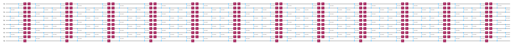

{/* doqumentation-source-hash: 90759f5f */}

import TutorialFeedback from '@site/src/components/TutorialFeedback';

<OpenInLabBanner notebookPath="qiskit-addons/mpf/01_getting_started.ipynb" />


このノートブックでは、**マルチプロダクト公式（MPF）**を使用して、実際に実行する最も深いトロッター回路によって生じるトロッター誤差よりも低い、観測量に対するトロッター誤差を達成する方法を学びます。
**Qiskit パターン**のステップを通じて実践します。

- **ステップ 1: 量子問題へのマッピング**
    - 問題のハミルトニアンを初期化する
    - <font color="#0F62FE">MPF を使用してトロッター化された時間発展回路を生成する</font>
- **ステップ 2: 問題の最適化**
    - ここでは [GenericBackendV2](https://quantum.cloud.ibm.com/docs/api/qiskit/qiskit.providers.fake_provider.GenericBackendV2) 向けに回路をトランスパイルします
- **ステップ 3: 実験の実行**
    - このノートブックでは簡便さのために [StatevectorEstimator](https://quantum.cloud.ibm.com/docs/api/qiskit/qiskit.primitives.StatevectorEstimator) を使用します
- **ステップ 4: 結果の再構成**
    - <font color="#0F62FE">MPF の期待値を計算する</font>
## ステップ 1: 量子問題へのマッピング {#step-1-map-to-quantum-problem}

### 1a: ハミルトニアンの設定 {#1a-setting-up-our-hamiltonian}

10 サイトの直線上のイジングモデルを使用します。

$$
\hat{\mathcal{H}}_{\text{Ising}} = \sum_{i=1}^{9} J_{i,(i+1)} Z_i Z_{(i+1)} + \sum_{i=1}^{10} h_i X_i \, ,
$$

ここで $J$ は 2 つのサイト間の結合強度、$h$ は外部磁場です。
[qiskit_addon_utils](https://qiskit.github.io/qiskit-addon-utils/) パッケージは、さまざまな目的のための再利用可能な機能を提供します。

その [qiskit_addon_utils.problem_generators](https://qiskit.github.io/qiskit-addon-utils/stubs/qiskit_addon_utils.problem_generators.html) モジュールは、指定された接続グラフ上でハイゼンベルク型ハミルトニアンを生成する関数を提供します。
このグラフは [rustworkx.PyGraph](https://www.rustworkx.org/apiref/rustworkx.PyGraph.html) または [CouplingMap](https://quantum.cloud.ibm.com/docs/api/qiskit/qiskit.transpiler.CouplingMap) のいずれかを使用でき、Qiskit 中心のワークフローで簡単に利用できます。

以下では、`CouplingMap.from_line` メソッドを使用して 10 Qubit の単純な直線を作成します。

```python
# Added by doQumentation — required packages for this notebook
!pip install -q numpy qiskit qiskit-addon-mpf qiskit-addon-utils rustworkx scipy
```

```python
from qiskit.transpiler import CouplingMap

# Generate some coupling map to use for this example
coupling_map = CouplingMap.from_line(10, bidirectional=False)
```

```python
from rustworkx.visualization import graphviz_draw

graphviz_draw(coupling_map.graph, method="circo")
```


次に、指定された接続性と所望の定数を持つ [SparsePauliOp](https://quantum.cloud.ibm.com/docs/api/qiskit/qiskit.quantum_info.SparsePauliOp) を生成します。

```python
from qiskit_addon_utils.problem_generators import generate_xyz_hamiltonian

# Get a qubit operator describing the Ising field model
hamiltonian = generate_xyz_hamiltonian(
    coupling_map,
    coupling_constants=(0.0, 0.0, 1.0),
    ext_magnetic_field=(0.4, 0.0, 0.0),
)
print(hamiltonian)
```

```text
SparsePauliOp(['IIIIIIIZZI', 'IIIIIZZIII', 'IIIZZIIIII', 'IZZIIIIIII', 'IIIIIIIIZZ', 'IIIIIIZZII', 'IIIIZZIIII', 'IIZZIIIIII', 'ZZIIIIIIII', 'IIIIIIIIIX', 'IIIIIIIIXI', 'IIIIIIIXII', 'IIIIIIXIII', 'IIIIIXIIII', 'IIIIXIIIII', 'IIIXIIIIII', 'IIXIIIIIII', 'IXIIIIIIII', 'XIIIIIIIII'],
              coeffs=[1. +0.j, 1. +0.j, 1. +0.j, 1. +0.j, 1. +0.j, 1. +0.j, 1. +0.j, 1. +0.j,
 1. +0.j, 0.4+0.j, 0.4+0.j, 0.4+0.j, 0.4+0.j, 0.4+0.j, 0.4+0.j, 0.4+0.j,
 0.4+0.j, 0.4+0.j, 0.4+0.j])
```

測定する観測量は全磁化であり、以下のように単純に構成できます。

```python
from qiskit.quantum_info import SparsePauliOp

L = coupling_map.size()
observable = SparsePauliOp.from_sparse_list([("Z", [i], 1 / L / 2) for i in range(L)], num_qubits=L)
print(observable)
```

```text
SparsePauliOp(['IIIIIIIIIZ', 'IIIIIIIIZI', 'IIIIIIIZII', 'IIIIIIZIII', 'IIIIIZIIII', 'IIIIZIIIII', 'IIIZIIIIII', 'IIZIIIIIII', 'IZIIIIIIII', 'ZIIIIIIIII'],
              coeffs=[0.05+0.j, 0.05+0.j, 0.05+0.j, 0.05+0.j, 0.05+0.j, 0.05+0.j, 0.05+0.j,
 0.05+0.j, 0.05+0.j, 0.05+0.j])
```

### 1b: マルチプロダクット公式 {#1b-multi-product-formulas}

MPF は、複数の回路実行の重み付き組み合わせを通じてハミルトニアンダイナミクスのトロッター誤差を低減します。

より具体的には、MPF を次のように定義します。

$$
\mu(t) = \sum_{j} x_j \rho^{k_j}_{j}\left(\frac{t}{k_j}\right) + \text{some remaining Trotter error} \, ,
$$

ここで $x_j$ は重み係数、$\rho^{k_j}_j$ は $k_j$ 個のトロッターステップを含むプロダクット公式 $S^{k_j}$ で初期状態を発展させることにより得られる純粋状態に対応する密度行列、$j$ は MPF を構成するプロダクット公式の数のインデックスです。

ここで重要な点は、残りのトロッター誤差が最大の $k_j$ 値を単純に使用した場合に得られるトロッター誤差よりも小さいことです。

MPF の有用性は 2 つの視点から見ることができます。

1. 実行可能なトロッターステップの固定バジェットに対して、合計のトロッター誤差がより小さい結果を得ることができます。
2. 深い回路をもたらすトロッターステップ数に対して、MPF を使用して同様のトロッター誤差をもたらす複数の短い深さの回路を見つけて実行できます。
#### 静的 MPF の概要 {#an-introduction-to-static-mpfs}

_静的_ MPF とは、$x_j$ の値が発展時間 $t$ に依存**しない**ものです。

与えられた $k_j$ 値の集合に対して静的 MPF 係数を決定することは、線形方程式系 $Ax=b$ を解くことに帰着します。ここで $x$ は求めたい係数、$A$ は $k_j$ と使用する PF の種類（$S$）に依存する行列、$b$ は制約ベクトルです。
ここでは詳細には触れず、代わりに [LSE](https://qiskit.github.io/qiskit-addon-mpf/apidocs/qiskit_addon_mpf.costs.html#qiskit_addon_mpf.costs.LSE) のドキュメントを参照してください。

$x = A^{-1}b$ として $x$ の解析解を求めることができます。[Carrera Vazquez et al., 2023] や [Zhuk et al., 2023] などを参照してください。
ただし、この厳密解は_「条件が悪い」_場合があり、係数 $x$ の L1 ノルムが非常に大きくなり、MPF の性能が低下する可能性があります。
その代わりに、MPF の挙動を最適化しようとして $x$ の L1 ノルムを最小化する近似解を得ることもできます。

以下では、これらすべての方法を学びます。

[Carrera Vazquez et al., 2023]: https://quantum-journal.org/papers/q-2023-07-25-1067/
[Zhuk et al., 2023]: https://journals.aps.org/prresearch/abstract/10.1103/PhysRevResearch.6.033309
#### $k_j$ の選択 {#choosing-k-j}

$k_j$ の選択はエンドユーザーに委ねられています。
原則としてどの値でも選択できますが、一部の $k_j$ は他の選択よりも実デバイス上のノイズ増幅が大きくなります。
したがって、_「良い」_ $k_j$ の値を見つけるよう努めることが重要です。

ここでは、$k_j$ にいくつかの固定値を選択します。
最小値は目標発展時間 $t=8.0$ によって動機付けられており、通常 $t/k_{\text{min}} \lt 1$ を満たすように指示されますが、経験的には 1 に等しく設定しても通常うまくいくことが分かっています。
これについてや他の $k_j$ 値の選択方法を詳しく知りたい場合は、それぞれのガイド [How to choose the Trotter steps for an MPF](https://qiskit.github.io/qiskit-addon-mpf/how_tos/choose_trotter_steps.html) を参照してください。

```python
time = 8.0
trotter_steps = (8, 12, 19)
```

#### LSE の設定 {#setting-up-the-lse}

$k_j$ を選択したので、上記で説明したように LSE $Ax=b$ を最初に構築する必要があります。
行列 $A$ は $k_j$ だけでなく、プロダクット公式（PF）の選択、特にその _次数_ にも依存します。
さらに、[Carrera Vazquez et al., 2023] に示されているように、PF が対称かどうかを考慮するために `symmetric=True` を設定することもできます。
ただし、[Zhuk et al., 2023] に示されているように、これは必須ではありません。

ここでは、`order=2` を得る 2 次鈴木・トロッター公式を使用し、`symmetric=True` を設定します。

[Carrera Vazquez et al., 2023]: https://quantum-journal.org/papers/q-2023-07-25-1067/
[Zhuk et al., 2023]: https://journals.aps.org/prresearch/abstract/10.1103/PhysRevResearch.6.033309

```python
from qiskit_addon_mpf.static import setup_static_lse

lse = setup_static_lse(trotter_steps, order=2, symmetric=True)
print(lse)
```

```text
LSE(A=array([[1.00000000e+00, 1.00000000e+00, 1.00000000e+00],
       [1.56250000e-02, 6.94444444e-03, 2.77008310e-03],
       [2.44140625e-04, 4.82253086e-05, 7.67336039e-06]]), b=array([1., 0., 0.]))
```

#### 解析的な $x$ の求解 {#solving-for-x-analytically}

前述のとおり、$x$ を解析的に求めることができます。

```python
import numpy as np

coeffs_analytical = lse.solve()
print(coeffs_analytical)
```

```text
[ 0.17239057 -1.19447005  2.02207947]
```

#### 厳密モデルを使用した $x$ の最適化 {#optimizing-for-x-using-an-exact-model}

$x=A^{-1}b$ を計算する代わりに、[setup_exact_problem](https://qiskit.github.io/qiskit-addon-mpf/stubs/qiskit_addon_mpf.costs.setup_exact_problem.html) を使用して、LSE を制約として使用し最適解として $x$ を得る [cvxpy.Problem](https://www.cvxpy.org/api_reference/cvxpy.problems.html#cvxpy.Problem) インスタンスを構築することもできます。

次のセクションで、このインターフェースが存在する理由が明らかになります。

```python
from qiskit_addon_mpf.costs import setup_exact_problem

model_exact, coeffs_exact = setup_exact_problem(lse)
model_exact.solve()
print(coeffs_exact.value)
```

```text
[ 0.17239057 -1.19447005  2.02207947]
```

これらの係数で構築された MPF が良い結果をもたらすかどうかの指標として、L1 ノルムを使用できます（[Carrera Vazquez et al., 2023] も参照）。

[Carrera Vazquez et al., 2023]: https://quantum-journal.org/papers/q-2023-07-25-1067/

```python
print(np.linalg.norm(coeffs_exact.value, ord=1))
```

```text
3.3889400921655914
```

#### 近似モデルを使用した $x$ の最適化 {#optimizing-for-x-using-an-approximate-model}

選択した $k_j$ 値の集合に対する L1 ノルムが高すぎると判断される場合があります。
そのような場合で、かつ別の $k_j$ 値の集合を選択できない場合は、厳密解の代わりに LSE への近似解を使用できます。

そのためには、[setup_sum_of_squares_problem](https://qiskit.github.io/qiskit-addon-mpf/stubs/qiskit_addon_mpf.costs.setup_sum_of_squares_problem.html) を使用して、選択した閾値に L1 ノルムを制約しながら $Ax$ と $b$ の差を最小化する別の [cvxpy.Problem](https://www.cvxpy.org/api_reference/cvxpy.problems.html#cvxpy.Problem) インスタンスを構築します。

```python
from qiskit_addon_mpf.costs import setup_sum_of_squares_problem

model_approx, coeffs_approx = setup_sum_of_squares_problem(lse, max_l1_norm=3.0)
model_approx.solve()
print(coeffs_approx.value)
print(np.linalg.norm(coeffs_approx.value, ord=1))
```

```text
[-0.40454257  0.57553173  0.8290123 ]
1.8090865903790838
```

この最適化問題の解き方について完全な自由があることに注意してください。つまり、最適化ソルバー、その収束閾値などを変更できます。
それぞれのガイド [How to use the approximate model](https://qiskit.github.io/qiskit-addon-mpf/how_tos/using_approximate_model.html) を参照してください。
### 1c: トロッター回路の設定 {#1c-setting-up-the-trotter-circuits}

この時点で展開係数 $x$ が求まり、あとはトロッター化された量子回路を生成するだけです。
再び、[qiskit_addon_utils.problem_generators](https://qiskit.github.io/qiskit-addon-utils/stubs/qiskit_addon_utils.problem_generators.html) モジュールがそのための助けになります。

```python
from qiskit.synthesis import SuzukiTrotter
from qiskit_addon_utils.problem_generators import generate_time_evolution_circuit

circuits = []
for k in trotter_steps:
    circ = generate_time_evolution_circuit(
        hamiltonian,
        synthesis=SuzukiTrotter(order=2, reps=k),
        time=time,
    )
    circuits.append(circ)
```

```python
circuits[0].draw("mpl", fold=-1)
```


```python
circuits[1].draw("mpl", fold=-1)
```



```python
circuits[2].draw("mpl", fold=-1)
```


## ステップ 2: 問題の最適化 {#step-2-optimize-the-problem}

通常、これはパターンの中でハードウェア上での実行のために回路を最適化するステップです。
ここでは、ノイズのないシミュレーターのみを使用するため、[GenericBackendV2](https://quantum.cloud.ibm.com/docs/api/qiskit/qiskit.providers.fake_provider.GenericBackendV2) 向けに回路を単純にトランスパイルします。

```python
from qiskit.providers.fake_provider import GenericBackendV2
from qiskit.transpiler import generate_preset_pass_manager

backend = GenericBackendV2(num_qubits=10)
transpiler = generate_preset_pass_manager(optimization_level=2, backend=backend)

transpiled_circuits = [transpiler.run(circ) for circ in circuits]
```

## ステップ 3: 量子実験の実行 {#step-3-execute-quantum-experiments}

冒頭で説明したように、ノイズのないシミュレーター、すなわち [StatevectorEstimator](https://quantum.cloud.ibm.com/docs/api/qiskit/qiskit.primitives.StatevectorEstimator) を使用して目標観測量の期待値を計算するだけですので、最適化ステップ 2 はスキップします。

```python
from qiskit.primitives import StatevectorEstimator

estimator = StatevectorEstimator()
job = estimator.run([(circ, observable) for circ in transpiled_circuits])
result = job.result()
```

## ステップ 4: 結果の再構成 {#step-4-reconstruct-results}

まず、各トロッター回路で得られた個々の期待値を抽出します。

```python
evs = [res.data.evs for res in result]
print(evs)
```

```text
[array(0.23799162), array(0.35754312), array(0.38649906)]
```

次に、MPF 係数と単純に再結合して MPF の合計期待値を得ます。以下では、$x$ を計算した各方法についてそれぞれ行います。

```python
print("Analytical    solution:", evs @ coeffs_analytical)
print("Exact model   solution:", evs @ coeffs_exact.value)
print("Approx. model solution:", evs @ coeffs_approx.value)
```

```text
Analytical    solution: 0.3954847855980006
Exact model   solution: 0.39548478559800204
Approx. model solution: 0.42991214253489807
```

最後に、この小さな問題については、[scipy.linalg.expm](https://docs.scipy.org/doc/scipy/reference/generated/scipy.linalg.expm.html) を使用して次のように厳密な参照値を計算できます。

```python
from scipy.linalg import expm

exp_H = expm(-1j * time * hamiltonian.to_matrix())

initial_state = np.zeros(exp_H.shape[0])
initial_state[0] = 1.0

time_evolved_state = exp_H @ initial_state

exact_obs = time_evolved_state.conj() @ observable.to_matrix() @ time_evolved_state
print(exact_obs.real)
```

```text
0.40060242487899755
```

MPF が $k_j=19$ の最も深い個別の PF で得られるものと比較してトロッター誤差を低減したことが明確に分かります。
ただし、近似モデルは完璧ではなく、実際には厳密解よりも悪い期待値をもたらしたことも分かります。これは、ガイド [How to use the approximate model](https://qiskit.github.io/qiskit-addon-mpf/how_tos/using_approximate_model.html) で学ぶように、近似モデルに対して厳しい収束基準を使用することの重要性を示しています。

<TutorialFeedback />
