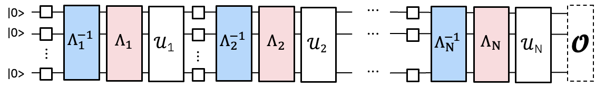
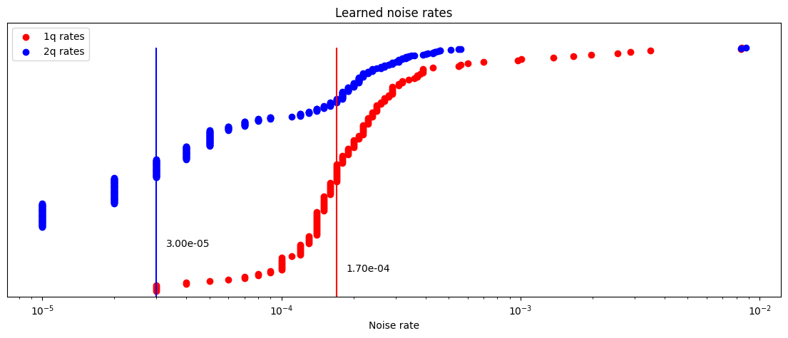

{/* doqumentation-source-hash: 3f45752c */}

import TutorialFeedback from '@site/src/components/TutorialFeedback';

<OpenInLabBanner notebookPath="qiskit-addons/pna/01_generate_noise_mitigating_observable.ipynb" />


このチュートリアルでは、Qiskitエコシステムの最新ツールを活用して、完全にカスタマイズ可能なエラー軽減ワークフローを実装する方法を学びます。PNA技術を紹介し、それを使用してゲートエラーを軽減します。また、TREXを使用して読み出しエラーを軽減し、学習したノイズモデルでは捉えられないエラーを軽減するためにポスト選択を使用します。

**概要**
- ``PNA``の簡単な概要を説明します
- Trotter化された量子Circuit とObservableを作成します。BackendにTranspileし、ポスト選択測定を含めます。
- ``samplomatic``を使用して2Q GateとMeasurementの層をTwirlし、ノイズ学習コストを削減するためにユニークな2Q層を見つけます。
- ``NoiseLearnerV3``を使用して2Q GateとMeasurementに影響するエラーモデルを学習します。
- ``qiskit-addon-pna``を使用してノイズ軽減Observableを生成します。
- ``qiskit-ibm-runtime.Executor``プリミティブを使用して、すべてのTwirlingランダム化および測定基底のすべてのショットを反映した生のQPUサンプルを生成します。
- ``qiskit-addon-utils``を使用してデータを後処理し、軽減された期待値を得ます。
### 伝播ノイズ吸収（PNA）とは何ですか？ {#what-is-propagated-noise-absorption-pna}

***Observableを2Qubit Gateに影響する逆ノイズチャンネルを通じて伝播させることで、ゲートエラーを軽減する技術であり、結果としてノイズ軽減Observableが得られます。***
実行したい実験における2Q Gateは、大きなノイズの影響を受けます。

ノイズモデルを学習すれば、その逆を適用してノイズを除去できます。

PECのようにQPU上でサンプリングすることで逆ノイズチャンネルを実装するのではなく、パウリ伝播を使用して測定Observableにおいてそれを古典的に実装できます。これにより、測定時に学習されたゲートノイズを軽減する効果を持つ、より複雑なObservableが得られます。

### ミラードTrotter Circuitと Observableの生成 {#generate-the-mirrored-trotter-circuit-and-observable}

この実験では、1Dスピン鎖上の30サイトキックドイジングモデルの時間ダイナミクスを研究します。考慮するハミルトニアンは次のとおりです：

$H = -J\sum\limits_{\langle i,j \rangle} Z_iZ_j + h\sum\limits_iX_i$,

ここで $J>0$ は最近接スピン（$i<j$）の結合を表し、全体的な横断場 $h$ は $\frac{\pi}{8}$ に設定されます。$h$ がクリフォード角（すなわち $\theta=n\frac{\pi}{2}, n \in \mathbb{Z}$）から離れるほど、反ノイズ生成子をCircuit全体に伝播させることが難しくなります。

Observableの選択として、平均単一サイト磁化 $\frac{1}{N} \sum_{i=1}^{N} \langle z_i \rangle$ を考慮します。ここで $N$ はサイト数です。

```python
# Added by doQumentation — required packages for this notebook
!pip install -q matplotlib numpy qiskit qiskit-addon-pna qiskit-addon-utils qiskit-ibm-runtime samplomatic
```

```python
import numpy as np
from qiskit import QuantumCircuit
from qiskit.quantum_info import Pauli, SparsePauliOp

num_qubits = 30
num_trotter_steps = 10
rx_angle = np.pi / 8

# Avg single-site magnetization
id_pauli = Pauli("I" * num_qubits)
observable = SparsePauliOp([id_pauli.dot(Pauli("Z"), [i]) for i in range(num_qubits)]) / num_qubits

# Implement Trotterized kicked-Ising model
circuit = QuantumCircuit(num_qubits)
for _step in range(num_trotter_steps):
    circuit.rx(rx_angle, range(num_qubits))
    for first_qubit in (1, 2):
        for idx in range(first_qubit, num_qubits, 2):
            # equivalent to Rzz(-pi/2):
            circuit.sdg([idx - 1, idx])
            circuit.cz(idx - 1, idx)
circuit.compose(circuit.inverse(), inplace=True)
circuit.measure_active()
circuit.draw("mpl", fold=-1)
```


次に、``ibm_kingston``上でエラー率が低いQubitの連鎖を選択し、CircuitをBackendにTranspileします。

```python
from qiskit.transpiler import generate_preset_pass_manager
from qiskit_ibm_runtime import QiskitRuntimeService

backend_name = "ibm_kingston"
service = QiskitRuntimeService()
backend = service.backend(backend_name, use_fractional_gates=True)

# Use a chain of low-noise qubits
layout = [
    44,
    45,
    46,
    47,
    57,
    67,
    68,
    69,
    78,
    89,
    88,
    87,
    97,
    107,
    106,
    105,
    117,
    125,
    126,
    127,
    128,
    129,
    118,
    109,
    110,
    111,
    98,
    91,
    92,
    93,
]

pm = generate_preset_pass_manager(backend=backend, initial_layout=layout, optimization_level=0)
isa_circuit = pm.run(circuit)
isa_observable = observable.apply_layout(isa_circuit.layout)
isa_circuit.draw("mpl", fold=-1)
```

```text
qiskit_runtime_service._discover_account:WARNING:2025-11-10 14:30:57,148: Loading account with the given token. A saved account will not be used.
```


### 2Qubit Gate層とMeasurementのTwirlおよびユニーク層の発見 {#twirl-the-2-qubit-gate-layers-and-measurements-and-find-unique-layers}

ここでは、PassマネージャーがBoxに``Twirl``と``InjectNoise``アノテーションを付与することを確認します。これにより、Circuitに影響するノイズを学習し、そのノイズを対応するCircuit層に関連付けることができます。

- ``enable_gates/enable_measure: True``: すべての2Q Gate層と終端Measurementをボックス化します。単一Qubit GateはBoxの中で左側にドレッシングされます。
- ``measure_annotations: all`` MeasurementボックスにTwirlと`ChangeBasis`アノテーションを含めます。
- ``twirling_strategy: active``: もつれGateを含む各BoxのアクティブなすべてのQubitをTwirlします。
- ``inject_noise_targets: gates``: ``InjectNoise``アノテーションは、もつれGateを含むすべての``Twirl``アノテーション付きBoxに追加される必要があります。
- ``inject_noise_strategy: uniform_modification``: すべてのノイズ層を同等にスケーリングします。

```python
from samplomatic.transpiler import generate_boxing_pass_manager

# Box up circuit with Twirl and InjectNoise annotations
pm = generate_boxing_pass_manager(
    enable_gates=True,
    enable_measures=True,
    measure_annotations="all",
    twirling_strategy="active",
    inject_noise_targets="gates",
    inject_noise_strategy="uniform_modification",
    remove_barriers=True,
)
boxed_circuit = pm.run(isa_circuit)
```

```python
draw_circ = QuantumCircuit(boxed_circuit.num_qubits)
draw_circ.append(boxed_circuit.data[0], qargs=boxed_circuit.data[0].qubits)
draw_circ.append(boxed_circuit.data[1], qargs=boxed_circuit.data[1].qubits)
draw_circ.draw("mpl", fold=-1, scale=0.3, idle_wires=False)
```


### テンプレートCircuitとSamplexの生成、Circuitのサンプリング方法の定義 {#generate-the-template-circuit-and-samplex-define-how-the-circuit-will-be-sampled}

ここでは、``Executor``から出力されたサンプルに対してポスト選択を実行するために必要なスペクテーターおよびポスト選択Measurementも追加します。

```python
import samplomatic
from qiskit.transpiler import PassManager
from qiskit_addon_utils.noise_management.post_selection.transpiler.passes import (
    AddPostSelectionMeasures,
    AddSpectatorMeasures,
)

# Build template circuit and samplex for later use with the "Executor"
template_circuit, samplex = samplomatic.build(boxed_circuit)

# Add post-selection instructions to the template circuit
post_selection_pm = PassManager(
    [
        AddSpectatorMeasures(backend.coupling_map),
        AddPostSelectionMeasures(x_pulse_type="rx"),
    ]
)
template_circuit = post_selection_pm.run(template_circuit)
```

```python
draw_circ = template_circuit.copy_empty_like()
draw_circ.data = template_circuit.data[:324]
draw_circ.draw("mpl", fold=-1, scale=0.3, idle_wires=False)
```


#### ノイズを学習する {#learn-the-noise}

実験を実行する前に、Circuit内のエンタングリングゲートと測定に影響するノイズモデルを学習します。誤りを効果的に軽減するためには、正確なノイズモデルが必要です。実験を実行する直前にノイズを学習することで、ゲートの実行中に実際に影響するノイズをノイズモデルが忠実に記述できる可能性が最も高くなります。

ノイズを学習する前に、Circuit内のユニークな2-Qubitレイヤーを特定する必要があります。これにより、Circuit全体のノイズを学習するために必要なショット数を最小限に抑えることができます。``samplomatic``の``find_unique_box_instructions``を使用して、測定レイヤーを含むボックス化されたCircuitからユニークなレイヤーを取得します。これらが、ノイズ学習器に渡すレイヤーです。

レイヤーがわかったら、ノイズを学習できます。考慮するパラメーターはいくつかあります：

- `num_randomizations`: 学習Circuit構成ごとに使用するランダムCircuitの数
- `shots_per_randomization`: ランダム学習Circuitごとに使用するショットの合計数
- `layer_pair_depths`: 学習実験で使用するCircuit深さ（ペア数で測定）
- `post_selection`: 測定後のパルスを実装するために`rx`ゲートを使用して、学習中にエッジベースのポスト選択を使用します

```python
from qiskit_ibm_runtime.noise_learner_v3.noise_learner_v3 import NoiseLearnerV3
from qiskit_ibm_runtime.options import NoiseLearnerV3Options
from samplomatic.utils import find_unique_box_instructions

# Load noise learner data from a shared job
load_saved_nl_result = True

# Noise learning parameters
num_randomizations_nl = 64
shots_per_randomization_nl = 128
strategy = "edge"
enable_postsel = True
x_pulse_type = "rx"

# Find the unique instructions (layers) from boxed-up circuit
unique_2q_layers_and_meas = find_unique_box_instructions(
    boxed_circuit, normalize_annotations=None, undress_boxes=True
)

noise_learner_params = {
    "num_randomizations": num_randomizations_nl,
    "shots_per_randomization": shots_per_randomization_nl,
    "layer_pair_depths": [1, 2, 4, 8, 12, 16, 24, 32, 40, 48],
    "post_selection": {
        "enable": enable_postsel,
        "strategy": strategy,
        "x_pulse_type": x_pulse_type,
    },
    "experimental": {},
}
# set the options
noise_learner_options = NoiseLearnerV3Options(**noise_learner_params)

# run the noise learner job
noise_learner = NoiseLearnerV3(backend, noise_learner_options)
noise_learner_job = noise_learner.run(unique_2q_layers_and_meas)
noise_learner_result = noise_learner_job.result()

nl_metadata = noise_learner_params | {"layout": layout}
```

```python
import matplotlib.pyplot as plt

hw_rates_1q = []
hw_rates_2q = []
for nlr in noise_learner_result[:2]:
    plm_list = nlr.to_pauli_lindblad_map().to_sparse_list()
    hw_rates_1q += [rate for (pstr, qubits, rate) in plm_list if len(pstr) == 1]
    hw_rates_2q += [rate for (pstr, qubits, rate) in plm_list if len(pstr) == 2]
hw_rates_1q = sorted(hw_rates_1q)
hw_rates_2q = sorted(hw_rates_2q)
median_1q = hw_rates_1q[len(hw_rates_1q) // 2]
median_2q = hw_rates_2q[len(hw_rates_2q) // 2]
fig, ax = plt.subplots(1, 1, figsize=(14, 5))
ax.scatter(
    (hw_rates_1q),
    [(i) / (len(hw_rates_1q) - 1) for i in range(len(hw_rates_1q))],
    color="red",
    label="1q rates",
)
ax.set_xscale("log")
ax.set_ylim(0, 1.1)
ax.vlines(median_1q, 0, 1, color="red")
ax.text(median_1q * 1.1, 0.1, f"{median_1q:.2e}")
ax.scatter(
    (hw_rates_2q),
    [(i) / (len(hw_rates_2q) - 1) for i in range(len(hw_rates_2q))],
    color="blue",
    label="2q rates",
)
ax.set_xscale("log")
ax.set_ylim(0, 1.1)
ax.vlines(median_2q, 0, 1, color="blue")
ax.text(median_2q * 1.1, 0.2, f"{median_2q:.2e}")
ax.set_title("Learned noise rates")
ax.set_xlabel("Noise rate")
ax.set_yticks([])
plt.legend()
```

```text
<matplotlib.legend.Legend at 0x321dd63f0>
```



#### Circuit のボックスを学習済みノイズに関連付ける {#associate-circuit-boxes-with-learned-noise}

ここでは、各ボックスの``InjectNoise``参照IDと、そのボックス内のエンタングリングゲートに影響する学習済みノイズモデル（`PauliLindbladMap`）との間のマッピングを作成します。

```python
from samplomatic.annotations import InjectNoise
from samplomatic.utils import get_annotation

# map inject noise refs to pauli lindblad maps
refs_to_noise_models = {}
for instruction, result in zip(unique_2q_layers_and_meas, noise_learner_result, strict=False):
    if inject_noise_annot := get_annotation(instruction.operation, InjectNoise):
        refs_to_noise_models[inject_noise_annot.ref] = result.to_pauli_lindblad_map()
```

#### 学習済みのアンチノイズを通じてオブザーバブルを伝播させ、ノイズ緩和オブザーバブルを取得する {#propagate-the-observable-through-the-learned-anti-noise-to-get-a-noise-mitigating-observable}

上述のように、これは2つのステップで行われます。まず、アンチノイズ生成器をCircuitの末端まで伝播させます。その後、その発展した生成器を通じてオブザーバブルを伝播させます。このプロセスは、Circuit内の各アンチノイズ生成器に対して繰り返されます。この実装では、特定のレイヤー内の各生成器がCircuitの末端まで並列に伝播されます。さらに、Pythonのマルチプロセッシングを使用して、アンチノイズの順伝播とオブザーバブルの逆伝播の両方を並列に実行します。これにより、発展した生成器がメモリに蓄積されることを防ぎ、計算リソースの活用を最大化します。

PNAを実行する際は、常にノイジーなCircuitとオブザーバブルを提供する必要があります。ノイジーなCircuitが``InjectNoise``アノテーションを持つボックス化されたCircuitである場合、上記のステップで作成したマッピングを提供する必要があります。``qiskit-aer``の``PauliLindbladError``命令を含む非ボックス化Circuitを渡すこともできます。その場合、``refs_to_noise_models``を提供する必要はありません。主要な入力に加えて、ユーザーが考慮すべきパラメーターは以下の通りです：

- `max_err_terms`: 各アンチノイズ生成器が順伝播される際に保持する項の数。これを大きくすると一般的に精度が向上しますが、この動作が単調に保証されるわけではありません。
- `max_obs_terms`: 発展したアンチノイズを通じて逆伝播される際に、ノイズ緩和オブザーバブル$\tilde{O}$に保持する項の数。値が大きいほど一般的に精度が向上しますが、単調に保証されるわけではありません。
- `num_processes`: プロセスに割り当てるコア数。生成器は順伝播され、オブザーバブルに並列に適用されることを覚えておいてください。
- `search_step`: 逆伝播ステップでは、Pauli基底で2つの演算子を近似的に共役にするための貪欲法が使用されます。この手法は``search_step``を増やすことで高速化できます。詳細については、[pauli-prop ドキュメント](https://qiskit.github.io/pauli-prop/)を参照してください。
- `num_to_measure`: この変数は``generate_noise_mitigating_observable``の入力ではありませんが、$\tilde{O}$から実際に測定したい項の数を制御するために使用します。ここでは、元のオブザーバブルの項である上位30項のみを測定します。これらの項は、測定することで学習済みゲートノイズを緩和する効果が得られるように再スケーリングされています。$\tilde{O}$から30項しか測定しない場合でも、大きく成長させることは依然として有用であることが多く、先頭の項のスケーリング係数の精度が向上するためです。

```python
from qiskit_addon_pna import generate_noise_mitigating_observable

# PNA parameters
num_processes = 8
max_err_terms = 10_000
max_obs_terms = 10_000
num_to_measure = num_qubits

obs_tilde_isa = generate_noise_mitigating_observable(
    boxed_circuit,
    isa_observable,
    refs_to_noise_models,
    max_err_terms=max_err_terms,
    max_obs_terms=max_obs_terms,
    num_processes=num_processes,
    print_progress=True,
    search_step=8,
)
p_2_v = {p: v for v, p in enumerate(layout)}
obs_tilde_virtual = SparsePauliOp.from_sparse_list(
    [
        (pstr, [p_2_v[p] for p in p_qubits], coeff)
        for (pstr, p_qubits, coeff) in obs_tilde_isa.to_sparse_list()
    ],
    num_qubits=num_qubits,
)
obs_tilde_virtual = obs_tilde_virtual[np.argsort(np.abs(obs_tilde_virtual.coeffs))[::-1]][
    :num_to_measure
]
```

```text
Finished! 13560 / 13560 generators propagated.
```

```python
obs_tilde_isa = obs_tilde_isa[np.argsort(np.abs(obs_tilde_isa.coeffs))][::-1]
plt.xscale("log")
plt.yscale("log")
plt.title(r"$\tilde{O}$ coeff magnitudes")
plt.ylabel("Magnitude")
plt.xlabel("Pauli term index")
plt.plot(np.abs(obs_tilde_isa.coeffs), ".")
```

```text
[<matplotlib.lines.Line2D at 0x16b69e840>]
```


#### 測定基底を標準形式に変換する {#transform-the-measurement-bases-to-canonical-form}

次に、測定する観測量（***可換なObservableはQubit単位で同時に測定できます***）内のすべてのPauliタームを完全にカバーできる最小限の基底セットを見つけます。測定するタームは元のObservableのタームのみ、すなわちすべての単一-`Z` Pauliの和であるため、必要な基底は全-`Z` 基底の1つだけです。

Pauli測定基底のセットを見つけることに加えて、これらのPauliタームを ``Executor`` プリミティブが期待する標準形式にマッピングする必要があります。標準的なQubitの順序付けの規則については、[samplomatic docs](https://qiskit.github.io/samplomatic/guides/samplex_io.html#qubit-ordering-convention) を参照してください。

```python
from qiskit_addon_utils.exp_vals.measurement_bases import get_measurement_bases

meas_box = boxed_circuit.data[-1]
canonical_qubits = [
    idx for idx, qubit in enumerate(boxed_circuit.qubits) if qubit in meas_box.qubits
]
c_2_p = {c: p for c, p in enumerate(canonical_qubits)}  # canonical -> physical
p_2_v = {p: v for v, p in enumerate(layout)}  # physical -> virtual
c_2_v = {c: p_2_v[p] for c, p in c_2_p.items()}  # canonical -> virtual
meas_bases, bases_reverser = get_measurement_bases(obs_tilde_virtual)
meas_bases_canonical = [
    np.array([base[c_2_v[c]] for c in range(num_qubits)], dtype=np.uint8) for base in meas_bases
]
```

#### ``QuantumProgram`` でサンプリング方法を指定する {#specify-how-to-sample-in-the-quantumprogram}

``QuantumProgram`` では、実験のサンプリング方法を指定します：

- ``template_circuit``：すべての所望のランダム化（Twirlingのランダム化、パラメータなど）を実装するために必要なすべてのGateを含むCircuit。
- ``samplex``：すべての可能なCircuitのランダム化から実際にサンプリングする確率分布を定義するオブジェクト。
- ``samplex_arguments``：samplexを完全に定義するために必要なバインディング
    - ``basis_changes``：測定するObservableのすべてのPauliタームをカバーする測定基底のセットを指定します。
    - ``noise_scales.ref``：各ノイズレイヤーのスケールを `0.0` に設定して、サンプルに追加のノイズが注入されるのを防ぎます。
    - ``pauli_lindblad_maps``：``noise_scales`` が渡される場合に必要です。これはノイズレイヤーを関連するノイズモデルにマッピングするだけです。
- ``shape``：``samplex_arguments`` によって定義された暗黙的な形状を拡張するための形状タプル。この拡張によって導入される自明でない軸はランダム化を列挙します。

```python
from qiskit_ibm_runtime import QuantumProgram

# Control the # of shots during execution
shots_per_randomization_exec = 64
num_randomizations_exec = 6144

# Zero out the noise to prevent noise from being injected during execution.
# We only added InjectNoise annotations so PNA could associate the noise
# to layers in the circuit
samplex_inputs = {f"noise_scales.{ref}": 0.0 for ref in refs_to_noise_models}
samplex_inputs |= {"pauli_lindblad_maps": refs_to_noise_models}

# Specify the bases to measure
bases_broadcastable = np.expand_dims(np.array(meas_bases_canonical), axis=1)
samplex_inputs |= {"basis_changes": {"basis0": bases_broadcastable}}

# Convert samplex_inputs into a dict to pass to QuantumProgram
samplex_arguments = samplex.inputs().make_broadcastable().bind(**samplex_inputs)

# Instantiate the QuantumProgram with the specified parameters
program = QuantumProgram(shots=shots_per_randomization_exec)
program.append(
    circuit=template_circuit,
    samplex=samplex,
    samplex_arguments=samplex_arguments,
    shape=(num_randomizations_exec),
)
```

#### ``Executor`` プリミティブ・プロトタイプを使ってCircuitをサンプリングする {#sample-the-circuit-using-the-executor-primitive-prototype}

``QuantumProgram`` を定義したので、実験の実行は簡単です。``Executor`` オブジェクトをインスタンス化し、Backendを渡して、プログラムを実行するだけです。

```python
from qiskit_ibm_runtime import Executor

# Execute (sample) the circuit
executor = Executor(backend)
job_exec = executor.run(program)
exec_results = job_exec.result()
```

#### サンプルを後処理してエラー緩和された期待値を計算する {#post-process-the-samples-to-calculate-an-error-mitigated-expectation-value}

エラー緩和された期待値を計算するために、以下の手順を実施します：

- 測定に影響する学習済みノイズに基づいてTREXスケーリング係数を計算する
- 後選択されたサンプルのみを保持するマスクを生成する
- ``qiskit-addon-utils`` の ``executor_expectation_values`` 関数を使って、すべてのデータをエラー緩和された期待値に統合する

```python
from qiskit_addon_utils.exp_vals.expectation_values import executor_expectation_values
from qiskit_addon_utils.noise_management import trex_factors
from qiskit_addon_utils.noise_management.post_selection import PostSelector

# Computing the TREX factors
measurement_noise_map = noise_learner_result[2].to_pauli_lindblad_map()
trex_rescale_factors = trex_factors(measurement_noise_map, bases_reverser)

# Post-select the results
post_selector = PostSelector.from_circuit(
    circuit=template_circuit, coupling_map=backend.coupling_map
)

# Compute the ps mask for filtering results
mask = post_selector.compute_mask(exec_results[0], strategy="edge")

# Compute expvals using post selected results
results = executor_expectation_values(
    exec_results[0]["meas"],
    bases_reverser,
    meas_basis_axis=0,
    avg_axis=1,
    measurement_flips=exec_results[0]["measurement_flips.meas"],
    pauli_signs=exec_results[0].get("pauli_signs", None),
    postselect_mask=mask,
    rescale_factors=trex_rescale_factors,
)
```

```python
bases_reverser_unmit = {Pauli("Z" * num_qubits): [observable]}
args = [
    (bases_reverser_unmit, None, None),
    (bases_reverser, None, None),
    (bases_reverser, None, trex_rescale_factors),
    (bases_reverser, mask, None),
    (bases_reverser, mask, trex_rescale_factors),
]

evs = []
for reverser, postsel_mask, factors in args:
    # Compute expvals using post selected results
    res_ps = executor_expectation_values(
        exec_results[0]["meas"],
        reverser,
        meas_basis_axis=0,
        avg_axis=1,
        measurement_flips=exec_results[0]["measurement_flips.meas"],
        pauli_signs=exec_results[0].get("pauli_signs", None),
        postselect_mask=postsel_mask,
        rescale_factors=factors,
    )
    res_ps = np.array(res_ps)
    evs.append(res_ps[:, 0][0])

experiments = ["PNA", "PNA+TREX", "PNA+PS", "PNA+PS+TREX"]
colors = ["#d9d9d9", "#b0b0b0", "#7f7f7f", "#4c4c4c"]
plt.bar(experiments, evs[1:], color=colors)
plt.axhline(y=1, color="green", linestyle="--", linewidth=2, label="Ideal")
plt.axhline(y=evs[0], color="red", linestyle="--", linewidth=2, label="Unmitigated")
plt.ylabel("Expectation value", fontsize=14)

plt.title(r"30q Mirrored Ising, 10 Trotter steps, $\theta_{rx}=\frac{\pi}{8}$", fontsize=14)
plt.legend(loc="upper left", bbox_to_anchor=(1.05, 1), borderaxespad=0.0)
plt.xticks(rotation=45)
plt.tight_layout()
plt.show()
```


<TutorialFeedback />
