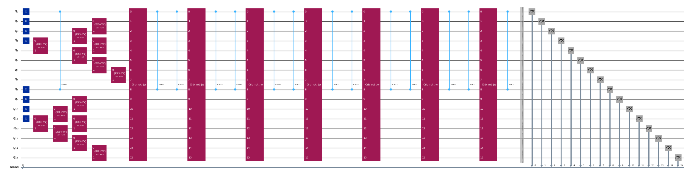

{/* doqumentation-source-hash: 6be25b99 */}

import TutorialFeedback from '@site/src/components/TutorialFeedback';

<OpenInLabBanner notebookPath="qiskit-addons/sqd/02_fermionic_lattice_hamiltonian.ipynb" />


このチュートリアルでは、ノイズのある量子サンプルをポスト処理し、単一不純物アンダーソンモデルと呼ばれるフェルミオン格子ハミルトニアンの基底状態の近似値を求める方法を示す[Qiskitパターン](https://quantum.cloud.ibm.com/docs/guides/intro-to-patterns)を実装します。サンプルベースの量子対角化アプローチに従い、時間間隔を増加させながら``16``-Qubit のクリロフ基底状態のセットから取得したサンプルを処理します。これらの状態は、時間発展のトロッタライゼーションを使用して量子デバイス上で実現されます。量子ノイズの影響を考慮するために、コンフィギュレーション・リカバリー技術を使用します。良好な初期状態と基底状態のスパース性を仮定すると、[このアプローチは効率的に収束することが証明されています](https://arxiv.org/abs/2501.09702)。

このパターンは4つのステップで説明できます：

1. **ステップ1：量子問題へのマッピング**
    - 基底状態の推定のために、時間間隔を増加させたクリロフ基底状態のセット（すなわち、トロッタライズされた時間発展Circuit）を生成する
2. **ステップ2：問題の最適化**
    - Backend向けにCircuitをトランスパイルする
3. **ステップ3：実験の実行**
    - ``Sampler``プリミティブを使用してCircuitからサンプルを取得する
4. **ステップ4：結果のポスト処理**
   - 自己無撞着なコンフィギュレーション・リカバリーのループ
       - 粒子数の事前知識と最近のイテレーションで計算された平均軌道占有率を使用して、ビット列サンプルの完全なセットをポスト処理する
       - リカバーされたビット列から確率的にサブサンプルのバッチを作成する
       - 各サンプリングされた部分空間にわたってフェルミオン格子ハミルトニアンを射影・対角化する
       - 全バッチにわたって見つかった最小基底状態エネルギーを保存し、平均軌道占有率を更新する
### ステップ1：問題を量子Circuitにマッピングする {#step-1-map-problem-to-a-quantum-circuit}
まず、``7``個のバスサイト（``8``個の軌道に``8``個の電子）を持つ1次元の単一不純物アンダーソンモデル（SIAM）を記述する1体および2体ハミルトニアンを作成します。このモデルは、金属に埋め込まれた磁気不純物を記述するために使用されます。

次に、量子クリロフ部分空間を生成するために使用される``16``-QubitトロッターCircuitを作成します。

```python
# Added by doQumentation — required packages for this notebook
!pip install -q ffsim matplotlib numpy qiskit qiskit-addon-sqd qiskit-ibm-runtime scipy
```

```python
import numpy as np

n_bath = 7  # number of bath sites

V = 1  # hybridization amplitude
t = 1  # bath hopping amplitude
U = 10  # Impurity onsite repulsion
eps = -U / 2  # Chemical potential for the impurity

# Place the impurity on the first qubit
impurity_index = 0

# One body matrix elements in the "position" basis
h1e = -t * np.diag(np.ones(n_bath), k=1) - t * np.diag(np.ones(n_bath), k=-1)
h1e[impurity_index, impurity_index + 1] = -V
h1e[impurity_index + 1, impurity_index] = -V
h1e[impurity_index, impurity_index] = eps

# Two body matrix elements in the "position" basis
h2e = np.zeros((n_bath + 1, n_bath + 1, n_bath + 1, n_bath + 1))
h2e[impurity_index, impurity_index, impurity_index, impurity_index] = U
```

次に、トロッタライズされた量子Circuitのセットを使用して量子クリロフ部分空間を生成します。ここでは、初期（参照）状態を生成するためのヘルパーと、ハミルトニアンの1体および2体部分の時間発展のためのヘルパーを作成します。このモデルの詳細な説明とCircuitの設計方法については、[論文](https://arxiv.org/abs/2501.09702)をご参照ください。

```python
import ffsim
import scipy
from qiskit import QuantumCircuit, QuantumRegister
from qiskit.circuit.library import CPhaseGate, XGate, XXPlusYYGate

n_modes = n_bath + 1
nelec = (n_modes // 2, n_modes // 2)

dt = 0.2
Utar = scipy.linalg.expm(-1j * dt * h1e)

# The reference state
def initial_state(q_circuit, norb, nocc):
    """Prepare an initial state."""
    for i in range(nocc):
        q_circuit.append(XGate(), [i])
        q_circuit.append(XGate(), [norb + i])
    rot = XXPlusYYGate(np.pi / 2, -np.pi / 2)

    for i in range(3):
        for j in range(nocc - i - 1, nocc + i, 2):
            q_circuit.append(rot, [j, j + 1])
            q_circuit.append(rot, [norb + j, norb + j + 1])
    q_circuit.append(rot, [j + 1, j + 2])
    q_circuit.append(rot, [norb + j + 1, norb + j + 2])

# The one-body time evolution
free_fermion_evolution = ffsim.qiskit.OrbitalRotationJW(n_modes, Utar)

# The two-body time evolution
def append_diagonal_evolution(dt, U, impurity_qubit, num_orb, q_circuit):
    """Append two-body time evolution to a quantum circuit."""
    if U != 0:
        q_circuit.append(
            CPhaseGate(-dt / 2 * U),
            [impurity_qubit, impurity_qubit + num_orb],
        )
```

量子クリロフ部分空間を指定する``d``個の時間発展状態を生成します。ここでは``d=8``を選択しています。クリロフ基底状態のサンプリングによる誤差は``d``の増加とともに収束します。この問題インスタンスの特性により、`OrbitalRotationJW`を使用した1体発展の効率的なコンパイルが可能ですが、一般的には、QiskitのPauliEvolutionGate（[PauliEvolutionGate](https://quantum.cloud.ibm.com/docs/api/qiskit/qiskit.circuit.library.PauliEvolutionGate)）を使用して完全なハミルトニアンのトロッタライズされた時間発展を実装することもできます。

```python
# Generate the initial state
qubits = QuantumRegister(2 * n_modes, name="q")
init_state = QuantumCircuit(qubits)
initial_state(init_state, n_modes, n_modes // 2)
init_state.draw("mpl", scale=0.4, fold=-1)

d = 8  # Number of Krylov basis states
circuits = []
for i in range(d):
    circ = init_state.copy()
    circuits.append(circ)
    for _ in range(i):
        append_diagonal_evolution(dt, U, impurity_index, n_modes, circ)
        circ.append(free_fermion_evolution, qubits)
        append_diagonal_evolution(dt, U, impurity_index, n_modes, circ)
    circ.measure_all()
```

```python
circuits[0].draw("mpl", scale=0.4, fold=-1)
```


```python
circuits[-1].draw("mpl", scale=0.4, fold=-1)
```



### ステップ2：問題の最適化 {#step-2-optimize-the-problem}
トロッタライズされたCircuitを作成した後、それらをターゲットハードウェア向けに最適化します。最適化の前に使用するハードウェアデバイスを選択する必要があります。実際のデバイスをエミュレートするために``qiskit_ibm_runtime``の127-Qubit偽BackendであるFakeSherbrookeを使用します。実際のQPUで実行するには、偽Backendを実際のBackendに置き換えるだけです。詳細については、[Qiskit IBM Runtimeドキュメント](https://quantum.cloud.ibm.com/docs/guides/get-started-with-primitives#get-started-with-sampler)をご参照ください。

```python
from qiskit_ibm_runtime.fake_provider.backends import FakeSherbrooke

backend = FakeSherbrooke()
```

次に、QiskitでCircuitをターゲットBackendにトランスパイルします。

```python
from qiskit.transpiler import generate_preset_pass_manager

# The circuit needs to be transpiled to the AerSimulator target
pass_manager = generate_preset_pass_manager(optimization_level=3, backend=backend)
isa_circuits = pass_manager.run(circuits)
```

### ステップ3：実験の実行 {#step-3-execute-experiments}
ハードウェア実行のためにCircuitを最適化した後、ターゲットハードウェアで実行し、基底状態エネルギー推定のためのサンプルを収集する準備が整いました。ここでは``qiskit-ibm-runtime``の``SamplerV2``を使用して、``ibm_sherbrooke`` BackendからノイズのあるSamplerをシミュレートします。次に、各クリロフ基底状態のカウントを単一のカウント辞書に結合し、最も一般的にサンプリングされた上位20のビット列をプロットします。

***注：トランスパイルされたCircuitからサンプルをシミュレートするには、[Qiskit Aer](https://qiskit.github.io/qiskit-aer/index.html)が必要です。***

```python
from qiskit.primitives import BitArray
from qiskit.visualization import plot_histogram
from qiskit_ibm_runtime import SamplerV2 as Sampler

# Sample from the circuits
noisy_sampler = Sampler(backend, options={"simulator": {"seed_simulator": 24}})
job = noisy_sampler.run(isa_circuits, shots=500)

# Combine the counts from the individual Trotter circuits
bit_array = BitArray.concatenate_shots([result.data.meas for result in job.result()])

plot_histogram(bit_array.get_counts(), number_to_keep=20)
```


### ステップ4：結果のポスト処理 {#step-4-post-process-the-results}
次に、`diagonalize_fermionic_hamiltonian`関数を使用してSQDアルゴリズムを実行します。この関数の引数の説明については、[APIドキュメント](../apidocs/qiskit_addon_sqd.fermion.rst#qiskit_addon_sqd.fermion.diagonalize_fermionic_hamiltonian)をご参照ください。

```python
from qiskit_addon_sqd.fermion import SCIResult, diagonalize_fermionic_hamiltonian

# List to capture intermediate results
result_history = []

def callback(results: list[SCIResult]):
    result_history.append(results)
    iteration = len(result_history)
    print(f"Iteration {iteration}")
    for i, result in enumerate(results):
        print(f"\tSubsample {i}")
        print(f"\t\tEnergy: {result.energy}")
        print(f"\t\tSubspace dimension: {np.prod(result.sci_state.amplitudes.shape)}")

rng = np.random.default_rng(24)
result = diagonalize_fermionic_hamiltonian(
    h1e,
    h2e,
    bit_array,
    samples_per_batch=300,
    norb=n_modes,
    nelec=nelec,
    num_batches=3,
    max_iterations=10,
    symmetrize_spin=True,
    callback=callback,
    seed=rng,
)
```

```text
Iteration 1
	Subsample 0
		Energy: -13.257128325607997
		Subspace dimension: 3969
	Subsample 1
		Energy: -13.257128325607997
		Subspace dimension: 3969
	Subsample 2
		Energy: -13.257128325607997
		Subspace dimension: 3969
Iteration 2
	Subsample 0
		Energy: -13.319666127542039
		Subspace dimension: 4096
	Subsample 1
		Energy: -13.420534292304595
		Subspace dimension: 4624
	Subsample 2
		Energy: -9.136171594591085
		Subspace dimension: 4624
Iteration 3
	Subsample 0
		Energy: -13.422491814612833
		Subspace dimension: 4900
	Subsample 1
		Energy: -13.422491814612833
		Subspace dimension: 4900
	Subsample 2
		Energy: -13.422491814612833
		Subspace dimension: 4900
Iteration 4
	Subsample 0
		Energy: -13.422491814612833
		Subspace dimension: 4900
	Subsample 1
		Energy: -13.422491814612833
		Subspace dimension: 4900
	Subsample 2
		Energy: -13.422491814612833
		Subspace dimension: 4900
```

次に結果をプロットします。最初のプロットは、数回のイテレーションの後に正確な基底状態エネルギーが得られることを示しています。

この例は、上記の出力ステートメントに示されているように、完全なヒルベルト空間を探索できるほど小さいです。完全なヒルベルト空間の次元は``(num_orbitals choose nelec_a) * (num_orbitals choose nelec_b)``であることを覚えておいてください。したがって、この問題では`(8 choose 4)**2 = 4900`となります。部分空間の次元は、強化されたコンフィギュレーション・リカバリーによって増加し、またSQDアルゴリズムが重要なコンフィギュレーションを1回のイテレーションから次のイテレーションに引き継ぐという事実によっても増加します。最後のイテレーションまでに、完全なヒルベルト空間で対角化を行っています。

2番目のプロットは、全バッチの解にわたる各空間軌道の平均占有率を示しています。高い確率で各軌道に1つの電子が含まれていることがわかります。

```python
import matplotlib.pyplot as plt

exact_energy = -13.422491814605827
min_es = [min(result, key=lambda res: res.energy).energy for result in result_history]
min_id, min_e = min(enumerate(min_es), key=lambda x: x[1])

# Data for energies plot
x1 = range(len(result_history))
yt1 = list(np.arange(-13.5, -13.1, 0.1))
ytl = [f"{i:.1f}" for i in yt1]

# Data for avg spatial orbital occupancy
y2 = np.sum(result.orbital_occupancies, axis=0)
x2 = range(len(y2))

fig, axs = plt.subplots(1, 2, figsize=(12, 6))

# Plot energies
axs[0].plot(x1, min_es, label="SQD energy", marker="o")
axs[0].set_xticks(x1)
axs[0].set_xticklabels(x1)
axs[0].set_yticks(yt1)
axs[0].set_yticklabels(ytl)
axs[0].axhline(y=exact_energy, color="#BF5700", linestyle="--", label="Exact energy")
axs[0].set_title("Approximated Ground State Energy vs SQD Iterations")
axs[0].set_xlabel("Iteration Index", fontdict={"fontsize": 12})
axs[0].set_ylabel("Energy", fontdict={"fontsize": 12})
axs[0].legend()

# Plot orbital occupancy
axs[1].bar(x2, y2, width=0.8)
axs[1].set_xticks(x2)
axs[1].set_xticklabels(x2)
axs[1].set_title("Avg Occupancy per Spatial Orbital")
axs[1].set_xlabel("Orbital Index", fontdict={"fontsize": 12})
axs[1].set_ylabel("Avg Occupancy", fontdict={"fontsize": 12})

print(f"Exact energy: {exact_energy:.5f}")
print(f"SQD energy: {min_e:.5f}")
print(f"Absolute error: {abs(min_e - exact_energy):.5f}")
plt.tight_layout()
plt.show()
```

```text
Exact energy: -13.42249
SQD energy: -13.42249
Absolute error: 0.00000
```


<TutorialFeedback />
