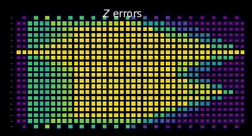

{/* doqumentation-source-hash: d7518943 */}

import TutorialFeedback from '@site/src/components/TutorialFeedback';

<OpenInLabBanner notebookPath="qiskit-addons/slc/01_getting_started.ipynb" />


## 배경 {#background}
이 튜토리얼은 음영 라이트콘(SLC) 애드온을 사용하여 오류를 완화하는 방법을 보여줍니다. 이 애드온은 [확률적 오류 소거(PEC) 기법](https://quantum.cloud.ibm.com/docs/guides/error-mitigation-and-suppression-techniques#probabilistic-error-cancellation-pec)의 발전된 형태로, 사용자가 Circuit의 고유한 레이어에 대한 노이즈를 학습한 다음 단일 큐비트 Gate와 후처리 기법을 적용하여 노이즈를 소거합니다. 다른 방법과 비교할 때 PEC는 완화된 결과의 편향에 대해 더 강력한 경계를 제공하지만, QPU 시간 측면에서 더 높은 오버헤드를 갖는 경향이 있습니다. PEC에서는 노이즈에 의한 기댓값 감쇠를 보상하기 위해 평균 결과를 $\gamma = \exp(\sum_{l,\sigma} 2\lambda_{l,\sigma})$ 인수로 재조정합니다. 여기서 $\lambda_{l,\sigma}$는 Circuit의 레이어 $l$에서 오류 Pauli $\sigma$의 학습된 노이즈 율입니다. 이 재조정은 분산을 $\gamma^2$배 증가시키며, 따라서 QPU에서 필요한 Circuit 실행 횟수도 $\gamma^2$배 곱해집니다. 이를 샘플링 비용 또는 샘플링 오버헤드라고 합니다. $\gamma$는 지수적으로 증가하기 때문에 PEC는 얕거나 소수의 Qubit으로 구성된 Circuit에 제한되는 경우가 많습니다. PEC에 대한 자세한 내용은 [Probabilistic error cancellation with sparse Pauli-Lindblad models on noisy quantum processors](https://arxiv.org/abs/2201.09866)를 참조하세요.

완화할 필요가 없는 오류를 식별할 수 있다면, 이 샘플링 비용을 지수적으로 줄일 수 있습니다. 이 방향의 첫 번째 단계는 로컬 인식 오류 완화를 구현하는 것입니다. 이는 빠르게 계산 가능한 기존 "라이트콘"을 사용하여 Circuit 전체에 걸친 관측 가능량의 오류 민감도를 경계짓는 방식으로 PEC 오버헤드를 줄여, 일부 문제에서 PEC의 적용 가능 규모를 확장합니다. 이 라이트콘 밖에 있는 오류는 측정 결과에 영향을 미칠 수 없으므로 오류 소거 절차에서 제외할 수 있습니다. 이 제외는 추가적인 편향을 도입하지 않으면서 경우에 따라 상당한 수준으로 샘플링 오버헤드를 줄입니다. 특히, 고정 깊이 Circuit에서 로컬 관측 가능량 $O$를 측정할 때, 필요한 샘플링 오버헤드는 Circuit의 Qubit 수를 늘려도 결국 평탄해집니다([Locality and Error Mitigation of Quantum Circuits](https://arxiv.org/abs/2303.06496)의 Fig. 2b 참조).

음영 라이트콘(SLC)은 한 단계 더 나아가 고전 시뮬레이션을 사용하여 Circuit 전체에 걸친 오류 민감도를 더 엄밀하게 경계짓습니다. 이는 일부 QPU 시간을 CPU 시간으로 대체하고, 편향을 재정규화하는 데 필요한 샘플링 오버헤드를 줄입니다. 경계가 명확히 잘리는 것이 아니라 Circuit 내의 각 잠재적 오류에 대해 관측 가능량의 해당 오류에 대한 민감도의 상한을 나타내는 단계적 "음영"이 부여됩니다. 이 정밀한 특성 분석은 감소된 분산으로 더 효율적이고 표적화된 PEC 적용을 가능하게 하는 동시에 사용자가 관측 가능량 추정의 편향을 제어 가능하게 조정할 수 있도록 합니다. 자세한 내용은 [Lightcone shading for classically accelerated quantum error mitigation](https://arxiv.org/abs/2409.04401)을 참조하세요.

SLC 애드온을 위한 워크플로우는 새로운 Samplomatic 및 Executor 프레임워크를 활용하여, 고급 사용자에게는 사용 편의성을 유지하면서 오류 억제 및 완화를 위한 실행 설정에 대한 모듈식 제어를 제공합니다. 이 프레임워크의 이점과 일반적인 기능에 대한 더 깊은 이해를 위해 [Hello samplomatic](https://github.com/qiskit-community/qdc-challenges-2025/blob/main/day3_tutorials/Track_A/hello_samplomatic/Samplomatic%20-%20Hello%20World.ipynb) 튜토리얼을 참조하세요.

### 라이트콘 음영, 노이즈 학습, 반노이즈 주입 워크플로우 {#workflow-for-lightcone-shading-noise-learning-and-anti-noise-injection}
QPU의 노이즈를 모델링하기 위해, 장치의 각 Qubit 및 엣지에서 로컬로 생성된 1- 및 2-Qubit Pauli 오류율을 갖는 희소 Pauli-Lindblad 노이즈 모델을 사용하기로 했습니다. 이 선택을 통해 이 튜토리얼에서 제시하는 SLC 오류 완화 워크플로우는 다음과 같습니다:

a. CPU — 1- 및 2-Qubit Pauli 오류의 오류당 영향 경계 산정

  1. 순방향 전파(관측 가능량에 대한 영향 경계). 각 오류를 Circuit의 끝까지 전파하고 관측 가능량과의 교환자를 계산합니다.  
      - 계산을 추적 가능하게 유지하기 위해 진화 중 연산자 항을 잘라냅니다.  
      - 양자 속도 한계에 기반한 느슨한 역방향 전파로 이 경계를 더욱 조입니다.
  2. 역방향 전파(초기 상태에 대한 영향 경계). 각 오류를 Circuit의 시작 부분까지 전파하고 초기 상태와의 교환자를 계산합니다.

b. QPU — 노이즈 율 학습. `NoiseLearner`를 사용하여 Pauli-Lindblad 노이즈 모델의 율을 추정합니다.

c. CPU — 완화 우선순위 지정

  1. 학습된 노이즈 율로 병합 경계 업데이트. 이전에 계산된 순방향 및 역방향 경계를 결합하고 학습된 노이즈 율로 업데이트합니다.  
  2. 계산된 경계와 학습된 율을 사용하여 완화할 노이즈 구성 요소의 순위를 지정합니다. 편향에 대한 추정 영향과 수정에 드는 비용을 기반으로 각 가능한 노이즈 오류의 우선순위를 정합니다. 

d. QPU — 반노이즈 삽입 및 실행. `Box` 어노테이션을 사용하여 지정된 반노이즈(역 노이즈)로 관심 Circuit을 실행합니다.

e. CPU — 관측 가능량 추정. 비-Markovian 노이즈 영향을 줄이기 위해 측정 기반 후선택을 적용하여 기댓값을 계산합니다.

### 노이즈 학습 개요 {#noise-learning-overview}
노이즈 학습은 여러 오류 완화 방법에서 공통적인 단계로, [NoiseLearner](https://quantum.cloud.ibm.com/docs/en/guides/noise-learning)에 의해 수행되며, [PEA 오류 완화](https://quantum.cloud.ibm.com/docs/tutorials/probabilistic-error-amplification) 튜토리얼과 [전파된 노이즈 흡수(PNA) 튜토리얼](https://github.com/qiskit-community/qdc-challenges-2025/blob/main/day3_tutorials/Track_A/pna/propagated_noise_absorption.ipynb)에서도 확인할 수 있습니다. `NoiseLearnerV3`에서 사용자는 학습할 노이즈 레이어를 [`CircuitInstruction`](https://quantum.cloud.ibm.com/docs/api/qiskit/qiskit.circuit.CircuitInstruction) 객체로 명시적으로 식별할 수 있어, 위에서 설명한 방식으로 각 레이어에 대한 원하는 SLC 노이즈 경계를 계산할 수 있습니다. 학습된 Pauli-Lindblad 모델은 PEC-SLC 우선순위 지정에 사용될 계수를 제공합니다. Gate가 레이어로 수집되는 방식은 `generate_boxing_pass_manager`와 `unique_2q_instructions` 편의 함수를 사용하여 결정한 다음, 아래 2단계에 설명된 대로 SLC 유틸리티 함수 `generate_noise_model_paulis`에 공급할 수 있습니다.

| **파트 1** | **파트 2** | **파트 3** |
|-----------|-----------|-----------|
| 2-Qubit Gate 레이어 Pauli 트월링 | 레이어의 항등 쌍을 반복하고 노이즈 학습 | 충실도 도출(각 노이즈 채널의 오류) |
|  |  |  |

### 후처리 개요 {#post-processing-overview}
Samplomatic 및 Executor 프레임워크를 사용하여 양자 하드웨어에서 실행한 후, 비트스트링 측정값을 원하는 관측 가능량 값으로 변환합니다. 미러링된 Ising Circuit의 경우, 모든 Qubit이 이상적으로 시작점인 $\ket{0}$으로 돌아와야 하므로 측정된 관측 가능량은 이상적으로 1이 되어야 합니다. `expectation_values` 함수로 관측 가능량 값을 계산할 때, 노이즈 영향을 줄이는 몇 가지 후처리 기법을 적용합니다. 여기에는 비-Markovian 노이즈의 영향을 받은 샷 제거, 판독 오류 완화, 그리고 PEC 구현의 세부 사항 고려가 포함됩니다. 세부 사항은 아래 4단계에서 논의됩니다.
## 요구 사항 {#requirements}
이 튜토리얼을 시작하기 전에 다음 패키지가 설치되어 있는지 확인하십시오:

- Executor 프리미티브가 포함된 Qiskit IBM Runtime (`pip install "qiskit-ibm-runtime @ git+https://github.com/Qiskit/qiskit-ibm-runtime.git"`)
- Qiskit addon Shaded lightcone 0.1 (`pip install "qiskit-addon-slc~=0.1.0`")
- Qiskit addon utils (`pip install "qiskit-addon-utils~=0.3.0"`)
- Samplomatic v0.16 이상 (`pip install samplomatic`)
- Qiskit 시각화 지원 (`pip install "qiskit[visualization]"`)
## Step 0. 설정 {#step-0-setup}
먼저 이 노트북을 성공적으로 실행하는 데 필요한 패키지와 함수를 가져옵니다.

```python
# Added by doQumentation — required packages for this notebook
!pip install -q matplotlib numpy qiskit qiskit-addon-slc qiskit-addon-utils qiskit-ibm-runtime samplomatic
```

```python
import logging

logging.basicConfig(level=logging.INFO, format="%(asctime)s %(levelname)s %(module)s %(message)s")

# Setting this value prevents itertools.starmap deadlock on UNIX systems
from multiprocessing import set_start_method

set_start_method("spawn")

# Needed to prevent PySCF from parallelizing internally (SLC only)
%set_env OMP_NUM_THREADS=1
```

```text
env: OMP_NUM_THREADS=1
```

```python
import pickle

import numpy as np
import samplomatic
from matplotlib import pyplot as plt
from qiskit import QuantumCircuit
from qiskit.quantum_info import SparsePauliOp
from qiskit.transpiler import PassManager, generate_preset_pass_manager
from qiskit_addon_slc.bounds import (
    compute_backward_bounds,
    compute_forward_bounds,
    compute_local_scales,
    merge_bounds,
    tighten_with_speed_limit,
)
from qiskit_addon_slc.utils import generate_noise_model_paulis, map_modifier_ref_to_ref
from qiskit_addon_slc.visualization import draw_shaded_lightcone
from qiskit_addon_utils.exp_vals.expectation_values import executor_expectation_values
from qiskit_addon_utils.exp_vals.measurement_bases import get_measurement_bases
from qiskit_addon_utils.noise_management import gamma_from_noisy_boxes, trex_factors
from qiskit_addon_utils.noise_management.post_selection import PostSelector
from qiskit_addon_utils.noise_management.post_selection.transpiler.passes import (
    AddPostSelectionMeasures,
    AddSpectatorMeasures,
)
from qiskit_ibm_runtime import Executor, QiskitRuntimeService, QuantumProgram
from qiskit_ibm_runtime.noise_learner_v3 import NoiseLearnerV3
from qiskit_ibm_runtime.options import NoiseLearnerV3Options
from samplomatic.transpiler import generate_boxing_pass_manager
from samplomatic.utils import find_unique_box_instructions
```
## Step 1. Map the problem
데모의 편의를 위해 1D 미러 이징 체인(mirror Ising chain)을 선택합니다. 1D 이징 체인은 회로 구조가 조밀하여 PEC 구현을 보여주기에 적합합니다. 미러 회로는 예상 결과를 쉽게 알 수 있게 해줍니다(즉, 관측값으로 1을 측정해야 합니다).

또한 미러 회로를 실행하고자 하므로, 회로 후반부의 모든 Gate에 대해 전반부에 역 Gate가 있어야 합니다. 측정 관측값 **$<X_6 Z_{13}>$**에는 비Z 기저 측정이 포함되어 있으며, Executor가 회로 끝에서 원하는 기저를 처리하므로, 미러 회로의 시작 부분에 적절한 Gate를 삽입하는 `prepare_basis` 함수를 제공합니다. 이 세부 사항은 미러 회로 데모에 특화된 것입니다. `get_measurement_bases` 함수를 사용하면 어떤 Gate가 필요하고 어디에 추가해야 하는지 쉽게 파악할 수 있으며, "Prepare canonical bases measurements" 섹션에서 설명하는 `box` 어노테이션의 관례에서 발생하는 Qubit 인덱스의 미묘한 차이도 추적할 수 있습니다.

```python
num_qubits = 20
target_obs_sparse = [("XZ", [6, 13], 1.0)]
```

```python
observable = SparsePauliOp.from_sparse_list(target_obs_sparse, num_qubits=num_qubits)
```

```python
bases_virt, reverser_virt = get_measurement_bases(observable)
```

```python
num_trotter_steps = 10
rx_angle = np.pi / 4
```

```python
def construct_ising_circuit(
    num_qubits: int, num_trotter_steps: int, rx_angle: float, barrier: bool = True
) -> QuantumCircuit:
    circuit = QuantumCircuit(num_qubits)

    for _step in range(num_trotter_steps):
        circuit.rx(rx_angle, range(num_qubits))
        if barrier:
            circuit.barrier()
        for first_qubit in (1, 2):
            for idx in range(first_qubit, num_qubits, 2):
                # equivalent to Rzz(-pi/2):
                circuit.sdg([idx - 1, idx])
                circuit.cz(idx - 1, idx)
        if barrier:
            circuit.barrier()

    return circuit

def prepare_basis(circuit: QuantumCircuit, basis: list[int]) -> QuantumCircuit:
    # basis is a list of integer values from 0 to 3. These map to the basis measurement as:
    # 0 = I; 1 = Z; 2 = X; 3 = Y
    assert len(basis) == circuit.num_qubits

    out_circ = circuit.copy_empty_like()
    for qb, bas in enumerate(basis):
        if bas in {0, 1}:
            continue
        if bas == 2:
            out_circ.h(qb)
        elif bas == 3:
            out_circ.rx(-np.pi / 2, qb)

    out_circ.barrier()
    out_circ.compose(circuit, inplace=True)
    return out_circ

def mirror_circuit(circuit: QuantumCircuit, *, inverse_first: bool = False) -> QuantumCircuit:
    mirror_circ = circuit.copy_empty_like()
    mirror_circ.compose(circuit.inverse() if inverse_first else circuit, inplace=True)
    mirror_circ.barrier()
    mirror_circ.compose(circuit if inverse_first else circuit.inverse(), inplace=True)
    mirror_circ.measure_active()
    return mirror_circ
```

```python
# Instantiate circuit
circuit = construct_ising_circuit(num_qubits, num_trotter_steps, rx_angle, barrier=False)
mirrored_circuit = mirror_circuit(circuit, inverse_first=True)
mirrored_circuit = prepare_basis(mirrored_circuit, bases_virt[0])
```

```python
mirrored_circuit.draw("mpl", fold=-1, scale=0.3, idle_wires=False, measure_arrows=False)
```


## 2단계. 최적화 {#step-2-optimize}
실행할 Circuit, 측정할 Observable, 노이즈 학습 파라미터와 관련된 세부 사항을 최적화합니다. 시작점으로, 분수 게이트(fractional gates) 옵션이 활성화된 Backend를 인스턴스화합니다. 이 분수 게이트는 일부 사후 선택(post-selection) 필터링에서 더 높은 감도를 제공합니다.

```python
token = "<YOUR_TOKEN>"
instance = "<YOUR_INSTANCE>"

# This is used to retrieve shared results
shared_service = QiskitRuntimeService(
    channel="ibm_quantum_platform",
    token=token,
    instance=instance,
)

# This is used to run on real hardware
service = service = QiskitRuntimeService()
```

```text
qiskit_runtime_service._discover_account:WARNING:2025-11-10 11:19:40,108: Loading account with the given token. A saved account will not be used.
```

```python
backend = service.backend("ibm_kingston", use_fractional_gates=True)
```

먼저, [QPU에서 실행하는 데 필요한](https://www.ibm.com/quantum/blog/isa-circuits) ISA 명령어로 Circuit을 Transpile합니다. 이 실험에서 수집된 데이터의 경우, 가장 품질이 높은 체인을 평가하여 Qubit을 수동으로 선택합니다.

```python
layout = [44, 45, 46, 47, 57, 67, 68, 69, 78, 89, 88, 87, 97, 107, 106, 105, 104, 103, 96, 83]
```

```python
isa_pm = generate_preset_pass_manager(backend=backend, initial_layout=layout, optimization_level=0)

isa_circuit = isa_pm.run(mirrored_circuit)
assert isa_circuit.layout.final_index_layout() == layout

isa_observable = observable.apply_layout(layout, num_qubits=isa_circuit.num_qubits)
```

```text
2025-11-10 11:19:57,810 INFO base_tasks Pass: ContainsInstruction - 0.00715 (ms)
2025-11-10 11:19:57,811 INFO base_tasks Pass: UnitarySynthesis - 0.00525 (ms)
2025-11-10 11:19:57,811 INFO base_tasks Pass: HighLevelSynthesis - 0.02599 (ms)
2025-11-10 11:19:57,811 INFO base_tasks Pass: BasisTranslator - 0.09131 (ms)
2025-11-10 11:19:57,811 INFO base_tasks Pass: SetLayout - 0.02623 (ms)
2025-11-10 11:19:57,812 INFO base_tasks Pass: FullAncillaAllocation - 0.14400 (ms)
2025-11-10 11:19:57,812 INFO base_tasks Pass: EnlargeWithAncilla - 0.06318 (ms)
2025-11-10 11:19:57,813 INFO base_tasks Pass: ApplyLayout - 0.29802 (ms)
2025-11-10 11:19:57,813 INFO base_tasks Pass: CheckMap - 0.07820 (ms)
2025-11-10 11:19:57,814 INFO base_tasks Pass: FilterOpNodes - 0.33283 (ms)
2025-11-10 11:19:57,814 INFO base_tasks Pass: UnitarySynthesis - 0.00691 (ms)
2025-11-10 11:19:57,814 INFO base_tasks Pass: HighLevelSynthesis - 0.13208 (ms)
2025-11-10 11:19:57,816 INFO base_tasks Pass: BasisTranslator - 1.00303 (ms)
2025-11-10 11:19:57,818 INFO base_tasks Pass: FoldRzzAngle - 1.78719 (ms)
2025-11-10 11:19:57,818 INFO base_tasks Pass: ContainsInstruction - 0.00691 (ms)
2025-11-10 11:19:57,818 INFO base_tasks Pass: InstructionDurationCheck - 0.00405 (ms)
```

```python
wire_order = layout + [q for q in range(isa_circuit.num_qubits) if q not in layout]
isa_circuit.draw(
    "mpl", fold=-1, scale=0.3, idle_wires=False, wire_order=wire_order, measure_arrows=False
)
```


### Circuit 박스화(Box the circuit) {#box-the-circuit}
구현의 편의를 위해 `generate_boxing_pass_manager` Transpile 패스를 활용합니다. 이 패스는 Circuit 명령어를 어노테이션이 달린 박스(box)에 배치합니다. 이 박스들은 PEC의 경우 Circuit의 어느 위치에 안티노이즈(antinoise)를 주입해야 하는지를 명확히 나타냅니다. 설정에 대한 자세한 내용은 [Samplomatic 문서](https://qiskit.github.io/samplomatic/)를 참조하세요.

SLC 워크플로우에서는 이후 `inject_noise_strategy="individual_modification"` 사용이 필요합니다. 이는 Circuit 내의 각 `BoxOp`를 고유하게 식별할 수 있게 해주기 때문입니다.

`find_unique_box_instructions` 함수는 제공된 박스화된 Circuit을 순회하면서 노이즈 학습 및 노이즈 주입 목적으로 고유한 2Q 레이어 또는 측정값을 가진 것들을 식별합니다.

```python
# Box circuit with Twirl and InjectNoise annotations
boxes_pm = generate_boxing_pass_manager(
    twirling_strategy="active",
    inject_noise_strategy="individual_modification",
    inject_noise_targets="gates",
    measure_annotations="all",
)

boxed_circuit = boxes_pm.run(isa_circuit)

# Find the unique instructions (layers) from boxed circuit
unique_2q_instructions = find_unique_box_instructions(
    boxed_circuit, normalize_annotations=None, undress_boxes=True
)
```

```text
2025-11-10 11:20:01,088 INFO base_tasks Pass: RemoveBarriers - 0.02289 (ms)
2025-11-10 11:20:01,100 INFO base_tasks Pass: GroupGatesIntoBoxes - 12.38990 (ms)
2025-11-10 11:20:01,101 INFO base_tasks Pass: GroupMeasIntoBoxes - 0.47898 (ms)
2025-11-10 11:20:01,104 INFO base_tasks Pass: AddTerminalRightDressedBoxes - 2.88177 (ms)
2025-11-10 11:20:01,111 INFO base_tasks Pass: AddInjectNoise - 6.66904 (ms)
```

```python
boxed_circuit.draw(
    "mpl", fold=-1, scale=0.3, idle_wires=False, wire_order=wire_order, measure_arrows=False
)
```


### 정규 기저 측정 준비(Prepare canonical bases measurements)
고유한 2Q 레이어를 식별할 때 Qubit의 레이블이 지정되는 방식으로 인해, Qubit 순서를 추적하는 데 특별한 주의가 필요합니다. 아래에서는 Circuit 박스화 및 고유 명령어 탐색 시 Qubit 순서가 캡처되는 방식의 결과로, Executor에 제공할 때 Qubit 순서를 적절히 업데이트하는 수단으로 `canonical_qubits` 개념을 도입합니다. 자세한 내용은 [Qubit 순서 규칙](https://qiskit.github.io/samplomatic/guides/samplex_io.html#qubit-ordering-convention) 문서를 참조하세요.

```python
# Determine the canonical qubits order
meas_box = boxed_circuit.data[-1]
canonical_qubits = [
    idx for idx, qubit in enumerate(boxed_circuit.qubits) if qubit in meas_box.qubits
]

# map canonical qubit to physical (isa) qubit
c_2_p = {c: p for c, p in enumerate(canonical_qubits)}
# map physical (isa) qubit to virtual qubit (index in original circuit)
p_2_v = {p: v for v, p in enumerate(layout)}
# compute map between virtual and canonical qubit indices.
c_2_v = {c: p_2_v[p] for c, p in c_2_p.items()}

assert len(c_2_v) == num_qubits

bases_canon = [
    np.array([base_i[c_2_v[c]] for c in range(num_qubits)], dtype=np.uint8) for base_i in bases_virt
]
```
### 라이트콘 셰이딩, 노이즈 학습, 안티-노이즈 주입을 위한 워크플로우 {#workflow-for-lightcone-shading-noise-learning-and-anti-noise-injection}

> **참고**: 이 튜토리얼에서 SLC-PEC 구현을 위해, 노이즈 학습이 완료되기 **전에** SLC 바운드 계산을 실행하여, 완화 대상 회로가 학습된 노이즈 모델과 가능한 한 근접한 시간에 실행되도록 합니다. 원칙적으로 이 워크플로우는 동시 실행이 가능하도록 더욱 개선할 수 있습니다. 즉, 노이즈 바운드를 추정하는 동안 노이즈 학습 작업을 병렬로 실행합니다. 임의의 양자 회로의 경우, 노이즈 바운드 계산은 약한 지수적 의존성을 가지고 확장될 수 있습니다. 따라서 워크플로우의 효율성을 극대화하려면 병렬 실행을 사용하는 것이 바람직할 수 있습니다. 이를 위해, 클러스터 기반(128스레드) 리소스를 포함하고 동일한 계산 시간 제한 하에서 랩톱(8스레드)과 비교했을 때 제공된 회로에 대해 더 정교한 바운드 집합을 얻을 수 있는 방법을 간략히 시연합니다. 또한, 이 워크플로우에서는 구현하지 않았지만, 가장 효율적인 워크플로우를 달성하기 위해 노이즈 학습 및 노이즈 바운드 계산을 위한 QPU 실행을 병렬화할 수 있습니다.

#### 학습될 노이즈 모델 Pauli 항 예측 {#predict-to-be-learned-noise-model-paulis}

`generate_noise_model_paulis` 함수는 제공된 회로의 각 박스 레이어를 순회하며 회로의 큐비트 연결성을 고려하여 관련된 모든 weight-1 및 weight-2 Pauli 항을 생성하고, 활성 노드와 엣지에 관련된 항을 선택합니다. 이러한 항들은 이후 순방향 및 역방향 노이즈 바운드를 계산하는 데 사용됩니다.

```python
noise_model_paulis = generate_noise_model_paulis(
    unique_2q_instructions, backend.coupling_map, boxed_circuit
)
```

```python
noise_model_rates = {ref: None for ref in noise_model_paulis}
```

##### a. 순방향 바운드 계산 및 강화 {#a-compute-and-tighten-forward-bounds}

`compute_forward_bounds` 함수는 각 레이어의 게이트와 위에서 생성된 Pauli 항 사이의 교환 관계를, 순방향 전파 오류가 원하는 관측값 $A$에 미치는 영향 측면에서 평가합니다. Pauli 항과 교환 가능한 게이트의 경우 아무 작업도 수행하지 않습니다. Clifford 게이트의 경우, 회로의 시작 쪽으로 밀어냅니다. 비-Clifford 게이트의 경우, 목표 관측값에 대한 영향을 근사하여 이후 노이즈 소거에서 우선적으로 처리됩니다(모든 바운드가 병합된 후). 이 바운드는 먼저 L2 노름(즉, 관련 Pauli 항 계수의 제곱합의 제곱근)을 적용하여 달성됩니다. 관련된 큐비트 항이 너무 많을 경우, 삼각 부등식을 사용하는 더 느슨한 바운드로 되돌아갑니다.
#### 랩톱 수준의 리소스 {#laptop-level-resources}

```python
slc_atol = 1e-8
slc_eigval_max_qubits = 18
slc_evolution_max_terms = 1000
slc_num_processes = 8
slc_timeout = 60
```

```python
forward_bounds = compute_forward_bounds(
    boxed_circuit,
    noise_model_paulis,
    isa_observable,
    evolution_max_terms=slc_evolution_max_terms,
    eigval_max_qubits=slc_eigval_max_qubits,
    atol=slc_atol,
    num_processes=slc_num_processes,
    timeout=slc_timeout,
)
```

```text
2025-11-10 11:20:04,344 INFO forward Evolving Pauli error terms forwards through the circuit.
2025-11-10 11:20:04,344 INFO forward Modelling errors as though they happen *after* each noise layer.
2025-11-10 11:20:04,345 INFO remove_measure Removing ANY Measure operations from the provided circuit!
2025-11-10 11:20:04,453 INFO circuit_iter Noisy box 'm39'
2025-11-10 11:20:05,254 INFO circuit_iter Noisy box 'm38'
2025-11-10 11:20:05,304 INFO circuit_iter Noisy box 'm37'
2025-11-10 11:20:05,382 INFO circuit_iter Noisy box 'm36'
2025-11-10 11:20:05,467 INFO circuit_iter Noisy box 'm35'
2025-11-10 11:20:05,580 INFO circuit_iter Noisy box 'm34'
2025-11-10 11:20:05,705 INFO circuit_iter Noisy box 'm33'
2025-11-10 11:20:05,857 INFO circuit_iter Noisy box 'm32'
2025-11-10 11:20:06,034 INFO circuit_iter Noisy box 'm31'
2025-11-10 11:20:06,221 INFO circuit_iter Noisy box 'm30'
2025-11-10 11:20:06,449 INFO circuit_iter Noisy box 'm29'
2025-11-10 11:20:06,724 INFO circuit_iter Noisy box 'm28'
2025-11-10 11:20:07,628 INFO circuit_iter Noisy box 'm27'
2025-11-10 11:20:09,110 INFO circuit_iter Noisy box 'm26'
2025-11-10 11:20:11,696 INFO circuit_iter Noisy box 'm25'
2025-11-10 11:20:16,100 INFO circuit_iter Noisy box 'm24'
2025-11-10 11:20:21,781 INFO circuit_iter Noisy box 'm23'
2025-11-10 11:20:30,244 INFO circuit_iter Noisy box 'm22'
2025-11-10 11:20:40,416 INFO circuit_iter Noisy box 'm21'
2025-11-10 11:20:53,437 INFO circuit_iter Noisy box 'm20'
2025-11-10 11:21:06,038 INFO circuit_iter Noisy box 'm19'
2025-11-10 11:21:06,038 WARNING commutator_bounds Bounds computation timed out.
2025-11-10 11:21:06,039 INFO circuit_iter Noisy box 'm18'
2025-11-10 11:21:06,039 INFO circuit_iter Noisy box 'm17'
2025-11-10 11:21:06,039 INFO circuit_iter Noisy box 'm16'
2025-11-10 11:21:06,040 INFO circuit_iter Noisy box 'm15'
2025-11-10 11:21:06,040 INFO circuit_iter Noisy box 'm14'
2025-11-10 11:21:06,040 INFO circuit_iter Noisy box 'm13'
2025-11-10 11:21:06,040 INFO circuit_iter Noisy box 'm12'
2025-11-10 11:21:06,041 INFO circuit_iter Noisy box 'm11'
2025-11-10 11:21:06,041 INFO circuit_iter Noisy box 'm10'
2025-11-10 11:21:06,041 INFO circuit_iter Noisy box 'm9'
2025-11-10 11:21:06,042 INFO circuit_iter Noisy box 'm8'
2025-11-10 11:21:06,042 INFO circuit_iter Noisy box 'm7'
2025-11-10 11:21:06,042 INFO circuit_iter Noisy box 'm6'
2025-11-10 11:21:06,042 INFO circuit_iter Noisy box 'm5'
2025-11-10 11:21:06,043 INFO circuit_iter Noisy box 'm4'
2025-11-10 11:21:06,043 INFO circuit_iter Noisy box 'm3'
2025-11-10 11:21:06,043 INFO circuit_iter Noisy box 'm2'
2025-11-10 11:21:06,043 INFO circuit_iter Noisy box 'm1'
2025-11-10 11:21:06,044 INFO circuit_iter Noisy box 'm0'
```
#### 수동 검사를 위한 SLC 시각화 {#visualize-the-slc-for-manual-inspection}

음영 처리된 경계의 동작은 측정값과 Pauli 항이 로컬 오류와 어떻게 상호 작용하는지를 살펴봄으로써 해석할 수 있습니다. 이러한 패턴은 이 kicked Ising Hamiltonian 시간 진화 문제의 특징이며, 논문 [Lightcone Shading for Classically Accelerated Quantum Error Mitigation](https://arxiv.org/abs/2409.04401)에도 등장하며, 몇 가지 뚜렷한 특징을 가지고 있습니다:

- observable의 두 비항등 Pauli에서 발생하는 두 개의 원뿔을 명확히 구분할 수 있습니다.
- 큐비트 6의 X 측정이 가장 오른쪽 레이어의 X 오류와 교환 가능하다는 것을 알 수 있습니다.
- 큐비트 13의 Z Pauli가 가장 오른쪽 레이어의 Z 오류와 교환 가능하다는 것을 알 수 있습니다.
- 위에서 지정한 타임아웃에 도달하면, 왼쪽의 나머지 레이어는 모두 값이 2인 trivial 경계로 채워집니다.

```python
for p in "XYZ":
    display(
        draw_shaded_lightcone(
            boxed_circuit,
            forward_bounds,
            noise_model_paulis,
            pauli_filter=p,
            scale=0.15,
            fold=-1,
            idle_wires=False,
            wire_order=wire_order,
            measure_arrows=False,
        )
    )
```


#### b. 순방향 경계 계산 및 조임 {#b-compute-and-tighten-forward-bounds}

다음으로 `tighten_with_speed_limit` 함수를 사용하여 경계를 조입니다. 이 함수는 observable이 회로를 역방향으로 어떻게 퍼져나가는지를 추적하고, 그 퍼짐을 이용하여 각 노이즈 연산자의 영향에 대한 상한을 설정합니다. 이때 앞서 계산한 순방향 경계와 역방향 전파 경계 중 더 작은 값을 취합니다.

```python
forward_bounds_tighter = tighten_with_speed_limit(
    forward_bounds, boxed_circuit, noise_model_paulis, isa_observable
)
```

```text
2025-11-10 11:21:08,270 INFO speed_limit Tighting bounds using information propagation speed limits
2025-11-10 11:21:08,270 INFO speed_limit Modelling errors as though they happen *after* each noise layer.
2025-11-10 11:21:08,298 INFO remove_measure Removing ANY Measure operations from the provided circuit!
2025-11-10 11:21:08,310 INFO circuit_iter Noisy box 'm39'
2025-11-10 11:21:08,314 INFO circuit_iter Noisy box 'm38'
2025-11-10 11:21:08,317 INFO circuit_iter Noisy box 'm37'
2025-11-10 11:21:08,319 INFO circuit_iter Noisy box 'm36'
2025-11-10 11:21:08,323 INFO circuit_iter Noisy box 'm35'
2025-11-10 11:21:08,325 INFO circuit_iter Noisy box 'm34'
2025-11-10 11:21:08,328 INFO circuit_iter Noisy box 'm33'
2025-11-10 11:21:08,330 INFO circuit_iter Noisy box 'm32'
2025-11-10 11:21:08,334 INFO circuit_iter Noisy box 'm31'
2025-11-10 11:21:08,336 INFO circuit_iter Noisy box 'm30'
2025-11-10 11:21:08,338 INFO circuit_iter Noisy box 'm29'
2025-11-10 11:21:08,340 INFO circuit_iter Noisy box 'm28'
2025-11-10 11:21:08,344 INFO circuit_iter Noisy box 'm27'
2025-11-10 11:21:08,346 INFO circuit_iter Noisy box 'm26'
2025-11-10 11:21:08,349 INFO circuit_iter Noisy box 'm25'
2025-11-10 11:21:08,351 INFO circuit_iter Noisy box 'm24'
2025-11-10 11:21:08,355 INFO circuit_iter Noisy box 'm23'
2025-11-10 11:21:08,357 INFO circuit_iter Noisy box 'm22'
2025-11-10 11:21:08,360 INFO circuit_iter Noisy box 'm21'
2025-11-10 11:21:08,362 INFO circuit_iter Noisy box 'm20'
2025-11-10 11:21:08,367 INFO circuit_iter Noisy box 'm19'
2025-11-10 11:21:08,369 INFO circuit_iter Noisy box 'm18'
2025-11-10 11:21:08,372 INFO circuit_iter Noisy box 'm17'
2025-11-10 11:21:08,375 INFO circuit_iter Noisy box 'm16'
2025-11-10 11:21:08,378 INFO circuit_iter Noisy box 'm15'
2025-11-10 11:21:08,380 INFO circuit_iter Noisy box 'm14'
2025-11-10 11:21:08,383 INFO circuit_iter Noisy box 'm13'
2025-11-10 11:21:08,386 INFO circuit_iter Noisy box 'm12'
2025-11-10 11:21:08,389 INFO circuit_iter Noisy box 'm11'
2025-11-10 11:21:08,391 INFO circuit_iter Noisy box 'm10'
2025-11-10 11:21:08,394 INFO circuit_iter Noisy box 'm9'
2025-11-10 11:21:08,396 INFO circuit_iter Noisy box 'm8'
2025-11-10 11:21:08,399 INFO circuit_iter Noisy box 'm7'
2025-11-10 11:21:08,401 INFO circuit_iter Noisy box 'm6'
2025-11-10 11:21:08,404 INFO circuit_iter Noisy box 'm5'
2025-11-10 11:21:08,406 INFO circuit_iter Noisy box 'm4'
2025-11-10 11:21:08,410 INFO circuit_iter Noisy box 'm3'
2025-11-10 11:21:08,412 INFO circuit_iter Noisy box 'm2'
2025-11-10 11:21:08,415 INFO circuit_iter Noisy box 'm1'
2025-11-10 11:21:08,417 INFO circuit_iter Noisy box 'm0'
```

#### 수동 검사를 위한 SLC 시각화 {#visualize-the-slc-for-manual-inspection}

광원뿔 제한을 고려하여 경계를 더욱 조일 수 있습니다. 원칙적으로, 이를 통해 계산된 경계에서 타임아웃 이후에 설정된 trivial 경계로의 전환이 더 부드러워집니다. 여기서는 광원뿔이 이미 회로의 끝에 도달했기 때문에 그 효과가 뚜렷하게 나타나지 않습니다.

```python
for p in "XYZ":
    display(
        draw_shaded_lightcone(
            boxed_circuit,
            forward_bounds_tighter,
            noise_model_paulis,
            pauli_filter=p,
            scale=0.15,
            fold=-1,
            idle_wires=False,
            wire_order=wire_order,
            measure_arrows=False,
        )
    )
```


#### c. 역방향 경계 계산 {#c-compute-backward-bounds}

노이즈 예측의 이 부분은 특정 레이어에서의 오류가 입력 상태 $\rho$에 어떤 영향을 미칠 수 있는지를 평가합니다. `compute_backward_bounds` 함수는 먼저 회로를 반전시키고 측정 게이트를 제거한 다음, 순방향 경계 계산에서 수행된 것과 유사한 분석을 진행합니다.

```python
backward_bounds = compute_backward_bounds(
    boxed_circuit,
    noise_model_paulis,
    evolution_max_terms=slc_evolution_max_terms,
    num_processes=slc_num_processes,
    timeout=slc_timeout,
)
```

```text
2025-11-10 11:21:10,666 INFO backward Evolving Pauli error terms backwards through the circuit.
2025-11-10 11:21:10,666 INFO backward Modelling errors as though they happen *after* each noise layer.
2025-11-10 11:21:10,667 INFO remove_measure Removing ANY Measure operations from the provided circuit!
2025-11-10 11:21:10,774 INFO circuit_iter Noisy box 'm0'
2025-11-10 11:21:11,640 INFO circuit_iter Noisy box 'm1'
2025-11-10 11:21:11,681 INFO circuit_iter Noisy box 'm2'
2025-11-10 11:21:11,867 INFO circuit_iter Noisy box 'm3'
2025-11-10 11:21:12,078 INFO circuit_iter Noisy box 'm4'
2025-11-10 11:21:12,329 INFO circuit_iter Noisy box 'm5'
2025-11-10 11:21:12,637 INFO circuit_iter Noisy box 'm6'
2025-11-10 11:21:13,110 INFO circuit_iter Noisy box 'm7'
2025-11-10 11:21:13,705 INFO circuit_iter Noisy box 'm8'
2025-11-10 11:21:14,384 INFO circuit_iter Noisy box 'm9'
2025-11-10 11:21:15,213 INFO circuit_iter Noisy box 'm10'
2025-11-10 11:21:15,946 INFO circuit_iter Noisy box 'm11'
2025-11-10 11:21:16,754 INFO circuit_iter Noisy box 'm12'
2025-11-10 11:21:17,557 INFO circuit_iter Noisy box 'm13'
2025-11-10 11:21:18,447 INFO circuit_iter Noisy box 'm14'
2025-11-10 11:21:19,453 INFO circuit_iter Noisy box 'm15'
2025-11-10 11:21:20,472 INFO circuit_iter Noisy box 'm16'
2025-11-10 11:21:21,479 INFO circuit_iter Noisy box 'm17'
2025-11-10 11:21:22,660 INFO circuit_iter Noisy box 'm18'
2025-11-10 11:21:23,705 INFO circuit_iter Noisy box 'm19'
2025-11-10 11:21:24,849 INFO circuit_iter Noisy box 'm20'
2025-11-10 11:21:26,030 INFO circuit_iter Noisy box 'm21'
2025-11-10 11:21:27,111 INFO circuit_iter Noisy box 'm22'
2025-11-10 11:21:28,354 INFO circuit_iter Noisy box 'm23'
2025-11-10 11:21:29,554 INFO circuit_iter Noisy box 'm24'
2025-11-10 11:21:30,897 INFO circuit_iter Noisy box 'm25'
2025-11-10 11:21:32,113 INFO circuit_iter Noisy box 'm26'
2025-11-10 11:21:33,622 INFO circuit_iter Noisy box 'm27'
2025-11-10 11:21:34,962 INFO circuit_iter Noisy box 'm28'
2025-11-10 11:21:36,504 INFO circuit_iter Noisy box 'm29'
2025-11-10 11:21:38,021 INFO circuit_iter Noisy box 'm30'
2025-11-10 11:21:39,750 INFO circuit_iter Noisy box 'm31'
2025-11-10 11:21:41,237 INFO circuit_iter Noisy box 'm32'
2025-11-10 11:21:42,974 INFO circuit_iter Noisy box 'm33'
2025-11-10 11:21:44,527 INFO circuit_iter Noisy box 'm34'
2025-11-10 11:21:46,535 INFO circuit_iter Noisy box 'm35'
2025-11-10 11:21:48,152 INFO circuit_iter Noisy box 'm36'
2025-11-10 11:21:50,074 INFO circuit_iter Noisy box 'm37'
2025-11-10 11:21:51,814 INFO circuit_iter Noisy box 'm38'
2025-11-10 11:21:53,943 INFO circuit_iter Noisy box 'm39'
```

#### 수동 검사를 위한 SLC 시각화 {#visualize-the-slc-for-manual-inspection}

역방향 경계를 계산하면서, 초기 상태의 구조가 오류 전파의 초기 동작을 어떻게 지배하는지 확인할 수 있습니다:

- Z 오류가 초기에 |0⟩ 초기 상태와 어떻게 교환(commute)되는지 명확하게 볼 수 있습니다.
- X 기저의 +1 고유 상태로 초기화되는 큐비트 6에서만 Z 오류가 교환에 실패하며, X 오류는 교환됩니다.

```python
for p in "XYZ":
    display(
        draw_shaded_lightcone(
            boxed_circuit,
            backward_bounds,
            noise_model_paulis,
            pauli_filter=p,
            scale=0.15,
            fold=-1,
            idle_wires=False,
            wire_order=wire_order,
            measure_arrows=False,
        )
    )
```


#### 학습된 노이즈 비율 없이 병합된 경계 미리보기 {#preview-merged-bounds-without-learned-noise-rates}

`merged_bounds` 함수는 원하는 관측량에 대한 총 추정 편향을 최소화하기 위해 역방향 경계에서 순방향 경계로 전환하는 회로 내 지점을 결정합니다. 이 편향은 해당 지점 이전의 모든 노이즈 위치에 대한 역방향 경계 기여분과 그 이후의 모든 노이즈 위치에 대한 순방향 경계 기여분의 합으로 계산됩니다. 현재 이는 모든 큐비트에 대해 균일하게 수행됩니다.

> **중요 참고 사항**: 순방향 경계에서 역방향 경계로 전환하는 지점은 학습된 노이즈 비율에 따라 달라집니다.

```python
merged_bounds = merge_bounds(
    boxed_circuit,
    forward_bounds_tighter,
    backward_bounds,
    noise_model_rates,
)
```

```text
2025-11-10 11:21:58,304 WARNING merge Missing noise rates. Partitioning backward/forward commutator bounds by assuming uniform error rates.
2025-11-10 11:21:58,305 WARNING merge Optimal spacetime partitioning not implemented!Just partitioning list of noisy boxes.
2025-11-10 11:21:58,305 INFO merge Determined Box idx for partitioning to be 20.
```
### 수동 검사를 위한 SLC 시각화 {#visualize-the-slc-for-manual-inspection}

역방향 경계와 조여진 순방향 경계를 병합한 후, 결합된 SLC의 동작이 명확해집니다:

- 위의 함수는 역방향 경계에서 조여진 순방향 경계로 전환되는 파티션이 선택됨을 알려줍니다.
- 아래에서 SLC가 이제 부분적인 역방향 경계와 부분적인 조여진 순방향 경계를 포함하고 있음을 확인할 수 있습니다.

```python
for p in "XYZ":
    display(
        draw_shaded_lightcone(
            boxed_circuit,
            merged_bounds,
            noise_model_paulis,
            pauli_filter=p,
            scale=0.15,
            fold=-1,
            idle_wires=False,
            wire_order=wire_order,
            measure_arrows=False,
        )
    )
```




#### Cluster-level resources 
여기서는 클러스터의 128개 스레드를 활용하면 노트북과 동일한 계산 시간 내에서도 이 더 큰 회로의 상당 부분을 전파할 수 있음을 보여줍니다.

```python
with open("exp_data/merged_bounds_cluster.pickle", "rb") as file:
    merged_bounds_cluster = pickle.load(file)
```

```python
for p in "XYZ":
    display(
        draw_shaded_lightcone(
            boxed_circuit,
            merged_bounds_cluster,
            noise_model_paulis,
            pauli_filter=p,
            scale=0.15,
            fold=-1,
            idle_wires=False,
            wire_order=wire_order,
            measure_arrows=False,
        )
    )
```


## Step 3. Execute
이 섹션에서는 실제 양자 디바이스를 사용하는 워크플로우 단계를 시작합니다. 이 학습 기반 오류 완화 방법에는 두 가지 단계가 있습니다:

1. `NoiseLeanerV3`를 사용하여 노이즈를 학습합니다.
2. 새로운 Samplomatic 및 Estimator 프레임워크를 사용하여 오류 완화 회로를 실행합니다.

양자 회로에서 얻은 경계 오류를 바탕으로, 오류 예산을 우선순위화하고, 샘플링 오버헤드를 결정하며, QPU에서 실행하기 위해 관련 노이즈 율을 학습해야 합니다. 또한 이 노이즈 율 정보를 통해 클러스터의 강력한 컴퓨팅 자원을 활용하여 동일한 잔류 편향을 유지하면서 샘플링 오버헤드를 줄이는 방법을 강조할 수 있습니다.
### a. Learn noise rates

노이즈 학습기는 [Probabilistic error cancellation with sparse Pauli-Lindblad models on noisy quantum processors](https://arxiv.org/abs/2201.09866) 논문에 설명된 Pauli-Lindblad 노이즈 모델을 기반으로, 관심 있는 하나 이상의 회로에 영향을 미치는 노이즈 프로세스를 특성화할 수 있게 해줍니다. `run()` 메서드는 노이즈 학습기 구성에 지정된 옵션을 기반으로 제공된 고유한 2-큐비트 레이어에 대한 노이즈 학습 작업을 시작합니다. 이 옵션에서 Pauli-twirling 전략을 조정할 수 있으며, 이는 하드웨어가 Pauli-Lindblad 노이즈 모델에 의해 잘 설명되도록 보장하는 데 도움이 됩니다.

노이즈 모델의 세부 사항은 시간이 지남에 따라 변동될 위험이 있습니다. 따라서 4시간이 지난 실험에 대해 학습된 노이즈 모델이 재계산되도록 매개변수를 설정합니다. 이는 대략적인 경험칙이므로 자신의 작업에 적용할 때는 신중하게 고려해야 합니다.

```python
post_selection_enabled = True
load_cached_noise_results = True
```

```python
noise_learner_options = NoiseLearnerV3Options(
    num_randomizations=64,
    shots_per_randomization=128,
    layer_pair_depths=[1, 2, 4, 8, 12, 16, 24, 32, 40, 48],
    post_selection={
        "enable": post_selection_enabled,
        "strategy": "edge",
        "x_pulse_type": "rx",
    },
)

noise_learner = NoiseLearnerV3(backend, noise_learner_options)
```

```python
if load_cached_noise_results:
    noise_learner_job = shared_service.job("d46ssf71gh7s7398k9a0")
else:
    noise_learner_job = noise_learner.run(unique_2q_instructions)
```

```python
noise_learner_result = noise_learner_job.result()
```

```python
if post_selection_enabled:
    print("Minimum fraction of shots kept for noise learning experiments: ", end="")
    print(
        f"{min([min(d.values()) for d in [nlr.metadata['post_selection']['fraction_kept'] for nlr in noise_learner_result[:2]]]):.2f}"
    )
```

```text
Minimum fraction of shots kept for noise learning experiments: 0.58
```

```python
# Get a dict mapping InjectNoise.ref to QubitSparsePaulilist
refs_2_plm = noise_learner_result.to_dict(unique_2q_instructions, require_refs=False)
```

### b.i. Update merged bounds with actual learned noise rates

이제 특정 노이즈 모델이 학습되었으므로, 학습된 노이즈 율을 예측된 노이즈 경계에 적용하고 편향 최소화에 가장 큰 영향을 미치는 경계를 최종적으로 결정할 수 있습니다.

```python
merged_bounds = merge_bounds(
    boxed_circuit,
    forward_bounds_tighter,
    backward_bounds,
    refs_2_plm,
)
```

```text
2025-11-10 11:22:03,755 WARNING merge Optimal spacetime partitioning not implemented!Just partitioning list of noisy boxes.
2025-11-10 11:22:03,756 INFO merge Determined Box idx for partitioning to be 20.
```

#### b.ii. Compute the `local_scales` for the hardware execution

`compute_local_scales`는 회로 내의 각 가능한 노이즈 오류를 살펴보고, 해당 오류가 최종 측정 결과를 얼마나 편향시킬 수 있는지, 그리고 이를 수정하는 데 얼마나 비용이 드는지를 추정합니다. 그런 다음 가치 대비 효율을 기준으로 오류의 순위를 매기고, 허용된 샘플링 비용 예산 내에서 (또는 원하는 정확도를 달성하면서) 편향을 최대한 줄이는 부분 집합을 선택합니다. 결과는 어떤 오류를 적극적으로 완화하고 어떤 오류를 완화하지 않을지를 나타내는 스케일링 인수 집합(`local_scales`)과 함께, 예측된 총 샘플링 비용 오버헤드(`sampling_costs`) 및 잔류 편향(`residual_bias_bound`)을 제공합니다.

원하는 잔류 편향을 제어하는 능력은 PEC의 SLC 구현에서 중요한 기능입니다. [원래 구현](https://arxiv.org/abs/2201.09866)에서는 샘플링 오버헤드가 항상 편향 제로를 목표로 했지만, 예상 잔류 편향과의 트레이드오프를 통해 필요한 샘플링 오버헤드를 조정할 수 있습니다. 이를 통해 사용자는 고정된 샘플링 예산 내에 머물 수 있으며, 워크플로우를 처음 프로토타입화할 때 특히 유용합니다.

```python
id_map = map_modifier_ref_to_ref(boxed_circuit)
```

```python
summed_rates = 0.0
for _box_id, noise_id in id_map.items():
    learned_plm = refs_2_plm[noise_id]
    summed_rates += np.sum(learned_plm.rates)
    # print(f"{_box_id}:\tgamma = {np.exp(2 * summed_rates):1.6e}\tsampling cost = {np.exp(4 * summed_rates):1.6e}")
total_gamma = np.exp(2 * summed_rates)
print(f"Full PEC gamma={total_gamma}, sampling cost (gamma^2) = {total_gamma**2}")
```

```text
Full PEC gamma=128.56055005423153, sampling cost (gamma^2) = 16527.81503024657
```

```python
biases = []
costs = []
for bias in [0.0, *np.arange(0.001, 0.102, 0.01).tolist()]:
    _, cost_, bias_ = compute_local_scales(
        boxed_circuit,
        merged_bounds,
        refs_2_plm,
        sampling_cost_budget=np.inf,
        bias_tolerance=bias,
    )
    biases.append(bias_)
    costs.append(cost_)
```

```python
biases_cluster = []
costs_cluster = []
for bias in [0.0, *np.arange(0.001, 0.102, 0.01).tolist()]:
    _, cost_, bias_ = compute_local_scales(
        boxed_circuit,
        merged_bounds_cluster,
        refs_2_plm,
        sampling_cost_budget=np.inf,
        bias_tolerance=bias,
    )
    biases_cluster.append(bias_)
    costs_cluster.append(cost_)
```
#### 주어진 고전 계산 시간에 대한 샘플링 오버헤드 감소를 위한 클러스터의 이점 {#benefits-of-clusters-for-reducing-sampling-overhead-for-a-given-classical-compute-time}

```python
xticks = np.arange(0, 11)

fig, ax = plt.subplots()
ax.scatter([0], [total_gamma**2], marker="D", c="tab:orange", label="full PEC")
ax.plot(100 * np.array(biases), np.array(costs), "o-", c="tab:blue", label="local PEC+SLC")
ax.plot(
    100 * np.array(biases_cluster),
    np.array(costs_cluster),
    "o-",
    c="tab:green",
    label="cluster PEC+SLC",
)
ax.set_yscale("log")
ax.set_ylim([100, 50000])
ax.set_xticks(xticks, [f"{x:.1f}" for x in xticks])

ax.set_xlabel("Remaining Bias [%]")
ax.set_ylabel(r"Sampling Overhead, $\gamma^2$")
ax.grid()
ax.legend()
fig.suptitle("PEC sampling overhead reduction due to SLC")
```

```text
Text(0.5, 0.98, 'PEC sampling overhead reduction due to SLC')
```


```python
chosen_bias_thres = 0.1
```

```python
local_scales, sampling_cost, residual_bias_bound = compute_local_scales(
    boxed_circuit,
    merged_bounds_cluster,
    refs_2_plm,
    sampling_cost_budget=np.inf,
    bias_tolerance=chosen_bias_thres,
)
print(
    f"PEC+SLC sampling cost (gamma^2) = {sampling_cost} w/ remaining bias = {100 * residual_bias_bound:.1f}%"
)
```

```text
PEC+SLC sampling cost (gamma^2) = 563.1803982530477 w/ remaining bias = 9.3%
```

### c. 안티노이즈를 사용하여 관심 회로 실행 {#c-execute-the-circuit-of-interest-with-antinoise}
#### c.i. `samplex`를 사용하여 템플릿 회로 준비 {#ci-prepare-template-circuit-by-using-samplex}
`samplex`는 Samplomatic의 `build` 메서드의 출력으로, `template_circuit`에 대한 무작위 파라미터를 생성하는 데 필요한 모든 정보를 인코딩합니다. 이는 `QuantumProgram` 객체를 설정하는 데 사용되며, 이 객체들은 `Executor` 프리미티브를 통해 QPU에서 실행됩니다. 각 `QuantumProgram`은 여러 항목을 포함할 수 있으며, 이를 `template`과 `samplex`의 쌍으로 생각할 수 있습니다.

자세한 내용은 [Hello samplomatic](https://github.com/qiskit-community/qdc-challenges-2025/blob/main/day3_tutorials/Track_A/hello_samplomatic/Samplomatic%20-%20Hello%20World.ipynb) 튜토리얼을 참조하세요.

```python
# Build template circuit and samplex for later use with the "Executor"
template_circuit, samplex = samplomatic.build(boxed_circuit)
```

```python
# Set up postselection if it's been enabled
if post_selection_enabled:
    # Set up post selection PM (to add PS instructions)
    post_selection_pm = PassManager(
        [
            AddSpectatorMeasures(backend.coupling_map),
            AddPostSelectionMeasures(x_pulse_type="rx"),
        ]
    )
    final_template_circuit = post_selection_pm.run(template_circuit)
else:
    final_template_circuit = template_circuit
```

```text
2025-11-10 11:22:04,839 INFO base_tasks Pass: AddSpectatorMeasures - 3.41392 (ms)
2025-11-10 11:22:04,843 INFO base_tasks Pass: AddPostSelectionMeasures - 2.88510 (ms)
```

#### c.ii. `QuantumProgram` 설정 {#cii-set-up-the-quantumprogram}

```python
num_randomizations = 4096
shots_per_randomization = 64
chunk_size = 256
```

```python
# Set up QuantumProgram
program = QuantumProgram(shots=shots_per_randomization, noise_maps=refs_2_plm)

# no EM

# Collect up a dict of the other arguments that need to be bound to samplex_inputs
samplex_inputs = {f"noise_scales.{ref}": float(0) for ref in local_scales}
samplex_inputs |= {"basis_changes": {"basis0": bases_canon[0]}}

# Convert samplex_inputs into a dict to pass to QuantumProgram
samplex_arguments = samplex.inputs().bind(**samplex_inputs).make_broadcastable()

program.append(
    circuit=final_template_circuit,
    samplex=samplex,
    samplex_arguments=samplex_arguments,
    shape=(num_randomizations,),
    chunk_size=chunk_size,
)

# plain PEC

# Collect a dict of the other arguments that need to be bound to samplex_inputs
samplex_inputs = {f"noise_scales.{ref}": float(-1) for ref in local_scales}
samplex_inputs |= {"basis_changes": {"basis0": bases_canon[0]}}

# Convert samplex_inputs into a dict to pass to QuantumProgram
samplex_arguments = samplex.inputs().bind(**samplex_inputs).make_broadcastable()

program.append(
    circuit=final_template_circuit,
    samplex=samplex,
    samplex_arguments=samplex_arguments,
    shape=(num_randomizations,),
    chunk_size=chunk_size,
)

# PEC+SLC

# Collect a dict of the other arguments that need to be bound to samplex_inputs
samplex_inputs = {f"noise_scales.{ref}": float(-1) for ref in local_scales}
samplex_inputs |= {"basis_changes": {"basis0": bases_canon[0]}}
samplex_inputs |= {"local_scales": local_scales}

# Convert samplex_inputs into a dict to pass to QuantumProgram
samplex_arguments = samplex.inputs().bind(**samplex_inputs).make_broadcastable()

program.append(
    circuit=final_template_circuit,
    samplex=samplex,
    samplex_arguments=samplex_arguments,
    shape=(num_randomizations,),
    chunk_size=chunk_size,
)
```

#### c.iii. `Executor` 프리미티브로 프로그램 실행 {#ciii-execute-program-with-the-executor-primitive}

```python
executor = Executor(backend)
```

```python
load_cached_executor_results = True
```

```python
if load_cached_executor_results:
    job_exec = shared_service.job("d46t1q6qsa9s73cb28g0")
else:
    job_exec = executor.run(program)
```

```python
results_exec = job_exec.result()
```
## Step 4. 후처리(Post-process)
`expectation_values`를 사용하여 최종 기대값을 계산할 때, 가능한 한 최고 품질의 결과를 얻을 수 있도록 몇 가지 유용한 후처리 기법을 구현합니다. 먼저, 읽기(readout) 과정에서 발생하는 오류를 처리하는 [트위르드 읽기 완화(TREX)](https://quantum.cloud.ibm.com/docs/guides/error-mitigation-and-suppression-techniques#twirled-readout-error-extinction-trex)를 적용합니다. 그런 다음, Heron 백엔드에서 비-마르코프(non-Markovian) 잡음으로 인한 오류를 후선택(post-selection) 방법을 통해 수정합니다. 이 방법은 활성 큐비트와 스펙테이터(spectator) 큐비트를 측정한 후, 각 큐비트에 느린 회전을 적용하고, 다시 한번 측정합니다. 두 측정값이 예상대로 뒤집힌 큐비트를 확인하지 못하는 경우, `PostSelector` 함수의 `mask`를 적용하여 해당 샷을 버립니다. 마스크 계산 내에서, 단일 큐비트 노드 또는 인접한 스펙테이터 에지를 기준으로 필터링하는 특정 전략을 설정할 수 있으며, 이는 필터링되는 샷의 수와 결과의 품질 모두에 영향을 미칠 수 있습니다.

```python
measurement_noise_map = noise_learner_result[2].to_pauli_lindblad_map()
trex_scale_factors = trex_factors(measurement_noise_map, reverser_virt)
```

```python
post_selection_strategy = "node"
```

```python
def post_process_conv(datum, steps=16, gamma=None, ps=False, trex=False):
    meas = datum["meas"]
    flips = datum["measurement_flips.meas"]
    signs = datum.get("pauli_signs", None)

    meas_basis_axis = None
    avg_axis = 0

    mask = None
    if ps and post_selection_enabled:
        # Post-select the results
        post_selector = PostSelector.from_circuit(
            circuit=final_template_circuit, coupling_map=backend.coupling_map
        )

        # Compute the ps mask for filtering results
        mask = post_selector.compute_mask(datum, strategy=post_selection_strategy)

        # Compute fraction of shots kept from post selection
        total_num_shots = num_randomizations * shots_per_randomization
        ps_ratio = np.sum(mask) * 100 / total_num_shots / len(bases_canon)
        print(
            f"With {post_selection_strategy}-based post selection ({ps_ratio:.1f}% of shots kept):"
        )

    results = []
    for i in range(steps, num_randomizations + 1, steps):
        # Compute mitigated expvals w/out postselectoion
        res = executor_expectation_values(
            meas[:i],
            reverser_virt,
            meas_basis_axis,
            avg_axis=avg_axis,
            measurement_flips=flips[:i],
            pauli_signs=signs[:i] if signs is not None else None,
            postselect_mask=mask[:i] if mask is not None else None,
            rescale_factors=trex_scale_factors if trex else None,
            gamma_factor=gamma,
        )
        results.append(res[0])
    return results
```

```python
gamma_pec = gamma_from_noisy_boxes(refs_2_plm, id_map)
gamma_slc = gamma_from_noisy_boxes(refs_2_plm, id_map, local_scales)
```

```python
steps = 16
```

```python
results = {}

for label, result_idx, gamma, use_ps, use_trex in [
    ("PEC", 1, gamma_pec, True, True),
    ("PEC+SLC", 2, gamma_slc, True, True),
    ("Unmitigated", 0, None, False, False),
]:
    res = post_process_conv(
        results_exec[result_idx], steps=steps, gamma=gamma, ps=use_ps, trex=use_trex
    )
    results[label] = res
```

```text
With node-based post selection (27.0% of shots kept):
With node-based post selection (26.8% of shots kept):
```

실험 결과를 살펴보면, PEC, SLC와 결합된 PEC, 그리고 완화되지 않은(unmitigated) 결과라는 기본값(baseline), 이렇게 서로 다른 접근 방식의 동작을 직접 비교할 수 있습니다. 강조할 몇 가지 구체적인 사항은 다음과 같습니다:

- 완화되지 않은 결과는 원하는 편향(bias) 범위를 벗어난 상태로 남아 있으며, 샘플링 오버헤드의 영향을 받지 않습니다.
- 위에서 계산된 높은 샘플링 비용(~10k)을 고려할 때, PEC 단독으로는 사용된 랜덤화 한도 내에서 수렴하지 않습니다.
- 반면에 PEC + SLC는 훨씬 빠르게 수렴합니다.
- 또한 오차 범위도 일반 PEC보다 PEC + SLC에서 훨씬 빠르게 감소합니다.

```python
fig, ax = plt.subplots(1, 1, figsize=(12, 6))

ax.axhline(1.0, color="black", label="Exact")
ax.fill_between([-50, 4100], -10, 0, color="grey", alpha=0.25, label="Unphysical")
ax.fill_between([-50, 4100], 1, 10, color="grey", alpha=0.25)
ax.fill_between([-50, 4100], 0.9, 1.1, color="red", alpha=0.25, label="10% bias")

for label, res in results.items():
    ax.errorbar(
        list(range(steps, num_randomizations + 1, steps)),
        [r[0] for r in res],
        yerr=[r[1] for r in res],
        alpha=0.75,
        marker="o",
        linestyle="",
        markerfacecolor="none",
        label=label,
    )

ax.set_ylabel(r"$\langle X_{6}Z_{13}\rangle$")
ax.set_xlabel("# randomizations")
ax.grid()

ax.legend(ncols=2)
ax.set_ylim([-0.1, 2.0])
ax.set_xlim([-50, 4100])
```

```text
(-50.0, 4100.0)
```


<TutorialFeedback />
