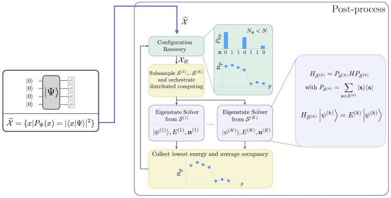

{/* doqumentation-source-hash: 16b72ae6 */}

import TutorialFeedback from '@site/src/components/TutorialFeedback';

<OpenInLabBanner notebookPath="qiskit-addons/sqd/01_chemistry_hamiltonian.ipynb" />


이 튜토리얼에서는 [Qiskit 패턴](https://quantum.cloud.ibm.com/docs/guides/intro-to-patterns)을 구현합니다. 여기서는 노이즈가 있는 양자 샘플을 후처리하여 화학 해밀토니안의 바닥 상태 근사값을 구하는 방법을 다룹니다. 구체적으로는 6-31G 기저 집합에서 평형 상태의 $N_2$ 분자를 다룹니다. [샘플 기반 양자 대각화 접근법](https://arxiv.org/abs/2405.05068)을 따라, ``36``-Qubit 양자 Circuit ansatz(여기서는 LUCJ Circuit)에서 얻은 샘플을 처리합니다. 양자 노이즈의 영향을 보정하기 위해 구성 복원(configuration recovery) 기법을 사용합니다.

이 패턴은 네 단계로 설명할 수 있습니다:

1. **1단계: 양자 문제로 매핑**
    - 바닥 상태 추정을 위한 ansatz 생성
2. **2단계: 문제 최적화**
    - Backend에 맞게 ansatz Transpile
3. **3단계: 실험 실행**
    - ``Sampler`` primitive를 사용하여 ansatz에서 샘플 추출
4. **4단계: 결과 후처리**
   - 자기 일관적 구성 복원 루프
       - 입자 수에 대한 사전 지식과 최근 반복에서 계산된 평균 궤도 점유율을 이용하여 전체 비트스트링 샘플 집합을 후처리합니다.
       - 복원된 비트스트링에서 확률적으로 서브샘플 배치를 생성합니다.
       - 각 샘플링된 부분 공간에 분자 해밀토니안을 투영하고 대각화합니다.
       - 모든 배치에서 발견된 최소 바닥 상태 에너지를 저장하고 평균 궤도 점유율을 업데이트합니다.

이 예제에서, 상호 작용하는 전자 해밀토니안은 일반적인 형태를 가집니다:

$$
\hat{H} = \sum_{ \substack{pr\\\sigma} } h_{pr} \, \hat{a}^\dagger_{p\sigma} \hat{a}_{r\sigma}
+ 
\sum_{ \substack{prqs\\\sigma\tau} }
\frac{(pr|qs)}{2} \, 
\hat{a}^\dagger_{p\sigma}
\hat{a}^\dagger_{q\tau}
\hat{a}_{s\tau}
\hat{a}_{r\sigma}
$$

$\hat{a}^\dagger_{p\sigma}$/$\hat{a}_{p\sigma}$는 $p$번째 기저 집합 원소와 스핀 $\sigma$에 연관된 페르미온 생성/소멸 연산자입니다. $h_{pr}$과 $(pr|qs)$는 단체 및 이체 전자 적분입니다.

자기 일관적 구성 복원을 포함한 SQD 워크플로는 다음 다이어그램에 나타나 있습니다.



SQD는 목표 고유 상태가 희소할 때, 즉 파동 함수가 문제의 크기에 따라 지수적으로 증가하지 않는 크기의 기저 상태 집합 $\mathcal{S} = \{|x\rangle \}$에 지지될 때 잘 작동하는 것으로 알려져 있습니다. 이 시나리오에서 $\mathcal{S}$가 정의하는 부분 공간에 투영된 해밀토니안의 대각화:
$$
H_\mathcal{S} = P_\mathcal{S} H  P_\mathcal{S} \textrm{ with } P_\mathcal{S} = \sum_{x \in \mathcal{S}} |x \rangle \langle x |;
$$
는 목표 고유 상태에 대한 좋은 근사를 제공합니다. 양자 장치의 역할은 $\mathcal{S}$의 구성원 샘플만 생성하는 것입니다. 먼저, 양자 Circuit이 양자 장치에서 상태 $|\Psi\rangle$를 준비합니다. Jordan-Wigner 인코딩이 사용됩니다. 따라서 계산 기저의 구성원은 Fock 상태(전자 구성/행렬식)를 나타냅니다. Circuit은 계산 기저에서 샘플링되어 노이즈가 있는 구성 집합 $\tilde{\mathcal{X}}$를 산출합니다. 구성은 비트스트링으로 표현됩니다. 집합 $\tilde{\mathcal{X}}$는 고전적 후처리 블록으로 전달되며, 여기서 [자기 일관적 구성 복원 기법](https://arxiv.org/abs/2405.05068)이 사용됩니다. SQD 프레임워크에서 양자 장치의 역할은 확률 분포를 생성하는 것입니다.
### 1단계: 문제를 양자 Circuit으로 매핑 {#step-1-map-problem-to-a-quantum-circuit}

이 튜토리얼에서는 $N_2$ 분자의 바닥 상태 에너지를 근사합니다. 먼저 분자와 그 특성을 지정합니다. 그런 다음, 바닥 상태 에너지 추정을 위해 양자 컴퓨터에서 샘플을 생성하는 [로컬 유니터리 클러스터 재스트로(LUCJ)](https://pubs.rsc.org/en/content/articlelanding/2023/sc/d3sc02516k) ansatz(양자 Circuit)를 생성합니다.

먼저, 분자와 그 특성을 지정합니다.

```python
# Added by doQumentation — required packages for this notebook
!pip install -q ffsim matplotlib numpy pyscf qiskit qiskit-addon-sqd qiskit-ibm-runtime
```

```python
import warnings

warnings.filterwarnings("ignore")

import pyscf
import pyscf.cc
import pyscf.mcscf

# Specify molecule properties
open_shell = False
spin_sq = 0

# Build N2 molecule
mol = pyscf.gto.Mole()
mol.build(
    atom=[["N", (0, 0, 0)], ["N", (1.0, 0, 0)]],
    basis="6-31g",
    symmetry="Dooh",
)

# Define active space
n_frozen = 2
active_space = range(n_frozen, mol.nao_nr())

# Get molecular integrals
scf = pyscf.scf.RHF(mol).run()
num_orbitals = len(active_space)
n_electrons = int(sum(scf.mo_occ[active_space]))
num_elec_a = (n_electrons + mol.spin) // 2
num_elec_b = (n_electrons - mol.spin) // 2
cas = pyscf.mcscf.CASCI(scf, num_orbitals, (num_elec_a, num_elec_b))
mo = cas.sort_mo(active_space, base=0)
hcore, nuclear_repulsion_energy = cas.get_h1cas(mo)
eri = pyscf.ao2mo.restore(1, cas.get_h2cas(mo), num_orbitals)

# Compute exact energy
exact_energy = cas.run().e_tot
```

```text
converged SCF energy = -108.835236570775
CASCI E = -109.046671778080  E(CI) = -32.8155692383188  S^2 = 0.0000000
```

다음으로, ansatz를 생성합니다. ``LUCJ`` ansatz는 매개변수화된 양자 Circuit이며, CCSD 계산에서 얻은 `t2` 및 `t1` 진폭으로 초기화합니다.

```python
# Get CCSD t2 amplitudes for initializing the ansatz
ccsd = pyscf.cc.CCSD(scf, frozen=[i for i in range(mol.nao_nr()) if i not in active_space]).run()
t1 = ccsd.t1
t2 = ccsd.t2
```

```text
E(CCSD) = -109.0398256929734  E_corr = -0.2045891221988311
```

위에서 계산한 `t2` 및 `t1` 진폭으로 ansatz를 생성하고 초기화하기 위해 [ffsim](https://github.com/qiskit-community/ffsim/tree/main) 패키지를 사용합니다. 우리 분자는 닫힌 껍질 Hartree-Fock 상태를 가지므로, UCJ ansatz의 스핀 균형 변형인 [UCJOpSpinBalanced](https://qiskit-community.github.io/ffsim/api/ffsim.html#ffsim.UCJOpSpinBalanced)를 사용합니다.

목표 IBM 하드웨어는 헤비-헥스 토폴로지를 가지므로, [Qubit 상호 작용을 위한 _지그재그_ 패턴](https://pubs.rsc.org/en/content/articlehtml/2023/sc/d3sc02516k)을 채택합니다. 이 패턴에서 동일한 스핀을 가진 궤도(Qubit으로 표현)는 선형 토폴로지(빨간색 및 파란색 원)로 연결되며, 각 선은 목표 하드웨어의 헤비-헥스 연결성으로 인해 지그재그 모양을 가집니다. 마찬가지로 헤비-헥스 토폴로지로 인해, 서로 다른 스핀의 궤도는 매 4번째 궤도(0, 4, 8 등) 사이에 연결이 있습니다(보라색 원).


```python
import ffsim
from qiskit import QuantumCircuit, QuantumRegister

n_reps = 1
alpha_alpha_indices = [(p, p + 1) for p in range(num_orbitals - 1)]
alpha_beta_indices = [(p, p) for p in range(0, num_orbitals, 4)]

ucj_op = ffsim.UCJOpSpinBalanced.from_t_amplitudes(
    t2=t2,
    t1=t1,
    n_reps=n_reps,
    interaction_pairs=(alpha_alpha_indices, alpha_beta_indices),
)

nelec = (num_elec_a, num_elec_b)

# create an empty quantum circuit
qubits = QuantumRegister(2 * num_orbitals, name="q")
circuit = QuantumCircuit(qubits)

# prepare Hartree-Fock state as the reference state and append it to the quantum circuit
circuit.append(ffsim.qiskit.PrepareHartreeFockJW(num_orbitals, nelec), qubits)

# apply the UCJ operator to the reference state
circuit.append(ffsim.qiskit.UCJOpSpinBalancedJW(ucj_op), qubits)
circuit.measure_all()
```

### 2단계: 문제 최적화 {#step-2-optimize-the-problem}
다음으로, 목표 하드웨어에 맞게 Circuit을 최적화합니다. Circuit을 최적화하기 전에 사용할 하드웨어 장치를 선택해야 합니다. 실제 장치를 에뮬레이트하기 위해 ``qiskit_ibm_runtime``의 가상 127-Qubit Backend를 사용합니다. 실제 QPU에서 실행하려면, 가상 Backend를 실제 Backend로 교체하면 됩니다. 자세한 내용은 [Qiskit IBM Runtime 문서](https://quantum.cloud.ibm.com/docs/guides/get-started-with-primitives#get-started-with-sampler)를 참조하세요.

```python
from qiskit_ibm_runtime.fake_provider import FakeSherbrooke

backend = FakeSherbrooke()
```

다음으로, ansatz를 최적화하고 하드웨어 호환 가능하게 만들기 위해 다음 단계를 권장합니다.

- 위에서 설명한 지그재그 패턴을 따르는 목표 하드웨어에서 물리적 Qubit(`initial_layout`)을 선택합니다. 이 패턴으로 Qubit을 배치하면 게이트 수가 적은 효율적인 하드웨어 호환 Circuit을 얻을 수 있습니다.
- `backend`와 `initial_layout`을 선택하여 Qiskit의 [generate_preset_pass_manager](https://quantum.cloud.ibm.com/docs/api/qiskit/transpiler_preset#generate_preset_pass_manager) 함수를 사용해 단계별 패스 매니저를 생성합니다.
- 단계별 패스 매니저의 `pre_init` 단계를 `ffsim.qiskit.PRE_INIT`으로 설정합니다. `ffsim.qiskit.PRE_INIT`에는 Gate를 궤도 회전으로 분해한 다음 궤도 회전을 병합하는 Qiskit Transpiler 패스가 포함되어 있어, 최종 Circuit의 Gate 수가 줄어듭니다.
- Circuit에서 패스 매니저를 실행합니다.

```python
from qiskit.transpiler.preset_passmanagers import generate_preset_pass_manager

spin_a_layout = [0, 14, 18, 19, 20, 33, 39, 40, 41, 53, 60, 61, 62, 72, 81, 82]
spin_b_layout = [2, 3, 4, 15, 22, 23, 24, 34, 43, 44, 45, 54, 64, 65, 66, 73]
initial_layout = spin_a_layout + spin_b_layout

pass_manager = generate_preset_pass_manager(
    optimization_level=3, backend=backend, initial_layout=initial_layout
)

# without PRE_INIT passes
isa_circuit = pass_manager.run(circuit)
print(f"Gate counts (w/o pre-init passes): {isa_circuit.count_ops()}")

# with PRE_INIT passes
# We will use the circuit generated by this pass manager for hardware execution
pass_manager.pre_init = ffsim.qiskit.PRE_INIT
isa_circuit = pass_manager.run(circuit)
print(f"Gate counts (w/ pre-init passes): {isa_circuit.count_ops()}")
```

```text
Gate counts (w/o pre-init passes): OrderedDict({'rz': 4420, 'sx': 3432, 'ecr': 1366, 'x': 239, 'measure': 32, 'barrier': 1})
Gate counts (w/ pre-init passes): OrderedDict({'rz': 2460, 'sx': 2156, 'ecr': 730, 'x': 71, 'measure': 32, 'barrier': 1})
```

### 3단계: 실험 실행 {#step-3-execute-experiments}
하드웨어 실행을 위해 Circuit을 최적화한 후, 목표 하드웨어에서 실행하고 바닥 상태 에너지 추정을 위한 샘플을 수집할 준비가 되었습니다. Circuit이 하나뿐이므로, Qiskit Runtime의 [작업 실행 모드](https://quantum.cloud.ibm.com/docs/guides/execution-modes)를 사용하여 Circuit을 실행합니다.

***참고: QPU에서 Circuit을 실행하는 코드는 주석 처리하여 사용자 참고용으로 남겨두었습니다. 이 가이드에서는 실제 하드웨어에서 실행하는 대신, 균일 분포에서 추출한 무작위 샘플을 생성합니다.***

```python
import numpy as np
from qiskit_addon_sqd.counts import generate_bit_array_uniform

# from qiskit_ibm_runtime import SamplerV2 as Sampler

# sampler = Sampler(mode=backend)
# job = sampler.run([isa_circuit], shots=10_000)
# primitive_result = job.result()
# pub_result = primitive_result[0]
# bit_array = pub_result.data.meas

rng = np.random.default_rng(24)
bit_array = generate_bit_array_uniform(10_000, num_orbitals * 2, rand_seed=rng)
```

### 4단계: 결과 후처리 {#step-4-post-process-results}
이제 `diagonalize_fermionic_hamiltonian` 함수를 사용하여 SQD 알고리즘을 실행합니다. 이 함수의 인수에 대한 설명은 [API 문서](../apidocs/qiskit_addon_sqd.fermion.rst#qiskit_addon_sqd.fermion.diagonalize_fermionic_hamiltonian)를 참조하세요.

SQD 애드온에 포함된 솔버는 선택된 CI의 PySCF 구현, 구체적으로 [pyscf.fci.selected_ci.kernel_fixed_space](https://pyscf.org/pyscf_api_docs/pyscf.fci.html#pyscf.fci.selected_ci.kernel_fixed_space)를 사용합니다. 아래 예제는 포함된 솔버를 통해 해당 함수에 키워드 인수를 전달하는 방법도 보여줍니다. 여기서는 `max_cycle` 인수를 전달합니다.

```python
from functools import partial

from qiskit_addon_sqd.fermion import SCIResult, diagonalize_fermionic_hamiltonian, solve_sci_batch

# SQD options
energy_tol = 1e-3
occupancies_tol = 1e-3
max_iterations = 5

# Eigenstate solver options
num_batches = 1
samples_per_batch = 300
symmetrize_spin = True
carryover_threshold = 1e-4
max_cycle = 200

# Pass options to the built-in eigensolver. If you just want to use the defaults,
# you can omit this step, in which case you would not specify the sci_solver argument
# in the call to diagonalize_fermionic_hamiltonian below.
sci_solver = partial(solve_sci_batch, spin_sq=0.0, max_cycle=max_cycle)

# List to capture intermediate results
result_history = []

def callback(results: list[SCIResult]):
    result_history.append(results)
    iteration = len(result_history)
    print(f"Iteration {iteration}")
    for i, result in enumerate(results):
        print(f"\tSubsample {i}")
        print(f"\t\tEnergy: {result.energy + nuclear_repulsion_energy}")
        print(f"\t\tSubspace dimension: {np.prod(result.sci_state.amplitudes.shape)}")

result = diagonalize_fermionic_hamiltonian(
    hcore,
    eri,
    bit_array,
    samples_per_batch=samples_per_batch,
    norb=num_orbitals,
    nelec=nelec,
    num_batches=num_batches,
    energy_tol=energy_tol,
    occupancies_tol=occupancies_tol,
    max_iterations=max_iterations,
    sci_solver=sci_solver,
    symmetrize_spin=symmetrize_spin,
    carryover_threshold=carryover_threshold,
    callback=callback,
    seed=rng,
)
```

```text
Iteration 1
	Subsample 0
		Energy: -105.45358671756313
		Subspace dimension: 5476
Iteration 2
	Subsample 0
		Energy: -107.95172900082163
		Subspace dimension: 249001
Iteration 3
	Subsample 0
		Energy: -108.97460330369815
		Subspace dimension: 339889
Iteration 4
	Subsample 0
		Energy: -109.02739376648793
		Subspace dimension: 440896
Iteration 5
	Subsample 0
		Energy: -109.030972328451
		Subspace dimension: 597529
```

이제 결과를 플롯합니다.

첫 번째 플롯은 몇 번의 반복 후 바닥 상태 에너지를 ``~16 mH`` 이내로 추정함을 보여줍니다(화학적 정확도는 일반적으로 ``1 kcal/mol`` $\approx$ ``1.6 mH``로 받아들여집니다). 이 데모에서 양자 샘플은 순수한 노이즈였음을 기억하세요. 여기서의 신호는 전자 구조와 분자 해밀토니안에 대한 *사전* 지식에서 나옵니다.

두 번째 플롯은 최종 반복 후 각 공간 궤도의 평균 점유율을 보여줍니다. 스핀업과 스핀다운 전자 모두 우리 해에서 처음 다섯 개의 궤도를 높은 확률로 점유하는 것을 볼 수 있습니다.

```python
import matplotlib.pyplot as plt

# Data for energies plot
x1 = range(len(result_history))
min_e = [
    min(result, key=lambda res: res.energy).energy + nuclear_repulsion_energy
    for result in result_history
]
e_diff = [abs(e - exact_energy) for e in min_e]
yt1 = [1.0, 1e-1, 1e-2, 1e-3, 1e-4]

# Chemical accuracy (+/- 1 milli-Hartree)
chem_accuracy = 0.001

# Data for avg spatial orbital occupancy
y2 = np.sum(result.orbital_occupancies, axis=0)
x2 = range(len(y2))

fig, axs = plt.subplots(1, 2, figsize=(12, 6))

# Plot energies
axs[0].plot(x1, e_diff, label="energy error", marker="o")
axs[0].set_xticks(x1)
axs[0].set_xticklabels(x1)
axs[0].set_yticks(yt1)
axs[0].set_yticklabels(yt1)
axs[0].set_yscale("log")
axs[0].set_ylim(1e-4)
axs[0].axhline(y=chem_accuracy, color="#BF5700", linestyle="--", label="chemical accuracy")
axs[0].set_title("Approximated Ground State Energy Error vs SQD Iterations")
axs[0].set_xlabel("Iteration Index", fontdict={"fontsize": 12})
axs[0].set_ylabel("Energy Error (Ha)", fontdict={"fontsize": 12})
axs[0].legend()

# Plot orbital occupancy
axs[1].bar(x2, y2, width=0.8)
axs[1].set_xticks(x2)
axs[1].set_xticklabels(x2)
axs[1].set_title("Avg Occupancy per Spatial Orbital")
axs[1].set_xlabel("Orbital Index", fontdict={"fontsize": 12})
axs[1].set_ylabel("Avg Occupancy", fontdict={"fontsize": 12})

print(f"Exact energy: {exact_energy:.5f} Ha")
print(f"SQD energy: {min_e[-1]:.5f} Ha")
print(f"Absolute error: {e_diff[-1]:.5f} Ha")
plt.tight_layout()
plt.show()
```

```text
Exact energy: -109.04667 Ha
SQD energy: -109.03097 Ha
Absolute error: 0.01570 Ha
```


<TutorialFeedback />
