{/* doqumentation-source-hash: 768fc01c */}

<OpenInLabBanner notebookPath="workshop/04_Hands-on Introduction to Qiskit.ipynb" />

이 노트북에서는 Qiskit으로 양자 Gate와 양자 Circuit을 프로그래밍하는 방법, 그리고 Qiskit 패턴을 사용하여 시뮬레이터와 실제 양자 컴퓨터에서 실행하는 방법을 살펴봅니다. 이후에는 정보를 인코딩하는 다양한 방법을 소개하고, 마지막으로 양자 텔레포테이션 보너스 예제를 다룹니다.
## 시작하기 전에 {#before-you-begin}

[설치 및 설정](https://docs.quantum.ibm.com/guides/install-qiskit) 안내를 아직 따르지 않았다면 지금 따라 주세요. [IBM Quantum™ 플랫폼 사용 설정](https://docs.quantum.ibm.com/guides/setup-channel#set-up-to-use-ibm-quantum-platform) 단계도 포함됩니다.

양자 컴퓨터와 상호작용하려면 [Jupyter](https://jupyter.org/install) 개발 환경을 사용하는 것을 권장합니다. 권장 시각화 지원(`'qiskit[visualization]'`)도 함께 설치하세요. 이 예제의 두 번째 부분에는 `matplotlib` 패키지도 필요합니다.

양자 컴퓨팅 일반에 대해 배우고 싶다면 IBM Quantum Learning의 [양자 정보 기초 과정](https://learning.quantum.ibm.com/course/basics-of-quantum-information)을 방문하세요.
## 임포트 {#imports}

```python
# Added by doQumentation — required packages for this notebook
!pip install -q matplotlib numpy qiskit qiskit-aer qiskit-ibm-runtime
```

```python
# Import necessary modules for this notebook
import time
import qiskit

from qiskit import QuantumCircuit
from qiskit.quantum_info import Statevector
from qiskit.visualization import plot_bloch_multivector, plot_state_qsphere
from qiskit_aer import AerSimulator
from qiskit.quantum_info import SparsePauliOp
from qiskit.transpiler.preset_passmanagers import generate_preset_pass_manager
from qiskit_ibm_runtime import EstimatorV2 as Estimator
from qiskit_ibm_runtime import SamplerV2 as Sampler
from qiskit_ibm_runtime import QiskitRuntimeService
from qiskit.visualization import plot_histogram
print(qiskit.__version__)
```

```text
2.3.1
```

하드웨어에서 양자 Circuit을 실행하려면 먼저 계정을 설정해야 합니다.
다음과 같이 진행하세요:

1. [업그레이드된 IBM Quantum&reg; 플랫폼](https://quantum.cloud.ibm.com/)으로 이동하세요.
2. 위 그림과 같이 오른쪽 상단 모서리로 이동하여 API 토큰을 생성하고 안전한 위치에 복사하세요.
3. 다음 셀에서 `deleteThisAndPasteYourAPIKeyHere`를 여러분의 API 키로 교체하세요.
4. 위 그림과 같이 왼쪽 하단 모서리로 이동하여 **인스턴스를 생성하세요**. 반드시 오픈 플랜을 선택하세요.
5. 인스턴스가 생성되면 연관된 CRN 코드를 복사하세요. 인스턴스가 보이지 않으면 새로고침이 필요할 수 있습니다.
6. 아래 셀에서 `deleteThisAndPasteYourCRNHere`를 여러분의 CRN 코드로 교체하세요.

IBM Cloud&reg; 계정 설정 방법에 대한 자세한 내용은 [이 가이드](https://quantum.cloud.ibm.com/docs/guides/cloud-setup)를 참조하세요.

<div class="alert alert-block alert-warning">
    
⚠️ **참고:** API 키는 보안 비밀번호처럼 안전하게 취급하세요. 안전한 환경과 신뢰할 수 없는 환경 모두에서 API 키를 사용하는 방법에 대한 자세한 내용은 [Cloud 설정](https://quantum.cloud.ibm.com/docs/guides/cloud-setup#cloud-save) 가이드를 참조하세요.
</div>

```python
#your_api_key = "deleteThisAndPasteYourAPIKeyHere"
#your_crn = "deleteThisAndPasteYourCRNHere"

QiskitRuntimeService.save_account(
    channel="ibm_quantum_platform",
    token=your_api_key,
    instance=your_crn,
    overwrite=True
)
```

# 1. 양자 Gate와 양자 Circuit {#1-quantum-gates-and-quantum-circuits}
양자 Circuit은 양자 계산 모델로, 계산이 일련의 양자 Gate로 구성됩니다. 몇 가지 인기 있는 양자 Gate를 살펴보겠습니다.

### X Gate {#x-gate}
X Gate는 블로흐 구(Bloch sphere)의 X축을 중심으로 $\pi$ 라디안 회전하는 것과 같습니다.
$|0\rangle$을 $|1\rangle$로, $|1\rangle$을 $|0\rangle$으로 매핑합니다. 고전 컴퓨터의 NOT Gate와 동일한 양자 연산으로, 비트 플립(bit-flip)이라고도 합니다.

$X = \begin{pmatrix}
0 & 1 \\
1 & 0 \\
\end{pmatrix}$

```python
# Let's apply an X-gate on a |0> qubit
qc = QuantumCircuit(1)
qc.x(0)
qc.draw(output='mpl')
```

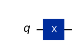

```python
# Let's see Bloch sphere visualization
sv = Statevector(qc)
plot_bloch_multivector(sv)
```

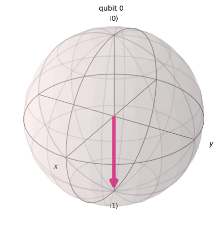

### H Gate {#h-gate}
Hadamard Gate는 $X$축과 $Z$축의 중간 축을 기준으로 $\pi$ 회전을 나타냅니다.
기저 상태 $|0\rangle$을 $\frac{|0\rangle + |1\rangle}{\sqrt{2}}$로 매핑하며, 이는 측정 결과가 `1` 또는 `0`일 확률이 동일함을 의미합니다. 이를 상태의 '중첩'이라고 하며, $|+\rangle$으로도 표기합니다.

$H = \frac{1}{\sqrt{2}}\begin{pmatrix}
1 & 1 \\
1 & -1 \\
\end{pmatrix}$

```python
# Let's apply an H-gate on a |0> qubit
qc = QuantumCircuit(1)
qc.x(0)
qc.h(0)
qc.draw(output='mpl')
```


```python
# Let's see Bloch sphere visualization
sv = Statevector(qc)
plot_bloch_multivector(sv)
```

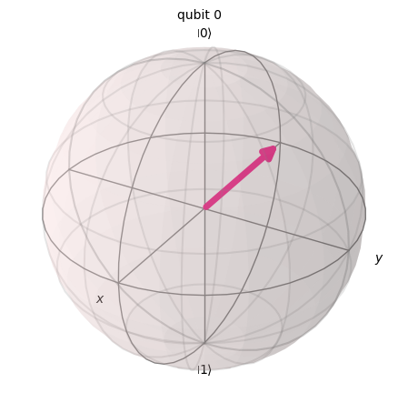

### CX Gate (CNOT Gate) {#cx-gate-cnot-gate}
제어 NOT(CNOT 또는 CX) Gate는 두 Qubit에 작용합니다. 첫 번째 Qubit이 $|1\rangle$일 때만 두 번째 Qubit에 NOT 연산(X Gate 적용과 동일)을 수행하며, 그렇지 않으면 변경하지 않습니다. 참고: Qiskit은 문자열에서 비트를 오른쪽에서 왼쪽으로 번호를 매깁니다.

$CX = \begin{pmatrix}
1 & 0 & 0 & 0\\
0 & 1 & 0 & 0\\
0 & 0 & 0 & 1\\
0 & 0 & 1 & 0\\
\end{pmatrix}$

```python
# Let's apply a CX-gate on |11>
qc = QuantumCircuit(2)
qc.x(0)
qc.x(1)
qc.cx(0,1)
qc.draw(output='mpl')
```

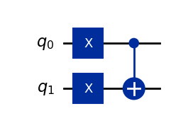

```python
sv=Statevector(qc)
plot_state_qsphere(sv)
```

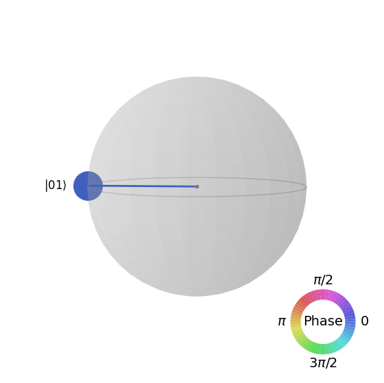

첫 번째 벨 상태를 만들어 봅니다.

$$ |\phi^+ \rangle = \frac{1}{\sqrt 2}(|00 \rangle + |11 \rangle) $$

```python
# Create a Bell state circuit

qc = QuantumCircuit(2)
qc.h(0)
qc.cx(0,1)

# Draw the circuit
qc.draw("mpl")
```


```python
# Plot the state using q-sphere visualization
sv = Statevector(qc)
plot_state_qsphere(sv)
# q-sphere is useful for visualizing states when Bloch sphere fails to
```

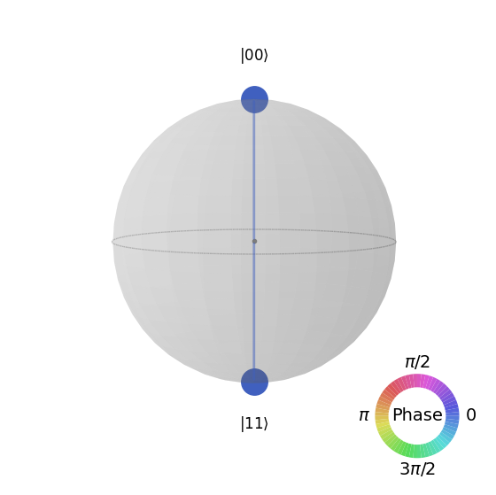

두 번째 벨 상태를 만들어 봅니다.

$$ |\phi^- \rangle = \frac{1}{\sqrt 2}(|00 \rangle - |11 \rangle) $$

```python
# Create a circuit with the second Bell state

qc = QuantumCircuit(2)
qc.x(0)
qc.h(0)
qc.cx(0,1)

qc.draw("mpl")
```

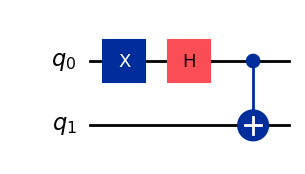

이에 대한 설명은 다음과 같습니다:
$$
H|1\rangle=\frac{1}{\sqrt{2} }(|0\rangle-|1\rangle) = |-\rangle 
$$

```python
# Get the statevector of the circuit
sv = Statevector(qc)

# Plot the state using qsphere visualization
plot_state_qsphere(sv)
```

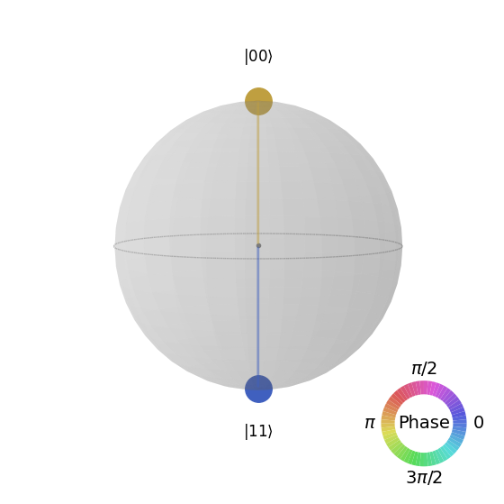

3-Qubit GHZ 상태를 만들어 봅니다.

$$ |GHZ \rangle = \frac{1}{\sqrt 2}(|000 \rangle + |111 \rangle) $$

```python
# Create a circuit with 3-qubit GHZ state

qc= QuantumCircuit(3)
qc.h(0)
qc.cx(0,1)
qc.cx(0,2)

qc.draw("mpl")
```


```python
# Get the statevector of the circuit
sv = Statevector(qc)

# Plot the state using qsphere visualization
plot_state_qsphere(sv)
```

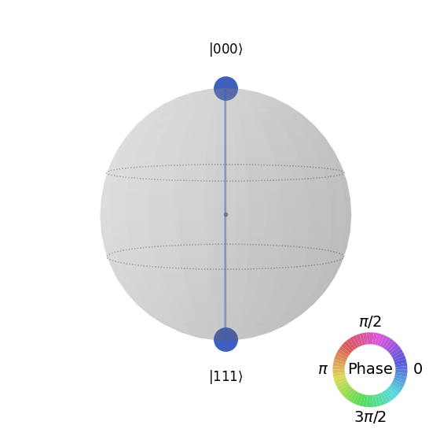

Qiskit 로고 상태를 만들어 봅니다.

$$ |Qiskit \rangle = \frac{1}{\sqrt 2}(|0010 \rangle + |1101 \rangle) $$

<div align="center">

<img src='data:image/png;base64,iVBORw0KGgoAAAANSUhEUgAAAgAAAAIACAQAAABecRxxAAAABGdBTUEAALGPC/xhBQAAACBjSFJNAAB6JgAAgIQAAPoAAACA6AAAdTAAAOpgAAA6mAAAF3CculE8AAAAAmJLR0QA/4ePzL8AAAAHdElNRQfoBwwNKgHegT8KAAByiElEQVR42u2dd3yVRdbHv2dCQgoQaui9o4AKYu+99977qru2Xfvuq669rq5t1bWXtTesqFgQEEURLID0XhICpNdn3j9yCSn35pnnltzn3ju/55PkJnnalPObM2fOnCNYJBsy6EpXejKUQaqXzqOjbkcWGWTShnQEhSCNrtCBL6ilhnLKKZMSNlOoN7KB5axnDetZRamt3GSD2CpIcHRmAAMYqAbowfQmT3eibcw6SyX5rJLlrHHWs4rVLGIZNbYJLAFYtB7aMJjhDFQD9QAGMIDcLYN3XDpONctYKIuchSxkEYuptA1kCcAi+hjANmyrttXbMGrrCK/91oUcVjJfZjuzmcNcqm2zWQKwCB85jGc7tY0ezTa0bzpl931HquI3mePMZg4/s8E2piUAC9MWGc5Oame9M9vSpuk/dWJ2p5X8pKcyjZlU2Aa2BGARDO0Zy26yOzvTNdi/dTJ0qhpmy1TnR75mmW1wSwAWAB3YW+2v92Nk6LbQyde1FstUZzqTmW87gCWA1EQa27G/7M+eZLR0mk7u7rVWPnMm8gWFtkNYAkgVDGJ/tb8+kFy3E3WqdLBafpbPnc/52q4cWAJIXmSwjzpGH0Evk5N1KnayTXyhP+V91tnOYgkgmZDF/uoEfQQdTS/QqdzRHKbribzNAttxLAEkOjpzuDpcH0I7Lxdp29UAftdv8BpzbSeyBJCI6MGJcgx7kObtMm07W2P8Km87bzPbdihLAImCTA5QZ+ijSfd+qbbdLTjm61d5niW2c1kC8DMUu6oz9Ml0CO9ybTucm23gBV6hxHY0SwD+wwhOljMYFMkttO1y7iiXD5wX+Yha2+UsAfgDHTlDzmDHSG8TY/F3qKIGhxpqqUJTRSVQTAaKdIRsFOlAJm3JQPm8yy2TF5wXWGg7nyWA+GI7dYk+jezIb6SjK+wFrGAVa1jJCpawmHyPO/Wz6UEPetGf/gxkKH3I8V2n00zSj/Ihju2GlgBaHxkcJ5eyW7RuFzEBVDGHWfzBfOaxJAZxeroxghEMYxsm0MVH3W6J/g9P2w3HlgBaE33URfp8ekTvhhGI/wamMZWprbjVVhjJruzObgzxSberkFedR5lpO6ZF7DFOvSBVoqN74P2o5guubGkPYSugO6fxKpvCeHst0T9mciFZtoNaxAptOEN+iUHH9S4+U/kTnX00GTqKt6iIOwFo0bKOG80dri0sTNGWM+WPGHVaL4JTyTOM9mUNdecW1sedALRoKVYP0dt2WYtooSM3yLoYdlhz8X+Vgb6uqfbcSqkPKEBLhfoPg23XtYgUedwsGyW2ndVMZAo4KiFqbASzjMrzg3pdNsS0XmtlYuTeGRapi0HqcSmPYQetkan8HztzuoG4rGObhKm39kwxKNEsII3x/ENmSG3M6tiRj9jddmULr+ir/ivVMeuWBeppjqs3Vl1qIC7HJVTt9aLItUTLGtkPzpE3pShm9f0J42yXtjBFV3V/zEb+VepR9msS7vtaV2Ep9bqpOO5417VMG5tdk8H+6iFZGSNN4A1G2q5t4YYcrpVNMemCS9VD7N880j/wN4M1/+wEq8cvXMuUH+JKxe4xooFa9bo1DFqERlsul/Ux6HjL1B3s0MJzLzKYAvw9oWpyJ2pdS7SoxTvEigYq1b/pbru6RVOkcY4si3p326yeYW/XnXXHGhBADacnTF2OYo1BiaYb3Emxr3pOiqPcKiXqDjrZLm+xFYfK71G38H/MqYaK+yijZTOHhxNiInC2gQFQo3nW+I7tOFO+iPJKQQEXJ5xdxSImGCIToyz8c7iKnh7eIJ0yQ+eZFZwb1IrgF+zOt8ZOTVd6vHc/boyyL+bP7G27f2ojm5ujau+vVK+zfxjv8bEHZ+BlXB35dtyoI4PjmeppN8C24VGMej2qW7Em+ty30iKGOCKqs/5V6q6wPdD/4nEzUCXvcmLjlOFxtJ7swSMUeCxBJOE9e3CtLIlau5Wpu7wFbbdIBmwv30bR5fRjjohoRtmF8jC21FbwCZezY9wmBYM4nefID2czMP+ImHaOkk/EiVILLuckGxkjddBV/SdqJqUi9UBU1pafDUuM6o4SvuQ2Dm0ly3Y6O3Mlb7I6gjcu92QjCY2R6smoTeG+SSBna4sIcHbUtqCs4fqoCd0Ar/vpgx6FfMsTXMsJbBNVG3cnxnECN/M6M40Nli0dd0Xx3fK4OUreG5XqFtqmmjikluIzQJ7gwKjcabH+N09SHsV3u5e/RbWsFSwmnzWsJ5+1rCeffDYApVS1IOiQQxd60o1u9CSPbvSgX5SNjmsYxaao3rEtJ8k1URnBF+oL+dKOkskIxWVRcimZzrExCJudyW9RGFtNjYiFbGBR4FhDIcWt9myHQ2I0lB0jP0bFYfiRcBO7WPgXI2VqVIR/EnvG7B1HG7rQJPZxVwxbWThMvotCK6/gCCsyyYM2XBsVU9G37BvjNz2M6iQX/zdjmXIkgN3l86h4CNiwYkmBcfJzFLrDtLAcfLzjeKqSWPw/bDUj217yVcRtviGB9l9YBEW6ui0KYT1mcmgrvvPRlCSp+L9ARqu2/sHyU6Rtr16124YSF0OiMB+cw1GtvlKyPcuSTviruSYuht+TZUHE9oB9rSglIs6M2Oafz+Vx2jGWy8tJJf5L2SN+WiAXyqrIogmph1LPPyCx0Um9HmmkXnVrnD3Ej2NxUgh/ObfH3dc+mxulJMKdg9tasUoU7CKLI2T81xngg3JkcDmbE1z8JzLIJ72il3oiIgfwcq5thRUMi4jNfndE6Of/NeN9VJ5ePJKgRkGHj2PoMxEedpLpEfWNT+llRczPGCrfRxa4k2N9WKoOXJ5gZsEKXvCpyiycLisiyj1oTYK+xVGyOYKmrVL3kONfzYaTmEhlAgj/D1xFV1/3kxx1ZwRBRWq43m4d9h/SuDki1f9bn6bcbIyOnMlE37oK/cbNDEuQ/jIsIm/BD6x3gL/QRT6NoDkLuTyhzDvt2Z+7mOkbwS/gdS70jbHPfDJwZgTbiJcxwYqdX7B9JFZ/9Tp5CVrugZzLf/gxThqBw3xe4nLGJbBtvJN6KGy9sYLLrej5AedHsNHnD/ZKghrIZGcu5TG+iChKj2nIkan8l6vZvz6zYaJjr/B9BdUzZCV68RPbnJGpHtbnh3mtI48411OWZHSYywgG0I9+9Kc/eXSLyJexmg0UsoLlLGM5S/iD9Uk4hGSrO/RfwtRjftbHsdgSQHzQV94Oe81+sT6Xr1NCQ+pGN7rSkQ50oD2dgHTa1X8HqKQMqKAcKGEDhRRSQCGFFKeMHrmHPMOQsK4s0MfwrSWA1sdY+YA+YV2p5Snnr5RE8OwOjGYEvVQOgJPPcn5lPo6djyUwstRN+m9h6UtV+kKetxXYujhGSsN29tkvgucO4kb5LugW4w3yJicnXBZfi8Z6QJj2AHVHog6lifnaf5O7w5uzyVPO3ygK86l7yrUc4lJjm+Qp5wHWxrFuFJlkkE4WaeTQhkyEHBSKHIT0tCxEt6UtCgkcCqEDCqEEEKqpRBCnFAehCE0xDsXUUkINpZRRlrSTg3bq3/qcsK58S5+ZiBalxCOANupBfWlYV27WF/FamE8dJvdzuOG5Jfoe7m4h9m4kyCSLbLLIIpOsNlk6k0yydDbZZJFNBjmkoeoPQaF0k9+DHKH+3tL/iymllCKKKJNiNrLJ2cgm6r7qvusEJYFj5Sk6h3HdbH0EKywBxBbt5dUw4/N8r08J014rXCZ3elzw+UWfzpzwSY4s6oS6HdlsEe8cslGqsUBKSDEN/KZbEmLxJPKND1dLCwVsoIACKWC9U/d5PatZT43ve1lfeTGsBeLV+ihmWgKIHQbIB2FFf3fkLuemMDtejnpGnxjGdWX6XCN9IyMg7DlkB8S9HemNhLDBT9VUPMVI/MVIvL3oAeH3G8161rNK1rHGWctaVrKCNVT7rKelcb3cFEbStVJ9Ou9aAogNdpZ36R7GdWv0GXwR5jNzZCL7hNvV9V/5V4ixPaf+Kz0gWKG+N/hpKP71n7Wp8HudGkS71zisZQUrZaWznFUsZylrfNHfXqW/56tq9aU8YQkg+thX3gsrsszn+sywu1OWfMZukby0vpgXA0p8ndhn1AuWBPnUIgEowYQAWhL/aGgC0iquvxUsYYkscZawlCUsYWNc+lwXeSGcCafc7VxnCSC6OFFeDCOmbK2+kXvCNkaJvMFxkY5t+iZm1ou5tCD8oUVfUCgVdErQovh7FX5Ti0A8UMgCWeAsYAELWBjlxGItQXGD3OzdO0AedK5KDCNoYhDAmfJ0GPOxDfoUPovgqVfIv6Lw7iX6MtaHFP6WR39pNPf3QAAu4h+JJuAH5LNA5jnz+J25LI25A9be8j96eBasl51zfGfZSFACuEweDOM9f9bHsiSCpw6TOVGKBTtL3xxUBzCdBDSd+7sSgTZYHQhDE5AYzP4jRxnzZK7zG/P4lUUxIoPe8loYU8EP9IlRTR+bmgSg7tDXh1Gsl5wLI6t8mcQB0SqDvo9pBjpAqLE/uMA3H/8l6NzfiybgZiL0e28p5VeZ7cxhDnPYHNU7p6v79V88XzVFH9mK05UkJABRD+grPF9Vo//O3RE+eR+ZHMVyrNFX4hjqAKHHfnGZAIiL+EeqCSTWkvFS5sjPzo/MZHWU7ni+POrZDvWbPohVlgDCZd3n9Kmer1qvT4x8n598yoHRLIp+kO+86wDK1TTYVNh1aKGPVBNI3G1ja5ipf2QmP0bsor2HvOk5fMwivS/LLQF4R1t509j5tuF8+0hWRvDUNDLJYpR8FeWa+V3fbmwHaDj6mxOABHH7iaYmkAxYyQ96Gt/xY9jTw/7yHmM9XrNY7+1fF2G/EkCGvMGRnq+apE8Ia6uP0LbOu54MBNSf9SVRLo/WV7CpfutNMB2gqerv5hfQjAC0CmkcjFwTSC5UM0u+c75jGss8X5sjz3teHF6m92apJQAPyr+8ztGei/KYcxm13iyMZJJFFlmkAYLUfZfXGRntIunn+cpAB5AGLj9iTgDa0DsgTE0gebFapjhf8zVzPazai7pV3+jxOQv1PhFppilFAGnqJX2y5xH2n9zsQfDr9tRlogJ1IFvFn3YyJQadfoZ+MoT4SzPV39A7IOjMXwyF3lwTSAWsZ4r+mq/4zXAh8Wx5knSPFLC3H82B4kPxf16f5vGaCn220cYbCeyqy6wXdhp9qjt2lFj4cufrGzwKvyEBaEPvgDA1gdTCBr7Sn/GZwb7RA+RNOni69wK9j/8owG8EoNTz+nSP1xToo5nqck4mOeSQ1WDEJ6j4g3CcXB+Dkjn6LyGXAgNfSjzsFNii/Lu5B9VSiVBDFUKFOFqkBOrvrSkJfBIUojvQBkV6IEBIDplAJyRpYgCbYpF85nzG5BZX8cfIR/T2SAF7R21RMikJQKln9Fker5mnD23B4y+NdrQjJ+BILC2Kf4AE1MX67FgUTv+9mRmw0ZdqyUW48e9CBeVUBI5yKastp5waSqmhkgpqKKGGciqi6IyqyKUN7UmnHW3JoSPtyaGdyqU97XQOueTSiU50SiKtoZbv9Sd8wKwQFoKB8hEjPN1xvt7HFzsdfUkAop7S53m85id9MPlB/5NFO9qTVV9GafYpqPiD/JXjY0IAd7C2xbG/qfDXUEwp5VJKeW0ZpZRRQimllFDha7HZQgSd6EQXlUdX3Y1udKdrwkbRXyUfOh/wRZCQX53lfY9OwvP0niF6bKoTgHrU8+LbFH1EM5dPoR25tKdNg9IFp4AQJCBXc1RMCOBeVm1VthuN/Q6lUkwxpbVl9aG2SmIUVCyeyKEb3cmjl+pJT92LnvQiL6LMBa2Jcr7QH/B+kxE8W97mIE/3+UHvG1FM6iQlgJvlJo9XfKRPaMTJabQnlw718/ymwm86BfizPiEmBHA36xEEhyKKKaGYEkooosQ/3SEOSCOPXvShv+pLX92X/vT09STCYZp+k7caLOplyMsedcbJ+lAqLQE0xAXypMcXf9U5s36G24aO5NKhSWnEiAKafz9Dzo0JARzACoooohSLlpBOL/oxgEFqkB7MIHr68B01M/SbvBVw70lTT+pzPfbe0/yRR8IfBHC4vONtv78875xPDaDoSJeQot9c+IOLf2M/gP0lFvFcynVOwsbJjS+yGMRgBqkhehjD6Ocru9X3+mVeZT2i7tdXeurBjzmXWgKow07yBTmeXvrfzhVALl1bsDkHI4GmFBB8IXCwPB6DUs7QO1tZjgodDGMow9RwPZwR5PrgjWr4VL/Ee1wmd3lSIm7kDksAMFK+9RaFXd/CfeTRNaTxSFqYBJhYAdrI69G3V8ujzp+t9EYdfRnFaDVKj2akt0Ek6iiSt5xa8ZKqVusLeDrVCaCXTPMWeVUed/5rlIDLzAIQfCHwH+wU9UnjkUy08hpDKAawLWNkO7ZnUNzeooCuHs6u1SfxVioTQEf5htGeXvdl56kGhhiv47+ZEVA4QKI9Whfrntb412rIZTu2U9vp7djGo8d+a6NcH8SUVCWAtvKpt/wr8rrzRAuibzr+u/gBIGTK09GdBMh/nQusXMYBmWzHBLWj3pFhPt35ukFPCDNjVaITgHpKn+/pgnf0441EX7uUxm0FIJQOUMVGdak+JZr6v96e2VYa46ttMp4JsjO7eFLSWwPz9C7xixwYPwL4q9zn6fz368Xf6/gf2g24oR4AxRRQSCElQB9ZGKWYwHXvfpSVQJ9AGM6uane9i0cv/ljiI32kx0gWCU8Ah8hETy6gHwbEvyUNwM0NKLgfgMNGNlDAhsYbZ8KLRhwUVXoM863k+Q5d2VXtpfdhbPw9D+UB56+pRADD5TtPG0y/1g808JvShmUKvQgIgmYD+eSzMQT3ZsscBkelim9xbrbS5mN0Yk+1j96H0fGcEOuLeDJVCKCTzGCoh/Nn61sDmX2bir4OWY7QRkDNJtaTT4Gr0rWjfBtGOrKm+F7vlgAJsS2gK/uog/SB9I3L06v1gXyVCgSQJhM5xMP5C/TNVDQSdm1YnqbCX8o61pLvYY/8uRK5o8ZivY3Pt+9aNMZIDpKD2NPI2ySa2KB3YlHSE4B6WHtZY1+pb6K4XuS1x1JJ4Kp81rImrHjBf5dbI1bubuBOK1UJh0z2VEfqw8NIEB4+fte7Rjmjke8I4EJP8fY26JsoaCb62nj8r2ANq1gXkQp+tdwdYS2V6OF+CwRlYYyxHC5HMr6VDIXv66Nbd8tY6xLALvK1B8+sEv1PVjUQeC/jfzErWUVBVCrzOHmOdhFV8gvOWVaSEho9OFqOZ+/YBy/R10Wc1s63BNBFZnkwsFTqu1gUVPh1i2XZyHJWRFmRGizPh5EdtsEb612YYaUo4dGVY+R49ompe3GN3rc1nYNbjwBE3vEQakvrh/mpicC7jeabWcrSsGb6JvV0htwWgX14ht7FRgNIEnTmGDmdPWM2KVirt484i6EPCeBaL7ul9Rt8ElL0mwtSMUtYysYYlyCDU+UiwtzVr8/iBSs7SYS+nCqns21M7v2lPqC1PANbiwB2lm88KE7T9bNBhD/YCFrNEha2Hl8CQzlU9mX7RtpAtUHZVuvhKR37LzkxVp2lz4j+7gJ9M7ckEwF0k5/oY3z2Qv1QYK2+JQ1As5oFLI2bk002fWgPVLKWjTLLfVuz3OncYCUmCdGWo+V89o3qlMDRB/F5shCAkg852PjsDfpeioMK/9ZP5cznd4p91An2kcmu51TpbVlg5SVJMUidq8+jR9Tut17v0BqJxFqDAG6Q243PrdQPsKbZrr+GGsBqfmWxPyKqNqrItzjW9aR39LFWUpIYGZwol7FjlO42Xe8VxcxOcSOAPeUL44i/jn6KuSGUf00t85hNoU8bf6D8Tqbr3O4gJlk5SXLsoi7Tx0VjqbA1Jo2xJoBOMsd89q/f5+sgwq+Bcn7jZ38H1VK3GWSN/12PtVuDUgA91BX6LxHvJnD03rH2CYgxAaiX9anGJ/+mX0A3Uf81sJGZzE0AscmWufRzJbk/86iVj5RAN3W5vjTCvMpL9HYx8mxpFQI4Rt6ue4iBD0yBfiSwa64hBRTyHb8njAvN6fKi6zkb9VA2WOlIEXTgz/I3OkUgoDGOJhlL3+ae8rGxElSln6G4QepMQVHEN3zK+gRq7l9kP1cdIEtl6Y+tZKQIKpnCY2yWCWEHmNuBXwJ2sUTTAOQDDjOe/b/F7EYjfzFfMycBnWd3kB9c14Nr9fb8YmUjpdBd/V1fFKZhsEBvy7rE0wAukquMz52hpumtI38N3/Jugm6gXaMGsp2bYUSGW7fgFEOp/pg3ZChDwrg2W4bzv0TTAAbKbNobnrtKnqc2MPZr+bF2ckKn0Ogu890z1umjec9KRQriSLk/HBLQZ/N8ImkAafKecdS/UnmFqsDYv855Vf8Qe+eH2HI9WvZ35d0JPGmXA1MQ83lSaXb1KndyCC/EJlZQbLY0Xs3uxud+QimKNGqcT53HWZEEjfwv/nA9ZxBXWGlISVQ6/6fH86PHq9rK57GR1VhoACPlVWPfv1nyIwphufMM85Jkx3wty8U1r5DszPO+2s1g0XpYxzOUy56epK8L6UxOhMKJfKG0mB0b1EPqfnVP2mGxD7XUypXwsXvp1bNWElIa42SBaA9HbXTyVMQa5xkXqEa9rP6l/h6nOOyxxUipci2/wwQrBSmNXPW6JwqIQX6paI+8XeR947y602QxC5z/BOL+JhcKVFd2ctWVRvOMlYJUtgfoNyiX/YzX4rpQyze+LpF60Vj9X6UeSzsl2VT/Bugk+e61wOlWClIex0ipsQ5Q5b7EHE/sLY5hQSrUi+yV5A17sUE9rIws4LhFUmC8FBhTgI/dyDPlD+NiTIoozHZiIE1+NjAF3mb7vwUjpdBQcvxrOVK3Gov/IsanRLPubqARVYTlHmqRbBgj5YbSsyz+6cyDYbhUmKr/pExgLHnDoD7etL3fAtjXdALNJT7s6fK16fivHkmhRu1rYuDhANv7LYD7DWWohJ5+e/WTRJvZ/9W8OKQk9/vE6Fdjz0mL5NYY5xoOoj5zIsuUJcbLGGNSrE2zZZmBDnCx7fwWQG+pMfQK9JUV7QZT9Z/7UrBRTzNxiqaL7f0WwM2GsjTVP5p0DykynAAs96f9Mub2kW8MlLqHbN+3AJBVhoPpMX6Z5f7X1PefE1O0TXeQWtfaqXZPLmaREjjUUJ4WkOGH193OoHPXHTNTy/zXiCSfMaifz23ftwCQxYY6wFV+eNnPDMW/VF2awm2aJ5sMGvRI2/ktgL8ZytTG6Ocl9orjjL3/ZrJ9SjfqNQZ1tDDs4NEWyYRRxj41D8f3RTOMvf/Xy6d0SOlGzZD5BjrANbb3W4Dx/sBqtonne15uGstEpsrHqWsBCOAIg5oq8p+Pl0UcCGChsWY9MbInRbIsly3XGZ65giopTpKIf+FjIp+4ntNe3W67v4WHIDmHR7atPhIC+DM9jM6rZCVK59pW1Ve5hzzXZ9lAYRZe3MLk9vgQQDv5q+GZSwBFdsTJkhMfc+Ux9xaRB1N+smThZSK4GwfGgwCuIM/ovCI2oUhD2X3v4NxMvutJu3CqramUxiByPFkMbg1/yAiXAHKNM/+tRKFQpKXtbFuWTfr/DBr0bm8dwCLJcLjH8ydwRCsTgDLNeb6R8sD4r/SetmWBJw2ywvRW19qKSl2IZ4cwuS1cSQ5Pdegii41W9TVzqSSQ9hP0RZ5TIiUjdpMprvVeoUey1FZVSmJbme1dnPWJvNFqGoC6xtCpp5CaOvW/7kudbVsXmGoQBCxT7rUVlaLj/83hSKXcEp4sh6MB9JBFRhZ9hwVUB8b/gBagL2KGbWL6yjz3GtT78JWtqpTDTjItPFHWJxBGdMkwHqWuNFzQK8SpH/8DWoDcRKZtY1bI/Qbc/IgNFJZyyJLnwp7N3xjOcO49M08HXjIS4lrWAgpBGnzvqLL1t7ad9XdyOh1dTspjDTNtXaUS1N3h2/PpwTQWxV4DuNC1424Z/9ky92/4XZ8VQRGTB+X6BgNOv90GCkspnKKvjMh6cIP3a7xqAOnyilF2sloKIDDqN9YClOzFVNalfGP/KvvS300hVBn6UysXKYI95K0IJ30D+JwVsdUATjdM5l2ENJz7N/iuyJYnEyPTeWxnAfpyHNeT/sy2VjJSAmPk3cijQYhn/xFvBCCG/v+1lDUx/zX+nievMjTlm3yWuEd3byP/srKRAhgnX9A5Cvc53GvYHW8EcKhh+IGyRuN/0+9pKLrJywxL9VZ3bmCz60n7W5tJ0mNPmRyl4F6irowhAYhZvBqH8mDmvwaTgDTS6CHvkOrOweu1QW5g+ZcNFJbUOE0+iV60LH2St5AyXoyAO4pZKusyaoKb/5r8zJSj2cCclG78mXKiK/d3pohpVk6SEmnqXu4j3fDsGoMBO02V6q9iogEYxv/ZLE+FNP+lbdkZGPiUIfeo+1LaNahK/82g5v9hA4UlJfLkY/1X89P1taw0OOtiLxJlrgH0lcdN6ELudW6Sw+jexAGoqR6w9dNYOZzpHkIgJRv+kJ1cDaJtVUf9vpWXJMOB8jHbeTj/E/5Cuuzvel4OC5kd9bc1ynKrpYQuwBjJl82ySTbJJtkoG2WjFAaODYGjoMGRL8s4I4Wj4IyQKoNkkDtaiUkiZKvHxDEO/KlFyxrygFzZbHDuT9F/4TZmGcvUI4Hzz5FiKZYiKZIi2Rw4NjWihIa0UCiF8o6rW0zSQj1gULfTbKCwpMH+xuH0txzl7BHoK/ca5QyKunn9eKPXdBjeQGMolVIpCRzFDQihISk0JIa1XBHG3oRkQAdZY9Cop1jJSQL0UC94HPu11HJC/fV9pNLgijej/NbyhdGLftDwEvWSlEu5lEuZlEmZlAaOkgZHcbPja3ZKyW5xoUHtrrSBwhIcbfizbPQo/Fo0lzfSF58zShjSK5ovPsSMs2hsoMiUL6VSKqVSKgJHef1R1uAobXSUqKdT0Oat5AeDCdYtVoYSGEfJXO/CL1o1DQ2zrYk0cmM0e+f9Rq/6S7NZagf5SqoDR1XgqKw/KkIe+VxHuxTrHrsZNGsZA6wcJSR2lK/DEX7R6r7mth/50ODKxRHl/GiELCkwGv/PC3JtjkwSR2qlVmqlpv6obnRUBT1W8pfU8oBTrxl0h9esLCUcxspbnmf9W2Tq70HveJDRtQdGqwBnmaX/JCvo1ZkysbGhsP6odT2WcK6xl1Tio6+UGDTrXlaiEgg7yLvhCr/Ucmkok5zRKsIbUSqDTDNSVf4Z8gYZ6qUwq0CLlqX8OQS1JJ8OcLNBfcxK0ZWSxMOu8n7Ywq+lgtNauPfVRobAqNjStjFMU9zywy6X2ghIYL262TAPQWIjS5Ya6AAXWtnyO5NzhHwbQX/XsoqW0+h0lQqDnnJdNMpyp9ELv+t6o8ONfJhCH5vU/QxK+q5zskFNbIjKznGL2KAdf5FFEfV0LVPc0+6qFw3usyBy5zGRJUYGB5NkRqNkQYQVUyvvsm9y9x8Ta7F6wMqZLzFaPRLhMKdFq8fIMHjWbkZyuUukRdrb6KVXG8Yyy43IGrB1ufFikjfZ+PZSYzDh2sZKm6/QltMjVPrrjkLzxLDykwfX/LAnAE8ZcdZtHm55qmyKQkWVqufYLUknkCZ1/pmVOf9QtnpQ8qPQp7VMoo+H515iNF3MiKRomUaOi47HxN/9ZUpUqkvL71xJ96TrUHkmtc5hVvLijh5cJXOi1JdL+bPHGXt7k+lGZAHljjN69S883zeNq6U0ShVXIx9xWpJ5yf/VyMBjA4XF09R3ikyU6ij1YS3fbt1G50FX/K+Bdv5qJAapt40MDeHtUhto5NBoehSrFzkoaVJppcs8g3r/q5XDOCCL49TrURu+6lzozgnTWm9ioSsP317WyWStUTZEENLrRFkdxYrUUqCe4qCk8B08zKC0RTZQWCuL/tHqZSmOao+tVf+JYFHXaI2Os8O9/YVGBsB/R1Spuephg3g43o4N6hkOjcz4EX+Y6EfqKSuVrYIunCVvR3XUrztmMiFCg/EdBk8JN7eU2f6lyFcaGS7vRr1qtWxWr3NGAufWG2Kgf9lAYbHGQC6XyQYLs96PRZwahf16owyeVNWSjiEt2KJXG3idL9cD0FGo6D3lvph05lqm64lMZG7i9T11v77K9aRpeq9AnGVp8kX9FygUOvBXHaRV0+p7Qm2gNR00EvhdqEWjcXDqv9cCtdTi1H9PLmSylzpYHxKOac4A+fpWnqAqKprij+zgdo4+h+e8E8D5YqBgyl3O9dHSeTlZbo1ZzsClMsn5lMlsSqBO2EHmu7uE6tv4Ag2Nvpp+ogFJN6Zr3UJfkKA/pcEXSP3nWpwAHdRQQy21VFNTf1RT7Z4J0RcYykFyCHuTHaP7l8gDzn0UR+1+Vxgkj/tAH+GZAGSiiXuv3p6fo1g5bThNboxh1sAavtefMokffDVitaUtGYGvtmSQQTrptCGdg+QSg9HkbMqbEEBz0deu4u9OAY0JoDEVSAMyaPh7w5+1VFNNNVVUUR34qqCCSl9QQy/2U/vq/QyT34aHzfKI82CUQ+DnySrX1a9KnUeRNwLIkQID6/58PSLqlZTGKXIjI2La2EV8o7/iS2a3MhFkkkU2WWSSTSaZZNI2YKzUjY4tvyP3uDtZyYvO8yEJoKng6xbEv3l/CKYDhBL+YCTQ+HuoT0I1FVQGyKCcCsoppTwqU0t3dGUPtZ/el5Exfk6BfpBHDHJBeledP+Zg14H6VP7njQCOkbcNHv1P56bYTH85Sa5ndMwbfxPf6C/5mjkxIII2tKMd7WhPNu3IIptMpImA6xCCv/XzcLnddY24Up/PWqMJQMvjvzsFBJ8ENB71Q4t/cOFv+Fka/b2cMsoppYxSyiihhMoots8A9lC7690Z2Qrh1lfr+3iS0hjd/XR50fWcN/UJnghAPa/PNJgAbMPvMas0YT+5ioNbJRp+Md/JNGcq30UwN2tPLrl0oD3taE8OWSGEvGWxb/w7aLnSYM/D1/oOzxMAjcm0MBQBtDz+tyT+hBT9UFSw9aiihGKKKKaYIjZT6llLaMMYdlG76T08ed1Hgpn637weVepqio6yznXRu0znBSeg4OLVRtYaLKDN0WNjXn0j1RX6jFaLCFTLHJnqfMcPLHDtWu3pREc6puXSsTaXXFQjIXY8Cn3w8V8DneUhd6dffQ2/uFgBTMW/JQLwMgmIXAdo/h/V5HeHYjaziY1sYiMbKQ9Zpj7spHbWOzEuZsa95qiWt51/t0ZaV5nEAa495EgmmhPAPjLZYPy/gTtbaZZ2kVxIv1adrW/iB/nB+Z4fWL2VaelKl7SudNGd6UKbhuLuaMI9CD361/1Ux4dS3xpgsb4Mx8MEQLtoX+EZAlsigejoAEEOtZUWKtgohbKxppAC8ikmj+3ZQcazE71b2aSYL085j7GqlZ52sTzmShKPO5cYE4B6UF9uQAAjmN9qFao4WC7isDjEw8tnCetkM+WUtTzCO+7jfksaACE/pcsDdHNtjYf51HgC4K44S9iTADdDIMY6QMt0EBB71fzv7XUPutOdPNrT+nD4XD/NezFV+puih6xydSpaofsZE4AsZqDBmDO41Su3N+fJ+TFdqGnR2EY+68mX9WygJhgJOJFqAEHGfzSancWdkDfrP1ESlfE/uA7gZRJgSgLNxdyjDlAv/hl0093Joxt5cQwhu0KedZ5hWes/WKa7xBAMabELtoK4jYH4IxN165dzFf/Ut3OQOkMfFYdmbksf+oAGh00UUEC+5FNIzVY1xXhBWxqJPQ3WB5p+EjQzmOu6TJUrJ+lnjQhAGxlW3XWAlr0BItUB3KkgXXXVXckjj+50jHPq1Ao+0M8wScfJv0S/I64EwKHBCCBYtV0uDxo88gA+j2OFd+A4OYO9opf9JALD4QY2sIEC2cAGyh1zo5/p+A+afnKba1lr9eWsbGIFaO4JiKHlPBqTAO+rAW5in00e3aQb3egWd6Hf0v6T9Su8E4sVfg8YIgtcz5ms9zMiAHnfIIpIke4WHV/miNCXU+V0tsU/KGYDG3QBGyikkKpwFv6CU4Ccyz6uT5+tb4nC/N+EAlp2Cw5nNSCUDtCOrnSVrnShC11a0YZvghn6FV5nrR9eRX5jlMsp1bpbc5pqTgBtZAMdXJ/3lj7eN80wiuPkeMbgP5RQSCGFuo4OigKbaszG/6YU0E7ude/++g5+ahUC8DYJ8KIDtKULneksnelEF7r4MimMZqZ+mzdY5J9XUrdp13Sg+ljecSeAXcRg5bKl/UVxwjCOl+PZHv/CoYhNFLJZb2QjhWwKOLJo9/EfDRwk7rGX1uq/UtXCBMCb4UaCGgLNJgFmhsAMculIZ3KlE53pRGefjfHNFf4p+h3eYYXv3mwP+ca1OYMsBTYngH/IP927su7FOl820GCOkSPZNUHSZ1VTRBGb2ayL2MRmNlFMSWA9vykFgMg/3dez9Yt84Gn81y30BTMdoOlvoUggm460owMdpR2dyKUzHRIoB7TDUv0VLzKVal++n4nmPk+PdCUA+cog/eR3ehffVYBiMOPVaD2a3qiAY24ixgh0KKWYEooo1nWOryWUUkoJlYwS9ziA5foqNhltBXbfDdjSluBQk4AMcmgf2AfRTtqTQwfak0v7hA3VVsFGNlKMRhDKZS5znDnMpsRfr2liu9O9Gzi21fFGkzOy3dcTQX/ko3KnMYrxarzeng5o7QTcdDZRCOTQkVyfK5XNiaz9FgcWaap+llHp6hacJYfpu3CoAarRjb7rBqOXs3X5stkbtAnUrEKANigggzbkkkU27ckmk1xyaEeOtKMdOWSRRSY55CRRrGKHzQEH44ZuyDl6AjuJoFksM50f+NEvMSb0JHE33u/VdFdgU84/SD4xeNRureHh7IJ0xjJBjdc7kN3IKcdp5quXRi65dEz0KIEekE8xZVRSQjXFUgNUBbaCbEKDU06Fymqy3TsnUD/tSAfdESGNDkBbssmmrU8W3VoHJWxkI5txGuw+UM32I9R90iyUH5wZ/BDnhUAYLvNctYSnnAtbJAB1j77a9UFlulMclwCF4eyhdtcTyGpR8Jv/J5tcOpJr02tbhJo+UchGNlIdQthbJoI/5DvnW2a0sCUp1qKxhAEupyzUQ1skAPnJwI4+SR8Ul/L1ZE+1p96dbi0KvBPEX7/hpy0bdztaIrDYMqSxMaDsq6B7D70QQZXMdL7hK+bR6q6y6r/6PFftvT/LQxNAB9no7lunr+euVi1XW3ZVB+q9GOZR8J2gW3ecevt6O3LpRKekSSdi4XHSTHFgxK8Mst24ZSoI/ZctP9fLN86XfM2GVizRSeKaB0ifxQuhCWB/k6STemdmtFKBenCQOkjv02iWH+7Ir0N8JjA16JhAS1IWkaCajYEIAjUhYw2ErwmoJhODWfpjPmmlqNRdZL3bAC5POheFJoAb5HbXhxTrziHtx1HTZdhBHaIPZnuImuA7ITfzbvmtDbl0pBMdkyK3kEXT8X5zYLwvxS3QiHfxdyOCpfKR8zFTYy058jNuQXqahPFppP4a7CiCKTEtRBv2Usfqo+mut4hl8JXorT+3bsGTILQmDUjFafBZB/mthgLyA+bCjgGtwE4PEl3siwKj/SacluIKuGoCyiQ6QchjkL5MLmeTTHIm8nHMogMi01yjdG1Lh4YRghtpALLWPdm2voZ7Y/LuGeynjtNH0RWiMNf3MvKH/ktdSo12dKWfwf4IC7+gkl/lJ2cuqyhK66r70JvuWhkIrck0wJtJMNjPcvnIeYOPKItByQ0ChOr9mBxcAxjoLv7Al1F/6UwOUsfpI+ioG9KS+YgfTAfY+jf3kZ9Gf9FSxDKWO8tZwYoGJpy+jGGM2k6PYahdP/AllvKr/Or8wq/MpXpLXwps0E+nD73S+uk+9NV9SfeoCSiXsV55CmOSo0+UEymVD53X+SjKi4Ym/jk7NyQA8WZDpER3jGIIbcVe6nR9XNAExu4jvjdjX8sjf5ksZrGzlGUsp9DlrbPYhm3VSD2SUQz0QUSCVMZa5sqvzq/8wm+hUl8EmWb2ZWDaAD2Igbqbp2lAtDSBBvIkHzgv8Wn0ptWyxjWb1ER9ZFACUP/SV7je/yu9T5TedLQ6XZ/SQngvHabgm4l93W9rZKEsrF3IQlaHuWqbxQhGqG31CIYzJIncYP2LKhYyT+Y785jH/Ii979oziIFqKMP0oIBe4F0T8EoEQWhMXnGeZ05UCOAtjnU5Zb3uHpQAZJp7pl+5z7k64nfsxalyOu4hxXWEK/3BP9fKUuY6c1nAgihmaKvTZ/oxlKFqiB7OEAbatYSozeiXskgWOQtZxB8siZEROp3BDFfDGaGHkhGhJtDSX0I7VM/Wz/NKxLts/yr3uQrWYBY3J4AM2eyeDEyfyBsRvFwaB8uFHGpsWw/P7BdU7Fkmvzm/8xvzY2J8CaZo9mcgA9RABugBDKSnlWTjVl/DMlnOEmcRi1jEylbOHdiGgYxUYxith5AWdU2gZdTwif4PH0dQYoN4Hg2leOsL7SjfG7TNIJaE+WK9OU/O8xzdP9KV/gKZ5cxiDnPjvnkzk4EMoK/qQz/dhz7082Wsm3ighBWskuXOcpaynOWs8EGwuTpkM4rRaqweQ48oeQkYmjP1kzwTpi7QVja5DeRyh3NjcwK4UJ5wvXm+zgt73A83pn84I38Nv8tPzk/M8mHklq3oQm/60Uf1oIfuSXd6k5f0OxZLWctaWc1qZxVrWMlaVvptX31Q9GCsGq/HM4o2rl4Cocd/T7YOedt5nG+8v6pMZVeXUz7Uh29Vd7ZMYLc1sIJ97/lt2nOeXGYSZjx0eQi24Bd8ma9cvndm8ANzKNP+71Qb2MAcGmt7XelOT7rTVXWlq+5OV7rQla4Jt9awmQ1soFDyyXfWs4588llDft2il0484lrLWudTIIdxajw76e3ICrH4F9p1yBsy9MlyMr/pf/MCFZ4EZpZ2I4DtghgBZbJ71Fl9M7d4eJMB6i/6/Kg40LiN/YUyw5nOdH6JuZNyfCB0DTgpd6QTHVUnOtJJdwxE3unX6n4JNRSzsS5NpxSzmc1OMUV1AVADRy3JjXTGsKvaTU8g21D9Dx/r9cM87mFT0QXypKtAdWd9UwJYb5B+6jBMYwHtoq7Ux0axYwZX+TfJN84UpvJ7K5uJ/AWTLVxV8jrQFnRaE0reJLqBgl4FFFELzsaAoDtspoJyiqlmE5WUUeLTqHjxQAbj1R56D8aT0eJEIOKpkzzr/Gur7b5FTBDXzXrNs3p0F+1+YGYBOFimmtzN41ErNVItVVIp5bJZPuU6JliPvAB5T3SvP/UfW08xNRfup26TGVIsJVIqZVIhlVIl1VIjTtQkoEa91lB5D4ksqXGV5L81vWhfgxcwyXV6iHwXA+HfSgFz1H0cYjfuNsFgqXCvPcbZioo5+nCO+p+sj4H41x2OvME2rgPC767DQbMdA5cbPHySy3MPlRkxE/5S+YBLXAMepSzUPQZ1+G0KRfWLt4VgT3W7/Cy1sRkI1csMa7E3/M/1Hj81veRJAyXywRaeeZB8HyPRX6Qe4RC7Zu6C9rLaYAp3gq2oVsUgrpDJUh0DqahWz7awtnad6/UlTQYDmWbQfS4M8bht5ZOYiP6P/N1d3bEI4DyDGl2eYCHSkwOdOUPekOKoy0eluifEGtvBBtLcaBeOyGaDS3YP8qiu6qGoM1ytzFQ3t6zkWDTX+0wmYPzDVlSckMkR6gUpirKsFHB5EFN4T4OecEDDC/obrQF0bmpt5MYoF6hGvuBC8mxvCQu7GJicyuhvKyqOyOI49ZqURlVqfmLPZmbAQldpvrTh+QcYPGZ1M5Pf0qhaN6dzud0wE6ES8LKBJedlW09xRzYnykSpip78qFcbB/Nxt8ipfzc8/wKDhzR0HMhTr0RR+H/hBgbZXhEF9JYSd6plD1tRvkAel8tPUZwMnNFgKHjF05qeut2AYx7aQi6cJQVReulC9TA72J4QRfzDSGW0UYz8g23VvSYrOEbHB/QJSPQtrucu86g68icABspnUTL0fcrJ7vEHLLyammSJQVueayvKV0jnOPk0Kl4Dm7gAAU43cAzbGr/KxHWXA4CTTVYLXI+V3OQ5LoCFKU4waIF1QaMwWsQXg9Vdsi4K8jWRzuxsINFDthKAiRPJWPV0FF7uS463sfZjC/nSYEJ3t60nXyKDk6PgTL+UAw0ker+taqNjYKX/JcKXKlZPMMa2cCtgGwPPjErrZ+FjjFMvROhdUy1l5hPB4UbLdJG8ziqutok1Wg/qcYM2ed/Wk68xQN0flQl3aC2wPrbHQbF8jCzkcuvJ38robLJOw8G2onyO9lwrG2JGAM9tecxFMRP+GRxjl5ziApPdnb/bwOUJgA5cL/kxkc4tOb7UnTG5/SyOsK0XN7Qxsdlwua2ohEAOV8dAE9gSX0i9GPVb/8bxdu95nLGfiSMWXW1FJQg6qrvcDXvedhMGZFQ+jeptV3CGVfv9AHnfYB74mK2nBEJf9Yx7uC/zg051HWVm1G5Zpm6xO859A5NAYTUGKdos/ISx8m3UCGBEHQEsj9INJ0YU/98i6lB3G7TaFDtZSzTVjjOj4jGo2avufmVRWezbx7aM72AWKOx4W1EJh87qycgDjtaFiGsXhSCFT9g4vT7FOTZQWNJiv0h1d/4MMDBC8f+VnWxb+HcWYBQo7O+2ohISHdULEbkC/RNgQkS3eMxu6fU5TAKFldrdmQmL42Rj2NL7H4BDwhb/Ik629Z8ASsBLBl3hRVtPCYuh8muYEvwWwFlhXjzH7idLEPQ2CEntBI35bJEYaCdvhCXDn4FyTwkaFJP0bvxhaz4hsEq77/4Xeci6byUsSvSJcksY13XALB5gM4XxebuNJKHQVhYYmALPthWV0LjEc1CxeYB60LP432ldRxLQVOTesmttoLAEx5kew4isAdQTHsX/QVvPiQiZZNC2d9l6SngK8OIeVIrXvYDqRTtTTFDYQGGpgRs9uQKlI296uOBjG9AzcaEeM2jhd209JXw7e9Dp6Yx8aHz62sbphywSDGaBwg6yFZXgaCs/GxPAAKMg0oGNo3vbuk1wXGYDhaUERhtsBK8jgGGYRiFX99t6TXi0kTkGneIvtqISHtcaEsBoZLbRqRubJQe3SETYQGGpgUxZaUQA45TZVlB9D4W2VpMAX/Ce6zmd1C22ohIcFdpsSTcDWWES6ov2tk6TBIOMAoXZHE6JjrYmcYTZ20wD+JRiW6NJgsXyoOs5aQbnWPgblfKBwVk9lMnKvn7D1mfywLmdNa4n7cMxtqYSvJ3fNTiprzLy6//OVmcSoVjf4H6S3G9DvSQ4phqc09vMsXelrc2kwgt873rOQK6yFZXQyEe7npOlDE7SVNnaTC7tUF/h3u5yPb1sVSUwNDWu52SaEIDd/Jt8mC6vuJ7TTt1pKyqh4a7fVyhqDW5kg34nnxJwLaWuQ8gZNlBYAiOTNNdzSswIwGb8ST6s0ve4637yoN3+nbAYZHBOkTKa3x9iazMJcS9LXc8Zx+m2ohIUhxmcs0ZR7X6WHGVrMwlRrq81aPt76GCrKhEhxxmctBaTcJFSyxBboUnZSb4y2Ad6h62nBMQwk+BgHIj8YRgH2CIZsZ1BvvlKhtqKSjSoV412A+6B/GIYDmSErdSk7ChPGrT+27aeEgxjzUKEMw6ZZhgR6FPrD5CUyDPJLceBtqISCGkyxTAgyEjkU+P4YTZSTHLirwat/5sNB5tAWt3NxjLdDw9ZxcoYZSs3CZEh8wy6yqW2ohIEexnYdba0ahfUMx7Cgi8kz9ZvEuJwo0BhXWxFJQAGy2oPYcGzvKYG+8G6BScj5CODlaB/23ryPXrJYg/SXIug/ukxN+CHtLX1nHQYIVUGK0GjbUX5Gl3lN0+yXALK8Rrs61D52EYITDrMk8dcz7GBwvw++n/u0Uq3CeBP3tODy3QbJDzp0EnyDeaMR9uK8inGmAUCb3TMBjgtDALQ8iuDbZ0nGS42aPdFNlCYL7GfbApDir8EOCIsAtBSyMG23pMKaSZJYrjOVpTPIFxvkPk52PEWwJ5hEoAWR91ld4snFfYxaPViGyjMV+jqIb1v03Wd/wIMD5sA6hKG2+6QTIPJWwbd5llbT77BXkaJfUK15N0AHSIiAC0bONG2Q9JgoJS7a35MsBXlA7RTj5hs+W1hOlcXD0JKIqQArV6xqwLJAnWH0SqQ3RgWbxwgSyOVWy6sI4CFkd5ItKznHNspkmNckVUGXccGCosnuqtnIxv7A614ZB0BfBMFAqhzEx5v2yYJcJZBW6+0LuFxQjqXh7XkF4wAdqxT+l6LEgFoqVb/spOBhIfIdwbTvlttRcUBRxmF8DMlgJ51BPBg9G4pWjZyLVm2pRIaOxsomBU2TmQrYzf5MqqSWrMlb8C1Ub2tFi3LOccgKYGFb6FeNGjlN209tRrGm+zX9HjUZ/w8M+q3roshc6olgYRFbyk2UCEPsBXVChgt70TD5BfEZhfAATEhAC1aFnOhDSWVoPi70Y4Q27qxxe4yMSbCr0XLO1sesm3MCKBu+8gFNoJAAiJTlhjoABfbiorVLIyjjQP2hue98+iWR+XGlAC0aFnLTTaYWMLhBCM/UBsoLPrI5gKZG6HMuQZ4abCtS9abCHGEL1SpXrARZRILJlZn9aCtp6hisLpLCiK176s7DbS3E7Y29FSD0w+RzyLWBByZxLF23pgwGGsQX7aabW1FRUnpP1Q+Mkvo0eKxgj3ZwUCid9j65OcMTj8NxU3mAYdbOFarW+lv2zsh+uQTBu35ua2niNGPf8iiqEy336OL2fSNjlsff6Ox59eOhqnEXOORyoccaXUB36ObUd6gI2xFhY1MTpFJURj363bknBa46/UG1psGONE0egiQoW4xiCBraBxU/2J72wd8jauM8kXYdZ5wsJN6VAqjJEuOem6rQVb91/X87xu+yPYGD5jb4PzR8n00XYbUzXZK4FukG+UNutpWlCeMUjeb5eU2Xmw/0Jv5Vr3a8Pz2Jht9yGhwRRuukaJo+iXLJ5xLJ9szfIhDDdqvKLCxxMIN/bnOJPaih6Nc3d509417diB1h8cLRDez9vZUz0Rp7lK/VCgfclZD44SFH2CUN+hpW08uGMI1Mj3Kfn2OeiWI9tzNQJrPbtzEBjEBgob+Gi/fRt1tqFImcqbdVuwjmOQNqrWBwkJirLo5yqN+3fEtOwV93v4G0tw4dod62uCSm4MPD5wiy2NQuGqZzBUMtL3HD1APGLTYNBsTqgnasJe6N0rLe81n/ceHrO+rDOg6p/El1xkoea+FLGgml8uaGLkRz1a3Ms52rTijg4knKKfaigogjzPVayZLqGEdS7mokUWuKV0/a7BNLwxDzy8tFjmbvxm5FId3rFHPcpKdFsQRJinkVjYdV1JPVWIc/5Dvomwba3gs4YKWhB9AfnS9y8Sm1/QyiiDi1rw5XB7xnoGW3YdmqrvY3zoQxaNry0wDLfGWlK2fnpygnjAJqBrRyH+5gcdFG/fQ7urOrTP4LR/W0t3tzno3prkri1wil8V4UahAvnQmM5k/rFw2QTptyCCNtigyaEMaGQiQAQjpgCIN0GjS6xoVHfiu0VShcahGU42DphpNLbVANRNkoutUrFyPYmlK1XgX9lH76/1jnivzV30/L1NtcOY28qurJJ/BS00J4BMOcr3sCh4yetm2nCZ/9ZiqOByslMnOZCazIkU6WyY5ZJFDNllkpmWSQVsyaKvrPqWTXifGjlMv0C1/cvutyV/kOnZ1fcd39FnUUBugjeRFN3ZXe+k9GRvz9HiaSfoBPkMbnn+KvOJ6yx2Y1YQA1J3aNe2jvOScYfzawmHyN/ZqlcZYIF87U5jKoqToWm3oQAdyaUf7tFza63Zkk0U22UgDgWwu0PV/cZygAuwYi31zGqg7usqj7iqo/jOz0GhqqaaGaqqppoaawOeaBCeGXuyp9tR7MqpVDNMV8pLzIL95mqu5S3K17kBFEwLgJHnV9d7z9EiPBZigLtfHtZqn+Gr51vmWb5mTMJ0sg650ogsd07rojnShHblkm4l5C38xoQD3sT/I39Rp+gR3OtbnU9vgKpp8qm1AC9UJQgppbMMuahe9K0Nb7Zmr9ZM8znqvl8mX7O1yyiy9QzMbAMNkvrsyojuzKQxl6Vy5kEGt2FxFTJfvnBnMoNBnY3s38uhOd9WNbnTVnchuLswSXLyNBN+VAjyp/EGOdHmEbq7d5D7eayD2zSmABr8ReGpVPR3UHdoXLdaZndXOelcm0L4Vn+rwiX6KD6gJh6pkk1vSFvmvc0FzAlCyyb2Qel++DKtIigPlYg5r5TjBmgUyw5nBDGYbmU+iDUUevemtetOTbroHneu7foviLREIfkMBNiQBw9E/cOwll7sTsD6NzUEEvykF0IgGGn/V0UBVvY7QmoSQzXaMU+P1BIa3ugfKKnnaeZrlYV+/vfzkKhYX85+tY9JW1pnDbq633zFMAnD4RH9CX3W+PqsVd/4Jw/QwOQMoZ5bMdH7iJ+aGxavmY3xf+tNX9aaP7k1P0nHQuqHwNiZeqaeKBv/RSIj/NPlLy59QynEakFHDzw3fpfnvW//W/JjCQYxwqYUO6kzn0YBwS+A6cSWAunMk8HsGGQGhr/tvNVVUURUghVigLWMZr8bp8YyiDa2vgtTwiX6KD3Vk06FdDM75saGIbG3xh/WfXSXqDSfSZOCKvdRZ+ri45ZYr5xf5yfmJn/iFqqjcsRMDGawGMkAPok+94DQer93H8yY/paXR3W2G31AL8D72u00EBsndruNirb6AJU1Gf0JQQDA9oOmnhj/BoZoqKgNfToRK/ljGqjF6LKMDC6PxwPf6ZV71Pt8PIl4vaDdDfQMTYCMC4Dz5r+v9V+h+USlwDsfJWewd8yWUFiuC3+QX51dm8yurPF7bkVEMUyP0MAbSyUSgPf8MRgFuFv2gf3VMxL7lmX+TQ/5ssLrzk7662QQA40lASwSgm7VjHRVUUmFIBmkMYawaq8cyhr5xtjIskZecl5kfrdvJH65mygYmwMYEMFZ+NphWD2Zx1Arfj9PkRLbzgbGnkDnyi/MLv/A7RSHOyWQUI9VwPZIR5EVd4IOIsTiGq/kudn4neqN/3dFBHnbP/6hvZIYrBbRkBQj2PRgBNEQVFVRQSQWVzYR+INsyUm2jRzHCF9kr8+Ut5yWmRXWu0VXWu2lnDU2AjQlAyQb3vfj6XJ6NckUM4wQ5kTG+sdWvYq7Mc35nPr+zllzGMlaN1WMYgoqBwLcwzou5Q4+Lnd8Jx9zX0nGMnOxaj6v1+VSFMfpHQgBb+7VDBbX0oC9D1DZ6JCPI9E0PWyPvOG/xdQwWPw+TD1wl+EKeCk4AyAcc5lqzLzhnxaRShnOinOC7zAEOoHFwqMXBaR3BN6YAD2v8jqnQm9FButxLD9eu9iRvBl36cx/9wyUARU/60V/11/3pR8+4TjGDYbm87bzFtAjtFqGLf5u+0bVVRjE3BAFwndzpXgQdSyv+CI6WI9nJdw23pes5ASfX2oCvfIwEPywKcFnjd6I1+tcdE+RKd4OrPpdCFx2gKRUEtwOEtgBk0Ide9FG9dG/60tdtp1zc8LtMdN7mh9guLshUV2ftAp3X8B0aE8Bu8q2BFAxgWYwrK4/D5QgOJBs/o04vqAkcVS6EYDTrD2bn90QBbiTQssi700ED9x653kBf+0Q/5GIB8LoGkE4eefRSvXRvetPL3S0pzqjka/0BH7CkFZ7VXja4rmS8p49uPFdqiLayyX2mpM/ihVapuiz2U0fqw+hFYsAJ+LvXfa9y1RFMtYHgFBCmb78TjdG/7ugjd7g6dml9FfNdVv9bWgNQdKIHeXRX3XV38sijK4mCtfKh8yGfUdJqTzy8+T7/Zg1yDfc2/L1NE7b6nj1d5xl7Oa1DAOV84HyAMJoD5UD28JERJ9T8M6OJAlrTyL21KkAKzV17WnbyQSsJ8tdmrj1ujj4ap7GfUBANILRRrTkBrOIr9nPTSeVCfQ1OvSPQ1u80+gSaNDrShS50UV10F7rQlS503jIZ1Akj91QyVX/OZ/yoW/ml1X4GD/y2acN6NiKwSA+JQ7VmsZc6UB/INiQ2aupdXLd+bdUWTLSAKPj2O5GM/lunATlyr7tDl76Xb5qM/h0C+x070lE6kEsnOtKBzgke+E0zWz53PmcKZfF5AZnjOikr1x0bu781rfKD5BNfWAFCow8HqL313vQjmaAbaQnVDb5XBjzhG1NAy/59pdRSHri6RjQV1OJQDtRKJRpwaipo6nufFugR6YCmDWlohPTAVxsUbVAo0gK6A2gOlNNcy1aqP5JM2gWO9rRv5R0hsccSmex8zuRoePJFgO6yxpVCv9Z7N/5D0+Ba06k1aJ5DeTxuxVzJs86zwCD2VnvrvePuyRUl8m42fWiIWqqp1nWWhXJKKaGcEtlMsVPEJgopp4AK8qliA2Ux2/bUnjZ0og3tyaQ9HWlLZ36nwHVWniMnkJyYK1Ocb/ialb6YoOzrrkHJ15oWpwAgPxlk65uoj/RNIwxmb7W33p0BWNShhGpKqaKMSkAHNnBXSln9f7cgjQ5NFJH2tAmIOnQgrf57rk8XZuMBh1/la+cbprDOVyaop/W5rormHi42AFD/0le4PqtMd9m6ncAn6MUuaje9C+PiuKXDIplRxlyZ6XzFJJ9FmdgiyktcB8Fi3aWpftgsvq7zqbgTQDZ78anPyr+aJWxHeyv+FlG2zqzkD/0Hf7AKNAh7sJKVrPfZwsQoAx34q+bTwzZBTipzd8BRhzr+IQBhN3W8Ppr+2nZXi2ghn0V6EYv4gwoEkPrvWQxjOJWsYjlrY+XU6xlHGXDZ58GEp/mfPuRQ13st1oN9Ueyx6lR9cpKtCFjEX+wXUxyQji2C35ACtn6vZhmL/WALkOns7EoA2/C7AQHwZ3nYgE2Gxzkq/yBOkVNbIfS4RbKjllUs00tZwqIGYm8i/lu+l7KIRWFEy4we8mSNq5l2te7TfNoSLMfOhxgQAIfFjQA6cLKc4853FhYtYBNLWaaXspzl1NSLuWpGAG5EIEB7tmd7CljIgmZxCFoHR7qv0shnwTwTg64cynyGuT7yC71/HGb7u6vz9Ak+3yRk4VcUsYKVeiXLWcbm+t4vzT6Zi39TKnBYwu+sbnXBeA/XhXl9Cq8aEoB6ULtHfq3VvVrV86knZ8q5BsRkYdEQBaxkpV7JSlZQ1CQYa9PvoWjATA/Y+nMTvzOP8lYrY5YUuA6K1Tov2CQluO+QmUPwn3iilQq4m7pMH9vKKUHLmSXznQ04qpMeyvAYZzu0iKbIL5QFzh8sZAELKCGXTnSiE+0bCHlLFCAGukDLeoAgOCxiFmtbpcRHybuu53ymDwz25+BC9bXJUqCcoGNPAG05SS5jXKst8Gnmywzne77jF6rrnhpY52nPMAYzSA3WgxhMn6TzZ09krGWJLHH+YAELWcDGJnsHN7Ix0Nc7UbfLMMPT+G8+FWj4sw0jGMkafmRBrD0G1JHuD9ATQ82qg//ZIDgYNboX+bFU+tXF+kL3nMVRQRnfyxRnKjMMbbkZ9A/QwUD609f3YSmSC4UsYakscZayhKUs8axsd6AL3ehKB480YGoJaPxzM7OYE0PjYLqsMsjWNDB41uZQ2wcukUfjOgkYrK7RZ7VCTsFCpuopfMvMCLfQZDGAvvRT/eiv+9GPPr4NTZV4KGU5q2QVy5xVrGIZy0PGbfauX+bRne50DCn4zUXfmx4ggaOKWcyI0TbhQ+VD13Pm6LGeNAB6yEoDJTc2KwHbquv0STGe8W/maz2ZyfwaM/WsOz3oQ096q166F73pSfcE3+/eGqhkHatYL6uddaxmFctZ2Qrr65l0pzs9yY3CNCA0CVQzi+nRjw+kXtKuW7LlVuf/vBEA8pVB8oforwRMkBs4MoaCUs5UPZnJzIxDPtp0utOd7nSju+pBN51HD7qRl6LWhBLWk0+BFFDgrGY9q1nL2jhvs8miF33oFcgaYCb+oYV/q+hv/Xsts5gaNQ0GIFvWGQRl2YnvPRIAl8ojBpOABmkGI8Y2cidHxKxx58nHzsdM8d0uRqFrXSAsOtNFdaGrDnymYxL7O0zXu/k2ypfQmT70oUcTt6DwVwTqfyoBatUPNd9EbTpwirzies4K3T9UbYcmALNJwJd636gUo4/6hz4vJmNhGdP057zHvAQUk3RyyaUjncgll1yVSy7tyNU5ZNGBdmTRPrB3v/VV9TLKKGczxZRICUVsdkoopZhNtJEnDMakE3nD57Xfht70ZwDZEa8IBH6qrRpBtZpa8000QreYuADJ/c7fQrNd6Msms4+7CqCHRJwqrIu6QV8Sg5Cfq+R95z2+ipNzZmvSRDs6kEYH0mhPG3LIIItM2pINKidgjqwL7CFNcj9tajQyVFEKVDslQA3FQC1FAXEvpYoiatkY+FtLuEruNxiVRsQrdp5HfaAHAxhIpzAsAQ0oQEmzacFmZxI/R6gHdZK17uZmvSMzwyAALpbHDCYBN/HPCAqQxsVyq3tCMo/4Rd533mMmdn9wnChJfmF4jHtOa6MTQxhCt3BWBFRwoyAIq5x3WBHBW10k7lPwJXpwaEloiQC6yWoD9XKpHhz2nuhd5FGDAGReMEu/xhtRTF9qER4OkEmu55TrkXEMLhsechnGUHqY6wGqJaOgAMj02o/CtUyZmOrlLuf6lhScli79AoMZvt6XL8N4967qLn1uFO39v+jXeJ0FVvZ8ojkbRJWQV5zTErJwuYxkFF3c9AAV2i7Q+FOx8y6zwniPgbLQfRegHsdPYRIAfxKD6L/yonOm51c/Sx6gc5SaY6m86PyvYcJDCx9giPzq6sil9V5MSdgS9mAbRpETfOxXBkbBegoQYJ7zP68eD9HI4tEyAZhNAsp0T08rm93kCY6JShMUy1vO83zjm7BMFg275336rwZTtvEJ3XrCIMYyPGBgdRP+lvWAcufVlsbqZmgjy9zT5sltzj/CJwDkUw40mAQ0yjjugiPlySj492u+1M/xNqVW0HyL9vKHQQrx83gm4Uuawxh2oEtgnd+rh2CDTzKj9jVje4DJHkCtR7QcuMdtDn6y/M/gVabp3cy6hHrQPXa5KwrleecJ5lsJ8z0ukCddz1mvh7E5KUrbP21HPYo2HoQ/2GSgwHmWhdGysjBV7+6mwrSMtrLaZK6uRxnMwYfJOxHH8Juun+A133nzWYSYBcgMxrt25Huca5NH62kzwdmR9hHpAY7zqoFZvZ8sdnecc9fN3W5Rq/qwk0FLoz9yVf0/iiiNV428rs/hVmZTYyUrQaD5TdxXenbkdTYkSYmrnCX6O71BOtMBQSHNvgf/2fBTmoxVnfSvLraRK8XdTa+c89wGS/dluDEy26DgJbpPC4qccI3cEUFyqWJ51nkg4daMLQD1P32y60nv66OSruAD0vbRI100gODGwLqfC52HW5AoJUvcg+HLS84ZrucYzDV+ZAcDsr+cf4f4V5a8Svi5BNfpe3mSYitKCYo+Mo8c195zCJ8kYdn7pe2ntwlsKXJbEWhOAYXOvawKcefDZaKBTB7A527nmGy/SZdDDWhiKI8GdTjMlQ9NVhKCYo3+P87gm8YZzS0SCkUqg71de884nkzCxdzN+mf9i+pID1Qjtd9sMpAjO+vfgvsGyL8Z4vr0lVzh7gxv4onXUVYHdkh7Z/E8+dhEfwgq/HfylDX3JQGy5Hf3vHX6Ch5K2hrorw5nBN49A4Ry5+4gy3ij5FeDVOAhg4B41QAq1ChGG+gAnWi6M7m/fMm24cz59e2cyrfW3JcUqGGtHO/ae3bi6YTYHRieJvCDXiR96OiqB0j9z7pPGbKrXtA08qa6g3Guz6zVZ5ssr5r54u8rXxic1dTpoJt8G0Yc/xp5xrmplcIpW7QSjDatPO5cktyVwE7qWDoYxg5qEDvAuaWJXC0z0Mjf0ceavJSZZf5LFpkUUP2pwW/t5eMwxH+yHu1cZMU/2aCvcA/Bpi9kbHJXAt85N8kX6JB6gDS1A2jRSmeqaxv5zl5qNCF/3OylTGPwtJUDDM4axWOB8Bvp8g57eKygQn0FV1BgxSUJsVb1cVVblQzn+WSfDunf9SypCy/iYgzUWycD2Wq8nhKQrEx5yT3eEgu50uyFTNfmnzKKZprLxYHbPstB3thRntRDeNKG8EhWOH832Ou2D8elQFWscu5w3qCmmR7Q6KduTAa91PWBbXmnm+yk0Y+bSpKpBlCh+rCjwSxgNI9Sw8Vc76lKVuuT9IPW4p/UKKVaXAcF2ZknoxEpz/eTgYX6exlK53ohbzT+62CLgt3T0vXPIM8aEEA5Z5omSzEOw6kXyaUGJsN2rKZM3iTdQ3W8pQ9njpWQpMdMOZGurjpkeQJHCPBEiHqKglFNLQE6pGeAHsVvjJW/GQzDL+tXTV/DQ0Qeo91HsJRStjG+aaW+lKetbKQITAKFlemRLE+ZGtlOXRxYFxDQLh6CUqAHYbDvtuUYQGFqAEC+nGFwVkfyzGdD+hAmWrlIGSyWCQx1OSddddPvpEyNrNXfy1g6BkZ+Nw/BfuxscM8vuNvDsO7lbWU2Y6JY+Gn6OLvgl2IwCxS2J9+mUJ1kq6v0dph4CI432pp/KB+bP9xbKo5aiV7mno/04a2Q9c3CXyhUHdnVbZyR7fhvCq0HVeupqjsDXT0EOxr4/8M8rvJSd9626L4UtVX69/SxnpM6WyQBnFsMtL4dODOlKqXWeVi+cvUMMBF/9H3eNlV50wBqVC57Rl5e+Z8+OQUWeyyCoYoidz1SduHJpM/o1Fhwv1c9GNSCZ0CuEQGs51xvO2g8BulwHo3Cav03zjlxyM1r4Rc8HTpRVT26q+tTrFa087D80mDEbzr+DzK6ycNe5dNrOs4S1ZMJERV0rj4w+jnSLRKpqxsFCpvAa3FOFt7q9aJ/ULuTG9QS0MFo/C/lNK8Ta89hupy7IwrPUaGPZ6OVgRTHNHnN9ZwMuSfl6qXYuZWaZsIvCAONptaPe4+t6D0hd5Hq4x7pNSTJXWPX/S1Az5CLXLPajuA7o12oyYTNINs32yvYyYgAKvTJ3nXrMAJ1OneErQNMTeKoLxZesFLuMxjRHvDkUp4ceF2WNJsEGM3/5T+s8f64tDBecbMaGF5OX30mS23ftwjoAKe5poXvxnq+T7WK0QWyfyMzYHf3BGBApT45nNC5YYXqdu4IK1jXl3xtO75FAOX6OoNR7Z+u24eSD9/JwkYaQH+j8f+/ISMIR10DgI1qiPfoLfpvNoOvRQP8Jvu4BgvNUjmuKWeSTwlwZI96DaAX3QwuqdIneUrQu5U4wnzHITLXIG9wYxWlq13+s2iE7WSme24qvUPKbRbvJO8G8g23YQcTOZMnnD+F96hws/UslNc9XjHZir9FE/ws7pmB0+RfKVcvGwOTAEUfo2G20rkz3EeFna7Luc2bHUCs+m/RvBeZBArbl2NSrmIWoxDauqdXB5DHw0+bF36+vrniKa+7s8J2d4tmWK9vNejg95GZYvVSgKDobySfJeGP/5EQAM4/PC07FNnebhEEDzPf9ZxBpjFuk0YzKkPRwWT3P+h7WB8XAmC9p9lZT9vXLYKgWv/FQAe4wWgtPGmg8kyX/8jnwYieFBFP3Wse0Uf1tn3dIig+w32hr526I6XqpAc9TNJ/gL41vpmz/yTa8Jhve7pFCAyRCtf+47BT6igA8o3UGEnVYtcdFTFGG5lrSgGGKo1FCkLdZ9CDZkamryYQxkihoUydFv+XPdqYAF62Hd0iBNrLGoMedEZqVIZ6zFCmpoftyBdNyBTD1601W9W0SElcYNCD1tIhBWoiT0qN5MkxyRHQGthZHEMKmGL7uUXIee8P7j1I3Z78FSEfmEmTetE/bfeK8TTgcNvTLUJgV4OBpNI1sUii4wCpNZKlEny0rtZDNhlSQJFrWgiL1FUC/mfQg95K6ipIl3zDofTv/nrxK411gDdsR7cIgT5SYtCDDkxi9f9tQzlaTra/3ryNzDamgBNtT7cIoQPcbNCDfvO4ET1xcK6h+u9LGdrN2BRY5RoGwiJVkSVLDLr/JUlZ9p2l2FCCJvuTvZ8z9goswDoGWwTHSQb9ZwNdkq7c28tyQ+mpZrg/i9BFNhpTwHL62L5uEXQe/JXBEliyRZfeSX4zVv9v9W8xLjYmAC2LGGY7u0UQbGfgB1/N6CQq8QHyu5QZys3qeHv/tzgLkJ88UEAh+9rebhGkGz1p0Hs+TxaFh4tkgWwwNqEf4O/i7GiqyATcOs6z3d2iGfJMJpMclQQlzVaPyhJZZWxA939eLXW/BwLQotVztLM93qIJrjKaRCa6U9kw+VSWyjKpMpSWkkTIkpAlC71RgMwLL8+QRRIjXeYZ6ADXJrTqf6rMk2Wy3HjxT3N6YhRtZ0/TAC1ayrk6aZ07LMLDAUaO5YkaaK6XekWWy3JZYer6K1o+TRwjzr0eCUCLlp8ZZ3u9RYMh8kODCeQzCViwNpwrc2WFrJSVssZ4sNyUSJvp28qvYVBAlbrVLA6aRUrAJFBYLRMSrFTj5FNZKStllayS1QYl3KL+n5JYxdzZMKZZ02MpJ9iebxHQJE0ChU3zRVQcM3RX98oKWSWrZbWskTVSZCwX7yRe490TFgFo0fKl98SjFkkJs0BhpyVEWXLU1bIwIPhrZK2s9eA3W5CIsbQy5fewKaBGPWs3DFlgFihsJTk+L0U6Z8mcesFfJ+tkvRSYm8o5NTEbb6cwpwFbLAJPpFYyCItgiqRRoLB/+lr4T5DpDQR/vayXfCmQamNJSNwIGuqWCAhAi5ZSda8NJJriMAkUVs5AX757BmfLT/WCny/5ki8FUiAbzI1/spSOiczfkyOkAC3l6jEGWTlIYSXgfwk5SnbgUpndSOwLZINskA1SaBL3qH6VY+/Ebr0+UhAxBWipVi8zxopCisIsUJifBKWvuk2WNBP7QimUjbJRio09//09uTHEUebFdTm+4GjSrDykoA5gEijsV5/4kk5Q/5W1QcR+o2ySTbJZijz4yU5PCv9Y9XCUCECLliX8jU5WJFIMZoHC/hTnt2zPeTIliNBvks2yWTZLkRRJkQfDeHGyhEDPlFlRpAAtpepZv+REsWgl+D1Q2HbqQVkREPpgYl8sxVIsJR5s/0mVCG2IB58n8z2E15JnJSNVYBQo7F9xeLFOnC1fBkS+sdBvFfsSKZFSKTXe9qtFqydbqV5bqZrOlmdjcNdKed95kU+otgKS9NhOZrpagGr09vzaam/UloPVqXr/wDxdGsmTBPmeRrrxvX/Wu1CRTASAelHHajfzBnnNeZnpaCslyQz1pL7A9aRJ+mq6kUcpZaxlCaUxeZU09lTH6qPo2EzkQ1OAeIjlV6x3ZH5yaQDQTqbFNJDjYnnFeZ1frKAkLfLkD3I9XvOHTHc+4mOKoyb6u6lj9VF0bSA5LYn+lp+KNGNZ0/oEkjIB2gAPwQ/CPear2218oaTFVWH2ihL1dMSDTzr7qn/JYimtP8oCR3n9USEVUiGVgaNKqqRKqqVaqr0shav7W9W20qoNeLB80Cor+YvkTeddvsexMpNUSJdfwk6K4cgbzjUsD+PK9hygjtAHB7QPCSI7btMA8SBn0/TeyWzTui7mOsDWY516hmNtyNGkwqER9YgS/uxpyBvAhfKubAqM7BVNRvgtY/zWcb5aagJHrdRKrTjieHSDW93aObNaO5iCqP/pk1r1iZV8pSfyCYus9CQD5EMOjegG7+ozKHE5J5M91EH6oAapaySE1ITSAsKTqwq9D98lNwFAjkyPS1aXRTLJ+ZQvKbJClNAYLnMizI0zSx/K2hDSMIp95QD2DBJhQFw+R0GS9Nk8nwpN2BrGwJDbiuRrbmRXG4M4ceE180TQfQPdmtx0EOepl2RVvQq/RYlveDgNjhj0TXVfXDSquLTh/vJJnLf1lDBVf8VXzKTGilSCoZOsjTg/3nS9D5XAIHZXe+p9g8afal3Z+EwfGo++GK+Ain+Te33RmUqYoqfwLTMpt5KVILhJbo7CXabJCr2Hb2JO/aF3ZmPqaACA+o++yEedqpofZZozlWkhZocWfsHO8m3SbQrfpHdhXnweHb+Qymnyli/TOy6S75wfmMksyqy0+Q5t5MekCw1TrQ8lbrmO4xlTPVsms5Nvm6WG3+QH53t+4De72cg3OEcSIReQ9iBXWp/NC/F71fgmVegh0z2F/3ZQcXjLKn6Vn52f+ZnZdhExrkiTP3wfH/J3BnrJb6X/wW3xfN14Z1UZKVM9Rfgp5wd28bCtMtrMvphZeja/8wuLqbUS2co4TD7w8dttkJecmfIoHTyI3zPOefF96finVdpTJnnK816mz6KnnBb3yUMFc+U35zd+5TeW2V0HrdJZ3+B4X75YJR/rV3ifHeQTL+LPl/pgqlKdAOAUednTe1To4/mQYeo0fbpPFMIK/uAP+cOZx3z+YJMV1ZhgiMzxXfLYWr7Wr/AWm4Bd5WNP4j9H7xH/KaU/EiteJ3d6m5XrU3gbEHZRp+ljfZY8ZD3zZZGzmLpjnZXcMKHox2CGqCF6CIMZ4jvh/0G/wuusDvy2m3zkSfwX6T1Y4wOtyidtfbe+xhvz6vPq/aYVu6vj9LH08WU3LmUxi2WJs5TlrGA5661kh0AGfelHfzWAAbof/ekbN1uP26g/Tb/Nuyxt8Lf95B3ae7jHar07S3wxrfLL9E49qi/2dIWjL+TpRiXZSR2vj/N9UtEKlrNcVrDcWc46VrKOdSkZzCybfvSkD71UL92HnvSjZ1zWeDxpnkzWb/NeMxI/VZ7zRFab9N7M9ong+UfhU89pb4GQtb6Cfzf763YcJoczwfedaStqWMcq1spqZy3rWEc+BeSzIYlEPY8edCOPnqobebon3ejtObhXfFEgk5wP+IjNQf53mfzLU28r0fvxvV8KJj6q5DT1stdYAfJv58qgFvhuHKIO1wcmWDdrTAv5FJAv6yhko7ORhkeJ7962A+3pQEe60JnOqgud6aK70IXOdPV98u4W9Ux+ko+dj/gh5KLvtXKXNy1CH8mn/img+Kq6M+Qdr+Ee5GXn3JBLKensoQ7S+7NdAukDZuRQxCaKKaFEiiiihBKnmE1UU0w1JVRSRgXllFFJeRjhpdNpB2SSBbQjnfZkkEsmWXQgXdV96qg70CEg+MmYq6lAvnA+5pMWjbhp6jF9obeW0yfwrp+KKT6r9iz5kH08XvOlPiaoatZQH9hP7a8PoB+pCidQQyVUAzVUNhmXMwM2dknkZNRRQQlT9BdMZrarb0eGelGf6OnetfosXvZXccV3DdBOJrGLx2vm6ENZZXDecPaXfdjDZhSyaK6a852ezBfMMNz50VHe9jhU1erTedVvxRYfNkVHmew5tPcKfaiHnDCD2F3tpg/0/YqBRexRy3fyrfM5Uz1FhBgsExnpUfzP5BX/FV982Sid5GPPrr7F+ngmebxmCHuoPfXODPdpPVjEXgAedy7xfNGu8o5HLbJWn8OLviy/T9slVz70nAG4Ul9CeJtFOzBB7a7HsSudrUikFvS5eM1aebY84TEkmaPPieeW30QkAMiR99nXc3Eedq6KILJaGqPYRe2ox7GtT73QLKJNAIM8eeQpdYe+1usko4HXqiUAD2grr4URM2iKPj4K7rbpDGOcGqfHMY5MKyZJi9l6O0+D0osc4/EJVfoMXvfxFMjXzZMhr3qucFiij4piktBMRrOdGqPHMCbll8iSb/y/lnuMT+4t77ODxweU6+P5yM814HfjV5p6Wp/l+aoSfXZM8qv2ZzRj1Fg9mqE2s0ASoFz3NXa53kNeo6fnfnhM/KL9JQcBgFJPau9RU7Tc49wQwzAdGQxlJCPVKD2S4XaSkJiQfzuXG0rJZXKvZ6vQRn1oayf6SkYCAFEP6svCuO59fXarxFpPYyAjGa6G6iEMpY9dUowRalnBInaKWrrXzXoo+Qbn5cqzYUxE1+gD+C0BhCtBGv8auSuMd12mT2JGK79pJkMZyhA1VA9mIH3sVCECVLCYRbLIWcQiFrGUKuBYidLkTv+JJwxOGyNvMtTzzRfoQxIjHW3ijFbHyUthqNo1+nb+GceIfW3owwAGqAEM1AMYQC9LCC3NmVnGMlnurGA5S1nKqmCREtSz+uwoPOsTfahBHIbT5IkwdjN+r49IlMAviaSu7irv0yWM6ybqsyn0SRnS6EE/etNH9aO37kM/eqQsJRSymlWyhpXOWpaznOWGE7Yc+cazNb4plujxrn2irbonzKnnKYmTVCax5quj5CP6h3HdCn0KU33bAnnk0Zs8eqoedNe9yKO7iUeigC9CCRm8RwnrWE++5LPWyWctq1jN6jC2KW9BL/mWgRG88nq9B3+4nDNCXg6HZuQZ56JESjibaAarnvJBWOwf76mA96lDF7rSla7k0VV1pavuFNh7n0tHET/GEJMSXchaNkghhRQ6hRRSSAFryY9B4tV+MpnBYV67Wh/s6idypjwWhuqv9T+5ObEEKvEs1h3kTQ4Ic9Z3Xn0M18REt7Txekc60YZ0MkgnQ7clo/5oSyZtUaSRDrRFSIs4jXYtVVRTQyUOFdRSTRUOFVRRRRXVUln3kyqqEYQKmV07nZWtURfyFnuEcd1sfXSjcJ7NkSdPc3gYd67S5/tzw09yEQCkq6fCcA4CKNR/5n8JKvzD1IGMABx0CwdbfzpbfsuERqSQHlTM61CJBioATQUS6CECiKr7JGz9KfW/q0a/L3U+49eYz0/S1U36Ok+ZgrU84Vzloo8cIs/SPYy3ydfH8m3idatEXbO+UB4N03j2pr6YggRrozHqEAah0S7i34gAAt9Bg6PrJ+pbxFK30Btk6/d6sYdQBNDwt61EsMaZxPcxn3TtIA+xu+G5s/QVfNPiGZnqZn11WOHjftFH+SPMd6oQABwsr4QZi26NvoAPE6aco9VJ9DYS/mDi34AEmlEAAWLYIubBaKDxV+PvwbWBhiSwwXmHGTHXBA6Sa9jHpSdP1w/ypgsdbScvsU1Yb/CePt2HgVqTnABgiLzDtmEW+0XnUop9X8Ke6gQmGAp/C+N/SxTQohYgDT6F0gGaE0BjEljivMyCmNfUIE6SQ9ipmc2jmp/kE+dN12hR6Vwl/wzPYhIyMrUlgJijvbzA0WFeu0Sfw9c+LltW2sn6AFQI8XcaiHtTAjAb/3WLvUGMdYDgBNCQBGCK80qrZMFLZxsG0o9MoIQNLGCu0Yr8bvKUxwBfW1Chz/dbmM9UIgAQrpE7wgz6reUl5yqf2gOGqit0DzRanCCi33TENxv/g4m+DtoTJCQJeCGAhiRQ5PyHmb6s6Wz1f/pvnkyJW7FCH++fFB+pSQAAh8nLYScAKdTX85TPUnOlcYyc1nDsFx1yGkAIAghGAi2P/sGmACY6QMsEIIgOkIB87fwnAuefWNkPngjLtQzgY326bzxMU5oAYBt5J4wNG1vwmb6Ehb4pS676Pz2ymcA70vKsP7TqH5wCQpGARFMH0E30AFnh3OqHjLgBdFYPhLmcDI6+NaEcy5KcAKC9+o8+NeyrK/Td3EmlD8rRW92hezYV/q2fJTQBuBsAaymjjBLKpYxK6tKDbNE52iKk6RyyySabnICvgIT8ctEBdIjJgGx2bmaeL/r9GXJv2PkhCvXpfJwcgpNMe9cvkIciyCH/m/5T3B05tpXb6BBa/IPQAC0aADexWtbUFlDIRgrZ7GGqk0MnOtM5rbPuQS+6oUwnAdrNIlCl74j7vowd5REmhH31j/qExFzzT3YCgG3lNUaFfbWWF50bjDIMxQaj5V9kuAl/ExpoTgAOa2Rx7WKWsjpqe9LS6UnftIF6MP1JC0UAuvmUQAWlAK1v54u41XI3dac+J+xckVr+7VzrC13REkBQZKq7w9rCuQVl8rBzW1ycOgbIE7RvIPLGK/+yRfBXyJzaX/kjpltR0xnItmo0Q2izRdR1S56BwWhAUaOvjsuagOJ0uZ+uYV9foM/hg+QSmGQMX3Wq/If2EVy/Ql/PK628MpAnT5PnUfgDo75U8bMzg59cEqRGF1lsq3ZivG5n4BnYnAQU5fpi5rdyv9hTHmZMBNd/oc/wkQnTEkCLo+n/2DmiO8zUV7aiRSBNPau38Sz+Gkd+dL5kZgy225qhDWPUXnpXMlwJoDkJbNAntYpzUB2Gq1v18RH09kTbTp7iBABt1R36irBnenWzvVed61jeKm97vvwlpPA7wd1+ZL3zCZ8ZBbWMNdqxrzpE9/fkGCSITHKua5X3661u1mdHFHdpkT6t1WNLWgKIGLvIcwyL6A5V8pxzc8zVvsHyBhlBhN8JteovS5x3mGSYxrq1sK06Se9s4hi0lQT01Xwac3K6VG6MaEKo5Snnr4m61Se1CQCy1E1hbu/cilJ52rk9hiEeRV5ndDNxDzUNQJY7T/At2pf1PUZdrEe4EsBWEtikD47hlqwMzpZbw17rr0Ni7RwNZ/aZ1ARQoz9niuwVUUqvDHaSC2nLrBgt/hwk59GyFX3rUaof13e5xLOJJ9bpj1gpo2mHMjjSyFFaT4/Jm6Rztrwlp4cR1qshNz+nj4hikjmrAcQJ2er/ItYDoFA/zAPRN1vJe4w2W/mX6c4drEuA+m6nLtXHGOoBZXq3qOsAGZws/2BIhHdZry/i3eQXjrQUIIBq/Tnfyd5hbxgKTCdkbzmXGn6J6tx7tPzVaF+do/+l76U0Ieq7Sk9lqexBWwMtoC3r+Tmakz4ukdfkLJOoyi3S8ov6KH5KAdlICQIAWMQzqivbR6jxtJOD5SKVo3+LlrONuogJBrbzUn1lgvmeL2aa7EUHFApppvo3+E06RS1KYzsuk9fleDpE+u76JH1/4kT2t1MAc+wujzE6Cvcpk2ed+6PhDy7TGOS68l+uL/TpXvqW0V+eIy8EuW1dDkSPY23Ez+rIpXJFBD5+9VYjecC5JVWEP/UIANpwqdwa0bLQFjh8pG+NMBxEN5nr7vaj/xLzxbJYYbi8Tlu3tQB9SYSp3Ieov+hzo5Iy9Gd9QUJSbSQ6aIoRQA0P6W14Jyo1d7jMkE/ZPwISHYMiLcjR4K/yfsKKP8zXDwQt39ZyKtJU+Gm+hAPkA5mvL4uC+BfpK/X4VBP/1CMAgBX6WH14lDZ0HiifyXyuDdPoNCiIQDScJachzsMJXdcvsa5FCkhDhRnKpS1nymyZxGFR6MNa3tDb8iC1qScMqUgAAB/qbeXO+nQYkWGo3CXL1ZNs57ny85qIfnPx+IVlCV3PtfKOCwGk6V6e7zpA3SEr5fmo2HNglt7DOZEVqSkIqUoAUObcoLeLmm09R18gs2Qqp9HWy1VbFeHgo6MkfLd05rsRgKfsDhmcKJ/KIn19FAx+ABv0xXpH3yaOtQQQY8zVh+oDmR21++0qL8lydZeHENOhhb/u6JbwddzOlQBMbSij1P2ySl7jwCj12hp5XA/nP6mo+FsC2IrP9A76xCgq2nn6WvldfuNady90p9hVPR5PdoJ3sJ1cCcB9M3MmJ8hn8qu+KkrjPsDnepxzCRuwsACy+YcUi47qUSXvcVyLU4LTRYsjtVIj1VIllVIh5VImpVIixVIkm2WTbOJPCV2vXWSVFMpG2SSbpUiKpURKpUzKpVwqpFKqpFpqpaUYO+kcql6Qoii3zHfsabu8RVP0UE9ITZS7mpZC9Ti7hlBzd6w/KxQNFMuqsOPW+2H8f042NxH9inrRr5FacUSrh4JemsY+6gkpiHp7LOTElPN+sTDGNvJB1LucFi0r1MPs08zxOkNKG53VnAbKpFS+iYrjUjzwZymWkgaiXyf49aJfd3Bak6uEXdRDsjoGrbCOv4SX/88ilbCTfBgTEtCSr/7LoQ0nBTIpyFlbaWALEXwWFT+31sb5UhJ0zHcal5Y+DRT+/dWDsjQ2dc81kW0OtrAkEJ1js3qF4wOj+oUhz3KktoE+8CMDEqr+0tRtocf8RkddqK0unK5ek00xqvEN3JCQFGoRV4xVr4fotNE4amSmuoujZbPLeXX6QI2s4fCEqbl+MqmR4LdQi9zC5fKZVMWsnovUXREFhLFIaUyIoSZQd5QZnudIrXoh0n3urWH340+y0V3wA0dtTOs2n/+zwm8ROQl8EENNwOOaAtd68jVsbewnP/qkrpbyl0T3obDwD0aqJ6XcJySwgHN8acs+QCb7pIbmcHpEYcAtLIKgG/8na33SxVdwZYQhzqKJTE6Tn3xSM19zmF3nt4hdVz9PfvVJVy9Vz7F73GtkB/WIFPqiPirUs+xgu6hFrCEcJJN8YxVYqO5ixziMecKO6i75wye1sIq/R5gBIGU7s0V42FZdpE/3jY15mXzkfM5kNrXCs3qyn9pP79/AgSe+mK7/zVs+y5NkCSAlkMUJcj57+OZ9NOv4Q8/mG36hkI3UROm+aeTRg90YL9swkC6+Ke8medn5b1TDilsCsPCMkep8fWYUN6pGDxVsIp98NkohG6l0SoHNOFRSBmxCAxkNHGQ7IrSlvepALu10e3LpRmfa+9CLTjNF/5c345YX2RKARSNkcJRcyH62PlsBG+UN55FkT9llCSARMVidqU+OMCOxRWiUybvOK77Li2wJwKIRtuEEOS3i3HQWDVHLd/oF/hfDXMKWACyiWq+7qJP1CfSwVRHxbP87/SqvJURaVEsAFo2g2FWdoE+2K9Rhj/pv8CarbFVYAkhkpLGLOlzvzzhbFYao4Fv9Aa/aUd8SQDJhKIfLYexhg1K1gFXyifMxk+xc3xJAsiKb/dTh+nB62apopO7/rD9gIj+hbWVYAkgF68B49pa92CNhA35GC/PkK+dzPmez7RSWAFLRPjCC3dT+en9PCbKSAYtlqvMtn7DcdgJLABZpbM9esje7J3kIq2p+lhnOVL5irW10SwAWzdGLcYyTcezio003kWMNP+of+Zap1nvfEoCFmZVgGOPUeD2O7RM0pHUtC2SO8zNz+NGO95YALMKfHgxlFMPVCD2C4T4KBBYcq5gvvzuzmc2vdrS3BGARbfRkRD0Z9PFF6MvNLJAFzjz+4A/+oMQ2kSUAi9bSDXrQj970Vv3orfvQl56kx/iZZaxllSxlhbOCFSxlBUW2ISwBWPjFctCD7nSmEx3ppHrrvvSkK7lk0xaFMmxvh2oqqaCEjayXtc5CVlNAPmvJp8xWsiUAi8RFF3LpSg7QmWwgnWqggAqqKWU9+VTZSkod/D+yyRVKjBpWvwAAACV0RVh0ZGF0ZTpjcmVhdGUAMjAyNC0wNy0xMlQxMzo0MjowMSswMDowMCibtSoAAAAldEVYdGRhdGU6bW9kaWZ5ADIwMjQtMDctMTJUMTM6NDI6MDErMDA6MDBZxg2WAAAAAElFTkSuQmCC' alt="Centered Image" width="30%" />

</div>

```python
# Create a circuit with the Qiskit logo state

qc = QuantumCircuit(4)
qc.h(0)
qc.cx(0,1)
qc.cx(0,2)
qc.cx(0,3)
qc.x(1)

# Draw the circuit
qc.draw("mpl")
```


```python
# Get the statevector of the circuit
sv = Statevector(qc)

# Plot the state using qsphere visualization
plot_state_qsphere(sv)
```


# 2. 간단한 양자 프로그램 만들기 및 실행 {#2-create-and-run-a-simple-quantum-program}

Qiskit 패턴을 사용하여 양자 프로그램을 작성하는 네 가지 단계는 다음과 같습니다:

1.  문제를 양자 네이티브 형식으로 매핑합니다.

2.  Circuit과 연산자를 최적화합니다.

3.  양자 프리미티브 함수를 사용하여 실행합니다.

4.  결과를 분석합니다.

## 2.1 문제를 양자 네이티브 형식으로 매핑하기 {#21-map-the-problem-to-a-quantum-native-format}

양자 프로그램에서 *양자 Circuit*은 양자 명령을 표현하는 네이티브 형식이며, *연산자(operator)*는 측정할 관측량(observable)을 나타냅니다. Circuit을 생성할 때는 보통 새로운 [`QuantumCircuit`](https://docs.quantum.ibm.com/api/qiskit/qiskit.circuit.QuantumCircuit#quantumcircuit-class) 객체를 만든 후, 순서대로 명령을 추가합니다.

아래 코드 셀은 세 개의 Qubit이 서로 완전히 얽힌(entangle) 상태인 GHZ 상태를 생성하는 Circuit을 만듭니다.

<div class="alert alert-info">

  Qiskit SDK는 LSb 0 비트 번호 체계를 사용하며, $n^{th}$ 번째 자리의 값은 $1 \ll n$ 또는 $2^n$입니다. 자세한 내용은 [Qiskit SDK의 비트 순서](https://docs.quantum.ibm.com/guides/bit-ordering) 항목을 참고하세요.

</div>

```python
# Create a GHZ state circuit

qc = QuantumCircuit(3)
qc.h(0)
qc.cx(0,1)
qc.cx(0,2)
# Draw the circuit
qc.draw("mpl")
```


사용 가능한 모든 연산에 대해서는 문서의 [`QuantumCircuit`](https://docs.quantum.ibm.com/api/qiskit/qiskit.circuit.QuantumCircuit#quantumcircuit-class)을 참고하세요.

양자 Circuit을 생성할 때는 실행 후 어떤 유형의 데이터를 반환받을지도 고려해야 합니다. Qiskit은 데이터를 반환하는 두 가지 방법을 제공합니다. 측정하도록 선택한 Qubit 집합에 대한 확률 분포를 얻거나, 관측량의 기댓값(expectation value)을 얻을 수 있습니다. [Qiskit primitives](https://docs.quantum.ibm.com/guides/get-started-with-primitives)(3단계에서 자세히 설명)를 사용하여 이 두 가지 방법 중 하나로 Circuit을 측정하도록 워크로드를 준비하세요.

이 예제에서는 연산자(양자 상태를 변환하는 동작이나 과정을 나타내는 수학적 객체)를 사용하여 지정된 `qiskit.quantum_info` 서브모듈을 통해 기댓값을 측정합니다. 아래 코드 셀은 6개의 3-Qubit Pauli 연산자 `ZZZ`, `ZZX`, `ZII`, `XXI`, `ZZI`, `III`을 생성합니다.

```python
# Set up six different observables.

observables_labels = ["ZZZ", "ZZX", "ZII", "XXI", "ZZI", "III"]

observables = [SparsePauliOp(label) for label in observables_labels]
print(observables)
```

```text
[SparsePauliOp(['ZZZ'],
              coeffs=[1.+0.j]), SparsePauliOp(['ZZX'],
              coeffs=[1.+0.j]), SparsePauliOp(['ZII'],
              coeffs=[1.+0.j]), SparsePauliOp(['XXI'],
              coeffs=[1.+0.j]), SparsePauliOp(['ZZI'],
              coeffs=[1.+0.j]), SparsePauliOp(['III'],
              coeffs=[1.+0.j])]
```

<div class="alert alert-info">

  여기서 `ZZI` 연산자는 텐서 곱 $Z\otimes Z\otimes I$의 축약 표기로, Qubit 2에서 Z를, Qubit 1에서 Z를 함께 측정하여 Qubit 2와 Qubit 1 사이의 상관관계에 대한 정보를 얻는다는 의미입니다. 이러한 기댓값은 일반적으로 $\langle Z_2 Z_1 \rangle$으로도 표기됩니다.

  관측하는 상태가 3-Qubit GHZ 상태라면, $\langle Z_2 Z_1 \rangle$의 측정값은 1이어야 합니다.

</div>

<span id="optimize" />

## 2.2 Circuit과 연산자 최적화하기 {#22-optimize-the-circuits-and-operators}

장치에서 Circuit을 실행할 때는 Circuit에 포함된 명령 집합을 최적화하고, Circuit의 전체 깊이(depth, 대략 명령의 수)를 최소화하는 것이 중요합니다. 이렇게 하면 오류와 노이즈의 영향을 줄여 최상의 결과를 얻을 수 있습니다. 또한, Circuit의 명령은 Backend 장치의 [명령 집합 아키텍처(ISA)](https://docs.quantum.ibm.com/guides/transpile#instruction-set-architecture)를 준수해야 하며, 장치의 기본 Gate와 Qubit 연결성을 고려해야 합니다.

아래 코드는 작업을 제출할 실제 장치를 인스턴스화하고, 해당 Backend의 ISA에 맞게 Circuit과 연산자를 변환합니다.
이전에 자격 증명을 저장하지 않은 경우, [여기](https://docs.quantum.ibm.com/guides/setup-channel#iqp)의 지침에 따라 API 토큰으로 인증하세요.

```python
# Choose a real backend
service = QiskitRuntimeService(channel='ibm_quantum_platform',)
backend = service.least_busy(min_num_qubits=156)
# print backend details
print(
    f"Name: {backend.name}\n"
    f"Version: {backend.backend_version}\n"
    f"No. of qubits: {backend.num_qubits}\n"
    f"Processor type: {backend.processor_type}\n"
)
```

```text
Name: ibm_marrakesh
Version: 1.0.21
No. of qubits: 156
Processor type: {'family': 'Heron', 'revision': '2'}
```

```python
# option to use the AerSimulator instead of a real quantum device
seed_sim=42
backend=AerSimulator.from_backend(backend,seed_simulator=seed_sim)
```

Circuit을 ISA Circuit으로 Transpile합니다.

```python
# Convert to an ISA circuit and layout-mapped observables.

pm = generate_preset_pass_manager(backend=backend, optimization_level=2)
isa_circuit = pm.run(qc) 

isa_circuit.draw("mpl", idle_wires=False)
```

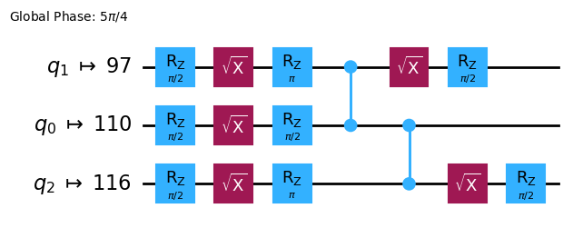

```python
mapped_observables = [
    observable.apply_layout(isa_circuit.layout) for observable in observables
]
print(mapped_observables)
```

```text
[SparsePauliOp(['IIIIIIIIIIIIIIIIZIIIIIZIIIIIIIIIIIIZIIIIIIIIIIIIIIIIIIIIIIIIIIIIIIIIIIIIIIIIIIIIIIIIIIIIIIIIIIIIIIIIIIIIIIIIIIIIIIIIIIIIIIIIIIIIIIIII'],
              coeffs=[1.+0.j]), SparsePauliOp(['IIIIIIIIIIIIIIIIZIIIIIXIIIIIIIIIIIIZIIIIIIIIIIIIIIIIIIIIIIIIIIIIIIIIIIIIIIIIIIIIIIIIIIIIIIIIIIIIIIIIIIIIIIIIIIIIIIIIIIIIIIIIIIIIIIIII'],
              coeffs=[1.+0.j]), SparsePauliOp(['IIIIIIIIIIIIIIIIZIIIIIIIIIIIIIIIIIIIIIIIIIIIIIIIIIIIIIIIIIIIIIIIIIIIIIIIIIIIIIIIIIIIIIIIIIIIIIIIIIIIIIIIIIIIIIIIIIIIIIIIIIIIIIIIIIIII'],
              coeffs=[1.+0.j]), SparsePauliOp(['IIIIIIIIIIIIIIIIXIIIIIIIIIIIIIIIIIIXIIIIIIIIIIIIIIIIIIIIIIIIIIIIIIIIIIIIIIIIIIIIIIIIIIIIIIIIIIIIIIIIIIIIIIIIIIIIIIIIIIIIIIIIIIIIIIIII'],
              coeffs=[1.+0.j]), SparsePauliOp(['IIIIIIIIIIIIIIIIZIIIIIIIIIIIIIIIIIIZIIIIIIIIIIIIIIIIIIIIIIIIIIIIIIIIIIIIIIIIIIIIIIIIIIIIIIIIIIIIIIIIIIIIIIIIIIIIIIIIIIIIIIIIIIIIIIIII'],
              coeffs=[1.+0.j]), SparsePauliOp(['IIIIIIIIIIIIIIIIIIIIIIIIIIIIIIIIIIIIIIIIIIIIIIIIIIIIIIIIIIIIIIIIIIIIIIIIIIIIIIIIIIIIIIIIIIIIIIIIIIIIIIIIIIIIIIIIIIIIIIIIIIIIIIIIIIIII'],
              coeffs=[1.+0.j])]
```

## 2.3 양자 Primitive를 사용하여 실행하기 {#23-execute-using-the-quantum-primitives}

양자 컴퓨터는 무작위 결과를 생성할 수 있으므로, 보통 Circuit을 여러 번 실행하여 출력값의 샘플을 수집합니다. `Estimator` 클래스를 사용하여 관측량의 기댓값을 추정할 수 있습니다. `Estimator`는 두 가지 [Primitive](https://docs.quantum.ibm.com/guides/get-started-with-primitives) 중 하나이며, 나머지 하나는 양자 컴퓨터에서 데이터를 가져오는 데 사용할 수 있는 `Sampler`입니다. 이 객체들은 [primitive unified bloc(PUB)](https://docs.quantum.ibm.com/guides/primitives#sampler)을 사용하여 선택된 Circuit, 관측량, 파라미터(해당하는 경우)를 실행하는 `run()` 메서드를 가지고 있습니다.
실제 양자 하드웨어에서 이 코드를 실행할 때는 양자 컴퓨터 고유의 노이즈를 줄이기 위해 [오류 완화 및 억제 기법](https://quantum.cloud.ibm.com/docs/en/guides/error-mitigation-and-suppression-techniques)을 적용하는 것을 고려해 보세요.

```python
# Construct the Estimator instance.
estimator = Estimator(mode=backend)
estimator.options.resilience_level = 1
estimator.options.default_shots = 5000
```

Estimator Primitive를 사용하여 작업을 제출합니다.

```python
# One pub, with one circuit to run against six different observables.
job = estimator.run([(isa_circuit, mapped_observables)]) 

# Use the job ID to retrieve your job data later
print(f">>> Job ID: {job.job_id()}")
```

```text
>>> Job ID: 97ecd036-1767-49b0-a1dc-c71638c3c3c4
```

```text
/Users/jma/miniconda3/envs/3122/lib/python3.12/site-packages/qiskit_ibm_runtime/fake_provider/local_service.py:187: UserWarning: The resilience_level option has no effect in local testing mode.
  warnings.warn("The resilience_level option has no effect in local testing mode.")
```

작업이 제출된 후, 현재 Python 인스턴스에서 작업이 완료될 때까지 기다리거나, `job_id`를 사용하여 나중에 데이터를 가져올 수 있습니다. (자세한 내용은 [작업 검색 섹션](https://docs.quantum.ibm.com/guides/monitor-job#retrieve-job-results-at-a-later-time)을 참고하세요.)

작업이 완료된 후, 작업의 `result()` 속성을 통해 출력값을 확인합니다.

```python
# This is the result of the entire submission.  You submitted one Pub,
# so this contains one inner result (and some metadata of its own).
job_result = job.result()

# This is the result from our single pub, which had six observables,
# so contains information on all six.
pub_result = job.result()[0]
```

이제 `Sampler` Primitive를 사용하여 Circuit을 실행할 수도 있습니다.

```python
# We include the measurements in the circuit
qc.measure_all()
sampler = Sampler(mode=backend)
```

```python
qc.draw(output="mpl")
```


Sampler Primitive를 사용하여 작업을 제출합니다.

```python
job_sampler = sampler.run(pm.run([qc]))

# Use the job ID to retrieve your job data later
print(f">>> Job ID: {job_sampler.job_id()}")
# Get the results
results_sampler = job_sampler.result()
```

```text
>>> Job ID: a6ee4d2f-c80d-4a86-9a76-e4b1a74502e7
```
## 2.4 결과 분석 {#24-analyze-the-results}

분석 단계는 일반적으로 측정 오류 완화(measurement error mitigation)나 제로 노이즈 외삽(ZNE, zero noise extrapolation) 등을 사용해 결과를 후처리하는 단계입니다. 이 결과를 추가 분석을 위해 다른 워크플로에 전달하거나, 핵심 값과 데이터를 시각화할 수도 있습니다. 일반적으로 이 단계는 풀고자 하는 문제에 따라 달라집니다. 이 예제에서는 Circuit에 대해 측정된 각 기댓값을 플롯합니다.

Estimator에 지정한 관측량의 기댓값과 표준편차는 job 결과의 `PubResult.data.evs` 및 `PubResult.data.stds` 속성을 통해 접근할 수 있습니다. Sampler의 결과를 얻으려면 `PubResult.data.meas.get_counts()` 함수를 사용하세요. 이 함수는 비트 문자열을 키로, 카운트를 값으로 하는 `dict`를 반환합니다. 자세한 내용은 [Sampler 시작하기](https://docs.quantum.ibm.com/guides/get-started-with-primitives#get-started-with-sampler)를 참고하세요.

```python
# Plot the result
from matplotlib import pyplot as plt
values = pub_result.data.evs
errors = pub_result.data.stds
# plotting graph
# Plotting with error bars
plt.errorbar(observables_labels, values, yerr=errors, fmt='-o', capsize=5)
plt.xlabel("Observables")
plt.ylabel("Values")
plt.title("Plot of Observables vs Values with Error Bars")
plt.grid(True)
plt.tight_layout()
plt.show()
```

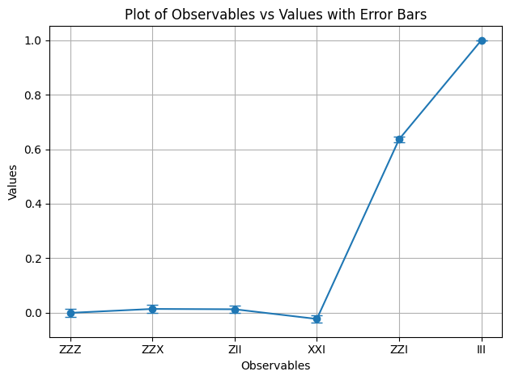

$ZZI$와 $III$의 기댓값이 1임을 확인할 수 있습니다. $ZZI$는 두 개의 마이너스 부호가 상쇄되고, $III$은 항등 연산자로 GHZ 상태를 변화시키지 않기 때문입니다. 나머지 관측량의 기댓값은 0인데, 이는 $Z$ 연산자가 홀수 개의 마이너스 부호를 도입하거나, $X$ 연산자가 여러 Qubit을 뒤집어 겹치는 상태들이 직교하게 되기 때문입니다.

이제 Sampler의 결과를 플롯합니다.

```python
counts_list = results_sampler[0].data.meas.get_counts()
print(counts_list)
print(f"Outcomes : {counts_list}")
display(plot_histogram(counts_list, title="GHZ state"))
```

```text
{'111': 480, '000': 503, '101': 8, '100': 9, '001': 3, '011': 6, '010': 10, '110': 5}
Outcomes : {'111': 480, '000': 503, '101': 8, '100': 9, '001': 3, '011': 6, '010': 10, '110': 5}
```

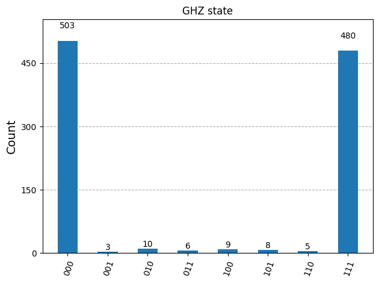

## 2.5 대규모 Qubit으로 확장하기 {#25-scale-to-large-numbers-of-qubits}

양자 컴퓨팅에서 유틸리티 규모의 작업은 분야의 발전을 위해 매우 중요합니다. 이러한 작업은 훨씬 더 큰 규모의 계산을 필요로 하며, 100개 이상의 Qubit과 1000개 이상의 Gate를 사용하는 Circuit을 다루게 됩니다. 이 예제에서는 GHZ 문제를 $n=10$ Qubit으로 확장하는 작은 첫걸음을 내딛습니다. Qiskit 패턴 워크플로를 사용하며, 최종적으로 기댓값 $\langle Z_0 Z_i \rangle$를 측정합니다.

### Step 1. 문제 매핑 {#step-1-map-the-problem}

$n$-Qubit GHZ 상태(본질적으로 확장된 Bell 상태)를 준비하는 `QuantumCircuit`을 반환하는 함수를 작성하고, 그 함수를 사용해 10-Qubit GHZ 상태를 준비한 후 측정할 관측량을 수집합니다.

```python
def get_qc_for_n_qubit_GHZ_state(n: int) -> QuantumCircuit:

    qc = QuantumCircuit(n) 
    qc.h(0)
    for i in range(n-1):
        qc.cx(i, i+1)
    return qc
n = 10
qc_n_GHZ = get_qc_for_n_qubit_GHZ_state(n)
qc_n_GHZ.draw("mpl")
```


다음으로 관심 있는 연산자를 매핑합니다. 이 예제에서는 Qubit 간 거리가 멀어질수록의 동작을 살펴보기 위해 Qubit 사이의 `ZZ` 연산자를 사용합니다. 거리가 먼 Qubit 간의 기댓값이 점점 부정확해진다면(손상된다면) 존재하는 노이즈 수준을 알 수 있습니다.

```python
# ZZII...II, ZIZI...II, ... , ZIII...IZ
operator_strings = [
    "Z" + i * "I" + "Z" + "I" * (n-i-2) for i in range(n-1) 
]
print(operator_strings)
print(len(operator_strings))

operators = [SparsePauliOp(operator) for operator in operator_strings]
```

```text
['ZZIIIIIIII', 'ZIZIIIIIII', 'ZIIZIIIIII', 'ZIIIZIIIII', 'ZIIIIZIIII', 'ZIIIIIZIII', 'ZIIIIIIZII', 'ZIIIIIIIZI', 'ZIIIIIIIIZ']
9
```

### Step 2. 양자 Backend 실행을 위한 문제 최적화 {#step-2-optimize-the-problem-for-execution-on-quantum-backend}

Circuit과 관측량을 Backend의 ISA에 맞게 변환합니다.

```python
# Convert to an ISA circuit and layout-mapped observables.
pm = generate_preset_pass_manager(backend=backend, optimization_level=2)
isa_circuit = pm.run(qc_n_GHZ) 
isa_operators_list = [operator.apply_layout(isa_circuit.layout) for operator in operators]
```

### Step 3. Backend에서 실행 {#step-3-execute-on-backend}

Job을 제출하고, 하드웨어에서 실행하는 경우 [동적 디커플링(dynamical decoupling)](https://docs.quantum.ibm.com/api/qiskit-ibm-runtime/options-dynamical-decoupling-options)이라는 오류 억제 기법을 사용해 오류를 줄입니다. 복원력 레벨(resilience level)은 오류에 대한 복원력을 얼마나 높일지를 지정합니다. 레벨이 높을수록 더 정확한 결과를 얻을 수 있지만, 처리 시간이 더 오래 걸립니다. 아래 코드에서 설정한 옵션에 대한 자세한 설명은 [Qiskit Runtime 오류 완화 설정](https://docs.quantum.ibm.com/guides/configure-error-mitigation)을 참고하세요.

```python
# Submit the circuit to Estimator
job = estimator.run([(isa_circuit, isa_operators_list)])
job_id = job.job_id()
```

```text
/Users/jma/miniconda3/envs/3122/lib/python3.12/site-packages/qiskit_ibm_runtime/fake_provider/local_service.py:187: UserWarning: The resilience_level option has no effect in local testing mode.
  warnings.warn("The resilience_level option has no effect in local testing mode.")
```

### Step 4. 결과 후처리 {#step-4-post-process-results}

실제 하드웨어에서 얽힌 양자 상태의 동작을 더 잘 이해하기 위해, Z 기저에서 Qubit 간의 쌍별 상관관계를 분석합니다. 구체적으로, Qubit 0이 각 Qubit i와 얼마나 강하게 상관되어 있는지를 측정하는 기댓값 ⟨Z₀Zᵢ⟩를 살펴봅니다. 특히 다음 값을 플롯합니다.
$$
\langle Z_i Z_0 \rangle / \langle Z_1 Z_0 \rangle 
$$
<div class="alert alert-success">

플롯에서 $\langle Z_i Z_0 \rangle / \langle Z_1 Z_0 \rangle $의 값이 어떻게 나타날 것으로 예상하나요?

선택지:

a) $i$가 증가할수록 감소한다

b) 1로 일정하다

c) 1 근처에서 작은 편차를 보인다

d) $i$의 홀수/짝수 값에 따라 1과 0이 교대로 나타난다

</div>

```python
data = list(range(1, len(operators) + 1))  # Distance between the Z operators
result = job.result()[0]
values = result.data.evs  # Expectation value at each Z operator.
values = [
    v / values[0] for v in values
]  # Normalize the expectation values to evaluate how they decay with distance.

plt.plot(data, values, marker="o", label=f"{n}-qubit GHZ state")
plt.xlabel("Distance between qubits $i$")
plt.ylabel(r"$\langle Z_i Z_0 \rangle / \langle Z_1 Z_0 \rangle $")
plt.legend()
plt.show()
```

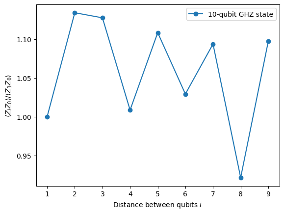

이 플롯에서 이상적인 시뮬레이션에서는 모든 $\langle Z_0 Z_i \rangle$가 1이어야 하지만, $\langle Z_0 Z_i \rangle$가 값 1 근처에서 변동하는 것을 확인할 수 있습니다.

보시다시피, 10 Qubit 실험의 결과는 좋지만 여전히 일부 오류가 있습니다. 결과를 개선하는 한 가지 방법은 GHZ 상태를 더 효율적으로 구현하는 것입니다.

일반적으로 GHZ 상태는 계단식 CNOT Gate 시퀀스로 구현합니다. 하지만 2-Qubit 깊이를 `n`에서 `n/2` 이하로 줄이는, 더 효율적인 방법으로 GHZ 상태를 구현할 수 있습니다.
<div class="alert alert-info">

Circuit의 결과가 얼마나 정확할지, 또는 노이즈가 얼마나 적을지를 벤치마킹하는 중요한 지표 중 하나는 2-Qubit Gate 깊이입니다. 2-Qubit Gate의 오류율이 단일 Qubit Gate보다 약 10배 높기 때문에, 전체 Circuit의 오류를 지배하게 됩니다. 다음 코드를 사용하여 Circuit의 2-Qubit Gate 깊이를 구할 수 있습니다.

```
qc.depth(lambda x: x.operation.num_qubits == 2)
```

</div>

```python
def better_ghz(n):
    "fan out"
    s = int(n / 2)
    qc = QuantumCircuit(n)
    qc.h(s)
    for m in range(s, 0, -1):
        qc.cx(m, m - 1)
        if not (n % 2 == 0 and m == s): 
            qc.cx(n - m - 1, n - m)
    return qc

better_ghz(n).draw("mpl")
```


```python
# Check 2-qubit gate depth before transpilation
qc_better_ghz = better_ghz(n)
qc_better_ghz.depth(lambda x: x.operation.num_qubits == 2)
```

```text
5
```

여기서 흥미로운 점은, 다른 방식으로 프로그래밍하는 방법을 생각해냄으로써 실행하려는 Circuit의 [**양자 깊이(quantum depth)**](https://www.youtube.com/watch?v=7AVIc7SkX3M)를 줄일 수 있었다는 것입니다. 하지만 이런 영리한 트릭에 의존할 수 없는 상황과 알고리즘도 있습니다. 이런 경우에 Transpiler가 유용하게 활용됩니다. Transpiler는 이러한 모든 측면을 효율적으로 최적화해 주므로, 우리가 너무 많이 걱정할 필요가 없습니다.
# 3. 정보 인코딩 {#3-encoding-information}
## 3.1 진폭 인코딩 {#31-amplitude-encoding}

이제 양자 Circuit을 구성하는 방법을 살펴보았으니, 고전 정보를 양자 상태로 인코딩하는 방법을 탐구해 보겠습니다. 강력한 방법 중 하나는 진폭 인코딩(amplitude encoding)으로, 양자 상태의 진폭이 고전 벡터의 구성 요소를 나타냅니다.

간단한 예시를 살펴보겠습니다. 고전 벡터를 인코딩하고 싶다고 가정해 보세요.

$$
\vec{x} = \begin{bmatrix} x_0 \\ x_1 \\ x_2 \\ x_3 \end{bmatrix}
$$

를 두 개의 Qubit 양자 상태로 인코딩하는 것이 목표입니다. 목표는 다음 양자 상태를 준비하는 것입니다:

$$
\ket{\psi} = x_0\ket{00} + x_1\ket{01} + x_2\ket{10} + x_3\ket{11}
$$
여기서 $ x_0, x_1, x_2, x_3 \in \mathbb{R} $ (또는 $ \mathbb{C} $)이고, 벡터는 다음과 같이 정규화되어 있습니다:

$$
|x_0|^2 + |x_1|^2 + |x_2|^2 + |x_3|^2 = 1
$$

이제 특정 예시를 고려해 보겠습니다: $ \vec{x} = [0.8924,  0.3696, 0.2391, 0.0990] $

그러면 해당 양자 상태는 다음과 같습니다:

$$
\begin{aligned}
\ket{\psi} &= 0.8924\,\ket{00}
+ 0.3696\,\ket{01}
+ 0.2391\,\ket{10}
+ 0.0990\,\ket{11}
\end{aligned}
$$
이 상태는 Qubit 0과 1에 대해 각각 $\pi/6$ 및 $\pi/4$ 각도의 회전 Gate $R_y$의 조합을 사용하여 준비할 수 있습니다.

```python
from qiskit import QuantumCircuit
from qiskit_aer import AerSimulator
import numpy as np

qc = QuantumCircuit(2)

qc.ry(np.pi / 6, 0)
qc.ry(np.pi / 4, 1)

simulator = AerSimulator()
qc.save_statevector()
result = simulator.run(qc).result()
statevector = result.get_statevector()

print("Statevector:", statevector)
qc.draw(output="mpl")
```

```text
Statevector: Statevector([0.8923991 +0.j, 0.23911762+0.j, 0.36964381+0.j,
             0.09904576+0.j],
            dims=(2, 2))
```


```python
from qiskit.quantum_info import Statevector

# Define our vector
v = np.array([0.8924,  0.3696, 0.2391, 0.0990]) 
v = v/np.linalg.norm(v)
# Create a statevector from the vector
state = Statevector(v)

# Initialize a quantum circuit with 2 qubits
qc = QuantumCircuit(2)
qc.initialize(state.data, [0, 1])

# Optional: simulate the state
print("Statevector:", state)

# Visualize the circuit
qc.decompose().decompose().decompose().decompose().decompose().draw("mpl")
```

```text
Statevector: Statevector([0.89242154+0.j, 0.36960892+0.j, 0.23910577+0.j,
             0.09900239+0.j],
            dims=(2, 2))
```


이로써 회전 Gate를 사용하여 정보를 인코딩하는 방법을 살펴보았습니다.
## 3.2 각도 인코딩과 매개변수화된 Circuit {#32-angle-encoding-and-parametrized-circuits}

양자 컴퓨터에 정보를 인코딩하는 특히 흥미로운 방법은, 특정 함수 집합 $f(\vec{\theta})$를 나타낼 수 있도록 조정 가능한 회전 각도 $\vec{\theta}$ 또는 매개변수를 포함하는 양자 Circuit을 설계하는 것입니다. 예를 들어, 다음과 같은 매개변수화된 양자 Circuit을 고려해 보겠습니다:

```python
from qiskit import QuantumCircuit
from qiskit.circuit import Parameter

# Define a symbolic parameter
theta = Parameter("θ")

qc = QuantumCircuit(2)
# We applied a parametrized RX gate
qc.rx(theta, 0)
qc.cx(0, 1)
qc.draw("mpl")
```


수학적으로, 이 Circuit으로 나타낼 수 있는 함수 집합을 분석할 수 있습니다:

$$ 
\text{CNOT}_{01} \, R_x^{\{0\}}(\theta) |00\rangle = \text{CNOT}_{01} \left( \cos(\theta/2)\ket{00} - i\sin(\theta/2)\ket{10} \right) = \cos(\theta/2)\ket{00} - i\sin(\theta/2)\ket{11}
$$
이 양자 Circuit으로 나타낼 수 있는 상태의 수는 제한적임이 분명합니다. 예를 들어 $\ket{10}$ 또는 $\ket{01}$ 상태는 표현할 수 없습니다. 하지만 적절한 위치에 더 많은 회전을 추가하면 나타낼 수 있는 상태의 집합이 확장됩니다:

```python
from qiskit import QuantumCircuit
from qiskit.circuit import Parameter

# Define a symbolic parameter
theta1 = Parameter("θ1")
theta2 = Parameter("θ2")

qc = QuantumCircuit(2)
qc.rx(theta1, 0)
qc.rx(theta2, 1)
qc.cx(0, 1)
qc.draw("mpl")
```


이 경우, 나타낼 수 있는 양자 상태는 다음과 같습니다:

$$
\begin{align*}
\text{CNOT}_{01} \, R_x^{\{1}}(\theta_2) R_x^{\{0}}(\theta_1) \ket{00}
&= \text{CNOT}_{01} \, R_x^{\{1}}(\theta_2)\left( \cos(\theta_1/2)\ket{00} - i\sin(\theta_1/2)\ket{10} \right) \\
&= \text{CNOT}_{01}\left( \cos(\theta_1/2)\cos(\theta_2/2)\ket{00} - i\cos(\theta_1/2)\sin(\theta_2/2)\ket{01} \right. \\
&\quad \left. - i\sin(\theta_1/2)\cos(\theta_2/2)\ket{10} + \sin(\theta_1/2)\sin(\theta_2/2)\ket{11} \right) \\
&= \cos(\theta_1/2)\cos(\theta_2/2)\ket{00} - i\cos(\theta_1/2)\sin(\theta_2/2)\ket{01} \\
&\quad + \sin(\theta_1/2)\sin(\theta_2/2)\ket{10} - i\sin(\theta_1/2)\cos(\theta_2/2)\ket{11} 
\end{align*}
$$
이 Circuit은 이전 것에 비해 더 넓은 양자 상태 집합을 생성함을 알 수 있습니다. 특히, 이전 Circuit에서는 불가능했던 $\ket{01}$ 또는 $\ket{10}$에 대한 0이 아닌 진폭을 가진 상태를 이제 생성할 수 있습니다. 하지만 이 Circuit은 여전히 보편적인 양자 상태 생성기는 아닙니다. 그럼에도 특정 함수를 나타내는 데 있어 어느 정도의 유연성을 갖춘 Circuit을 설계할 만큼 충분히 표현력이 있을 수 있습니다. 일반적으로, 독립적인 매개변수(각도)를 더 많이 도입할수록 Circuit이 임의의 양자 상태를 근사하는 표현력이 높아집니다.
## Ansatz와 Circuit 라이브러리 {#ansatzes-and-circuit-library}

이러한 종류의 매개변수화된 양자 Circuit은 [Ansatz](https://quantum.cloud.ibm.com/learning/en/courses/quantum-chem-with-vqe/ansatz)를 구성하는 데 사용될 수 있습니다. Ansatz는 문제의 해를 근사하려는 시험 양자 상태입니다. 이 Ansatz는 [변분 양자 알고리즘(Variational Quantum Algorithms)](https://quantum.cloud.ibm.com/learning/en/courses/variational-algorithm-design/variational-algorithms)의 핵심 구성 요소로, 양자 컴퓨터를 사용하여 비용 함수를 평가하고 고전 최적화기를 사용하여 이를 최소화하는 하이브리드 양자-고전 알고리즘의 한 분류입니다. 이 주제들에 대해서는 이후 단원에서 자세히 다루겠지만, 지금은 [Qiskit의 Circuit 라이브러리](https://quantum.cloud.ibm.com/docs/en/api/qiskit/circuit_library)를 사용하여 간단한 Ansatz를 구성하는 방법을 소개하겠습니다.

```python
from qiskit.circuit.library import efficient_su2

SU2_ansatz = efficient_su2(4, su2_gates=["rx", "y"], entanglement="linear", reps=1)
SU2_ansatz.decompose().draw(output="mpl")
```

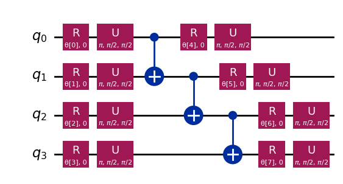

`qiskit.circuit.library`의 `efficient_su2` 함수를 사용하여 간단한 Ansatz를 구성하는 방법을 살펴보았습니다. 이 Ansatz는 매개변수 $\vec{\theta}$를 조정하여 광범위한 양자 상태를 생성할 수 있습니다.
# 결론 {#conclusion}

이 노트북에서는 양자 Gate 구성부터 관측값 정의 및 측정에 이르기까지 양자 Circuit을 구성하는 방법을 배웠고, 이러한 Circuit을 시뮬레이터와 실제 양자 하드웨어 모두에서 효율적으로 실행하는 방법도 살펴보았습니다. 또한 실제 양자 장치에서 작업할 때 오류를 최소화하기 위한 신중한 Circuit 설계의 중요성과 GHZ 상태 예시를 통한 더 많은 Qubit으로의 Circuit 확장 전략도 확인했습니다. 나아가 진폭 인코딩 및 각도 인코딩을 포함하여 고전 정보를 양자 상태로 인코딩하는 다양한 기법을 탐구했습니다. 이 모든 것을 바탕으로, 이제 다음 세션으로 넘어가 양자 알고리즘 작업을 시작할 준비가 완벽히 갖추어졌습니다.
## VSCode에 Qiskit 코드 어시스턴트 설치하기 {#installing-qiskit-code-assistant-in-vscode}
[링크](https://quantum.cloud.ibm.com/docs/en/guides/qiskit-code-assistant-vscode)를 클릭하고 안내에 따라 진행하세요.

# 보너스: 양자 텔레포테이션 {#bonus-quantum-teleportation}
양자 텔레포테이션이라는 용어를 들으면, 물체를 한 곳에서 분해하여 멀리 떨어진 곳에 재현하는 미래적인 SF 기술을 떠올릴 수 있습니다. 하지만 양자 텔레포테이션은 그런 것과는 전혀 다릅니다. 실제로 텔레포테이션되는 것은 물질이 아니라 정보입니다.

양자 텔레포테이션은 Qubit의 양자 상태를 한 위치에서 다른 위치로 전송할 수 있게 해주는 프로토콜입니다. 이 전송은 순간적으로 이루어지는 것처럼 보이지만, 물리 법칙을 위반하지 않습니다. 어떻게 가능할까요? 자세히 살펴보겠습니다!

양자 텔레포테이션은 송신자(Alice)가 두 가지 핵심 자원을 사용하여 Qubit `q`의 상태 $|\psi\rangle$를 수신자(Bob)에게 전달할 수 있게 해주는 프로토콜입니다. 두 가지 자원은 공유된 얽힘 Qubit 쌍 `a`와 `b`, 그리고 두 비트의 고전적 통신 `c0`와 `c1`입니다.

이 프로토콜에 필요한 것은 다음과 같습니다:
*   `q`: Alice의 Qubit으로, 초기에 텔레포테이션하려는 상태 $|\psi\rangle$에 있습니다.
*   `a`: Alice가 보유한 공유 얽힘 쌍의 절반.
*   `b`: Bob이 보유한 공유 얽힘 쌍의 절반.
*   `c0`, `c1`: Alice의 측정 결과를 저장하는 고전 비트.

그렇다면 어떻게 작동할까요? 워크플로우는 다음과 같습니다.

1.  **`q`에 Alice의 상태 $|\psi\rangle$ 준비.** 검증을 위해 $|+\rangle$와 같은 특정 상태를 생성합니다.
2.  **얽힘 생성:** `a`와 `b` 사이에 Bell 쌍을 생성합니다.
3.  **Alice의 연산:** Alice는 자신의 두 Qubit(`q`와 `a`)에 "Bell 측정"을 수행하고 고전적 결과를 `c0`와 `c1`에 저장합니다.
4.  **고전적 통신:** Alice는 자신의 두 고전 비트(`c0`, `c1`)를 Bob에게 전송합니다.
5.  **Bob의 수정:** Bob은 자신이 받은 `c0`와 `c1`의 값에 따라 자신의 Qubit(`b`)에 특정 양자 Gate(X 및/또는 Z)를 적용합니다.

모든 것이 올바르게 수행되면, Bob의 Qubit `b`는 Alice의 원래 `q` 상태인 $|\psi\rangle$로 끝나게 됩니다!

양자 텔레포테이션에 대한 더 심층적인 설명과 탐구, 이 프로토콜이 왜 작동하는지에 대한 수학적 설명을 포함한 내용은 IBM Quantum Learning 리소스를 참조할 수 있습니다: [양자 텔레포테이션](https://quantum.cloud.ibm.com/learning/courses/basics-of-quantum-information/entanglement-in-action/quantum-teleportation). 이는 [양자 정보의 기초](https://quantum.cloud.ibm.com/learning/courses/basics-of-quantum-information) 과정의 일부입니다.

```python

import matplotlib.pyplot as plt
from qiskit import QuantumCircuit, QuantumRegister, ClassicalRegister
from qiskit_aer import AerSimulator
from qiskit.visualization import plot_histogram, plot_bloch_multivector

# Define individual quantum registers for each qubit
q = QuantumRegister(1, name='q')  # message qubit
a = QuantumRegister(1, name='a')  # Alice's entangled qubit
b = QuantumRegister(1, name='b')  # Bob's entangled qubit

# Classical register for Alice's measurements
cr_alice = ClassicalRegister(2, name='c_alice')

# Create quantum circuit
teleport_qc = QuantumCircuit(q, a, b, cr_alice, name='Teleportation')

# Step 1: Prepare message state |+⟩ on q
teleport_qc.h(q[0])
teleport_qc.barrier()

# Step 2: Create entanglement between a and b
teleport_qc.h(a[0])
teleport_qc.cx(a[0], b[0])
teleport_qc.barrier()

# Step 3: Alice's Bell measurement
teleport_qc.cx(q[0], a[0])
teleport_qc.h(q[0])
teleport_qc.barrier()

# Step 4: Alice measures q and a
teleport_qc.measure(q[0], cr_alice[0])
teleport_qc.measure(a[0], cr_alice[1])
teleport_qc.barrier()

# Step 5: Bob's conditional measurements
with teleport_qc.if_test((cr_alice[1], 1)):
    teleport_qc.x(b[0])
with teleport_qc.if_test((cr_alice[0], 1)):
    teleport_qc.z(b[0])

# Draw the circuit
teleport_qc.draw(output='mpl')
```

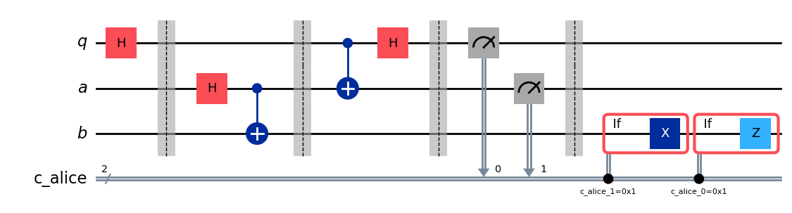

프로토콜을 실행한 후 핵심 질문이 생깁니다. 텔레포테이션이 성공했는지 어떻게 확인할 수 있을까요? 프로토콜 이후 Bob의 Qubit 상태를 직접 '볼' 수는 없습니다. 하지만 Alice의 초기 상태 $|\psi\rangle$를 우리가 *준비했기* 때문에($|+\rangle$를 선택했습니다), 특별한 종류의 시뮬레이션을 사용하여 Bob의 Qubit `b`가 그 동일한 상태로 끝났는지 확인할 수 있습니다.

`save_statevector`가 적용된 `AerSimulator`를 사용하여 Bob의 Qubit `b`가 Alice의 원래 상태($|+\rangle$)로 끝났는지 확인하겠습니다. 이 시뮬레이터는 최종 양자 상태 벡터를 계산합니다.
그런 다음 `plot_bloch_multivector`를 사용하여 Alice의 초기 상태(`q`)와 비교하여 Bob의 Qubit(`b`)를 시각화합니다.

```python
# Simulate the teleportation circuit
sv_simulator = AerSimulator(method='statevector')
teleport_qc_sv = teleport_qc.copy()
teleport_qc_sv.save_statevector()

# Execute the circuit on the statevector simulator
job_sv = sv_simulator.run(teleport_qc_sv)
result_sv = job_sv.result()

# Get the final statevector
final_statevector = result_sv.get_statevector()
print("Visualizing final qubit states:")
display(plot_bloch_multivector(final_statevector))
print("Note that Alice's qubits have collapsed to |00⟩, |01⟩, |10⟩, or |11⟩, while Bob's qubit is in the original state |+⟩.")
```

```text
Visualizing final qubit states:
```


```text
Note that Alice's qubits have collapsed to |00⟩, |01⟩, |10⟩, or |11⟩, while Bob's qubit is in the original state |+⟩.
```

시각화에서 볼 수 있듯이, Alice에 속한 첫 번째 두 Qubit은 0 또는 1로 붕괴되었습니다. 한편, 세 번째 블로흐 구(Bloch sphere)로 표현된 Bob의 세 번째 Qubit은 x축을 향해 있어 $|+\rangle$ 상태임을 나타내므로, 양자 텔레포테이션 프로토콜을 성공적으로 구현했습니다!

### 요약 {#summary}

이 시점에서 우리가 달성한 것을 간략히 요약하겠습니다:
- Alice는 *알 수 없는 양자 상태*를 Bob에게 전달했습니다.
- 어떠한 물리적 입자도 전송되지 않았습니다.
- Alice의 Qubit에 있던 원래 상태는 파괴되었으며, 이는 복제 불가 정리(No-Cloning theorem)에 부합합니다.
