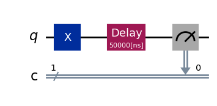
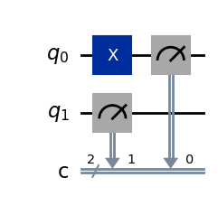

{/* doqumentation-source-hash: baae5bd5 */}

<OpenInLabBanner notebookPath="workshop/06_divincenzo_criteria_lab-2.ipynb" />

## 소개 {#introduction}

물리학자 David DiVincenzo는 양자 컴퓨터의 물리적 구현에 필요한 다섯 가지 핵심 요건과 양자 통신을 위한 두 가지 추가 기준을 제시했습니다. 이 노트북에서는 **실제 Qiskit 데모를 통해 각 DiVincenzo 기준을 직접 체험**합니다. 이론을 깊이 파고들기보다는, 각 섹션에서 기준 하나를 간단히 설명한 뒤 Qiskit 2를 활용한 코드 실습을 제공합니다. 시뮬레이터와 실제 IBM Quantum 디바이스에서 Circuit을 실행하며 **각 원리를 직접 탐구**해 볼 수 있습니다.

**DiVincenzo의 양자 계산을 위한 다섯 가지 기준**:

1. **특성이 잘 파악된 Qubit을 갖춘 확장 가능한 물리 시스템.**
2. **Qubit 초기화 능력** — 간단한 기준 상태(예: |00…0〉)로 설정 가능해야 합니다.
3. **긴 결맞음 시간** — Qubit의 결맞음 시간이 Gate 연산 시간보다 훨씬 길어야 합니다.
4. **범용 양자 Gate 집합** — 임의의 유니터리 연산을 수행할 수 있어야 합니다.
5. **Qubit별 측정 기능** — 각 Qubit의 상태를 읽어낼 수 있어야 합니다.

*(DiVincenzo는 양자 통신을 위한 두 가지 기준도 제시했습니다: 정지 Qubit과 "비행(flying)" Qubit을 상호 변환하는 능력, 그리고 비행 Qubit을 위치 간에 신뢰성 있게 전송하는 능력. 이 두 가지는 이 노트북 끝의 권장 활동에 포함되어 있습니다.)*

이후의 각 섹션은 하나의 기준에 대응합니다. Qiskit을 사용해 코드와 **대화형 실험**으로 개념을 설명합니다. 예를 들어, Qubit 수와 Circuit 깊이를 늘리면 결과에 어떤 영향을 주는지(기준 1), Qubit 상태를 초기화하는 방법(기준 2), 시뮬레이터와 실제 디바이스에서 Qubit을 측정하는 방법(기준 4), Qiskit이 범용 Gate를 구성하는 방식(기준 3), 그리고 유한한 결맞음(T₁, T₂)이 계산에 미치는 영향(기준 5)을 살펴봅니다. 이 과정을 통해 각 DiVincenzo 기준이 실제로 무엇을 의미하는지, 그리고 Qiskit이 어떻게 이를 실험할 수 있게 해주는지에 대한 직관을 더욱 깊이 쌓을 수 있습니다.

```python
# Added by doQumentation — required packages for this notebook
!pip install -q numpy
```

```python
# Install necessary packages
!pip install qiskit[visualization] qiskit-ibm-runtime qiskit-aer qiskit_ibm_runtime
```

## 1. 기준 1 – 확장 가능하고 특성이 잘 파악된 Qubit {#1-criterion-1--scalable-well-characterized-qubits}

**기준 1:** *"특성이 잘 파악된 Qubit을 갖춘 확장 가능한 물리 시스템."* 이는 Qubit 수를 **늘려도** 안정적으로 제어할 수 있는 양자 하드웨어 플랫폼이 필요하다는 의미입니다. 각 Qubit의 특성(에너지 레벨, 오류율, 연결성 등)이 잘 파악되어 있어야 합니다. 본질적으로, 시스템이 고장 나지 않으면서 더 큰 Circuit을 구성할 수 있어야 합니다. 실제로 Qubit 수나 Circuit 깊이를 늘리면 오류와 결어긋남(decoherence)이 누적되므로, *확장성*을 입증한다는 것은 규모 증가가 성능에 어떤 영향을 미치는지 이해하는 것도 포함합니다.

**데모 목표:** Qiskit을 사용하여 Circuit 규모(Qubit 수 또는 Gate 깊이) 증가가 출력 충실도에 미치는 영향을 보여줍니다. 이상적인 경우와 잡음이 있는 경우를 시뮬레이션하여, 시스템이 커지거나 Circuit이 깊어질수록 어떻게 결어긋남과 오류에 취약해지는지 살펴보겠습니다.

먼저, 3-Qubit GHZ 상태와 5-Qubit GHZ 상태를 구성하여 간단한 확장성 테스트를 수행합니다. *n*-Qubit GHZ 상태는 $\frac{1}{\sqrt{2}}(|0...0\rangle + |1...1\rangle)$입니다. 이상적인 시뮬레이션에서 n-Qubit GHZ를 측정하면 모든 0 또는 모든 1의 두 가지 결과만 같은 확률로 나옵니다. **이상적인 출력**과 n 또는 Circuit 깊이를 늘렸을 때의 **잡음이 있는 출력**을 비교해 봅니다.

```python
from qiskit import QuantumCircuit
from qiskit_aer import AerSimulator
from qiskit.visualization import plot_histogram
from qiskit.transpiler.preset_passmanagers import generate_preset_pass_manager
from qiskit_ibm_runtime import SamplerV2 as Sampler

# 3-qubit GHZ circuit
qc3 = QuantumCircuit(3, 3)
qc3.h(0)
qc3.cx(0, 1)
qc3.cx(1, 2)
qc3.measure([0, 1, 2], [0, 1, 2])

# 5-qubit GHZ circuit (scaling up the number of qubits)
qc5 = QuantumCircuit(5, 5)
qc5.h(0)
qc5.cx(0, range(1, 5))    # entangle qubit 0 with all others
qc5.measure(range(5), range(5))

# Transpile for a simulator backend
sim_backend = AerSimulator()
pm = generate_preset_pass_manager(backend=sim_backend, optimization_level=1)
isa_qc3 = pm.run(qc3)
isa_qc5 = pm.run(qc5)

# Run ideal simulations (no noise)
sampler = Sampler(mode=sim_backend)

job3 = sampler.run([isa_qc3], shots=1024)
result3 = job3.result()
counts3 = result3[0].data.c.get_counts()

job5 = sampler.run([isa_qc5], shots=1024)
result5 = job5.result()
counts5 = result5[0].data.c.get_counts()

print("3-qubit GHZ counts (ideal):", counts3)
plot_histogram(counts3, legend=['3-qubit ideal'], figsize=(6,4))
```

```text
3-qubit GHZ counts (ideal): {'000': 531, '111': 493}
```


```python
print("5-qubit GHZ counts (ideal):", counts5)
plot_histogram(counts5, legend=['5-qubit ideal'], figsize=(6,4))
```

```text
5-qubit GHZ counts (ideal): {'11111': 535, '00000': 489}
```


**예상 결과 (이상적인 경우):** 3-Qubit GHZ는 이상적으로 약 50%의 `000`과 50%의 `111` 카운트를 냅니다. 5-Qubit GHZ는 약 50%의 `00000`과 50%의 `11111`을 냅니다. 상태가 이상적으로 완전히 결맞음 상태이고 얽혀 있기 때문에 다른 비트열은 나타나지 않습니다. 각 Circuit에 대해 히스토그램에서 모두 0과 모두 1에 해당하는 두 개의 높은 막대를 볼 수 있어야 합니다.

다음으로, **잡음 환경**에서 어떤 일이 일어나는지 살펴봅니다. Qiskit Aer의 잡음 모델 기능을 사용하여 실제 디바이스의 오류를 흉내 냅니다. 예를 들어, IBM Backend의 특성을 가져와 Gate 오류, 유한한 Gate 시간, Qubit 이완(T₁), 위상 감쇠(T₂), 측정 오류 등을 포함하는 잡음 모델을 만들 수 있습니다. 여기서는 IBM Quantum Brisbane 디바이스를 나타내는 **가짜 Backend**를 사용해 잡음 모델을 생성하고, GHZ Circuit을 다시 실행해 봅니다.

### 연습 1a: 잡음 시뮬레이션 {#exercise-1a-simulate-with-noise}

아래 코드를 완성하여 `FakeBrisbane` Backend 기반의 잡음 시뮬레이터에서 GHZ Circuit을 시뮬레이션하세요. 이를 통해 현실적인 잡음 환경에서 시스템이 확장될수록 성능이 어떻게 저하되는지 확인할 수 있습니다.

```python
from qiskit_ibm_runtime.fake_provider import FakeBrisbane

# We will reuse the ideal circuits qc3 and qc5 and their results from the previous cell.

# --- YOUR CODE HERE ---

# 1. Create a fake backend for IBM Quantum Brisbane
###brisbane_backend = ...

# 2. Create a noisy AerSimulator from the fake backend's properties
###noisy_sim = ...

# 3. Transpile the circuits for the noisy simulator (this adapts them to the device's specific gates and connectivity)
###pm = ...

###isa_qc3_noisy = ...

###isa_qc5_noisy = ...

# 4. Run the noisy simulations using the Sampler and get the counts
###sampler = ...

###job3 = ...

###result3_noisy = ...

###counts3_noisy = ...

###job5 = ...

###result5_noisy = ...

###counts5_noisy = ...

# --- END YOUR CODE ---

# This part is done for you to print and plot the results:
print("3-qubit GHZ counts (noisy):", counts3_noisy)
plot_histogram(counts3_noisy, legend=['3-qubit noisy'], figsize=(6,4))
```

```python
print("5-qubit GHZ counts (noisy):", counts5_noisy)
plot_histogram(counts5_noisy, legend=['5-qubit noisy'], figsize=(6,4))
```

### 연습 1b: 실제 IBM Quantum 컴퓨터에서 실행하기 {#exercise-1b-run-on-real-ibm-quantum-computer}

아래 코드는 실제 IBM Quantum 컴퓨터에서 GHZ Circuit을 실행합니다. 이를 통해 실제 디바이스에서 성능이 어떻게 저하되는지 확인할 수 있습니다.

```python
# your_api_key = "deleteThisAndPasteYourAPIKeyHere"
# your_crn = "deleteThisAndPasteYourCRNHere"

# QiskitRuntimeService.save_account(
#     channel="ibm_quantum_platform",
#     token=your_api_key,
#     instance=your_crn,
#     name="fallfest-2025",
# )

# Check that the account has been saved properly
# service = QiskitRuntimeService(name="fallfest-2025")
# print(service.saved_accounts())

# We will reuse the ideal circuits qc3 and qc5 and their results from the previous cell.

from qiskit_ibm_runtime import QiskitRuntimeService

service = QiskitRuntimeService(name="fallfest-2025")
real_backend = service.least_busy(operational=True, simulator=False)
print("Running on " + real_backend.name)

pm = generate_preset_pass_manager(backend=real_backend, optimization_level=1)
isa_qc3r = pm.run(qc3)
isa_qc5r = pm.run(qc5)

sampler = Sampler(mode=real_backend)

job3r = sampler.run([isa_qc3r], shots=1024)
result3r = job3r.result()
counts3r = result3r[0].data.c.get_counts()

job5r = sampler.run([isa_qc5r], shots=1024)
result5r = job5r.result()
counts5r = result5r[0].data.c.get_counts()

print("3-qubit GHZ counts (real):", counts3r)
plot_histogram(counts3r, legend=['3-qubit real'], figsize=(6,4))
```

```python
print("5-qubit GHZ counts (real):", counts5r)
plot_histogram(counts5r, legend=['5-qubit real'], figsize=(6,4))
```

**예상 결과 (잡음 있음 vs 이상적):** 시뮬레이션 또는 실제 디바이스에서 잡음이 있으면 GHZ 상태가 **덜 완벽**해집니다. 모두 0과 모두 1 이외의 추가 결과가 나타납니다. 3-Qubit의 경우, `000`/`111`에서 100% 대신 Gate 오류나 결어긋남으로 인해 일부 확률이 다른 비트열(예: `001`, `010` 등)로 새어 나옵니다. 5-Qubit의 경우 효과가 더욱 두드러집니다. 더 큰 Circuit(더 많은 Qubit과 CNOT Gate)은 오류를 더 많이 누적하므로, 모두 0과 모두 1 피크가 낮아지고 다른 결과들이 많이 나타납니다. 이 경향은 *확장성*의 어려움을 보여줍니다: 규모를 키울수록 오류 수정 없이 높은 충실도를 유지하기가 더 어려워집니다.

**인사이트:** 확장 가능한 양자 컴퓨터는 시스템이 커져도 양자 상관관계를 보존해야 합니다. 예제들은 Qubit 수/Gate 깊이를 늘리면 잡음이 있을 때 결과 충실도가 떨어진다는 것을 보여줍니다. 나머지 기준들은 규모가 커져도 Qubit을 잘 작동하게(낮은 오류, 초기화 가능 등) 유지하는 방법을 다룹니다.

## 2. 기준 2 – Qubit 초기화 {#2-criterion-2--qubit-initialization}

**기준 2:** *"Qubit의 상태를 |000…〉 같은 간단한 기준 상태로 초기화하는 능력."* 모든 Qubit은 알려진 기준 상태(일반적으로 각 Qubit의 바닥 상태 |0〉)에서 신뢰성 있게 시작되어야 합니다. 초기화는 알고리즘이 깨끗한 상태에서 시작할 수 있도록 필수적입니다. 실제로 IBM 양자 디바이스에서는 각 Circuit 실행 시작 시 모든 Qubit이 자동으로 |0〉으로 초기화됩니다. Qiskit은 계산 중에 Qubit을 초기화하거나 사용자 정의 상태를 준비하는 명령도 제공합니다.

**데모 목표:** Qiskit에서 시작 시 및 Circuit 중간에 Qubit을 초기화하는 방법을 보여줍니다. `reset` 명령과 상태 준비 메서드 사용법을 시연합니다.

### 연습 2: 특정 상태 준비하기 {#exercise-2-prepare-a-specific-state}

아래 코드 블록에서 $|10\rangle$ 상태를 준비하도록 `QuantumCircuit`을 완성하세요. 즉, Qubit 0은 $|0\rangle$ 상태이고 Qubit 1은 $|1\rangle$ 상태여야 합니다. 적절한 Gate와 명령을 사용하여 이를 구현하세요.

```python
from qiskit import QuantumCircuit
from qiskit_aer import AerSimulator

# Create a circuit to initialize qubits to |10> and verify by measurement
qc_init = QuantumCircuit(2, 2)

# --- YOUR CODE HERE ---

# 1. Set qubit 1 to the |1> state

# 2. Explicitly reset qubit 0 to the |0> state

# --- END YOUR CODE ---

qc_init.measure([0, 1], [0, 1])
qc_init.draw('mpl')
```

```python
# Run the circuit and check the outcome
sim_backend = AerSimulator()
pm = generate_preset_pass_manager(backend=sim_backend, optimization_level=1)
isa_qc_init = pm.run(qc_init)

sampler = Sampler(mode=sim_backend)

job = sampler.run([isa_qc_init], shots=1024)
result = job.result()
counts = result[0].data.c.get_counts()

print("Outcome of |10> state measured in Z-basis:", counts)
plot_histogram(counts)
```

시뮬레이션에서 `10`(Qubit1=1, Qubit0=0의 이진수)이 100% 확률로 나타나야 하며, 이는 Qubit 1이 |1〉 상태로, Qubit 0이 |0〉 상태로 성공적으로 준비되었음을 의미합니다.

이제 더 일반적인 상태 준비를 위해, Qiskit은 `initialize` 메서드를 사용하여 임의의 상태로 초기화할 수 있습니다. 예를 들어, Qubit 하나를 중첩 상태인 $|+\rangle = (|0\rangle+|1\rangle)/\sqrt{2}$로 준비하고, 두 Qubit을 Bell 상태 $(|00\rangle+|11\rangle)/\sqrt{2}$로 준비해 봅니다:

```python
import numpy as np

# Initialize a single qubit in |+> state and measure in Z-basis
qc_plus = QuantumCircuit(1, 1)
state_plus = [1/np.sqrt(2), 1/np.sqrt(2)]   # amplitude for |0> and |1>
qc_plus.initialize(state_plus, 0)
qc_plus.measure(0, 0)

# Initialize two qubits in a Bell state manually
qc_bell = QuantumCircuit(2, 2)
bell_state = [1/np.sqrt(2), 0, 0, 1/np.sqrt(2)]  # amplitudes for |00>,|01>,|10>,|11>
qc_bell.initialize(bell_state, [0, 1])
qc_bell.measure([0, 1], [0, 1])

# Transpile and run the initialization circuits
isa_qc_plus = pm.run(qc_plus)
job_plus = sampler.run([isa_qc_plus], shots=1024)
result_plus = job_plus.result()
counts_plus = result_plus[0].data.c.get_counts()

print("Outcome of |+> state measured in Z-basis:", counts_plus)

isa_qc_bell = pm.run(qc_bell)
job_bell = sampler.run([isa_qc_bell], shots=1024)
result_bell = job_bell.result()
counts_bell = result_bell[0].data.c.get_counts()

print("Outcome of Bell state measured in Z-basis:", counts_bell)
```

```text
Outcome of |+> state measured in Z-basis: {'1': 499, '0': 525}
Outcome of Bell state measured in Z-basis: {'00': 508, '11': 516}
```

**예상 결과:** |+〉 상태의 단일 Qubit을 측정하면 `0`과 `1`이 각각 약 50% 확률로 나타납니다. Bell 상태 측정은 약 50%의 `00`과 50%의 `11`을 나타내야 합니다. 이러한 결과가 보인다면 해당 상태로의 초기화가 성공했음을 확인할 수 있습니다.

**Circuit 중간 초기화:** Qiskit의 `reset`은 Circuit 중간에 사용하여 Qubit을 |0〉으로 즉시 재초기화할 수 있습니다. 예를 들어, 오류 수정 코드나 반복 알고리즘에서는 Qubit을 측정한 후 재사용을 위해 초기화하는 경우가 많습니다. `reset` 연산은 결정론적입니다. 기존 상태를 버리고 Qubit을 바닥 상태로 냉각시킵니다.

**디바이스 예시:** **ibmq_brisbane**(127 Qubit) 또는 임의의 IBM 디바이스에서 작업을 실행할 때 기본적으로 모든 Qubit은 |0〉에서 시작합니다. 다른 시작 상태가 필요하다면 처음에 Gate를 적용하면 됩니다(|1〉을 얻기 위해 X를 적용한 것처럼). 연속적인 재초기화(양자 오류 수정용)는 빠르게 수행하기 어렵기 때문에 활발한 연구 주제입니다. 기본적인 사용에서는 |0…0〉에서 새로 시작할 수 있는 기능이 제공되며, 우리는 원하는 다른 시작 상태를 어떻게 달성하는지도 시연했습니다.
## 3. 기준 3 – 긴 결맞음 시간 (결어긋남 대 Gate 시간) {#criterion-3--long-coherence-time-decoherence-vs-gate-time}

**기준 3:** *"충분히 긴 결어긋남 시간 — Gate 동작 시간보다 훨씬 길어야 한다."* 이 기준은 필요한 연산을 수행하기에 충분한 시간 동안 Qubit이 양자 상태를 유지해야 한다는 요구사항을 다룹니다. 각 Qubit에는 **T₁ 시간**(에너지 이완 시간, |1〉이 |0〉으로 붕괴하는 속도)과 **T₂ 시간**(위상 결맞음이 손실되는 속도)이 있습니다. 양자 컴퓨터가 올바르게 동작하려면 이 시간 척도가 Gate 동작 시간보다 훨씬 길어야 합니다.

**데모 목표:** Qiskit에서 Qubit 결맞음을 조사하여, 회로 실행 시간이 길어질수록 결어긋남이 회로 결과에 어떤 영향을 미치는지 보여줍니다. 알려진 T1/T2 시간을 갖는 가짜 Backend를 사용해 이 효과를 시뮬레이션합니다.

**유한한 결맞음의 영향을 시연**하기 위해 T1 감쇠 실험을 시뮬레이션합니다. Qubit을 |1〉 상태로 준비하고, `delay` 명령어를 사용해 일정 시간 대기한 뒤 측정합니다. 지연 시간이 늘어날수록 |1〉을 측정할 확률이 감소할 것으로 예상됩니다.

```python
# This part is done for you. We are creating a list of circuits,
# each with a different delay time.

time_delays_ns = [0, 50000, 100000, 150000, 200000, 250000, 300000]  # delay durations in ns

decay_expts = []
for delay in time_delays_ns:
    qc = QuantumCircuit(1, 1)
    qc.x(0)  # initialize qubit to |1>
    if delay > 0:
        qc.delay(delay, 0, unit='ns')  # wait 'delay' nanoseconds
    qc.measure(0, 0)
    decay_expts.append(qc)

decay_expts[1].draw('mpl') # Visualize one of the circuits
```



### 연습 3: T1 감쇠 실험 시뮬레이션 {#exercise-3-simulate-a-t1-decay-experiment}

이제 `FakeVigo`(T1 시간이 약 50~100 µs)를 기반으로 한 잡음 시뮬레이터를 사용해 이 회로들을 실행해 보세요. 시뮬레이터는 `delay` 명령어 실행 중에 T1/T2 오류를 자동으로 적용합니다. 이 Backend에 맞게 회로를 Transpile하고 실행하세요.

```python
from qiskit_ibm_runtime.fake_provider import FakeVigoV2 as FakeVigo
from qiskit_aer import AerSimulator

# --- YOUR CODE HERE ---

# 1. Create a noisy simulator from the FakeVigo backend
###sim_vigo = ...

# 2. Transpile the list of circuits for this simulator
###pm = ...

###isa_decay_expts = ...

# 3. Use the Sampler to run all the transpiled circuits in a single job
###sampler = ...

###job = ...

###result = ...

# --- END YOUR CODE ---

# This part is done for you to analyze and print the results.
for idx, (delay, qc) in enumerate(zip(time_delays_ns, isa_decay_expts)):
    counts = result[idx].data.c.get_counts()
    p1 = counts.get('1', 0) / 1000  # Assuming 1000 shots
    print(f"Delay {delay} ns: P(qubit=1) = {p1:.3f}")
```

## 4. 기준 4 – 범용 양자 Gate 집합 {#criterion-4--universal-set-of-quantum-gates}

**기준 4:** *"'범용' 양자 Gate 집합."* 이는 하드웨어가 유한한 기본 Gate 집합을 조합하여 *임의의* 양자 계산을 수행할 수 있어야 함을 의미합니다. 고전 컴퓨팅에서 NAND가 범용이듯, 양자에서도 범용 Gate 집합의 선택지는 다양합니다(예: \{H, T, CNOT\} 또는 특정 기기의 네이티브 Gate). IBM 기기는 예를 들어 임의의 단일 Qubit 회전과 특정 Qubit 간 CNOT을 네이티브 연산으로 제공하며, 이 조합이 범용성을 이룹니다. Qiskit의 역할 중 하나는 고수준 Gate를 이러한 **기저 Gate로 컴파일**하는 것입니다.

**데모 목표:** Gate 범용성을 Qiskit이 Gate를 분해하는 방식으로 보여줍니다. 네이티브가 아닌 Gate(예: 3-Qubit Toffoli Gate, CCX)를 가져와 기기의 기저 Gate로 어떻게 분해되는지 살펴봅니다. 이를 통해 제공된 Gate 집합이 실제로 *범용*임을 확인할 수 있습니다.

먼저, 일반적인 IBM Backend의 기저 Gate가 무엇인지 알아봅니다. 기기(또는 가짜 버전)의 구성을 쿼리해 보겠습니다. 예를 들어 ibmq_brisbane의 기저 Gate는 다음과 같습니다.
연습 3에서 지연 시간이 늘어남에 따라 `P(qubit=1)` 값이 T1 이완의 특성인 지수 감쇠 곡선을 따라 감소하는 것을 확인할 수 있을 것입니다. 이는 유한한 결맞음 시간이 회로가 너무 오래 실행될 경우 계산 오류를 일으킨다는 것을 직접적으로 보여줍니다.

**알고리즘에 미치는 영향:** 많은 순차적 Gate가 포함된 긴 알고리즘을 실행하면, 전체 실행 시간이 T2에 가까워지거나 초과할 수 있어 계산이 끝나기 전에 상태가 결맞음을 잃습니다. 바로 이 때문에 결맞음 시간을 개선하고 Gate를 더 빠르게 만드는 것이 양자 하드웨어 연구에서 가장 중요한 목표 중 하나입니다.

```python
from qiskit_ibm_runtime.fake_provider import FakeBrisbane
fake_brisbane = FakeBrisbane()
print("Basis gates for ibmq_brisbane:", fake_brisbane.configuration().basis_gates)
```

```text
Basis gates for ibmq_brisbane: ['ecr', 'id', 'rz', 'sx', 'x']
```

출력 결과는 `['id', 'rz', 'sx', 'x', 'ecr']`와 같은 형태일 것입니다. 이것이 하드웨어가 네이티브로 지원하는 기본 연산들입니다(항등/no-op, RZ 회전, sqrt(X) Gate, X Gate, 제어-X). 다른 모든 Gate는 이것들로부터 합성되어야 합니다. 이 집합은 양자 컴퓨팅에 있어 범용임이 알려져 있습니다(단일 Qubit 회전과 얽힘을 만드는 2-Qubit Gate의 조합이 범용 집합을 이룹니다).

이제 **Toffoli (CCX) Gate**를 테스트 케이스로 사용해 봅니다. CCX는 두 제어 Qubit이 모두 1일 때만 타겟 Qubit을 뒤집습니다. 이는 IBM 하드웨어의 네이티브 Gate가 아닙니다. Qiskit은 `ccx` 명령어를 제공하지만, 내부적으로는 이를 분해합니다.

### 연습 4: Toffoli Gate 분해 {#exercise-4-decompose-a-toffoli-gate}

아래 코드를 완성하여 Toffoli (CCX) Gate가 포함된 Circuit을 만들고, Qiskit을 사용해 `FakeBrisbane` Backend의 네이티브 기저 Gate로 분해해 보세요.

```python
from qiskit import QuantumCircuit
from qiskit_ibm_runtime.fake_provider import FakeBrisbane

# The fake_brisbane backend from the previous cell is reused here.

# --- YOUR CODE HERE ---

# 1. Create a circuit that can accommodate a Toffoli gate
###qc_toffoli = ...

# Apply a CCX gate with controls on qubits 0, 1 and target on qubit 2

# 2. Transpile the circuit to the fake Brisbane backend
###pm = ...

###isa_qc_toffoli = ...

# --- END YOUR CODE ---

print("Toffoli circuit before decomposition:")
print(qc_toffoli)

print("\nToffoli circuit after transpiling to Brisbane basis:")
# The .draw() method will now show the decomposed circuit
print(isa_qc_toffoli.draw(fold=120))
```

Transpile된 출력에서 CCX가 `rz`, `sx`, `ecr`과 같은 더 기본적인 Gate의 시퀀스로 대체된 것을 확인할 수 있습니다. 이는 네이티브 Gate만으로도 Toffoli를 표현하기에 충분함을 증명합니다.

**실제 범용성:** 위의 연습은 복잡한 3-Qubit Gate가 더 단순한 Gate들로 구성되었음을 보여줍니다. 일반적으로 **임의의** 다중 Qubit 유니터리는 1- 및 2-Qubit Gate로 합성될 수 있습니다. Transpiler는 양자 소프트웨어 스택의 핵심 구성 요소로, 우리가 실행하고자 하는 추상적인 알고리즘과 특정 양자 기기가 실제로 수행할 수 있는 물리적 연산 사이의 간격을 메웁니다.

**기기 예시:** **ibmq_brisbane** 기기는 위에 나타난 기저 Gate를 사용하는 Eagle 아키텍처를 채택합니다. 즉, 해당 기기에 전송되는 모든 알고리즘은 그 연산들의 시퀀스로 변환됩니다. 이 기준은 본질적으로 **제어 가능성**에 관한 것입니다. Qubit에 필요한 모든 연산을 수행하기에 충분한 제어 수단이 갖춰져 있어야 합니다.

## 5. 기준 5 – Qubit 측정 {#criterion-5--qubit-measurement}

**기준 5:** *"Qubit별 측정 기능."* 모든 Qubit의 상태는 측정 가능해야 합니다(일반적으로 계산 기저, |0〉 또는 |1〉). 즉, 양자 Circuit을 실행한 후 각 Qubit을 0/1 고전 비트로 읽어낼 수 있어야 합니다. 이 기준은 각 Qubit에 신뢰할 수 있는 감지기를 갖추고 어떤 Qubit을 측정할지 선택할 수 있어야 한다는 것입니다.

**데모 목표:** Qiskit에서 시뮬레이터와 실제 기기의 측정 수행 방법을 보여주고, 측정 잡음과 같은 차이점을 강조합니다. 다양한 상태의 Qubit을 측정하고 결과를 살펴봅니다. 또한 시뮬레이터와 하드웨어 결과를 비교하여 판독 오류가 어떻게 나타나는지 시연합니다.

먼저, 간단한 측정 예시입니다.

```python
qc_measure = QuantumCircuit(2, 2)
qc_measure.x(0)              # qubit 0 -> |1>, qubit 1 stays |0>
qc_measure.measure([0, 1], [0, 1])
qc_measure.draw('mpl')
```



```python
sim_backend = AerSimulator()
pm = generate_preset_pass_manager(backend=sim_backend, optimization_level=1)
isa_qc_measure = pm.run(qc_measure)
job = sampler.run([isa_qc_measure], shots=1000)
result = job.result()
counts = result[0].data.c.get_counts()

print("Simulator measurement counts:", counts)
```

```text
Simulator measurement counts: {'01': 1000}
```

시뮬레이터에서는 `01`이 1000번 측정될 것으로 예상됩니다. 이제 **측정 오류**를 시뮬레이션하여 실제 동작을 살펴봅니다. Aer 시뮬레이터에 판독 오류를 추가할 수 있습니다. Qiskit Aer는 `ReadoutError`를 정의하고 잡음 모델의 Qubit에 연결할 수 있게 해줍니다.

### 연습 5: 판독 오류 시뮬레이션 {#exercise-5-simulate-readout-error}

각 Qubit이 2% 확률로 잘못 측정되는(0이 1로, 또는 1이 0으로 읽힘) 간단한 판독 오류 모델을 정의하는 코드를 완성하세요. 그런 다음 이 잡음 모델로 측정 Circuit을 실행하세요.

```python
from qiskit_aer.noise import NoiseModel, ReadoutError

# --- YOUR CODE HERE ---

# 1. Define a 2% readout error for each single qubit.
# The format is a list of lists of probabilities: [[P(0|0), P(1|0)], [P(0|1), P(1|1)]]
# P(A|B) is the probability of measuring A given the state was |B>.
###ro_error = ...

# 2. Create a new noise model
###noise_model_ro = ...

# 3. Add the readout error to all qubits in the noise model
... # Hint: Use the add_all_qubit_readout_error method

# --- END YOUR CODE ---

sim_backend.set_options(noise_model=noise_model_ro)
pm = generate_preset_pass_manager(backend=sim_backend, optimization_level=1)
isa_qc_measure = pm.run(qc_measure)

# Run the measurement circuit with readout noise
sampler = Sampler(mode=sim_backend)

job = sampler.run([isa_qc_measure], shots=1024)
result = job.result()
counts = result[0].data.c.get_counts()

print("Simulation with 2% readout error:", counts)
```

이 시뮬레이션 출력에는 실제 하드웨어에서 발생할 수 있는 것과 유사하게, 잘못된 측정 결과(`11`, `00`, `10` 등)가 일부 나타나 불완전한 측정의 영향을 보여줍니다.

**기기 예시:** **ibmq_brisbane**과 같은 실제 기기에서 동일한 Circuit을 실행하면, 틀린 결과에 대해서도 유사하게 0이 아닌 카운트가 나타날 것입니다. 기기 교정 데이터에는 각 Qubit의 판독 오류가 기록되어 있습니다. 특정 Qubit을 선택하여 읽어내는 능력은 매우 중요하며, 오류 특성을 이해하는 것이 의미 있는 결과를 얻는 핵심입니다. 실제 기기에서의 실행은 **연습 1b: 실제 IBM Quantum 컴퓨터에서 실행**에서 시연되었습니다.

## 양자 통신 기준 (비행 Qubit) {#quantum-communication-criteria-flying-qubits}

DiVincenzo는 네트워크 양자 컴퓨터 구축에 중요한 양자 통신 관련 기준도 두 가지 제시했습니다.

6. **정지 Qubit과 비행 Qubit 간 상호 변환 능력.** (예: 프로세서 내 Qubit을 이동할 수 있는 광자로 매핑하기.)
7. **비행 Qubit을 다른 위치로 충실히 전송하는 능력.** (예: 양자 정보를 잃지 않고 광섬유를 통해 광자 Qubit 전송하기.)

Qiskit은 주로 칩 위의 정지 Qubit을 다루기 때문에, 이 기준들은 표준 Qiskit 사용 범위를 벗어납니다. 그러나 **양자 순간이동(quantum teleportation)**이라는 간단한 예시로 이 기준들의 *개념*을 설명할 수 있습니다. 순간이동은 정지 Qubit의 상태를 얽힌 쌍("비행" 부분)과 고전 통신을 통해 전달되는 정보로 변환하고, 이를 이용해 다른 곳의 정지 Qubit에서 상태를 재구성하는 방법을 보여줍니다.

### 추천 활동: Qiskit in Classrooms의 *양자 순간이동* 모듈 수강 {#recommended-activity-take-the-qiskit-in-classrooms-quantum-teleportation-module}

Katie McCormick 박사가 제작한 Qiskit in Classrooms [Quantum Teleportation](https://quantum.cloud.ibm.com/learning/en/modules/computer-science/quantum-teleportation) 모듈은 양자 정보의 가장 매력적인 프로토콜 중 하나인 양자 순간이동을 안내합니다. 이 프로토콜에서는 얽힘과 단 두 개의 고전 비트를 사용해 양자 상태(Qubit)를 Alice에서 Bob으로 전송합니다. 얽힌 Bell 쌍 준비, Alice 측의 Bell 기저 측정 수행, 고전 결과 전송, 그리고 Bob의 Qubit에 올바른 양자 Gate를 적용해 원래 상태를 완벽히 복원하는 전체 순간이동 절차를 단계별로 배웁니다. 또한 Qubit의 정보를 순간이동시키는 것이 복제 불가 정리를 위반하거나 빛의 속도를 초과하지 않는 이유도 탐구합니다. IBM Quantum 하드웨어 또는 시뮬레이터를 이용한 실습 연습을 통해 측정, 얽힘, 실시간 제어(feed-forward control)에 대한 실용적인 이해를 얻게 됩니다.

양자 순간이동을 마스터하면 서로 다른 노드 간에 양자 정보를 인코딩, 전송, 복구하는 방법을 이해하게 되어, 양자 네트워크, 중계기 시스템, 보안 통신 방식, 그리고 확장 가능한 모듈형 양자 컴퓨팅의 기반을 마련하게 됩니다.

**기준 6 & 7과의 관계:** 실제 양자 네트워크에서는 "비행" Qubit(예: 광자)을 Alice와 Bob의 위치 사이에 분배하여 얽힌 쌍을 생성합니다(기준 7: 충실한 전송). 순간이동 프로토콜 자체는 Alice의 정지 Qubit 상태를 그녀의 얽힌 쌍 절반으로 매핑하여 Bob에게 효과적으로 '전송'하는 방법입니다(기준 6: 상호 변환). Qiskit은 이 프로토콜의 논리를 완벽하게 시뮬레이션할 수 있어, 통신 아키텍처에서 이 기준들이 어떻게 충족되는지에 대한 개념적 모델을 제공합니다.

## 결론 및 요약 {#conclusion--summary}

우리는 Qiskit을 사용해 DiVincenzo 기준을 설명하는 일련의 코드 중심 연습을 설계했습니다. 이 실습 예제들을 통해 실제 양자 컴퓨팅 플랫폼이 각 요구사항을 어떻게 충족하는지 탐구했습니다.

- **확장성**: 더 많은 Qubit으로 Circuit을 구성하고 잡음 확장성 이해하기.
- **초기화**: 리셋과 상태 준비를 사용해 알려진 상태에서 계산을 신뢰성 있게 시작하기.
- **범용 Gate**: 복잡한 연산을 기기의 기저 Gate로 Transpile하여 임의의 계산 수행이 가능함을 증명하기.
- **측정**: Qubit을 읽어내고 실제 판독 오류 다루기.
- **결맞음**: 유한한 T₁, T₂가 알고리즘 정확도에 미치는 영향과 결어긋남 대비 빠른 연산의 필요성 확인하기.

완결성을 위해 Qiskit in Classrooms [Quantum Teleportation](https://quantum.cloud.ibm.com/learning/en/modules/computer-science/quantum-teleportation) 모듈을 통해 양자 통신 측면도 다루며 마지막 두 기준(비행 Qubit)을 연결했습니다.

마지막으로, 이 기준들이 IBM의 실제 양자 컴퓨터에서 어떻게 함께 구현되는지 주목할 가치가 있습니다. **ibmq_brisbane**과 같은 기기는 127개의 초전도 Qubit(기준 1), 각 Qubit은 |0〉으로 초기화(기준 2), 범용성을 위한 교정된 Gate 집합과 컴파일러(기준 4), 각 Qubit의 마이크로파 판독 공진기(기준 5), 그리고 나노초 단위 연산 대비 수백 마이크로초 수준의 결맞음 시간(기준 3)을 갖추고 있습니다. 양자 네트워킹 실험과 관련해 IBM 등은 비행 Qubit을 위한 마이크로파-광학 변환 및 원거리 Qubit 얽힘(기준 6 & 7)을 연구하고 있으며, 이는 현재 활발히 진행 중인 연구 분야입니다.

이 노트북의 연습들을 완료함으로써, 여러분은 DiVincenzo 기준의 정의를 이해했을 뿐만 아니라, 코드를 통해 *직접 경험*했습니다. 각 요구사항이 실제 양자 하드웨어와 알고리즘에서 무엇을 의미하는지에 대한 직관을 키웠습니다. 이 실험들을 자유롭게 확장해 보세요. 즐거운 양자 컴퓨팅 되세요!
