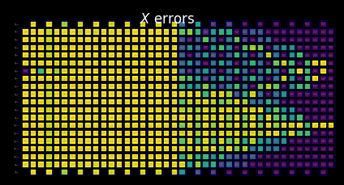

{/* doqumentation-source-hash: d7518943 */}

import TutorialFeedback from '@site/src/components/TutorialFeedback';

<OpenInLabBanner notebookPath="qiskit-addons/slc/01_getting_started.ipynb" />


##  Latar Belakang {#background}
Tutorial ini menunjukkan cara mengurangkan ralat menggunakan addon Shaded lightcone (SLC). Addon ini merupakan evolusi daripada [teknik pembatalan ralat kebarangkalian (PEC)](https://quantum.cloud.ibm.com/docs/guides/error-mitigation-and-suppression-techniques#probabilistic-error-cancellation-pec), di mana pengguna mempelajari bunyi bising lapisan unik dalam Circuit dan kemudian membatalkan bunyi bising tersebut dengan menggunakan gate satu-Qubit dan teknik pemprosesan pasca. Berbanding kaedah lain, PEC menawarkan sempadan yang lebih teguh terhadap kecenderungan hasil yang dikurangkan, tetapi cenderung mengalami overhed yang lebih tinggi dari segi masa QPU. Semasa PEC, untuk mengimbangi pelemahan nilai jangkaan oleh bunyi bising, hasil purata diskala semula dengan faktor $\gamma = \exp(\sum_{l,\sigma} 2\lambda_{l,\sigma})$, di mana $\lambda_{l,\sigma}$ ialah kadar bunyi bising yang dipelajari bagi ralat Pauli $\sigma$ pada lapisan $l$ dalam Circuit. Penskalan semula ini meningkatkan varians sebanyak faktor $\gamma^2$, dan dengan itu turut mendarabkan bilangan pelaksanaan Circuit yang diperlukan pada QPU dengan $\gamma^2$, yang kita panggil kos pensampelan atau overhed pensampelan. Memandangkan $\gamma$ berkembang secara eksponen, PEC sering terhad kepada Circuit yang cetek atau sedikit Qubit. Ketahui lebih lanjut tentang PEC dalam [Probabilistic error cancellation with sparse Pauli-Lindblad models on noisy quantum processors.](https://arxiv.org/abs/2201.09866)

Jika kita boleh mengenal pasti ralat yang tidak perlu dikurangkan, kita boleh mengurangkan kos pensampelan ini secara eksponen. Langkah pertama ke arah ini ialah melaksanakan pengurangan ralat sedar-tempatan, yang menggunakan "lightcone" konvensional yang boleh dikira dengan cepat untuk mengurangkan overhed PEC dengan membatasi kepekaan observable terhadap ralat di seluruh Circuit, memperluaskan kebolehlaksanaan PEC ke skala yang lebih besar untuk sesetengah masalah. Ralat di luar lightcone ini tidak dapat mempengaruhi hasil yang diukur dan oleh itu boleh dikecualikan daripada prosedur pembatalan ralat. Pengecualian ini mengurangkan overhed pensampelan, dalam sesetengah kes secara ketara, tanpa memperkenalkan kecenderungan tambahan. Khususnya, untuk mengukur observable tempatan $O$ bagi Circuit kedalaman tetap, overhed pensampelan yang diperlukan akhirnya mendatar apabila menskalakan bilangan Qubit dalam Circuit (lihat Rajah 2b dalam [Locality and Error Mitigation of Quantum Circuits.](https://arxiv.org/abs/2303.06496))

Lightcone berlorek (SLC) melangkah lebih jauh, menggunakan simulasi klasikal untuk membatasi kepekaan terhadap ralat di seluruh Circuit dengan lebih ketat. Ini menukar sebahagian masa QPU dengan masa CPU dan mengurangkan overhed pensampelan yang diperlukan untuk menormalkan semula kecenderungan. Bukannya had potongan keras, setiap ralat yang berpotensi dalam Circuit diberi "lorek" bergred yang membatasi atas kerentanan observable terhadap ralat tersebut. Pencirian yang lebih halus ini membenarkan aplikasi PEC yang lebih cekap dan tersasar dengan varians yang dikurangkan, sambil memberi pengguna keupayaan untuk menala kecenderungan dalam anggaran observable secara terkawal. Lihat [Lightcone shading for classically accelerated quantum error mitigation](https://arxiv.org/abs/2409.04401) untuk maklumat lanjut.

Aliran kerja kami untuk addon SLC memanfaatkan rangka kerja Samplomatic dan Executor yang baharu, membolehkan pengguna mempunyai kawalan yang lebih modular terhadap tetapan pelaksanaan untuk penindasan dan pengurangan ralat sambil mengekalkan kemudahan penggunaan untuk pengguna lanjutan. Untuk pemahaman yang lebih mendalam tentang manfaat rangka kerja ini dan ciri-ciri umumnya, rujuk tutorial [Hello samplomatic](https://github.com/qiskit-community/qdc-challenges-2025/blob/main/day3_tutorials/Track_A/hello_samplomatic/Samplomatic%20-%20Hello%20World.ipynb).

### Aliran kerja untuk lorek lightcone, pembelajaran bunyi bising, dan suntikan anti-bunyi bising {#workflow-for-lightcone-shading-noise-learning-and-anti-noise-injection}
Untuk memodelkan bunyi bising QPU, kami memilih untuk menggunakan model bunyi bising Pauli-Lindblad jarang dengan kadar ralat Pauli 1- dan 2-Qubit, yang dijana secara tempatan pada setiap Qubit dan tepi peranti. Dengan pilihan ini, aliran kerja pengurangan ralat SLC yang dibentangkan dalam tutorial ini adalah seperti berikut:

a. CPU — Batasi impak setiap ralat bagi ralat Pauli 1- dan 2-Qubit

  1. Perambatan ke hadapan (batasi kesan pada observable). Rambatkan setiap ralat ke penghujung Circuit dan kira komutatornya dengan observable.  
      - Potong terma pengoperasi semasa evolusi untuk mengekalkan pengiraan yang boleh diuruskan.  
      - Ketatkan lagi sempadan ini dengan perambatan balik longgar observable berdasarkan had laju kuantum.
  2. Perambatan ke belakang (batasi kesan pada keadaan awal). Rambatkan setiap ralat ke permulaan Circuit dan kira komutatornya dengan keadaan awal.

b. QPU — Pelajari kadar bunyi bising. Gunakan `NoiseLearner` untuk menganggar kadar model bunyi bising Pauli-Lindblad.

c. CPU — Utamakan pengurangan

  1. Kemas kini sempadan gabungan dengan kadar bunyi bising yang dipelajari. Gabungkan sempadan ke hadapan dan ke belakang yang telah dikira sebelumnya dan kemas kini dengan kadar bunyi bising yang dipelajari.  
  2. Kedudukan komponen bunyi bising yang perlu dikurangkan menggunakan sempadan dan kadar yang dikira. Utamakan setiap kemungkinan ralat bunyi bising berdasarkan anggaran kesannya terhadap kecenderungan dan kos berkaitan untuk membetulkan. 

d. QPU — Masukkan anti-bunyi bising dan jalankan. Laksanakan Circuit yang diminati dengan anti-bunyi bising (bunyi bising songsang) yang ditentukan menggunakan anotasi `Box`.

e. CPU — Anggarkan observable. Kira nilai jangkaan, menggunakan pemilihan pasca berasaskan pengukuran untuk mengurangkan impak bunyi bising bukan-Markov.

### Gambaran keseluruhan pembelajaran bunyi bising {#noise-learning-overview}
Pembelajaran bunyi bising ialah langkah umum dalam beberapa kaedah pengurangan ralat, yang dijalankan oleh [NoiseLearner](https://quantum.cloud.ibm.com/docs/en/guides/noise-learning), dan boleh dilihat dalam tutorial [pengurangan ralat PEA](https://quantum.cloud.ibm.com/docs/tutorials/probabilistic-error-amplification) kami, serta [tutorial Penyerapan bunyi bising terambat (PNA)](https://github.com/qiskit-community/qdc-challenges-2025/blob/main/day3_tutorials/Track_A/pna/propagated_noise_absorption.ipynb) kami. Dalam `NoiseLearnerV3`, pengguna boleh mengenal pasti secara khusus lapisan bunyi bising yang akan dipelajari sebagai objek [`CircuitInstruction`](https://quantum.cloud.ibm.com/docs/api/qiskit/qiskit.circuit.CircuitInstruction), yang membolehkan pengguna mengira sempadan bunyi bising SLC yang dikehendaki untuk setiap lapisan dengan cara yang diterangkan di atas. Model Pauli-Lindblad yang dipelajari menyediakan pekali yang akan digunakan dalam keutamaan PEC-SLC. Cara gate dikumpulkan ke dalam lapisan boleh ditentukan menggunakan fungsi kemudahan `generate_boxing_pass_manager` dan `unique_2q_instructions`, kemudian dimasukkan ke dalam fungsi utiliti SLC `generate_noise_model_paulis`, seperti yang diterangkan dalam Langkah 2 di bawah.

| **Bahagian 1** | **Bahagian 2** | **Bahagian 3** |
|-----------|-----------|-----------|
| Pauli-twirl lapisan gate dua-Qubit | Ulang pasangan identiti lapisan dan pelajari bunyi bising | Terbitkan kesetiaan (ralat untuk setiap saluran bunyi bising) |
|  |  |  |

### Gambaran keseluruhan pemprosesan pasca {#post-processing-overview}
Selepas melaksanakan pada perkakasan kuantum menggunakan rangka kerja Samplomatic dan Executor, kami menukar pengukuran rentetan bit kami kepada nilai observable yang dikehendaki. Dalam kes Circuit Ising cermin kami, kami idealnya akan mendapat observable yang diukur sebesar 1, kerana semua Qubit sepatutnya kembali ke titik permulaan mereka iaitu $\ket{0}$. Apabila mengira nilai observable dengan fungsi `expectation_values` kami, kami akan menggunakan beberapa teknik pemprosesan pasca yang mengurangkan impak bunyi bising. Ini termasuk mengalih keluar shot yang terjejas oleh bunyi bising bukan-Markov, pengurangan ralat pembacaan, serta mengambil kira butiran pelaksanaan PEC kami. Butiran dibincangkan dalam Langkah 4 di bawah.

## Keperluan {#requirements}
Sebelum memulakan tutorial ini, pastikan anda telah memasang pakej-pakej berikut:

- Qiskit IBM Runtime dengan primitif Executor (`pip install "qiskit-ibm-runtime @ git+https://github.com/Qiskit/qiskit-ibm-runtime.git"`)
- Qiskit addon Shaded lightcone 0.1 (`pip install "qiskit-addon-slc~=0.1.0`")
- Qiskit addon utils (`pip install "qiskit-addon-utils~=0.3.0"`)
- Samplomatic v0.16 atau lebih (`pip install samplomatic`)
- Sokongan Visualisasi Qiskit (`pip install "qiskit[visualization]"`)
## Langkah 0. Persediaan {#step-0-setup}
Pertama, import pakej dan fungsi yang diperlukan untuk menjalankan notebook ini dengan berjaya.

```python
# Added by doQumentation — required packages for this notebook
!pip install -q matplotlib numpy qiskit qiskit-addon-slc qiskit-addon-utils qiskit-ibm-runtime samplomatic
```

```python
import logging

logging.basicConfig(level=logging.INFO, format="%(asctime)s %(levelname)s %(module)s %(message)s")

# Setting this value prevents itertools.starmap deadlock on UNIX systems
from multiprocessing import set_start_method

set_start_method("spawn")

# Needed to prevent PySCF from parallelizing internally (SLC only)
%set_env OMP_NUM_THREADS=1
```

```text
env: OMP_NUM_THREADS=1
```

```python
import pickle

import numpy as np
import samplomatic
from matplotlib import pyplot as plt
from qiskit import QuantumCircuit
from qiskit.quantum_info import SparsePauliOp
from qiskit.transpiler import PassManager, generate_preset_pass_manager
from qiskit_addon_slc.bounds import (
    compute_backward_bounds,
    compute_forward_bounds,
    compute_local_scales,
    merge_bounds,
    tighten_with_speed_limit,
)
from qiskit_addon_slc.utils import generate_noise_model_paulis, map_modifier_ref_to_ref
from qiskit_addon_slc.visualization import draw_shaded_lightcone
from qiskit_addon_utils.exp_vals.expectation_values import executor_expectation_values
from qiskit_addon_utils.exp_vals.measurement_bases import get_measurement_bases
from qiskit_addon_utils.noise_management import gamma_from_noisy_boxes, trex_factors
from qiskit_addon_utils.noise_management.post_selection import PostSelector
from qiskit_addon_utils.noise_management.post_selection.transpiler.passes import (
    AddPostSelectionMeasures,
    AddSpectatorMeasures,
)
from qiskit_ibm_runtime import Executor, QiskitRuntimeService, QuantumProgram
from qiskit_ibm_runtime.noise_learner_v3 import NoiseLearnerV3
from qiskit_ibm_runtime.options import NoiseLearnerV3Options
from samplomatic.transpiler import generate_boxing_pass_manager
from samplomatic.utils import find_unique_box_instructions
```

## Langkah 1. Petakan masalah {#step-1-map-the-problem}
Untuk kemudahan demonstrasi, kami memilih rantai Ising cermin 1D. Rantai Ising 1D memberikan struktur Circuit yang padat dan bagus, yang memudahkan untuk mempamerkan pelaksanaan PEC. Circuit cermin memudahkan kita mengetahui hasil yang dijangkakan (iaitu, kita sepatutnya mengukur observable sebesar 1).

Selain itu, kami ingin menjalankan Circuit cermin, jadi untuk setiap gate dalam separuh kedua Circuit, perlu ada gate songsang dalam separuh pertama. Memandangkan observable yang diukur **$<X_6 Z_{13}>$** mempunyai pengukuran bukan asas-Z, dan Executor mengambil kira asas yang dikehendaki pada penghujung Circuit, kami menyediakan fungsi `prepare_basis` yang memasukkan gate yang sesuai pada permulaan Circuit cermin. Butiran ini khusus untuk demonstrasi Circuit cermin kami. Fungsi `get_measurement_bases` membolehkan kami mengenal pasti dengan mudah gate yang diperlukan dan di mana perlu menambahkannya, serta menjejaki kehalusan indeks Qubit yang timbul daripada konvensyen dalam anotasi `box` seperti yang dibincangkan dalam bahagian "Sediakan pengukuran asas kanonikal".

```python
num_qubits = 20
target_obs_sparse = [("XZ", [6, 13], 1.0)]
```

```python
observable = SparsePauliOp.from_sparse_list(target_obs_sparse, num_qubits=num_qubits)
```

```python
bases_virt, reverser_virt = get_measurement_bases(observable)
```

```python
num_trotter_steps = 10
rx_angle = np.pi / 4
```

```python
def construct_ising_circuit(
    num_qubits: int, num_trotter_steps: int, rx_angle: float, barrier: bool = True
) -> QuantumCircuit:
    circuit = QuantumCircuit(num_qubits)

    for _step in range(num_trotter_steps):
        circuit.rx(rx_angle, range(num_qubits))
        if barrier:
            circuit.barrier()
        for first_qubit in (1, 2):
            for idx in range(first_qubit, num_qubits, 2):
                # equivalent to Rzz(-pi/2):
                circuit.sdg([idx - 1, idx])
                circuit.cz(idx - 1, idx)
        if barrier:
            circuit.barrier()

    return circuit

def prepare_basis(circuit: QuantumCircuit, basis: list[int]) -> QuantumCircuit:
    # basis is a list of integer values from 0 to 3. These map to the basis measurement as:
    # 0 = I; 1 = Z; 2 = X; 3 = Y
    assert len(basis) == circuit.num_qubits

    out_circ = circuit.copy_empty_like()
    for qb, bas in enumerate(basis):
        if bas in {0, 1}:
            continue
        if bas == 2:
            out_circ.h(qb)
        elif bas == 3:
            out_circ.rx(-np.pi / 2, qb)

    out_circ.barrier()
    out_circ.compose(circuit, inplace=True)
    return out_circ

def mirror_circuit(circuit: QuantumCircuit, *, inverse_first: bool = False) -> QuantumCircuit:
    mirror_circ = circuit.copy_empty_like()
    mirror_circ.compose(circuit.inverse() if inverse_first else circuit, inplace=True)
    mirror_circ.barrier()
    mirror_circ.compose(circuit if inverse_first else circuit.inverse(), inplace=True)
    mirror_circ.measure_active()
    return mirror_circ
```

```python
# Instantiate circuit
circuit = construct_ising_circuit(num_qubits, num_trotter_steps, rx_angle, barrier=False)
mirrored_circuit = mirror_circuit(circuit, inverse_first=True)
mirrored_circuit = prepare_basis(mirrored_circuit, bases_virt[0])
```

```python
mirrored_circuit.draw("mpl", fold=-1, scale=0.3, idle_wires=False, measure_arrows=False)
```


## Langkah 2. Optimumkan {#step-2-optimize}
Kita akan optimumkan butiran berkaitan dengan Circuit yang hendak dijalankan, observable yang hendak diukur, dan parameter pembelajaran hingar. Sebagai titik permulaan, kita pastikan backend dinyatakan dengan fractional gates dihidupkan sebagai pilihan. Fractional gates ini membolehkan kepekaan yang lebih tinggi dalam beberapa penapisan pasca-pemilihan kita.

```python
token = "<YOUR_TOKEN>"
instance = "<YOUR_INSTANCE>"

# This is used to retrieve shared results
shared_service = QiskitRuntimeService(
    channel="ibm_quantum_platform",
    token=token,
    instance=instance,
)

# This is used to run on real hardware
service = service = QiskitRuntimeService()
```

```text
qiskit_runtime_service._discover_account:WARNING:2025-11-10 11:19:40,108: Loading account with the given token. A saved account will not be used.
```

```python
backend = service.backend("ibm_kingston", use_fractional_gates=True)
```

Pertama, kita akan transpil Circuit kita kepada arahan ISA, [seperti yang diperlukan untuk pelaksanaan pada QPU kita](https://www.ibm.com/quantum/blog/isa-circuits). Untuk data yang dikumpul dalam eksperimen ini, kita pilih sendiri Qubit kita berdasarkan penilaian rantai berkualiti tertinggi.

```python
layout = [44, 45, 46, 47, 57, 67, 68, 69, 78, 89, 88, 87, 97, 107, 106, 105, 104, 103, 96, 83]
```

```python
isa_pm = generate_preset_pass_manager(backend=backend, initial_layout=layout, optimization_level=0)

isa_circuit = isa_pm.run(mirrored_circuit)
assert isa_circuit.layout.final_index_layout() == layout

isa_observable = observable.apply_layout(layout, num_qubits=isa_circuit.num_qubits)
```

```text
2025-11-10 11:19:57,810 INFO base_tasks Pass: ContainsInstruction - 0.00715 (ms)
2025-11-10 11:19:57,811 INFO base_tasks Pass: UnitarySynthesis - 0.00525 (ms)
2025-11-10 11:19:57,811 INFO base_tasks Pass: HighLevelSynthesis - 0.02599 (ms)
2025-11-10 11:19:57,811 INFO base_tasks Pass: BasisTranslator - 0.09131 (ms)
2025-11-10 11:19:57,811 INFO base_tasks Pass: SetLayout - 0.02623 (ms)
2025-11-10 11:19:57,812 INFO base_tasks Pass: FullAncillaAllocation - 0.14400 (ms)
2025-11-10 11:19:57,812 INFO base_tasks Pass: EnlargeWithAncilla - 0.06318 (ms)
2025-11-10 11:19:57,813 INFO base_tasks Pass: ApplyLayout - 0.29802 (ms)
2025-11-10 11:19:57,813 INFO base_tasks Pass: CheckMap - 0.07820 (ms)
2025-11-10 11:19:57,814 INFO base_tasks Pass: FilterOpNodes - 0.33283 (ms)
2025-11-10 11:19:57,814 INFO base_tasks Pass: UnitarySynthesis - 0.00691 (ms)
2025-11-10 11:19:57,814 INFO base_tasks Pass: HighLevelSynthesis - 0.13208 (ms)
2025-11-10 11:19:57,816 INFO base_tasks Pass: BasisTranslator - 1.00303 (ms)
2025-11-10 11:19:57,818 INFO base_tasks Pass: FoldRzzAngle - 1.78719 (ms)
2025-11-10 11:19:57,818 INFO base_tasks Pass: ContainsInstruction - 0.00691 (ms)
2025-11-10 11:19:57,818 INFO base_tasks Pass: InstructionDurationCheck - 0.00405 (ms)
```

```python
wire_order = layout + [q for q in range(isa_circuit.num_qubits) if q not in layout]
isa_circuit.draw(
    "mpl", fold=-1, scale=0.3, idle_wires=False, wire_order=wire_order, measure_arrows=False
)
```


### Kotak Circuit tersebut {#box-the-circuit}
Untuk kemudahan pelaksanaan, kita akan gunakan laluan transpilasi `generate_boxing_pass_manager`, yang meletakkan arahan Circuit ke dalam kotak beranotasi. Kotak-kotak ini menunjukkan dengan jelas di mana, dalam kes PEC, antinoise perlu disuntik ke dalam Circuit. Untuk butiran tetapan, rujuk [dokumentasi Samplomatic.](https://qiskit.github.io/samplomatic/)

Perlu diambil perhatian bahawa aliran kerja SLC menggunakan `inject_noise_strategy="individual_modification"` kemudian dalam proses kerana ini membolehkan kita mengenal pasti setiap `BoxOp` dalam Circuit secara unik.

Fungsi `find_unique_box_instructions` mengulangi Circuit berkotak yang diberikan dan mengenal pasti yang mempunyai lapisan 2Q unik atau pengukuran, bagi tujuan pembelajaran hingar dan suntikan hingar.

```python
# Box circuit with Twirl and InjectNoise annotations
boxes_pm = generate_boxing_pass_manager(
    twirling_strategy="active",
    inject_noise_strategy="individual_modification",
    inject_noise_targets="gates",
    measure_annotations="all",
)

boxed_circuit = boxes_pm.run(isa_circuit)

# Find the unique instructions (layers) from boxed circuit
unique_2q_instructions = find_unique_box_instructions(
    boxed_circuit, normalize_annotations=None, undress_boxes=True
)
```

```text
2025-11-10 11:20:01,088 INFO base_tasks Pass: RemoveBarriers - 0.02289 (ms)
2025-11-10 11:20:01,100 INFO base_tasks Pass: GroupGatesIntoBoxes - 12.38990 (ms)
2025-11-10 11:20:01,101 INFO base_tasks Pass: GroupMeasIntoBoxes - 0.47898 (ms)
2025-11-10 11:20:01,104 INFO base_tasks Pass: AddTerminalRightDressedBoxes - 2.88177 (ms)
2025-11-10 11:20:01,111 INFO base_tasks Pass: AddInjectNoise - 6.66904 (ms)
```

```python
boxed_circuit.draw(
    "mpl", fold=-1, scale=0.3, idle_wires=False, wire_order=wire_order, measure_arrows=False
)
```


### Sediakan pengukuran asas kanonik {#prepare-canonical-bases-measurements}
Disebabkan cara Qubit dilabel semasa mengenal pasti lapisan 2Q unik, seseorang perlu berhati-hati untuk menjejaki susunan Qubit. Di bawah, kita perkenalkan konsep `canonical_qubits` sebagai cara untuk mengemas kini susunan Qubit dengan sewajarnya apabila memberikannya kepada executor, hasil daripada bagaimana susunan Qubit ditangkap semasa mempetak Circuit dan mencari arahan unik. Lihat dokumentasi [Konvensyen susunan Qubit](https://qiskit.github.io/samplomatic/guides/samplex_io.html#qubit-ordering-convention) untuk butiran.

```python
# Determine the canonical qubits order
meas_box = boxed_circuit.data[-1]
canonical_qubits = [
    idx for idx, qubit in enumerate(boxed_circuit.qubits) if qubit in meas_box.qubits
]

# map canonical qubit to physical (isa) qubit
c_2_p = {c: p for c, p in enumerate(canonical_qubits)}
# map physical (isa) qubit to virtual qubit (index in original circuit)
p_2_v = {p: v for v, p in enumerate(layout)}
# compute map between virtual and canonical qubit indices.
c_2_v = {c: p_2_v[p] for c, p in c_2_p.items()}

assert len(c_2_v) == num_qubits

bases_canon = [
    np.array([base_i[c_2_v[c]] for c in range(num_qubits)], dtype=np.uint8) for base_i in bases_virt
]
```
### Alur kerja untuk pembayang kon cahaya, pembelajaran hingar, dan suntikan anti-hingar {#workflow-for-lightcone-shading-noise-learning-and-anti-noise-injection}

> **Nota**: Bagi pelaksanaan SLC-PEC dalam tutorial ini, kita menjalankan pengiraan sempadan SLC **sebelum** pembelajaran hingar selesai, supaya litar yang hendak dikurangkan hingarnya dijalankan sedekat mungkin dari segi masa dengan model hingar yang dipelajari. Secara prinsipnya, alur kerja ini boleh ditingkatkan lagi untuk dilaksanakan secara serentak. Iaitu, kerja pembelajaran hingar dijalankan sambil, secara selari, sempadan hingar dianggarkan. Bagi litar kuantum yang sewenang-wenangnya, pengiraan sempadan hingar boleh berskala dengan pergantungan eksponen yang lemah. Oleh itu, mungkin bijak untuk menggunakan pelaksanaan selari apabila cuba memaksimumkan kecekapan alur kerja. Untuk tujuan ini, kita menunjukkan ini secara ringkas dengan memasukkan sumber berasaskan kluster (128 benang) dan menunjukkan cara untuk mendapatkan set sempadan yang lebih halus bagi litar yang diberikan apabila terhad kepada had masa pengiraan yang sama, berbanding komputer riba kita (8 benang). Tambahan pula, walaupun tidak dilaksanakan dalam alur kerja ini, anda boleh menyejajarkan pelaksanaan QPU untuk pembelajaran hingar dan pengiraan sempadan hingar bagi mencapai alur kerja yang paling cekap.

#### Ramal Pauli model hingar yang akan dipelajari {#predict-to-be-learned-noise-model-paulis}

Fungsi `generate_noise_model_paulis` melalui setiap lapisan berpetak dalam litar yang diberikan dan menghasilkan semua sebutan Pauli berat-satu dan berat-dua yang relevan, dengan mengambil kira keterhubungan Qubit litar, dan memilih sebutan yang relevan dengan nod dan tepi yang aktif. Sebutan-sebutan ini kemudiannya digunakan untuk mengira sempadan hingar ke hadapan dan ke belakang.

```python
noise_model_paulis = generate_noise_model_paulis(
    unique_2q_instructions, backend.coupling_map, boxed_circuit
)
```

```python
noise_model_rates = {ref: None for ref in noise_model_paulis}
```

##### a. Kira dan ketatkan sempadan ke hadapan {#a-compute-and-tighten-forward-bounds}

Fungsi `compute_forward_bounds` menilai hubungan komutasi antara Gate dalam setiap lapisan dan sebutan Pauli yang dihasilkan di atas dari segi bagaimana ralat perambatan ke hadapan mempengaruhi pemerhatian yang dikehendaki $A$. Untuk Gate yang berkomut dengan sebutan Pauli, tiada apa yang dilakukan. Untuk Gate Clifford, ia ditolak ke arah permulaan litar. Untuk Gate bukan Clifford, kita menganggarkan pengaruhnya terhadap pemerhatian sasaran untuk kemudiannya diprioritikan bagi pembatalan hingar (selepas semua sempadan digabungkan). Sempadan ini dicapai dengan terlebih dahulu menggunakan norma L2 (iaitu, punca kuasa dua bagi jumlah kuasa dua pekali sebutan Pauli yang relevan). Apabila terlalu banyak sebutan Qubit terlibat, kita bertukar kepada sempadan yang lebih longgar menggunakan ketaksamaan segitiga.
#### Sumber peringkat komputer riba {#laptop-level-resources}

```python
slc_atol = 1e-8
slc_eigval_max_qubits = 18
slc_evolution_max_terms = 1000
slc_num_processes = 8
slc_timeout = 60
```

```python
forward_bounds = compute_forward_bounds(
    boxed_circuit,
    noise_model_paulis,
    isa_observable,
    evolution_max_terms=slc_evolution_max_terms,
    eigval_max_qubits=slc_eigval_max_qubits,
    atol=slc_atol,
    num_processes=slc_num_processes,
    timeout=slc_timeout,
)
```

```text
2025-11-10 11:20:04,344 INFO forward Evolving Pauli error terms forwards through the circuit.
2025-11-10 11:20:04,344 INFO forward Modelling errors as though they happen *after* each noise layer.
2025-11-10 11:20:04,345 INFO remove_measure Removing ANY Measure operations from the provided circuit!
2025-11-10 11:20:04,453 INFO circuit_iter Noisy box 'm39'
2025-11-10 11:20:05,254 INFO circuit_iter Noisy box 'm38'
2025-11-10 11:20:05,304 INFO circuit_iter Noisy box 'm37'
2025-11-10 11:20:05,382 INFO circuit_iter Noisy box 'm36'
2025-11-10 11:20:05,467 INFO circuit_iter Noisy box 'm35'
2025-11-10 11:20:05,580 INFO circuit_iter Noisy box 'm34'
2025-11-10 11:20:05,705 INFO circuit_iter Noisy box 'm33'
2025-11-10 11:20:05,857 INFO circuit_iter Noisy box 'm32'
2025-11-10 11:20:06,034 INFO circuit_iter Noisy box 'm31'
2025-11-10 11:20:06,221 INFO circuit_iter Noisy box 'm30'
2025-11-10 11:20:06,449 INFO circuit_iter Noisy box 'm29'
2025-11-10 11:20:06,724 INFO circuit_iter Noisy box 'm28'
2025-11-10 11:20:07,628 INFO circuit_iter Noisy box 'm27'
2025-11-10 11:20:09,110 INFO circuit_iter Noisy box 'm26'
2025-11-10 11:20:11,696 INFO circuit_iter Noisy box 'm25'
2025-11-10 11:20:16,100 INFO circuit_iter Noisy box 'm24'
2025-11-10 11:20:21,781 INFO circuit_iter Noisy box 'm23'
2025-11-10 11:20:30,244 INFO circuit_iter Noisy box 'm22'
2025-11-10 11:20:40,416 INFO circuit_iter Noisy box 'm21'
2025-11-10 11:20:53,437 INFO circuit_iter Noisy box 'm20'
2025-11-10 11:21:06,038 INFO circuit_iter Noisy box 'm19'
2025-11-10 11:21:06,038 WARNING commutator_bounds Bounds computation timed out.
2025-11-10 11:21:06,039 INFO circuit_iter Noisy box 'm18'
2025-11-10 11:21:06,039 INFO circuit_iter Noisy box 'm17'
2025-11-10 11:21:06,039 INFO circuit_iter Noisy box 'm16'
2025-11-10 11:21:06,040 INFO circuit_iter Noisy box 'm15'
2025-11-10 11:21:06,040 INFO circuit_iter Noisy box 'm14'
2025-11-10 11:21:06,040 INFO circuit_iter Noisy box 'm13'
2025-11-10 11:21:06,040 INFO circuit_iter Noisy box 'm12'
2025-11-10 11:21:06,041 INFO circuit_iter Noisy box 'm11'
2025-11-10 11:21:06,041 INFO circuit_iter Noisy box 'm10'
2025-11-10 11:21:06,041 INFO circuit_iter Noisy box 'm9'
2025-11-10 11:21:06,042 INFO circuit_iter Noisy box 'm8'
2025-11-10 11:21:06,042 INFO circuit_iter Noisy box 'm7'
2025-11-10 11:21:06,042 INFO circuit_iter Noisy box 'm6'
2025-11-10 11:21:06,042 INFO circuit_iter Noisy box 'm5'
2025-11-10 11:21:06,043 INFO circuit_iter Noisy box 'm4'
2025-11-10 11:21:06,043 INFO circuit_iter Noisy box 'm3'
2025-11-10 11:21:06,043 INFO circuit_iter Noisy box 'm2'
2025-11-10 11:21:06,043 INFO circuit_iter Noisy box 'm1'
2025-11-10 11:21:06,044 INFO circuit_iter Noisy box 'm0'
```

#### Visualkan SLC untuk pemeriksaan manual {#visualize-the-slc-for-manual-inspection}

Kamu boleh mentafsir tingkah laku sempadan berlorek dengan memeriksa bagaimana pengukuran dan sebutan Pauli berinteraksi dengan ralat tempatan. Corak-corak ini adalah ciri bagi masalah evolusi masa Hamiltonian Ising tertendang ini dan juga muncul dalam kertas kerja [Lightcone Shading for Classically Accelerated Quantum Error Mitigation](https://arxiv.org/abs/2409.04401), dengan beberapa ciri yang ketara:

- Kita dapat membezakan dengan jelas dua kon yang timbul daripada dua Pauli bukan identiti dalam pemerhatian.
- Kita dapat melihat bahawa pengukuran X pada Qubit 6 berkomut dengan ralat X dalam lapisan paling kanan.
- Kita dapat melihat bahawa Pauli Z pada Qubit 13 berkomut dengan ralat Z dalam lapisan paling kanan.
- Apabila kita mencapai tamat masa yang dinyatakan di atas, lapisan-lapisan yang tersisa di sebelah kiri diisi sepenuhnya dengan sempadan remeh bernilai dua.

```python
for p in "XYZ":
    display(
        draw_shaded_lightcone(
            boxed_circuit,
            forward_bounds,
            noise_model_paulis,
            pauli_filter=p,
            scale=0.15,
            fold=-1,
            idle_wires=False,
            wire_order=wire_order,
            measure_arrows=False,
        )
    )
```


#### b. Kira dan ketatkan sempadan ke hadapan {#b-compute-and-tighten-forward-bounds}
Seterusnya kita mengetatkan sempadan dengan menggunakan fungsi `tighten_with_speed_limit`, yang menjejaki cara pemerhatian merebak ke belakang melalui litar dan menggunakan rebakan tersebut untuk menetapkan had atas pada kesan setiap pengendali hingar, mengambil nilai yang lebih kecil antara sempadan ke hadapan yang baru dikira, dan sempadan perambatan ke belakang.

```python
forward_bounds_tighter = tighten_with_speed_limit(
    forward_bounds, boxed_circuit, noise_model_paulis, isa_observable
)
```

```text
2025-11-10 11:21:08,270 INFO speed_limit Tighting bounds using information propagation speed limits
2025-11-10 11:21:08,270 INFO speed_limit Modelling errors as though they happen *after* each noise layer.
2025-11-10 11:21:08,298 INFO remove_measure Removing ANY Measure operations from the provided circuit!
2025-11-10 11:21:08,310 INFO circuit_iter Noisy box 'm39'
2025-11-10 11:21:08,314 INFO circuit_iter Noisy box 'm38'
2025-11-10 11:21:08,317 INFO circuit_iter Noisy box 'm37'
2025-11-10 11:21:08,319 INFO circuit_iter Noisy box 'm36'
2025-11-10 11:21:08,323 INFO circuit_iter Noisy box 'm35'
2025-11-10 11:21:08,325 INFO circuit_iter Noisy box 'm34'
2025-11-10 11:21:08,328 INFO circuit_iter Noisy box 'm33'
2025-11-10 11:21:08,330 INFO circuit_iter Noisy box 'm32'
2025-11-10 11:21:08,334 INFO circuit_iter Noisy box 'm31'
2025-11-10 11:21:08,336 INFO circuit_iter Noisy box 'm30'
2025-11-10 11:21:08,338 INFO circuit_iter Noisy box 'm29'
2025-11-10 11:21:08,340 INFO circuit_iter Noisy box 'm28'
2025-11-10 11:21:08,344 INFO circuit_iter Noisy box 'm27'
2025-11-10 11:21:08,346 INFO circuit_iter Noisy box 'm26'
2025-11-10 11:21:08,349 INFO circuit_iter Noisy box 'm25'
2025-11-10 11:21:08,351 INFO circuit_iter Noisy box 'm24'
2025-11-10 11:21:08,355 INFO circuit_iter Noisy box 'm23'
2025-11-10 11:21:08,357 INFO circuit_iter Noisy box 'm22'
2025-11-10 11:21:08,360 INFO circuit_iter Noisy box 'm21'
2025-11-10 11:21:08,362 INFO circuit_iter Noisy box 'm20'
2025-11-10 11:21:08,367 INFO circuit_iter Noisy box 'm19'
2025-11-10 11:21:08,369 INFO circuit_iter Noisy box 'm18'
2025-11-10 11:21:08,372 INFO circuit_iter Noisy box 'm17'
2025-11-10 11:21:08,375 INFO circuit_iter Noisy box 'm16'
2025-11-10 11:21:08,378 INFO circuit_iter Noisy box 'm15'
2025-11-10 11:21:08,380 INFO circuit_iter Noisy box 'm14'
2025-11-10 11:21:08,383 INFO circuit_iter Noisy box 'm13'
2025-11-10 11:21:08,386 INFO circuit_iter Noisy box 'm12'
2025-11-10 11:21:08,389 INFO circuit_iter Noisy box 'm11'
2025-11-10 11:21:08,391 INFO circuit_iter Noisy box 'm10'
2025-11-10 11:21:08,394 INFO circuit_iter Noisy box 'm9'
2025-11-10 11:21:08,396 INFO circuit_iter Noisy box 'm8'
2025-11-10 11:21:08,399 INFO circuit_iter Noisy box 'm7'
2025-11-10 11:21:08,401 INFO circuit_iter Noisy box 'm6'
2025-11-10 11:21:08,404 INFO circuit_iter Noisy box 'm5'
2025-11-10 11:21:08,406 INFO circuit_iter Noisy box 'm4'
2025-11-10 11:21:08,410 INFO circuit_iter Noisy box 'm3'
2025-11-10 11:21:08,412 INFO circuit_iter Noisy box 'm2'
2025-11-10 11:21:08,415 INFO circuit_iter Noisy box 'm1'
2025-11-10 11:21:08,417 INFO circuit_iter Noisy box 'm0'
```

#### Visualkan SLC untuk pemeriksaan manual {#visualize-the-slc-for-manual-inspection-2}

Kita boleh mengetatkan lagi sempadan dengan mengambil kira had kon cahaya. Secara prinsipnya, ini memberikan kita peralihan yang lebih lancar daripada sempadan yang dikira kepada sempadan remeh yang ditetapkan selepas tamat masa tercapai. Di sini, kesannya tidak begitu ketara kerana kon cahaya sudah mencapai tepi litar.

```python
for p in "XYZ":
    display(
        draw_shaded_lightcone(
            boxed_circuit,
            forward_bounds_tighter,
            noise_model_paulis,
            pauli_filter=p,
            scale=0.15,
            fold=-1,
            idle_wires=False,
            wire_order=wire_order,
            measure_arrows=False,
        )
    )
```


#### c. Kira sempadan ke belakang {#c-compute-backward-bounds}

Bahagian ramalan hingar ini menilai bagaimana ralat pada lapisan tertentu boleh mempengaruhi keadaan input $\rho$. Fungsi `compute_backward_bounds` terlebih dahulu menyongsangkan litar, membuang Gate pengukuran, kemudian meneruskan dengan analisis yang serupa seperti yang dilakukan untuk pengiraan sempadan ke hadapan.

```python
backward_bounds = compute_backward_bounds(
    boxed_circuit,
    noise_model_paulis,
    evolution_max_terms=slc_evolution_max_terms,
    num_processes=slc_num_processes,
    timeout=slc_timeout,
)
```

```text
2025-11-10 11:21:10,666 INFO backward Evolving Pauli error terms backwards through the circuit.
2025-11-10 11:21:10,666 INFO backward Modelling errors as though they happen *after* each noise layer.
2025-11-10 11:21:10,667 INFO remove_measure Removing ANY Measure operations from the provided circuit!
2025-11-10 11:21:10,774 INFO circuit_iter Noisy box 'm0'
2025-11-10 11:21:11,640 INFO circuit_iter Noisy box 'm1'
2025-11-10 11:21:11,681 INFO circuit_iter Noisy box 'm2'
2025-11-10 11:21:11,867 INFO circuit_iter Noisy box 'm3'
2025-11-10 11:21:12,078 INFO circuit_iter Noisy box 'm4'
2025-11-10 11:21:12,329 INFO circuit_iter Noisy box 'm5'
2025-11-10 11:21:12,637 INFO circuit_iter Noisy box 'm6'
2025-11-10 11:21:13,110 INFO circuit_iter Noisy box 'm7'
2025-11-10 11:21:13,705 INFO circuit_iter Noisy box 'm8'
2025-11-10 11:21:14,384 INFO circuit_iter Noisy box 'm9'
2025-11-10 11:21:15,213 INFO circuit_iter Noisy box 'm10'
2025-11-10 11:21:15,946 INFO circuit_iter Noisy box 'm11'
2025-11-10 11:21:16,754 INFO circuit_iter Noisy box 'm12'
2025-11-10 11:21:17,557 INFO circuit_iter Noisy box 'm13'
2025-11-10 11:21:18,447 INFO circuit_iter Noisy box 'm14'
2025-11-10 11:21:19,453 INFO circuit_iter Noisy box 'm15'
2025-11-10 11:21:20,472 INFO circuit_iter Noisy box 'm16'
2025-11-10 11:21:21,479 INFO circuit_iter Noisy box 'm17'
2025-11-10 11:21:22,660 INFO circuit_iter Noisy box 'm18'
2025-11-10 11:21:23,705 INFO circuit_iter Noisy box 'm19'
2025-11-10 11:21:24,849 INFO circuit_iter Noisy box 'm20'
2025-11-10 11:21:26,030 INFO circuit_iter Noisy box 'm21'
2025-11-10 11:21:27,111 INFO circuit_iter Noisy box 'm22'
2025-11-10 11:21:28,354 INFO circuit_iter Noisy box 'm23'
2025-11-10 11:21:29,554 INFO circuit_iter Noisy box 'm24'
2025-11-10 11:21:30,897 INFO circuit_iter Noisy box 'm25'
2025-11-10 11:21:32,113 INFO circuit_iter Noisy box 'm26'
2025-11-10 11:21:33,622 INFO circuit_iter Noisy box 'm27'
2025-11-10 11:21:34,962 INFO circuit_iter Noisy box 'm28'
2025-11-10 11:21:36,504 INFO circuit_iter Noisy box 'm29'
2025-11-10 11:21:38,021 INFO circuit_iter Noisy box 'm30'
2025-11-10 11:21:39,750 INFO circuit_iter Noisy box 'm31'
2025-11-10 11:21:41,237 INFO circuit_iter Noisy box 'm32'
2025-11-10 11:21:42,974 INFO circuit_iter Noisy box 'm33'
2025-11-10 11:21:44,527 INFO circuit_iter Noisy box 'm34'
2025-11-10 11:21:46,535 INFO circuit_iter Noisy box 'm35'
2025-11-10 11:21:48,152 INFO circuit_iter Noisy box 'm36'
2025-11-10 11:21:50,074 INFO circuit_iter Noisy box 'm37'
2025-11-10 11:21:51,814 INFO circuit_iter Noisy box 'm38'
2025-11-10 11:21:53,943 INFO circuit_iter Noisy box 'm39'
```

#### Visualkan SLC untuk pemeriksaan manual {#visualize-the-slc-for-manual-inspection-3}

Daripada pengiraan sempadan ke belakang, kita dapat melihat bagaimana struktur keadaan awal mengawal tingkah laku awal perambatan ralat:

- Kita dapat melihat dengan jelas bagaimana ralat Z pada mulanya berkomut dengan keadaan awal |0⟩.
- Hanya pada Qubit 6, di mana kita menginisialisasi eigenstate +1 bagi asas X, ralat Z gagal berkomut, manakala ralat X berkomut.

```python
for p in "XYZ":
    display(
        draw_shaded_lightcone(
            boxed_circuit,
            backward_bounds,
            noise_model_paulis,
            pauli_filter=p,
            scale=0.15,
            fold=-1,
            idle_wires=False,
            wire_order=wire_order,
            measure_arrows=False,
        )
    )
```


#### Pratonton sempadan yang digabungkan tanpa kadar hingar yang dipelajari {#preview-merged-bounds-without-learned-noise-rates}

Fungsi `merged_bounds` menentukan titik dalam litar di mana peralihan daripada sempadan ke belakang kepada sempadan ke hadapan meminimumkan jumlah anggaran berat sebelah pada pemerhatian yang dikehendaki. Berat sebelah ini dikira sebagai jumlah sumbangan sempadan ke belakang untuk semua lokasi hingar sebelum titik tersebut, ditambah dengan sumbangan sempadan ke hadapan untuk semua lokasi hingar selepasnya. Pada masa ini, ini dilakukan secara seragam untuk semua Qubit.

> **Nota Penting**: Titik untuk beralih daripada sempadan ke hadapan kepada sempadan ke belakang bergantung pada kadar hingar yang dipelajari.

```python
merged_bounds = merge_bounds(
    boxed_circuit,
    forward_bounds_tighter,
    backward_bounds,
    noise_model_rates,
)
```

```text
2025-11-10 11:21:58,304 WARNING merge Missing noise rates. Partitioning backward/forward commutator bounds by assuming uniform error rates.
2025-11-10 11:21:58,305 WARNING merge Optimal spacetime partitioning not implemented!Just partitioning list of noisy boxes.
2025-11-10 11:21:58,305 INFO merge Determined Box idx for partitioning to be 20.
```

### Visualkan SLC untuk pemeriksaan manual {#visualize-the-slc-for-manual-inspection-4}

Selepas menggabungkan sempadan ke belakang dan sempadan ke hadapan yang diketatkan, tingkah laku SLC gabungan menjadi jelas:

- Fungsi di atas memberitahu kita bahawa partition dipilih di mana peralihan daripada sempadan ke belakang kepada sempadan ke hadapan yang diketatkan berlaku.
- Kita dapat melihat di bawah bahawa SLC kini mengandungi sebahagian sempadan ke belakang dan sebahagian sempadan ke hadapan yang diketatkan.

```python
for p in "XYZ":
    display(
        draw_shaded_lightcone(
            boxed_circuit,
            merged_bounds,
            noise_model_paulis,
            pauli_filter=p,
            scale=0.15,
            fold=-1,
            idle_wires=False,
            wire_order=wire_order,
            measure_arrows=False,
        )
    )
```




#### Sumber peringkat kluster {#cluster-level-resources}
Di sini, kita menunjukkan bagaimana menggunakan 128 benang pada kluster membolehkan kita merambat melalui bahagian litar yang lebih besar apabila terhad kepada masa pengiraan yang sama dengan komputer riba kita.

```python
with open("exp_data/merged_bounds_cluster.pickle", "rb") as file:
    merged_bounds_cluster = pickle.load(file)
```

```python
for p in "XYZ":
    display(
        draw_shaded_lightcone(
            boxed_circuit,
            merged_bounds_cluster,
            noise_model_paulis,
            pauli_filter=p,
            scale=0.15,
            fold=-1,
            idle_wires=False,
            wire_order=wire_order,
            measure_arrows=False,
        )
    )
```


## Langkah 3. Laksana {#step-3-execute}
Dalam bahagian ini kita mula menjalankan bahagian aliran kerja yang menggunakan peranti kuantum sebenar. Untuk kaedah pengurangan ralat berasaskan pembelajaran ini, terdapat dua langkah: 

1. Pelajari hingar dengan menggunakan `NoiseLeanerV3`.
2. Laksana litar pengurangan ralat dengan rangka kerja Sampler dan Estimator baharu.

Dengan ralat terbatas daripada litar kuantum kita, kita perlu mempelajari kadar hingar yang berkaitan untuk mengutamakan bajet ralat, menentukan overhed pensampelan, dan melaksanakan pada QPU. Selain itu, dengan maklumat kadar hingar ini, kita juga boleh menunjukkan bagaimana, dengan menggunakan sumber pengkomputeran yang kuat daripada kluster kita, kita mengurangkan overhed pensampelan sambil mengekalkan baki pincang yang sama.
### a. Pelajari kadar hingar {#a-learn-noise-rates}

Pemelajar hingar membolehkan pencirian proses hingar yang mempengaruhi gate dalam satu atau lebih litar yang diminati, berdasarkan model hingar Pauli-Lindblad yang dihuraikan dalam kertas kerja [Probabilistic error cancellation with sparse Pauli-Lindblad models on noisy quantum processors](https://arxiv.org/abs/2201.09866). Kaedah `run()` melancarkan kerja pembelajaran hingar untuk lapisan 2-Qubit unik yang diberikan, berdasarkan pilihan yang ditentukan dalam konfigurasi pemelajar hingar. Dalam pilihan ini, kamu boleh laraskan strategi Pauli-twirling, yang membantu memastikan perkakasan dihuraikan dengan baik oleh model hingar Pauli-Lindblad.

Butiran model hingar kamu berisiko hanyut dari masa ke masa. Oleh itu, kita tetapkan parameter untuk memastikan model hingar yang dipelajari dikira semula bagi eksperimen yang lebih lama daripada empat jam. Ini adalah peraturan kasar dan perlu dipertimbangkan dengan teliti semasa mengaplikasikannya pada kerja kamu sendiri.

```python
post_selection_enabled = True
load_cached_noise_results = True
```

```python
noise_learner_options = NoiseLearnerV3Options(
    num_randomizations=64,
    shots_per_randomization=128,
    layer_pair_depths=[1, 2, 4, 8, 12, 16, 24, 32, 40, 48],
    post_selection={
        "enable": post_selection_enabled,
        "strategy": "edge",
        "x_pulse_type": "rx",
    },
)

noise_learner = NoiseLearnerV3(backend, noise_learner_options)
```

```python
if load_cached_noise_results:
    noise_learner_job = shared_service.job("d46ssf71gh7s7398k9a0")
else:
    noise_learner_job = noise_learner.run(unique_2q_instructions)
```

```python
noise_learner_result = noise_learner_job.result()
```

```python
if post_selection_enabled:
    print("Minimum fraction of shots kept for noise learning experiments: ", end="")
    print(
        f"{min([min(d.values()) for d in [nlr.metadata['post_selection']['fraction_kept'] for nlr in noise_learner_result[:2]]]):.2f}"
    )
```

```text
Minimum fraction of shots kept for noise learning experiments: 0.58
```

```python
# Get a dict mapping InjectNoise.ref to QubitSparsePaulilist
refs_2_plm = noise_learner_result.to_dict(unique_2q_instructions, require_refs=False)
```

### b.i. Kemaskini sempadan yang digabungkan dengan kadar hingar yang dipelajari sebenar {#bi-update-merged-bounds-with-actual-learned-noise-rates}

Kini setelah model hingar khusus dipelajari, kita boleh mengaplikasikan kadar hingar yang dipelajari kepada sempadan hingar yang diramalkan dan mendapatkan penentuan akhir sempadan mana yang paling banyak mempengaruhi minimisasi pincang.

```python
merged_bounds = merge_bounds(
    boxed_circuit,
    forward_bounds_tighter,
    backward_bounds,
    refs_2_plm,
)
```

```text
2025-11-10 11:22:03,755 WARNING merge Optimal spacetime partitioning not implemented!Just partitioning list of noisy boxes.
2025-11-10 11:22:03,756 INFO merge Determined Box idx for partitioning to be 20.
```

#### b.ii. Kira `local_scales` untuk pelaksanaan perkakasan {#bii-compute-the-local_scales-for-the-hardware-execution}

`compute_local_scales` melihat setiap kemungkinan ralat hingar dalam litar dan menganggarkan berapa banyak ralat itu boleh memincangkan pengukuran akhir, serta berapa mahalnya untuk membetulkannya. Ia kemudian menyusun ralat mengikut nilai mitigasinya dan memilih subset yang mengurangkan pincang sebanyak mungkin, sambil kekal dalam bajet kos pensampelan yang dibenarkan (atau mencapai ketepatan yang dikehendaki). Hasilnya adalah set faktor skala yang menunjukkan ralat mana yang akan dimitigasi secara aktif dan mana yang tidak akan dimitigasi (`local_scales`), bersama-sama dengan jangkaan jumlah overhed kos pensampelan (`sampling_costs`) dan baki ikatan pincang (`residual_bias_bound`).

Keupayaan untuk mengawal baki pincang yang dikehendaki adalah ciri kritikal pelaksanaan SLC bagi PEC. Berbanding dengan [pelaksanaan asal](https://arxiv.org/abs/2201.09866), di mana overhed pensampelan sentiasa menyasarkan sifar pincang, kita boleh laraskan overhed pensampelan yang diperlukan dengan pertukaran dalam jangkaan baki pincang. Ini membantu pengguna kekal dalam bajet pensampelan yang tetap, yang amat berguna semasa membuat prototaip awal aliran kerja.

```python
id_map = map_modifier_ref_to_ref(boxed_circuit)
```

```python
summed_rates = 0.0
for _box_id, noise_id in id_map.items():
    learned_plm = refs_2_plm[noise_id]
    summed_rates += np.sum(learned_plm.rates)
    # print(f"{_box_id}:\tgamma = {np.exp(2 * summed_rates):1.6e}\tsampling cost = {np.exp(4 * summed_rates):1.6e}")
total_gamma = np.exp(2 * summed_rates)
print(f"Full PEC gamma={total_gamma}, sampling cost (gamma^2) = {total_gamma**2}")
```

```text
Full PEC gamma=128.56055005423153, sampling cost (gamma^2) = 16527.81503024657
```

```python
biases = []
costs = []
for bias in [0.0, *np.arange(0.001, 0.102, 0.01).tolist()]:
    _, cost_, bias_ = compute_local_scales(
        boxed_circuit,
        merged_bounds,
        refs_2_plm,
        sampling_cost_budget=np.inf,
        bias_tolerance=bias,
    )
    biases.append(bias_)
    costs.append(cost_)
```

```python
biases_cluster = []
costs_cluster = []
for bias in [0.0, *np.arange(0.001, 0.102, 0.01).tolist()]:
    _, cost_, bias_ = compute_local_scales(
        boxed_circuit,
        merged_bounds_cluster,
        refs_2_plm,
        sampling_cost_budget=np.inf,
        bias_tolerance=bias,
    )
    biases_cluster.append(bias_)
    costs_cluster.append(cost_)
```

#### Faedah kluster untuk mengurangkan overhed pensampelan bagi masa pengkomputeran klasik yang diberikan {#benefits-of-clusters-for-reducing-sampling-overhead-for-a-given-classical-compute-time}

```python
xticks = np.arange(0, 11)

fig, ax = plt.subplots()
ax.scatter([0], [total_gamma**2], marker="D", c="tab:orange", label="full PEC")
ax.plot(100 * np.array(biases), np.array(costs), "o-", c="tab:blue", label="local PEC+SLC")
ax.plot(
    100 * np.array(biases_cluster),
    np.array(costs_cluster),
    "o-",
    c="tab:green",
    label="cluster PEC+SLC",
)
ax.set_yscale("log")
ax.set_ylim([100, 50000])
ax.set_xticks(xticks, [f"{x:.1f}" for x in xticks])

ax.set_xlabel("Remaining Bias [%]")
ax.set_ylabel(r"Sampling Overhead, $\gamma^2$")
ax.grid()
ax.legend()
fig.suptitle("PEC sampling overhead reduction due to SLC")
```

```text
Text(0.5, 0.98, 'PEC sampling overhead reduction due to SLC')
```


```python
chosen_bias_thres = 0.1
```

```python
local_scales, sampling_cost, residual_bias_bound = compute_local_scales(
    boxed_circuit,
    merged_bounds_cluster,
    refs_2_plm,
    sampling_cost_budget=np.inf,
    bias_tolerance=chosen_bias_thres,
)
print(
    f"PEC+SLC sampling cost (gamma^2) = {sampling_cost} w/ remaining bias = {100 * residual_bias_bound:.1f}%"
)
```

```text
PEC+SLC sampling cost (gamma^2) = 563.1803982530477 w/ remaining bias = 9.3%
```
### c. Laksanakan Circuit yang diminati dengan antinoise {#c-execute-the-circuit-of-interest-with-antinoise}
#### c.i. Sediakan template Circuit menggunakan `samplex` {#ci-prepare-template-circuit-by-using-samplex}
`samplex` adalah output kaedah `build` milik Samplomatic, yang mengekod semua maklumat yang diperlukan untuk menjana parameter rawak bagi `template_circuit`. Maklumat ini kemudiannya digunakan untuk menyediakan objek `QuantumProgram`, yang seterusnya dijalankan pada QPU dengan primitif `Executor`. Setiap `QuantumProgram` boleh mengandungi beberapa item, yang boleh anda bayangkan sebagai pasangan `template` dan `samplex`.

Lihat tutorial [Hello samplomatic](https://github.com/qiskit-community/qdc-challenges-2025/blob/main/day3_tutorials/Track_A/hello_samplomatic/Samplomatic%20-%20Hello%20World.ipynb) untuk maklumat lanjut.

```python
# Build template circuit and samplex for later use with the "Executor"
template_circuit, samplex = samplomatic.build(boxed_circuit)
```

```python
# Set up postselection if it's been enabled
if post_selection_enabled:
    # Set up post selection PM (to add PS instructions)
    post_selection_pm = PassManager(
        [
            AddSpectatorMeasures(backend.coupling_map),
            AddPostSelectionMeasures(x_pulse_type="rx"),
        ]
    )
    final_template_circuit = post_selection_pm.run(template_circuit)
else:
    final_template_circuit = template_circuit
```

```text
2025-11-10 11:22:04,839 INFO base_tasks Pass: AddSpectatorMeasures - 3.41392 (ms)
2025-11-10 11:22:04,843 INFO base_tasks Pass: AddPostSelectionMeasures - 2.88510 (ms)
```

#### c.ii. Sediakan `QuantumProgram` {#cii-set-up-the-quantumprogram}

```python
num_randomizations = 4096
shots_per_randomization = 64
chunk_size = 256
```

```python
# Set up QuantumProgram
program = QuantumProgram(shots=shots_per_randomization, noise_maps=refs_2_plm)

# no EM

# Collect up a dict of the other arguments that need to be bound to samplex_inputs
samplex_inputs = {f"noise_scales.{ref}": float(0) for ref in local_scales}
samplex_inputs |= {"basis_changes": {"basis0": bases_canon[0]}}

# Convert samplex_inputs into a dict to pass to QuantumProgram
samplex_arguments = samplex.inputs().bind(**samplex_inputs).make_broadcastable()

program.append(
    circuit=final_template_circuit,
    samplex=samplex,
    samplex_arguments=samplex_arguments,
    shape=(num_randomizations,),
    chunk_size=chunk_size,
)

# plain PEC

# Collect a dict of the other arguments that need to be bound to samplex_inputs
samplex_inputs = {f"noise_scales.{ref}": float(-1) for ref in local_scales}
samplex_inputs |= {"basis_changes": {"basis0": bases_canon[0]}}

# Convert samplex_inputs into a dict to pass to QuantumProgram
samplex_arguments = samplex.inputs().bind(**samplex_inputs).make_broadcastable()

program.append(
    circuit=final_template_circuit,
    samplex=samplex,
    samplex_arguments=samplex_arguments,
    shape=(num_randomizations,),
    chunk_size=chunk_size,
)

# PEC+SLC

# Collect a dict of the other arguments that need to be bound to samplex_inputs
samplex_inputs = {f"noise_scales.{ref}": float(-1) for ref in local_scales}
samplex_inputs |= {"basis_changes": {"basis0": bases_canon[0]}}
samplex_inputs |= {"local_scales": local_scales}

# Convert samplex_inputs into a dict to pass to QuantumProgram
samplex_arguments = samplex.inputs().bind(**samplex_inputs).make_broadcastable()

program.append(
    circuit=final_template_circuit,
    samplex=samplex,
    samplex_arguments=samplex_arguments,
    shape=(num_randomizations,),
    chunk_size=chunk_size,
)
```

#### c.iii. Laksanakan program dengan primitif `Executor` {#ciii-execute-program-with-the-executor-primitive}

```python
executor = Executor(backend)
```

```python
load_cached_executor_results = True
```

```python
if load_cached_executor_results:
    job_exec = shared_service.job("d46t1q6qsa9s73cb28g0")
else:
    job_exec = executor.run(program)
```

```python
results_exec = job_exec.result()
```

## Langkah 4. Pasca-proses {#step-4-post-process}
Semasa kita mengira nilai jangkaan akhir yang diminati menggunakan `expectation_values`, kita akan melaksanakan beberapa teknik pasca-pemprosesan yang bermanfaat untuk memastikan kita mendapat hasil berkualiti tinggi yang terbaik. Pertama, kita menggunakan [twirled readout mitigation, TREX](https://quantum.cloud.ibm.com/docs/guides/error-mitigation-and-suppression-techniques#twirled-readout-error-extinction-trex), yang mengambil kira sebarang ralat yang berlaku semasa proses pembacaan. Kemudian, kita memperbetulkan ralat akibat hingar bukan-Markov pada Backend Heron kita menggunakan kaedah pemilihan pasca. Kaedah ini mengukur Qubit aktif dan spektator, kemudian mengenakan putaran perlahan kepada setiap Qubit, dan mengukur semula. Dalam kes di mana kedua-dua pengukuran tidak mengesahkan pembalikan Qubit seperti yang dijangka, shots tersebut dibuang dengan menggunakan `mask` daripada fungsi `PostSelector`. Dalam pengiraan mask, strategi tertentu boleh ditetapkan untuk menapis berdasarkan nod Qubit tunggal atau tepi spektator jiran, yang boleh mempengaruhi bilangan shots yang ditapis dan kualiti hasil.

```python
measurement_noise_map = noise_learner_result[2].to_pauli_lindblad_map()
trex_scale_factors = trex_factors(measurement_noise_map, reverser_virt)
```

```python
post_selection_strategy = "node"
```

```python
def post_process_conv(datum, steps=16, gamma=None, ps=False, trex=False):
    meas = datum["meas"]
    flips = datum["measurement_flips.meas"]
    signs = datum.get("pauli_signs", None)

    meas_basis_axis = None
    avg_axis = 0

    mask = None
    if ps and post_selection_enabled:
        # Post-select the results
        post_selector = PostSelector.from_circuit(
            circuit=final_template_circuit, coupling_map=backend.coupling_map
        )

        # Compute the ps mask for filtering results
        mask = post_selector.compute_mask(datum, strategy=post_selection_strategy)

        # Compute fraction of shots kept from post selection
        total_num_shots = num_randomizations * shots_per_randomization
        ps_ratio = np.sum(mask) * 100 / total_num_shots / len(bases_canon)
        print(
            f"With {post_selection_strategy}-based post selection ({ps_ratio:.1f}% of shots kept):"
        )

    results = []
    for i in range(steps, num_randomizations + 1, steps):
        # Compute mitigated expvals w/out postselectoion
        res = executor_expectation_values(
            meas[:i],
            reverser_virt,
            meas_basis_axis,
            avg_axis=avg_axis,
            measurement_flips=flips[:i],
            pauli_signs=signs[:i] if signs is not None else None,
            postselect_mask=mask[:i] if mask is not None else None,
            rescale_factors=trex_scale_factors if trex else None,
            gamma_factor=gamma,
        )
        results.append(res[0])
    return results
```

```python
gamma_pec = gamma_from_noisy_boxes(refs_2_plm, id_map)
gamma_slc = gamma_from_noisy_boxes(refs_2_plm, id_map, local_scales)
```

```python
steps = 16
```

```python
results = {}

for label, result_idx, gamma, use_ps, use_trex in [
    ("PEC", 1, gamma_pec, True, True),
    ("PEC+SLC", 2, gamma_slc, True, True),
    ("Unmitigated", 0, None, False, False),
]:
    res = post_process_conv(
        results_exec[result_idx], steps=steps, gamma=gamma, ps=use_ps, trex=use_trex
    )
    results[label] = res
```

```text
With node-based post selection (27.0% of shots kept):
With node-based post selection (26.8% of shots kept):
```

Daripada pemeriksaan keputusan eksperimen, kita boleh membandingkan secara terus tingkah laku pendekatan yang berbeza: PEC, PEC digabungkan dengan SLC, dan garis asas hasil yang tidak dimitigasi. Beberapa butiran khusus yang perlu ditonjolkan:

- Hasil yang tidak dimitigasi kekal di luar julat pincang yang dikehendaki dan tidak terjejas oleh overhed pensampelan.
- Memandangkan kos pensampelan yang tinggi yang dikira di atas (~10k), PEC sahaja tidak menumpu dalam had pengacakan yang digunakan.
- PEC + SLC, sebaliknya, menumpu jauh lebih cepat.
- Sempadan ralat juga berkurangan dengan lebih ketara untuk PEC + SLC berbanding PEC biasa.

```python
fig, ax = plt.subplots(1, 1, figsize=(12, 6))

ax.axhline(1.0, color="black", label="Exact")
ax.fill_between([-50, 4100], -10, 0, color="grey", alpha=0.25, label="Unphysical")
ax.fill_between([-50, 4100], 1, 10, color="grey", alpha=0.25)
ax.fill_between([-50, 4100], 0.9, 1.1, color="red", alpha=0.25, label="10% bias")

for label, res in results.items():
    ax.errorbar(
        list(range(steps, num_randomizations + 1, steps)),
        [r[0] for r in res],
        yerr=[r[1] for r in res],
        alpha=0.75,
        marker="o",
        linestyle="",
        markerfacecolor="none",
        label=label,
    )

ax.set_ylabel(r"$\langle X_{6}Z_{13}\rangle$")
ax.set_xlabel("# randomizations")
ax.grid()

ax.legend(ncols=2)
ax.set_ylim([-0.1, 2.0])
ax.set_xlim([-50, 4100])
```

```text
(-50.0, 4100.0)
```


<TutorialFeedback />
