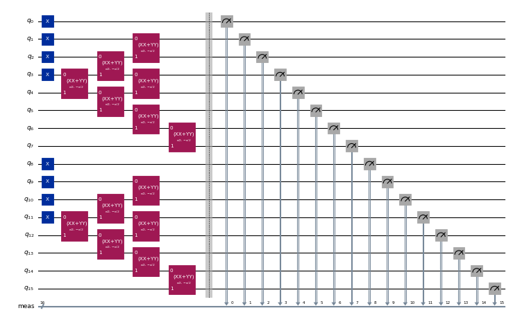
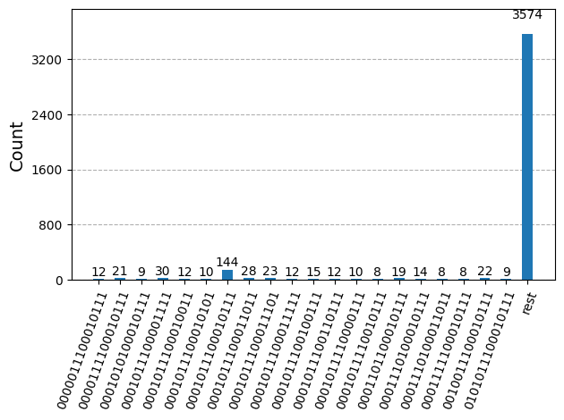
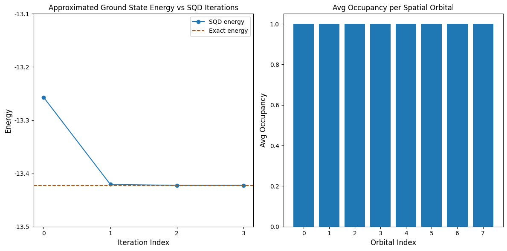

{/* doqumentation-source-hash: 6be25b99 */}

import TutorialFeedback from '@site/src/components/TutorialFeedback';

<OpenInLabBanner notebookPath="qiskit-addons/sqd/02_fermionic_lattice_hamiltonian.ipynb" />


Dalam tutorial ini kita melaksanakan sebuah [corak Qiskit](https://quantum.cloud.ibm.com/docs/guides/intro-to-patterns) yang menunjukkan cara memproses sampel kuantum yang bising selepas pengukuran untuk mencari penghampiran kepada keadaan asas Hamiltonian kekisi Fermionic yang dikenali sebagai model Anderson single-impurity. Kita akan mengikuti pendekatan penjajaran kuantum berasaskan sampel untuk memproses sampel yang diambil daripada satu set keadaan asas Krylov ``16``-Qubit ke atas selang masa yang semakin meningkat. Keadaan-keadaan ini direalisasikan pada peranti kuantum menggunakan Trotterization evolusi masa. Bagi mengambil kira kesan bunyi kuantum, teknik pemulihan konfigurasi digunakan. Dengan mengandaikan keadaan awal yang baik dan kejarangannya keadaan asas, [pendekatan ini terbukti menumpu dengan cekap](https://arxiv.org/abs/2501.09702).

Corak ini boleh diterangkan dalam empat langkah:

1. **Langkah 1: Petakan kepada masalah kuantum**
    - Jana satu set keadaan asas Krylov (iaitu litar evolusi masa Trotterized) ke atas selang masa yang semakin meningkat untuk menganggar keadaan asas
2. **Langkah 2: Optimumkan masalah**
    - Transpile litar-litar untuk Backend
3. **Langkah 3: Jalankan eksperimen**
    - Ambil sampel daripada litar menggunakan primitif ``Sampler``
4. **Langkah 4: Proses keputusan**
   - Gelung pemulihan konfigurasi kendiri-konsisten
       - Proses set penuh sampel bitstring selepas pengukuran, menggunakan pengetahuan terdahulu tentang nombor zarah dan purata penghunian orbital yang dikira pada lelaran terbaru
       - Buat kelompok subsampel secara kebarangkalian daripada bitstring yang dipulihkan
       - Unjur dan jajarkan Hamiltonian kekisi Fermionic ke atas setiap subruang yang disampel
       - Simpan tenaga keadaan asas minimum yang ditemui merentasi semua kelompok dan kemas kini purata penghunian orbital
### Langkah 1: Petakan masalah kepada litar kuantum {#step-1-map-problem-to-a-quantum-circuit}

Pertama, kita akan mencipta Hamiltonian satu-jasad dan dua-jasad yang menerangkan model Anderson single-impurity (SIAM) satu dimensi dengan ``7`` tapak mandi (``8`` elektron dalam ``8`` orbital). Model ini digunakan untuk menerangkan bendasing magnet yang terbenam dalam logam.

Kemudian kita akan mencipta litar Trotter ``16``-Qubit yang digunakan untuk menjana subruang Krylov kuantum.

```python
# Added by doQumentation — required packages for this notebook
!pip install -q ffsim matplotlib numpy qiskit qiskit-addon-sqd qiskit-ibm-runtime scipy
```

```python
import numpy as np

n_bath = 7  # number of bath sites

V = 1  # hybridization amplitude
t = 1  # bath hopping amplitude
U = 10  # Impurity onsite repulsion
eps = -U / 2  # Chemical potential for the impurity

# Place the impurity on the first qubit
impurity_index = 0

# One body matrix elements in the "position" basis
h1e = -t * np.diag(np.ones(n_bath), k=1) - t * np.diag(np.ones(n_bath), k=-1)
h1e[impurity_index, impurity_index + 1] = -V
h1e[impurity_index + 1, impurity_index] = -V
h1e[impurity_index, impurity_index] = eps

# Two body matrix elements in the "position" basis
h2e = np.zeros((n_bath + 1, n_bath + 1, n_bath + 1, n_bath + 1))
h2e[impurity_index, impurity_index, impurity_index, impurity_index] = U
```

Seterusnya, kita akan menjana subruang Krylov kuantum dengan satu set litar kuantum Trotterized. Di sini kita mencipta pembantu untuk menjana keadaan awal (rujukan) serta evolusi masa untuk bahagian satu-jasad dan dua-jasad Hamiltonian. Untuk penerangan yang lebih terperinci mengenai model ini dan cara litar direka bentuk, sila rujuk [kertas kerja](https://arxiv.org/abs/2501.09702).

```python
import ffsim
import scipy
from qiskit import QuantumCircuit, QuantumRegister
from qiskit.circuit.library import CPhaseGate, XGate, XXPlusYYGate

n_modes = n_bath + 1
nelec = (n_modes // 2, n_modes // 2)

dt = 0.2
Utar = scipy.linalg.expm(-1j * dt * h1e)

# The reference state
def initial_state(q_circuit, norb, nocc):
    """Prepare an initial state."""
    for i in range(nocc):
        q_circuit.append(XGate(), [i])
        q_circuit.append(XGate(), [norb + i])
    rot = XXPlusYYGate(np.pi / 2, -np.pi / 2)

    for i in range(3):
        for j in range(nocc - i - 1, nocc + i, 2):
            q_circuit.append(rot, [j, j + 1])
            q_circuit.append(rot, [norb + j, norb + j + 1])
    q_circuit.append(rot, [j + 1, j + 2])
    q_circuit.append(rot, [norb + j + 1, norb + j + 2])

# The one-body time evolution
free_fermion_evolution = ffsim.qiskit.OrbitalRotationJW(n_modes, Utar)

# The two-body time evolution
def append_diagonal_evolution(dt, U, impurity_qubit, num_orb, q_circuit):
    """Append two-body time evolution to a quantum circuit."""
    if U != 0:
        q_circuit.append(
            CPhaseGate(-dt / 2 * U),
            [impurity_qubit, impurity_qubit + num_orb],
        )
```

Jana ``d`` keadaan yang berevolusi mengikut masa yang menentukan subruang Krylov kuantum. Di sini, kita telah memilih ``d=8``. Ralat daripada pensampelan keadaan asas Krylov menumpu dengan peningkatan ``d``. Perlu diambil perhatian bahawa kekhususan contoh masalah ini membolehkan penyusunan yang cekap bagi evolusi satu-jasad menggunakan `OrbitalRotationJW`; namun begitu, secara umum, seseorang boleh menggunakan [PauliEvolutionGate](https://quantum.cloud.ibm.com/docs/api/qiskit/qiskit.circuit.library.PauliEvolutionGate) Qiskit untuk melaksanakan evolusi masa Trotterized bagi Hamiltonian penuh.

```python
# Generate the initial state
qubits = QuantumRegister(2 * n_modes, name="q")
init_state = QuantumCircuit(qubits)
initial_state(init_state, n_modes, n_modes // 2)
init_state.draw("mpl", scale=0.4, fold=-1)

d = 8  # Number of Krylov basis states
circuits = []
for i in range(d):
    circ = init_state.copy()
    circuits.append(circ)
    for _ in range(i):
        append_diagonal_evolution(dt, U, impurity_index, n_modes, circ)
        circ.append(free_fermion_evolution, qubits)
        append_diagonal_evolution(dt, U, impurity_index, n_modes, circ)
    circ.measure_all()
```

```python
circuits[0].draw("mpl", scale=0.4, fold=-1)
```



```python
circuits[-1].draw("mpl", scale=0.4, fold=-1)
```


### Langkah 2: Optimumkan masalah {#step-2-optimize-the-problem}

Setelah kita mencipta litar Trotterized, kita akan mengoptimumkannya untuk perkakasan sasaran. Kita perlu memilih peranti perkakasan yang hendak digunakan sebelum pengoptimuman. Kita akan menggunakan Backend palsu 127-Qubit daripada ``qiskit_ibm_runtime`` untuk meniru peranti sebenar. Untuk dijalankan pada QPU sebenar, gantikan sahaja Backend palsu dengan Backend sebenar. Lihat [dokumen Qiskit IBM Runtime](https://quantum.cloud.ibm.com/docs/guides/get-started-with-primitives#get-started-with-sampler) untuk maklumat lanjut.

```python
from qiskit_ibm_runtime.fake_provider.backends import FakeSherbrooke

backend = FakeSherbrooke()
```

Seterusnya, kita akan men-transpile litar ke Backend sasaran menggunakan Qiskit.

```python
from qiskit.transpiler import generate_preset_pass_manager

# The circuit needs to be transpiled to the AerSimulator target
pass_manager = generate_preset_pass_manager(optimization_level=3, backend=backend)
isa_circuits = pass_manager.run(circuits)
```

### Langkah 3: Jalankan eksperimen {#step-3-execute-experiments}

Setelah mengoptimumkan litar untuk pelaksanaan perkakasan, kita bersedia untuk menjalankannya pada perkakasan sasaran dan mengumpul sampel bagi anggaran tenaga keadaan asas. Di sini kita menggunakan ``SamplerV2`` daripada ``qiskit-ibm-runtime`` untuk mensimulasikan sampel bising yang diambil daripada Backend ``ibm_sherbrooke``. Kemudian kita menggabungkan kiraan daripada setiap keadaan asas Krylov ke dalam satu kamus kiraan tunggal dan memplot 20 bitstring yang paling kerap disampel.

***Nota: [Qiskit Aer](https://qiskit.github.io/qiskit-aer/index.html) diperlukan untuk mensimulasikan sampel daripada litar yang di-transpile.***

```python
from qiskit.primitives import BitArray
from qiskit.visualization import plot_histogram
from qiskit_ibm_runtime import SamplerV2 as Sampler

# Sample from the circuits
noisy_sampler = Sampler(backend, options={"simulator": {"seed_simulator": 24}})
job = noisy_sampler.run(isa_circuits, shots=500)

# Combine the counts from the individual Trotter circuits
bit_array = BitArray.concatenate_shots([result.data.meas for result in job.result()])

plot_histogram(bit_array.get_counts(), number_to_keep=20)
```



### Langkah 4: Proses keputusan {#step-4-post-process-the-results}

Sekarang, kita jalankan algoritma SQD menggunakan fungsi `diagonalize_fermionic_hamiltonian`. Lihat [dokumentasi API](../apidocs/qiskit_addon_sqd.fermion.rst#qiskit_addon_sqd.fermion.diagonalize_fermionic_hamiltonian) untuk penjelasan argumen bagi fungsi ini.

```python
from qiskit_addon_sqd.fermion import SCIResult, diagonalize_fermionic_hamiltonian

# List to capture intermediate results
result_history = []

def callback(results: list[SCIResult]):
    result_history.append(results)
    iteration = len(result_history)
    print(f"Iteration {iteration}")
    for i, result in enumerate(results):
        print(f"\tSubsample {i}")
        print(f"\t\tEnergy: {result.energy}")
        print(f"\t\tSubspace dimension: {np.prod(result.sci_state.amplitudes.shape)}")

rng = np.random.default_rng(24)
result = diagonalize_fermionic_hamiltonian(
    h1e,
    h2e,
    bit_array,
    samples_per_batch=300,
    norb=n_modes,
    nelec=nelec,
    num_batches=3,
    max_iterations=10,
    symmetrize_spin=True,
    callback=callback,
    seed=rng,
)
```

```text
Iteration 1
	Subsample 0
		Energy: -13.257128325607997
		Subspace dimension: 3969
	Subsample 1
		Energy: -13.257128325607997
		Subspace dimension: 3969
	Subsample 2
		Energy: -13.257128325607997
		Subspace dimension: 3969
Iteration 2
	Subsample 0
		Energy: -13.319666127542039
		Subspace dimension: 4096
	Subsample 1
		Energy: -13.420534292304595
		Subspace dimension: 4624
	Subsample 2
		Energy: -9.136171594591085
		Subspace dimension: 4624
Iteration 3
	Subsample 0
		Energy: -13.422491814612833
		Subspace dimension: 4900
	Subsample 1
		Energy: -13.422491814612833
		Subspace dimension: 4900
	Subsample 2
		Energy: -13.422491814612833
		Subspace dimension: 4900
Iteration 4
	Subsample 0
		Energy: -13.422491814612833
		Subspace dimension: 4900
	Subsample 1
		Energy: -13.422491814612833
		Subspace dimension: 4900
	Subsample 2
		Energy: -13.422491814612833
		Subspace dimension: 4900
```

Sekarang, kita plot keputusan. Plot pertama menunjukkan bahawa selepas beberapa lelaran, kita mendapat tenaga keadaan asas yang tepat.

Contoh ini cukup kecil sehingga kita dapat meneroka ruang Hilbert penuh, seperti yang kelihatan dalam pernyataan print di atas. Ingat, ruang Hilbert penuh berdimensi ``(num_orbitals pilih nelec_a) * (num_orbitals pilih nelec_b)``. Jadi untuk masalah ini: `(8 choose 4)**2 = 4900`. Dimensi subruang meningkat disebabkan oleh pemulihan konfigurasi yang dipertingkatkan, dan juga fakta bahawa algoritma SQD membawa konfigurasi penting dari satu lelaran ke lelaran seterusnya. Pada lelaran terakhir, kita sedang menjajari dalam keseluruhan ruang Hilbert.

Plot kedua menunjukkan purata penghunian setiap orbital spatial merentasi semua penyelesaian kelompok. Kita nampak bahawa dengan kebarangkalian tinggi setiap orbital mengandungi satu elektron.

```python
import matplotlib.pyplot as plt

exact_energy = -13.422491814605827
min_es = [min(result, key=lambda res: res.energy).energy for result in result_history]
min_id, min_e = min(enumerate(min_es), key=lambda x: x[1])

# Data for energies plot
x1 = range(len(result_history))
yt1 = list(np.arange(-13.5, -13.1, 0.1))
ytl = [f"{i:.1f}" for i in yt1]

# Data for avg spatial orbital occupancy
y2 = np.sum(result.orbital_occupancies, axis=0)
x2 = range(len(y2))

fig, axs = plt.subplots(1, 2, figsize=(12, 6))

# Plot energies
axs[0].plot(x1, min_es, label="SQD energy", marker="o")
axs[0].set_xticks(x1)
axs[0].set_xticklabels(x1)
axs[0].set_yticks(yt1)
axs[0].set_yticklabels(ytl)
axs[0].axhline(y=exact_energy, color="#BF5700", linestyle="--", label="Exact energy")
axs[0].set_title("Approximated Ground State Energy vs SQD Iterations")
axs[0].set_xlabel("Iteration Index", fontdict={"fontsize": 12})
axs[0].set_ylabel("Energy", fontdict={"fontsize": 12})
axs[0].legend()

# Plot orbital occupancy
axs[1].bar(x2, y2, width=0.8)
axs[1].set_xticks(x2)
axs[1].set_xticklabels(x2)
axs[1].set_title("Avg Occupancy per Spatial Orbital")
axs[1].set_xlabel("Orbital Index", fontdict={"fontsize": 12})
axs[1].set_ylabel("Avg Occupancy", fontdict={"fontsize": 12})

print(f"Exact energy: {exact_energy:.5f}")
print(f"SQD energy: {min_e:.5f}")
print(f"Absolute error: {abs(min_e - exact_energy):.5f}")
plt.tight_layout()
plt.show()
```

```text
Exact energy: -13.42249
SQD energy: -13.42249
Absolute error: 0.00000
```



<TutorialFeedback />
