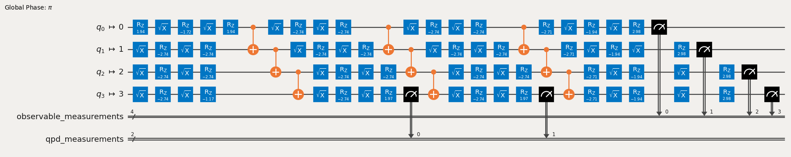

{/* doqumentation-source-hash: 04893c53 */}

import TutorialFeedback from '@site/src/components/TutorialFeedback';

<OpenInLabBanner notebookPath="qiskit-addons/cutting/02_gate_cutting_to_reduce_circuit_depth.ipynb" />


În acest tutorial, vom reduce adâncimea unui Circuit prin tăierea Gate-urilor îndepărtate, evitând astfel Gate-urile swap care ar fi introduse altfel de rutare.

Aceștia sunt pașii pe care îi vom urma în cadrul acestui [pattern Qiskit](https://quantum.cloud.ibm.com/docs/guides/intro-to-patterns):

- **Pasul 1: Maparea problemei pe circuite și operatori cuantici**:
    - Maparea hamiltonianului pe un Circuit cuantic.
- **Pasul 2: Optimizarea pentru hardware-ul țintă** [_Utilizează addon-ul de cutting_]:
    - <font color='#0F62FE'>Tăierea Circuit-ului și a observabilului.</font>
    - Transpilarea subexperimentelor pentru hardware.
- **Pasul 3: Executarea pe hardware-ul țintă**:
    - Rularea subexperimentelor obținute în Pasul 2 folosind primitiva `Sampler`.
- **Pasul 4: Post-procesarea rezultatelor** [_Utilizează addon-ul de cutting_]:
    - <font color='#0F62FE'>Combinarea rezultatelor din Pasul 3 pentru a reconstitui valoarea așteptată a observabilului în cauză.</font>
## Pasul 1: Mapare {#pasul-1-mapare}

### Crearea unui Circuit pentru a rula pe Backend {#crearea-unui-circuit-pentru-a-rula-pe-backend}

```python
# Added by doQumentation — required packages for this notebook
!pip install -q numpy qiskit qiskit-addon-cutting qiskit-aer qiskit-ibm-runtime
```

```python
from qiskit.circuit.library import efficient_su2

circuit = efficient_su2(num_qubits=4, entanglement="circular")
circuit.assign_parameters([0.4] * len(circuit.parameters), inplace=True)
circuit.draw("mpl", scale=0.8)
```


### Specificarea unui observabil {#specificarea-unui-observabil}

```python
from qiskit.quantum_info import SparsePauliOp

observable = SparsePauliOp(["ZZII", "IZZI", "-IIZZ", "XIXI", "ZIZZ", "IXIX"])
```

## Pasul 2: Optimizare {#pasul-2-optimizare}

### Specificarea unui Backend {#specificarea-unui-backend}

Poți furniza fie un Backend fals, fie un Backend hardware din Qiskit Runtime.

```python
from qiskit_ibm_runtime.fake_provider import FakeManilaV2

backend = FakeManilaV2()
```

### Transpilarea Circuit-ului, vizualizarea swap-urilor și notarea adâncimii {#transpile-the-circuit-visualize-the-swaps-and-note-the-depth}

Alegem un layout care necesită două swap-uri pentru a executa Gate-urile dintre Qubit-urile 3 și 0 și încă două swap-uri pentru a readuce Qubit-urile la pozițiile lor inițiale.

```python
from qiskit.transpiler import generate_preset_pass_manager

pass_manager = generate_preset_pass_manager(
    optimization_level=1, backend=backend, initial_layout=[0, 1, 2, 3]
)

transpiled_qc = pass_manager.run(circuit)
print(f"Transpiled circuit depth: {transpiled_qc.depth(lambda x: len(x.qubits) >= 2)}")
```

```text
Transpiled circuit depth: 30
```

```python
transpiled_qc.draw("mpl", scale=0.4, idle_wires=False, fold=-1)
```


### Înlocuirea Gate-urilor îndepărtate cu `TwoQubitQPDGate` prin specificarea indicilor lor {#replace-distant-gates-with-twoqubitqpdgates-by-specifying-their-indices}

`cut_gates` va înlocui Gate-urile de la indicii specificați cu `TwoQubitQPDGate` și va returna, de asemenea, o listă de instanțe `QPDBasis` — câte una pentru fiecare descompunere de Gate.

```python
from qiskit_addon_cutting import cut_gates

# Find the indices of the distant gates
cut_indices = [
    i
    for i, instruction in enumerate(circuit.data)
    if {circuit.find_bit(q)[0] for q in instruction.qubits} == {0, 3}
]

# Decompose distant CNOTs into TwoQubitQPDGate instances
qpd_circuit, bases = cut_gates(circuit, cut_indices)

qpd_circuit.draw("mpl", scale=0.8)
```


### Generarea subexperimentelor pentru a rula pe Backend {#generarea-subexperimentelor-pentru-a-rula-pe-backend}

`generate_cutting_experiments` acceptă un Circuit ce conține instanțe `TwoQubitQPDGate` și observabile sub formă de `PauliList`.

Pentru a simula valoarea așteptată a Circuit-ului de dimensiune completă, sunt generate mai multe subexperimente din distribuția de quasiprobabilitate comună a Gate-urilor descompuse și sunt executate pe unul sau mai multe Backend-uri. Numărul de eșantioane preluate din distribuție este controlat de `num_samples`, iar un coeficient combinat este dat pentru fiecare eșantion unic. Pentru mai multe informații despre modul în care sunt calculați coeficienții, consultă [materialul explicativ](../explanation/index.rst).

**Notă:** Argumentul ``observables`` pentru `generate_cutting_experiments` este de tip `PauliList`. Coeficienții și fazele termenilor observabilului sunt ignorați în timpul descompunerii problemei și executării subexperimentelor. Aceștia pot fi re-aplicați în timpul reconstituirii valorii așteptate.

```python
import numpy as np
from qiskit_addon_cutting import generate_cutting_experiments

# Generate the subexperiments and sampling coefficients
subexperiments, coefficients = generate_cutting_experiments(
    circuits=qpd_circuit, observables=observable.paulis, num_samples=np.inf
)
```

### Calcularea costului de eșantionare pentru tăieturile alese {#calculate-the-sampling-overhead-for-the-chosen-cuts}

Aici tăiem trei Gate-uri CNOT, rezultând un cost de eșantionare de $9^3$.

Pentru mai multe informații despre costul de eșantionare generat de circuit cutting, consultă [materialul explicativ](../explanation/index.rst).

```python
print(f"Sampling overhead: {np.prod([basis.overhead for basis in bases])}")
```

```text
Sampling overhead: 729.0
```

### Demonstrarea că subexperimentele QPD vor fi mai puțin adânci după tăierea Gate-urilor îndepărtate {#demonstrate-that-the-qpd-subexperiments-will-be-shallower-after-cutting-distant-gates}

Iată un exemplu de subexperiment ales arbitrar, generat din Circuit-ul QPD. Adâncimea sa a fost redusă cu mai mult de jumătate. Multe dintre aceste subexperimente probabilistice trebuie generate și evaluate pentru a reconstitui o valoare așteptată a Circuit-ului mai adânc.

```python
# Transpile the decomposed circuit to the same layout
transpiled_qpd_circuit = pass_manager.run(subexperiments[100])

print(
    f"Original circuit depth after transpile: {transpiled_qc.depth(lambda x: len(x.qubits) >= 2)}"
)
print(
    f"QPD subexperiment depth after transpile: {transpiled_qpd_circuit.depth(lambda x: len(x.qubits) >= 2)}"
)
transpiled_qpd_circuit.draw("mpl", scale=0.8, idle_wires=False, fold=-1)
```

```text
Original circuit depth after transpile: 30
QPD subexperiment depth after transpile: 7
```



### Pregătirea subexperimentelor pentru Backend {#prepare-subexperiments-for-the-backend}

```python
# Transpile the subeperiments to the backend's instruction set architecture (ISA)
isa_subexperiments = pass_manager.run(subexperiments)
```

## Pasul 3: Executare {#pasul-3-executare}

### Rularea subexperimentelor folosind primitiva Qiskit Runtime Sampler {#rularea-subexperimentelor-folosind-primitiva-qiskit-runtime-sampler}

```python
from qiskit_ibm_runtime import SamplerV2

# Set up the Qiskit Runtime Sampler primitive.  For a fake backend, this will use a local simulator.
sampler = SamplerV2(backend)

# Submit the subexperiments
job = sampler.run(isa_subexperiments)
```

```python
# Retrieve the results
results = job.result()
```

## Pasul 4: Post-procesare {#pasul-4-post-procesare}

### Reconstituirea valorii așteptate {#reconstruct-the-expectation-value}

Reconstituiește valorile așteptate pentru fiecare termen al observabilului și combină-le pentru a reconstitui valoarea așteptată a observabilului original.

```python
from qiskit_addon_cutting import reconstruct_expectation_values

reconstructed_expval_terms = reconstruct_expectation_values(
    results,
    coefficients,
    observable.paulis,
)
# Reconstruct final expectation value
reconstructed_expval = np.dot(reconstructed_expval_terms, observable.coeffs)
```

### Compararea valorii așteptate reconstituite cu valoarea așteptată exactă din Circuit-ul și observabilul original {#compare-the-reconstructed-expectation-value-with-the-exact-expectation-value-from-the-original-circuit-and-observable}

```python
from qiskit_aer.primitives import EstimatorV2

estimator = EstimatorV2()
exact_expval = estimator.run([(circuit, observable)]).result()[0].data.evs
print(f"Reconstructed expectation value: {np.real(np.round(reconstructed_expval, 8))}")
print(f"Exact expectation value: {np.round(exact_expval, 8)}")
print(f"Error in estimation: {np.real(np.round(reconstructed_expval-exact_expval, 8))}")
print(
    f"Relative error in estimation: {np.real(np.round((reconstructed_expval-exact_expval) / exact_expval, 8))}"
)
```

```text
Reconstructed expectation value: 0.44018555
Exact expectation value: 0.50497603
Error in estimation: -0.06479049
Relative error in estimation: -0.12830408
```

<TutorialFeedback />
