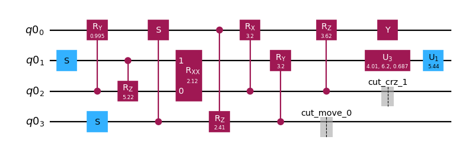

{/* doqumentation-source-hash: 781aa50d */}

import TutorialFeedback from '@site/src/components/TutorialFeedback';

<OpenInLabBanner notebookPath="qiskit-addons/cutting/03_wire_cutting_via_move_instruction.ipynb" />


În acest tutorial, vom reconstrui valorile de așteptare ale unui Circuit cu șapte Qubituri împărțindu-l în două circuite de câte patru Qubituri, folosind tăierea firelor.

Aceștia sunt pașii pe care îi vom urma în acest [tipar Qiskit](https://quantum.cloud.ibm.com/docs/guides/intro-to-patterns):

- **Pasul 1: Maparea problemei pe circuite și operatori cuantici**:
    - Maparea hamiltonianului pe un Circuit cuantic.
- **Pasul 2: Optimizarea pentru hardware-ul țintă** [_Folosește addon-ul de tăiere_]:
    - <font color='#0F62FE'>Taie Circuit-ul și observabilul.</font>
    - Transpilează subexperimentele pentru hardware.
- **Pasul 3: Execuția pe hardware-ul țintă**:
    - Rulează subexperimentele obținute în Pasul 2 folosind primitivul `Sampler`.
- **Pasul 4: Post-procesarea rezultatelor** [_Folosește addon-ul de tăiere_]:
    - <font color='#0F62FE'>Combină rezultatele din Pasul 3 pentru a reconstrui valoarea de așteptare a observabilului în cauză.</font>
## Pasul 1: Mapare {#pasul-1-mapare}

### Crearea unui Circuit de tăiat {#crearea-unui-circuit-de-taiat}

Mai întâi, pornim cu un Circuit inspirat din Fig. 1(a) a lucrării [arXiv:2302.03366v1](https://arxiv.org/abs/2302.03366v1).

```python
# Added by doQumentation — required packages for this notebook
!pip install -q numpy qiskit qiskit-addon-cutting qiskit-aer qiskit-ibm-runtime
```

```python
import numpy as np
from qiskit import QuantumCircuit

qc_0 = QuantumCircuit(7)
for i in range(7):
    qc_0.rx(np.pi / 4, i)
qc_0.cx(0, 3)
qc_0.cx(1, 3)
qc_0.cx(2, 3)
qc_0.cx(3, 4)
qc_0.cx(3, 5)
qc_0.cx(3, 6)
qc_0.cx(0, 3)
qc_0.cx(1, 3)
qc_0.cx(2, 3)
```

```text
<qiskit.circuit.instructionset.InstructionSet at 0x7f16ab191a80>
```

```python
qc_0.draw("mpl")
```


### Specificarea unui observabil {#specificarea-unui-observabil}

```python
from qiskit.quantum_info import SparsePauliOp

observable = SparsePauliOp(["ZIIIIII", "IIIZIII", "IIIIIIZ"])
```

## Pasul 2: Optimizare {#pasul-2-optimizare}

### Crearea unui nou Circuit în care instrucțiunile `Move` au fost plasate la locațiile de tăiere dorite {#crearea-unui-nou-circuit-cu-instructiuni-move}

Dat fiind Circuit-ul de mai sus, dorim să plasăm două tăieturi de fir pe linia Qubitului din mijloc, astfel încât Circuit-ul să poată fi separat în două circuite de câte patru Qubituri. O modalitate de a face acest lucru este să plasăm manual instrucțiuni `Move` pe două Qubituri care mută starea de pe un fir al Qubitului pe altul. O instrucțiune `Move` este conceptual echivalentă cu o operație de resetare pe al doilea Qubit, urmată de o poartă SWAP. Efectul acestei instrucțiuni este de a transfera starea primului Qubit (sursă) la cel de-al doilea Qubit (destinație), eliminând starea de intrare a celui de-al doilea Qubit. Pentru ca aceasta să funcționeze conform intenției, este important ca cel de-al doilea Qubit (destinație) să nu împartă nicio împletire cu restul sistemului; altfel, operația de resetare va determina colapsarea parțială a stării restului sistemului.

Aici construim un nou Circuit cu un Qubit suplimentar și operațiile `Move` la locul lor. În acest exemplu, putem reutiliza un Qubit: Qubit-ul sursă al primului `Move` devine Qubit-ul destinație al celei de-a doua operații `Move`.

Notă: Ca alternativă la lucrul direct cu instrucțiunile `Move`, se poate alege marcarea tăieturilor de fir folosind o instrucțiune `CutWire` pe un singur Qubit. Funcția `cut_wires` există pentru a transforma instrucțiunile `CutWire` în instrucțiuni `Move` pe Qubituri alocate nou. Cu toate acestea, spre deosebire de metoda manuală, această metodă automată nu permite reutilizarea firelor de Qubit. Consultă [ghidul practic](../how-tos/how_to_specify_cut_wires.ipynb) pentru `CutWire` pentru detalii.

```python
from qiskit_addon_cutting.instructions import Move

qc_1 = QuantumCircuit(8)
for i in [*range(4), *range(5, 8)]:
    qc_1.rx(np.pi / 4, i)
qc_1.cx(0, 3)
qc_1.cx(1, 3)
qc_1.cx(2, 3)
qc_1.append(Move(), [3, 4])
qc_1.cx(4, 5)
qc_1.cx(4, 6)
qc_1.cx(4, 7)
qc_1.append(Move(), [4, 3])
qc_1.cx(0, 3)
qc_1.cx(1, 3)
qc_1.cx(2, 3)

qc_1.draw("mpl")
```


### Crearea observabilului pentru noul Circuit {#crearea-observabilului-pentru-noul-circuit}

Acest observabil corespunde cu `observable`, dar trebuie să ținem cont corect de firul Qubitului suplimentar care a fost adăugat (adică inserăm un „I" la indexul 4). Rețineți că în Qiskit, reprezentarea șir qubit-0 corespunde caracterului Pauli cel mai din dreapta.

```python
observable_expanded = SparsePauliOp(["ZIIIIIII", "IIIIZIII", "IIIIIIIZ"])
```

### Separarea Circuit-ului și a observabilelor {#separarea-circuitului-si-a-observabilelor}

Ca în tutorialele anterioare, Qubiții care împărtășesc o etichetă de partiție comună vor fi grupați împreună, iar porțile neloc ale care acoperă mai mult de o partiție vor fi tăiate.

```python
from qiskit_addon_cutting import partition_problem

partitioned_problem = partition_problem(
    circuit=qc_1, partition_labels="AAAABBBB", observables=observable_expanded.paulis
)
subcircuits = partitioned_problem.subcircuits
subobservables = partitioned_problem.subobservables
bases = partitioned_problem.bases
```

### Vizualizarea problemei descompuse {#vizualizarea-problemei-descompuse}

```python
subobservables
```

```text
{'A': PauliList(['IIII', 'ZIII', 'IIIZ']),
 'B': PauliList(['ZIII', 'IIII', 'IIII'])}
```

```python
subcircuits["A"].draw("mpl")
```


```python
subcircuits["B"].draw("mpl")
```



### Calcularea costului de eșantionare pentru tăieturile alese {#calcularea-costului-de-esantionare}

Aici tăiem două fire, rezultând un cost de eșantionare de $4^4$.

Pentru mai multe informații despre costul de eșantionare generat de tăierea circuitelor, consultă [materialul explicativ](../explanation/index.rst).

```python
print(f"Sampling overhead: {np.prod([basis.overhead for basis in bases])}")
```

```text
Sampling overhead: 256.0
```

### Generarea subexperimentelor de rulat pe Backend {#generarea-subexperimentelor}

`generate_cutting_experiments` acceptă argumentele `circuits`/`observables` ca dicționare care mapează etichetele de partiție ale Qubiților la `subcircuit`/`subobservables` respective.

Pentru a simula valoarea de așteptare a Circuit-ului de dimensiune completă, se generează multe subexperimente din distribuția de quasiprobabilitate comună a porților descompuse și sunt executate pe unul sau mai multe Backend-uri. Numărul de eșantioane preluate din distribuție este controlat de `num_samples`, iar un coeficient combinat este dat pentru fiecare eșantion unic. Pentru mai multe informații despre cum sunt calculați coeficienții, consultă [materialul explicativ](../explanation/index.rst).

```python
from qiskit_addon_cutting import generate_cutting_experiments

subexperiments, coefficients = generate_cutting_experiments(
    circuits=subcircuits, observables=subobservables, num_samples=np.inf
)
```

### Alegerea unui Backend {#alegerea-unui-backend}

Aici folosim un Backend fals, ceea ce va determina Qiskit Runtime să ruleze în modul local (adică pe un simulator local).

```python
from qiskit_ibm_runtime.fake_provider import FakeManilaV2

backend = FakeManilaV2()
```

### Pregătirea subexperimentelor pentru Backend {#pregatirea-subexperimentelor-pentru-backend}

Trebuie să transpilăm circuitele cu Backend-ul nostru ca țintă înainte de a le trimite la Qiskit Runtime.

```python
from qiskit.transpiler import generate_preset_pass_manager

# Transpile the subexperiments to ISA circuits
pass_manager = generate_preset_pass_manager(optimization_level=1, backend=backend)
isa_subexperiments = {
    label: pass_manager.run(partition_subexpts)
    for label, partition_subexpts in subexperiments.items()
}
```

## Pasul 3: Execuție {#pasul-3-executie}

### Rularea subexperimentelor folosind primitivul Qiskit Runtime Sampler {#rularea-subexperimentelor}

```python
from qiskit_ibm_runtime import SamplerV2, Batch

# Submit each partition's subexperiments to the Qiskit Runtime Sampler
# primitive, in a single batch so that the jobs will run back-to-back.
with Batch(backend=backend) as batch:
    sampler = SamplerV2(mode=batch)
    jobs = {
        label: sampler.run(subsystem_subexpts, shots=2**12)
        for label, subsystem_subexpts in isa_subexperiments.items()
    }
```

```text
/home/garrison/Qiskit/qiskit-ibm-runtime/qiskit_ibm_runtime/session.py:157: UserWarning: Session is not supported in local testing mode or when using a simulator.
  warnings.warn(
```

```python
# Retrieve results
results = {label: job.result() for label, job in jobs.items()}
```

## Pasul 4: Post-procesare {#pasul-4-post-procesare}

### Reconstruirea valorii de așteptare {#reconstruirea-valorii-de-asteptare}

Reconstruiește valorile de așteptare pentru fiecare termen observabil și combină-le pentru a reconstrui valoarea de așteptare a observabilului original.

```python
from qiskit_addon_cutting import reconstruct_expectation_values

reconstructed_expval_terms = reconstruct_expectation_values(
    results,
    coefficients,
    subobservables,
)
reconstructed_expval = np.dot(reconstructed_expval_terms, observable.coeffs)
```

### Compararea valorii de așteptare reconstruite cu valoarea de așteptare exactă din Circuit-ul și observabilul original {#compararea-valorilor-de-asteptare}

```python
from qiskit_aer.primitives import EstimatorV2

estimator = EstimatorV2()
exact_expval = estimator.run([(qc_0, observable)]).result()[0].data.evs
print(f"Reconstructed expectation value: {np.real(np.round(reconstructed_expval, 8))}")
print(f"Exact expectation value: {np.round(exact_expval, 8)}")
print(f"Error in estimation: {np.real(np.round(reconstructed_expval-exact_expval, 8))}")
print(
    f"Relative error in estimation: {np.real(np.round((reconstructed_expval-exact_expval) / exact_expval, 8))}"
)
```

```text
Reconstructed expectation value: 1.51319069
Exact expectation value: 1.59099026
Error in estimation: -0.07779957
Relative error in estimation: -0.04890009
```

<TutorialFeedback />
