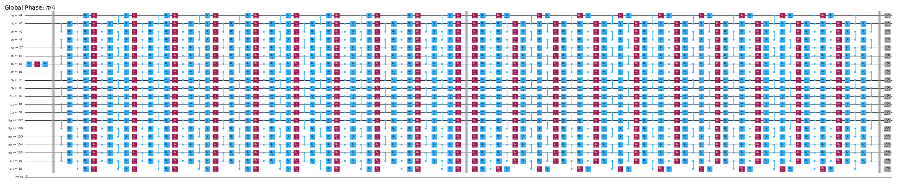

{/* doqumentation-source-hash: 3238351c */}

import TutorialFeedback from '@site/src/components/TutorialFeedback';

<OpenInLabBanner notebookPath="qiskit-addons/slc/01_getting_started.ipynb" />


##  Context {#context}
Acest tutorial demonstrează cum să atenuezi erorile folosind addon-ul Shaded lightcone (SLC). Acest addon reprezintă o evoluție a [tehnicii de anulare probabilistică a erorilor (PEC)](https://quantum.cloud.ibm.com/docs/guides/error-mitigation-and-suppression-techniques#probabilistic-error-cancellation-pec), în care un utilizator învață zgomotul straturilor unice dintr-un Circuit și apoi anulează zgomotul aplicând Gate-uri pe un singur Qubit și tehnici de post-procesare. Față de alte metode, PEC oferă limite mai robuste pentru distorsiunea rezultatului atenuat, dar tinde să sufere de un overhead mai ridicat în termeni de timp QPU. În timpul PEC, pentru a compensa atenuarea valorii de așteptare cauzată de zgomot, rezultatul mediu este rescalat cu un factor $\gamma = \exp(\sum_{l,\sigma} 2\lambda_{l,\sigma})$, unde $\lambda_{l,\sigma}$ este rata de zgomot învățată a erorii Pauli $\sigma$ la stratul $l$ din Circuit. Această rescalare mărește varianța cu un factor $\gamma^2$ și, prin urmare, înmulțește și numărul de execuții de Circuit necesare pe QPU cu $\gamma^2$, pe care îl numim cost de eșantionare sau overhead de eșantionare. Deoarece $\gamma$ crește exponențial, PEC este adesea limitat la circuite superficiale sau cu puțini Qubiți. Află mai multe despre PEC în [Probabilistic error cancellation with sparse Pauli-Lindblad models on noisy quantum processors.](https://arxiv.org/abs/2201.09866)

Dacă putem identifica erorile care nu trebuie atenuate, putem reduce exponențial acest cost de eșantionare. Un prim pas în această direcție este implementarea atenuării erorilor conștiente local, care folosește un „con de lumină" convențional, calculabil rapid, pentru a reduce overhead-ul PEC prin limitarea sensibilității unui observabil la erori pe parcursul Circuitului, extinzând fezabilitatea PEC la scări mai mari pentru anumite probleme. Erorile din afara acestui con de lumină nu pot afecta rezultatul măsurat și pot fi, prin urmare, excluse din procedura de anulare a erorilor. Această excludere reduce overhead-ul de eșantionare, în unele cazuri substanțial, fără a introduce distorsiuni suplimentare. În special, pentru măsurarea unui observabil local $O$ al unui Circuit de adâncime fixă, overhead-ul de eșantionare necesar ajunge în cele din urmă la un platou atunci când se scalează numărul de Qubiți din Circuit (a se vedea Fig. 2b în [Locality and Error Mitigation of Quantum Circuits.](https://arxiv.org/abs/2303.06496))

Conurile de lumină umbrite (SLC) merg mai departe, folosind simulări clasice pentru a limita mai strâns sensibilitatea la erori pe parcursul Circuitului. Aceasta schimbă o parte din timpul QPU cu timp CPU și reduce overhead-ul de eșantionare necesar pentru renormalizarea distorsiunii. În loc de o limită dură, fiecărei erori potențiale din Circuit i se atribuie o „umbră" gradată care limitează superior susceptibilitatea observabilului la acea eroare. Această caracterizare rafinată permite aplicații mai eficiente și mai țintite ale PEC cu varianță redusă, oferind totodată utilizatorului posibilitatea de a ajusta controlat distorsiunea în estimarea observabilului. Consultați [Lightcone shading for classically accelerated quantum error mitigation](https://arxiv.org/abs/2409.04401) pentru mai multe detalii.

Fluxul nostru de lucru pentru addon-ul SLC valorifică noul framework Samplomatic și Executor, permițând utilizatorilor să aibă un control mai modular al setărilor de execuție pentru suprimarea și atenuarea erorilor, menținând în același timp ușurința de utilizare pentru utilizatorii avansați. Pentru o înțelegere mai aprofundată a beneficiilor acestui framework și ale caracteristicilor sale generale, consultați tutorialul [Hello samplomatic](https://github.com/qiskit-community/qdc-challenges-2025/blob/main/day3_tutorials/Track_A/hello_samplomatic/Samplomatic%20-%20Hello%20World.ipynb).

### Flux de lucru pentru umbrirea conului de lumină, învățarea zgomotului și injecția de anti-zgomot {#flux-de-lucru-pentru-umbrirea-conului-de-lumina-invatarea-zgomotului-si-injectia-de-anti-zgomot}
Pentru modelarea zgomotului QPU, am ales să folosim un model de zgomot sparse Pauli-Lindblad cu rate de eroare Pauli pe 1 și 2 Qubiți, generate local pe fiecare Qubit și pe fiecare muchie a dispozitivului. Cu această alegere, fluxul de lucru de atenuare a erorilor SLC prezentat în acest tutorial este următorul:

a. CPU — Limitează impactul per eroare al erorilor Pauli pe 1 și 2 Qubiți

  1. Propagare înainte (limitează efectul asupra observabilului). Propagă fiecare eroare până la sfârșitul Circuitului și calculează comutatorul său cu observabilul.  
      - Trunchează termenii operatorului în timpul evoluției pentru a menține calculul tractabil.  
      - Îngustează suplimentar aceste limite printr-o propagare înapoi lejeră a observabilului bazată pe limite ale vitezei cuantice.
  2. Propagare înapoi (limitează efectul asupra stării inițiale). Propagă fiecare eroare până la începutul Circuitului și calculează comutatorul său cu starea inițială.

b. QPU — Învață ratele de zgomot. Folosește `NoiseLearner` pentru a estima ratele modelului de zgomot Pauli-Lindblad.

c. CPU — Prioritizează atenuarea

  1. Actualizează limitele îmbinate cu ratele de zgomot învățate. Combină limitele propagate înainte și înapoi calculate anterior și actualizează-le cu ratele de zgomot învățate.  
  2. Clasează componentele de zgomot ce urmează să fie atenuate folosind limitele calculate și ratele învățate. Prioritizează fiecare eroare de zgomot posibilă în funcție de impactul estimat asupra distorsiunii și de costul asociat corectării. 

d. QPU — Inserează anti-zgomotul și rulează. Execută Circuitul de interes cu anti-zgomot (zgomot invers) specificat folosind adnotările `Box`.

e. CPU — Estimează observabilul. Calculează valoarea de așteptare, aplicând post-selecție bazată pe măsurători pentru a reduce impactul zgomotului non-Markovian.

### Prezentare generală a învățării zgomotului {#prezentare-generala-a-invatarii-zgomotului}
Învățarea zgomotului este un pas comun în mai multe metode de atenuare a erorilor, realizat de [NoiseLearner](https://quantum.cloud.ibm.com/docs/en/guides/noise-learning), și poate fi observat în tutorialul nostru de [atenuare a erorilor PEA](https://quantum.cloud.ibm.com/docs/tutorials/probabilistic-error-amplification), precum și în [tutorialul Propagated noise absorption (PNA)](https://github.com/qiskit-community/qdc-challenges-2025/blob/main/day3_tutorials/Track_A/pna/propagated_noise_absorption.ipynb). În `NoiseLearnerV3`, un utilizator poate identifica specific straturile de zgomot ce urmează să fie învățate sub formă de obiecte [`CircuitInstruction`](https://quantum.cloud.ibm.com/docs/api/qiskit/qiskit.circuit.CircuitInstruction), ceea ce permite utilizatorilor să calculeze limitele SLC dorite ale zgomotului pentru fiecare strat în modul descris mai sus. Modelul Pauli-Lindblad învățat furnizează coeficienți ce urmează să fie folosiți în prioritizarea PEC-SLC. Modul în care Gate-urile sunt colectate în straturi poate fi determinat folosind funcțiile de conveniență `generate_boxing_pass_manager` și `unique_2q_instructions`, apoi introdus în funcția utilitară SLC `generate_noise_model_paulis`, după cum este descris în Pasul 2 de mai jos.

| **Partea 1** | **Partea 2** | **Partea 3** |
|-----------|-----------|-----------|
| Twirl Pauli pe straturile de Gate-uri cu 2 Qubiți | Repetă perechile de identitate ale straturilor și învață zgomotul | Derivă o fidelitate (eroare pentru fiecare canal de zgomot) |
|  |  |  |

### Prezentare generală a post-procesării {#prezentare-generala-a-post-procesarii}
După execuția pe hardware cuantic folosind framework-ul Samplomatic și Executor, convertim măsurătorile noastre de bituri în valoarea dorită a observabilului. În cazul Circuitului nostru Ising în oglindă, vom obține în mod ideal un observabil măsurat de 1, deoarece toți Qubiții ar trebui să revină în mod ideal la punctul lor de start $\ket{0}$. La calcularea valorii observabilului cu funcția noastră `expectation_values`, vom aplica câteva tehnici de post-procesare care reduc impactul zgomotului. Acestea includ eliminarea shot-urilor afectate de zgomot non-Markovian, atenuarea erorilor de citire, precum și luarea în considerare a detaliilor implementării noastre PEC. Detaliile sunt discutate în Pasul 4 de mai jos.

## Cerințe {#cerinte}
Înainte de a începe acest tutorial, asigură-te că ai instalate următoarele pachete:

- Qiskit IBM Runtime cu primitiva Executor (`pip install "qiskit-ibm-runtime @ git+https://github.com/Qiskit/qiskit-ibm-runtime.git"`)
- Qiskit addon Shaded lightcone 0.1 (`pip install "qiskit-addon-slc~=0.1.0`")
- Qiskit addon utils (`pip install "qiskit-addon-utils~=0.3.0"`)
- Samplomatic v0.16 sau mai recent (`pip install samplomatic`)
- Suport pentru vizualizare Qiskit (`pip install "qiskit[visualization]"`)
## Pasul 0. Configurare {#pasul-0-configurare}
Mai întâi, importă pachetele și funcțiile necesare pentru a rula cu succes acest notebook.

```python
# Added by doQumentation — required packages for this notebook
!pip install -q matplotlib numpy qiskit qiskit-addon-slc qiskit-addon-utils qiskit-ibm-runtime samplomatic
```

```python
import logging

logging.basicConfig(level=logging.INFO, format="%(asctime)s %(levelname)s %(module)s %(message)s")

# Setting this value prevents itertools.starmap deadlock on UNIX systems
from multiprocessing import set_start_method

set_start_method("spawn")

# Needed to prevent PySCF from parallelizing internally (SLC only)
%set_env OMP_NUM_THREADS=1
```

```text
env: OMP_NUM_THREADS=1
```

```python
import pickle

import numpy as np
import samplomatic
from matplotlib import pyplot as plt
from qiskit import QuantumCircuit
from qiskit.quantum_info import SparsePauliOp
from qiskit.transpiler import PassManager, generate_preset_pass_manager
from qiskit_addon_slc.bounds import (
    compute_backward_bounds,
    compute_forward_bounds,
    compute_local_scales,
    merge_bounds,
    tighten_with_speed_limit,
)
from qiskit_addon_slc.utils import generate_noise_model_paulis, map_modifier_ref_to_ref
from qiskit_addon_slc.visualization import draw_shaded_lightcone
from qiskit_addon_utils.exp_vals.expectation_values import executor_expectation_values
from qiskit_addon_utils.exp_vals.measurement_bases import get_measurement_bases
from qiskit_addon_utils.noise_management import gamma_from_noisy_boxes, trex_factors
from qiskit_addon_utils.noise_management.post_selection import PostSelector
from qiskit_addon_utils.noise_management.post_selection.transpiler.passes import (
    AddPostSelectionMeasures,
    AddSpectatorMeasures,
)
from qiskit_ibm_runtime import Executor, QiskitRuntimeService, QuantumProgram
from qiskit_ibm_runtime.noise_learner_v3 import NoiseLearnerV3
from qiskit_ibm_runtime.options import NoiseLearnerV3Options
from samplomatic.transpiler import generate_boxing_pass_manager
from samplomatic.utils import find_unique_box_instructions
```

## Pasul 1. Mapează problema {#pasul-1-mapeaza-problema}
Pentru ușurința demonstrației, selectăm un lanț Ising 1D în oglindă. Lanțul Ising 1D oferă o structură de Circuit frumos densă, convenabilă pentru a demonstra implementările PEC. Un Circuit în oglindă face ușor de cunoscut rezultatul așteptat (și anume, ar trebui să măsurăm un observabil de 1).

În plus, dorim să rulăm un Circuit în oglindă, astfel că pentru fiecare Gate din a doua jumătate a Circuitului trebuie să existe un Gate invers în prima jumătate. Deoarece observabilul măsurat **$<X_6 Z_{13}>$** are măsurători în baze non-Z, iar Executorul ține cont de baza dorită la sfârșitul Circuitului, furnizăm o funcție `prepare_basis` care inserează Gate-urile corespunzătoare la începutul Circuitului în oglindă. Acest detaliu este specific demonstrației noastre cu Circuit în oglindă. Funcția `get_measurement_bases` ne permite să identificăm cu ușurință ce Gate-uri sunt necesare și unde să le adăugăm, precum și să urmărim subtilitățile indexului Qubitului ce apar din convențiile adnotărilor `box` discutate în secțiunea „Pregătește măsurătorile canonice ale bazei".

```python
num_qubits = 20
target_obs_sparse = [("XZ", [6, 13], 1.0)]
```

```python
observable = SparsePauliOp.from_sparse_list(target_obs_sparse, num_qubits=num_qubits)
```

```python
bases_virt, reverser_virt = get_measurement_bases(observable)
```

```python
num_trotter_steps = 10
rx_angle = np.pi / 4
```

```python
def construct_ising_circuit(
    num_qubits: int, num_trotter_steps: int, rx_angle: float, barrier: bool = True
) -> QuantumCircuit:
    circuit = QuantumCircuit(num_qubits)

    for _step in range(num_trotter_steps):
        circuit.rx(rx_angle, range(num_qubits))
        if barrier:
            circuit.barrier()
        for first_qubit in (1, 2):
            for idx in range(first_qubit, num_qubits, 2):
                # equivalent to Rzz(-pi/2):
                circuit.sdg([idx - 1, idx])
                circuit.cz(idx - 1, idx)
        if barrier:
            circuit.barrier()

    return circuit

def prepare_basis(circuit: QuantumCircuit, basis: list[int]) -> QuantumCircuit:
    # basis is a list of integer values from 0 to 3. These map to the basis measurement as:
    # 0 = I; 1 = Z; 2 = X; 3 = Y
    assert len(basis) == circuit.num_qubits

    out_circ = circuit.copy_empty_like()
    for qb, bas in enumerate(basis):
        if bas in {0, 1}:
            continue
        if bas == 2:
            out_circ.h(qb)
        elif bas == 3:
            out_circ.rx(-np.pi / 2, qb)

    out_circ.barrier()
    out_circ.compose(circuit, inplace=True)
    return out_circ

def mirror_circuit(circuit: QuantumCircuit, *, inverse_first: bool = False) -> QuantumCircuit:
    mirror_circ = circuit.copy_empty_like()
    mirror_circ.compose(circuit.inverse() if inverse_first else circuit, inplace=True)
    mirror_circ.barrier()
    mirror_circ.compose(circuit if inverse_first else circuit.inverse(), inplace=True)
    mirror_circ.measure_active()
    return mirror_circ
```

```python
# Instantiate circuit
circuit = construct_ising_circuit(num_qubits, num_trotter_steps, rx_angle, barrier=False)
mirrored_circuit = mirror_circuit(circuit, inverse_first=True)
mirrored_circuit = prepare_basis(mirrored_circuit, bases_virt[0])
```

```python
mirrored_circuit.draw("mpl", fold=-1, scale=0.3, idle_wires=False, measure_arrows=False)
```


## Pasul 2. Optimizează {#step-2-optimize}
Vom optimiza detaliile asociate cu circuitul care urmează să fie rulat, cu observabila de măsurat și cu parametrii de învățare a zgomotului. Ca punct de plecare, ne asigurăm că instanțiem un backend cu porți fracționare activate ca opțiune. Aceste porți fracționare vor permite o sensibilitate mai mare în unele dintre filtrările noastre de post-selecție.

```python
token = "<YOUR_TOKEN>"
instance = "<YOUR_INSTANCE>"

# This is used to retrieve shared results
shared_service = QiskitRuntimeService(
    channel="ibm_quantum_platform",
    token=token,
    instance=instance,
)

# This is used to run on real hardware
service = service = QiskitRuntimeService()
```

```text
qiskit_runtime_service._discover_account:WARNING:2025-11-10 11:19:40,108: Loading account with the given token. A saved account will not be used.
```

```python
backend = service.backend("ibm_kingston", use_fractional_gates=True)
```

Mai întâi, vom transpila circuitul nostru la instrucțiuni ISA, [după cum este necesar pentru execuția pe QPU-urile noastre](https://www.ibm.com/quantum/blog/isa-circuits). Pentru datele colectate în acest experiment, selectăm manual qubiții noștri pe baza evaluării celei mai bune calități a lanțului.

```python
layout = [44, 45, 46, 47, 57, 67, 68, 69, 78, 89, 88, 87, 97, 107, 106, 105, 104, 103, 96, 83]
```

```python
isa_pm = generate_preset_pass_manager(backend=backend, initial_layout=layout, optimization_level=0)

isa_circuit = isa_pm.run(mirrored_circuit)
assert isa_circuit.layout.final_index_layout() == layout

isa_observable = observable.apply_layout(layout, num_qubits=isa_circuit.num_qubits)
```

```text
2025-11-10 11:19:57,810 INFO base_tasks Pass: ContainsInstruction - 0.00715 (ms)
2025-11-10 11:19:57,811 INFO base_tasks Pass: UnitarySynthesis - 0.00525 (ms)
2025-11-10 11:19:57,811 INFO base_tasks Pass: HighLevelSynthesis - 0.02599 (ms)
2025-11-10 11:19:57,811 INFO base_tasks Pass: BasisTranslator - 0.09131 (ms)
2025-11-10 11:19:57,811 INFO base_tasks Pass: SetLayout - 0.02623 (ms)
2025-11-10 11:19:57,812 INFO base_tasks Pass: FullAncillaAllocation - 0.14400 (ms)
2025-11-10 11:19:57,812 INFO base_tasks Pass: EnlargeWithAncilla - 0.06318 (ms)
2025-11-10 11:19:57,813 INFO base_tasks Pass: ApplyLayout - 0.29802 (ms)
2025-11-10 11:19:57,813 INFO base_tasks Pass: CheckMap - 0.07820 (ms)
2025-11-10 11:19:57,814 INFO base_tasks Pass: FilterOpNodes - 0.33283 (ms)
2025-11-10 11:19:57,814 INFO base_tasks Pass: UnitarySynthesis - 0.00691 (ms)
2025-11-10 11:19:57,814 INFO base_tasks Pass: HighLevelSynthesis - 0.13208 (ms)
2025-11-10 11:19:57,816 INFO base_tasks Pass: BasisTranslator - 1.00303 (ms)
2025-11-10 11:19:57,818 INFO base_tasks Pass: FoldRzzAngle - 1.78719 (ms)
2025-11-10 11:19:57,818 INFO base_tasks Pass: ContainsInstruction - 0.00691 (ms)
2025-11-10 11:19:57,818 INFO base_tasks Pass: InstructionDurationCheck - 0.00405 (ms)
```

```python
wire_order = layout + [q for q in range(isa_circuit.num_qubits) if q not in layout]
isa_circuit.draw(
    "mpl", fold=-1, scale=0.3, idle_wires=False, wire_order=wire_order, measure_arrows=False
)
```



### Încadrează circuitul în cutii {#box-the-circuit}
Pentru ușurința implementării, vom utiliza pasul de transpilare `generate_boxing_pass_manager`, care plasează instrucțiunile circuitului în cutii adnotate. Aceste cutii indică clar unde, în cazul PEC, trebuie injectată antizgomotul în circuit. Pentru detalii despre setări, consultă [documentația Samplomatic.](https://qiskit.github.io/samplomatic/)

Rețineți că fluxul de lucru SLC implică utilizarea `inject_noise_strategy="individual_modification"` ulterior în proces, deoarece aceasta ne permite să identificăm în mod unic fiecare `BoxOp` din circuit.

Funcția `find_unique_box_instructions` iterează prin circuitul încadrat furnizat și le identifică pe cele care au straturi 2Q unice sau măsurători, în scopul învățării zgomotului și al injecției de zgomot.

```python
# Box circuit with Twirl and InjectNoise annotations
boxes_pm = generate_boxing_pass_manager(
    twirling_strategy="active",
    inject_noise_strategy="individual_modification",
    inject_noise_targets="gates",
    measure_annotations="all",
)

boxed_circuit = boxes_pm.run(isa_circuit)

# Find the unique instructions (layers) from boxed circuit
unique_2q_instructions = find_unique_box_instructions(
    boxed_circuit, normalize_annotations=None, undress_boxes=True
)
```

```text
2025-11-10 11:20:01,088 INFO base_tasks Pass: RemoveBarriers - 0.02289 (ms)
2025-11-10 11:20:01,100 INFO base_tasks Pass: GroupGatesIntoBoxes - 12.38990 (ms)
2025-11-10 11:20:01,101 INFO base_tasks Pass: GroupMeasIntoBoxes - 0.47898 (ms)
2025-11-10 11:20:01,104 INFO base_tasks Pass: AddTerminalRightDressedBoxes - 2.88177 (ms)
2025-11-10 11:20:01,111 INFO base_tasks Pass: AddInjectNoise - 6.66904 (ms)
```

```python
boxed_circuit.draw(
    "mpl", fold=-1, scale=0.3, idle_wires=False, wire_order=wire_order, measure_arrows=False
)
```


### Pregătește măsurătorile bazelor canonice {#prepare-canonical-bases-measurements}
Din cauza modului în care qubiții sunt etichetați la identificarea straturilor 2Q unice, trebuie să ai grijă deosebită în urmărirea ordonării qubiților. Mai jos, introducem noțiunea de `canonical_qubits` ca mijloc de actualizare corespunzătoare a ordonării qubiților la furnizarea acesteia executorului, ca urmare a modului în care ordinea qubiților este captată la încadrarea circuitelor și la găsirea instrucțiunilor unice. Consultă documentația privind [convenția de ordonare a qubiților](https://qiskit.github.io/samplomatic/guides/samplex_io.html#qubit-ordering-convention) pentru detalii.

```python
# Determine the canonical qubits order
meas_box = boxed_circuit.data[-1]
canonical_qubits = [
    idx for idx, qubit in enumerate(boxed_circuit.qubits) if qubit in meas_box.qubits
]

# map canonical qubit to physical (isa) qubit
c_2_p = {c: p for c, p in enumerate(canonical_qubits)}
# map physical (isa) qubit to virtual qubit (index in original circuit)
p_2_v = {p: v for v, p in enumerate(layout)}
# compute map between virtual and canonical qubit indices.
c_2_v = {c: p_2_v[p] for c, p in c_2_p.items()}

assert len(c_2_v) == num_qubits

bases_canon = [
    np.array([base_i[c_2_v[c]] for c in range(num_qubits)], dtype=np.uint8) for base_i in bases_virt
]
```
### Flux de lucru pentru umbrirea conului de lumină, învățarea zgomotului și injecția anti-zgomot {#workflow-for-lightcone-shading-noise-learning-and-anti-noise-injection}

> **Notă**: Pentru implementarea SLC-PEC din acest tutorial, rulăm calculele de margini SLC **înainte** ca învățarea zgomotului să fie finalizată, astfel încât circuitul care urmează să fie atenuat să fie rulat cât mai aproape în timp de modelul de zgomot învățat. În principiu, acest flux de lucru poate fi îmbunătățit în continuare pentru a executa simultan. Mai precis, un job de învățare a zgomotului rulează în timp ce, în paralel, sunt estimate marginile de zgomot. Pentru un circuit cuantic arbitrar, calculul marginilor de zgomot poate scala cu o dependență slab exponențială. Prin urmare, ar putea fi prudent să se utilizeze execuția paralelizată atunci când se încearcă maximizarea eficienței fluxului de lucru. În acest scop, demonstrăm pe scurt acest lucru incluzând resurse bazate pe cluster (128 de fire de execuție) și arătând cum poți obține un set mai rafinat de margini pentru un circuit dat atunci când ești limitat la aceleași limite de timp de calcul, comparativ cu laptopul nostru (8 fire de execuție). Mai mult, deși nu este implementat în acest flux de lucru, poți paraleliza execuțiile QPU pentru învățarea zgomotului și calculele de margini de zgomot pentru a obține cel mai eficient flux de lucru.

#### Predicția Pauli-ilor modelului de zgomot ce urmează să fie învățat {#predict-to-be-learned-noise-model-paulis}

Funcția `generate_noise_model_paulis` parcurge fiecare strat încadrat al circuitului furnizat și generează toți termenii Pauli de pondere unu și pondere doi relevanți, ținând cont de conectivitatea Qubit-ilor din circuit, și selectând termenii relevanți pentru nodurile și muchiile active. Acești termeni sunt apoi utilizați pentru a calcula marginile de zgomot înainte și înapoi.

```python
noise_model_paulis = generate_noise_model_paulis(
    unique_2q_instructions, backend.coupling_map, boxed_circuit
)
```

```python
noise_model_rates = {ref: None for ref in noise_model_paulis}
```

##### a. Calculul și strângerea marginilor înainte {#a-compute-and-tighten-forward-bounds}

Funcția `compute_forward_bounds` evaluează relațiile de comutare dintre porțile din fiecare strat și termenii Pauli generați mai sus, în ceea ce privește modul în care erorile propagate înainte afectează observabila dorită $A$. Pentru porțile care comută cu termenii Pauli, nu se face nimic. Pentru Gate-urile Clifford, acestea sunt împinse spre începutul circuitului. Pentru Gate-urile non-Clifford, aproximăm influența lor asupra observabilelor țintă pentru a fi ulterior prioritizate la anularea zgomotului (după ce toate marginile au fost unite). Această margine este obținută prin aplicarea mai întâi a normei L2 (adică rădăcina pătrată a sumei pătratelor coeficienților termenilor Pauli relevanți). Atunci când există prea mulți termeni de Qubit implicați, se revine la o margine mai slabă care utilizează inegalitatea triunghiului.
#### Resurse la nivel de laptop {#laptop-level-resources}

```python
slc_atol = 1e-8
slc_eigval_max_qubits = 18
slc_evolution_max_terms = 1000
slc_num_processes = 8
slc_timeout = 60
```

```python
forward_bounds = compute_forward_bounds(
    boxed_circuit,
    noise_model_paulis,
    isa_observable,
    evolution_max_terms=slc_evolution_max_terms,
    eigval_max_qubits=slc_eigval_max_qubits,
    atol=slc_atol,
    num_processes=slc_num_processes,
    timeout=slc_timeout,
)
```

```text
2025-11-10 11:20:04,344 INFO forward Evolving Pauli error terms forwards through the circuit.
2025-11-10 11:20:04,344 INFO forward Modelling errors as though they happen *after* each noise layer.
2025-11-10 11:20:04,345 INFO remove_measure Removing ANY Measure operations from the provided circuit!
2025-11-10 11:20:04,453 INFO circuit_iter Noisy box 'm39'
2025-11-10 11:20:05,254 INFO circuit_iter Noisy box 'm38'
2025-11-10 11:20:05,304 INFO circuit_iter Noisy box 'm37'
2025-11-10 11:20:05,382 INFO circuit_iter Noisy box 'm36'
2025-11-10 11:20:05,467 INFO circuit_iter Noisy box 'm35'
2025-11-10 11:20:05,580 INFO circuit_iter Noisy box 'm34'
2025-11-10 11:20:05,705 INFO circuit_iter Noisy box 'm33'
2025-11-10 11:20:05,857 INFO circuit_iter Noisy box 'm32'
2025-11-10 11:20:06,034 INFO circuit_iter Noisy box 'm31'
2025-11-10 11:20:06,221 INFO circuit_iter Noisy box 'm30'
2025-11-10 11:20:06,449 INFO circuit_iter Noisy box 'm29'
2025-11-10 11:20:06,724 INFO circuit_iter Noisy box 'm28'
2025-11-10 11:20:07,628 INFO circuit_iter Noisy box 'm27'
2025-11-10 11:20:09,110 INFO circuit_iter Noisy box 'm26'
2025-11-10 11:20:11,696 INFO circuit_iter Noisy box 'm25'
2025-11-10 11:20:16,100 INFO circuit_iter Noisy box 'm24'
2025-11-10 11:20:21,781 INFO circuit_iter Noisy box 'm23'
2025-11-10 11:20:30,244 INFO circuit_iter Noisy box 'm22'
2025-11-10 11:20:40,416 INFO circuit_iter Noisy box 'm21'
2025-11-10 11:20:53,437 INFO circuit_iter Noisy box 'm20'
2025-11-10 11:21:06,038 INFO circuit_iter Noisy box 'm19'
2025-11-10 11:21:06,038 WARNING commutator_bounds Bounds computation timed out.
2025-11-10 11:21:06,039 INFO circuit_iter Noisy box 'm18'
2025-11-10 11:21:06,039 INFO circuit_iter Noisy box 'm17'
2025-11-10 11:21:06,039 INFO circuit_iter Noisy box 'm16'
2025-11-10 11:21:06,040 INFO circuit_iter Noisy box 'm15'
2025-11-10 11:21:06,040 INFO circuit_iter Noisy box 'm14'
2025-11-10 11:21:06,040 INFO circuit_iter Noisy box 'm13'
2025-11-10 11:21:06,040 INFO circuit_iter Noisy box 'm12'
2025-11-10 11:21:06,041 INFO circuit_iter Noisy box 'm11'
2025-11-10 11:21:06,041 INFO circuit_iter Noisy box 'm10'
2025-11-10 11:21:06,041 INFO circuit_iter Noisy box 'm9'
2025-11-10 11:21:06,042 INFO circuit_iter Noisy box 'm8'
2025-11-10 11:21:06,042 INFO circuit_iter Noisy box 'm7'
2025-11-10 11:21:06,042 INFO circuit_iter Noisy box 'm6'
2025-11-10 11:21:06,042 INFO circuit_iter Noisy box 'm5'
2025-11-10 11:21:06,043 INFO circuit_iter Noisy box 'm4'
2025-11-10 11:21:06,043 INFO circuit_iter Noisy box 'm3'
2025-11-10 11:21:06,043 INFO circuit_iter Noisy box 'm2'
2025-11-10 11:21:06,043 INFO circuit_iter Noisy box 'm1'
2025-11-10 11:21:06,044 INFO circuit_iter Noisy box 'm0'
```

#### Vizualizarea SLC pentru inspecție manuală {#visualize-the-slc-for-manual-inspection}

Poți interpreta comportamentul marginilor umbrite examinând modul în care măsurătorile și termenii Pauli interacționează cu erorile locale. Aceste tipare sunt caracteristice acestei probleme de evoluție temporală a Hamiltonianului Ising cu kick și apar, de asemenea, în lucrarea [Lightcone Shading for Classically Accelerated Quantum Error Mitigation](https://arxiv.org/abs/2409.04401), cu câteva trăsături distinctive:

- Putem distinge clar cele două conuri care provin din cei doi Pauli non-identitate din observabilă.
- Putem vedea că măsurătoarea X pe Qubit-ul 6 comută cu eroarea X din stratul cel mai din dreapta.
- Putem vedea că Pauli-ul Z pe Qubit-ul 13 comută cu eroarea Z din stratul cel mai din dreapta.
- Când atingem timeout-ul specificat mai sus, straturile rămase din stânga sunt umplute în întregime cu margini triviale de două.

```python
for p in "XYZ":
    display(
        draw_shaded_lightcone(
            boxed_circuit,
            forward_bounds,
            noise_model_paulis,
            pauli_filter=p,
            scale=0.15,
            fold=-1,
            idle_wires=False,
            wire_order=wire_order,
            measure_arrows=False,
        )
    )
```


#### b. Calculul și strângerea marginilor înainte {#b-compute-and-tighten-forward-bounds}
Strângem în continuare marginile folosind funcția `tighten_with_speed_limit`, care urmărește modul în care observabila se propagă înapoi prin circuit și folosește acea propagare pentru a impune limite superioare asupra efectului fiecărui operator de zgomot, luând minimul dintre marginea înainte calculată anterior și marginea de propagare înapoi.

```python
forward_bounds_tighter = tighten_with_speed_limit(
    forward_bounds, boxed_circuit, noise_model_paulis, isa_observable
)
```

```text
2025-11-10 11:21:08,270 INFO speed_limit Tighting bounds using information propagation speed limits
2025-11-10 11:21:08,270 INFO speed_limit Modelling errors as though they happen *after* each noise layer.
2025-11-10 11:21:08,298 INFO remove_measure Removing ANY Measure operations from the provided circuit!
2025-11-10 11:21:08,310 INFO circuit_iter Noisy box 'm39'
2025-11-10 11:21:08,314 INFO circuit_iter Noisy box 'm38'
2025-11-10 11:21:08,317 INFO circuit_iter Noisy box 'm37'
2025-11-10 11:21:08,319 INFO circuit_iter Noisy box 'm36'
2025-11-10 11:21:08,323 INFO circuit_iter Noisy box 'm35'
2025-11-10 11:21:08,325 INFO circuit_iter Noisy box 'm34'
2025-11-10 11:21:08,328 INFO circuit_iter Noisy box 'm33'
2025-11-10 11:21:08,330 INFO circuit_iter Noisy box 'm32'
2025-11-10 11:21:08,334 INFO circuit_iter Noisy box 'm31'
2025-11-10 11:21:08,336 INFO circuit_iter Noisy box 'm30'
2025-11-10 11:21:08,338 INFO circuit_iter Noisy box 'm29'
2025-11-10 11:21:08,340 INFO circuit_iter Noisy box 'm28'
2025-11-10 11:21:08,344 INFO circuit_iter Noisy box 'm27'
2025-11-10 11:21:08,346 INFO circuit_iter Noisy box 'm26'
2025-11-10 11:21:08,349 INFO circuit_iter Noisy box 'm25'
2025-11-10 11:21:08,351 INFO circuit_iter Noisy box 'm24'
2025-11-10 11:21:08,355 INFO circuit_iter Noisy box 'm23'
2025-11-10 11:21:08,357 INFO circuit_iter Noisy box 'm22'
2025-11-10 11:21:08,360 INFO circuit_iter Noisy box 'm21'
2025-11-10 11:21:08,362 INFO circuit_iter Noisy box 'm20'
2025-11-10 11:21:08,367 INFO circuit_iter Noisy box 'm19'
2025-11-10 11:21:08,369 INFO circuit_iter Noisy box 'm18'
2025-11-10 11:21:08,372 INFO circuit_iter Noisy box 'm17'
2025-11-10 11:21:08,375 INFO circuit_iter Noisy box 'm16'
2025-11-10 11:21:08,378 INFO circuit_iter Noisy box 'm15'
2025-11-10 11:21:08,380 INFO circuit_iter Noisy box 'm14'
2025-11-10 11:21:08,383 INFO circuit_iter Noisy box 'm13'
2025-11-10 11:21:08,386 INFO circuit_iter Noisy box 'm12'
2025-11-10 11:21:08,389 INFO circuit_iter Noisy box 'm11'
2025-11-10 11:21:08,391 INFO circuit_iter Noisy box 'm10'
2025-11-10 11:21:08,394 INFO circuit_iter Noisy box 'm9'
2025-11-10 11:21:08,396 INFO circuit_iter Noisy box 'm8'
2025-11-10 11:21:08,399 INFO circuit_iter Noisy box 'm7'
2025-11-10 11:21:08,401 INFO circuit_iter Noisy box 'm6'
2025-11-10 11:21:08,404 INFO circuit_iter Noisy box 'm5'
2025-11-10 11:21:08,406 INFO circuit_iter Noisy box 'm4'
2025-11-10 11:21:08,410 INFO circuit_iter Noisy box 'm3'
2025-11-10 11:21:08,412 INFO circuit_iter Noisy box 'm2'
2025-11-10 11:21:08,415 INFO circuit_iter Noisy box 'm1'
2025-11-10 11:21:08,417 INFO circuit_iter Noisy box 'm0'
```

#### Vizualizarea SLC pentru inspecție manuală {#visualize-the-slc-for-manual-inspection-1}

Putem strânge și mai mult marginile ținând cont de limitările conului de lumină. În principiu, aceasta ne oferă o tranziție mai lină de la marginile calculate la marginile triviale stabilite după atingerea timeout-ului. Aici, efectul nu este la fel de vizibil deoarece conurile de lumină au ajuns deja la marginea circuitului.

```python
for p in "XYZ":
    display(
        draw_shaded_lightcone(
            boxed_circuit,
            forward_bounds_tighter,
            noise_model_paulis,
            pauli_filter=p,
            scale=0.15,
            fold=-1,
            idle_wires=False,
            wire_order=wire_order,
            measure_arrows=False,
        )
    )
```


#### c. Calculul marginilor înapoi {#c-compute-backward-bounds}

Această parte a predicției zgomotului evaluează modul în care o eroare dintr-un anumit strat poate afecta starea de intrare $\rho$. Funcția `compute_backward_bounds` inversează mai întâi circuitul, elimină Gate-urile de măsurare, și procedează apoi cu o analiză similară cu cea efectuată pentru calculul marginilor înainte.

```python
backward_bounds = compute_backward_bounds(
    boxed_circuit,
    noise_model_paulis,
    evolution_max_terms=slc_evolution_max_terms,
    num_processes=slc_num_processes,
    timeout=slc_timeout,
)
```

```text
2025-11-10 11:21:10,666 INFO backward Evolving Pauli error terms backwards through the circuit.
2025-11-10 11:21:10,666 INFO backward Modelling errors as though they happen *after* each noise layer.
2025-11-10 11:21:10,667 INFO remove_measure Removing ANY Measure operations from the provided circuit!
2025-11-10 11:21:10,774 INFO circuit_iter Noisy box 'm0'
2025-11-10 11:21:11,640 INFO circuit_iter Noisy box 'm1'
2025-11-10 11:21:11,681 INFO circuit_iter Noisy box 'm2'
2025-11-10 11:21:11,867 INFO circuit_iter Noisy box 'm3'
2025-11-10 11:21:12,078 INFO circuit_iter Noisy box 'm4'
2025-11-10 11:21:12,329 INFO circuit_iter Noisy box 'm5'
2025-11-10 11:21:12,637 INFO circuit_iter Noisy box 'm6'
2025-11-10 11:21:13,110 INFO circuit_iter Noisy box 'm7'
2025-11-10 11:21:13,705 INFO circuit_iter Noisy box 'm8'
2025-11-10 11:21:14,384 INFO circuit_iter Noisy box 'm9'
2025-11-10 11:21:15,213 INFO circuit_iter Noisy box 'm10'
2025-11-10 11:21:15,946 INFO circuit_iter Noisy box 'm11'
2025-11-10 11:21:16,754 INFO circuit_iter Noisy box 'm12'
2025-11-10 11:21:17,557 INFO circuit_iter Noisy box 'm13'
2025-11-10 11:21:18,447 INFO circuit_iter Noisy box 'm14'
2025-11-10 11:21:19,453 INFO circuit_iter Noisy box 'm15'
2025-11-10 11:21:20,472 INFO circuit_iter Noisy box 'm16'
2025-11-10 11:21:21,479 INFO circuit_iter Noisy box 'm17'
2025-11-10 11:21:22,660 INFO circuit_iter Noisy box 'm18'
2025-11-10 11:21:23,705 INFO circuit_iter Noisy box 'm19'
2025-11-10 11:21:24,849 INFO circuit_iter Noisy box 'm20'
2025-11-10 11:21:26,030 INFO circuit_iter Noisy box 'm21'
2025-11-10 11:21:27,111 INFO circuit_iter Noisy box 'm22'
2025-11-10 11:21:28,354 INFO circuit_iter Noisy box 'm23'
2025-11-10 11:21:29,554 INFO circuit_iter Noisy box 'm24'
2025-11-10 11:21:30,897 INFO circuit_iter Noisy box 'm25'
2025-11-10 11:21:32,113 INFO circuit_iter Noisy box 'm26'
2025-11-10 11:21:33,622 INFO circuit_iter Noisy box 'm27'
2025-11-10 11:21:34,962 INFO circuit_iter Noisy box 'm28'
2025-11-10 11:21:36,504 INFO circuit_iter Noisy box 'm29'
2025-11-10 11:21:38,021 INFO circuit_iter Noisy box 'm30'
2025-11-10 11:21:39,750 INFO circuit_iter Noisy box 'm31'
2025-11-10 11:21:41,237 INFO circuit_iter Noisy box 'm32'
2025-11-10 11:21:42,974 INFO circuit_iter Noisy box 'm33'
2025-11-10 11:21:44,527 INFO circuit_iter Noisy box 'm34'
2025-11-10 11:21:46,535 INFO circuit_iter Noisy box 'm35'
2025-11-10 11:21:48,152 INFO circuit_iter Noisy box 'm36'
2025-11-10 11:21:50,074 INFO circuit_iter Noisy box 'm37'
2025-11-10 11:21:51,814 INFO circuit_iter Noisy box 'm38'
2025-11-10 11:21:53,943 INFO circuit_iter Noisy box 'm39'
```

#### Vizualizarea SLC pentru inspecție manuală {#visualize-the-slc-for-manual-inspection-2}

Din calculul marginilor înapoi, putem vedea cum structura stării inițiale guvernează comportamentul timpuriu al propagării erorilor:

- Putem vedea clar cum erorile Z comută inițial cu starea inițială |0⟩.
- Numai pe Qubit-ul 6, unde inițializăm starea proprie +1 a bazei X, eroarea Z nu reușește să comute, în timp ce eroarea X comută.

```python
for p in "XYZ":
    display(
        draw_shaded_lightcone(
            boxed_circuit,
            backward_bounds,
            noise_model_paulis,
            pauli_filter=p,
            scale=0.15,
            fold=-1,
            idle_wires=False,
            wire_order=wire_order,
            measure_arrows=False,
        )
    )
```


#### Previzualizarea marginilor unite fără rate de zgomot învățate {#preview-merged-bounds-without-learned-noise-rates}

Funcția `merged_bounds` determină punctul din circuit în care trecerea de la marginile înapoi la marginile înainte minimizează bias-ul total estimat asupra observabilei dorite. Acest bias este calculat ca suma contribuțiilor marginilor înapoi pentru toate locațiile de zgomot dinaintea acelui punct, plus contribuțiile marginilor înainte pentru toate locațiile de zgomot de după. În prezent, aceasta se face uniform pentru toți Qubit-ii.

> **Notă importantă**: Punctul de trecere de la marginile înainte la cele înapoi depinde de ratele de zgomot învățate.

```python
merged_bounds = merge_bounds(
    boxed_circuit,
    forward_bounds_tighter,
    backward_bounds,
    noise_model_rates,
)
```

```text
2025-11-10 11:21:58,304 WARNING merge Missing noise rates. Partitioning backward/forward commutator bounds by assuming uniform error rates.
2025-11-10 11:21:58,305 WARNING merge Optimal spacetime partitioning not implemented!Just partitioning list of noisy boxes.
2025-11-10 11:21:58,305 INFO merge Determined Box idx for partitioning to be 20.
```
### Vizualizează SLC pentru inspecție manuală {#visualize-the-slc-for-manual-inspection}

După îmbinarea limitelor înapoi și a celor înainte mai strânse, comportamentul SLC-urilor combinate devine clar:

- Funcția de mai sus ne spune că se alege o partiție la care are loc tranziția de la limitele înapoi la cele înainte mai strânse.
- Putem vedea mai jos că SLC-urile conțin acum parțial limite înapoi și parțial limite înainte mai strânse.

```python
for p in "XYZ":
    display(
        draw_shaded_lightcone(
            boxed_circuit,
            merged_bounds,
            noise_model_paulis,
            pauli_filter=p,
            scale=0.15,
            fold=-1,
            idle_wires=False,
            wire_order=wire_order,
            measure_arrows=False,
        )
    )
```


#### Resurse la nivel de cluster {#cluster-level-resources}
Demonstrăm aici cum utilizarea a 128 de fire de execuție pe un cluster ne permite să propagăm printr-o porțiune mai substanțială a acestui circuit mai mare, cu același timp de calcul ca pe un laptop.

```python
with open("exp_data/merged_bounds_cluster.pickle", "rb") as file:
    merged_bounds_cluster = pickle.load(file)
```

```python
for p in "XYZ":
    display(
        draw_shaded_lightcone(
            boxed_circuit,
            merged_bounds_cluster,
            noise_model_paulis,
            pauli_filter=p,
            scale=0.15,
            fold=-1,
            idle_wires=False,
            wire_order=wire_order,
            measure_arrows=False,
        )
    )
```


## Pasul 3. Execuție {#step-3-execute}
În această secțiune începem partea fluxului de lucru care folosește un dispozitiv cuantic real. Pentru această metodă de atenuare a erorilor bazată pe învățare, există doi pași:

1. Învață zgomotul folosind `NoiseLeanerV3`.
2. Execută un circuit de atenuare a erorilor cu noul framework Samplomatic și Estimator.

Cu erorile mărginite din circuitul nostru cuantic, trebuie să învățăm ratele de zgomot asociate pentru a prioritiza bugetul de erori, a determina costul de eșantionare și a executa pe un QPU. Mai mult, cu aceste informații despre ratele de zgomot, putem evidenția și cum, utilizând resursele de calcul puternice ale clusterului nostru, reducem costul de eșantionare menținând în același timp același bias rezidual.

### a. Învață ratele de zgomot {#a-learn-noise-rates}

Noise learner-ul permite caracterizarea proceselor de zgomot care afectează Gate-urile din unul sau mai multe circuite de interes, pe baza modelului de zgomot Pauli-Lindblad descris în articolul [Probabilistic error cancellation with sparse Pauli-Lindblad models on noisy quantum processors](https://arxiv.org/abs/2201.09866). Metoda `run()` lansează un job de învățare a zgomotului pentru straturile unice cu 2 Qubit-uri furnizate, pe baza opțiunilor specificate în configurația noise learner-ului. În aceste opțiuni, poți ajusta strategia de Pauli-twirling, care ajută la asigurarea că hardware-ul este descris corespunzător de modelul de zgomot Pauli-Lindblad.

Detaliile modelului tău de zgomot riscă să derive în timp. Prin urmare, setăm un parametru pentru a ne asigura că modelul de zgomot învățat este recalculat pentru experimente mai vechi de patru ore. Aceasta este o regulă empirică aproximativă și ar trebui luată în considerare cu atenție atunci când o aplici în propriile tale lucrări.

```python
post_selection_enabled = True
load_cached_noise_results = True
```

```python
noise_learner_options = NoiseLearnerV3Options(
    num_randomizations=64,
    shots_per_randomization=128,
    layer_pair_depths=[1, 2, 4, 8, 12, 16, 24, 32, 40, 48],
    post_selection={
        "enable": post_selection_enabled,
        "strategy": "edge",
        "x_pulse_type": "rx",
    },
)

noise_learner = NoiseLearnerV3(backend, noise_learner_options)
```

```python
if load_cached_noise_results:
    noise_learner_job = shared_service.job("d46ssf71gh7s7398k9a0")
else:
    noise_learner_job = noise_learner.run(unique_2q_instructions)
```

```python
noise_learner_result = noise_learner_job.result()
```

```python
if post_selection_enabled:
    print("Minimum fraction of shots kept for noise learning experiments: ", end="")
    print(
        f"{min([min(d.values()) for d in [nlr.metadata['post_selection']['fraction_kept'] for nlr in noise_learner_result[:2]]]):.2f}"
    )
```

```text
Minimum fraction of shots kept for noise learning experiments: 0.58
```

```python
# Get a dict mapping InjectNoise.ref to QubitSparsePaulilist
refs_2_plm = noise_learner_result.to_dict(unique_2q_instructions, require_refs=False)
```

### b.i. Actualizează limitele îmbinate cu ratele de zgomot efectiv învățate {#bi-update-merged-bounds-with-actual-learned-noise-rates}

Acum că modelul specific de zgomot a fost învățat, putem aplica ratele de zgomot învățate asupra limitelor de zgomot prognozate și obținem o determinare finală a limitelor care au cel mai mare impact în minimizarea biasului.

```python
merged_bounds = merge_bounds(
    boxed_circuit,
    forward_bounds_tighter,
    backward_bounds,
    refs_2_plm,
)
```

```text
2025-11-10 11:22:03,755 WARNING merge Optimal spacetime partitioning not implemented!Just partitioning list of noisy boxes.
2025-11-10 11:22:03,756 INFO merge Determined Box idx for partitioning to be 20.
```

#### b.ii. Calculează `local_scales` pentru execuția pe hardware {#bii-compute-the-local_scales-for-the-hardware-execution}

`compute_local_scales` examinează fiecare eroare de zgomot posibilă din circuit și estimează cât de mult ar putea bia acea eroare măsurătoarea finală, precum și cât de costisitoare ar fi corectarea ei. Apoi clasifică erorile în funcție de cât de utilă este atenuarea lor și selectează subsetul care reduce biasul cât mai mult posibil, rămânând în limita bugetului de cost de eșantionare permis (sau atingând o acuratețe dorită). Rezultatul este un set de factori de scalare care indică ce erori vor fi atenuate activ și care vor fi lăsate neatenuate (`local_scales`), împreună cu costul total de eșantionare prognozat (`sampling_costs`) și biasul rezidual rămas (`residual_bias_bound`).

Capacitatea de a controla biasul rezidual dorit este o caracteristică critică a implementării SLC a PEC. În timp ce în [implementarea originală](https://arxiv.org/abs/2201.09866) costul de eșantionare viza întotdeauna un bias zero, putem regla costul de eșantionare necesar cu un compromis privind biasul rezidual așteptat. Aceasta ajută utilizatorul să rămână în limita unui buget de eșantionare fix, ceea ce poate fi deosebit de util la prototiparea inițială a unui flux de lucru.

```python
id_map = map_modifier_ref_to_ref(boxed_circuit)
```

```python
summed_rates = 0.0
for _box_id, noise_id in id_map.items():
    learned_plm = refs_2_plm[noise_id]
    summed_rates += np.sum(learned_plm.rates)
    # print(f"{_box_id}:\tgamma = {np.exp(2 * summed_rates):1.6e}\tsampling cost = {np.exp(4 * summed_rates):1.6e}")
total_gamma = np.exp(2 * summed_rates)
print(f"Full PEC gamma={total_gamma}, sampling cost (gamma^2) = {total_gamma**2}")
```

```text
Full PEC gamma=128.56055005423153, sampling cost (gamma^2) = 16527.81503024657
```

```python
biases = []
costs = []
for bias in [0.0, *np.arange(0.001, 0.102, 0.01).tolist()]:
    _, cost_, bias_ = compute_local_scales(
        boxed_circuit,
        merged_bounds,
        refs_2_plm,
        sampling_cost_budget=np.inf,
        bias_tolerance=bias,
    )
    biases.append(bias_)
    costs.append(cost_)
```

```python
biases_cluster = []
costs_cluster = []
for bias in [0.0, *np.arange(0.001, 0.102, 0.01).tolist()]:
    _, cost_, bias_ = compute_local_scales(
        boxed_circuit,
        merged_bounds_cluster,
        refs_2_plm,
        sampling_cost_budget=np.inf,
        bias_tolerance=bias,
    )
    biases_cluster.append(bias_)
    costs_cluster.append(cost_)
```

#### Beneficiile clusterelor pentru reducerea costului de eșantionare la un timp de calcul clasic dat {#benefits-of-clusters-for-reducing-sampling-overhead-for-a-given-classical-compute-time}

```python
xticks = np.arange(0, 11)

fig, ax = plt.subplots()
ax.scatter([0], [total_gamma**2], marker="D", c="tab:orange", label="full PEC")
ax.plot(100 * np.array(biases), np.array(costs), "o-", c="tab:blue", label="local PEC+SLC")
ax.plot(
    100 * np.array(biases_cluster),
    np.array(costs_cluster),
    "o-",
    c="tab:green",
    label="cluster PEC+SLC",
)
ax.set_yscale("log")
ax.set_ylim([100, 50000])
ax.set_xticks(xticks, [f"{x:.1f}" for x in xticks])

ax.set_xlabel("Remaining Bias [%]")
ax.set_ylabel(r"Sampling Overhead, $\gamma^2$")
ax.grid()
ax.legend()
fig.suptitle("PEC sampling overhead reduction due to SLC")
```

```text
Text(0.5, 0.98, 'PEC sampling overhead reduction due to SLC')
```


```python
chosen_bias_thres = 0.1
```

```python
local_scales, sampling_cost, residual_bias_bound = compute_local_scales(
    boxed_circuit,
    merged_bounds_cluster,
    refs_2_plm,
    sampling_cost_budget=np.inf,
    bias_tolerance=chosen_bias_thres,
)
print(
    f"PEC+SLC sampling cost (gamma^2) = {sampling_cost} w/ remaining bias = {100 * residual_bias_bound:.1f}%"
)
```

```text
PEC+SLC sampling cost (gamma^2) = 563.1803982530477 w/ remaining bias = 9.3%
```
### c. Execută Circuit-ul de interes cu antizgomot {#c-execute-the-circuit-of-interest-with-antinoise}
#### c.i. Pregătește Circuit-ul șablon folosind `samplex` {#ci-prepare-template-circuit-by-using-samplex}
`samplex` este un rezultat al metodei `build` din Samplomatic, care codifică toate informațiile necesare pentru a genera parametri randomizați pentru `template_circuit`. Aceștia sunt apoi folosiți pentru a configura obiectele `QuantumProgram`, care sunt la rândul lor rulate pe un QPU cu primitivul `Executor`. Fiecare `QuantumProgram` poate conține mai multe elemente, pe care le poți vedea ca o pereche de `template` și `samplex`.

Consultă tutorialul [Hello samplomatic](https://github.com/qiskit-community/qdc-challenges-2025/blob/main/day3_tutorials/Track_A/hello_samplomatic/Samplomatic%20-%20Hello%20World.ipynb) pentru detalii.

```python
# Build template circuit and samplex for later use with the "Executor"
template_circuit, samplex = samplomatic.build(boxed_circuit)
```

```python
# Set up postselection if it's been enabled
if post_selection_enabled:
    # Set up post selection PM (to add PS instructions)
    post_selection_pm = PassManager(
        [
            AddSpectatorMeasures(backend.coupling_map),
            AddPostSelectionMeasures(x_pulse_type="rx"),
        ]
    )
    final_template_circuit = post_selection_pm.run(template_circuit)
else:
    final_template_circuit = template_circuit
```

```text
2025-11-10 11:22:04,839 INFO base_tasks Pass: AddSpectatorMeasures - 3.41392 (ms)
2025-11-10 11:22:04,843 INFO base_tasks Pass: AddPostSelectionMeasures - 2.88510 (ms)
```

#### c.ii. Configurează `QuantumProgram` {#cii-set-up-the-quantumprogram}

```python
num_randomizations = 4096
shots_per_randomization = 64
chunk_size = 256
```

```python
# Set up QuantumProgram
program = QuantumProgram(shots=shots_per_randomization, noise_maps=refs_2_plm)

# no EM

# Collect up a dict of the other arguments that need to be bound to samplex_inputs
samplex_inputs = {f"noise_scales.{ref}": float(0) for ref in local_scales}
samplex_inputs |= {"basis_changes": {"basis0": bases_canon[0]}}

# Convert samplex_inputs into a dict to pass to QuantumProgram
samplex_arguments = samplex.inputs().bind(**samplex_inputs).make_broadcastable()

program.append(
    circuit=final_template_circuit,
    samplex=samplex,
    samplex_arguments=samplex_arguments,
    shape=(num_randomizations,),
    chunk_size=chunk_size,
)

# plain PEC

# Collect a dict of the other arguments that need to be bound to samplex_inputs
samplex_inputs = {f"noise_scales.{ref}": float(-1) for ref in local_scales}
samplex_inputs |= {"basis_changes": {"basis0": bases_canon[0]}}

# Convert samplex_inputs into a dict to pass to QuantumProgram
samplex_arguments = samplex.inputs().bind(**samplex_inputs).make_broadcastable()

program.append(
    circuit=final_template_circuit,
    samplex=samplex,
    samplex_arguments=samplex_arguments,
    shape=(num_randomizations,),
    chunk_size=chunk_size,
)

# PEC+SLC

# Collect a dict of the other arguments that need to be bound to samplex_inputs
samplex_inputs = {f"noise_scales.{ref}": float(-1) for ref in local_scales}
samplex_inputs |= {"basis_changes": {"basis0": bases_canon[0]}}
samplex_inputs |= {"local_scales": local_scales}

# Convert samplex_inputs into a dict to pass to QuantumProgram
samplex_arguments = samplex.inputs().bind(**samplex_inputs).make_broadcastable()

program.append(
    circuit=final_template_circuit,
    samplex=samplex,
    samplex_arguments=samplex_arguments,
    shape=(num_randomizations,),
    chunk_size=chunk_size,
)
```

#### c.iii. Execută programul cu primitivul `Executor` {#ciii-execute-program-with-the-executor-primitive}

```python
executor = Executor(backend)
```

```python
load_cached_executor_results = True
```

```python
if load_cached_executor_results:
    job_exec = shared_service.job("d46t1q6qsa9s73cb28g0")
else:
    job_exec = executor.run(program)
```

```python
results_exec = job_exec.result()
```
## Pasul 4. Post-procesare {#step-4-post-process}
Pe măsură ce calculăm valoarea de așteptare finală de interes folosind `expectation_values`, vom implementa câteva tehnici de post-procesare benefice pentru a ne asigura că obținem rezultate de cea mai înaltă calitate posibilă. Mai întâi, aplicăm [atenuarea erorilor de citire prin răsucire, TREX](https://quantum.cloud.ibm.com/docs/guides/error-mitigation-and-suppression-techniques#twirled-readout-error-extinction-trex), care ține cont de erorile apărute în timpul procesului de citire. Apoi, corectăm erorile datorate zgomotului non-Markovian pe backend-urile noastre Heron folosind o metodă de post-selecție. Această metodă măsoară qubiți activi și qubiți spectatori, aplică o rotație lentă fiecărui qubit, după care măsoară din nou. În cazurile în care cele două măsurători nu confirmă un qubit răsturnat conform așteptărilor, acele măsurători sunt eliminate prin aplicarea unui `mask` din funcția `PostSelector`. În cadrul calculului măștii, poate fi setată o strategie specifică de filtrare bazată pe noduri cu un singur qubit sau pe muchii spectator vecine, ceea ce poate influența atât numărul de măsurători filtrate, cât și calitatea rezultatelor.

```python
measurement_noise_map = noise_learner_result[2].to_pauli_lindblad_map()
trex_scale_factors = trex_factors(measurement_noise_map, reverser_virt)
```

```python
post_selection_strategy = "node"
```

```python
def post_process_conv(datum, steps=16, gamma=None, ps=False, trex=False):
    meas = datum["meas"]
    flips = datum["measurement_flips.meas"]
    signs = datum.get("pauli_signs", None)

    meas_basis_axis = None
    avg_axis = 0

    mask = None
    if ps and post_selection_enabled:
        # Post-select the results
        post_selector = PostSelector.from_circuit(
            circuit=final_template_circuit, coupling_map=backend.coupling_map
        )

        # Compute the ps mask for filtering results
        mask = post_selector.compute_mask(datum, strategy=post_selection_strategy)

        # Compute fraction of shots kept from post selection
        total_num_shots = num_randomizations * shots_per_randomization
        ps_ratio = np.sum(mask) * 100 / total_num_shots / len(bases_canon)
        print(
            f"With {post_selection_strategy}-based post selection ({ps_ratio:.1f}% of shots kept):"
        )

    results = []
    for i in range(steps, num_randomizations + 1, steps):
        # Compute mitigated expvals w/out postselectoion
        res = executor_expectation_values(
            meas[:i],
            reverser_virt,
            meas_basis_axis,
            avg_axis=avg_axis,
            measurement_flips=flips[:i],
            pauli_signs=signs[:i] if signs is not None else None,
            postselect_mask=mask[:i] if mask is not None else None,
            rescale_factors=trex_scale_factors if trex else None,
            gamma_factor=gamma,
        )
        results.append(res[0])
    return results
```

```python
gamma_pec = gamma_from_noisy_boxes(refs_2_plm, id_map)
gamma_slc = gamma_from_noisy_boxes(refs_2_plm, id_map, local_scales)
```

```python
steps = 16
```

```python
results = {}

for label, result_idx, gamma, use_ps, use_trex in [
    ("PEC", 1, gamma_pec, True, True),
    ("PEC+SLC", 2, gamma_slc, True, True),
    ("Unmitigated", 0, None, False, False),
]:
    res = post_process_conv(
        results_exec[result_idx], steps=steps, gamma=gamma, ps=use_ps, trex=use_trex
    )
    results[label] = res
```

```text
With node-based post selection (27.0% of shots kept):
With node-based post selection (26.8% of shots kept):
```

Din examinarea rezultatelor experimentale, putem compara direct comportamentul diferitelor abordări: PEC, PEC combinat cu SLC și rezultatele nemitigate ca referință de bază. Câteva detalii specifice de evidențiat:

- Rezultatele nemitigate rămân în afara intervalului de eroare dorit și nu sunt afectate de costul de eșantionare.
- Dat fiind costul ridicat de eșantionare calculat anterior (~10k), PEC singur nu converge în limitele randomizărilor utilizate.
- PEC + SLC, în schimb, converge mult mai rapid.
- Limitele de eroare scad, de asemenea, semnificativ mai rapid pentru PEC + SLC față de PEC simplu.

```python
fig, ax = plt.subplots(1, 1, figsize=(12, 6))

ax.axhline(1.0, color="black", label="Exact")
ax.fill_between([-50, 4100], -10, 0, color="grey", alpha=0.25, label="Unphysical")
ax.fill_between([-50, 4100], 1, 10, color="grey", alpha=0.25)
ax.fill_between([-50, 4100], 0.9, 1.1, color="red", alpha=0.25, label="10% bias")

for label, res in results.items():
    ax.errorbar(
        list(range(steps, num_randomizations + 1, steps)),
        [r[0] for r in res],
        yerr=[r[1] for r in res],
        alpha=0.75,
        marker="o",
        linestyle="",
        markerfacecolor="none",
        label=label,
    )

ax.set_ylabel(r"$\langle X_{6}Z_{13}\rangle$")
ax.set_xlabel("# randomizations")
ax.grid()

ax.legend(ncols=2)
ax.set_ylim([-0.1, 2.0])
ax.set_xlim([-50, 4100])
```

```text
(-50.0, 4100.0)
```


<TutorialFeedback />
