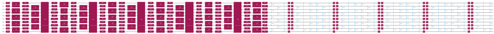

{/* doqumentation-source-hash: f202cfc1 */}

import TutorialFeedback from '@site/src/components/TutorialFeedback';

<OpenInLabBanner notebookPath="qiskit-addons/aqc-tensor/01_initial_state_aqc.ipynb" />


ใน notebook นี้ เราจะทำตามขั้นตอนของ [Qiskit pattern](https://quantum.cloud.ibm.com/docs/guides/intro-to-patterns) โดยใช้ **การคอมไพล์ควอนตัมเชิงประมาณด้วย tensor networks (AQC-Tensor)** เพื่อให้ได้ความลึกของ Circuit ที่ต่ำกว่าที่จำเป็นต้องใช้ตามปกติสำหรับการทำ Trotter evolution

ขั้นตอนที่เราจะดำเนินการมีดังนี้:

- **ขั้นตอนที่ 1: แมปสู่ปัญหาควอนตัม**
    - กำหนด Hamiltonian และ observable(s) ของปัญหา
    - <font color='#0F62FE'>สร้าง target tensor-network state สำหรับส่วนเริ่มต้นของ Circuit</font>
    - <font color='#0F62FE'>สร้าง Circuit ที่มีความลึกต่ำเพื่อประมาณส่วนที่กำลังถูกบีบอัด</font>
    - <font color='#0F62FE'>สร้าง ansatz ทั่วไปจาก Circuit นั้น</font>
    - <font color='#0F62FE'>ปรับพารามิเตอร์ให้ ansatz ใกล้เคียงกับ target มากที่สุดเท่าที่จะทำได้</font>
    - <font color='#0F62FE'>เพิ่ม Trotter steps ถัดมาต่อท้าย ansatz ที่ปรับแล้ว</font>
- **ขั้นตอนที่ 2: ปรับแต่งสำหรับฮาร์ดแวร์เป้าหมาย**
    - Transpile Circuit สำหรับฮาร์ดแวร์
- **ขั้นตอนที่ 3: รันการทดลอง**
    - ใช้ fake backend เพื่อความสะดวก
- **ขั้นตอนที่ 4: สร้างผลลัพธ์คืน**
    - ไม่จำเป็น แต่เราแค่แสดงค่า observable ที่วัดได้
## ขั้นตอนที่ 1: แมปสู่ quantum circuit และ operator {#step-1-map-to-quantum-circuit-and-operator}

### ตั้งค่า Hamiltonian ของโมเดลและ observable {#set-up-a-model-hamiltonian-and-observable}

ใน notebook นี้ เราใช้ Ising model บนวงกลมที่มี 10 ตำแหน่ง:
$$
\hat{\mathcal{H}}_{\text{Ising}} = \sum_{i=1}^{10} J_{i,(i+1)} Z_i Z_{(i+1)} + h_i X_i \, ,
$$
โดยที่เงื่อนไขขอบเขตแบบวนรอบหมายความว่า สำหรับ $i=10$ จะได้ $i+1=11\rightarrow1$, $J$ คือความแข็งแกร่งของการจับคู่ระหว่างสองตำแหน่ง และ $h$ คือสนามแม่เหล็กภายนอก

```python
# Added by doQumentation — required packages for this notebook
!pip install -q qiskit qiskit-addon-aqc-tensor qiskit-addon-utils qiskit-ibm-runtime quimb scipy
```

```python
from qiskit.transpiler import CouplingMap
from qiskit_addon_utils.problem_generators import generate_xyz_hamiltonian

# Generate some coupling map to use for this example
coupling_map = CouplingMap.from_heavy_hex(3, bidirectional=False)

# Choose a 10-qubit circle on this coupling map
reduced_coupling_map = coupling_map.reduce([0, 13, 1, 14, 10, 16, 4, 15, 3, 9])

# Get a qubit operator describing the Ising field model
hamiltonian = generate_xyz_hamiltonian(
    reduced_coupling_map,
    coupling_constants=(0.0, 0.0, 1.0),
    ext_magnetic_field=(0.4, 0.0, 0.0),
)
```

observable ที่เราจะวัดคือค่าแม่เหล็กรวม (total magnetization)

```python
from qiskit.quantum_info import SparsePauliOp

L = reduced_coupling_map.size()
observable = SparsePauliOp.from_sparse_list([("Z", [i], 1 / L / 2) for i in range(L)], num_qubits=L)
```

### กำหนดขอบเขตที่จะจำลองแบบคลาสสิก {#determine-how-much-of-the-time-evolution-to-simulate-classically}

เป้าหมายหลักของเราคือการจำลอง time evolution ของ Hamiltonian โมเดลข้างต้น โดยใช้ Trotter evolution ซึ่งเราแบ่งออกเป็นสองส่วน:

1. ส่วนเริ่มต้นที่สามารถจำลองได้ด้วย matrix product states (MPS) เราจะ "คอมไพล์" ส่วนนี้โดยใช้ AQC ตามที่นำเสนอใน https://arxiv.org/abs/2301.08609
2. ส่วนถัดไปของ Circuit ที่จะรันบนฮาร์ดแวร์
เราวางแผนจะใช้ AQC-Tensor บีบอัด Circuit ของ time evolution จนถึงเวลา $t=4$ จากนั้นจึง evolve ต่อโดยใช้ Trotter steps ปกติจนถึง $t=5$
### สร้าง Circuit ก่อนและหลังจุดแบ่ง {#generate-circuits-before-and-after-split}

เมื่อเลือกที่จะแบ่งที่ $t=4$ แล้ว เราจะสร้าง Circuit สองตัว:

1. Circuit แบบ "target" สำหรับส่วน AQC ของ evolution ตั้งแต่ $t_i=0$ ถึง $t_f=4$ เนื่องจากส่วนนี้ถูกจำลองด้วย tensor-network simulator จำนวน layer จึงมีผลต่อเวลาการรันเพียงปัจจัยคงที่เท่านั้น ดังนั้นเราอาจใช้จำนวน layer มากๆ เพื่อลด Trotter error

```python
from qiskit.synthesis import SuzukiTrotter
from qiskit_addon_utils.problem_generators import generate_time_evolution_circuit

aqc_evolution_time = 4.0
aqc_target_num_trotter_steps = 45

aqc_target_circuit = generate_time_evolution_circuit(
    hamiltonian,
    synthesis=SuzukiTrotter(reps=aqc_target_num_trotter_steps),
    time=aqc_evolution_time,
)
```

2. Circuit ของ evolution ถัดมา ซึ่ง evolve จาก $t_i=4$ ถึง $t_f=5$ เนื่องจากส่วนนี้รันบนฮาร์ดแวร์ควอนตัม จึงควรใช้จำนวน Trotter layer น้อยที่สุดเท่าที่จะทำได้

```python
subsequent_evolution_time = 1.0
subsequent_num_trotter_steps = 5

subsequent_circuit = generate_time_evolution_circuit(
    hamiltonian,
    synthesis=SuzukiTrotter(reps=subsequent_num_trotter_steps),
    time=subsequent_evolution_time,
)
```

เพื่อการเปรียบเทียบในภายหลัง ลองสร้าง Circuit ที่สามตัวด้วย นั่นคือ Circuit ที่ evolve ด้วย `aqc_evolution_time` แต่มี evolution time ต่อ Trotter step เท่ากับ Circuit ถัดมา นี่คือ Circuit ที่เราจะต้องทำงานด้วยหากไม่ได้ใช้จำนวน Trotter steps มากๆ สำหรับ target circuit เราจะเรียกมันว่า _comparison circuit_

```python
aqc_comparison_num_trotter_steps = int(
    subsequent_num_trotter_steps / subsequent_evolution_time * aqc_evolution_time
)
aqc_comparison_num_trotter_steps
```

```text
20
```

```python
comparison_circuit = generate_time_evolution_circuit(
    hamiltonian,
    synthesis=SuzukiTrotter(reps=aqc_comparison_num_trotter_steps),
    time=aqc_evolution_time,
)
```

### สร้าง ansatz และพารามิเตอร์เริ่มต้นจาก Trotter circuit ที่มี steps น้อยกว่า {#generate-an-ansatz-and-initial-parameters-from-a-trotter-circuit-with-fewer-steps}

ก่อนอื่น เราสร้าง Circuit "ที่ดี" ซึ่งมี evolution time เท่ากับ target circuit แต่มี Trotter steps น้อยกว่า (และด้วยเหตุนี้จึงมี layer น้อยกว่า)

จากนั้นเราส่ง Circuit "ที่ดี" นี้ไปยังฟังก์ชัน `generate_ansatz_from_circuit` ของ AQC-Tensor ฟังก์ชันนี้จะวิเคราะห์การเชื่อมต่อแบบ two-Qubit ของ Circuit และคืนค่าสองสิ่ง:
1. ansatz Circuit แบบพารามิเตอร์ทั่วไปที่มีการเชื่อมต่อ two-Qubit เหมือนกับ Circuit ที่ป้อนเข้าไป และ
2. พารามิเตอร์ที่เมื่อนำไปแทนใน ansatz แล้วจะได้ Circuit (ที่ดี) นั้นกลับมา

ต่อจากนี้เราจะนำพารามิเตอร์เหล่านี้มาปรับค่าซ้ำๆ เพื่อให้ ansatz circuit ใกล้เคียงกับ target MPS มากที่สุด

```python
from qiskit_addon_aqc_tensor import generate_ansatz_from_circuit

aqc_ansatz_num_trotter_steps = 5

aqc_good_circuit = generate_time_evolution_circuit(
    hamiltonian,
    synthesis=SuzukiTrotter(reps=aqc_ansatz_num_trotter_steps),
    time=aqc_evolution_time,
)

aqc_ansatz, aqc_initial_parameters = generate_ansatz_from_circuit(
    aqc_good_circuit, qubits_initially_zero=True
)
aqc_ansatz.draw("mpl", fold=-1)
```


```python
print(f"Comparison circuit: depth {comparison_circuit.depth()}")
print(f"Target circuit: depth {aqc_target_circuit.depth()}")
print(f"Ansatz circuit: depth {aqc_ansatz.depth()}, with {len(aqc_initial_parameters)} parameters")
```

```text
Comparison circuit: depth 120
Target circuit: depth 270
Ansatz circuit: depth 23, with 515 parameters
```

### เลือกการตั้งค่าสำหรับ tensor network simulation {#choose-settings-for-tensor-network-simulation}

ที่นี่เราใช้ tensor network simulator ที่ใช้ [quimb](http://quimb.readthedocs.io/) ในตัวอย่างนี้ เราใช้ตัวจำลอง matrix-product state (MPS) ของ quimb และใช้ [JAX](https://docs.jax.dev/en/latest/) สำหรับ automatic differentiation ดู [API documentation](../stubs/qiskit_addon_aqc_tensor.simulation.quimb.QuimbSimulator.rst) สำหรับข้อมูลเพิ่มเติมเกี่ยวกับวิธีใช้ quimb simulator

```python
from functools import partial

import quimb.tensor

from qiskit_addon_aqc_tensor.simulation.quimb import QuimbSimulator

simulator_settings = QuimbSimulator(
    partial(quimb.tensor.CircuitMPS, max_bond=100, cutoff=1e-8),
    autodiff_backend="jax",
)
```

### สร้างการแทนแบบ matrix-product state ของ AQC target state {#construct-matrix-product-state-representation-of-the-aqc-target-state}

ต่อไป เราสร้างการแทนแบบ matrix-product ของ state ที่จะถูกประมาณด้วย AQC

```python
from qiskit_addon_aqc_tensor.simulation import tensornetwork_from_circuit

aqc_target_mps = tensornetwork_from_circuit(aqc_target_circuit, simulator_settings)
```

สังเกตว่าเนื่องจากเราเลือกใช้จำนวน Trotter steps มากๆ สำหรับ target state ดังนั้น state นี้จึงมี Trotter error น้อยกว่า comparison circuit จริงๆ เราสามารถคำนวณ fidelity ($| \langle \psi_1 | \psi_2 \rangle |^2$) ของ state ที่เตรียมโดย comparison circuit เทียบกับ target state ได้:

```python
from qiskit_addon_aqc_tensor.simulation import compute_overlap

comparison_mps = tensornetwork_from_circuit(comparison_circuit, simulator_settings)
comparison_fidelity = abs(compute_overlap(comparison_mps, aqc_target_mps)) ** 2
comparison_fidelity
```

```text
0.9996761790297157
```

### ปรับพารามิเตอร์ของ ansatz โดยใช้การคำนวณ MPS {#optimize-the-parameters-of-the-ansatz-using-mps-calculations}

ที่นี่เราลดค่า cost function ที่ง่ายที่สุดที่เป็นไปได้ `MaximizeStateFidelity` โดยใช้ L-BFGS optimizer จาก scipy

เราเลือกจุดหยุดสำหรับ fidelity เพื่อให้อยู่เหนือค่าที่ comparison circuit จะให้ได้หากไม่ใช้ AQC เมื่อถึงจุดนี้ Circuit ที่ถูกบีบอัดจะมี Trotter error น้อยกว่า _และ_ มีความลึกน้อยกว่า Circuit เดิม หากมีเวลาประมวลผลเพิ่มขึ้น สามารถดำเนินการปรับแต่งต่อไปเพื่อเพิ่ม fidelity ให้สูงขึ้นได้อีก

```python
from scipy.optimize import OptimizeResult, minimize

from qiskit_addon_aqc_tensor.objective import MaximizeStateFidelity

objective = MaximizeStateFidelity(aqc_target_mps, aqc_ansatz, simulator_settings)

stopping_point = 1 - comparison_fidelity

def callback(intermediate_result: OptimizeResult):
    print(f"Intermediate result: Fidelity {1 - intermediate_result.fun:.8}")
    if intermediate_result.fun < stopping_point:
        # Good enough for now
        raise StopIteration

result = minimize(
    objective.loss_function,
    aqc_initial_parameters,
    method="L-BFGS-B",
    jac=True,
    options={"maxiter": 100},
    callback=callback,
)
if result.status not in (
    0,
    1,
    99,
):  # 0 => success; 1 => max iterations reached; 99 => early termination via StopIteration
    raise RuntimeError(f"Optimization failed: {result.message} (status={result.status})")

print(f"Done after {result.nit} iterations.")
aqc_final_parameters = result.x
```

```text
Intermediate result: Fidelity 0.95080335
Intermediate result: Fidelity 0.98408927
Intermediate result: Fidelity 0.99140876
Intermediate result: Fidelity 0.9951876
Intermediate result: Fidelity 0.99563147
Intermediate result: Fidelity 0.99646297
Intermediate result: Fidelity 0.99679298
Intermediate result: Fidelity 0.99715793
Intermediate result: Fidelity 0.99756604
Intermediate result: Fidelity 0.99804283
Intermediate result: Fidelity 0.99832283
Intermediate result: Fidelity 0.99856583
Intermediate result: Fidelity 0.99868698
Intermediate result: Fidelity 0.998867
Intermediate result: Fidelity 0.99902237
Intermediate result: Fidelity 0.99912174
Intermediate result: Fidelity 0.99919705
Intermediate result: Fidelity 0.99926724
Intermediate result: Fidelity 0.99938605
Intermediate result: Fidelity 0.99951297
Intermediate result: Fidelity 0.99956172
Intermediate result: Fidelity 0.99962274
Intermediate result: Fidelity 0.99963919
Intermediate result: Fidelity 0.99967423
Intermediate result: Fidelity 0.9997101
Done after 25 iterations.
```

### สร้าง Circuit สุดท้ายเพื่อส่งให้ Transpiler {#construct-the-final-circuit-to-pass-to-the-transpiler}

```python
final_circuit = aqc_ansatz.assign_parameters(aqc_final_parameters)
final_circuit.compose(subsequent_circuit, inplace=True)
final_circuit.draw("mpl", fold=-1)
```



## ขั้นตอนที่ 2: Transpile สำหรับการรันบนฮาร์ดแวร์เป้าหมาย {#step-2-transpile-for-execution-on-target-hardware}

ในขั้นตอนที่ 2 ของ [Qiskit pattern](https://quantum.cloud.ibm.com/docs/guides/intro-to-patterns) เราจะ Transpile Circuit นี้และ observable(s) ที่ต้องการสำหรับการรันบนอุปกรณ์เป้าหมาย ที่นี่เราใช้ fake backend ที่ให้มาโดย `qiskit-ibm-runtime`

```python
from qiskit import transpile
from qiskit_ibm_runtime.fake_provider import FakeMelbourneV2

backend = FakeMelbourneV2()

isa_circuit = transpile(final_circuit, backend)
isa_observable = observable.apply_layout(isa_circuit.layout)
```

จากนั้น ISA circuit ที่ได้สามารถส่งไปรันบน Backend (ขั้นตอนที่ 3 ของ [Qiskit pattern](https://quantum.cloud.ibm.com/docs/guides/intro-to-patterns))
## ขั้นตอนที่ 3: รันบนฮาร์ดแวร์ควอนตัม {#step-3-execute-on-quantum-hardware}

```python
from qiskit_ibm_runtime import EstimatorV2 as Estimator

estimator = Estimator(backend)
job = estimator.run([(isa_circuit, isa_observable)])
pub_result = job.result()[0]
```

## ขั้นตอนที่ 4: สร้างผลลัพธ์คืน {#step-4-reconstruct}

ในกรณีของเราไม่จำเป็นต้องสร้างผลลัพธ์คืน เราแค่ดูผลลัพธ์ได้เลย

```python
pub_result.data.evs[()]
```

```text
np.float64(0.047998046875000006)
```

<TutorialFeedback />
