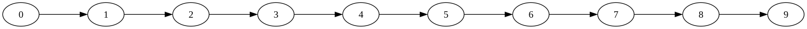

{/* doqumentation-source-hash: 90759f5f */}

import TutorialFeedback from '@site/src/components/TutorialFeedback';

<OpenInLabBanner notebookPath="qiskit-addons/mpf/01_getting_started.ipynb" />


ใน notebook นี้ เราจะเรียนรู้วิธีใช้ **Multi-Product Formula (MPF)** เพื่อให้ได้ Trotter error ที่ต่ำกว่าค่าที่เกิดจาก Trotter circuit ที่ลึกที่สุดที่เราจะรันจริง
เราจะทำสิ่งนี้โดยทำตามขั้นตอนของ **Qiskit pattern**:

- **ขั้นตอนที่ 1: แมปสู่ปัญหาควอนตัม**
    - กำหนด Hamiltonian ของปัญหา
    - <font color="#0F62FE">ใช้ MPF เพื่อสร้าง Trotterized time-evolution circuits</font>
- **ขั้นตอนที่ 2: ปรับแต่งปัญหา**
    - Transpile circuits สำหรับ [GenericBackendV2](https://quantum.cloud.ibm.com/docs/api/qiskit/qiskit.providers.fake_provider.GenericBackendV2)
- **ขั้นตอนที่ 3: รันการทดลอง**
    - ใช้ [StatevectorEstimator](https://quantum.cloud.ibm.com/docs/api/qiskit/qiskit.primitives.StatevectorEstimator) เพื่อความสะดวกใน notebook นี้
- **ขั้นตอนที่ 4: สร้างผลลัพธ์ใหม่**
    - <font color="#0F62FE">คำนวณค่าคาดหวัง MPF</font>
## ขั้นตอนที่ 1: แมปสู่ปัญหาควอนตัม {#step-1-map-to-quantum-problem}

### 1a: ตั้งค่า Hamiltonian {#1a-setting-up-our-hamiltonian}

เราใช้ Ising model บนเส้นตรง 10 ไซต์:

$$
\hat{\mathcal{H}}_{\text{Ising}} = \sum_{i=1}^{9} J_{i,(i+1)} Z_i Z_{(i+1)} + \sum_{i=1}^{10} h_i X_i \, ,
$$

โดยที่ $J$ คือความแข็งแกร่งของการคัปปลิงระหว่างสองไซต์ และ $h$ คือสนามแม่เหล็กภายนอก
แพ็กเกจ [qiskit_addon_utils](https://qiskit.github.io/qiskit-addon-utils/) มีฟังก์ชันที่ใช้งานซ้ำได้สำหรับวัตถุประสงค์หลากหลาย

โมดูล [qiskit_addon_utils.problem_generators](https://qiskit.github.io/qiskit-addon-utils/stubs/qiskit_addon_utils.problem_generators.html) มีฟังก์ชันสำหรับสร้าง Hamiltonian แบบ Heisenberg บน connectivity graph ที่กำหนด
Graph นี้เป็นได้ทั้ง [rustworkx.PyGraph](https://www.rustworkx.org/apiref/rustworkx.PyGraph.html) หรือ [CouplingMap](https://quantum.cloud.ibm.com/docs/api/qiskit/qiskit.transpiler.CouplingMap) ทำให้ใช้งานง่ายใน workflow ที่เน้น Qiskit

ในส่วนต่อไป เราจะสร้างเส้นตรงง่ายๆ ที่มี 10 Qubit โดยใช้เมธอด `CouplingMap.from_line`

```python
# Added by doQumentation — required packages for this notebook
!pip install -q numpy qiskit qiskit-addon-mpf qiskit-addon-utils rustworkx scipy
```

```python
from qiskit.transpiler import CouplingMap

# Generate some coupling map to use for this example
coupling_map = CouplingMap.from_line(10, bidirectional=False)
```

```python
from rustworkx.visualization import graphviz_draw

graphviz_draw(coupling_map.graph, method="circo")
```



ต่อไป เราสร้าง [SparsePauliOp](https://quantum.cloud.ibm.com/docs/api/qiskit/qiskit.quantum_info.SparsePauliOp) บน connectivity ที่กำหนดพร้อมค่าคงที่ที่ต้องการ

```python
from qiskit_addon_utils.problem_generators import generate_xyz_hamiltonian

# Get a qubit operator describing the Ising field model
hamiltonian = generate_xyz_hamiltonian(
    coupling_map,
    coupling_constants=(0.0, 0.0, 1.0),
    ext_magnetic_field=(0.4, 0.0, 0.0),
)
print(hamiltonian)
```

```text
SparsePauliOp(['IIIIIIIZZI', 'IIIIIZZIII', 'IIIZZIIIII', 'IZZIIIIIII', 'IIIIIIIIZZ', 'IIIIIIZZII', 'IIIIZZIIII', 'IIZZIIIIII', 'ZZIIIIIIII', 'IIIIIIIIIX', 'IIIIIIIIXI', 'IIIIIIIXII', 'IIIIIIXIII', 'IIIIIXIIII', 'IIIIXIIIII', 'IIIXIIIIII', 'IIXIIIIIII', 'IXIIIIIIII', 'XIIIIIIIII'],
              coeffs=[1. +0.j, 1. +0.j, 1. +0.j, 1. +0.j, 1. +0.j, 1. +0.j, 1. +0.j, 1. +0.j,
 1. +0.j, 0.4+0.j, 0.4+0.j, 0.4+0.j, 0.4+0.j, 0.4+0.j, 0.4+0.j, 0.4+0.j,
 0.4+0.j, 0.4+0.j, 0.4+0.j])
```

Observable ที่เราจะวัดคือค่าแม่เหล็กรวม ซึ่งเราสร้างได้ง่ายๆ ดังนี้:

```python
from qiskit.quantum_info import SparsePauliOp

L = coupling_map.size()
observable = SparsePauliOp.from_sparse_list([("Z", [i], 1 / L / 2) for i in range(L)], num_qubits=L)
print(observable)
```

```text
SparsePauliOp(['IIIIIIIIIZ', 'IIIIIIIIZI', 'IIIIIIIZII', 'IIIIIIZIII', 'IIIIIZIIII', 'IIIIZIIIII', 'IIIZIIIIII', 'IIZIIIIIII', 'IZIIIIIIII', 'ZIIIIIIIII'],
              coeffs=[0.05+0.j, 0.05+0.j, 0.05+0.j, 0.05+0.j, 0.05+0.j, 0.05+0.j, 0.05+0.j,
 0.05+0.j, 0.05+0.j, 0.05+0.j])
```

### 1b: Multi-Product Formulas {#1b-multi-product-formulas}

MPF ช่วยลด Trotter error ของพลวัต Hamiltonian ผ่านการรวมแบบถ่วงน้ำหนักจากการรัน Circuit หลายครั้ง

เพื่อให้เห็นภาพชัดขึ้น เราจะนิยาม MPF ว่า:

$$
\mu(t) = \sum_{j} x_j \rho^{k_j}_{j}\left(\frac{t}{k_j}\right) + \text{some remaining Trotter error} \, ,
$$

โดยที่ $x_j$ คือสัมประสิทธิ์การถ่วงน้ำหนัก, $\rho^{k_j}_j$ คือ density matrix ที่สอดคล้องกับสถานะบริสุทธิ์ที่ได้จากการ evolve สถานะเริ่มต้นด้วย product formula, $S^{k_j}$, ที่มี $k_j$ Trotter steps, และ $j$ คือดัชนีของจำนวน product formulas ที่ประกอบกันเป็น MPF

จุดสำคัญคือ Trotter error ที่เหลืออยู่นั้นเล็กกว่า Trotter error ที่จะได้รับจากการใช้ค่า $k_j$ ที่ใหญ่ที่สุดเพียงอย่างเดียว!

เราสามารถมองประโยชน์ของ MPF ได้จากสองมุมมอง:

1. สำหรับงบประมาณ Trotter steps ที่กำหนดไว้ซึ่งสามารถรันได้ เราสามารถรับผลลัพธ์ที่มี Trotter error รวมที่เล็กกว่า
2. สำหรับจำนวน Trotter steps ที่ทำให้ Circuit ลึกมาก เราสามารถใช้ MPF เพื่อหา Circuit ที่ depth สั้นกว่าหลายตัวที่ให้ Trotter error ใกล้เคียงกัน
#### บทนำสู่ static MPF {#an-introduction-to-static-mpfs}

MPF แบบ _static_ คือ MPF ที่ค่า $x_j$ **ไม่** ขึ้นกับเวลา evolution, $t$

การหาสัมประสิทธิ์ static MPF สำหรับชุดค่า $k_j$ ที่กำหนดเทียบเท่ากับการแก้ระบบสมการเชิงเส้น:
$Ax=b$ โดยที่ $x$ คือสัมประสิทธิ์ที่เราต้องการ, $A$ คือเมทริกซ์ที่ขึ้นกับ $k_j$ และชนิดของ PF ที่ใช้ ($S$), และ $b$ คือเวกเตอร์ของข้อจำกัด
เพื่อความกระชับ เราจะไม่ลงรายละเอียดเพิ่มเติมที่นี่ แต่จะอ้างอิงไปยังเอกสารของ [LSE](https://qiskit.github.io/qiskit-addon-mpf/apidocs/qiskit_addon_mpf.costs.html#qiskit_addon_mpf.costs.LSE) แทน

เราสามารถหาผลเฉลยสำหรับ $x$ ได้โดยตรงในเชิงวิเคราะห์ว่า $x = A^{-1}b$ ดูเพิ่มเติมใน [Carrera Vazquez et al., 2023] หรือ [Zhuk et al., 2023]
อย่างไรก็ตาม ผลเฉลยแม่นยำนี้อาจ _"ill-conditioned"_ ทำให้ L1-norm ของสัมประสิทธิ์ $x$ มีค่าสูงมาก ซึ่งอาจนำไปสู่ประสิทธิภาพที่ไม่ดีของ MPF
แทนที่ เราสามารถหาผลเฉลยโดยประมาณที่ minimize L1-norm ของ $x$ เพื่อพยายาม optimize พฤติกรรมของ MPF ได้

ในส่วนต่อไป เราจะเรียนรู้วิธีทำสิ่งเหล่านี้ทั้งหมด

[Carrera Vazquez et al., 2023]: https://quantum-journal.org/papers/q-2023-07-25-1067/
[Zhuk et al., 2023]: https://journals.aps.org/prresearch/abstract/10.1103/PhysRevResearch.6.033309
#### การเลือก $k_j$ {#choosing-k_j}

การเลือก $k_j$ ขึ้นอยู่กับผู้ใช้
โดยหลักการแล้วสามารถเลือกค่าใดก็ได้ แต่บาง $k_j$ จะนำไปสู่การขยายสัญญาณรบกวนที่มากกว่าบนอุปกรณ์จริง
ดังนั้น สิ่งสำคัญคือต้องพยายามหาค่า $k_j$ ที่ _"ดี"_

ที่นี่ เราจะเลือกค่าคงที่บางค่าสำหรับ $k_j$
ค่าที่เล็กที่สุดมีแรงบันดาลใจจากเวลา evolution เป้าหมาย $t=8.0$ ซึ่งปกติบอกให้เราทำให้ $t/k_{\text{min}} \lt 1$ แต่จากประสบการณ์เราพบว่าการตั้งค่าให้เท่ากับ $1$ มักจะได้ผลด้วยเช่นกัน
หากต้องการเรียนรู้เพิ่มเติมเกี่ยวกับเรื่องนี้และวิธีเลือกค่า $k_j$ อื่นๆ อ้างอิงไปยังคู่มือที่เกี่ยวข้อง: [How to choose the Trotter steps for an MPF](https://qiskit.github.io/qiskit-addon-mpf/how_tos/choose_trotter_steps.html)

```python
time = 8.0
trotter_steps = (8, 12, 19)
```

#### การตั้งค่า LSE {#setting-up-the-lse}

เมื่อเราได้เลือกค่า $k_j$ แล้ว เราต้องสร้าง LSE ก่อน ซึ่งก็คือ $Ax=b$ ตามที่อธิบายไว้ข้างต้น
เมทริกซ์ $A$ ขึ้นกับไม่เพียงแค่ $k_j$ แต่ยังขึ้นกับการเลือก product formula (PF) ของเรา โดยเฉพาะ _order_ ของมัน
นอกจากนี้ อาจพิจารณาว่า PF มีความสมมาตรหรือไม่ (ดู [Carrera Vazquez et al., 2023]) โดยตั้งค่า `symmetric=True`
อย่างไรก็ตาม สิ่งนี้ไม่จำเป็นตามที่ [Zhuk et al., 2023] แสดงให้เห็น

ที่นี่ เราจะใช้ Suzuki-Trotter formula ลำดับสอง ซึ่งให้ `order=2` และเราจะตั้งค่า `symmetric=True`

[Carrera Vazquez et al., 2023]: https://quantum-journal.org/papers/q-2023-07-25-1067/
[Zhuk et al., 2023]: https://journals.aps.org/prresearch/abstract/10.1103/PhysRevResearch.6.033309

```python
from qiskit_addon_mpf.static import setup_static_lse

lse = setup_static_lse(trotter_steps, order=2, symmetric=True)
print(lse)
```

```text
LSE(A=array([[1.00000000e+00, 1.00000000e+00, 1.00000000e+00],
       [1.56250000e-02, 6.94444444e-03, 2.77008310e-03],
       [2.44140625e-04, 4.82253086e-05, 7.67336039e-06]]), b=array([1., 0., 0.]))
```

#### การหา $x$ โดยวิธีวิเคราะห์ {#solving-for-x-analytically}

ดังที่กล่าวไว้ก่อนหน้า เราสามารถหา $x$ ในเชิงวิเคราะห์ได้:

```python
import numpy as np

coeffs_analytical = lse.solve()
print(coeffs_analytical)
```

```text
[ 0.17239057 -1.19447005  2.02207947]
```

#### การ optimize หา $x$ โดยใช้ exact model {#optimizing-for-x-using-an-exact-model}

แทนที่จะคำนวณ $x=A^{-1}b$ เราสามารถใช้ [setup_exact_problem](https://qiskit.github.io/qiskit-addon-mpf/stubs/qiskit_addon_mpf.costs.setup_exact_problem.html) เพื่อสร้างอินสแตนซ์ [cvxpy.Problem](https://www.cvxpy.org/api_reference/cvxpy.problems.html#cvxpy.Problem) ที่ใช้ LSE เป็นข้อจำกัดและผลเฉลยที่ดีที่สุดของมันจะให้ $x$

ในส่วนถัดไป จะเห็นชัดว่าทำไม interface นี้จึงมีอยู่

```python
from qiskit_addon_mpf.costs import setup_exact_problem

model_exact, coeffs_exact = setup_exact_problem(lse)
model_exact.solve()
print(coeffs_exact.value)
```

```text
[ 0.17239057 -1.19447005  2.02207947]
```

เพื่อเป็นตัวชี้วัดว่า MPF ที่สร้างด้วยสัมประสิทธิ์เหล่านี้จะให้ผลลัพธ์ที่ดีหรือไม่ เราสามารถใช้ L1-norm (ดูเพิ่มเติมใน [Carrera Vazquez et al., 2023])

[Carrera Vazquez et al., 2023]: https://quantum-journal.org/papers/q-2023-07-25-1067/

```python
print(np.linalg.norm(coeffs_exact.value, ord=1))
```

```text
3.3889400921655914
```

#### การ optimize หา $x$ โดยใช้ approximate model {#optimizing-for-x-using-an-approximate-model}

อาจเกิดขึ้นได้ที่ L1 norm สำหรับชุดค่า $k_j$ ที่เลือกถือว่าสูงเกินไป
ในกรณีนี้ หากไม่สามารถเลือกชุดค่า $k_j$ ที่ต่างออกไปได้ เราสามารถใช้ผลเฉลยโดยประมาณสำหรับ LSE แทนผลเฉลยแม่นยำ

เพื่อทำเช่นนั้น ให้ใช้ [setup_sum_of_squares_problem](https://qiskit.github.io/qiskit-addon-mpf/stubs/qiskit_addon_mpf.costs.setup_sum_of_squares_problem.html) เพื่อสร้างอินสแตนซ์ [cvxpy.Problem](https://www.cvxpy.org/api_reference/cvxpy.problems.html#cvxpy.Problem) ที่ต่างออกไป ซึ่งจำกัด L1-norm ให้ไม่เกินขีดจำกัดที่กำหนดในขณะที่ minimize ความแตกต่างของ $Ax$ และ $b$

```python
from qiskit_addon_mpf.costs import setup_sum_of_squares_problem

model_approx, coeffs_approx = setup_sum_of_squares_problem(lse, max_l1_norm=3.0)
model_approx.solve()
print(coeffs_approx.value)
print(np.linalg.norm(coeffs_approx.value, ord=1))
```

```text
[-0.40454257  0.57553173  0.8290123 ]
1.8090865903790838
```

สังเกตว่าเรามีอิสระในการแก้ปัญหา optimization นี้อย่างสมบูรณ์ หมายความว่าเราสามารถเปลี่ยน optimization solver, ค่า convergence threshold และอื่นๆ ได้
ดูคู่มือที่เกี่ยวข้องได้ที่ [How to use the approximate model](https://qiskit.github.io/qiskit-addon-mpf/how_tos/using_approximate_model.html)
### 1c: การตั้งค่า Trotter circuits {#1c-setting-up-the-trotter-circuits}

ณ จุดนี้ เราได้หาสัมประสิทธิ์การขยาย $x$ แล้ว และสิ่งที่เหลือคือการสร้าง Trotterized quantum circuits
อีกครั้ง โมดูล [qiskit_addon_utils.problem_generators](https://qiskit.github.io/qiskit-addon-utils/stubs/qiskit_addon_utils.problem_generators.html) มาช่วยในส่วนนี้:

```python
from qiskit.synthesis import SuzukiTrotter
from qiskit_addon_utils.problem_generators import generate_time_evolution_circuit

circuits = []
for k in trotter_steps:
    circ = generate_time_evolution_circuit(
        hamiltonian,
        synthesis=SuzukiTrotter(order=2, reps=k),
        time=time,
    )
    circuits.append(circ)
```

```python
circuits[0].draw("mpl", fold=-1)
```


```python
circuits[1].draw("mpl", fold=-1)
```


```python
circuits[2].draw("mpl", fold=-1)
```


## Step 2: ปรับแต่งปัญหา {#step-2-optimize-the-problem}

โดยปกติ นี่คือขั้นตอนในรูปแบบที่เราปรับแต่ง Circuit ให้พร้อมรันบนฮาร์ดแวร์
แต่ที่นี่ เนื่องจากเราใช้แค่ซิมูเลเตอร์ที่ไม่มีสัญญาณรบกวน เราจึงแค่ transpile Circuit สำหรับ [GenericBackendV2](https://quantum.cloud.ibm.com/docs/api/qiskit/qiskit.providers.fake_provider.GenericBackendV2) เท่านั้น

```python
from qiskit.providers.fake_provider import GenericBackendV2
from qiskit.transpiler import generate_preset_pass_manager

backend = GenericBackendV2(num_qubits=10)
transpiler = generate_preset_pass_manager(optimization_level=2, backend=backend)

transpiled_circuits = [transpiler.run(circ) for circ in circuits]
```

## Step 3: รันการทดลองควอนตัม {#step-3-execute-quantum-experiments}

ตามที่อธิบายไว้ตั้งแต่ต้น เราจะข้ามขั้นตอนการปรับแต่ง Step 2 เพราะเราจะคำนวณค่าความคาดหวังของ observable เป้าหมายโดยใช้ซิมูเลเตอร์ที่ปราศจากสัญญาณรบกวน นั่นคือ [StatevectorEstimator](https://quantum.cloud.ibm.com/docs/api/qiskit/qiskit.primitives.StatevectorEstimator)

```python
from qiskit.primitives import StatevectorEstimator

estimator = StatevectorEstimator()
job = estimator.run([(circ, observable) for circ in transpiled_circuits])
result = job.result()
```

## Step 4: สร้างผลลัพธ์ {#step-4-reconstruct-results}

ก่อนอื่น เราดึงค่าความคาดหวังแต่ละค่าที่ได้จาก Circuit Trotter แต่ละตัว:

```python
evs = [res.data.evs for res in result]
print(evs)
```

```text
[array(0.23799162), array(0.35754312), array(0.38649906)]
```

จากนั้น เราก็รวมค่าเหล่านั้นกับสัมประสิทธิ์ MPF เพื่อให้ได้ค่าความคาดหวังรวมของ MPF โดยเราทำแบบนี้กับทุกวิธีที่เราใช้คำนวณ $x$

```python
print("Analytical    solution:", evs @ coeffs_analytical)
print("Exact model   solution:", evs @ coeffs_exact.value)
print("Approx. model solution:", evs @ coeffs_approx.value)
```

```text
Analytical    solution: 0.3954847855980006
Exact model   solution: 0.39548478559800204
Approx. model solution: 0.42991214253489807
```

สุดท้าย สำหรับปัญหาเล็กๆ นี้ เราสามารถคำนวณค่าอ้างอิงที่แม่นยำโดยใช้ [scipy.linalg.expm](https://docs.scipy.org/doc/scipy/reference/generated/scipy.linalg.expm.html) ดังนี้:

```python
from scipy.linalg import expm

exp_H = expm(-1j * time * hamiltonian.to_matrix())

initial_state = np.zeros(exp_H.shape[0])
initial_state[0] = 1.0

time_evolved_state = exp_H @ initial_state

exact_obs = time_evolved_state.conj() @ observable.to_matrix() @ time_evolved_state
print(exact_obs.real)
```

```text
0.40060242487899755
```

เราเห็นได้ชัดเจนว่า MPF ช่วยลด Trotter error ได้เมื่อเทียบกับที่ได้จาก PF แบบตัวเดียวที่ลึกที่สุดซึ่งมี $k_j=19$
อย่างไรก็ตาม เราก็เห็นว่าโมเดลแบบประมาณนั้นไม่สมบูรณ์แบบ เพราะมันให้ค่าความคาดหวังที่แย่กว่า exact solution จริงๆ สิ่งนี้แสดงให้เห็นว่าสำคัญมากแค่ไหนที่ต้องใช้เกณฑ์การลู่เข้าที่เข้มงวดกับโมเดลแบบประมาณ ซึ่งคุณจะได้เรียนรู้ในคู่มือ [How to use the approximate model](https://qiskit.github.io/qiskit-addon-mpf/how_tos/using_approximate_model.html)

<TutorialFeedback />
