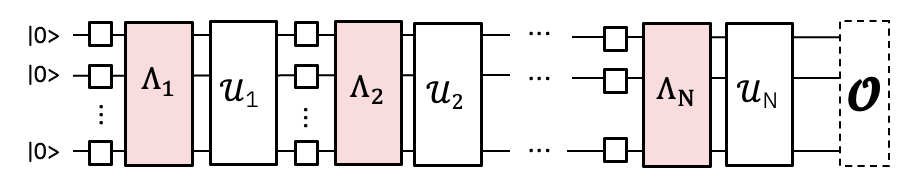

{/* doqumentation-source-hash: 3f45752c */}

import TutorialFeedback from '@site/src/components/TutorialFeedback';

<OpenInLabBanner notebookPath="qiskit-addons/pna/01_generate_noise_mitigating_observable.ipynb" />


ใน tutorial นี้ เราจะเรียนรู้วิธีใช้ประโยชน์จากเครื่องมือล่าสุดใน Qiskit ecosystem เพื่อสร้าง workflow ที่ปรับแต่งได้อย่างเต็มที่พร้อมการลดความผิดพลาด เราจะแนะนำเทคนิค PNA และนำมาใช้ลดความผิดพลาดของ Gate นอกจากนี้ยังจะใช้ TREX เพื่อลดความผิดพลาดในการอ่านค่า และใช้ post-selection เพื่อลดความผิดพลาดที่ไม่ได้ถูกบันทึกไว้ใน noise model ที่เรียนรู้มา

**โครงร่าง**
- ภาพรวมสั้น ๆ ของ ``PNA``
- สร้าง Trotterized quantum Circuit และ observable แล้ว Transpile ไปยัง Backend พร้อมเพิ่มการวัด post-selection
- ใช้ ``samplomatic`` เพื่อ twirl ชั้นของ 2Q Gate และการวัด และค้นหา 2Q layer ที่ไม่ซ้ำกันเพื่อลดต้นทุนการเรียนรู้ noise
- ใช้ ``NoiseLearnerV3`` เพื่อเรียนรู้ error model ที่ส่งผลต่อ 2Q Gate และการวัด
- ใช้ ``qiskit-addon-pna`` เพื่อสร้าง noise-mitigating observable
- ใช้ ``qiskit-ibm-runtime.Executor`` primitive เพื่อสร้าง raw QPU samples ที่สะท้อนทุก shot สำหรับทุก twirling randomization และ measured basis
- ใช้ ``qiskit-addon-utils`` เพื่อ post-process ข้อมูลให้ได้ expectation value ที่ผ่านการลดความผิดพลาดแล้ว
### Propagated Noise Absorption (PNA) คืออะไร? {#what-is-propagated-noise-absorption-pna}

***เทคนิคสำหรับลดความผิดพลาดของ Gate โดยการ propagate observable ผ่าน inverse noise channel ที่ส่งผลต่อ 2-qubit Gate ทำให้ได้ noise-mitigating observable***
2Q Gate ในการทดลองที่เราต้องการรันจะได้รับผลกระทบจาก noise ที่มาก

ถ้าเราเรียนรู้ noise model ได้ เราก็สามารถใช้ inverse ของมันเพื่อยกเลิก noise ได้

แทนที่จะ implement inverse noise channel โดยการ sample บน QPU แบบที่ PEC ทำ เราสามารถ implement มันในเชิง classical ใน measured observable โดยใช้ Pauli propagation ผลลัพธ์คือ observable ที่ซับซ้อนขึ้น ซึ่งเมื่อวัดแล้วจะมีผลในการลด gate noise ที่เรียนรู้ไว้

### สร้าง mirrored Trotter Circuit และ observable {#generate-the-mirrored-trotter-circuit-and-observable}

สำหรับการทดลองนี้ เราจะศึกษา time dynamics ของ 30-site kicked Ising model บน 1D spin chain โดย Hamiltonian ที่พิจารณาคือ:

$H = -J\sum\limits_{\langle i,j \rangle} Z_iZ_j + h\sum\limits_iX_i$,

โดยที่ $J>0$ อธิบายการ coupling ของ nearest-neighbor spins, $i<j$ และ global transverse field, $h$, ถูกตั้งไว้ที่ $\frac{\pi}{8}$ ยิ่ง $h$ ห่างจาก Clifford angle (คือ $\theta=n\frac{\pi}{2}, n \in \mathbb{Z}$) มากเท่าไหร่ การ propagate anti-noise generator ผ่าน Circuit ก็ยิ่งยากขึ้นเท่านั้น

สำหรับการเลือก observable เราจะพิจารณา average single-site magnetization ซึ่งคือ $\frac{1}{N} \sum_{i=1}^{N} \langle z_i \rangle$ โดยที่ $N$ คือจำนวน site

```python
# Added by doQumentation — required packages for this notebook
!pip install -q matplotlib numpy qiskit qiskit-addon-pna qiskit-addon-utils qiskit-ibm-runtime samplomatic
```

```python
import numpy as np
from qiskit import QuantumCircuit
from qiskit.quantum_info import Pauli, SparsePauliOp

num_qubits = 30
num_trotter_steps = 10
rx_angle = np.pi / 8

# Avg single-site magnetization
id_pauli = Pauli("I" * num_qubits)
observable = SparsePauliOp([id_pauli.dot(Pauli("Z"), [i]) for i in range(num_qubits)]) / num_qubits

# Implement Trotterized kicked-Ising model
circuit = QuantumCircuit(num_qubits)
for _step in range(num_trotter_steps):
    circuit.rx(rx_angle, range(num_qubits))
    for first_qubit in (1, 2):
        for idx in range(first_qubit, num_qubits, 2):
            # equivalent to Rzz(-pi/2):
            circuit.sdg([idx - 1, idx])
            circuit.cz(idx - 1, idx)
circuit.compose(circuit.inverse(), inplace=True)
circuit.measure_active()
circuit.draw("mpl", fold=-1)
```


ต่อไป เราจะเลือก chain ของ Qubit บน ``ibm_kingston`` ที่มี error rate ต่ำ และ Transpile Circuit ไปยัง Backend

```python
from qiskit.transpiler import generate_preset_pass_manager
from qiskit_ibm_runtime import QiskitRuntimeService

backend_name = "ibm_kingston"
service = QiskitRuntimeService()
backend = service.backend(backend_name, use_fractional_gates=True)

# Use a chain of low-noise qubits
layout = [
    44,
    45,
    46,
    47,
    57,
    67,
    68,
    69,
    78,
    89,
    88,
    87,
    97,
    107,
    106,
    105,
    117,
    125,
    126,
    127,
    128,
    129,
    118,
    109,
    110,
    111,
    98,
    91,
    92,
    93,
]

pm = generate_preset_pass_manager(backend=backend, initial_layout=layout, optimization_level=0)
isa_circuit = pm.run(circuit)
isa_observable = observable.apply_layout(isa_circuit.layout)
isa_circuit.draw("mpl", fold=-1)
```

```text
qiskit_runtime_service._discover_account:WARNING:2025-11-10 14:30:57,148: Loading account with the given token. A saved account will not be used.
```


### Twirl ชั้นของ 2-qubit Gate และการวัด และค้นหา layer ที่ไม่ซ้ำกัน {#twirl-the-2-qubit-gate-layers-and-measurements-and-find-unique-layers}

ที่นี่เราตรวจสอบให้แน่ใจว่า pass manager มีการ annotate box ด้วย ``Twirl`` และ ``InjectNoise`` annotations ซึ่งช่วยให้เราสามารถเรียนรู้ noise ที่จะส่งผลต่อ Circuit และเชื่อมโยง noise นั้นกับ Circuit layer ที่สอดคล้องกัน

- ``enable_gates/enable_measure: True``: Box ทุก 2q gate layer และ terminal measurement ส่วน Single qubit gate จะถูก left-dressed ภายใน box
- ``measure_annotations: all``: รวม annotation `Twirl` และ `ChangeBasis` บน measurement box
- ``twirling_strategy: active``: Twirl Qubit ที่ active ทั้งหมดใน box ที่มี entangling gate
- ``inject_noise_targets: gates``: ``InjectNoise`` annotations ควรถูกเพิ่มใน ``Twirl``-annotated box ทั้งหมดที่มี entangling gate
- ``inject_noise_strategy: uniform_modification``: ทุก noise layer ควรถูก scale อย่างเท่าเทียมกัน

```python
from samplomatic.transpiler import generate_boxing_pass_manager

# Box up circuit with Twirl and InjectNoise annotations
pm = generate_boxing_pass_manager(
    enable_gates=True,
    enable_measures=True,
    measure_annotations="all",
    twirling_strategy="active",
    inject_noise_targets="gates",
    inject_noise_strategy="uniform_modification",
    remove_barriers=True,
)
boxed_circuit = pm.run(isa_circuit)
```

```python
draw_circ = QuantumCircuit(boxed_circuit.num_qubits)
draw_circ.append(boxed_circuit.data[0], qargs=boxed_circuit.data[0].qubits)
draw_circ.append(boxed_circuit.data[1], qargs=boxed_circuit.data[1].qubits)
draw_circ.draw("mpl", fold=-1, scale=0.3, idle_wires=False)
```


### สร้าง template Circuit และ samplex และกำหนดวิธีการ sample Circuit {#generate-the-template-circuit-and-samplex-define-how-the-circuit-will-be-sampled}

ที่นี่เราเพิ่ม spectator และ post-selection measurement ด้วย ซึ่งจำเป็นสำหรับการทำ post-selection กับ sample ที่ออกมาจาก ``Executor``

```python
import samplomatic
from qiskit.transpiler import PassManager
from qiskit_addon_utils.noise_management.post_selection.transpiler.passes import (
    AddPostSelectionMeasures,
    AddSpectatorMeasures,
)

# Build template circuit and samplex for later use with the "Executor"
template_circuit, samplex = samplomatic.build(boxed_circuit)

# Add post-selection instructions to the template circuit
post_selection_pm = PassManager(
    [
        AddSpectatorMeasures(backend.coupling_map),
        AddPostSelectionMeasures(x_pulse_type="rx"),
    ]
)
template_circuit = post_selection_pm.run(template_circuit)
```

```python
draw_circ = template_circuit.copy_empty_like()
draw_circ.data = template_circuit.data[:324]
draw_circ.draw("mpl", fold=-1, scale=0.3, idle_wires=False)
```


#### เรียนรู้ noise {#learn-the-noise}

ก่อนรันการทดลอง เราจะเรียนรู้ noise model ที่ส่งผลต่อ entangling gate และการวัดใน Circuit การมี noise model ที่แม่นยำเป็นสิ่งจำเป็นสำหรับการลดความผิดพลาดอย่างมีประสิทธิภาพ การเรียนรู้ noise ก่อนรันการทดลองทันทีให้โอกาสที่ดีที่สุดที่ noise model จะอธิบาย noise จริง ๆ ที่ส่งผลต่อ Gate ระหว่างการ execute ได้อย่างถูกต้อง

ก่อนเรียนรู้ noise เราต้องค้นหา 2-qubit layer ที่ไม่ซ้ำกันใน Circuit เพื่อลดจำนวน shot ที่จำเป็นสำหรับการเรียนรู้ noise ของทั้ง Circuit เราใช้ ``find_unique_box_instructions`` จาก ``samplomatic`` เพื่อรับ layer ที่ไม่ซ้ำกันจาก boxed circuit รวมถึง measurement layer ด้วย นี่คือ layer ที่เราส่งให้ noise learner

เมื่อรู้จัก layer แล้ว เราก็สามารถเรียนรู้ noise ได้ มีพารามิเตอร์สองสามตัวที่เราพิจารณา:

- `num_randomizations`: จำนวน random circuit ที่จะใช้ต่อหนึ่ง learning circuit configuration
- `shots_per_randomization`: จำนวน shot รวมที่จะใช้ต่อหนึ่ง random learning circuit
- `layer_pair_depths`: ความลึกของ Circuit (วัดเป็นจำนวน pair) ที่จะใช้ใน learning experiment
- `post_selection`: เราจะใช้ edge-based post-selection ระหว่างการเรียนรู้โดยใช้ gate `rx` เพื่อ implement post-measurement pulse

```python
from qiskit_ibm_runtime.noise_learner_v3.noise_learner_v3 import NoiseLearnerV3
from qiskit_ibm_runtime.options import NoiseLearnerV3Options
from samplomatic.utils import find_unique_box_instructions

# Load noise learner data from a shared job
load_saved_nl_result = True

# Noise learning parameters
num_randomizations_nl = 64
shots_per_randomization_nl = 128
strategy = "edge"
enable_postsel = True
x_pulse_type = "rx"

# Find the unique instructions (layers) from boxed-up circuit
unique_2q_layers_and_meas = find_unique_box_instructions(
    boxed_circuit, normalize_annotations=None, undress_boxes=True
)

noise_learner_params = {
    "num_randomizations": num_randomizations_nl,
    "shots_per_randomization": shots_per_randomization_nl,
    "layer_pair_depths": [1, 2, 4, 8, 12, 16, 24, 32, 40, 48],
    "post_selection": {
        "enable": enable_postsel,
        "strategy": strategy,
        "x_pulse_type": x_pulse_type,
    },
    "experimental": {},
}
# set the options
noise_learner_options = NoiseLearnerV3Options(**noise_learner_params)

# run the noise learner job
noise_learner = NoiseLearnerV3(backend, noise_learner_options)
noise_learner_job = noise_learner.run(unique_2q_layers_and_meas)
noise_learner_result = noise_learner_job.result()

nl_metadata = noise_learner_params | {"layout": layout}
```

```python
import matplotlib.pyplot as plt

hw_rates_1q = []
hw_rates_2q = []
for nlr in noise_learner_result[:2]:
    plm_list = nlr.to_pauli_lindblad_map().to_sparse_list()
    hw_rates_1q += [rate for (pstr, qubits, rate) in plm_list if len(pstr) == 1]
    hw_rates_2q += [rate for (pstr, qubits, rate) in plm_list if len(pstr) == 2]
hw_rates_1q = sorted(hw_rates_1q)
hw_rates_2q = sorted(hw_rates_2q)
median_1q = hw_rates_1q[len(hw_rates_1q) // 2]
median_2q = hw_rates_2q[len(hw_rates_2q) // 2]
fig, ax = plt.subplots(1, 1, figsize=(14, 5))
ax.scatter(
    (hw_rates_1q),
    [(i) / (len(hw_rates_1q) - 1) for i in range(len(hw_rates_1q))],
    color="red",
    label="1q rates",
)
ax.set_xscale("log")
ax.set_ylim(0, 1.1)
ax.vlines(median_1q, 0, 1, color="red")
ax.text(median_1q * 1.1, 0.1, f"{median_1q:.2e}")
ax.scatter(
    (hw_rates_2q),
    [(i) / (len(hw_rates_2q) - 1) for i in range(len(hw_rates_2q))],
    color="blue",
    label="2q rates",
)
ax.set_xscale("log")
ax.set_ylim(0, 1.1)
ax.vlines(median_2q, 0, 1, color="blue")
ax.text(median_2q * 1.1, 0.2, f"{median_2q:.2e}")
ax.set_title("Learned noise rates")
ax.set_xlabel("Noise rate")
ax.set_yticks([])
plt.legend()
```

```text
<matplotlib.legend.Legend at 0x321dd63f0>
```


#### Associate circuit boxes with learned noise

ที่นี่เราสร้าง mapping ระหว่าง reference ID ของ ``InjectNoise`` ในแต่ละ box กับโมเดลสัญญาณรบกวนที่เรียนรู้มาแล้ว (`PauliLindbladMap`) ซึ่งส่งผลต่อ entangling gates ในแต่ละ box นั้น

```python
from samplomatic.annotations import InjectNoise
from samplomatic.utils import get_annotation

# map inject noise refs to pauli lindblad maps
refs_to_noise_models = {}
for instruction, result in zip(unique_2q_layers_and_meas, noise_learner_result, strict=False):
    if inject_noise_annot := get_annotation(instruction.operation, InjectNoise):
        refs_to_noise_models[inject_noise_annot.ref] = result.to_pauli_lindblad_map()
```

#### Propagate the observable through the learned anti-noise to get a noise-mitigating observable

อย่างที่กล่าวไว้ข้างต้น กระบวนการนี้ทำสองขั้นตอน ขั้นแรกเราส่งผ่าน anti-noise generator ไปยังจุดท้ายของ Circuit จากนั้นจึงส่งผ่าน observable ผ่าน generator ที่ได้รับการ evolve นั้น กระบวนการนี้ทำซ้ำสำหรับแต่ละ anti-noise generator ในแต่ละ Circuit ในการ implement นี้ generator แต่ละตัวในแต่ละ layer จะถูก propagate ไปยังจุดท้ายของ Circuit แบบขนานกัน นอกจากนี้ยังใช้ Python multiprocessing เพื่อทำทั้ง forward-propagation ของ anti-noise และ back-propagation ของ observable แบบขนานกัน ซึ่งช่วยป้องกันการสะสม evolved generators ในหน่วยความจำ และยังใช้ทรัพยากรการประมวลผลได้อย่างเต็มที่

เมื่อรัน PNA คุณต้องระบุ noisy circuit และ observable เสมอ ถ้า noisy circuit ของคุณเป็น boxed circuit ที่มี `InjectNoise` annotations คุณต้องระบุ mapping ที่สร้างในขั้นตอนข้างต้นด้วย นอกจากนี้ยังสามารถส่ง non-boxed circuit ที่มี ``PauliLindbladError`` instructions จาก ``qiskit-aer`` ได้ ในกรณีนั้นไม่จำเป็นต้องระบุ ``refs_to_noise_models`` นอกจากอินพุตหลักแล้ว ผู้ใช้ควรพิจารณาพารามิเตอร์เหล่านี้:

- `max_err_terms`: จำนวน term ที่จะเก็บไว้ใน anti-noise generator แต่ละตัวขณะ forward-propagate ยิ่งค่ามากโดยทั่วไปจะยิ่งแม่นยำขึ้น แต่ไม่รับประกันว่าจะเป็นแบบ monotonic
- `max_obs_terms`: จำนวน term ที่จะเก็บไว้ใน noise-mitigating observable, $\tilde{O}$, ขณะ back-propagate ผ่าน evolved anti-noise ค่ายิ่งมากโดยทั่วไปจะยิ่งแม่นยำขึ้น แต่ก็ไม่รับประกันว่าจะเป็นแบบ monotonic เช่นกัน
- `num_processes`: จำนวน core ที่จะใช้ในกระบวนการ จำไว้ว่า generator จะถูก forward-propagate และนำไปใช้กับ observable แบบขนานกัน
- `search_step`: ขั้นตอน back-propagation ใช้วิธี greedy เพื่อ conjugate สอง operator ในฐาน Pauli แบบประมาณ สามารถเร่งความเร็วได้โดยเพิ่มค่า ``search_step`` ดูรายละเอียดเพิ่มเติมใน [pauli-prop docs](https://qiskit.github.io/pauli-prop/)
- `num_to_measure`: แม้ว่าตัวแปรนี้จะไม่ใช่อินพุตของ ``generate_noise_mitigating_observable`` แต่เราใช้มันเพื่อควบคุมว่าต้องการวัดกี่ term จาก $\tilde{O}$ ที่นี่เราจะวัดเฉพาะ 30 term แรก ซึ่งเป็น term ดั้งเดิมใน observable ของเรา โดย term เหล่านั้นได้รับการ re-scale ใหม่ เพื่อให้การวัดมีผลในการ mitigate gate noise ที่เรียนรู้มา แม้จะวัดเพียง 30 term จาก $\tilde{O}$ แต่มักจะยังมีประโยชน์ที่จะให้มันเติบโตได้มาก เพราะช่วยเพิ่มความแม่นยำของ scaling factor ของ term แรกๆ

```python
from qiskit_addon_pna import generate_noise_mitigating_observable

# PNA parameters
num_processes = 8
max_err_terms = 10_000
max_obs_terms = 10_000
num_to_measure = num_qubits

obs_tilde_isa = generate_noise_mitigating_observable(
    boxed_circuit,
    isa_observable,
    refs_to_noise_models,
    max_err_terms=max_err_terms,
    max_obs_terms=max_obs_terms,
    num_processes=num_processes,
    print_progress=True,
    search_step=8,
)
p_2_v = {p: v for v, p in enumerate(layout)}
obs_tilde_virtual = SparsePauliOp.from_sparse_list(
    [
        (pstr, [p_2_v[p] for p in p_qubits], coeff)
        for (pstr, p_qubits, coeff) in obs_tilde_isa.to_sparse_list()
    ],
    num_qubits=num_qubits,
)
obs_tilde_virtual = obs_tilde_virtual[np.argsort(np.abs(obs_tilde_virtual.coeffs))[::-1]][
    :num_to_measure
]
```

```text
Finished! 13560 / 13560 generators propagated.
```

```python
obs_tilde_isa = obs_tilde_isa[np.argsort(np.abs(obs_tilde_isa.coeffs))][::-1]
plt.xscale("log")
plt.yscale("log")
plt.title(r"$\tilde{O}$ coeff magnitudes")
plt.ylabel("Magnitude")
plt.xlabel("Pauli term index")
plt.plot(np.abs(obs_tilde_isa.coeffs), ".")
```

```text
[<matplotlib.lines.Line2D at 0x16b69e840>]
```


#### Transform the measurement bases to canonical form

ต่อไปเราจะหาชุด basis ขั้นต่ำสำหรับการวัด เพื่อให้ครอบคลุม Pauli term ทุกตัวใน observable ที่วัด (***observables หลายตัวสามารถวัดพร้อมกันได้ถ้า commute กันแบบ qubit-wise***) เนื่องจากเราวัดเฉพาะ term ใน observable ดั้งเดิม ซึ่งเป็นผลรวมของ single-`Z` Paulis ทั้งหมด จึงต้องการเพียง basis เดียว นั่นคือ all-`Z` basis

นอกจากการหาชุด Pauli measurement bases แล้ว เราต้องแปลง Pauli term เหล่านี้ให้อยู่ในรูปแบบ canonical ที่ ``Executor`` primitive คาดหวัง สำหรับข้อมูลเพิ่มเติมเกี่ยวกับ canonical qubit ordering ดูที่ [samplomatic docs](https://qiskit.github.io/samplomatic/guides/samplex_io.html#qubit-ordering-convention)

```python
from qiskit_addon_utils.exp_vals.measurement_bases import get_measurement_bases

meas_box = boxed_circuit.data[-1]
canonical_qubits = [
    idx for idx, qubit in enumerate(boxed_circuit.qubits) if qubit in meas_box.qubits
]
c_2_p = {c: p for c, p in enumerate(canonical_qubits)}  # canonical -> physical
p_2_v = {p: v for v, p in enumerate(layout)}  # physical -> virtual
c_2_v = {c: p_2_v[p] for c, p in c_2_p.items()}  # canonical -> virtual
meas_bases, bases_reverser = get_measurement_bases(obs_tilde_virtual)
meas_bases_canonical = [
    np.array([base[c_2_v[c]] for c in range(num_qubits)], dtype=np.uint8) for base in meas_bases
]
```

#### Specify how to sample in the ``QuantumProgram``

``QuantumProgram`` คือที่ที่เราระบุวิธี sample การทดลอง:

- ``template_circuit``: Circuit ที่มี gate ทั้งหมดที่จำเป็นสำหรับ randomization ทุกแบบที่ต้องการ (จาก twirling randomizations, parameters ฯลฯ)
- ``samplex``: Object ที่กำหนด probability distribution เหนือ circuit randomization ที่เป็นไปได้ทั้งหมดสำหรับการ sample
- ``samplex_arguments``: Bindings ที่จำเป็นเพื่อกำหนด samplex ให้ครบถ้วน
    - ``basis_changes``: ที่นี่คือจุดที่เราระบุชุด basis สำหรับวัด ซึ่งจะครอบคลุม Pauli term ทั้งหมดใน observable ที่วัด
    - ``noise_scales.ref``: เราตั้งค่า scale ของแต่ละ noise layer เป็น `0.0` เพื่อป้องกันไม่ให้มีการ inject noise เพิ่มเติมเข้าไปใน sample ของเรา
    - ``pauli_lindblad_maps``: จำเป็นต้องใช้เมื่อส่ง ``noise_scales`` เพียงแค่ map noise layer กับโมเดลสัญญาณรบกวนที่เกี่ยวข้อง
- ``shape``: Tuple ของ shape เพื่อขยาย implicit shape ที่กำหนดโดย ``samplex_arguments`` โดย axis ที่ไม่ธรรมดาซึ่งเพิ่มจากการขยายนี้จะ enumerate randomization

```python
from qiskit_ibm_runtime import QuantumProgram

# Control the # of shots during execution
shots_per_randomization_exec = 64
num_randomizations_exec = 6144

# Zero out the noise to prevent noise from being injected during execution.
# We only added InjectNoise annotations so PNA could associate the noise
# to layers in the circuit
samplex_inputs = {f"noise_scales.{ref}": 0.0 for ref in refs_to_noise_models}
samplex_inputs |= {"pauli_lindblad_maps": refs_to_noise_models}

# Specify the bases to measure
bases_broadcastable = np.expand_dims(np.array(meas_bases_canonical), axis=1)
samplex_inputs |= {"basis_changes": {"basis0": bases_broadcastable}}

# Convert samplex_inputs into a dict to pass to QuantumProgram
samplex_arguments = samplex.inputs().make_broadcastable().bind(**samplex_inputs)

# Instantiate the QuantumProgram with the specified parameters
program = QuantumProgram(shots=shots_per_randomization_exec)
program.append(
    circuit=template_circuit,
    samplex=samplex,
    samplex_arguments=samplex_arguments,
    shape=(num_randomizations_exec),
)
```

#### Sample the circuit using the ``Executor`` primitive prototype

เมื่อกำหนด ``QuantumProgram`` เรียบร้อยแล้ว การรัน experiment ก็ตรงไปตรงมา เพียงแค่สร้าง ``Executor`` object ระบุ Backend และรัน program

```python
from qiskit_ibm_runtime import Executor

# Execute (sample) the circuit
executor = Executor(backend)
job_exec = executor.run(program)
exec_results = job_exec.result()
```

#### Post-process the samples to calculate an error-mitigated expectation value

เพื่อคำนวณค่า expectation value ที่ผ่านการ error mitigation เราจะ:

- คำนวณ TREX scaling factors จากสัญญาณรบกวนที่เรียนรู้ซึ่งส่งผลต่อการวัด
- สร้าง mask สำหรับกรองเฉพาะ sample ที่ผ่าน post-selection
- ใช้ฟังก์ชัน ``executor_expectation_values`` จาก ``qiskit-addon-utils`` เพื่อรวมข้อมูลทั้งหมดให้ได้ค่า expectation value ที่ผ่านการ error mitigation

```python
from qiskit_addon_utils.exp_vals.expectation_values import executor_expectation_values
from qiskit_addon_utils.noise_management import trex_factors
from qiskit_addon_utils.noise_management.post_selection import PostSelector

# Computing the TREX factors
measurement_noise_map = noise_learner_result[2].to_pauli_lindblad_map()
trex_rescale_factors = trex_factors(measurement_noise_map, bases_reverser)

# Post-select the results
post_selector = PostSelector.from_circuit(
    circuit=template_circuit, coupling_map=backend.coupling_map
)

# Compute the ps mask for filtering results
mask = post_selector.compute_mask(exec_results[0], strategy="edge")

# Compute expvals using post selected results
results = executor_expectation_values(
    exec_results[0]["meas"],
    bases_reverser,
    meas_basis_axis=0,
    avg_axis=1,
    measurement_flips=exec_results[0]["measurement_flips.meas"],
    pauli_signs=exec_results[0].get("pauli_signs", None),
    postselect_mask=mask,
    rescale_factors=trex_rescale_factors,
)
```

```python
bases_reverser_unmit = {Pauli("Z" * num_qubits): [observable]}
args = [
    (bases_reverser_unmit, None, None),
    (bases_reverser, None, None),
    (bases_reverser, None, trex_rescale_factors),
    (bases_reverser, mask, None),
    (bases_reverser, mask, trex_rescale_factors),
]

evs = []
for reverser, postsel_mask, factors in args:
    # Compute expvals using post selected results
    res_ps = executor_expectation_values(
        exec_results[0]["meas"],
        reverser,
        meas_basis_axis=0,
        avg_axis=1,
        measurement_flips=exec_results[0]["measurement_flips.meas"],
        pauli_signs=exec_results[0].get("pauli_signs", None),
        postselect_mask=postsel_mask,
        rescale_factors=factors,
    )
    res_ps = np.array(res_ps)
    evs.append(res_ps[:, 0][0])

experiments = ["PNA", "PNA+TREX", "PNA+PS", "PNA+PS+TREX"]
colors = ["#d9d9d9", "#b0b0b0", "#7f7f7f", "#4c4c4c"]
plt.bar(experiments, evs[1:], color=colors)
plt.axhline(y=1, color="green", linestyle="--", linewidth=2, label="Ideal")
plt.axhline(y=evs[0], color="red", linestyle="--", linewidth=2, label="Unmitigated")
plt.ylabel("Expectation value", fontsize=14)

plt.title(r"30q Mirrored Ising, 10 Trotter steps, $\theta_{rx}=\frac{\pi}{8}$", fontsize=14)
plt.legend(loc="upper left", bbox_to_anchor=(1.05, 1), borderaxespad=0.0)
plt.xticks(rotation=45)
plt.tight_layout()
plt.show()
```


<TutorialFeedback />
