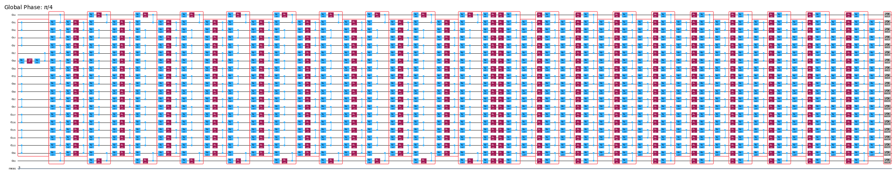
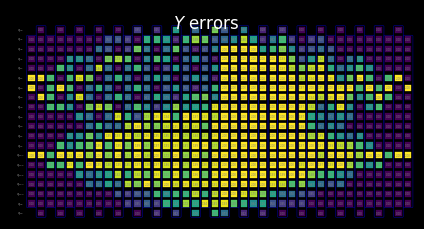

{/* doqumentation-source-hash: d7518943 */}

import TutorialFeedback from '@site/src/components/TutorialFeedback';

<OpenInLabBanner notebookPath="qiskit-addons/slc/01_getting_started.ipynb" />


## พื้นหลัง {#background}
บทแนะนำนี้จะแสดงวิธีลดข้อผิดพลาดโดยใช้ addon ชื่อ Shaded Lightcone (SLC) addon นี้เป็นการพัฒนาต่อยอดจาก[เทคนิค probabilistic error cancellation (PEC)](https://quantum.cloud.ibm.com/docs/guides/error-mitigation-and-suppression-techniques#probabilistic-error-cancellation-pec) ซึ่งผู้ใช้จะเรียนรู้ noise ของเลเยอร์ที่ไม่ซ้ำกันในวงจร แล้วนำ noise นั้นออกโดยใช้ gate แบบ single-qubit และเทคนิคการประมวลผลภายหลัง เมื่อเทียบกับวิธีอื่น PEC ให้ขอบเขตที่แน่นหนากว่าสำหรับ bias ของผลลัพธ์ที่ผ่านการลด noise แต่มักมี overhead ด้าน QPU time สูงกว่า ในระหว่าง PEC เพื่อชดเชยการลดทอนของค่า expectation value จาก noise ผลลัพธ์เฉลี่ยจะถูกปรับขนาดด้วยตัวประกอบ $\gamma = \exp(\sum_{l,\sigma} 2\lambda_{l,\sigma})$ โดยที่ $\lambda_{l,\sigma}$ คืออัตรา noise ที่เรียนรู้ได้ของ error Pauli $\sigma$ ที่เลเยอร์ $l$ ในวงจร การปรับขนาดนี้จะเพิ่ม variance ขึ้น $\gamma^2$ เท่า และทำให้จำนวนครั้งที่ต้องรันวงจรบน QPU เพิ่มขึ้น $\gamma^2$ เท่าด้วย ซึ่งเรียกว่า sampling cost หรือ sampling overhead เนื่องจาก $\gamma$ เติบโตแบบ exponential PEC จึงมักถูกจำกัดอยู่กับวงจรที่ตื้นหรือมีจำนวน qubit น้อย ศึกษาเพิ่มเติมเกี่ยวกับ PEC ได้จาก [Probabilistic error cancellation with sparse Pauli-Lindblad models on noisy quantum processors](https://arxiv.org/abs/2201.09866)

ถ้าเราสามารถระบุข้อผิดพลาดที่ไม่จำเป็นต้องลดทอนได้ ก็จะสามารถลด sampling cost ลงได้อย่างมากในเชิง exponential ก้าวแรกในทิศทางนี้คือการใช้ locally aware error mitigation ซึ่งใช้ "lightcone" แบบดั้งเดิมที่คำนวณได้รวดเร็ว เพื่อลด PEC overhead โดยกำหนดขอบเขตความไวต่อ error ของ observable ทั่วทั้งวงจร ขยายความเป็นไปได้ของ PEC ให้ใช้งานได้กับวงจรขนาดใหญ่ขึ้นสำหรับบางปัญหา ข้อผิดพลาดที่อยู่นอก lightcone นี้จะไม่ส่งผลต่อผลลัพธ์ที่วัดได้ จึงสามารถยกเว้นออกจากกระบวนการยกเลิกข้อผิดพลาดได้ การยกเว้นนี้จะลด sampling overhead ลงโดยไม่เพิ่ม bias ในบางกรณีลดลงได้มาก โดยเฉพาะอย่างยิ่งเมื่อวัด local observable $O$ ของวงจรที่มีความลึกคงที่ sampling overhead ที่ต้องการจะค่อย ๆ คงที่เมื่อขยายจำนวน qubit ในวงจร (ดูรูปที่ 2b ใน [Locality and Error Mitigation of Quantum Circuits](https://arxiv.org/abs/2303.06496))

Shaded Lightcones (SLC) ก้าวไปไกลกว่านั้น โดยใช้การจำลองเชิงคลาสสิกเพื่อกำหนดขอบเขตความไวต่อ error ทั่วทั้งวงจรได้แน่นยิ่งขึ้น วิธีนี้แลกเปลี่ยน QPU time บางส่วนกับ CPU time และลด sampling overhead ที่ต้องใช้ในการทำให้ bias เป็นปกติ แทนที่จะตัดอย่างชัดเจน ข้อผิดพลาดที่อาจเกิดขึ้นแต่ละรายการในวงจรจะถูกกำหนด "shade" แบบค่อยเป็นค่อยไปที่เป็นขอบเขตบนของความไวของ observable ต่อข้อผิดพลาดนั้น การจำแนกที่ละเอียดขึ้นนี้ช่วยให้ใช้ PEC ได้อย่างมีประสิทธิภาพและตรงเป้าหมายมากขึ้น พร้อมลด variance ขณะที่ให้ผู้ใช้ควบคุม bias ในการประมาณค่า observable ได้อย่างมีสัดส่วน ดูรายละเอียดเพิ่มเติมได้ใน [Lightcone shading for classically accelerated quantum error mitigation](https://arxiv.org/abs/2409.04401)

workflow ของ SLC addon ใช้ประโยชน์จาก framework ใหม่ Samplomatic และ Executor ช่วยให้ผู้ใช้ควบคุมการตั้งค่าการรันสำหรับ error suppression และ mitigation ได้อย่างโมดูลาร์มากขึ้น ในขณะที่ยังคงความสะดวกในการใช้งานสำหรับผู้ใช้ขั้นสูง เพื่อทำความเข้าใจประโยชน์ของ framework นี้และฟีเจอร์ทั่วไปในเชิงลึก ให้ดูบทแนะนำ [Hello samplomatic](https://github.com/qiskit-community/qdc-challenges-2025/blob/main/day3_tutorials/Track_A/hello_samplomatic/Samplomatic%20-%20Hello%20World.ipynb)

### Workflow สำหรับ lightcone shading, noise learning, และ anti-noise injection {#workflow-for-lightcone-shading-noise-learning-and-anti-noise-injection}
สำหรับการสร้างแบบจำลอง noise ของ QPU เราเลือกใช้ sparse Pauli-Lindblad noise model ที่มีอัตรา error แบบ 1- และ 2-qubit Pauli ที่สร้างขึ้นในระดับ local บนแต่ละ qubit และขอบของอุปกรณ์ ด้วยตัวเลือกนี้ workflow การลด error แบบ SLC ที่แสดงในบทแนะนำนี้มีขั้นตอนดังนี้

a. CPU — กำหนดขอบเขตผลกระทบต่อ error แบบ 1- และ 2-qubit Pauli แต่ละรายการ

  1. Forward propagation (กำหนดขอบเขตผลต่อ observable) ส่งผ่าน error แต่ละรายการไปยังส่วนท้ายของวงจรและคำนวณ commutator กับ observable
      - ตัดรายการ operator ระหว่างการ evolve เพื่อให้การคำนวณเป็นไปได้จริง
      - ทำให้ขอบเขตเหล่านี้แน่นขึ้นด้วยการ back-propagation ของ observable แบบ loose โดยอ้างอิงจาก quantum speed limits
  2. Backward propagation (กำหนดขอบเขตผลต่อ initial state) ส่งผ่าน error แต่ละรายการกลับไปยังจุดเริ่มต้นของวงจรและคำนวณ commutator กับ initial state

b. QPU — เรียนรู้อัตรา noise ใช้ `NoiseLearner` เพื่อประมาณอัตราของ Pauli-Lindblad noise model

c. CPU — จัดลำดับความสำคัญของ mitigation

  1. อัปเดตขอบเขตที่รวมกันด้วยอัตรา noise ที่เรียนรู้แล้ว รวมขอบเขต forward และ backward ที่คำนวณไว้ก่อนหน้าและอัปเดตด้วยอัตรา noise ที่เรียนรู้ได้
  2. จัดลำดับส่วนประกอบ noise ที่จะลดทอนโดยใช้ขอบเขตที่คำนวณได้และอัตราที่เรียนรู้แล้ว จัดลำดับความสำคัญของ error noise ที่เป็นไปได้แต่ละรายการตามผลกระทบที่ประมาณไว้ต่อ bias และค่าใช้จ่ายที่เกี่ยวข้องในการแก้ไข

d. QPU — แทรก antinoise และรัน รันวงจรที่สนใจพร้อม antinoise (inverse noise) ที่ระบุโดยใช้ annotation ของ `Box`

e. CPU — ประมาณค่า observable คำนวณค่า expectation value โดยใช้ post-selection จากการวัดเพื่อลดผลกระทบของ non-Markovian noise

### ภาพรวมการเรียนรู้ noise {#noise-learning-overview}
การเรียนรู้ noise เป็นขั้นตอนทั่วไปในวิธีการลด error หลายวิธี ดำเนินการโดย [NoiseLearner](https://quantum.cloud.ibm.com/docs/en/guides/noise-learning) และสามารถดูได้ในบทแนะนำ [PEA error mitigation](https://quantum.cloud.ibm.com/docs/tutorials/probabilistic-error-amplification) รวมถึง [Propagated noise absorption (PNA) tutorial](https://github.com/qiskit-community/qdc-challenges-2025/blob/main/day3_tutorials/Track_A/pna/propagated_noise_absorption.ipynb) ใน `NoiseLearnerV3` ผู้ใช้สามารถระบุเลเยอร์ noise ที่ต้องการเรียนรู้เป็น object [`CircuitInstruction`](https://quantum.cloud.ibm.com/docs/api/qiskit/qiskit.circuit.CircuitInstruction) ซึ่งช่วยให้ผู้ใช้คำนวณขอบเขต noise แบบ SLC ที่ต้องการสำหรับแต่ละเลเยอร์ตามที่อธิบายไว้ข้างต้น โมเดล Pauli-Lindblad ที่เรียนรู้แล้วจะให้ coefficients ที่ใช้ใน PEC-SLC prioritization วิธีที่ gate จะถูกรวบรวมเป็นเลเยอร์สามารถกำหนดได้โดยใช้ฟังก์ชัน `generate_boxing_pass_manager` และ `unique_2q_instructions` จากนั้นป้อนเข้า SLC utility function `generate_noise_model_paulis` ตามที่อธิบายในขั้นตอนที่ 2 ด้านล่าง

| **ส่วนที่ 1** | **ส่วนที่ 2** | **ส่วนที่ 3** |
|-----------|-----------|-----------|
| Pauli-twirl เลเยอร์ gate แบบ two-qubit | ทำซ้ำคู่ identity ของเลเยอร์และเรียนรู้ noise | หาค่า fidelity (error สำหรับแต่ละ noise channel) |
|  |  |  |

### ภาพรวมการประมวลผลภายหลัง {#post-processing-overview}
หลังจากรันบนฮาร์ดแวร์ quantum โดยใช้ framework Samplomatic และ Executor แล้ว เราจะแปลงค่าการวัด bitstring เป็นค่า observable ที่ต้องการ ในกรณีของ mirrored Ising circuit เราจะได้ค่า observable ที่วัดได้เป็น 1 ในอุดมคติ เนื่องจาก qubit ทั้งหมดควรกลับมาจุดเริ่มต้นที่ $\ket{0}$ ในอุดมคติ เมื่อคำนวณค่า observable ด้วยฟังก์ชัน `expectation_values` เราจะใช้เทคนิคการประมวลผลภายหลังสองสามวิธีที่ช่วยลดผลกระทบของ noise ซึ่งรวมถึงการนำ shot ที่ได้รับผลกระทบจาก non-Markovian noise ออก readout-error mitigation รวมถึงการคำนวณรายละเอียดของการใช้งาน PEC ของเรา รายละเอียดจะกล่าวถึงในขั้นตอนที่ 4 ด้านล่าง

## ข้อกำหนด {#requirements}
ก่อนเริ่มบทแนะนำนี้ ตรวจสอบว่าติดตั้ง package ต่อไปนี้แล้ว:

- Qiskit IBM Runtime พร้อม Executor primitive (`pip install "qiskit-ibm-runtime @ git+https://github.com/Qiskit/qiskit-ibm-runtime.git"`)
- Qiskit addon Shaded lightcone 0.1 (`pip install "qiskit-addon-slc~=0.1.0`")
- Qiskit addon utils (`pip install "qiskit-addon-utils~=0.3.0"`)
- Samplomatic v0.16 หรือสูงกว่า (`pip install samplomatic`)
- Qiskit Visualization support (`pip install "qiskit[visualization]"`)
## ขั้นตอนที่ 0. ตั้งค่า {#step-0-setup}
ก่อนอื่น import package และฟังก์ชันที่จำเป็นสำหรับการรัน notebook นี้

```python
# Added by doQumentation — required packages for this notebook
!pip install -q matplotlib numpy qiskit qiskit-addon-slc qiskit-addon-utils qiskit-ibm-runtime samplomatic
```

```python
import logging

logging.basicConfig(level=logging.INFO, format="%(asctime)s %(levelname)s %(module)s %(message)s")

# Setting this value prevents itertools.starmap deadlock on UNIX systems
from multiprocessing import set_start_method

set_start_method("spawn")

# Needed to prevent PySCF from parallelizing internally (SLC only)
%set_env OMP_NUM_THREADS=1
```

```text
env: OMP_NUM_THREADS=1
```

```python
import pickle

import numpy as np
import samplomatic
from matplotlib import pyplot as plt
from qiskit import QuantumCircuit
from qiskit.quantum_info import SparsePauliOp
from qiskit.transpiler import PassManager, generate_preset_pass_manager
from qiskit_addon_slc.bounds import (
    compute_backward_bounds,
    compute_forward_bounds,
    compute_local_scales,
    merge_bounds,
    tighten_with_speed_limit,
)
from qiskit_addon_slc.utils import generate_noise_model_paulis, map_modifier_ref_to_ref
from qiskit_addon_slc.visualization import draw_shaded_lightcone
from qiskit_addon_utils.exp_vals.expectation_values import executor_expectation_values
from qiskit_addon_utils.exp_vals.measurement_bases import get_measurement_bases
from qiskit_addon_utils.noise_management import gamma_from_noisy_boxes, trex_factors
from qiskit_addon_utils.noise_management.post_selection import PostSelector
from qiskit_addon_utils.noise_management.post_selection.transpiler.passes import (
    AddPostSelectionMeasures,
    AddSpectatorMeasures,
)
from qiskit_ibm_runtime import Executor, QiskitRuntimeService, QuantumProgram
from qiskit_ibm_runtime.noise_learner_v3 import NoiseLearnerV3
from qiskit_ibm_runtime.options import NoiseLearnerV3Options
from samplomatic.transpiler import generate_boxing_pass_manager
from samplomatic.utils import find_unique_box_instructions
```

## ขั้นตอนที่ 1. วิเคราะห์ปัญหา {#step-1-map-the-problem}
เพื่อความสะดวกในการสาธิต เราเลือกใช้ 1D mirror Ising chain ห่วงโซ่ Ising แบบ 1D ให้โครงสร้างวงจรที่หนาแน่น ซึ่งสะดวกสำหรับการแสดงการใช้งาน PEC mirror circuit ทำให้ง่ายต่อการรู้ผลลัพธ์ที่คาดหวัง (กล่าวคือ เราควรวัด observable ได้เป็น 1)

นอกจากนี้ เราต้องการรัน mirror circuit ดังนั้นสำหรับทุก gate ในครึ่งหลังของวงจร จะต้องมี inverse gate ในครึ่งแรก เนื่องจาก observable ที่วัด **$<X_6 Z_{13}>$** มีการวัดที่ไม่อยู่ใน Z-basis และ executor จะคำนึงถึง basis ที่ต้องการ ณ ส่วนท้ายของวงจร เราจึงมีฟังก์ชัน `prepare_basis` ที่แทรก gate ที่เหมาะสมไว้ที่จุดเริ่มต้นของ mirror circuit รายละเอียดนี้เฉพาะเจาะจงกับการสาธิต mirror circuit ของเรา ฟังก์ชัน `get_measurement_bases` ช่วยให้เราระบุได้ง่ายว่าต้องใช้ gate ใดและต่อไว้ที่ไหน รวมถึงช่วยติดตามความละเอียดเรื่องดัชนี qubit ที่เกิดขึ้นจากแบบแผนใน annotation แบบ `box` ตามที่กล่าวถึงในส่วน "Prepare canonical bases measurements"

```python
num_qubits = 20
target_obs_sparse = [("XZ", [6, 13], 1.0)]
```

```python
observable = SparsePauliOp.from_sparse_list(target_obs_sparse, num_qubits=num_qubits)
```

```python
bases_virt, reverser_virt = get_measurement_bases(observable)
```

```python
num_trotter_steps = 10
rx_angle = np.pi / 4
```

```python
def construct_ising_circuit(
    num_qubits: int, num_trotter_steps: int, rx_angle: float, barrier: bool = True
) -> QuantumCircuit:
    circuit = QuantumCircuit(num_qubits)

    for _step in range(num_trotter_steps):
        circuit.rx(rx_angle, range(num_qubits))
        if barrier:
            circuit.barrier()
        for first_qubit in (1, 2):
            for idx in range(first_qubit, num_qubits, 2):
                # equivalent to Rzz(-pi/2):
                circuit.sdg([idx - 1, idx])
                circuit.cz(idx - 1, idx)
        if barrier:
            circuit.barrier()

    return circuit

def prepare_basis(circuit: QuantumCircuit, basis: list[int]) -> QuantumCircuit:
    # basis is a list of integer values from 0 to 3. These map to the basis measurement as:
    # 0 = I; 1 = Z; 2 = X; 3 = Y
    assert len(basis) == circuit.num_qubits

    out_circ = circuit.copy_empty_like()
    for qb, bas in enumerate(basis):
        if bas in {0, 1}:
            continue
        if bas == 2:
            out_circ.h(qb)
        elif bas == 3:
            out_circ.rx(-np.pi / 2, qb)

    out_circ.barrier()
    out_circ.compose(circuit, inplace=True)
    return out_circ

def mirror_circuit(circuit: QuantumCircuit, *, inverse_first: bool = False) -> QuantumCircuit:
    mirror_circ = circuit.copy_empty_like()
    mirror_circ.compose(circuit.inverse() if inverse_first else circuit, inplace=True)
    mirror_circ.barrier()
    mirror_circ.compose(circuit if inverse_first else circuit.inverse(), inplace=True)
    mirror_circ.measure_active()
    return mirror_circ
```

```python
# Instantiate circuit
circuit = construct_ising_circuit(num_qubits, num_trotter_steps, rx_angle, barrier=False)
mirrored_circuit = mirror_circuit(circuit, inverse_first=True)
mirrored_circuit = prepare_basis(mirrored_circuit, bases_virt[0])
```

```python
mirrored_circuit.draw("mpl", fold=-1, scale=0.3, idle_wires=False, measure_arrows=False)
```


## ขั้นตอนที่ 2. เพิ่มประสิทธิภาพ {#step-2-optimize}
เราจะเพิ่มประสิทธิภาพรายละเอียดที่เกี่ยวกับวงจรที่จะรัน observable ที่จะวัด และ parameter การเรียนรู้ noise ในเบื้องต้น เราตรวจสอบให้แน่ใจว่าสร้าง backend พร้อมเปิดใช้งาน fractional gates ซึ่ง fractional gate เหล่านี้จะช่วยให้มีความไวมากขึ้นในการกรอง post-selection บางส่วน

```python
token = "<YOUR_TOKEN>"
instance = "<YOUR_INSTANCE>"

# This is used to retrieve shared results
shared_service = QiskitRuntimeService(
    channel="ibm_quantum_platform",
    token=token,
    instance=instance,
)

# This is used to run on real hardware
service = service = QiskitRuntimeService()
```

```text
qiskit_runtime_service._discover_account:WARNING:2025-11-10 11:19:40,108: Loading account with the given token. A saved account will not be used.
```

```python
backend = service.backend("ibm_kingston", use_fractional_gates=True)
```

ก่อนอื่น เราจะ transpile วงจรของเราเป็น ISA instructions [ตามที่จำเป็นสำหรับการรันบน QPU](https://www.ibm.com/quantum/blog/isa-circuits) สำหรับข้อมูลที่เก็บในการทดลองนี้ เราเลือก qubit ด้วยตนเองโดยอ้างอิงจากการประเมินห่วงโซ่คุณภาพสูงสุด

```python
layout = [44, 45, 46, 47, 57, 67, 68, 69, 78, 89, 88, 87, 97, 107, 106, 105, 104, 103, 96, 83]
```

```python
isa_pm = generate_preset_pass_manager(backend=backend, initial_layout=layout, optimization_level=0)

isa_circuit = isa_pm.run(mirrored_circuit)
assert isa_circuit.layout.final_index_layout() == layout

isa_observable = observable.apply_layout(layout, num_qubits=isa_circuit.num_qubits)
```

```text
2025-11-10 11:19:57,810 INFO base_tasks Pass: ContainsInstruction - 0.00715 (ms)
2025-11-10 11:19:57,811 INFO base_tasks Pass: UnitarySynthesis - 0.00525 (ms)
2025-11-10 11:19:57,811 INFO base_tasks Pass: HighLevelSynthesis - 0.02599 (ms)
2025-11-10 11:19:57,811 INFO base_tasks Pass: BasisTranslator - 0.09131 (ms)
2025-11-10 11:19:57,811 INFO base_tasks Pass: SetLayout - 0.02623 (ms)
2025-11-10 11:19:57,812 INFO base_tasks Pass: FullAncillaAllocation - 0.14400 (ms)
2025-11-10 11:19:57,812 INFO base_tasks Pass: EnlargeWithAncilla - 0.06318 (ms)
2025-11-10 11:19:57,813 INFO base_tasks Pass: ApplyLayout - 0.29802 (ms)
2025-11-10 11:19:57,813 INFO base_tasks Pass: CheckMap - 0.07820 (ms)
2025-11-10 11:19:57,814 INFO base_tasks Pass: FilterOpNodes - 0.33283 (ms)
2025-11-10 11:19:57,814 INFO base_tasks Pass: UnitarySynthesis - 0.00691 (ms)
2025-11-10 11:19:57,814 INFO base_tasks Pass: HighLevelSynthesis - 0.13208 (ms)
2025-11-10 11:19:57,816 INFO base_tasks Pass: BasisTranslator - 1.00303 (ms)
2025-11-10 11:19:57,818 INFO base_tasks Pass: FoldRzzAngle - 1.78719 (ms)
2025-11-10 11:19:57,818 INFO base_tasks Pass: ContainsInstruction - 0.00691 (ms)
2025-11-10 11:19:57,818 INFO base_tasks Pass: InstructionDurationCheck - 0.00405 (ms)
```

```python
wire_order = layout + [q for q in range(isa_circuit.num_qubits) if q not in layout]
isa_circuit.draw(
    "mpl", fold=-1, scale=0.3, idle_wires=False, wire_order=wire_order, measure_arrows=False
)
```


### Box the circuit {#box-the-circuit}

เพื่อให้ใช้งานได้ง่าย เราจะใช้ transpilation pass `generate_boxing_pass_manager` ซึ่งจะนำ instruction ในวงจรมาใส่ไว้ใน box ที่มี annotation กำกับ box เหล่านี้ระบุชัดเจนว่าตรงไหนในวงจรที่ควรใส่ antinoise เข้าไปในกรณีของ PEC สำหรับรายละเอียดการตั้งค่า ดูได้ที่ [เอกสาร Samplomatic](https://qiskit.github.io/samplomatic/)

ขอให้สังเกตว่า workflow ของ SLC ใช้ `inject_noise_strategy="individual_modification"` ในขั้นตอนถัดไป เพราะวิธีนี้ช่วยให้เราระบุ `BoxOp` แต่ละตัวในวงจรได้อย่างเฉพาะเจาะจง

ฟังก์ชัน `find_unique_box_instructions` จะวนซ้ำผ่าน boxed circuit ที่ให้มา แล้วระบุ box ที่มี layer 2Q หรือการวัดที่ไม่ซ้ำกัน เพื่อใช้ในการเรียนรู้ noise และการใส่ noise

```python
# Box circuit with Twirl and InjectNoise annotations
boxes_pm = generate_boxing_pass_manager(
    twirling_strategy="active",
    inject_noise_strategy="individual_modification",
    inject_noise_targets="gates",
    measure_annotations="all",
)

boxed_circuit = boxes_pm.run(isa_circuit)

# Find the unique instructions (layers) from boxed circuit
unique_2q_instructions = find_unique_box_instructions(
    boxed_circuit, normalize_annotations=None, undress_boxes=True
)
```

```text
2025-11-10 11:20:01,088 INFO base_tasks Pass: RemoveBarriers - 0.02289 (ms)
2025-11-10 11:20:01,100 INFO base_tasks Pass: GroupGatesIntoBoxes - 12.38990 (ms)
2025-11-10 11:20:01,101 INFO base_tasks Pass: GroupMeasIntoBoxes - 0.47898 (ms)
2025-11-10 11:20:01,104 INFO base_tasks Pass: AddTerminalRightDressedBoxes - 2.88177 (ms)
2025-11-10 11:20:01,111 INFO base_tasks Pass: AddInjectNoise - 6.66904 (ms)
```

```python
boxed_circuit.draw(
    "mpl", fold=-1, scale=0.3, idle_wires=False, wire_order=wire_order, measure_arrows=False
)
```



### Prepare canonical bases measurements {#prepare-canonical-bases-measurements}

เนื่องจากวิธีที่ Qubit ถูกตั้งชื่อเมื่อระบุ layer 2Q ที่ไม่ซ้ำกัน จึงต้องระมัดระวังเป็นพิเศษในการติดตามลำดับ Qubit ด้านล่างนี้ เราแนะนำแนวคิดของ `canonical_qubits` เพื่อปรับลำดับ Qubit ให้เหมาะสมเมื่อส่งให้กับ executor อันเป็นผลมาจากวิธีที่ลำดับ Qubit ถูกจับเมื่อทำการ boxing วงจรและค้นหา instruction ที่ไม่ซ้ำกัน ดูรายละเอียดได้ที่เอกสาร [Qubit ordering convention](https://qiskit.github.io/samplomatic/guides/samplex_io.html#qubit-ordering-convention)

```python
# Determine the canonical qubits order
meas_box = boxed_circuit.data[-1]
canonical_qubits = [
    idx for idx, qubit in enumerate(boxed_circuit.qubits) if qubit in meas_box.qubits
]

# map canonical qubit to physical (isa) qubit
c_2_p = {c: p for c, p in enumerate(canonical_qubits)}
# map physical (isa) qubit to virtual qubit (index in original circuit)
p_2_v = {p: v for v, p in enumerate(layout)}
# compute map between virtual and canonical qubit indices.
c_2_v = {c: p_2_v[p] for c, p in c_2_p.items()}

assert len(c_2_v) == num_qubits

bases_canon = [
    np.array([base_i[c_2_v[c]] for c in range(num_qubits)], dtype=np.uint8) for base_i in bases_virt
]
```

### Workflow for lightcone shading, noise learning, and anti-noise injection {#workflow-for-lightcone-shading-noise-learning-and-anti-noise-injection}

> **หมายเหตุ**: สำหรับการ implement SLC-PEC ในบทเรียนนี้ เราจะรัน SLC bound computations **ก่อน** ที่การเรียนรู้ noise จะเสร็จสมบูรณ์ เพื่อให้วงจรที่ต้องการ mitigate รันให้ใกล้เคียงกับ noise model ที่เรียนรู้มามากที่สุด ในหลักการแล้ว workflow นี้สามารถพัฒนาต่อให้ execute พร้อมกันได้ กล่าวคือ สามารถรัน noise-learning job ในขณะที่ประมาณค่า noise bound แบบขนานกัน สำหรับ quantum circuit ทั่วไป การคำนวณ noise bound อาจ scale ด้วย dependence ที่ exponential อย่างอ่อน ดังนั้นจึงอาจเป็นการดีที่จะใช้ parallelized execution เพื่อเพิ่มประสิทธิภาพสูงสุดของ workflow เพื่อแสดงให้เห็นจุดนี้ เราสาธิตโดยใช้ทรัพยากรระดับ cluster (128 thread) และแสดงให้เห็นว่าเมื่อกำหนดเวลาคำนวณเท่ากัน คุณสามารถได้ bounds ที่ละเอียดกว่าสำหรับวงจรที่กำหนด เมื่อเทียบกับ laptop (8 thread) นอกจากนี้ แม้ว่า workflow นี้จะยังไม่ได้ implement แต่คุณสามารถขนาน QPU executions สำหรับ noise learning และ noise-bound computations เพื่อให้ได้ workflow ที่มีประสิทธิภาพสูงสุด

#### Predict to-be-learned noise-model Paulis {#predict-to-be-learned-noise-model-paulis}

ฟังก์ชัน `generate_noise_model_paulis` จะผ่านแต่ละ boxed layer ของวงจรที่ให้มาและสร้าง Pauli term น้ำหนัก 1 และน้ำหนัก 2 ทั้งหมดที่เกี่ยวข้อง โดยคำนึงถึง qubit connectivity ของวงจรและเลือก term ที่เกี่ยวข้องกับ node และ edge ที่ active จากนั้น term เหล่านี้จะถูกนำมาใช้คำนวณ forward และ backward noise bounds

```python
noise_model_paulis = generate_noise_model_paulis(
    unique_2q_instructions, backend.coupling_map, boxed_circuit
)
```

```python
noise_model_rates = {ref: None for ref in noise_model_paulis}
```

##### a. Compute and tighten forward bounds {#a-compute-and-tighten-forward-bounds}

ฟังก์ชัน `compute_forward_bounds` จะประเมิน commutation relations ระหว่าง Gate ในแต่ละ layer กับ Pauli term ที่สร้างขึ้นข้างต้น ในแง่ของว่า error ที่ forward-propagate ส่งผลต่อ observable $A$ ที่ต้องการอย่างไร สำหรับ Gate ที่ commute กับ Pauli term จะไม่มีการดำเนินการใดๆ สำหรับ Clifford Gate จะถูก push ไปยังจุดเริ่มต้นของวงจร สำหรับ non-Clifford Gate เราประมาณอิทธิพลของมันต่อ observable เป้าหมายเพื่อจัดลำดับความสำคัญของการยกเลิก noise ในภายหลัง (หลังจากรวม bounds ทั้งหมดแล้ว) bound นี้ทำได้โดยการใช้ L2 norm ก่อน (ซึ่งก็คือรากที่สองของผลรวมกำลังสองของ coefficient ของ Pauli term ที่เกี่ยวข้อง) เมื่อมี qubit term จำนวนมากเกินไป เราจะใช้ bound ที่หลวมกว่าซึ่งใช้ triangle inequality แทน

#### Laptop-level resources {#laptop-level-resources}

```python
slc_atol = 1e-8
slc_eigval_max_qubits = 18
slc_evolution_max_terms = 1000
slc_num_processes = 8
slc_timeout = 60
```

```python
forward_bounds = compute_forward_bounds(
    boxed_circuit,
    noise_model_paulis,
    isa_observable,
    evolution_max_terms=slc_evolution_max_terms,
    eigval_max_qubits=slc_eigval_max_qubits,
    atol=slc_atol,
    num_processes=slc_num_processes,
    timeout=slc_timeout,
)
```

```text
2025-11-10 11:20:04,344 INFO forward Evolving Pauli error terms forwards through the circuit.
2025-11-10 11:20:04,344 INFO forward Modelling errors as though they happen *after* each noise layer.
2025-11-10 11:20:04,345 INFO remove_measure Removing ANY Measure operations from the provided circuit!
2025-11-10 11:20:04,453 INFO circuit_iter Noisy box 'm39'
2025-11-10 11:20:05,254 INFO circuit_iter Noisy box 'm38'
2025-11-10 11:20:05,304 INFO circuit_iter Noisy box 'm37'
2025-11-10 11:20:05,382 INFO circuit_iter Noisy box 'm36'
2025-11-10 11:20:05,467 INFO circuit_iter Noisy box 'm35'
2025-11-10 11:20:05,580 INFO circuit_iter Noisy box 'm34'
2025-11-10 11:20:05,705 INFO circuit_iter Noisy box 'm33'
2025-11-10 11:20:05,857 INFO circuit_iter Noisy box 'm32'
2025-11-10 11:20:06,034 INFO circuit_iter Noisy box 'm31'
2025-11-10 11:20:06,221 INFO circuit_iter Noisy box 'm30'
2025-11-10 11:20:06,449 INFO circuit_iter Noisy box 'm29'
2025-11-10 11:20:06,724 INFO circuit_iter Noisy box 'm28'
2025-11-10 11:20:07,628 INFO circuit_iter Noisy box 'm27'
2025-11-10 11:20:09,110 INFO circuit_iter Noisy box 'm26'
2025-11-10 11:20:11,696 INFO circuit_iter Noisy box 'm25'
2025-11-10 11:20:16,100 INFO circuit_iter Noisy box 'm24'
2025-11-10 11:20:21,781 INFO circuit_iter Noisy box 'm23'
2025-11-10 11:20:30,244 INFO circuit_iter Noisy box 'm22'
2025-11-10 11:20:40,416 INFO circuit_iter Noisy box 'm21'
2025-11-10 11:20:53,437 INFO circuit_iter Noisy box 'm20'
2025-11-10 11:21:06,038 INFO circuit_iter Noisy box 'm19'
2025-11-10 11:21:06,038 WARNING commutator_bounds Bounds computation timed out.
2025-11-10 11:21:06,039 INFO circuit_iter Noisy box 'm18'
2025-11-10 11:21:06,039 INFO circuit_iter Noisy box 'm17'
2025-11-10 11:21:06,039 INFO circuit_iter Noisy box 'm16'
2025-11-10 11:21:06,040 INFO circuit_iter Noisy box 'm15'
2025-11-10 11:21:06,040 INFO circuit_iter Noisy box 'm14'
2025-11-10 11:21:06,040 INFO circuit_iter Noisy box 'm13'
2025-11-10 11:21:06,040 INFO circuit_iter Noisy box 'm12'
2025-11-10 11:21:06,041 INFO circuit_iter Noisy box 'm11'
2025-11-10 11:21:06,041 INFO circuit_iter Noisy box 'm10'
2025-11-10 11:21:06,041 INFO circuit_iter Noisy box 'm9'
2025-11-10 11:21:06,042 INFO circuit_iter Noisy box 'm8'
2025-11-10 11:21:06,042 INFO circuit_iter Noisy box 'm7'
2025-11-10 11:21:06,042 INFO circuit_iter Noisy box 'm6'
2025-11-10 11:21:06,042 INFO circuit_iter Noisy box 'm5'
2025-11-10 11:21:06,043 INFO circuit_iter Noisy box 'm4'
2025-11-10 11:21:06,043 INFO circuit_iter Noisy box 'm3'
2025-11-10 11:21:06,043 INFO circuit_iter Noisy box 'm2'
2025-11-10 11:21:06,043 INFO circuit_iter Noisy box 'm1'
2025-11-10 11:21:06,044 INFO circuit_iter Noisy box 'm0'
```

#### Visualize the SLC for manual inspection {#visualize-the-slc-for-manual-inspection}

เราสามารถตีความพฤติกรรมของ shaded bounds ได้โดยการตรวจสอบว่าการวัดและ Pauli term มีปฏิสัมพันธ์กับ local error อย่างไร รูปแบบเหล่านี้เป็นลักษณะเฉพาะของปัญหา time-evolution ของ kicked Ising Hamiltonian และยังปรากฏในงานวิจัย [Lightcone Shading for Classically Accelerated Quantum Error Mitigation](https://arxiv.org/abs/2409.04401) ด้วย โดยมีลักษณะเด่นหลายประการ:

- เราเห็น cone สองอันที่เกิดจาก Pauli ที่ไม่ใช่ identity สองตัวใน observable ได้อย่างชัดเจน
- เราเห็นว่าการวัด X บน qubit 6 commute กับ X error ใน layer ขวาสุด
- เราเห็นว่า Z Pauli บน qubit 13 commute กับ Z error ใน layer ขวาสุด
- เมื่อถึง timeout ที่กำหนดข้างต้น layer ที่เหลือทางซ้ายจะถูกเติมด้วย trivial bounds ค่าสองทั้งหมด

```python
for p in "XYZ":
    display(
        draw_shaded_lightcone(
            boxed_circuit,
            forward_bounds,
            noise_model_paulis,
            pauli_filter=p,
            scale=0.15,
            fold=-1,
            idle_wires=False,
            wire_order=wire_order,
            measure_arrows=False,
        )
    )
```


#### b. Compute and tighten forward bounds {#b-compute-and-tighten-forward-bounds}

ต่อไปเราจะทำให้ bounds แคบลงโดยใช้ฟังก์ชัน `tighten_with_speed_limit` ซึ่งติดตามว่า observable กระจายตัวย้อนกลับผ่านวงจรอย่างไร และใช้การกระจายตัวนั้นในการกำหนด upper bound ของผลกระทบของแต่ละ noise operator โดยเลือกค่าที่น้อยกว่าระหว่าง forward bound ที่คำนวณไว้และ backward-propagation bound

```python
forward_bounds_tighter = tighten_with_speed_limit(
    forward_bounds, boxed_circuit, noise_model_paulis, isa_observable
)
```

```text
2025-11-10 11:21:08,270 INFO speed_limit Tighting bounds using information propagation speed limits
2025-11-10 11:21:08,270 INFO speed_limit Modelling errors as though they happen *after* each noise layer.
2025-11-10 11:21:08,298 INFO remove_measure Removing ANY Measure operations from the provided circuit!
2025-11-10 11:21:08,310 INFO circuit_iter Noisy box 'm39'
2025-11-10 11:21:08,314 INFO circuit_iter Noisy box 'm38'
2025-11-10 11:21:08,317 INFO circuit_iter Noisy box 'm37'
2025-11-10 11:21:08,319 INFO circuit_iter Noisy box 'm36'
2025-11-10 11:21:08,323 INFO circuit_iter Noisy box 'm35'
2025-11-10 11:21:08,325 INFO circuit_iter Noisy box 'm34'
2025-11-10 11:21:08,328 INFO circuit_iter Noisy box 'm33'
2025-11-10 11:21:08,330 INFO circuit_iter Noisy box 'm32'
2025-11-10 11:21:08,334 INFO circuit_iter Noisy box 'm31'
2025-11-10 11:21:08,336 INFO circuit_iter Noisy box 'm30'
2025-11-10 11:21:08,338 INFO circuit_iter Noisy box 'm29'
2025-11-10 11:21:08,340 INFO circuit_iter Noisy box 'm28'
2025-11-10 11:21:08,344 INFO circuit_iter Noisy box 'm27'
2025-11-10 11:21:08,346 INFO circuit_iter Noisy box 'm26'
2025-11-10 11:21:08,349 INFO circuit_iter Noisy box 'm25'
2025-11-10 11:21:08,351 INFO circuit_iter Noisy box 'm24'
2025-11-10 11:21:08,355 INFO circuit_iter Noisy box 'm23'
2025-11-10 11:21:08,357 INFO circuit_iter Noisy box 'm22'
2025-11-10 11:21:08,360 INFO circuit_iter Noisy box 'm21'
2025-11-10 11:21:08,362 INFO circuit_iter Noisy box 'm20'
2025-11-10 11:21:08,367 INFO circuit_iter Noisy box 'm19'
2025-11-10 11:21:08,369 INFO circuit_iter Noisy box 'm18'
2025-11-10 11:21:08,372 INFO circuit_iter Noisy box 'm17'
2025-11-10 11:21:08,375 INFO circuit_iter Noisy box 'm16'
2025-11-10 11:21:08,378 INFO circuit_iter Noisy box 'm15'
2025-11-10 11:21:08,380 INFO circuit_iter Noisy box 'm14'
2025-11-10 11:21:08,383 INFO circuit_iter Noisy box 'm13'
2025-11-10 11:21:08,386 INFO circuit_iter Noisy box 'm12'
2025-11-10 11:21:08,389 INFO circuit_iter Noisy box 'm11'
2025-11-10 11:21:08,391 INFO circuit_iter Noisy box 'm10'
2025-11-10 11:21:08,394 INFO circuit_iter Noisy box 'm9'
2025-11-10 11:21:08,396 INFO circuit_iter Noisy box 'm8'
2025-11-10 11:21:08,399 INFO circuit_iter Noisy box 'm7'
2025-11-10 11:21:08,401 INFO circuit_iter Noisy box 'm6'
2025-11-10 11:21:08,404 INFO circuit_iter Noisy box 'm5'
2025-11-10 11:21:08,406 INFO circuit_iter Noisy box 'm4'
2025-11-10 11:21:08,410 INFO circuit_iter Noisy box 'm3'
2025-11-10 11:21:08,412 INFO circuit_iter Noisy box 'm2'
2025-11-10 11:21:08,415 INFO circuit_iter Noisy box 'm1'
2025-11-10 11:21:08,417 INFO circuit_iter Noisy box 'm0'
```

#### Visualize the SLC for manual inspection {#visualize-the-slc-for-manual-inspection-2}

เราสามารถทำให้ bounds แคบลงอีกได้โดยคำนึงถึงข้อจำกัดของ lightcone ในหลักการแล้ว วิธีนี้ช่วยให้การเปลี่ยนผ่านจาก computed bounds ไปสู่ trivial bounds ที่กำหนดหลังจาก timeout เป็นไปอย่างราบรื่นกว่า ที่นี่ผลกระทบนั้นไม่ค่อยเห็นชัดนัก เพราะ lightcone ได้ถึงขอบของวงจรแล้ว

```python
for p in "XYZ":
    display(
        draw_shaded_lightcone(
            boxed_circuit,
            forward_bounds_tighter,
            noise_model_paulis,
            pauli_filter=p,
            scale=0.15,
            fold=-1,
            idle_wires=False,
            wire_order=wire_order,
            measure_arrows=False,
        )
    )
```


#### c. Compute backward bounds {#c-compute-backward-bounds}

ส่วนนี้ของการทำนาย noise จะประเมินว่า error ที่เกิดขึ้นในแต่ละ layer สามารถส่งผลต่อ input state $\rho$ ได้มากแค่ไหน ฟังก์ชัน `compute_backward_bounds` จะกลับวงจรก่อน แล้วลบ measurement gates ออก จากนั้นจึงดำเนินการวิเคราะห์ในลักษณะเดียวกับที่ทำไปตอน forward-bound computations

```python
backward_bounds = compute_backward_bounds(
    boxed_circuit,
    noise_model_paulis,
    evolution_max_terms=slc_evolution_max_terms,
    num_processes=slc_num_processes,
    timeout=slc_timeout,
)
```

```text
2025-11-10 11:21:10,666 INFO backward Evolving Pauli error terms backwards through the circuit.
2025-11-10 11:21:10,666 INFO backward Modelling errors as though they happen *after* each noise layer.
2025-11-10 11:21:10,667 INFO remove_measure Removing ANY Measure operations from the provided circuit!
2025-11-10 11:21:10,774 INFO circuit_iter Noisy box 'm0'
2025-11-10 11:21:11,640 INFO circuit_iter Noisy box 'm1'
2025-11-10 11:21:11,681 INFO circuit_iter Noisy box 'm2'
2025-11-10 11:21:11,867 INFO circuit_iter Noisy box 'm3'
2025-11-10 11:21:12,078 INFO circuit_iter Noisy box 'm4'
2025-11-10 11:21:12,329 INFO circuit_iter Noisy box 'm5'
2025-11-10 11:21:12,637 INFO circuit_iter Noisy box 'm6'
2025-11-10 11:21:13,110 INFO circuit_iter Noisy box 'm7'
2025-11-10 11:21:13,705 INFO circuit_iter Noisy box 'm8'
2025-11-10 11:21:14,384 INFO circuit_iter Noisy box 'm9'
2025-11-10 11:21:15,213 INFO circuit_iter Noisy box 'm10'
2025-11-10 11:21:15,946 INFO circuit_iter Noisy box 'm11'
2025-11-10 11:21:16,754 INFO circuit_iter Noisy box 'm12'
2025-11-10 11:21:17,557 INFO circuit_iter Noisy box 'm13'
2025-11-10 11:21:18,447 INFO circuit_iter Noisy box 'm14'
2025-11-10 11:21:19,453 INFO circuit_iter Noisy box 'm15'
2025-11-10 11:21:20,472 INFO circuit_iter Noisy box 'm16'
2025-11-10 11:21:21,479 INFO circuit_iter Noisy box 'm17'
2025-11-10 11:21:22,660 INFO circuit_iter Noisy box 'm18'
2025-11-10 11:21:23,705 INFO circuit_iter Noisy box 'm19'
2025-11-10 11:21:24,849 INFO circuit_iter Noisy box 'm20'
2025-11-10 11:21:26,030 INFO circuit_iter Noisy box 'm21'
2025-11-10 11:21:27,111 INFO circuit_iter Noisy box 'm22'
2025-11-10 11:21:28,354 INFO circuit_iter Noisy box 'm23'
2025-11-10 11:21:29,554 INFO circuit_iter Noisy box 'm24'
2025-11-10 11:21:30,897 INFO circuit_iter Noisy box 'm25'
2025-11-10 11:21:32,113 INFO circuit_iter Noisy box 'm26'
2025-11-10 11:21:33,622 INFO circuit_iter Noisy box 'm27'
2025-11-10 11:21:34,962 INFO circuit_iter Noisy box 'm28'
2025-11-10 11:21:36,504 INFO circuit_iter Noisy box 'm29'
2025-11-10 11:21:38,021 INFO circuit_iter Noisy box 'm30'
2025-11-10 11:21:39,750 INFO circuit_iter Noisy box 'm31'
2025-11-10 11:21:41,237 INFO circuit_iter Noisy box 'm32'
2025-11-10 11:21:42,974 INFO circuit_iter Noisy box 'm33'
2025-11-10 11:21:44,527 INFO circuit_iter Noisy box 'm34'
2025-11-10 11:21:46,535 INFO circuit_iter Noisy box 'm35'
2025-11-10 11:21:48,152 INFO circuit_iter Noisy box 'm36'
2025-11-10 11:21:50,074 INFO circuit_iter Noisy box 'm37'
2025-11-10 11:21:51,814 INFO circuit_iter Noisy box 'm38'
2025-11-10 11:21:53,943 INFO circuit_iter Noisy box 'm39'
```

#### Visualize the SLC for manual inspection {#visualize-the-slc-for-manual-inspection}

จากการคำนวณ backward bounds เราจะเห็นได้ว่าโครงสร้างของ initial state ส่งผลต่อพฤติกรรมช่วงต้นของการแพร่กระจาย error อย่างไร:

- เราจะเห็นได้ชัดว่า Z error ในช่วงแรกนั้น commute กับ initial state |0⟩
- มีเพียง qubit 6 เท่านั้นที่เราใช้ eigenstate +1 ของ X basis เป็น initial state ทำให้ Z error ไม่ commute แต่ X error กลับ commute

```python
for p in "XYZ":
    display(
        draw_shaded_lightcone(
            boxed_circuit,
            backward_bounds,
            noise_model_paulis,
            pauli_filter=p,
            scale=0.15,
            fold=-1,
            idle_wires=False,
            wire_order=wire_order,
            measure_arrows=False,
        )
    )
```


#### Preview merged bounds without learned noise rates {#preview-merged-bounds-without-learned-noise-rates}

ฟังก์ชัน `merged_bounds` จะหาจุดในวงจรที่การสลับจาก backward bounds ไปเป็น forward bounds ช่วยลด bias รวมที่คาดการณ์ไว้บน observable ที่ต้องการได้มากที่สุด โดยคำนวณ bias นี้จากผลรวมของ backward-bound contributions สำหรับทุก noise location ก่อนจุดนั้น บวกกับ forward-bound contributions สำหรับทุก noise location หลังจากจุดนั้น ปัจจุบันทำแบบ uniform สำหรับทุก qubit

> **หมายเหตุสำคัญ**: จุดที่จะสลับจาก forward ไปเป็น backward bounds ขึ้นอยู่กับ learned noise rates

```python
merged_bounds = merge_bounds(
    boxed_circuit,
    forward_bounds_tighter,
    backward_bounds,
    noise_model_rates,
)
```

```text
2025-11-10 11:21:58,304 WARNING merge Missing noise rates. Partitioning backward/forward commutator bounds by assuming uniform error rates.
2025-11-10 11:21:58,305 WARNING merge Optimal spacetime partitioning not implemented!Just partitioning list of noisy boxes.
2025-11-10 11:21:58,305 INFO merge Determined Box idx for partitioning to be 20.
```

### Visualize the SLC for manual inspection {#visualize-the-slc-for-manual-inspection-2}

หลังจากรวม backward bounds และ tightened forward bounds เข้าด้วยกัน พฤติกรรมของ SLC ที่ผสมกันก็จะชัดขึ้น:

- ฟังก์ชันด้านบนบอกว่ามีการเลือก partition ที่จะสลับจาก backward ไปเป็น tightened forward bounds
- จากกราฟด้านล่าง เราจะเห็นว่า SLC มีทั้ง backward bounds บางส่วนและ tightened forward bounds บางส่วน

```python
for p in "XYZ":
    display(
        draw_shaded_lightcone(
            boxed_circuit,
            merged_bounds,
            noise_model_paulis,
            pauli_filter=p,
            scale=0.15,
            fold=-1,
            idle_wires=False,
            wire_order=wire_order,
            measure_arrows=False,
        )
    )
```


#### Cluster-level resources {#cluster-level-resources}

ที่นี่เราจะแสดงให้เห็นว่าการใช้ 128 threads บน cluster ช่วยให้เราสามารถ propagate ผ่านส่วนที่ใหญ่กว่าของวงจรขนาดใหญ่นี้ได้ เมื่อจำกัดให้ใช้เวลาคำนวณเท่ากับ laptop ของเรา

```python
with open("exp_data/merged_bounds_cluster.pickle", "rb") as file:
    merged_bounds_cluster = pickle.load(file)
```

```python
for p in "XYZ":
    display(
        draw_shaded_lightcone(
            boxed_circuit,
            merged_bounds_cluster,
            noise_model_paulis,
            pauli_filter=p,
            scale=0.15,
            fold=-1,
            idle_wires=False,
            wire_order=wire_order,
            measure_arrows=False,
        )
    )
```





## Step 3. Execute {#step-3-execute}
ในส่วนนี้เราจะเริ่มขั้นตอนของ workflow ที่ต้องใช้อุปกรณ์ควอนตัมจริง สำหรับวิธีการลดความคลาดเคลื่อนแบบอิงการเรียนรู้นี้ มีสองขั้นตอนหลัก:

1. เรียนรู้ noise โดยใช้ `NoiseLeanerV3`
2. รันวงจรลดความคลาดเคลื่อนด้วย framework ใหม่ของ Samplomatic และ Estimator

ด้วยขอบเขต error ที่คำนวณไว้จากวงจรควอนตัมของเรา เราต้องเรียนรู้ noise rate ที่เกี่ยวข้องเพื่อจัดลำดับความสำคัญของ error budget กำหนด sampling overhead และรันบน QPU นอกจากนี้ ด้วยข้อมูล noise rate นี้ เรายังสามารถแสดงให้เห็นว่า การใช้ทรัพยากรคำนวณที่แข็งแกร่งจาก cluster ช่วยลด sampling overhead ได้อย่างไร ในขณะที่ยังคงค่า residual bias เท่าเดิม

### a. เรียนรู้ noise rate {#a-learn-noise-rates}

noise learner ช่วยให้ระบุลักษณะของกระบวนการ noise ที่ส่งผลต่อ Gate ในวงจรหนึ่งหรือหลายวงจรที่สนใจ โดยอิงจาก Pauli-Lindblad noise model ที่อธิบายไว้ในบทความ [Probabilistic error cancellation with sparse Pauli-Lindblad models on noisy quantum processors](https://arxiv.org/abs/2201.09866) เมธอด `run()` จะเปิด noise-learning job สำหรับเลเยอร์ 2-Qubit เฉพาะที่กำหนดไว้ ตามค่า option ที่ระบุไว้ใน noise-learner configuration ซึ่งใน option เหล่านี้ ผู้ใช้สามารถปรับ Pauli-twirling strategy เพื่อช่วยให้แน่ใจว่า hardware ถูกอธิบายได้ดีด้วย Pauli-Lindblad noise model

รายละเอียดของ noise model อาจเปลี่ยนแปลงไปตามเวลา ดังนั้นเราจึงตั้งค่า parameter เพื่อให้แน่ใจว่า noise model ที่เรียนรู้ถูกคำนวณใหม่สำหรับการทดสอบที่เก่ากว่าสี่ชั่วโมง นี่เป็นแนวทางคร่าว ๆ และควรพิจารณาอย่างรอบคอบเมื่อนำไปใช้กับงานของตัวเอง

```python
post_selection_enabled = True
load_cached_noise_results = True
```

```python
noise_learner_options = NoiseLearnerV3Options(
    num_randomizations=64,
    shots_per_randomization=128,
    layer_pair_depths=[1, 2, 4, 8, 12, 16, 24, 32, 40, 48],
    post_selection={
        "enable": post_selection_enabled,
        "strategy": "edge",
        "x_pulse_type": "rx",
    },
)

noise_learner = NoiseLearnerV3(backend, noise_learner_options)
```

```python
if load_cached_noise_results:
    noise_learner_job = shared_service.job("d46ssf71gh7s7398k9a0")
else:
    noise_learner_job = noise_learner.run(unique_2q_instructions)
```

```python
noise_learner_result = noise_learner_job.result()
```

```python
if post_selection_enabled:
    print("Minimum fraction of shots kept for noise learning experiments: ", end="")
    print(
        f"{min([min(d.values()) for d in [nlr.metadata['post_selection']['fraction_kept'] for nlr in noise_learner_result[:2]]]):.2f}"
    )
```

```text
Minimum fraction of shots kept for noise learning experiments: 0.58
```

```python
# Get a dict mapping InjectNoise.ref to QubitSparsePaulilist
refs_2_plm = noise_learner_result.to_dict(unique_2q_instructions, require_refs=False)
```

### b.i. อัปเดต merged bounds ด้วย noise rate ที่เรียนรู้จริง {#bi-update-merged-bounds-with-actual-learned-noise-rates}

เมื่อเรียนรู้ noise model เฉพาะแล้ว เราสามารถนำ noise rate ที่เรียนรู้มาใช้กับขอบเขต noise ที่คาดการณ์ไว้ และได้ข้อสรุปสุดท้ายว่าขอบเขตใดมีผลมากที่สุดในการลด bias

```python
merged_bounds = merge_bounds(
    boxed_circuit,
    forward_bounds_tighter,
    backward_bounds,
    refs_2_plm,
)
```

```text
2025-11-10 11:22:03,755 WARNING merge Optimal spacetime partitioning not implemented!Just partitioning list of noisy boxes.
2025-11-10 11:22:03,756 INFO merge Determined Box idx for partitioning to be 20.
```

#### b.ii. คำนวณ `local_scales` สำหรับการรันบน hardware {#bii-compute-the-local_scales-for-the-hardware-execution}

`compute_local_scales` จะตรวจสอบ error แต่ละตัวที่เป็นไปได้ในวงจร และประเมินว่า error นั้นอาจทำให้การวัดสุดท้ายเบี่ยงเบนไปมากเพียงใด รวมถึงมีค่าใช้จ่ายในการแก้ไขเท่าไหร่ จากนั้นจะจัดอันดับ error ตามความคุ้มค่าในการ mitigate และเลือกชุดย่อยที่ลด bias ได้มากที่สุด โดยอยู่ภายใน sampling-cost budget ที่กำหนด (หรือให้ได้ความแม่นยำตามต้องการ) ผลลัพธ์คือชุด scaling factor ที่ระบุว่า error ใดจะถูก mitigate อย่างแอกทีฟ และ error ใดจะถูกปล่อยผ่าน (`local_scales`) พร้อมด้วย sampling cost overhead รวมที่คาดการณ์ (`sampling_costs`) และค่า bias ที่เหลืออยู่ (`residual_bias_bound`)

ความสามารถในการควบคุม remaining bias ที่ต้องการเป็นฟีเจอร์สำคัญของ SLC ใน PEC ในขณะที่[การ implementation เดิม](https://arxiv.org/abs/2201.09866) มี sampling overhead ที่มุ่งสู่ zero bias เสมอ เราสามารถปรับ sampling overhead ที่ต้องการโดยแลกกับ remaining bias ที่คาดหวัง ซึ่งช่วยให้ผู้ใช้อยู่ภายใน sampling budget ที่กำหนดได้ ซึ่งมีประโยชน์อย่างมากเมื่อต้องการสร้าง prototype workflow ในเบื้องต้น

```python
id_map = map_modifier_ref_to_ref(boxed_circuit)
```

```python
summed_rates = 0.0
for _box_id, noise_id in id_map.items():
    learned_plm = refs_2_plm[noise_id]
    summed_rates += np.sum(learned_plm.rates)
    # print(f"{_box_id}:\tgamma = {np.exp(2 * summed_rates):1.6e}\tsampling cost = {np.exp(4 * summed_rates):1.6e}")
total_gamma = np.exp(2 * summed_rates)
print(f"Full PEC gamma={total_gamma}, sampling cost (gamma^2) = {total_gamma**2}")
```

```text
Full PEC gamma=128.56055005423153, sampling cost (gamma^2) = 16527.81503024657
```

```python
biases = []
costs = []
for bias in [0.0, *np.arange(0.001, 0.102, 0.01).tolist()]:
    _, cost_, bias_ = compute_local_scales(
        boxed_circuit,
        merged_bounds,
        refs_2_plm,
        sampling_cost_budget=np.inf,
        bias_tolerance=bias,
    )
    biases.append(bias_)
    costs.append(cost_)
```

```python
biases_cluster = []
costs_cluster = []
for bias in [0.0, *np.arange(0.001, 0.102, 0.01).tolist()]:
    _, cost_, bias_ = compute_local_scales(
        boxed_circuit,
        merged_bounds_cluster,
        refs_2_plm,
        sampling_cost_budget=np.inf,
        bias_tolerance=bias,
    )
    biases_cluster.append(bias_)
    costs_cluster.append(cost_)
```

#### ประโยชน์ของ cluster ในการลด sampling overhead สำหรับเวลาคำนวณ classical ที่เท่ากัน {#benefits-of-clusters-for-reducing-sampling-overhead-for-a-given-classical-compute-time}

```python
xticks = np.arange(0, 11)

fig, ax = plt.subplots()
ax.scatter([0], [total_gamma**2], marker="D", c="tab:orange", label="full PEC")
ax.plot(100 * np.array(biases), np.array(costs), "o-", c="tab:blue", label="local PEC+SLC")
ax.plot(
    100 * np.array(biases_cluster),
    np.array(costs_cluster),
    "o-",
    c="tab:green",
    label="cluster PEC+SLC",
)
ax.set_yscale("log")
ax.set_ylim([100, 50000])
ax.set_xticks(xticks, [f"{x:.1f}" for x in xticks])

ax.set_xlabel("Remaining Bias [%]")
ax.set_ylabel(r"Sampling Overhead, $\gamma^2$")
ax.grid()
ax.legend()
fig.suptitle("PEC sampling overhead reduction due to SLC")
```

```text
Text(0.5, 0.98, 'PEC sampling overhead reduction due to SLC')
```


```python
chosen_bias_thres = 0.1
```

```python
local_scales, sampling_cost, residual_bias_bound = compute_local_scales(
    boxed_circuit,
    merged_bounds_cluster,
    refs_2_plm,
    sampling_cost_budget=np.inf,
    bias_tolerance=chosen_bias_thres,
)
print(
    f"PEC+SLC sampling cost (gamma^2) = {sampling_cost} w/ remaining bias = {100 * residual_bias_bound:.1f}%"
)
```

```text
PEC+SLC sampling cost (gamma^2) = 563.1803982530477 w/ remaining bias = 9.3%
```

### c. รันวงจรที่สนใจพร้อม antinoise {#c-execute-the-circuit-of-interest-with-antinoise}
#### c.i. เตรียม template circuit โดยใช้ `samplex` {#ci-prepare-template-circuit-by-using-samplex}
`samplex` คือผลลัพธ์ของเมธอด `build` ของ Samplomatic ซึ่งเข้ารหัสข้อมูลทั้งหมดที่จำเป็นสำหรับการสร้าง parameter แบบสุ่มสำหรับ `template_circuit` จากนั้นข้อมูลเหล่านี้จะถูกใช้ตั้งค่า object `QuantumProgram` ซึ่งจะถูกรันบน QPU ด้วย primitive `Executor` แต่ละ `QuantumProgram` สามารถมีหลาย item ซึ่งสามารถมองได้ว่าเป็นคู่ของ `template` และ `samplex`

ดูรายละเอียดได้ที่ tutorial [Hello samplomatic](https://github.com/qiskit-community/qdc-challenges-2025/blob/main/day3_tutorials/Track_A/hello_samplomatic/Samplomatic%20-%20Hello%20World.ipynb)

```python
# Build template circuit and samplex for later use with the "Executor"
template_circuit, samplex = samplomatic.build(boxed_circuit)
```

```python
# Set up postselection if it's been enabled
if post_selection_enabled:
    # Set up post selection PM (to add PS instructions)
    post_selection_pm = PassManager(
        [
            AddSpectatorMeasures(backend.coupling_map),
            AddPostSelectionMeasures(x_pulse_type="rx"),
        ]
    )
    final_template_circuit = post_selection_pm.run(template_circuit)
else:
    final_template_circuit = template_circuit
```

```text
2025-11-10 11:22:04,839 INFO base_tasks Pass: AddSpectatorMeasures - 3.41392 (ms)
2025-11-10 11:22:04,843 INFO base_tasks Pass: AddPostSelectionMeasures - 2.88510 (ms)
```

#### c.ii. ตั้งค่า `QuantumProgram` {#cii-set-up-the-quantumprogram}

```python
num_randomizations = 4096
shots_per_randomization = 64
chunk_size = 256
```

```python
# Set up QuantumProgram
program = QuantumProgram(shots=shots_per_randomization, noise_maps=refs_2_plm)

# no EM

# Collect up a dict of the other arguments that need to be bound to samplex_inputs
samplex_inputs = {f"noise_scales.{ref}": float(0) for ref in local_scales}
samplex_inputs |= {"basis_changes": {"basis0": bases_canon[0]}}

# Convert samplex_inputs into a dict to pass to QuantumProgram
samplex_arguments = samplex.inputs().bind(**samplex_inputs).make_broadcastable()

program.append(
    circuit=final_template_circuit,
    samplex=samplex,
    samplex_arguments=samplex_arguments,
    shape=(num_randomizations,),
    chunk_size=chunk_size,
)

# plain PEC

# Collect a dict of the other arguments that need to be bound to samplex_inputs
samplex_inputs = {f"noise_scales.{ref}": float(-1) for ref in local_scales}
samplex_inputs |= {"basis_changes": {"basis0": bases_canon[0]}}

# Convert samplex_inputs into a dict to pass to QuantumProgram
samplex_arguments = samplex.inputs().bind(**samplex_inputs).make_broadcastable()

program.append(
    circuit=final_template_circuit,
    samplex=samplex,
    samplex_arguments=samplex_arguments,
    shape=(num_randomizations,),
    chunk_size=chunk_size,
)

# PEC+SLC

# Collect a dict of the other arguments that need to be bound to samplex_inputs
samplex_inputs = {f"noise_scales.{ref}": float(-1) for ref in local_scales}
samplex_inputs |= {"basis_changes": {"basis0": bases_canon[0]}}
samplex_inputs |= {"local_scales": local_scales}

# Convert samplex_inputs into a dict to pass to QuantumProgram
samplex_arguments = samplex.inputs().bind(**samplex_inputs).make_broadcastable()

program.append(
    circuit=final_template_circuit,
    samplex=samplex,
    samplex_arguments=samplex_arguments,
    shape=(num_randomizations,),
    chunk_size=chunk_size,
)
```

#### c.iii. รัน program ด้วย primitive `Executor` {#ciii-execute-program-with-the-executor-primitive}

```python
executor = Executor(backend)
```

```python
load_cached_executor_results = True
```

```python
if load_cached_executor_results:
    job_exec = shared_service.job("d46t1q6qsa9s73cb28g0")
else:
    job_exec = executor.run(program)
```

```python
results_exec = job_exec.result()
```
## Step 4. Post-process

ในการคำนวณค่า expectation value สุดท้ายที่ต้องการโดยใช้ `expectation_values` เราจะใช้เทคนิค post-processing หลายอย่างเพื่อให้ได้ผลลัพธ์ที่มีคุณภาพสูงสุด อันดับแรก เราใช้ [twirled readout mitigation, TREX](https://quantum.cloud.ibm.com/docs/guides/error-mitigation-and-suppression-techniques#twirled-readout-error-extinction-trex) เพื่อแก้ไขข้อผิดพลาดที่เกิดขึ้นระหว่างกระบวนการ readout จากนั้น เราแก้ไขข้อผิดพลาดที่เกิดจาก non-Markovian noise บน Heron Backend โดยใช้วิธี post-selection วิธีนี้วัด active qubit และ spectator qubit แล้วหมุน qubit แต่ละตัวอย่างช้า ๆ จากนั้นวัดอีกครั้ง ในกรณีที่การวัดสองครั้งไม่ยืนยันว่า qubit ถูก flip ตามที่คาดไว้ ช็อตเหล่านั้นจะถูกทิ้งโดยใช้ `mask` จากฟังก์ชัน `PostSelector` ภายในการคำนวณ mask สามารถตั้งค่า strategy เฉพาะเพื่อกรองตาม node ของ qubit เดี่ยวหรือ spectator edge ที่อยู่ใกล้เคียง ซึ่งส่งผลต่อทั้งจำนวนช็อตที่ถูกกรองออกและคุณภาพของผลลัพธ์

```python
measurement_noise_map = noise_learner_result[2].to_pauli_lindblad_map()
trex_scale_factors = trex_factors(measurement_noise_map, reverser_virt)
```

```python
post_selection_strategy = "node"
```

```python
def post_process_conv(datum, steps=16, gamma=None, ps=False, trex=False):
    meas = datum["meas"]
    flips = datum["measurement_flips.meas"]
    signs = datum.get("pauli_signs", None)

    meas_basis_axis = None
    avg_axis = 0

    mask = None
    if ps and post_selection_enabled:
        # Post-select the results
        post_selector = PostSelector.from_circuit(
            circuit=final_template_circuit, coupling_map=backend.coupling_map
        )

        # Compute the ps mask for filtering results
        mask = post_selector.compute_mask(datum, strategy=post_selection_strategy)

        # Compute fraction of shots kept from post selection
        total_num_shots = num_randomizations * shots_per_randomization
        ps_ratio = np.sum(mask) * 100 / total_num_shots / len(bases_canon)
        print(
            f"With {post_selection_strategy}-based post selection ({ps_ratio:.1f}% of shots kept):"
        )

    results = []
    for i in range(steps, num_randomizations + 1, steps):
        # Compute mitigated expvals w/out postselectoion
        res = executor_expectation_values(
            meas[:i],
            reverser_virt,
            meas_basis_axis,
            avg_axis=avg_axis,
            measurement_flips=flips[:i],
            pauli_signs=signs[:i] if signs is not None else None,
            postselect_mask=mask[:i] if mask is not None else None,
            rescale_factors=trex_scale_factors if trex else None,
            gamma_factor=gamma,
        )
        results.append(res[0])
    return results
```

```python
gamma_pec = gamma_from_noisy_boxes(refs_2_plm, id_map)
gamma_slc = gamma_from_noisy_boxes(refs_2_plm, id_map, local_scales)
```

```python
steps = 16
```

```python
results = {}

for label, result_idx, gamma, use_ps, use_trex in [
    ("PEC", 1, gamma_pec, True, True),
    ("PEC+SLC", 2, gamma_slc, True, True),
    ("Unmitigated", 0, None, False, False),
]:
    res = post_process_conv(
        results_exec[result_idx], steps=steps, gamma=gamma, ps=use_ps, trex=use_trex
    )
    results[label] = res
```

```text
With node-based post selection (27.0% of shots kept):
With node-based post selection (26.8% of shots kept):
```

จากการตรวจสอบผลการทดลอง เราสามารถเปรียบเทียบพฤติกรรมของแนวทางต่าง ๆ ได้โดยตรง ได้แก่ PEC, PEC ที่รวมกับ SLC และผลลัพธ์ที่ไม่ได้รับการแก้ไขเป็น baseline มีบางจุดที่น่าสนใจ:

- ผลลัพธ์ที่ไม่ได้รับการแก้ไขยังคงอยู่นอกช่วง bias ที่ต้องการ และไม่ได้รับผลกระทบจาก sampling overhead
- เมื่อพิจารณา sampling cost สูง (~10k) ที่คำนวณไว้ข้างต้น PEC เพียงอย่างเดียวไม่สามารถ converge ได้ภายในขีดจำกัดของ randomization ที่ใช้
- ในทางตรงกันข้าม PEC + SLC converge ได้เร็วกว่ามาก
- error bound ยังลดลงเร็วกว่าสำหรับ PEC + SLC เมื่อเทียบกับ PEC แบบธรรมดา

```python
fig, ax = plt.subplots(1, 1, figsize=(12, 6))

ax.axhline(1.0, color="black", label="Exact")
ax.fill_between([-50, 4100], -10, 0, color="grey", alpha=0.25, label="Unphysical")
ax.fill_between([-50, 4100], 1, 10, color="grey", alpha=0.25)
ax.fill_between([-50, 4100], 0.9, 1.1, color="red", alpha=0.25, label="10% bias")

for label, res in results.items():
    ax.errorbar(
        list(range(steps, num_randomizations + 1, steps)),
        [r[0] for r in res],
        yerr=[r[1] for r in res],
        alpha=0.75,
        marker="o",
        linestyle="",
        markerfacecolor="none",
        label=label,
    )

ax.set_ylabel(r"$\langle X_{6}Z_{13}\rangle$")
ax.set_xlabel("# randomizations")
ax.grid()

ax.legend(ncols=2)
ax.set_ylim([-0.1, 2.0])
ax.set_xlim([-50, 4100])
```

```text
(-50.0, 4100.0)
```


<TutorialFeedback />
