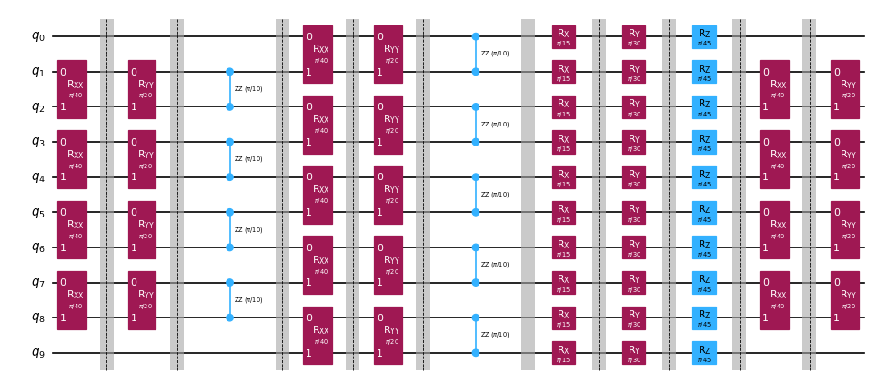

import TutorialFeedback from '@site/src/components/TutorialFeedback';

<OpenInLabBanner notebookPath="qiskit-addons/obp/01_getting_started.ipynb" />


Ang operator backpropagation ay isang teknik na kinabibilangan ng pag-absorb ng mga operasyon mula sa dulo ng isang quantum circuit patungo sa isang Pauli operator, sa pangkalahatan ay binabawasan ang depth ng circuit kapalit ng karagdagang mga term sa operator. Ang layunin ay mag-backpropagate hangga't maaari sa circuit nang hindi pinapayagan na lumaki nang masyadong malaki ang operator.

Isang paraan upang payagan ang mas malalim na backpropagation sa circuit, habang pinipigilan ang operator sa paglaki nang masyadong malaki, ay ang pag-truncate ng mga term na may maliliit na coefficient, sa halip na idagdag ang mga ito sa operator. Ang pag-truncate ng mga term ay maaaring magresulta sa mas kaunting mga quantum circuit na isasagawa, ngunit ang paggawa nito ay nagreresulta sa ilang error sa final na expectation value calculation na proporsyonal sa magnitude ng mga coefficient ng mga truncated na term.
Sa tutorial na ito ay magpapatupad tayo ng isang [Qiskit pattern](https://quantum.cloud.ibm.com/docs/guides/serverless#qiskit-patterns-with-quantum-serverless) para sa pag-simulate ng quantum dynamics ng isang Heisenberg spin chain gamit ang operator backpropagation:

- **Hakbang 1: I-map sa quantum problem**
    - I-map ang time-evolved Hamiltonian sa isang quantum circuit
- **Hakbang 2: I-optimize ang problema**
    - I-slice ang circuit
    - <font color="#0F62FE">I-backpropagate ang mga slice mula sa circuit patungo sa isang Pauli observable</font>
    - Pagsamahin ang natitirang mga slice sa isang single circuit
    - I-transpile ang circuit para sa backend
- **Hakbang 3: Isagawa ang mga eksperimento**
    - Kalkulahin ang expectation value gamit ang nabawasan na circuit at expanded observable na may [StatevectorEstimator](https://quantum.cloud.ibm.com/docs/api/qiskit/qiskit.primitives.StatevectorEstimator) para sa pagiging simple sa notebook na ito
- **Hakbang 4: I-reconstruct ang mga resulta**
    - N.A.

**Tandaan:** Ang Qiskit ay maluwag na naglalarawan ng mga [layer](https://quantum.cloud.ibm.com/docs/api/qiskit/qiskit.dagcircuit.DAGCircuit) bilang depth-1 partition ng circuit sa lahat ng qubit. Ginagamit ng package na ito ang terminong **slices** upang ilarawan ang mga layer ng arbitraryong depth. Ang [qiskit_addon_obp.backpropagate](https://qiskit.github.io/qiskit-addon-obp/stubs/qiskit_addon_obp.backpropagate.html) function ay idinisenyo upang i-backpropagate ang buong slice nang sabay-sabay, kaya ang pagpili kung paano i-slice ang quantum circuit ay maaaring magkaroon ng malaking epekto sa kung gaano kahusay gumaganap ang backpropagation para sa ibinigay na problema. Matututo ka ng higit pa tungkol sa **slices** sa ibaba.
## Hakbang 1: Map sa quantum problem {#step-1-map-to-quantum-problem}
### I-map ang time-evolution ng quantum Heisenberg model sa isang quantum experiment. {#map-the-time-evolution-of-a-quantum-heisenberg-model-to-a-quantum-experiment}

Ang [qiskit_addon_utils](https://qiskit.github.io/qiskit-addon-utils/) package ay nagbibigay ng ilang reusable na functionalities para sa iba't ibang layunin.

Ang [qiskit_addon_utils.problem_generators](https://qiskit.github.io/qiskit-addon-utils/stubs/qiskit_addon_utils.problem_generators.html) module nito ay nagbibigay ng mga function para bumuo ng mga Heisenberg-like Hamiltonian sa ibinigay na connectivity graph.
Ang graph na ito ay maaaring [rustworkx.PyGraph](https://www.rustworkx.org/apiref/rustworkx.PyGraph.html) o [CouplingMap](https://quantum.cloud.ibm.com/docs/api/qiskit/qiskit.transpiler.CouplingMap) na ginagawang madaling gamitin sa mga Qiskit-centric workflow.

Sa mga sumusunod, una nating bumuo ng heavy-hex `CouplingMap` kung saan tayo ay umuukit ng linear chain ng 10 qubits. Tandaan, na ang mga indices ng bagong `reduced_coupling_map` na ito ay muling zero-based.

```python
# Added by doQumentation — required packages for this notebook
!pip install -q numpy qiskit qiskit-addon-obp qiskit-addon-utils qiskit-ibm-runtime rustworkx
```

```python
from qiskit.transpiler import CouplingMap

coupling_map = CouplingMap.from_heavy_hex(3, bidirectional=False)

# Choose a 10-qubit linear chain on this coupling map
reduced_coupling_map = coupling_map.reduce([0, 13, 1, 14, 10, 16, 5, 12, 8, 18])
```

```python
from rustworkx.visualization import graphviz_draw

graphviz_draw(reduced_coupling_map.graph, method="circo")
```


Susunod, bumubuo tayo ng Pauli operator na nag-mo-modelo ng Heisenberg XYZ Hamiltonian.

$$\hat{H} = \sum_{(j,k)\in E} (J_{x} \sigma_j^{x} \sigma_{k}^{x} +
    J_{y} \sigma_j^{y} \sigma_{k}^{y} + J_{z} \sigma_j^{z} \sigma_{k}^{z}) +
    \sum_{j\in V} (h_{x} \sigma_j^{x} + h_{y} \sigma_j^{y} + h_{z} \sigma_j^{z})$$

Kung saan ang $G(V,E)$ ay ang graph ng coupling map na ibinigay.

```python
import numpy as np
from qiskit_addon_utils.problem_generators import generate_xyz_hamiltonian

# Get a qubit operator describing the Heisenberg XYZ model
hamiltonian = generate_xyz_hamiltonian(
    reduced_coupling_map,
    coupling_constants=(np.pi / 8, np.pi / 4, np.pi / 2),
    ext_magnetic_field=(np.pi / 3, np.pi / 6, np.pi / 9),
)
print(hamiltonian)
```

```text
SparsePauliOp(['IIIIIIIXXI', 'IIIIIIIYYI', 'IIIIIIIZZI', 'IIIIIXXIII', 'IIIIIYYIII', 'IIIIIZZIII', 'IIIXXIIIII', 'IIIYYIIIII', 'IIIZZIIIII', 'IXXIIIIIII', 'IYYIIIIIII', 'IZZIIIIIII', 'IIIIIIIIXX', 'IIIIIIIIYY', 'IIIIIIIIZZ', 'IIIIIIXXII', 'IIIIIIYYII', 'IIIIIIZZII', 'IIIIXXIIII', 'IIIIYYIIII', 'IIIIZZIIII', 'IIXXIIIIII', 'IIYYIIIIII', 'IIZZIIIIII', 'XXIIIIIIII', 'YYIIIIIIII', 'ZZIIIIIIII', 'IIIIIIIIIX', 'IIIIIIIIIY', 'IIIIIIIIIZ', 'IIIIIIIIXI', 'IIIIIIIIYI', 'IIIIIIIIZI', 'IIIIIIIXII', 'IIIIIIIYII', 'IIIIIIIZII', 'IIIIIIXIII', 'IIIIIIYIII', 'IIIIIIZIII', 'IIIIIXIIII', 'IIIIIYIIII', 'IIIIIZIIII', 'IIIIXIIIII', 'IIIIYIIIII', 'IIIIZIIIII', 'IIIXIIIIII', 'IIIYIIIIII', 'IIIZIIIIII', 'IIXIIIIIII', 'IIYIIIIIII', 'IIZIIIIIII', 'IXIIIIIIII', 'IYIIIIIIII', 'IZIIIIIIII', 'XIIIIIIIII', 'YIIIIIIIII', 'ZIIIIIIIII'],
              coeffs=[0.39269908+0.j, 0.78539816+0.j, 1.57079633+0.j, 0.39269908+0.j,
 0.78539816+0.j, 1.57079633+0.j, 0.39269908+0.j, 0.78539816+0.j,
 1.57079633+0.j, 0.39269908+0.j, 0.78539816+0.j, 1.57079633+0.j,
 0.39269908+0.j, 0.78539816+0.j, 1.57079633+0.j, 0.39269908+0.j,
 0.78539816+0.j, 1.57079633+0.j, 0.39269908+0.j, 0.78539816+0.j,
 1.57079633+0.j, 0.39269908+0.j, 0.78539816+0.j, 1.57079633+0.j,
 0.39269908+0.j, 0.78539816+0.j, 1.57079633+0.j, 1.04719755+0.j,
 0.52359878+0.j, 0.34906585+0.j, 1.04719755+0.j, 0.52359878+0.j,
 0.34906585+0.j, 1.04719755+0.j, 0.52359878+0.j, 0.34906585+0.j,
 1.04719755+0.j, 0.52359878+0.j, 0.34906585+0.j, 1.04719755+0.j,
 0.52359878+0.j, 0.34906585+0.j, 1.04719755+0.j, 0.52359878+0.j,
 0.34906585+0.j, 1.04719755+0.j, 0.52359878+0.j, 0.34906585+0.j,
 1.04719755+0.j, 0.52359878+0.j, 0.34906585+0.j, 1.04719755+0.j,
 0.52359878+0.j, 0.34906585+0.j, 1.04719755+0.j, 0.52359878+0.j,
 0.34906585+0.j])
```

Mula sa qubit operator, makakabuo tayo ng quantum circuit na nag-mo-modelo sa time evolution nito.
Muli, ang [qiskit_addon_utils.problem_generators](https://qiskit.github.io/qiskit-addon-utils/stubs/qiskit_addon_utils.problem_generators.html) module ay tumutulong sa atin gamit ang isang madaling function para gawin ito:

```python
from qiskit.synthesis import LieTrotter
from qiskit_addon_utils.problem_generators import generate_time_evolution_circuit

circuit = generate_time_evolution_circuit(
    hamiltonian,
    time=0.2,
    synthesis=LieTrotter(reps=2),
)
circuit.draw("mpl", style="iqp", scale=0.6)
```


## Hakbang 2: I-optimize ang problema {#step-2-optimize-the-problem}
### Gumawa ng circuit slices na i-backpropagate {#create-circuit-slices-to-backpropagate}

Tandaan, ang ``backpropagate`` function ay magba-backpropagate ng buong circuit slices nang sabay-sabay, kaya ang pagpili kung paano i-slice ay maaaring magkaroon ng epekto sa kung gaano kahusay gumaganap ang backpropagation para sa ibinigay na problema. Dito, gagrupo natin ang mga gate ng parehong type sa mga slice gamit ang [slice_by_gate_types](https://qiskit.github.io/qiskit-addon-utils/stubs/qiskit_addon_utils.slicing.slice_by_gate_types.html) function.

Para sa mas detalyadong talakayan tungkol sa circuit slicing, tingnan ang [how-to guide](https://qiskit.github.io/qiskit-addon-utils/how_tos/create_circuit_slices.html) ng [qiskit-addon-utils](https://qiskit.github.io/qiskit-addon-utils/index.html) package.

```python
from qiskit_addon_utils.slicing import slice_by_gate_types

slices = slice_by_gate_types(circuit)
print(f"Separated the circuit into {len(slices)} slices.")
```

```text
Separated the circuit into 18 slices.
```

### I-constrain kung gaano kalaki ang maaaring lumaki ng operator sa panahon ng backpropagation {#constrain-how-large-the-operator-may-grow-during-backpropagation}

Sa panahon ng backpropagation, ang bilang ng mga term sa operator ay sa pangkalahatan ay mabilis na lumalapit sa $4^N$, kung saan ang $N$ ay ang bilang ng mga qubit. Ang laki ng operator ay maaaring limitahan sa pamamagitan ng pagtukoy ng ``operator_budget`` kwarg ng ``backpropagate`` function, na tumatanggap ng [OperatorBudget](https://qiskit.github.io/qiskit-addon-obp/stubs/qiskit_addon_obp.utils.simplify.OperatorBudget.html) instance.

Dito tinutukoy natin na ang backpropagation ay dapat huminto kapag ang bilang ng mga qubit-wise commuting Pauli group sa operator ay lumampas sa 8.

```python
from qiskit_addon_obp.utils.simplify import OperatorBudget

op_budget = OperatorBudget(max_qwc_groups=8)
```

### I-backpropagate ang mga slice mula sa circuit {#backpropagate-slices-from-the-circuit}

Una, tutukuyin natin ang Pauli-Z observable sa qubit 0, at magba-backpropagate tayo ng mga slice mula sa time-evolution circuit hanggang ang mga term sa observable ay hindi na maipagsasama sa 8 o mas kaunting qubit-wise commuting Pauli groups.

Sa ibaba ay makikita mong nag-backpropagate tayo ng 7 slices ngunit gumamit lang ng 6 sa 8 nakalaang Pauli groups. Ipinahihiwatig nito na ang pag-backpropagate ng isa pang slice ay magdudulot na ang bilang ng mga Pauli group ay lumampas sa 8. Maaari nating i-verify na ito ang kaso sa pamamagitan ng pag-inspeksyon ng ibinalik na metadata.

```python
from qiskit.quantum_info import SparsePauliOp
from qiskit_addon_obp import backpropagate
from qiskit_addon_utils.slicing import combine_slices

# Specify a single-qubit observable
observable = SparsePauliOp("IIIIIIIIIZ")

# Backpropagate slices onto the observable
bp_obs, remaining_slices, metadata = backpropagate(observable, slices, operator_budget=op_budget)
# Recombine the slices remaining after backpropagation
bp_circuit = combine_slices(remaining_slices, include_barriers=True)

print(f"Backpropagated {metadata.num_backpropagated_slices} slices.")
print(
    f"New observable has {len(bp_obs.paulis)} terms, which can be combined into {len(bp_obs.group_commuting(qubit_wise=True))} groups."
)
print(
    f"Note that backpropagating one more slice would result in {metadata.backpropagation_history[-1].num_paulis[0]} terms "
    f"across {metadata.backpropagation_history[-1].num_qwc_groups} groups."
)
print("The remaining circuit after backpropagation looks as follows:")
bp_circuit.draw("mpl", scale=0.6)
```

```text
Backpropagated 7 slices.
New observable has 18 terms, which can be combined into 8 groups.
Note that backpropagating one more slice would result in 27 terms across 12 groups.
The remaining circuit after backpropagation looks as follows:
```



Susunod, tutukuyin natin ang parehong problema na may parehong mga constraint sa laki ng output observable. Gayunpaman, sa pagkakataong ito, nag-aalokeyt tayo ng error budget sa bawat slice gamit ang [setup_budet](https://qiskit.github.io/qiskit-addon-obp/stubs/qiskit_addon_obp.utils.truncating.setup_budget.html) function. Ang mga Pauli term na may maliliit na coefficient ay puputulin mula sa bawat slice hanggang ang error budget ay mapuno, at ang sobrang budget ay idadagdag sa budget ng sumusunod na slice.

Upang mapagana ang pag-truncate na ito, kailangan nating i-set up ang ating error budget tulad nito:

```python
from qiskit_addon_obp.utils.truncating import setup_budget

truncation_error_budget = setup_budget(max_error_per_slice=0.005)
```

Tandaan na sa pamamagitan ng pag-aalokeyt ng `5e-3` error per slice para sa truncation, kaya nating tanggalin ang 3 pang slice mula sa circuit, habang nananatili sa loob ng orihinal na badyet ng 8 commuting Pauli group sa observable. Bilang default, ginagamit ng `backpropagate` ang L1 norm ng mga truncated coefficient upang limitahan ang kabuuang error na nakukuha mula sa truncation. Para sa iba pang opsyon sumangguni sa [how-to guide on specifying the p_norm](https://qiskit.github.io/qiskit-addon-obp/how_tos/bound_error_using_p_norm.html).

Sa partikular na halimbawang ito kung saan nag-backpropagate tayo ng 10 slices, ang kabuuang truncation error ay hindi dapat lumampas sa ``(5e-3 error/slice) * (10 slices) = 5e-2``.
Para sa karagdagang talakayan tungkol sa pamamahagi ng error budget sa iyong mga slice, tingnan ang [how-to guide na ito](https://qiskit.github.io/qiskit-addon-obp/how_tos/truncate_operator_terms.html).

```python
# Run the same experiment but truncate observable terms with small coefficients
bp_obs_trunc, remaining_slices_trunc, metadata = backpropagate(
    observable, slices, operator_budget=op_budget, truncation_error_budget=truncation_error_budget
)

# Recombine the slices remaining after backpropagation
bp_circuit_trunc = combine_slices(remaining_slices_trunc, include_barriers=True)

print(f"Backpropagated {metadata.num_backpropagated_slices} slices.")
print(
    f"New observable has {len(bp_obs_trunc.paulis)} terms, which can be combined into {len(bp_obs_trunc.group_commuting(qubit_wise=True))} groups.\n"
    f"After truncation, the error in our observable is bounded by {metadata.accumulated_error(0):.3e}"
)
print(
    f"Note that backpropagating one more slice would result in {metadata.backpropagation_history[-1].num_paulis[0]} terms "
    f"across {metadata.backpropagation_history[-1].num_qwc_groups} groups."
)
print("The remaining circuit after backpropagation looks as follows:")
bp_circuit_trunc.draw("mpl", scale=0.6)
```

```text
Backpropagated 10 slices.
New observable has 19 terms, which can be combined into 8 groups.
After truncation, the error in our observable is bounded by 4.933e-02
Note that backpropagating one more slice would result in 27 terms across 13 groups.
The remaining circuit after backpropagation looks as follows:
```


### Ngayon na meron na tayong nabawasan na ansatze at pinalawak na observables, maaari na nating i-transpile ang ating mga eksperimento sa backend. {#now-that-we-have-our-reduced-ansatze-and-expanded-observables-we-can-transpile-our-experiments-to-the-backend}

Dito gagamitin natin ang 14-qubit [FakeMelbourneV2](https://quantum.cloud.ibm.com/docs/api/qiskit-ibm-runtime/fake-provider-fake-melbourne-v2) mula sa [qiskit-ibm-runtime](https://quantum.cloud.ibm.com/docs/api/qiskit-ibm-runtime) upang ipakita kung paano i-transpile sa isang QPU backend.

```python
from qiskit.transpiler.preset_passmanagers import generate_preset_pass_manager
from qiskit_ibm_runtime.fake_provider import FakeMelbourneV2

# Specify a backend and a pass manager for transpilation
backend = FakeMelbourneV2()
pm = generate_preset_pass_manager(backend=backend, optimization_level=1)

# Transpile original experiment
circuit_isa = pm.run(circuit)
observable_isa = observable.apply_layout(circuit_isa.layout)

# Transpile backpropagated experiment
bp_circuit_isa = pm.run(bp_circuit)
bp_obs_isa = bp_obs.apply_layout(bp_circuit_isa.layout)

# Transpile the backpropagated experiment with truncated observable terms
bp_circuit_trunc_isa = pm.run(bp_circuit_trunc)
bp_obs_trunc_isa = bp_obs_trunc.apply_layout(bp_circuit_trunc_isa.layout)
```

## Hakbang 3: Isagawa ang quantum experiments {#step-3-execute-quantum-experiments}
### Kalkulahin ang expectation value {#calculate-expectation-value}

Sa wakas, maaari na nating patakbuhin ang mga backpropagated experiment at ihambing sila sa buong eksperimento gamit ang noiseless [StatevectorEstimator](https://quantum.cloud.ibm.com/docs/api/qiskit/qiskit.primitives.StatevectorEstimator). Makikita natin na ang backpropagated expectation value na walang truncation ay katumbas ng exact value sa loob ng mga limitasyon ng numerical precision.

Ang expectation value sa operator na may truncated terms ay may ilang error sa antas ng ``1e-4``, na nasa loob ng inaasahang tolerance.

**Tandaan:** Gumagamit tayo ng statevector-based ``Estimator`` primitive upang ipakita ang epekto ng truncation sa output. Upang patakbuhin sa backend kung saan ang mga eksperimento ay tina-transpile sa Hakbang 2, maaaring i-import ng isa ang [EstimatorV2](https://quantum.cloud.ibm.com/docs/api/qiskit-ibm-runtime/estimator-v2) mula sa ``qiskit-ibm-runtime`` at ipasa ang backend instance sa constructor.

```python
from qiskit.primitives import StatevectorEstimator as Estimator

estimator = Estimator()

# Run the experiments using Estimator primitive
result_exact = estimator.run([(circuit_isa, observable_isa)]).result()[0].data.evs.item()
result_bp = estimator.run([(bp_circuit_isa, bp_obs_isa)]).result()[0].data.evs.item()
result_bp_trunc = (
    estimator.run([(bp_circuit_trunc_isa, bp_obs_trunc_isa)]).result()[0].data.evs.item()
)

print(f"Exact expectation value: {result_exact}")
print(f"Backpropagated expectation value: {result_bp}")
print(f"Backpropagated expectation value with truncation: {result_bp_trunc}")
print(f"    - Expected Error for truncated observable: {metadata.accumulated_error(0):.3e}")
print(f"    - Observed Error for truncated observable: {abs(result_exact - result_bp_trunc):.3e}")
```

```text
Exact expectation value: 0.8854160687717507
Backpropagated expectation value: 0.8854160687717532
Backpropagated expectation value with truncation: 0.8850236647156059
    - Expected Error for truncated observable: 4.933e-02
    - Observed Error for truncated observable: 3.924e-04
```

<TutorialFeedback />
