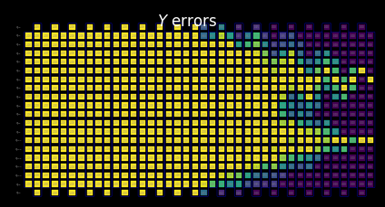
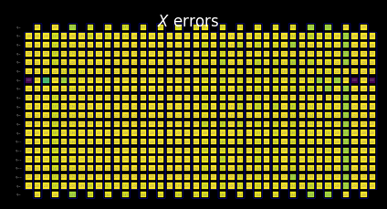

import TutorialFeedback from '@site/src/components/TutorialFeedback';

<OpenInLabBanner notebookPath="qiskit-addons/slc/01_getting_started.ipynb" />


##  Background
Ipinapakita ng tutorial na ito kung paano i-mitigate ang errors gamit ang Shaded lightcone (SLC) addon. Ang addon na ito ay isang ebolusyon ng [probabilistic error cancellation (PEC) technique](https://quantum.cloud.ibm.com/docs/guides/error-mitigation-and-suppression-techniques#probabilistic-error-cancellation-pec), kung saan natututuhan ng user ang noise ng unique layers sa isang circuit at pagkatapos ay kinakansela ang noise sa pamamagitan ng pag-aaplay ng single-qubit gates at post-processing techniques. Kung ihahambing sa iba pang methods, ang PEC ay nag-aalok ng mas matatag na bounds sa bias ng mitigated result, ngunit may mas mataas na overhead sa tuntunin ng QPU time. Sa panahon ng PEC, upang mabigyang-bayad ang attenuation ng expectation value ng noise, ang average result ay ini-rescale ng factor na $\gamma = \exp(\sum_{l,\sigma} 2\lambda_{l,\sigma})$, kung saan ang $\lambda_{l,\sigma}$ ay ang learned noise rate ng error Pauli $\sigma$ sa layer $l$ sa circuit. Ang pag-rescale na ito ay nagpapataas ng variance ng factor na $\gamma^2$, at sa gayon ay nag-mu-multiply din ng bilang ng circuit executions na kailangan sa QPU ng $\gamma^2$, na tinatawag nating sampling cost o sampling overhead. Dahil ang $\gamma$ ay lumalaki nang exponentially, ang PEC ay madalas na limitado sa shallow o few-qubit circuits. Matuto pa tungkol sa PEC sa [Probabilistic error cancellation with sparse Pauli-Lindblad models on noisy quantum processors.](https://arxiv.org/abs/2201.09866) 

Kung matutukoy natin ang errors na hindi kailangang i-mitigate, maaari nating bawasan ang sampling cost na ito nang exponential. Ang unang hakbang sa direksyon na ito ay ang pag-implementa ng locally aware error mitigation, na gumagamit ng quickly computable conventional "lightcone" upang bawasan ang PEC overhead sa pamamagitan ng pag-bound sa sensitivity ng observable sa errors sa buong circuit, na nagpapalawak ng feasibility ng PEC sa mas malalaking sukat para sa ilang problema. Ang errors sa labas ng lightcone na ito ay hindi maaaring makaapekto sa measured outcome at samakatuwid ay maaaring ibukod sa error cancellation procedure. Ang exclusion na ito ay nagpapababa ng sampling overhead, sa ilang kaso ay malaki, nang hindi nagpapakilala ng karagdagang bias. Sa partikular, para sa pagsukat ng local observable $O$ ng isang fixed-depth circuit, ang kinakailangang sampling overhead ay sa kalaunan ay pumapatag kapag in-scale ang bilang ng qubits sa circuit (tingnan ang Fig. 2b sa [Locality and Error Mitigation of Quantum Circuits.](https://arxiv.org/abs/2303.06496))

Ang Shaded lightcones (SLC) ay lumalampas pa rito, gamit ang classical simulations upang mas mahigpit na i-bound ang sensitivity sa errors sa buong circuit. Ito ay nagpapalit ng ilang QPU time para sa CPU time at binabawasan ang sampling overhead na kailangan upang i-renormalize ang bias. Sa halip na isang hard cutoff, bawat potential error sa circuit ay binibigyan ng graded "shade" na nag-uupper-bound sa susceptibility ng observable sa error na iyon. Ang refined characterization na ito ay nagpapahintulot ng mas efficient, targeted applications ng PEC na may pinababang variance, habang binibigyan ang user ng kakayahang controllably i-tune ang bias sa observable estimation. Tingnan ang [Lightcone shading for classically accelerated quantum error mitigation](https://arxiv.org/abs/2409.04401) para sa karagdagang detalye.

Ang ating workflow para sa SLC addon ay gumagamit ng bagong Samplomatic at Executor framework, na nagpapahintulot sa users na magkaroon ng mas modular control sa execution settings para sa error suppression at mitigation habang pinapanatili ang ease of use para sa advanced users. Para sa mas malalim na pag-unawa sa benepisyo ng framework na ito at ng mga pangkalahatang feature nito, sumangguni sa [Hello samplomatic](https://github.com/qiskit-community/qdc-challenges-2025/blob/main/day3_tutorials/Track_A/hello_samplomatic/Samplomatic%20-%20Hello%20World.ipynb) tutorial.

### Workflow para sa lightcone shading, noise learning, at anti-noise injection {#workflow-for-lightcone-shading-noise-learning-and-anti-noise-injection}
Para sa pag-model ng noise ng QPU, pinili nating gumamit ng sparse Pauli-Lindblad noise model na may 1- at 2-qubit Pauli error rates, locally na nabuo sa bawat qubit at edge ng device. Sa pagpiling ito, ang SLC error-mitigation workflow na ipinakita sa tutorial na ito ay ang sumusunod:

a. CPU — I-bound ang per-error impact ng 1- at 2-qubit Pauli errors

  1. Forward propagation (i-bound ang epekto sa observable). Ipropagate ang bawat error hanggang sa katapusan ng circuit at kalkulahin ang commutator nito sa observable.  
      - I-truncate ang operator terms habang nag-eevolve upang panatilihing tractable ang computation.  
      - Higit pang i-tighten ang bounds na ito sa pamamagitan ng loose back-propagation ng observable batay sa quantum speed limits.
  2. Backward propagation (i-bound ang epekto sa initial state). Ipropagate ang bawat error sa simula ng circuit at kalkulahin ang commutator nito sa initial state.

b. QPU — Matuto ng noise rates. Gamitin ang `NoiseLearner` upang i-estimate ang rates ng Pauli-Lindblad noise model.

c. CPU — I-prioritize ang mitigation

  1. I-update ang merged bounds gamit ang learned noise rates. Pagsamahin ang forward at backward bounds na nakalkula dati at i-update ang mga ito gamit ang learned noise rates.  
  2. I-rank ang noise components na i-mitigate gamit ang nakalkulang bounds at learned rates. I-prioritize ang bawat posibleng noise error batay sa estimated impact nito sa bias at sa kaugnay na gastos para itama. 

d. QPU — Mag-insert ng antinoise at patakbuhin. I-execute ang circuit ng interes na may antinoise (inverse noise) na tinukoy gamit ang `Box` annotations.

e. CPU — Mag-estimate ng observable. Kalkulahin ang expectation value, na nag-aaplay ng measurement-based post-selection upang bawasan ang non-Markovian noise impact.

### Noise learning overview
Ang noise learning ay isang karaniwang hakbang sa ilang error-mitigation methods, na isinasagawa ng [NoiseLearner](https://quantum.cloud.ibm.com/docs/en/guides/noise-learning), at maaaring makita sa ating [PEA error mitigation](https://quantum.cloud.ibm.com/docs/tutorials/probabilistic-error-amplification) tutorial, pati na rin sa ating [Propagated noise absorption (PNA) tutorial](https://github.com/qiskit-community/qdc-challenges-2025/blob/main/day3_tutorials/Track_A/pna/propagated_noise_absorption.ipynb). Sa `NoiseLearnerV3`, partikular na maaaring tukuyin ng user ang to-be-learned noise layers bilang [`CircuitInstruction`](https://quantum.cloud.ibm.com/docs/api/qiskit/qiskit.circuit.CircuitInstruction) objects, na nagpapahintulot sa users na kalkulahin ang nais na SLC noise bounds para sa bawat layer sa paraang inilarawan sa itaas. Ang learned Pauli-Lindblad model ay nagbibigay ng coefficients na gagamitin sa PEC-SLC prioritization. Ang paraan kung paano kinokolekta ang gates sa layers ay maaaring matukoy gamit ang `generate_boxing_pass_manager` at `unique_2q_instructions` convenience functions, at pagkatapos ay ipinapakain sa SLC utility function na `generate_noise_model_paulis`, tulad ng inilarawan sa Hakbang 2 sa ibaba.

| **Part 1** | **Part 2** | **Part 3** |
|-----------|-----------|-----------|
| Pauli-twirl two-qubit gate layers | Repeat identity pairs of layers and learn noise | Derive a fidelity (error for each noise channel) |
|  |  |  |

### Post-processing overview
Pagkatapos i-execute sa quantum hardware gamit ang Samplomatic at Executor framework, kino-convert natin ang ating bitstring measurements sa nais na observable value. Sa kaso ng ating mirrored Ising circuit, ideyal nating makukuha ang measured observable na 1, dahil lahat ng qubits ay dapat ideyal na bumalik sa kanilang panimulang punto na $\ket{0}$. Kapag kinakalkula ang observable value sa ating `expectation_values` function, mag-aaplay tayo ng ilang post-processing techniques na nagbabawas ng noise impact. Kabilang dito ang pag-aalis ng shots na apektado ng non-Markovian noise, readout-error mitigation, pati na rin ang pagsasaalang-alang sa mga detalye ng ating PEC implementation. Tinatalakay ang detalye sa Hakbang 4 sa ibaba.

## Mga kinakailangan {#requirements}
Bago simulan ang tutorial na ito, tiyaking naka-install mo ang sumusunod na packages:

- Qiskit IBM Runtime na may Executor primitive (`pip install "qiskit-ibm-runtime @ git+https://github.com/Qiskit/qiskit-ibm-runtime.git"`)
- Qiskit addon Shaded lightcone 0.1 (`pip install "qiskit-addon-slc~=0.1.0`")
- Qiskit addon utils (`pip install "qiskit-addon-utils~=0.3.0"`)
- Samplomatic v0.16 o higit pa(`pip install samplomatic`)
- Qiskit Visualization support (`pip install "qiskit[visualization]"`)
## Hakbang 0. Setup {#step-0-setup}
Una, i-import ang packages at functions na kailangan upang matagumpay na patakbuhin ang notebook na ito.

```python
# Added by doQumentation — required packages for this notebook
!pip install -q matplotlib numpy qiskit qiskit-addon-slc qiskit-addon-utils qiskit-ibm-runtime samplomatic
```

```python
import logging

logging.basicConfig(level=logging.INFO, format="%(asctime)s %(levelname)s %(module)s %(message)s")

# Setting this value prevents itertools.starmap deadlock on UNIX systems
from multiprocessing import set_start_method

set_start_method("spawn")

# Needed to prevent PySCF from parallelizing internally (SLC only)
%set_env OMP_NUM_THREADS=1
```

```text
env: OMP_NUM_THREADS=1
```

```python
import pickle

import numpy as np
import samplomatic
from matplotlib import pyplot as plt
from qiskit import QuantumCircuit
from qiskit.quantum_info import SparsePauliOp
from qiskit.transpiler import PassManager, generate_preset_pass_manager
from qiskit_addon_slc.bounds import (
    compute_backward_bounds,
    compute_forward_bounds,
    compute_local_scales,
    merge_bounds,
    tighten_with_speed_limit,
)
from qiskit_addon_slc.utils import generate_noise_model_paulis, map_modifier_ref_to_ref
from qiskit_addon_slc.visualization import draw_shaded_lightcone
from qiskit_addon_utils.exp_vals.expectation_values import executor_expectation_values
from qiskit_addon_utils.exp_vals.measurement_bases import get_measurement_bases
from qiskit_addon_utils.noise_management import gamma_from_noisy_boxes, trex_factors
from qiskit_addon_utils.noise_management.post_selection import PostSelector
from qiskit_addon_utils.noise_management.post_selection.transpiler.passes import (
    AddPostSelectionMeasures,
    AddSpectatorMeasures,
)
from qiskit_ibm_runtime import Executor, QiskitRuntimeService, QuantumProgram
from qiskit_ibm_runtime.noise_learner_v3 import NoiseLearnerV3
from qiskit_ibm_runtime.options import NoiseLearnerV3Options
from samplomatic.transpiler import generate_boxing_pass_manager
from samplomatic.utils import find_unique_box_instructions
```

## Hakbang 1. I-map ang problem {#step-1-map-the-problem}
Para sa kadalian ng demonstrasyon, pumili tayo ng 1D mirror Ising chain. Ang 1D Ising chain ay nagbibigay ng maayos na dense circuit structure, na convenient para sa pagpapakita ng PEC implementations. Ang mirror circuit ay nagpapadali sa pagkakaalam ng inaasahang resulta (sa madaling salita, dapat tayong sumukat ng observable na 1).

Higit pa rito, gusto nating patakbuhin ang isang mirror circuit, kaya para sa bawat gate sa ikalawang kalahati ng circuit, kailangan ng isang inverse gate sa unang kalahati. Dahil ang measured observable na **$<X_6 Z_{13}>$** ay may non-Z-basis measurements, at ang executor ay isinasaalang-alang ang nais na basis sa katapusan ng circuit, nagbibigay tayo ng `prepare_basis` function na nagpapasok ng angkop na gates sa simula ng mirror circuit. Ang detalyeng ito ay tukoy sa ating mirror-circuit demonstration. Ang `get_measurement_bases` function ay nagpapahintulot sa atin na madaling matukoy kung aling gates ang kailangan at saan i-aappend ang mga ito, pati na rin pagsubaybay sa qubit index subtleties na nagmumula sa conventions sa `box` annotation tulad ng tinalakay sa "Prepare canonical bases measurements" section.

```python
num_qubits = 20
target_obs_sparse = [("XZ", [6, 13], 1.0)]
```

```python
observable = SparsePauliOp.from_sparse_list(target_obs_sparse, num_qubits=num_qubits)
```

```python
bases_virt, reverser_virt = get_measurement_bases(observable)
```

```python
num_trotter_steps = 10
rx_angle = np.pi / 4
```

```python
def construct_ising_circuit(
    num_qubits: int, num_trotter_steps: int, rx_angle: float, barrier: bool = True
) -> QuantumCircuit:
    circuit = QuantumCircuit(num_qubits)

    for _step in range(num_trotter_steps):
        circuit.rx(rx_angle, range(num_qubits))
        if barrier:
            circuit.barrier()
        for first_qubit in (1, 2):
            for idx in range(first_qubit, num_qubits, 2):
                # equivalent to Rzz(-pi/2):
                circuit.sdg([idx - 1, idx])
                circuit.cz(idx - 1, idx)
        if barrier:
            circuit.barrier()

    return circuit

def prepare_basis(circuit: QuantumCircuit, basis: list[int]) -> QuantumCircuit:
    # basis is a list of integer values from 0 to 3. These map to the basis measurement as:
    # 0 = I; 1 = Z; 2 = X; 3 = Y
    assert len(basis) == circuit.num_qubits

    out_circ = circuit.copy_empty_like()
    for qb, bas in enumerate(basis):
        if bas in {0, 1}:
            continue
        if bas == 2:
            out_circ.h(qb)
        elif bas == 3:
            out_circ.rx(-np.pi / 2, qb)

    out_circ.barrier()
    out_circ.compose(circuit, inplace=True)
    return out_circ

def mirror_circuit(circuit: QuantumCircuit, *, inverse_first: bool = False) -> QuantumCircuit:
    mirror_circ = circuit.copy_empty_like()
    mirror_circ.compose(circuit.inverse() if inverse_first else circuit, inplace=True)
    mirror_circ.barrier()
    mirror_circ.compose(circuit if inverse_first else circuit.inverse(), inplace=True)
    mirror_circ.measure_active()
    return mirror_circ
```

```python
# Instantiate circuit
circuit = construct_ising_circuit(num_qubits, num_trotter_steps, rx_angle, barrier=False)
mirrored_circuit = mirror_circuit(circuit, inverse_first=True)
mirrored_circuit = prepare_basis(mirrored_circuit, bases_virt[0])
```

```python
mirrored_circuit.draw("mpl", fold=-1, scale=0.3, idle_wires=False, measure_arrows=False)
```


## Hakbang 2. I-optimize {#step-2-optimize}
I-ooptimize natin ang mga detalye na nauugnay sa circuit na patatakbuhin, ang observable na susukatin, at ang noise-learning parameters. Bilang panimulang punto, tinitiyak natin na nag-iinstantiate tayo ng backend na may fractional gates na naka-on bilang isang opsyon. Ang fractional gates na ito ay magpapahintulot ng mas malaking sensitivity sa ilan sa ating post-selection filtering.

```python
token = "<YOUR_TOKEN>"
instance = "<YOUR_INSTANCE>"

# This is used to retrieve shared results
shared_service = QiskitRuntimeService(
    channel="ibm_quantum_platform",
    token=token,
    instance=instance,
)

# This is used to run on real hardware
service = service = QiskitRuntimeService()
```

```text
qiskit_runtime_service._discover_account:WARNING:2025-11-10 11:19:40,108: Loading account with the given token. A saved account will not be used.
```

```python
backend = service.backend("ibm_kingston", use_fractional_gates=True)
```

Una, ita-transpile natin ang ating circuit sa ISA instructions, [tulad ng kinakailangan para sa execution sa ating QPUs](https://www.ibm.com/quantum/blog/isa-circuits). Para sa data na nakolekta sa eksperimentong ito, manu-manong pinipili natin ang ating qubits batay sa ebalwasyon ng pinakamataas na kalidad na chain.

```python
layout = [44, 45, 46, 47, 57, 67, 68, 69, 78, 89, 88, 87, 97, 107, 106, 105, 104, 103, 96, 83]
```

```python
isa_pm = generate_preset_pass_manager(backend=backend, initial_layout=layout, optimization_level=0)

isa_circuit = isa_pm.run(mirrored_circuit)
assert isa_circuit.layout.final_index_layout() == layout

isa_observable = observable.apply_layout(layout, num_qubits=isa_circuit.num_qubits)
```

```text
2025-11-10 11:19:57,810 INFO base_tasks Pass: ContainsInstruction - 0.00715 (ms)
2025-11-10 11:19:57,811 INFO base_tasks Pass: UnitarySynthesis - 0.00525 (ms)
2025-11-10 11:19:57,811 INFO base_tasks Pass: HighLevelSynthesis - 0.02599 (ms)
2025-11-10 11:19:57,811 INFO base_tasks Pass: BasisTranslator - 0.09131 (ms)
2025-11-10 11:19:57,811 INFO base_tasks Pass: SetLayout - 0.02623 (ms)
2025-11-10 11:19:57,812 INFO base_tasks Pass: FullAncillaAllocation - 0.14400 (ms)
2025-11-10 11:19:57,812 INFO base_tasks Pass: EnlargeWithAncilla - 0.06318 (ms)
2025-11-10 11:19:57,813 INFO base_tasks Pass: ApplyLayout - 0.29802 (ms)
2025-11-10 11:19:57,813 INFO base_tasks Pass: CheckMap - 0.07820 (ms)
2025-11-10 11:19:57,814 INFO base_tasks Pass: FilterOpNodes - 0.33283 (ms)
2025-11-10 11:19:57,814 INFO base_tasks Pass: UnitarySynthesis - 0.00691 (ms)
2025-11-10 11:19:57,814 INFO base_tasks Pass: HighLevelSynthesis - 0.13208 (ms)
2025-11-10 11:19:57,816 INFO base_tasks Pass: BasisTranslator - 1.00303 (ms)
2025-11-10 11:19:57,818 INFO base_tasks Pass: FoldRzzAngle - 1.78719 (ms)
2025-11-10 11:19:57,818 INFO base_tasks Pass: ContainsInstruction - 0.00691 (ms)
2025-11-10 11:19:57,818 INFO base_tasks Pass: InstructionDurationCheck - 0.00405 (ms)
```

```python
wire_order = layout + [q for q in range(isa_circuit.num_qubits) if q not in layout]
isa_circuit.draw(
    "mpl", fold=-1, scale=0.3, idle_wires=False, wire_order=wire_order, measure_arrows=False
)
```


### I-box ang circuit {#box-the-circuit}
Para sa kadalian ng implementation, gagamitin natin ang `generate_boxing_pass_manager` transpilation pass, na naglalagay ng circuit instructions sa annotated boxes. Ang mga box na ito ay malinaw na nagpapahiwatig kung saan, sa kaso ng PEC, dapat i-inject ang antinoise sa circuit. Para sa detalye sa settings, sumangguni sa [Samplomatic documentation.](https://qiskit.github.io/samplomatic/)

Tandaan na ang SLC workflow ay gumagamit ng `inject_noise_strategy="individual_modification"` sa ibang pagkakataon sa proseso dahil ito ay nagpapahintulot sa atin na natatanging tukuyin ang bawat `BoxOp` sa circuit.

Ang `find_unique_box_instructions` function ay nag-iiterate sa ibinigay na boxed circuit at tinutukoy ang mga may unique 2Q layers o measurements, para sa layunin ng noise learning at noise injection.

```python
# Box circuit with Twirl and InjectNoise annotations
boxes_pm = generate_boxing_pass_manager(
    twirling_strategy="active",
    inject_noise_strategy="individual_modification",
    inject_noise_targets="gates",
    measure_annotations="all",
)

boxed_circuit = boxes_pm.run(isa_circuit)

# Find the unique instructions (layers) from boxed circuit
unique_2q_instructions = find_unique_box_instructions(
    boxed_circuit, normalize_annotations=None, undress_boxes=True
)
```

```text
2025-11-10 11:20:01,088 INFO base_tasks Pass: RemoveBarriers - 0.02289 (ms)
2025-11-10 11:20:01,100 INFO base_tasks Pass: GroupGatesIntoBoxes - 12.38990 (ms)
2025-11-10 11:20:01,101 INFO base_tasks Pass: GroupMeasIntoBoxes - 0.47898 (ms)
2025-11-10 11:20:01,104 INFO base_tasks Pass: AddTerminalRightDressedBoxes - 2.88177 (ms)
2025-11-10 11:20:01,111 INFO base_tasks Pass: AddInjectNoise - 6.66904 (ms)
```

```python
boxed_circuit.draw(
    "mpl", fold=-1, scale=0.3, idle_wires=False, wire_order=wire_order, measure_arrows=False
)
```


### Maghanda ng canonical bases measurements {#prepare-canonical-bases-measurements}
Dahil sa kung paano nilalagyan ng label ang qubits kapag tinutukoy ang unique 2Q layers, kailangang mag-ingat ng espesyal sa pagsubaybay sa qubit ordering. Sa ibaba, ipinapakilala natin ang konsepto ng `canonical_qubits` bilang paraan upang tama na i-update ang qubit ordering kapag ibinibigay ito sa executor, bilang resulta ng kung paano nakukuha ang qubit order kapag nag-bo-box ng circuits at naghahanap ng unique instructions. Tingnan ang [Qubit ordering convention](https://qiskit.github.io/samplomatic/guides/samplex_io.html#qubit-ordering-convention) documentation para sa detalye.

```python
# Determine the canonical qubits order
meas_box = boxed_circuit.data[-1]
canonical_qubits = [
    idx for idx, qubit in enumerate(boxed_circuit.qubits) if qubit in meas_box.qubits
]

# map canonical qubit to physical (isa) qubit
c_2_p = {c: p for c, p in enumerate(canonical_qubits)}
# map physical (isa) qubit to virtual qubit (index in original circuit)
p_2_v = {p: v for v, p in enumerate(layout)}
# compute map between virtual and canonical qubit indices.
c_2_v = {c: p_2_v[p] for c, p in c_2_p.items()}

assert len(c_2_v) == num_qubits

bases_canon = [
    np.array([base_i[c_2_v[c]] for c in range(num_qubits)], dtype=np.uint8) for base_i in bases_virt
]
```


### Workflow para sa lightcone shading, noise learning, at anti-noise injection {#workflow-for-lightcone-shading-noise-learning-and-anti-noise-injection}

> **Tandaan**: Para sa implementation ng SLC-PEC sa tutorial na ito, pinapatakbo natin ang SLC bound computations **bago** matapos ang noise learning, upang ang to-be-mitigated circuit ay mapatakbo nang mas malapit sa oras na maaari sa learned noise model. Sa prinsipyo, ang workflow na ito ay maaaring higit pang mapaganda upang maisagawa nang sabay-sabay. Ibig sabihin, ang isang noise-learning job ay pinapatakbo habang, nang parallel, ang noise bounds ay ina-estimate. Para sa isang arbitrary quantum circuit, ang noise-bound computation ay maaaring mag-scale na may weakly exponential dependence. Dahil dito, maaaring matalinong gumamit ng parallelized execution kapag sinusubukang i-maximize ang efficiency ng workflow. Sa layuning ito, ipinapakita natin ito nang maikli sa pamamagitan ng pagsama ng cluster-based (128-thread) resources at pagpapakita kung paano makakamit ng mas refined na set ng bounds para sa ibinigay na circuit kapag pinilit sa pantay na compute-time limits, kumpara sa ating laptop (8 threads). Higit pa rito, bagaman hindi naka-implementa sa workflow na ito, maaari mong i-parallelize ang QPU executions para sa noise learning at noise-bound computations upang makamit ang pinaka-efficient na workflow.

#### Hulaan ang to-be-learned noise-model Paulis {#predict-to-be-learned-noise-model-paulis}

Ang `generate_noise_model_paulis` function ay dumadaan sa bawat boxed layer ng ibinigay na circuit at gumagawa ng lahat ng kaugnay na weight-one at weight-two Pauli terms, isinasaalang-alang ang qubit connectivity ng circuit, at pumipili ng terms na kaugnay ng active nodes at edges. Ang mga terminong ito ay pagkatapos ay ginagamit upang kalkulahin ang forward at backward noise bounds.

```python
noise_model_paulis = generate_noise_model_paulis(
    unique_2q_instructions, backend.coupling_map, boxed_circuit
)
```

```python
noise_model_rates = {ref: None for ref in noise_model_paulis}
```

##### a. Kalkulahin at i-tighten ang forward bounds {#a-compute-and-tighten-forward-bounds}

Ang `compute_forward_bounds` function ay sinusuri ang commutation relations sa pagitan ng gates sa bawat layer at ng nabuo na Pauli terms sa itaas sa tuntunin ng kung paano ang forward-propagation errors ay nakakaapekto sa nais na observable na $A$. Para sa gates na nag-c-commute sa Pauli terms, walang ginagawa. Para sa Clifford gates, ipinapadala ang mga ito patungo sa simula ng circuit. Para sa non-Clifford gates, ina-aproksima natin ang impluwensya nila sa target observables upang sa kalaunan ay i-prioritize para sa noise cancelation (pagkatapos mai-merge ang lahat ng bounds). Ang bound na ito ay nakakamit sa pamamagitan ng unang pag-apply ng L2 norm (sa madaling salita, ang square root ng sum of squares ng kaugnay na Pauli-term coefficients). Kapag may masyadong maraming qubit terms ang sangkot, bumabalik tayo sa mas maluwag na bound na gumagamit ng triangle inequality.
#### Laptop-level resources

```python
slc_atol = 1e-8
slc_eigval_max_qubits = 18
slc_evolution_max_terms = 1000
slc_num_processes = 8
slc_timeout = 60
```

```python
forward_bounds = compute_forward_bounds(
    boxed_circuit,
    noise_model_paulis,
    isa_observable,
    evolution_max_terms=slc_evolution_max_terms,
    eigval_max_qubits=slc_eigval_max_qubits,
    atol=slc_atol,
    num_processes=slc_num_processes,
    timeout=slc_timeout,
)
```

```text
2025-11-10 11:20:04,344 INFO forward Evolving Pauli error terms forwards through the circuit.
2025-11-10 11:20:04,344 INFO forward Modelling errors as though they happen *after* each noise layer.
2025-11-10 11:20:04,345 INFO remove_measure Removing ANY Measure operations from the provided circuit!
2025-11-10 11:20:04,453 INFO circuit_iter Noisy box 'm39'
2025-11-10 11:20:05,254 INFO circuit_iter Noisy box 'm38'
2025-11-10 11:20:05,304 INFO circuit_iter Noisy box 'm37'
2025-11-10 11:20:05,382 INFO circuit_iter Noisy box 'm36'
2025-11-10 11:20:05,467 INFO circuit_iter Noisy box 'm35'
2025-11-10 11:20:05,580 INFO circuit_iter Noisy box 'm34'
2025-11-10 11:20:05,705 INFO circuit_iter Noisy box 'm33'
2025-11-10 11:20:05,857 INFO circuit_iter Noisy box 'm32'
2025-11-10 11:20:06,034 INFO circuit_iter Noisy box 'm31'
2025-11-10 11:20:06,221 INFO circuit_iter Noisy box 'm30'
2025-11-10 11:20:06,449 INFO circuit_iter Noisy box 'm29'
2025-11-10 11:20:06,724 INFO circuit_iter Noisy box 'm28'
2025-11-10 11:20:07,628 INFO circuit_iter Noisy box 'm27'
2025-11-10 11:20:09,110 INFO circuit_iter Noisy box 'm26'
2025-11-10 11:20:11,696 INFO circuit_iter Noisy box 'm25'
2025-11-10 11:20:16,100 INFO circuit_iter Noisy box 'm24'
2025-11-10 11:20:21,781 INFO circuit_iter Noisy box 'm23'
2025-11-10 11:20:30,244 INFO circuit_iter Noisy box 'm22'
2025-11-10 11:20:40,416 INFO circuit_iter Noisy box 'm21'
2025-11-10 11:20:53,437 INFO circuit_iter Noisy box 'm20'
2025-11-10 11:21:06,038 INFO circuit_iter Noisy box 'm19'
2025-11-10 11:21:06,038 WARNING commutator_bounds Bounds computation timed out.
2025-11-10 11:21:06,039 INFO circuit_iter Noisy box 'm18'
2025-11-10 11:21:06,039 INFO circuit_iter Noisy box 'm17'
2025-11-10 11:21:06,039 INFO circuit_iter Noisy box 'm16'
2025-11-10 11:21:06,040 INFO circuit_iter Noisy box 'm15'
2025-11-10 11:21:06,040 INFO circuit_iter Noisy box 'm14'
2025-11-10 11:21:06,040 INFO circuit_iter Noisy box 'm13'
2025-11-10 11:21:06,040 INFO circuit_iter Noisy box 'm12'
2025-11-10 11:21:06,041 INFO circuit_iter Noisy box 'm11'
2025-11-10 11:21:06,041 INFO circuit_iter Noisy box 'm10'
2025-11-10 11:21:06,041 INFO circuit_iter Noisy box 'm9'
2025-11-10 11:21:06,042 INFO circuit_iter Noisy box 'm8'
2025-11-10 11:21:06,042 INFO circuit_iter Noisy box 'm7'
2025-11-10 11:21:06,042 INFO circuit_iter Noisy box 'm6'
2025-11-10 11:21:06,042 INFO circuit_iter Noisy box 'm5'
2025-11-10 11:21:06,043 INFO circuit_iter Noisy box 'm4'
2025-11-10 11:21:06,043 INFO circuit_iter Noisy box 'm3'
2025-11-10 11:21:06,043 INFO circuit_iter Noisy box 'm2'
2025-11-10 11:21:06,043 INFO circuit_iter Noisy box 'm1'
2025-11-10 11:21:06,044 INFO circuit_iter Noisy box 'm0'
```

#### I-visualize ang SLC para sa manual inspection {#visualize-the-slc-for-manual-inspection}

Maaari mong bigyang-kahulugan ang pag-uugali ng shaded bounds sa pamamagitan ng pagsusuri kung paano nakikipag-interact ang measurements at Pauli terms sa local errors. Ang mga pattern na ito ay katangi-tangi sa kicked Ising Hamiltonian time-evolution problem na ito at lumilitaw rin sa paper na [Lightcone Shading for Classically Accelerated Quantum Error Mitigation](https://arxiv.org/abs/2409.04401), na may ilang telltale features:

- Maaari nating malinaw na makilala ang dalawang cones na nagmumula sa dalawang non-identity Paulis sa observable.
- Makikita natin na ang X measurement sa qubit 6 ay nag-c-commute sa X error sa pinakakanang layer.
- Makikita natin na ang Z Pauli sa qubit 13 ay nag-c-commute sa Z error sa pinakakanang layer.
- Kapag naabot natin ang timeout na tinukoy sa itaas, ang natitirang layers sa kaliwa ay napupunan nang ganap ng trivial bounds na dalawa.

```python
for p in "XYZ":
    display(
        draw_shaded_lightcone(
            boxed_circuit,
            forward_bounds,
            noise_model_paulis,
            pauli_filter=p,
            scale=0.15,
            fold=-1,
            idle_wires=False,
            wire_order=wire_order,
            measure_arrows=False,
        )
    )
```


#### b. Kalkulahin at i-tighten ang forward bounds {#b-compute-and-tighten-forward-bounds}
Susunod nating i-tighten ang bounds gamit ang `tighten_with_speed_limit` function, na sinusubaybayan kung paano kumakalat ang observable pabalik sa circuit at gumagamit ng spread na iyon upang maglagay ng upper bounds sa epekto ng bawat noise operator, kinukuha ang mas maliit sa forward bound na nakalkula pa lamang, at sa backward-propagation bound.

```python
forward_bounds_tighter = tighten_with_speed_limit(
    forward_bounds, boxed_circuit, noise_model_paulis, isa_observable
)
```

```text
2025-11-10 11:21:08,270 INFO speed_limit Tighting bounds using information propagation speed limits
2025-11-10 11:21:08,270 INFO speed_limit Modelling errors as though they happen *after* each noise layer.
2025-11-10 11:21:08,298 INFO remove_measure Removing ANY Measure operations from the provided circuit!
2025-11-10 11:21:08,310 INFO circuit_iter Noisy box 'm39'
2025-11-10 11:21:08,314 INFO circuit_iter Noisy box 'm38'
2025-11-10 11:21:08,317 INFO circuit_iter Noisy box 'm37'
2025-11-10 11:21:08,319 INFO circuit_iter Noisy box 'm36'
2025-11-10 11:21:08,323 INFO circuit_iter Noisy box 'm35'
2025-11-10 11:21:08,325 INFO circuit_iter Noisy box 'm34'
2025-11-10 11:21:08,328 INFO circuit_iter Noisy box 'm33'
2025-11-10 11:21:08,330 INFO circuit_iter Noisy box 'm32'
2025-11-10 11:21:08,334 INFO circuit_iter Noisy box 'm31'
2025-11-10 11:21:08,336 INFO circuit_iter Noisy box 'm30'
2025-11-10 11:21:08,338 INFO circuit_iter Noisy box 'm29'
2025-11-10 11:21:08,340 INFO circuit_iter Noisy box 'm28'
2025-11-10 11:21:08,344 INFO circuit_iter Noisy box 'm27'
2025-11-10 11:21:08,346 INFO circuit_iter Noisy box 'm26'
2025-11-10 11:21:08,349 INFO circuit_iter Noisy box 'm25'
2025-11-10 11:21:08,351 INFO circuit_iter Noisy box 'm24'
2025-11-10 11:21:08,355 INFO circuit_iter Noisy box 'm23'
2025-11-10 11:21:08,357 INFO circuit_iter Noisy box 'm22'
2025-11-10 11:21:08,360 INFO circuit_iter Noisy box 'm21'
2025-11-10 11:21:08,362 INFO circuit_iter Noisy box 'm20'
2025-11-10 11:21:08,367 INFO circuit_iter Noisy box 'm19'
2025-11-10 11:21:08,369 INFO circuit_iter Noisy box 'm18'
2025-11-10 11:21:08,372 INFO circuit_iter Noisy box 'm17'
2025-11-10 11:21:08,375 INFO circuit_iter Noisy box 'm16'
2025-11-10 11:21:08,378 INFO circuit_iter Noisy box 'm15'
2025-11-10 11:21:08,380 INFO circuit_iter Noisy box 'm14'
2025-11-10 11:21:08,383 INFO circuit_iter Noisy box 'm13'
2025-11-10 11:21:08,386 INFO circuit_iter Noisy box 'm12'
2025-11-10 11:21:08,389 INFO circuit_iter Noisy box 'm11'
2025-11-10 11:21:08,391 INFO circuit_iter Noisy box 'm10'
2025-11-10 11:21:08,394 INFO circuit_iter Noisy box 'm9'
2025-11-10 11:21:08,396 INFO circuit_iter Noisy box 'm8'
2025-11-10 11:21:08,399 INFO circuit_iter Noisy box 'm7'
2025-11-10 11:21:08,401 INFO circuit_iter Noisy box 'm6'
2025-11-10 11:21:08,404 INFO circuit_iter Noisy box 'm5'
2025-11-10 11:21:08,406 INFO circuit_iter Noisy box 'm4'
2025-11-10 11:21:08,410 INFO circuit_iter Noisy box 'm3'
2025-11-10 11:21:08,412 INFO circuit_iter Noisy box 'm2'
2025-11-10 11:21:08,415 INFO circuit_iter Noisy box 'm1'
2025-11-10 11:21:08,417 INFO circuit_iter Noisy box 'm0'
```

#### I-visualize ang SLC para sa manual inspection {#visualize-the-slc-for-manual-inspection}

Maaari pa nating higit na i-tighten ang bounds sa pamamagitan ng pagsasaalang-alang sa lightcone limitation. Sa prinsipyo, nagbibigay ito sa atin ng mas maayos na transition mula sa nakalkulang bounds patungo sa trivial bounds na itinakda matapos maabot ang timeout. Dito, hindi gaanong nakikita ang epekto dahil ang lightcones ay umabot na sa gilid ng circuit. 

```python
for p in "XYZ":
    display(
        draw_shaded_lightcone(
            boxed_circuit,
            forward_bounds_tighter,
            noise_model_paulis,
            pauli_filter=p,
            scale=0.15,
            fold=-1,
            idle_wires=False,
            wire_order=wire_order,
            measure_arrows=False,
        )
    )
```





#### c. Kalkulahin ang backward bounds {#c-compute-backward-bounds}

Ang bahaging ito ng noise prediction ay sinusuri kung paano maaaring makaapekto ang error sa isang partikular na layer sa input state $\rho$. Ang `compute_backward_bounds` function ay unang nag-iinverse sa circuit, nag-aalis ng measurement gates, at pagkatapos ay nagpapatuloy sa katulad na pagsusuri tulad ng ginawa para sa forward-bound computations.

```python
backward_bounds = compute_backward_bounds(
    boxed_circuit,
    noise_model_paulis,
    evolution_max_terms=slc_evolution_max_terms,
    num_processes=slc_num_processes,
    timeout=slc_timeout,
)
```

```text
2025-11-10 11:21:10,666 INFO backward Evolving Pauli error terms backwards through the circuit.
2025-11-10 11:21:10,666 INFO backward Modelling errors as though they happen *after* each noise layer.
2025-11-10 11:21:10,667 INFO remove_measure Removing ANY Measure operations from the provided circuit!
2025-11-10 11:21:10,774 INFO circuit_iter Noisy box 'm0'
2025-11-10 11:21:11,640 INFO circuit_iter Noisy box 'm1'
2025-11-10 11:21:11,681 INFO circuit_iter Noisy box 'm2'
2025-11-10 11:21:11,867 INFO circuit_iter Noisy box 'm3'
2025-11-10 11:21:12,078 INFO circuit_iter Noisy box 'm4'
2025-11-10 11:21:12,329 INFO circuit_iter Noisy box 'm5'
2025-11-10 11:21:12,637 INFO circuit_iter Noisy box 'm6'
2025-11-10 11:21:13,110 INFO circuit_iter Noisy box 'm7'
2025-11-10 11:21:13,705 INFO circuit_iter Noisy box 'm8'
2025-11-10 11:21:14,384 INFO circuit_iter Noisy box 'm9'
2025-11-10 11:21:15,213 INFO circuit_iter Noisy box 'm10'
2025-11-10 11:21:15,946 INFO circuit_iter Noisy box 'm11'
2025-11-10 11:21:16,754 INFO circuit_iter Noisy box 'm12'
2025-11-10 11:21:17,557 INFO circuit_iter Noisy box 'm13'
2025-11-10 11:21:18,447 INFO circuit_iter Noisy box 'm14'
2025-11-10 11:21:19,453 INFO circuit_iter Noisy box 'm15'
2025-11-10 11:21:20,472 INFO circuit_iter Noisy box 'm16'
2025-11-10 11:21:21,479 INFO circuit_iter Noisy box 'm17'
2025-11-10 11:21:22,660 INFO circuit_iter Noisy box 'm18'
2025-11-10 11:21:23,705 INFO circuit_iter Noisy box 'm19'
2025-11-10 11:21:24,849 INFO circuit_iter Noisy box 'm20'
2025-11-10 11:21:26,030 INFO circuit_iter Noisy box 'm21'
2025-11-10 11:21:27,111 INFO circuit_iter Noisy box 'm22'
2025-11-10 11:21:28,354 INFO circuit_iter Noisy box 'm23'
2025-11-10 11:21:29,554 INFO circuit_iter Noisy box 'm24'
2025-11-10 11:21:30,897 INFO circuit_iter Noisy box 'm25'
2025-11-10 11:21:32,113 INFO circuit_iter Noisy box 'm26'
2025-11-10 11:21:33,622 INFO circuit_iter Noisy box 'm27'
2025-11-10 11:21:34,962 INFO circuit_iter Noisy box 'm28'
2025-11-10 11:21:36,504 INFO circuit_iter Noisy box 'm29'
2025-11-10 11:21:38,021 INFO circuit_iter Noisy box 'm30'
2025-11-10 11:21:39,750 INFO circuit_iter Noisy box 'm31'
2025-11-10 11:21:41,237 INFO circuit_iter Noisy box 'm32'
2025-11-10 11:21:42,974 INFO circuit_iter Noisy box 'm33'
2025-11-10 11:21:44,527 INFO circuit_iter Noisy box 'm34'
2025-11-10 11:21:46,535 INFO circuit_iter Noisy box 'm35'
2025-11-10 11:21:48,152 INFO circuit_iter Noisy box 'm36'
2025-11-10 11:21:50,074 INFO circuit_iter Noisy box 'm37'
2025-11-10 11:21:51,814 INFO circuit_iter Noisy box 'm38'
2025-11-10 11:21:53,943 INFO circuit_iter Noisy box 'm39'
```

#### I-visualize ang SLC para sa manual inspection {#visualize-the-slc-for-manual-inspection}

Mula sa pagkakalkula ng backward bounds, makikita natin kung paano namamahala ang istraktura ng initial state sa maagang pag-uugali ng error propagation:

- Maaari nating malinaw na makita kung paano ang Z errors ay nag-c-commute sa una sa |0⟩ initial state.
- Tanging sa qubit 6, kung saan natin ini-initialize ang +1 eigenstate ng X basis, hindi nag-c-commute ang Z error, habang nag-c-commute ang X error.

```python
for p in "XYZ":
    display(
        draw_shaded_lightcone(
            boxed_circuit,
            backward_bounds,
            noise_model_paulis,
            pauli_filter=p,
            scale=0.15,
            fold=-1,
            idle_wires=False,
            wire_order=wire_order,
            measure_arrows=False,
        )
    )
```




#### Preview ng merged bounds nang walang learned noise rates {#preview-merged-bounds-without-learned-noise-rates}

Ang `merged_bounds` function ay tinutukoy ang punto sa circuit kung saan ang pag-switch mula sa backward bounds patungo sa forward bounds ay nag-mi-minimize sa total estimated bias sa nais na observable. Ang bias na ito ay kinakalkula bilang sum ng backward-bound contributions para sa lahat ng noise locations bago ang puntong iyon, dagdag pa ang forward-bound contributions para sa lahat ng noise locations pagkatapos nito. Sa kasalukuyan, ito ay ginagawa nang uniform para sa lahat ng qubits.

> **Mahalagang Tandaan**: Ang puntong i-switch mula sa forward patungo sa backward bounds ay nakadepende sa learned noise rates.

```python
merged_bounds = merge_bounds(
    boxed_circuit,
    forward_bounds_tighter,
    backward_bounds,
    noise_model_rates,
)
```

```text
2025-11-10 11:21:58,304 WARNING merge Missing noise rates. Partitioning backward/forward commutator bounds by assuming uniform error rates.
2025-11-10 11:21:58,305 WARNING merge Optimal spacetime partitioning not implemented!Just partitioning list of noisy boxes.
2025-11-10 11:21:58,305 INFO merge Determined Box idx for partitioning to be 20.
```

### I-visualize ang SLC para sa manual inspection {#visualize-the-slc-for-manual-inspection}

Pagkatapos i-merge ang backward at tightened forward bounds, ang pag-uugali ng pinagsamang SLCs ay nagiging malinaw:

- Sinasabi sa atin ng function sa itaas na pinipili ang isang partition kung saan nagaganap ang switch mula sa backward patungo sa tightened forward bounds.
- Makikita natin sa ibaba na ang SLCs ay ngayon ay naglalaman ng partial backward at partial tightened forward bounds.

```python
for p in "XYZ":
    display(
        draw_shaded_lightcone(
            boxed_circuit,
            merged_bounds,
            noise_model_paulis,
            pauli_filter=p,
            scale=0.15,
            fold=-1,
            idle_wires=False,
            wire_order=wire_order,
            measure_arrows=False,
        )
    )
```


#### Cluster-level resources 
Dito, ipinapakita natin kung paano ang paggamit ng 128 threads sa isang cluster ay nagbibigay-daan sa atin na mag-propagate sa pamamagitan ng mas malaking bahagi ng mas malaking circuit na ito kapag limitado sa parehong compute time tulad ng laptop natin.

```python
with open("exp_data/merged_bounds_cluster.pickle", "rb") as file:
    merged_bounds_cluster = pickle.load(file)
```

```python
for p in "XYZ":
    display(
        draw_shaded_lightcone(
            boxed_circuit,
            merged_bounds_cluster,
            noise_model_paulis,
            pauli_filter=p,
            scale=0.15,
            fold=-1,
            idle_wires=False,
            wire_order=wire_order,
            measure_arrows=False,
        )
    )
```


## Hakbang 3. I-execute {#step-3-execute}
Sa seksyong ito, sisimulan natin ang bahagi ng workflow na gumagamit ng totoong quantum device. Para sa learning-based error mitigation method na ito, may dalawang hakbang dito: 

1. Matutuhan ang noise gamit ang `NoiseLeanerV3`.
2. I-execute ang isang error mitigation circuit gamit ang bagong Samplomatic at Estimator framework. 

Sa bounded errors mula sa ating quantum circuit, kailangan nating matutuhan ang kaugnay na noise rates upang i-prioritize ang ating error budget, tukuyin ang sampling overhead, at i-execute sa QPU. Higit pa rito, sa noise rate information na ito, maaari rin nating i-highlight kung paano, sa pamamagitan ng paggamit ng strong compute resources mula sa ating cluster, binabawasan natin ang sampling overhead habang pinapanatili ang parehong residual bias.
### a. Matuto ng noise rates {#a-learn-noise-rates}

Ang noise learner ay nagpapahintulot sa pag-characterize ng noise processes na nakakaapekto sa gates sa isa o higit pang circuits ng interes, batay sa Pauli-Lindblad noise model na inilarawan sa [Probabilistic error cancellation with sparse Pauli-Lindblad models on noisy quantum processors](https://arxiv.org/abs/2201.09866) paper. Ang `run()` method ay naglulunsad ng noise-learning job para sa ibinigay na unique 2-qubit layers, batay sa options na tinukoy sa noise-learner configuration. Sa options na ito, maaari mong i-adjust ang Pauli-twirling strategy, na tumutulong tiyakin na ang hardware ay maayos na inilalarawan ng Pauli-Lindblad noise model.

Ang detalye ng iyong noise model ay maaaring mag-drift sa paglipas ng panahon. Dahil dito, nagtatakda tayo ng parameter upang tiyakin na ang learned noise model ay muling kakalkulahin para sa eksperimento na mas matanda sa apat na oras. Ito ay isang rough rule-of-thumb at dapat isaalang-alang nang mabuti kapag ina-apply ito sa iyong sariling trabaho.

```python
post_selection_enabled = True
load_cached_noise_results = True
```

```python
noise_learner_options = NoiseLearnerV3Options(
    num_randomizations=64,
    shots_per_randomization=128,
    layer_pair_depths=[1, 2, 4, 8, 12, 16, 24, 32, 40, 48],
    post_selection={
        "enable": post_selection_enabled,
        "strategy": "edge",
        "x_pulse_type": "rx",
    },
)

noise_learner = NoiseLearnerV3(backend, noise_learner_options)
```

```python
if load_cached_noise_results:
    noise_learner_job = shared_service.job("d46ssf71gh7s7398k9a0")
else:
    noise_learner_job = noise_learner.run(unique_2q_instructions)
```

```python
noise_learner_result = noise_learner_job.result()
```

```python
if post_selection_enabled:
    print("Minimum fraction of shots kept for noise learning experiments: ", end="")
    print(
        f"{min([min(d.values()) for d in [nlr.metadata['post_selection']['fraction_kept'] for nlr in noise_learner_result[:2]]]):.2f}"
    )
```

```text
Minimum fraction of shots kept for noise learning experiments: 0.58
```

```python
# Get a dict mapping InjectNoise.ref to QubitSparsePaulilist
refs_2_plm = noise_learner_result.to_dict(unique_2q_instructions, require_refs=False)
```

### b.i. I-update ang merged bounds gamit ang aktwal na learned noise rates {#bi-update-merged-bounds-with-actual-learned-noise-rates}

Ngayon na natutunan na ang specific noise model, maaari nating i-apply ang learned noise rates sa predicted noise bounds at makakuha ng pinal na pagtukoy kung aling bounds ang may pinakamalaking epekto sa pag-mi-minimize ng bias.

```python
merged_bounds = merge_bounds(
    boxed_circuit,
    forward_bounds_tighter,
    backward_bounds,
    refs_2_plm,
)
```

```text
2025-11-10 11:22:03,755 WARNING merge Optimal spacetime partitioning not implemented!Just partitioning list of noisy boxes.
2025-11-10 11:22:03,756 INFO merge Determined Box idx for partitioning to be 20.
```

#### b.ii. Kalkulahin ang `local_scales` para sa hardware execution {#bii-compute-the-local-scales-for-the-hardware-execution}

Ang `compute_local_scales` ay tumitingin sa bawat posibleng noise error sa circuit at ina-estimate kung gaano kalaki ang pwedeng ma-bias ng error na iyon ang final measurement, pati na rin kung gaano kamahal itong itama. Pagkatapos ay ina-rank ang errors batay sa kung gaano sila katumbas na i-mitigate at pinipili ang subset na nagbabawas ng bias hangga't maaari, habang nananatili sa loob ng pinapayagang sampling-cost budget (o pagkamit ng nais na katumpakan). Ang resulta ay isang set ng scaling factors na nagpapahiwatig kung aling errors ang aktibong i-mi-mitigate at kung alin ang iiwan na unmitigated (`local_scales`), kasabay ng predicted total sampling cost overhead (`sampling_costs`) at remaining bias (`residual_bias_bound`).

Ang kakayahang kontrolin ang nais na natitirang bias ay isang kritikal na feature ng SLC implementation ng PEC. Samantalang sa [orihinal na implementation](https://arxiv.org/abs/2201.09866), ang sampling overhead ay laging tina-target ang zero bias, maaari nating i-tune ang kinakailangang sampling overhead na may trade-off sa expected remaining bias. Tumutulong ito na manatili ang user sa loob ng fixed sampling budget, na maaaring lalong kapaki-pakinabang kapag pasimulang nagpo-prototype ng workflow.

```python
id_map = map_modifier_ref_to_ref(boxed_circuit)
```

```python
summed_rates = 0.0
for _box_id, noise_id in id_map.items():
    learned_plm = refs_2_plm[noise_id]
    summed_rates += np.sum(learned_plm.rates)
    # print(f"{_box_id}:\tgamma = {np.exp(2 * summed_rates):1.6e}\tsampling cost = {np.exp(4 * summed_rates):1.6e}")
total_gamma = np.exp(2 * summed_rates)
print(f"Full PEC gamma={total_gamma}, sampling cost (gamma^2) = {total_gamma**2}")
```

```text
Full PEC gamma=128.56055005423153, sampling cost (gamma^2) = 16527.81503024657
```

```python
biases = []
costs = []
for bias in [0.0, *np.arange(0.001, 0.102, 0.01).tolist()]:
    _, cost_, bias_ = compute_local_scales(
        boxed_circuit,
        merged_bounds,
        refs_2_plm,
        sampling_cost_budget=np.inf,
        bias_tolerance=bias,
    )
    biases.append(bias_)
    costs.append(cost_)
```

```python
biases_cluster = []
costs_cluster = []
for bias in [0.0, *np.arange(0.001, 0.102, 0.01).tolist()]:
    _, cost_, bias_ = compute_local_scales(
        boxed_circuit,
        merged_bounds_cluster,
        refs_2_plm,
        sampling_cost_budget=np.inf,
        bias_tolerance=bias,
    )
    biases_cluster.append(bias_)
    costs_cluster.append(cost_)
```

#### Mga benepisyo ng clusters para sa pagbawas ng sampling overhead para sa isang ibinigay na classical compute time {#benefits-of-clusters-for-reducing-sampling-overhead-for-a-given-classical-compute-time}

```python
xticks = np.arange(0, 11)

fig, ax = plt.subplots()
ax.scatter([0], [total_gamma**2], marker="D", c="tab:orange", label="full PEC")
ax.plot(100 * np.array(biases), np.array(costs), "o-", c="tab:blue", label="local PEC+SLC")
ax.plot(
    100 * np.array(biases_cluster),
    np.array(costs_cluster),
    "o-",
    c="tab:green",
    label="cluster PEC+SLC",
)
ax.set_yscale("log")
ax.set_ylim([100, 50000])
ax.set_xticks(xticks, [f"{x:.1f}" for x in xticks])

ax.set_xlabel("Remaining Bias [%]")
ax.set_ylabel(r"Sampling Overhead, $\gamma^2$")
ax.grid()
ax.legend()
fig.suptitle("PEC sampling overhead reduction due to SLC")
```

```text
Text(0.5, 0.98, 'PEC sampling overhead reduction due to SLC')
```


```python
chosen_bias_thres = 0.1
```

```python
local_scales, sampling_cost, residual_bias_bound = compute_local_scales(
    boxed_circuit,
    merged_bounds_cluster,
    refs_2_plm,
    sampling_cost_budget=np.inf,
    bias_tolerance=chosen_bias_thres,
)
print(
    f"PEC+SLC sampling cost (gamma^2) = {sampling_cost} w/ remaining bias = {100 * residual_bias_bound:.1f}%"
)
```

```text
PEC+SLC sampling cost (gamma^2) = 563.1803982530477 w/ remaining bias = 9.3%
```


### c. I-execute ang circuit ng interes na may antinoise {#c-execute-the-circuit-of-interest-with-antinoise}
#### c.i. Maghanda ng template circuit gamit ang `samplex` {#ci-prepare-template-circuit-by-using-samplex}
Ang `samplex` ay isang output ng `build` method ng Samplomatic, na nag-eencode sa lahat ng impormasyong kinakailangan upang bumuo ng randomized parameters para sa `template_circuit`. Ang mga ito ay pagkatapos ay ginagamit upang i-set up ang `QuantumProgram` objects, na siyang pinapatakbo sa QPU gamit ang `Executor` primitive. Bawat `QuantumProgram` ay maaaring maglaman ng ilang items, na maaari mong isipin bilang isang pares ng `template` at `samplex`. 

Tingnan ang [Hello samplomatic](https://github.com/qiskit-community/qdc-challenges-2025/blob/main/day3_tutorials/Track_A/hello_samplomatic/Samplomatic%20-%20Hello%20World.ipynb) tutorial para sa detalye.

```python
# Build template circuit and samplex for later use with the "Executor"
template_circuit, samplex = samplomatic.build(boxed_circuit)
```

```python
# Set up postselection if it's been enabled
if post_selection_enabled:
    # Set up post selection PM (to add PS instructions)
    post_selection_pm = PassManager(
        [
            AddSpectatorMeasures(backend.coupling_map),
            AddPostSelectionMeasures(x_pulse_type="rx"),
        ]
    )
    final_template_circuit = post_selection_pm.run(template_circuit)
else:
    final_template_circuit = template_circuit
```

```text
2025-11-10 11:22:04,839 INFO base_tasks Pass: AddSpectatorMeasures - 3.41392 (ms)
2025-11-10 11:22:04,843 INFO base_tasks Pass: AddPostSelectionMeasures - 2.88510 (ms)
```

#### c.ii. I-set up ang `QuantumProgram` {#cii-set-up-the-quantumprogram}

```python
num_randomizations = 4096
shots_per_randomization = 64
chunk_size = 256
```

```python
# Set up QuantumProgram
program = QuantumProgram(shots=shots_per_randomization, noise_maps=refs_2_plm)

# no EM

# Collect up a dict of the other arguments that need to be bound to samplex_inputs
samplex_inputs = {f"noise_scales.{ref}": float(0) for ref in local_scales}
samplex_inputs |= {"basis_changes": {"basis0": bases_canon[0]}}

# Convert samplex_inputs into a dict to pass to QuantumProgram
samplex_arguments = samplex.inputs().bind(**samplex_inputs).make_broadcastable()

program.append(
    circuit=final_template_circuit,
    samplex=samplex,
    samplex_arguments=samplex_arguments,
    shape=(num_randomizations,),
    chunk_size=chunk_size,
)

# plain PEC

# Collect a dict of the other arguments that need to be bound to samplex_inputs
samplex_inputs = {f"noise_scales.{ref}": float(-1) for ref in local_scales}
samplex_inputs |= {"basis_changes": {"basis0": bases_canon[0]}}

# Convert samplex_inputs into a dict to pass to QuantumProgram
samplex_arguments = samplex.inputs().bind(**samplex_inputs).make_broadcastable()

program.append(
    circuit=final_template_circuit,
    samplex=samplex,
    samplex_arguments=samplex_arguments,
    shape=(num_randomizations,),
    chunk_size=chunk_size,
)

# PEC+SLC

# Collect a dict of the other arguments that need to be bound to samplex_inputs
samplex_inputs = {f"noise_scales.{ref}": float(-1) for ref in local_scales}
samplex_inputs |= {"basis_changes": {"basis0": bases_canon[0]}}
samplex_inputs |= {"local_scales": local_scales}

# Convert samplex_inputs into a dict to pass to QuantumProgram
samplex_arguments = samplex.inputs().bind(**samplex_inputs).make_broadcastable()

program.append(
    circuit=final_template_circuit,
    samplex=samplex,
    samplex_arguments=samplex_arguments,
    shape=(num_randomizations,),
    chunk_size=chunk_size,
)
```

#### c.iii. I-execute ang program gamit ang `Executor` primitive {#ciii-execute-program-with-the-executor-primitive}

```python
executor = Executor(backend)
```

```python
load_cached_executor_results = True
```

```python
if load_cached_executor_results:
    job_exec = shared_service.job("d46t1q6qsa9s73cb28g0")
else:
    job_exec = executor.run(program)
```

```python
results_exec = job_exec.result()
```

## Hakbang 4. I-post-process {#step-4-post-process}
Habang kinakalkula natin ang final expectation value ng interes gamit ang `expectation_values`, mag-iimplementa tayo ng ilang kapaki-pakinabang na post-processing techniques upang tiyaking nakakakuha tayo ng pinakamataas na kalidad na resulta na posible. Una, ina-apply natin ang ating [twirled readout mitigation, TREX](https://quantum.cloud.ibm.com/docs/guides/error-mitigation-and-suppression-techniques#twirled-readout-error-extinction-trex), na isinasaalang-alang ang anumang errors na nangyayari sa panahon ng readout process. Pagkatapos, inaayos natin ang errors dahil sa non-Markovian noise sa ating Heron backends gamit ang post-selection method. Sinusukat ng method na ito ang active at spectator qubits, pagkatapos ay nag-aaplay ng slow rotation sa bawat qubit, at pagkatapos ay sinusukat muli. Sa mga pagkakataong ang dalawang measurement ay hindi kinukumpirma ang flipped qubit gaya ng inaasahan, ang mga shot na ito ay itinatapon sa pamamagitan ng pag-aaplay ng `mask` mula sa `PostSelector` function. Sa loob ng mask computation, maaaring itakda ang isang specific strategy upang mag-filter batay sa single-qubit nodes o kalapit na spectator edges, na maaaring makaapekto pareho sa bilang ng shots na na-filter at sa kalidad ng mga resulta.

```python
measurement_noise_map = noise_learner_result[2].to_pauli_lindblad_map()
trex_scale_factors = trex_factors(measurement_noise_map, reverser_virt)
```

```python
post_selection_strategy = "node"
```

```python
def post_process_conv(datum, steps=16, gamma=None, ps=False, trex=False):
    meas = datum["meas"]
    flips = datum["measurement_flips.meas"]
    signs = datum.get("pauli_signs", None)

    meas_basis_axis = None
    avg_axis = 0

    mask = None
    if ps and post_selection_enabled:
        # Post-select the results
        post_selector = PostSelector.from_circuit(
            circuit=final_template_circuit, coupling_map=backend.coupling_map
        )

        # Compute the ps mask for filtering results
        mask = post_selector.compute_mask(datum, strategy=post_selection_strategy)

        # Compute fraction of shots kept from post selection
        total_num_shots = num_randomizations * shots_per_randomization
        ps_ratio = np.sum(mask) * 100 / total_num_shots / len(bases_canon)
        print(
            f"With {post_selection_strategy}-based post selection ({ps_ratio:.1f}% of shots kept):"
        )

    results = []
    for i in range(steps, num_randomizations + 1, steps):
        # Compute mitigated expvals w/out postselectoion
        res = executor_expectation_values(
            meas[:i],
            reverser_virt,
            meas_basis_axis,
            avg_axis=avg_axis,
            measurement_flips=flips[:i],
            pauli_signs=signs[:i] if signs is not None else None,
            postselect_mask=mask[:i] if mask is not None else None,
            rescale_factors=trex_scale_factors if trex else None,
            gamma_factor=gamma,
        )
        results.append(res[0])
    return results
```

```python
gamma_pec = gamma_from_noisy_boxes(refs_2_plm, id_map)
gamma_slc = gamma_from_noisy_boxes(refs_2_plm, id_map, local_scales)
```

```python
steps = 16
```

```python
results = {}

for label, result_idx, gamma, use_ps, use_trex in [
    ("PEC", 1, gamma_pec, True, True),
    ("PEC+SLC", 2, gamma_slc, True, True),
    ("Unmitigated", 0, None, False, False),
]:
    res = post_process_conv(
        results_exec[result_idx], steps=steps, gamma=gamma, ps=use_ps, trex=use_trex
    )
    results[label] = res
```

```text
With node-based post selection (27.0% of shots kept):
With node-based post selection (26.8% of shots kept):
```

Mula sa pagsusuri ng experimental results, maaari nating direktang ihambing ang pag-uugali ng iba't ibang approaches: PEC, PEC na pinagsama sa SLC, at ang baseline ng unmitigated results. Ilang specific na detalyeng i-highlight:

- Ang unmitigated results ay nananatili sa labas ng nais na bias range at hindi apektado ng sampling overhead.
- Dahil sa mataas na sampling cost na nakalkula sa itaas (~10k), ang PEC lamang ay hindi nag-co-converge sa loob ng mga limitasyon ng randomization na ginamit.
- Ang PEC + SLC, sa kabaligtaran, nag-co-converge nang mas mabilis.
- Ang error bounds ay bumabagsak din nang mas mabilis para sa PEC + SLC kaysa sa plain PEC.

```python
fig, ax = plt.subplots(1, 1, figsize=(12, 6))

ax.axhline(1.0, color="black", label="Exact")
ax.fill_between([-50, 4100], -10, 0, color="grey", alpha=0.25, label="Unphysical")
ax.fill_between([-50, 4100], 1, 10, color="grey", alpha=0.25)
ax.fill_between([-50, 4100], 0.9, 1.1, color="red", alpha=0.25, label="10% bias")

for label, res in results.items():
    ax.errorbar(
        list(range(steps, num_randomizations + 1, steps)),
        [r[0] for r in res],
        yerr=[r[1] for r in res],
        alpha=0.75,
        marker="o",
        linestyle="",
        markerfacecolor="none",
        label=label,
    )

ax.set_ylabel(r"$\langle X_{6}Z_{13}\rangle$")
ax.set_xlabel("# randomizations")
ax.grid()

ax.legend(ncols=2)
ax.set_ylim([-0.1, 2.0])
ax.set_xlim([-50, 4100])
```

```text
(-50.0, 4100.0)
```


<TutorialFeedback />
