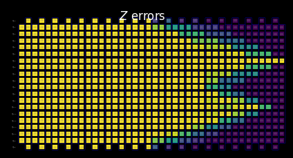

{/* doqumentation-source-hash: d7518943 */}

import TutorialFeedback from '@site/src/components/TutorialFeedback';

<OpenInLabBanner notebookPath="qiskit-addons/slc/01_getting_started.ipynb" />


## Передумови {#background}
Цей посібник демонструє, як зменшувати похибки за допомогою доповнення Shaded lightcone (SLC). Це доповнення є розвитком [техніки імовірнісного скасування помилок (PEC)](https://quantum.cloud.ibm.com/docs/guides/error-mitigation-and-suppression-techniques#probabilistic-error-cancellation-pec), у якій користувач вивчає шум унікальних шарів у Circuit, а потім нейтралізує його, застосовуючи однокубітні Gate та методи постобробки. Порівняно з іншими методами, PEC пропонує надійніші обмеження на зміщення пом'якшеного результату, але зазвичай потребує більших витрат часу QPU. Під час PEC, щоб компенсувати загасання математичного сподівання через шум, середній результат масштабується на коефіцієнт $\gamma = \exp(\sum_{l,\sigma} 2\lambda_{l,\sigma})$, де $\lambda_{l,\sigma}$ — вивчена швидкість шуму похибки Паулі $\sigma$ у шарі $l$ Circuit. Це масштабування збільшує дисперсію на коефіцієнт $\gamma^2$ і, таким чином, також множить кількість необхідних запусків Circuit на QPU на $\gamma^2$, що ми називаємо вартістю вибірки або накладними витратами вибірки. Оскільки $\gamma$ зростає експоненційно, PEC часто обмежується неглибокими або малокубітними Circuit. Дізнайся більше про PEC у [Probabilistic error cancellation with sparse Pauli-Lindblad models on noisy quantum processors.](https://arxiv.org/abs/2201.09866) 

Якщо ми можемо визначити помилки, які не потребують пом'якшення, ми можемо експоненційно зменшити вартість вибірки. Перший крок у цьому напрямку — реалізація локально обізнаного пом'якшення помилок, яке використовує швидко обчислюваний класичний «світловий конус» для зменшення накладних витрат PEC шляхом обмеження чутливості спостережуваної величини до помилок у всьому Circuit, розширюючи можливості PEC для більших масштабів деяких задач. Помилки поза межами цього світлового конуса не можуть вплинути на вимірюваний результат і тому можуть бути виключені з процедури скасування помилок. Це виключення зменшує накладні витрати вибірки — в деяких випадках суттєво — без введення додаткового зміщення. Зокрема, для вимірювання локальної спостережуваної $O$ Circuit фіксованої глибини, необхідні накладні витрати вибірки врешті-решт виходять на плато при масштабуванні кількості Qubit у Circuit (див. мал. 2b у [Locality and Error Mitigation of Quantum Circuits.](https://arxiv.org/abs/2303.06496))

Затінені світлові конуси (SLC) йдуть далі, використовуючи класичне моделювання для більш точного обмеження чутливості до помилок у всьому Circuit. Це обмінює деякий час QPU на час ЦПУ і зменшує накладні витрати вибірки, необхідні для ренормалізації зміщення. Замість жорсткого відсічення, кожній потенційній помилці в Circuit призначається градуйована «тінь», яка обмежує зверху сприйнятливість спостережуваної величини до цієї помилки. Це уточнене характеризування дозволяє більш ефективно і цілеспрямовано застосовувати PEC зі зниженою дисперсією, надаючи користувачеві можливість керовано регулювати зміщення в оцінці спостережуваної величини. Дивись [Lightcone shading for classically accelerated quantum error mitigation](https://arxiv.org/abs/2409.04401) для отримання додаткових відомостей.

Наш робочий процес для доповнення SLC використовує новий фреймворк Samplomatic і Executor, що дозволяє користувачам більш модульно керувати налаштуваннями виконання для придушення та пом'якшення помилок, зберігаючи при цьому простоту використання для досвідчених користувачів. Для глибшого розуміння переваг цього фреймворку та його загальних можливостей зверни увагу на посібник [Hello samplomatic](https://github.com/qiskit-community/qdc-challenges-2025/blob/main/day3_tutorials/Track_A/hello_samplomatic/Samplomatic%20-%20Hello%20World.ipynb).

### Робочий процес для затінення світлового конуса, вивчення шуму та введення антишуму {#workflow-for-lightcone-shading-noise-learning-and-anti-noise-injection}
Для моделювання шуму QPU ми обрали розріджену шумову модель Паулі-Ліндблада з однокубітними та двокубітними швидкостями похибок Паулі, що локально генеруються на кожному Qubit та ребрі пристрою. З цим вибором, представлений у цьому посібнику робочий процес пом'якшення помилок SLC виглядає так:

a. ЦПУ — Оцінка впливу кожної похибки однокубітних і двокубітних помилок Паулі

  1. Пряме поширення (оцінка впливу на спостережувану величину). Поширення кожної похибки до кінця Circuit і обчислення її комутатора зі спостережуваною величиною.  
      - Відсічення операторних термів під час еволюції для збереження обчислювальної ефективності.  
      - Подальше уточнення цих меж за допомогою нестрогого зворотного поширення спостережуваної величини на основі квантових обмежень швидкості.
  2. Зворотне поширення (оцінка впливу на початковий стан). Поширення кожної похибки до початку Circuit і обчислення її комутатора з початковим станом.

b. QPU — Вивчення швидкостей шуму. Використання `NoiseLearner` для оцінки швидкостей шумової моделі Паулі-Ліндблада.

c. ЦПУ — Пріоритизація пом'якшення

  1. Оновлення об'єднаних меж із вивченими швидкостями шуму. Об'єднання прямих і зворотних меж, обчислених раніше, та їх оновлення з вивченими швидкостями шуму.  
  2. Ранжування шумових компонентів для пом'якшення з використанням обчислених меж і вивчених швидкостей. Пріоритизація кожної можливої шумової похибки на основі оціненого впливу на зміщення та пов'язаних витрат на виправлення. 

d. QPU — Введення антишуму та запуск. Виконання Circuit з антишумом (оберненим шумом), заданим за допомогою анотацій `Box`.

e. ЦПУ — Оцінка спостережуваної величини. Обчислення математичного сподівання із застосуванням пост-відбору на основі вимірювань для зменшення впливу немарковського шуму.

### Огляд вивчення шуму {#noise-learning-overview}
Вивчення шуму — це загальний крок у кількох методах пом'якшення помилок, що виконується за допомогою [NoiseLearner](https://quantum.cloud.ibm.com/docs/en/guides/noise-learning), і його можна побачити в наших посібниках із [пом'якшення помилок методом PEA](https://quantum.cloud.ibm.com/docs/tutorials/probabilistic-error-amplification) і [поглиненого поширеного шуму (PNA)](https://github.com/qiskit-community/qdc-challenges-2025/blob/main/day3_tutorials/Track_A/pna/propagated_noise_absorption.ipynb). У `NoiseLearnerV3` користувач може конкретно ідентифікувати шумові шари, що підлягають вивченню, як об'єкти [`CircuitInstruction`](https://quantum.cloud.ibm.com/docs/api/qiskit/qiskit.circuit.CircuitInstruction), що дозволяє користувачам обчислювати бажані межі шуму SLC для кожного шару у спосіб, описаний вище. Вивчена модель Паулі-Ліндблада надає коефіцієнти для використання в пріоритизації PEC-SLC. Спосіб, у який Gate об'єднуються в шари, можна визначити за допомогою зручних функцій `generate_boxing_pass_manager` і `unique_2q_instructions`, а потім передати до службової функції SLC `generate_noise_model_paulis`, як описано в Кроці 2 нижче.

| **Частина 1** | **Частина 2** | **Частина 3** |
|-----------|-----------|-----------|
| Паулівське скручування двокубітних шарів Gate | Повторення пар тотожних шарів і вивчення шуму | Виведення точності (похибки для кожного шумового каналу) |
|  |  |  |

### Огляд постобробки {#post-processing-overview}
Після виконання на квантовому обладнанні за допомогою фреймворку Samplomatic і Executor ми перетворюємо наші вимірювання бітових рядків на бажане значення спостережуваної величини. У випадку нашого дзеркального ланцюга Ізінга ми в ідеалі отримаємо виміряну спостережувану величину 1, оскільки всі Qubit мають в ідеалі повернутися у свій початковий стан $\ket{0}$. При обчисленні значення спостережуваної величини за допомогою нашої функції `expectation_values` ми застосуємо кілька методів постобробки, що зменшують вплив шуму. Це включає видалення вибірок, що зазнали впливу немарковського шуму, пом'якшення помилок зчитування, а також урахування деталей нашої реалізації PEC. Подробиці обговорюються в Кроці 4 нижче.
## Вимоги {#requirements}
Перш ніж розпочати цей посібник, переконайся, що встановлено такі пакети:

- Qiskit IBM Runtime з примітивом Executor (`pip install "qiskit-ibm-runtime @ git+https://github.com/Qiskit/qiskit-ibm-runtime.git"`)
- Qiskit addon Shaded lightcone 0.1 (`pip install "qiskit-addon-slc~=0.1.0`")
- Qiskit addon utils (`pip install "qiskit-addon-utils~=0.3.0"`)
- Samplomatic v0.16 або новіший(`pip install samplomatic`)
- Підтримка візуалізації Qiskit (`pip install "qiskit[visualization]"`)
## Крок 0. Налаштування {#step-0-setup}
Спочатку імпортуй пакети та функції, необхідні для успішного виконання цього ноутбука.

```python
# Added by doQumentation — required packages for this notebook
!pip install -q matplotlib numpy qiskit qiskit-addon-slc qiskit-addon-utils qiskit-ibm-runtime samplomatic
```

```python
import logging

logging.basicConfig(level=logging.INFO, format="%(asctime)s %(levelname)s %(module)s %(message)s")

# Setting this value prevents itertools.starmap deadlock on UNIX systems
from multiprocessing import set_start_method

set_start_method("spawn")

# Needed to prevent PySCF from parallelizing internally (SLC only)
%set_env OMP_NUM_THREADS=1
```

```text
env: OMP_NUM_THREADS=1
```

```python
import pickle

import numpy as np
import samplomatic
from matplotlib import pyplot as plt
from qiskit import QuantumCircuit
from qiskit.quantum_info import SparsePauliOp
from qiskit.transpiler import PassManager, generate_preset_pass_manager
from qiskit_addon_slc.bounds import (
    compute_backward_bounds,
    compute_forward_bounds,
    compute_local_scales,
    merge_bounds,
    tighten_with_speed_limit,
)
from qiskit_addon_slc.utils import generate_noise_model_paulis, map_modifier_ref_to_ref
from qiskit_addon_slc.visualization import draw_shaded_lightcone
from qiskit_addon_utils.exp_vals.expectation_values import executor_expectation_values
from qiskit_addon_utils.exp_vals.measurement_bases import get_measurement_bases
from qiskit_addon_utils.noise_management import gamma_from_noisy_boxes, trex_factors
from qiskit_addon_utils.noise_management.post_selection import PostSelector
from qiskit_addon_utils.noise_management.post_selection.transpiler.passes import (
    AddPostSelectionMeasures,
    AddSpectatorMeasures,
)
from qiskit_ibm_runtime import Executor, QiskitRuntimeService, QuantumProgram
from qiskit_ibm_runtime.noise_learner_v3 import NoiseLearnerV3
from qiskit_ibm_runtime.options import NoiseLearnerV3Options
from samplomatic.transpiler import generate_boxing_pass_manager
from samplomatic.utils import find_unique_box_instructions
```
## Крок 1. Формулювання задачі {#step-1-map-the-problem}
Для простоти демонстрації ми обираємо одновимірний дзеркальний ланцюжок Ізінга. Одновимірний ланцюжок Ізінга дає зручно щільну структуру схеми, що зручно для демонстрації реалізацій PEC. Дзеркальна схема дозволяє легко дізнатися очікуваний результат (а саме, ми маємо виміряти спостережувану величину 1).

Крім того, ми хочемо запустити дзеркальну схему, тому для кожного гейту в другій половині схеми має бути інверсний гейт у першій половині. Оскільки вимірювана спостережувана **$<X_6 Z_{13}>$** має вимірювання не в Z-базисі, а executor враховує бажаний базис наприкінці схеми, ми надаємо функцію `prepare_basis`, яка вставляє відповідні гейти на початку дзеркальної схеми. Ця деталь є специфічною для нашої демонстрації з дзеркальною схемою. Функція `get_measurement_bases` дозволяє нам легко визначити, які гейти потрібні і куди їх додавати, а також відстежувати тонкощі індексів кубітів, що виникають із конвенцій анотації `box`, як обговорюється в розділі «Підготовка канонічних вимірювань базисів».

```python
num_qubits = 20
target_obs_sparse = [("XZ", [6, 13], 1.0)]
```

```python
observable = SparsePauliOp.from_sparse_list(target_obs_sparse, num_qubits=num_qubits)
```

```python
bases_virt, reverser_virt = get_measurement_bases(observable)
```

```python
num_trotter_steps = 10
rx_angle = np.pi / 4
```

```python
def construct_ising_circuit(
    num_qubits: int, num_trotter_steps: int, rx_angle: float, barrier: bool = True
) -> QuantumCircuit:
    circuit = QuantumCircuit(num_qubits)

    for _step in range(num_trotter_steps):
        circuit.rx(rx_angle, range(num_qubits))
        if barrier:
            circuit.barrier()
        for first_qubit in (1, 2):
            for idx in range(first_qubit, num_qubits, 2):
                # equivalent to Rzz(-pi/2):
                circuit.sdg([idx - 1, idx])
                circuit.cz(idx - 1, idx)
        if barrier:
            circuit.barrier()

    return circuit

def prepare_basis(circuit: QuantumCircuit, basis: list[int]) -> QuantumCircuit:
    # basis is a list of integer values from 0 to 3. These map to the basis measurement as:
    # 0 = I; 1 = Z; 2 = X; 3 = Y
    assert len(basis) == circuit.num_qubits

    out_circ = circuit.copy_empty_like()
    for qb, bas in enumerate(basis):
        if bas in {0, 1}:
            continue
        if bas == 2:
            out_circ.h(qb)
        elif bas == 3:
            out_circ.rx(-np.pi / 2, qb)

    out_circ.barrier()
    out_circ.compose(circuit, inplace=True)
    return out_circ

def mirror_circuit(circuit: QuantumCircuit, *, inverse_first: bool = False) -> QuantumCircuit:
    mirror_circ = circuit.copy_empty_like()
    mirror_circ.compose(circuit.inverse() if inverse_first else circuit, inplace=True)
    mirror_circ.barrier()
    mirror_circ.compose(circuit if inverse_first else circuit.inverse(), inplace=True)
    mirror_circ.measure_active()
    return mirror_circ
```

```python
# Instantiate circuit
circuit = construct_ising_circuit(num_qubits, num_trotter_steps, rx_angle, barrier=False)
mirrored_circuit = mirror_circuit(circuit, inverse_first=True)
mirrored_circuit = prepare_basis(mirrored_circuit, bases_virt[0])
```

```python
mirrored_circuit.draw("mpl", fold=-1, scale=0.3, idle_wires=False, measure_arrows=False)
```


## Крок 2. Оптимізація {#step-2-optimize}
Ми оптимізуємо деталі, пов'язані з Circuit, який треба запустити, observable, яке треба виміряти, та параметрами навчання шуму. Для початку переконаємось, що інстанціюємо Backend із увімкненими дробовими вентилями як опцією. Ці дробові Gate дозволять досягти більшої чутливості в деяких наших фільтрах пост-відбору.

```python
token = "<YOUR_TOKEN>"
instance = "<YOUR_INSTANCE>"

# This is used to retrieve shared results
shared_service = QiskitRuntimeService(
    channel="ibm_quantum_platform",
    token=token,
    instance=instance,
)

# This is used to run on real hardware
service = service = QiskitRuntimeService()
```

```text
qiskit_runtime_service._discover_account:WARNING:2025-11-10 11:19:40,108: Loading account with the given token. A saved account will not be used.
```

```python
backend = service.backend("ibm_kingston", use_fractional_gates=True)
```

Спочатку ми транспілюємо наш Circuit до інструкцій ISA, [як вимагається для виконання на наших QPU](https://www.ibm.com/quantum/blog/isa-circuits). Для даних, зібраних у цьому експерименті, ми вручну вибираємо кубіти на основі оцінки найякіснішого ланцюжка.

```python
layout = [44, 45, 46, 47, 57, 67, 68, 69, 78, 89, 88, 87, 97, 107, 106, 105, 104, 103, 96, 83]
```

```python
isa_pm = generate_preset_pass_manager(backend=backend, initial_layout=layout, optimization_level=0)

isa_circuit = isa_pm.run(mirrored_circuit)
assert isa_circuit.layout.final_index_layout() == layout

isa_observable = observable.apply_layout(layout, num_qubits=isa_circuit.num_qubits)
```

```text
2025-11-10 11:19:57,810 INFO base_tasks Pass: ContainsInstruction - 0.00715 (ms)
2025-11-10 11:19:57,811 INFO base_tasks Pass: UnitarySynthesis - 0.00525 (ms)
2025-11-10 11:19:57,811 INFO base_tasks Pass: HighLevelSynthesis - 0.02599 (ms)
2025-11-10 11:19:57,811 INFO base_tasks Pass: BasisTranslator - 0.09131 (ms)
2025-11-10 11:19:57,811 INFO base_tasks Pass: SetLayout - 0.02623 (ms)
2025-11-10 11:19:57,812 INFO base_tasks Pass: FullAncillaAllocation - 0.14400 (ms)
2025-11-10 11:19:57,812 INFO base_tasks Pass: EnlargeWithAncilla - 0.06318 (ms)
2025-11-10 11:19:57,813 INFO base_tasks Pass: ApplyLayout - 0.29802 (ms)
2025-11-10 11:19:57,813 INFO base_tasks Pass: CheckMap - 0.07820 (ms)
2025-11-10 11:19:57,814 INFO base_tasks Pass: FilterOpNodes - 0.33283 (ms)
2025-11-10 11:19:57,814 INFO base_tasks Pass: UnitarySynthesis - 0.00691 (ms)
2025-11-10 11:19:57,814 INFO base_tasks Pass: HighLevelSynthesis - 0.13208 (ms)
2025-11-10 11:19:57,816 INFO base_tasks Pass: BasisTranslator - 1.00303 (ms)
2025-11-10 11:19:57,818 INFO base_tasks Pass: FoldRzzAngle - 1.78719 (ms)
2025-11-10 11:19:57,818 INFO base_tasks Pass: ContainsInstruction - 0.00691 (ms)
2025-11-10 11:19:57,818 INFO base_tasks Pass: InstructionDurationCheck - 0.00405 (ms)
```

```python
wire_order = layout + [q for q in range(isa_circuit.num_qubits) if q not in layout]
isa_circuit.draw(
    "mpl", fold=-1, scale=0.3, idle_wires=False, wire_order=wire_order, measure_arrows=False
)
```


### Боксування Circuit {#box-the-circuit}
Для зручності реалізації ми використаємо транспіляційний прохід `generate_boxing_pass_manager`, який розміщує інструкції Circuit у анотовані бокси. Ці бокси чітко вказують, де у разі PEC слід вводити антишум у Circuit. Для деталей щодо налаштувань зверніться до [документації Samplomatic.](https://qiskit.github.io/samplomatic/)

Зауваж, що робочий процес SLC вимагає використання `inject_noise_strategy="individual_modification"` на пізнішому етапі, оскільки це дозволяє нам унікально ідентифікувати кожен `BoxOp` у Circuit.

Функція `find_unique_box_instructions` ітерує наданий Circuit із боксами та ідентифікує ті, що мають унікальні шари двокубітних операцій або вимірювань, з метою навчання шуму та ін'єкції шуму.

```python
# Box circuit with Twirl and InjectNoise annotations
boxes_pm = generate_boxing_pass_manager(
    twirling_strategy="active",
    inject_noise_strategy="individual_modification",
    inject_noise_targets="gates",
    measure_annotations="all",
)

boxed_circuit = boxes_pm.run(isa_circuit)

# Find the unique instructions (layers) from boxed circuit
unique_2q_instructions = find_unique_box_instructions(
    boxed_circuit, normalize_annotations=None, undress_boxes=True
)
```

```text
2025-11-10 11:20:01,088 INFO base_tasks Pass: RemoveBarriers - 0.02289 (ms)
2025-11-10 11:20:01,100 INFO base_tasks Pass: GroupGatesIntoBoxes - 12.38990 (ms)
2025-11-10 11:20:01,101 INFO base_tasks Pass: GroupMeasIntoBoxes - 0.47898 (ms)
2025-11-10 11:20:01,104 INFO base_tasks Pass: AddTerminalRightDressedBoxes - 2.88177 (ms)
2025-11-10 11:20:01,111 INFO base_tasks Pass: AddInjectNoise - 6.66904 (ms)
```

```python
boxed_circuit.draw(
    "mpl", fold=-1, scale=0.3, idle_wires=False, wire_order=wire_order, measure_arrows=False
)
```


### Підготовка канонічних вимірювань у базисах {#prepare-canonical-bases-measurements}
Через те, як кубіти позначаються під час ідентифікації унікальних двокубітних шарів, необхідно особливо уважно стежити за впорядкуванням кубітів. Нижче ми вводимо поняття `canonical_qubits` як засіб для належного оновлення впорядкування кубітів при наданні їх виконавцю — це є наслідком того, як порядок кубітів зберігається під час боксування Circuit та пошуку унікальних інструкцій. Дивись документацію [Qubit ordering convention](https://qiskit.github.io/samplomatic/guides/samplex_io.html#qubit-ordering-convention) для деталей.

```python
# Determine the canonical qubits order
meas_box = boxed_circuit.data[-1]
canonical_qubits = [
    idx for idx, qubit in enumerate(boxed_circuit.qubits) if qubit in meas_box.qubits
]

# map canonical qubit to physical (isa) qubit
c_2_p = {c: p for c, p in enumerate(canonical_qubits)}
# map physical (isa) qubit to virtual qubit (index in original circuit)
p_2_v = {p: v for v, p in enumerate(layout)}
# compute map between virtual and canonical qubit indices.
c_2_v = {c: p_2_v[p] for c, p in c_2_p.items()}

assert len(c_2_v) == num_qubits

bases_canon = [
    np.array([base_i[c_2_v[c]] for c in range(num_qubits)], dtype=np.uint8) for base_i in bases_virt
]
```
### Робочий процес для затінення конусу світла, навчання шуму та анти-шумового введення {#workflow-for-lightcone-shading-noise-learning-and-anti-noise-injection}

> **Примітка**: Для реалізації SLC-PEC у цьому посібнику ми виконуємо обчислення меж SLC **до** завершення навчання шуму, щоб схема, яку потрібно пом'якшити, запускалася якомога ближче за часом до навченої моделі шуму. В принципі, цей робочий процес можна додатково вдосконалити для одночасного виконання. А саме: запускається завдання навчання шуму, поки паралельно оцінюються межі шуму. Для довільної квантової схеми обчислення меж шуму може масштабуватися зі слабко показниковою залежністю. Тому може бути доцільним використовувати паралелізоване виконання, намагаючись максимізувати ефективність робочого процесу. З цією метою ми коротко демонструємо це, включаючи кластерні ресурси (128 потоків) та показуючи, як можна отримати більш уточнений набір меж для наданої схеми при обмеженні однаковим часом обчислень порівняно з нашим ноутбуком (8 потоків). Крім того, хоча в цьому робочому процесі це не реалізовано, ти можеш паралелізувати виконання QPU для навчання шуму та обчислення меж шуму, щоб досягти найефективнішого робочого процесу.

#### Передбачення Pauli-елементів моделі шуму, яку потрібно навчити {#predict-to-be-learned-noise-model-paulis}

Функція `generate_noise_model_paulis` проходить через кожен блочний шар наданої схеми та генерує всі відповідні Pauli-терми ваги один і ваги два, враховуючи зв'язність кубітів схеми та вибираючи терми, що стосуються активних вузлів і ребер. Ці терми потім використовуються для обчислення прямих і зворотних меж шуму.

```python
noise_model_paulis = generate_noise_model_paulis(
    unique_2q_instructions, backend.coupling_map, boxed_circuit
)
```

```python
noise_model_rates = {ref: None for ref in noise_model_paulis}
```

##### а. Обчислення та уточнення прямих меж {#a-compute-and-tighten-forward-bounds}

Функція `compute_forward_bounds` оцінює відношення комутації між вентилями в кожному шарі та вищезгенерованими Pauli-термами з точки зору того, як помилки прямого поширення впливають на бажаний спостережуваний $A$. Для вентилів, які комутують з Pauli-термами, нічого не робиться. Для Clifford-вентилів їх проштовхують до початку схеми. Для не-Clifford-вентилів ми апроксимуємо їх вплив на цільові спостережувані, щоб пізніше надати пріоритет скасуванню шуму (після об'єднання всіх меж). Ця межа досягається шляхом першочергового застосування норми L2 (а саме, квадратного кореня з суми квадратів відповідних коефіцієнтів Pauli-термів). Коли задіяно забагато термів кубітів, ми повертаємося до більш вільної межі, яка використовує нерівність трикутника.
#### Ресурси рівня ноутбука {#laptop-level-resources}

```python
slc_atol = 1e-8
slc_eigval_max_qubits = 18
slc_evolution_max_terms = 1000
slc_num_processes = 8
slc_timeout = 60
```

```python
forward_bounds = compute_forward_bounds(
    boxed_circuit,
    noise_model_paulis,
    isa_observable,
    evolution_max_terms=slc_evolution_max_terms,
    eigval_max_qubits=slc_eigval_max_qubits,
    atol=slc_atol,
    num_processes=slc_num_processes,
    timeout=slc_timeout,
)
```

```text
2025-11-10 11:20:04,344 INFO forward Evolving Pauli error terms forwards through the circuit.
2025-11-10 11:20:04,344 INFO forward Modelling errors as though they happen *after* each noise layer.
2025-11-10 11:20:04,345 INFO remove_measure Removing ANY Measure operations from the provided circuit!
2025-11-10 11:20:04,453 INFO circuit_iter Noisy box 'm39'
2025-11-10 11:20:05,254 INFO circuit_iter Noisy box 'm38'
2025-11-10 11:20:05,304 INFO circuit_iter Noisy box 'm37'
2025-11-10 11:20:05,382 INFO circuit_iter Noisy box 'm36'
2025-11-10 11:20:05,467 INFO circuit_iter Noisy box 'm35'
2025-11-10 11:20:05,580 INFO circuit_iter Noisy box 'm34'
2025-11-10 11:20:05,705 INFO circuit_iter Noisy box 'm33'
2025-11-10 11:20:05,857 INFO circuit_iter Noisy box 'm32'
2025-11-10 11:20:06,034 INFO circuit_iter Noisy box 'm31'
2025-11-10 11:20:06,221 INFO circuit_iter Noisy box 'm30'
2025-11-10 11:20:06,449 INFO circuit_iter Noisy box 'm29'
2025-11-10 11:20:06,724 INFO circuit_iter Noisy box 'm28'
2025-11-10 11:20:07,628 INFO circuit_iter Noisy box 'm27'
2025-11-10 11:20:09,110 INFO circuit_iter Noisy box 'm26'
2025-11-10 11:20:11,696 INFO circuit_iter Noisy box 'm25'
2025-11-10 11:20:16,100 INFO circuit_iter Noisy box 'm24'
2025-11-10 11:20:21,781 INFO circuit_iter Noisy box 'm23'
2025-11-10 11:20:30,244 INFO circuit_iter Noisy box 'm22'
2025-11-10 11:20:40,416 INFO circuit_iter Noisy box 'm21'
2025-11-10 11:20:53,437 INFO circuit_iter Noisy box 'm20'
2025-11-10 11:21:06,038 INFO circuit_iter Noisy box 'm19'
2025-11-10 11:21:06,038 WARNING commutator_bounds Bounds computation timed out.
2025-11-10 11:21:06,039 INFO circuit_iter Noisy box 'm18'
2025-11-10 11:21:06,039 INFO circuit_iter Noisy box 'm17'
2025-11-10 11:21:06,039 INFO circuit_iter Noisy box 'm16'
2025-11-10 11:21:06,040 INFO circuit_iter Noisy box 'm15'
2025-11-10 11:21:06,040 INFO circuit_iter Noisy box 'm14'
2025-11-10 11:21:06,040 INFO circuit_iter Noisy box 'm13'
2025-11-10 11:21:06,040 INFO circuit_iter Noisy box 'm12'
2025-11-10 11:21:06,041 INFO circuit_iter Noisy box 'm11'
2025-11-10 11:21:06,041 INFO circuit_iter Noisy box 'm10'
2025-11-10 11:21:06,041 INFO circuit_iter Noisy box 'm9'
2025-11-10 11:21:06,042 INFO circuit_iter Noisy box 'm8'
2025-11-10 11:21:06,042 INFO circuit_iter Noisy box 'm7'
2025-11-10 11:21:06,042 INFO circuit_iter Noisy box 'm6'
2025-11-10 11:21:06,042 INFO circuit_iter Noisy box 'm5'
2025-11-10 11:21:06,043 INFO circuit_iter Noisy box 'm4'
2025-11-10 11:21:06,043 INFO circuit_iter Noisy box 'm3'
2025-11-10 11:21:06,043 INFO circuit_iter Noisy box 'm2'
2025-11-10 11:21:06,043 INFO circuit_iter Noisy box 'm1'
2025-11-10 11:21:06,044 INFO circuit_iter Noisy box 'm0'
```
#### Візуалізуй SLC для ручного огляду {#visualize-the-slc-for-manual-inspection}

Ти можеш інтерпретувати поведінку затінених меж, досліджуючи, як вимірювання та терміни Паулі взаємодіють із локальними помилками. Ці закономірності характерні для задачі часової еволюції цього kicked Ising Hamiltonian і також з'являються у статті [Lightcone Shading for Classically Accelerated Quantum Error Mitigation](https://arxiv.org/abs/2409.04401), із кількома характерними ознаками:

- Можна чітко розрізнити два конуси, що виникають із двох не-тотожних Паулі в спостережуваній величині.
- Видно, що вимірювання X на Qubit 6 комутує з помилкою X у крайньому правому шарі.
- Видно, що Паулі Z на Qubit 13 комутує з помилкою Z у крайньому правому шарі.
- Коли досягається зазначений вище тайм-аут, решта шарів ліворуч повністю заповнюється тривіальними межами, рівними двом.

```python
for p in "XYZ":
    display(
        draw_shaded_lightcone(
            boxed_circuit,
            forward_bounds,
            noise_model_paulis,
            pauli_filter=p,
            scale=0.15,
            fold=-1,
            idle_wires=False,
            wire_order=wire_order,
            measure_arrows=False,
        )
    )
```


#### b. Обчисли та звузь прямі межі {#b-compute-and-tighten-forward-bounds}
Далі ми звужуємо межі за допомогою функції `tighten_with_speed_limit`, яка відстежує, як спостережувана величина поширюється назад через схему, і використовує це поширення для встановлення верхніх меж впливу кожного оператора шуму, беручи менше із щойно обчисленої прямої межі та межі зворотного поширення.

```python
forward_bounds_tighter = tighten_with_speed_limit(
    forward_bounds, boxed_circuit, noise_model_paulis, isa_observable
)
```

```text
2025-11-10 11:21:08,270 INFO speed_limit Tighting bounds using information propagation speed limits
2025-11-10 11:21:08,270 INFO speed_limit Modelling errors as though they happen *after* each noise layer.
2025-11-10 11:21:08,298 INFO remove_measure Removing ANY Measure operations from the provided circuit!
2025-11-10 11:21:08,310 INFO circuit_iter Noisy box 'm39'
2025-11-10 11:21:08,314 INFO circuit_iter Noisy box 'm38'
2025-11-10 11:21:08,317 INFO circuit_iter Noisy box 'm37'
2025-11-10 11:21:08,319 INFO circuit_iter Noisy box 'm36'
2025-11-10 11:21:08,323 INFO circuit_iter Noisy box 'm35'
2025-11-10 11:21:08,325 INFO circuit_iter Noisy box 'm34'
2025-11-10 11:21:08,328 INFO circuit_iter Noisy box 'm33'
2025-11-10 11:21:08,330 INFO circuit_iter Noisy box 'm32'
2025-11-10 11:21:08,334 INFO circuit_iter Noisy box 'm31'
2025-11-10 11:21:08,336 INFO circuit_iter Noisy box 'm30'
2025-11-10 11:21:08,338 INFO circuit_iter Noisy box 'm29'
2025-11-10 11:21:08,340 INFO circuit_iter Noisy box 'm28'
2025-11-10 11:21:08,344 INFO circuit_iter Noisy box 'm27'
2025-11-10 11:21:08,346 INFO circuit_iter Noisy box 'm26'
2025-11-10 11:21:08,349 INFO circuit_iter Noisy box 'm25'
2025-11-10 11:21:08,351 INFO circuit_iter Noisy box 'm24'
2025-11-10 11:21:08,355 INFO circuit_iter Noisy box 'm23'
2025-11-10 11:21:08,357 INFO circuit_iter Noisy box 'm22'
2025-11-10 11:21:08,360 INFO circuit_iter Noisy box 'm21'
2025-11-10 11:21:08,362 INFO circuit_iter Noisy box 'm20'
2025-11-10 11:21:08,367 INFO circuit_iter Noisy box 'm19'
2025-11-10 11:21:08,369 INFO circuit_iter Noisy box 'm18'
2025-11-10 11:21:08,372 INFO circuit_iter Noisy box 'm17'
2025-11-10 11:21:08,375 INFO circuit_iter Noisy box 'm16'
2025-11-10 11:21:08,378 INFO circuit_iter Noisy box 'm15'
2025-11-10 11:21:08,380 INFO circuit_iter Noisy box 'm14'
2025-11-10 11:21:08,383 INFO circuit_iter Noisy box 'm13'
2025-11-10 11:21:08,386 INFO circuit_iter Noisy box 'm12'
2025-11-10 11:21:08,389 INFO circuit_iter Noisy box 'm11'
2025-11-10 11:21:08,391 INFO circuit_iter Noisy box 'm10'
2025-11-10 11:21:08,394 INFO circuit_iter Noisy box 'm9'
2025-11-10 11:21:08,396 INFO circuit_iter Noisy box 'm8'
2025-11-10 11:21:08,399 INFO circuit_iter Noisy box 'm7'
2025-11-10 11:21:08,401 INFO circuit_iter Noisy box 'm6'
2025-11-10 11:21:08,404 INFO circuit_iter Noisy box 'm5'
2025-11-10 11:21:08,406 INFO circuit_iter Noisy box 'm4'
2025-11-10 11:21:08,410 INFO circuit_iter Noisy box 'm3'
2025-11-10 11:21:08,412 INFO circuit_iter Noisy box 'm2'
2025-11-10 11:21:08,415 INFO circuit_iter Noisy box 'm1'
2025-11-10 11:21:08,417 INFO circuit_iter Noisy box 'm0'
```

#### Візуалізуй SLC для ручного огляду {#visualize-the-slc-for-manual-inspection}

Ми можемо ще більше звузити межі, враховуючи обмеження світлового конуса. В принципі, це дає нам плавніший перехід від обчислених меж до тривіальних меж, встановлених після досягнення тайм-ауту. Тут ефект не такий помітний, оскільки світлові конуси вже досягли краю схеми.

```python
for p in "XYZ":
    display(
        draw_shaded_lightcone(
            boxed_circuit,
            forward_bounds_tighter,
            noise_model_paulis,
            pauli_filter=p,
            scale=0.15,
            fold=-1,
            idle_wires=False,
            wire_order=wire_order,
            measure_arrows=False,
        )
    )
```



#### c. Обчислення зворотних меж {#c-compute-backward-bounds}

Ця частина прогнозування шуму оцінює, як помилка на певному шарі може вплинути на вхідний стан $\rho$. Функція `compute_backward_bounds` спочатку інвертує схему, видаляє Gate вимірювання, а потім виконує аналіз, аналогічний до того, що робився для обчислення прямих меж.

```python
backward_bounds = compute_backward_bounds(
    boxed_circuit,
    noise_model_paulis,
    evolution_max_terms=slc_evolution_max_terms,
    num_processes=slc_num_processes,
    timeout=slc_timeout,
)
```

```text
2025-11-10 11:21:10,666 INFO backward Evolving Pauli error terms backwards through the circuit.
2025-11-10 11:21:10,666 INFO backward Modelling errors as though they happen *after* each noise layer.
2025-11-10 11:21:10,667 INFO remove_measure Removing ANY Measure operations from the provided circuit!
2025-11-10 11:21:10,774 INFO circuit_iter Noisy box 'm0'
2025-11-10 11:21:11,640 INFO circuit_iter Noisy box 'm1'
2025-11-10 11:21:11,681 INFO circuit_iter Noisy box 'm2'
2025-11-10 11:21:11,867 INFO circuit_iter Noisy box 'm3'
2025-11-10 11:21:12,078 INFO circuit_iter Noisy box 'm4'
2025-11-10 11:21:12,329 INFO circuit_iter Noisy box 'm5'
2025-11-10 11:21:12,637 INFO circuit_iter Noisy box 'm6'
2025-11-10 11:21:13,110 INFO circuit_iter Noisy box 'm7'
2025-11-10 11:21:13,705 INFO circuit_iter Noisy box 'm8'
2025-11-10 11:21:14,384 INFO circuit_iter Noisy box 'm9'
2025-11-10 11:21:15,213 INFO circuit_iter Noisy box 'm10'
2025-11-10 11:21:15,946 INFO circuit_iter Noisy box 'm11'
2025-11-10 11:21:16,754 INFO circuit_iter Noisy box 'm12'
2025-11-10 11:21:17,557 INFO circuit_iter Noisy box 'm13'
2025-11-10 11:21:18,447 INFO circuit_iter Noisy box 'm14'
2025-11-10 11:21:19,453 INFO circuit_iter Noisy box 'm15'
2025-11-10 11:21:20,472 INFO circuit_iter Noisy box 'm16'
2025-11-10 11:21:21,479 INFO circuit_iter Noisy box 'm17'
2025-11-10 11:21:22,660 INFO circuit_iter Noisy box 'm18'
2025-11-10 11:21:23,705 INFO circuit_iter Noisy box 'm19'
2025-11-10 11:21:24,849 INFO circuit_iter Noisy box 'm20'
2025-11-10 11:21:26,030 INFO circuit_iter Noisy box 'm21'
2025-11-10 11:21:27,111 INFO circuit_iter Noisy box 'm22'
2025-11-10 11:21:28,354 INFO circuit_iter Noisy box 'm23'
2025-11-10 11:21:29,554 INFO circuit_iter Noisy box 'm24'
2025-11-10 11:21:30,897 INFO circuit_iter Noisy box 'm25'
2025-11-10 11:21:32,113 INFO circuit_iter Noisy box 'm26'
2025-11-10 11:21:33,622 INFO circuit_iter Noisy box 'm27'
2025-11-10 11:21:34,962 INFO circuit_iter Noisy box 'm28'
2025-11-10 11:21:36,504 INFO circuit_iter Noisy box 'm29'
2025-11-10 11:21:38,021 INFO circuit_iter Noisy box 'm30'
2025-11-10 11:21:39,750 INFO circuit_iter Noisy box 'm31'
2025-11-10 11:21:41,237 INFO circuit_iter Noisy box 'm32'
2025-11-10 11:21:42,974 INFO circuit_iter Noisy box 'm33'
2025-11-10 11:21:44,527 INFO circuit_iter Noisy box 'm34'
2025-11-10 11:21:46,535 INFO circuit_iter Noisy box 'm35'
2025-11-10 11:21:48,152 INFO circuit_iter Noisy box 'm36'
2025-11-10 11:21:50,074 INFO circuit_iter Noisy box 'm37'
2025-11-10 11:21:51,814 INFO circuit_iter Noisy box 'm38'
2025-11-10 11:21:53,943 INFO circuit_iter Noisy box 'm39'
```

#### Візуалізація SLC для ручного огляду {#visualize-the-slc-for-manual-inspection}

З обчислення зворотних меж можна побачити, як структура початкового стану визначає ранню поведінку поширення помилок:

- Чітко видно, як Z-помилки спочатку комутують з початковим станом |0⟩.
- Лише на Qubit 6, де ми ініціалізуємо власний стан +1 базису X, Z-помилка не комутує, тоді як X-помилка комутує.

```python
for p in "XYZ":
    display(
        draw_shaded_lightcone(
            boxed_circuit,
            backward_bounds,
            noise_model_paulis,
            pauli_filter=p,
            scale=0.15,
            fold=-1,
            idle_wires=False,
            wire_order=wire_order,
            measure_arrows=False,
        )
    )
```


#### Попередній перегляд об'єднаних меж без вивчених рівнів шуму {#preview-merged-bounds-without-learned-noise-rates}

Функція `merged_bounds` визначає точку в схемі, де перехід від зворотних меж до прямих мінімізує загальне розрахункове зміщення на бажаному спостережуваному. Це зміщення обчислюється як сума внесків зворотних меж для всіх місць шуму перед цією точкою плюс внески прямих меж для всіх місць шуму після неї. Наразі це виконується рівномірно для всіх Qubit.

> **Важлива примітка**: Точка переходу від прямих до зворотних меж залежить від вивчених рівнів шуму.

```python
merged_bounds = merge_bounds(
    boxed_circuit,
    forward_bounds_tighter,
    backward_bounds,
    noise_model_rates,
)
```

```text
2025-11-10 11:21:58,304 WARNING merge Missing noise rates. Partitioning backward/forward commutator bounds by assuming uniform error rates.
2025-11-10 11:21:58,305 WARNING merge Optimal spacetime partitioning not implemented!Just partitioning list of noisy boxes.
2025-11-10 11:21:58,305 INFO merge Determined Box idx for partitioning to be 20.
```
### Візуалізуй SLC для ручного огляду {#visualize-the-slc-for-manual-inspection}

Після об'єднання зворотних і звужених прямих меж поведінка комбінованих SLC стає зрозумілою:

- Наведена вище функція повідомляє нас про те, що обрано розділення, в якому відбувається перехід від зворотних до звужених прямих меж.
- Нижче ми бачимо, що SLC тепер містять частково зворотні та частково звужені прямі межі.

```python
for p in "XYZ":
    display(
        draw_shaded_lightcone(
            boxed_circuit,
            merged_bounds,
            noise_model_paulis,
            pauli_filter=p,
            scale=0.15,
            fold=-1,
            idle_wires=False,
            wire_order=wire_order,
            measure_arrows=False,
        )
    )
```


#### Ресурси рівня кластера {#cluster-level-resources}
Тут ми демонструємо, як використання 128 потоків на кластері дозволяє нам обробити більшу частину цього більшого Circuit при обмеженні тим самим обчислювальним часом, що й на ноутбуці.

```python
with open("exp_data/merged_bounds_cluster.pickle", "rb") as file:
    merged_bounds_cluster = pickle.load(file)
```

```python
for p in "XYZ":
    display(
        draw_shaded_lightcone(
            boxed_circuit,
            merged_bounds_cluster,
            noise_model_paulis,
            pauli_filter=p,
            scale=0.15,
            fold=-1,
            idle_wires=False,
            wire_order=wire_order,
            measure_arrows=False,
        )
    )
```


## Крок 3. Виконання {#step-3-execute}
У цьому розділі починається частина робочого процесу, що використовує реальний квантовий пристрій. Для цього методу пом'якшення помилок на основі навчання є два кроки:

1. Вивчення шуму за допомогою `NoiseLeanerV3`.
2. Виконання схеми пом'якшення помилок із новими фреймворками Samplomatic та Estimator.

Маючи обмежені помилки нашої квантової схеми, нам потрібно вивчити пов'язані рівні шуму, щоб визначити пріоритет нашого бюджету помилок, розрахувати витрати на вибірку та виконати обчислення на QPU. Крім того, маючи інформацію про рівні шуму, ми також можемо показати, як використання потужних обчислювальних ресурсів нашого кластера дозволяє скоротити витрати на вибірку, зберігаючи при цьому однаковий залишковий зсув.
### a. Вивчення рівнів шуму {#a-learn-noise-rates}

Навчальний модуль шуму дозволяє характеризувати шумові процеси, що впливають на Gates в одній або кількох схемах Circuit, що нас цікавлять, на основі шумової моделі Паулі–Ліндблада, описаної в статті [Probabilistic error cancellation with sparse Pauli-Lindblad models on noisy quantum processors](https://arxiv.org/abs/2201.09866). Метод `run()` запускає завдання з вивчення шуму для наданих унікальних двокубітних шарів на основі параметрів, зазначених у конфігурації навчального модуля шуму. У цих параметрах можна налаштувати стратегію перекручування Паулі (Pauli-twirling), що допомагає переконатися, що апаратне забезпечення добре описується шумовою моделлю Паулі–Ліндблада.

Деталі твоєї шумової моделі можуть змінюватися з часом. Тому ми встановлюємо параметр, що гарантує перерахунок вивченої шумової моделі для експериментів, старших за чотири години. Це приблизне емпіричне правило, яке слід ретельно враховувати під час застосування у власній роботі.

```python
post_selection_enabled = True
load_cached_noise_results = True
```

```python
noise_learner_options = NoiseLearnerV3Options(
    num_randomizations=64,
    shots_per_randomization=128,
    layer_pair_depths=[1, 2, 4, 8, 12, 16, 24, 32, 40, 48],
    post_selection={
        "enable": post_selection_enabled,
        "strategy": "edge",
        "x_pulse_type": "rx",
    },
)

noise_learner = NoiseLearnerV3(backend, noise_learner_options)
```

```python
if load_cached_noise_results:
    noise_learner_job = shared_service.job("d46ssf71gh7s7398k9a0")
else:
    noise_learner_job = noise_learner.run(unique_2q_instructions)
```

```python
noise_learner_result = noise_learner_job.result()
```

```python
if post_selection_enabled:
    print("Minimum fraction of shots kept for noise learning experiments: ", end="")
    print(
        f"{min([min(d.values()) for d in [nlr.metadata['post_selection']['fraction_kept'] for nlr in noise_learner_result[:2]]]):.2f}"
    )
```

```text
Minimum fraction of shots kept for noise learning experiments: 0.58
```

```python
# Get a dict mapping InjectNoise.ref to QubitSparsePaulilist
refs_2_plm = noise_learner_result.to_dict(unique_2q_instructions, require_refs=False)
```

### b.i. Оновлення об'єднаних меж із фактично вивченими рівнями шуму {#bi-update-merged-bounds-with-actual-learned-noise-rates}

Тепер, коли конкретну шумову модель вивчено, ми можемо застосувати вивчені рівні шуму до прогнозованих меж шуму та отримати остаточне визначення того, які межі найбільше впливають на мінімізацію зсуву.

```python
merged_bounds = merge_bounds(
    boxed_circuit,
    forward_bounds_tighter,
    backward_bounds,
    refs_2_plm,
)
```

```text
2025-11-10 11:22:03,755 WARNING merge Optimal spacetime partitioning not implemented!Just partitioning list of noisy boxes.
2025-11-10 11:22:03,756 INFO merge Determined Box idx for partitioning to be 20.
```

#### b.ii. Обчислення `local_scales` для виконання на апаратному забезпеченні {#bii-compute-the-local-scales-for-the-hardware-execution}

`compute_local_scales` розглядає кожну можливу шумову помилку в схемі та оцінює, наскільки ця помилка може спотворити кінцевий вимір, а також наскільки затратним буде її виправлення. Потім функція ранжує помилки за тим, наскільки доцільно їх пом'якшувати, та відбирає підмножину, що максимально зменшує зсув, залишаючись у межах дозволеного бюджету витрат на вибірку (або досягаючи бажаної точності). Результатом є набір масштабних коефіцієнтів (`local_scales`), що вказують, які помилки будуть активно пом'якшуватися, а які залишаться без пом'якшення, разом із прогнозованими загальними витратами на вибірку (`sampling_costs`) і залишковою межею зсуву (`residual_bias_bound`).

Можливість контролювати бажаний залишковий зсув є ключовою особливістю реалізації PEC у SLC. Тоді як у [оригінальній реалізації](https://arxiv.org/abs/2201.09866) витрати на вибірку завжди спрямовувалися на досягнення нульового зсуву, тут ми можемо налаштовувати необхідні витрати на вибірку з компромісом щодо очікуваного залишкового зсуву. Це допомагає користувачу залишатися в межах фіксованого бюджету вибірки, що може бути особливо корисним під час початкового прототипування робочого процесу.

```python
id_map = map_modifier_ref_to_ref(boxed_circuit)
```

```python
summed_rates = 0.0
for _box_id, noise_id in id_map.items():
    learned_plm = refs_2_plm[noise_id]
    summed_rates += np.sum(learned_plm.rates)
    # print(f"{_box_id}:\tgamma = {np.exp(2 * summed_rates):1.6e}\tsampling cost = {np.exp(4 * summed_rates):1.6e}")
total_gamma = np.exp(2 * summed_rates)
print(f"Full PEC gamma={total_gamma}, sampling cost (gamma^2) = {total_gamma**2}")
```

```text
Full PEC gamma=128.56055005423153, sampling cost (gamma^2) = 16527.81503024657
```

```python
biases = []
costs = []
for bias in [0.0, *np.arange(0.001, 0.102, 0.01).tolist()]:
    _, cost_, bias_ = compute_local_scales(
        boxed_circuit,
        merged_bounds,
        refs_2_plm,
        sampling_cost_budget=np.inf,
        bias_tolerance=bias,
    )
    biases.append(bias_)
    costs.append(cost_)
```

```python
biases_cluster = []
costs_cluster = []
for bias in [0.0, *np.arange(0.001, 0.102, 0.01).tolist()]:
    _, cost_, bias_ = compute_local_scales(
        boxed_circuit,
        merged_bounds_cluster,
        refs_2_plm,
        sampling_cost_budget=np.inf,
        bias_tolerance=bias,
    )
    biases_cluster.append(bias_)
    costs_cluster.append(cost_)
```
#### Переваги кластерів для зменшення накладних витрат на вибірку при заданому часі класичних обчислень {#benefits-of-clusters-for-reducing-sampling-overhead-for-a-given-classical-compute-time}

```python
xticks = np.arange(0, 11)

fig, ax = plt.subplots()
ax.scatter([0], [total_gamma**2], marker="D", c="tab:orange", label="full PEC")
ax.plot(100 * np.array(biases), np.array(costs), "o-", c="tab:blue", label="local PEC+SLC")
ax.plot(
    100 * np.array(biases_cluster),
    np.array(costs_cluster),
    "o-",
    c="tab:green",
    label="cluster PEC+SLC",
)
ax.set_yscale("log")
ax.set_ylim([100, 50000])
ax.set_xticks(xticks, [f"{x:.1f}" for x in xticks])

ax.set_xlabel("Remaining Bias [%]")
ax.set_ylabel(r"Sampling Overhead, $\gamma^2$")
ax.grid()
ax.legend()
fig.suptitle("PEC sampling overhead reduction due to SLC")
```

```text
Text(0.5, 0.98, 'PEC sampling overhead reduction due to SLC')
```


```python
chosen_bias_thres = 0.1
```

```python
local_scales, sampling_cost, residual_bias_bound = compute_local_scales(
    boxed_circuit,
    merged_bounds_cluster,
    refs_2_plm,
    sampling_cost_budget=np.inf,
    bias_tolerance=chosen_bias_thres,
)
print(
    f"PEC+SLC sampling cost (gamma^2) = {sampling_cost} w/ remaining bias = {100 * residual_bias_bound:.1f}%"
)
```

```text
PEC+SLC sampling cost (gamma^2) = 563.1803982530477 w/ remaining bias = 9.3%
```

### c. Виконання Circuit інтересу з антишумом {#c-execute-the-circuit-of-interest-with-antinoise}
#### c.i. Підготовка шаблонного Circuit за допомогою `samplex` {#ci-prepare-template-circuit-by-using-samplex}
`samplex` — це результат методу `build` об'єкта Samplomatic, який кодує всю інформацію, необхідну для генерації рандомізованих параметрів для `template_circuit`. Ці параметри потім використовуються для налаштування об'єктів `QuantumProgram`, які своєю чергою запускаються на QPU за допомогою примітиву `Executor`. Кожен `QuantumProgram` може містити кілька елементів, які можна розглядати як пару з `template` і `samplex`.

Деталі дивись у посібнику [Hello samplomatic](https://github.com/qiskit-community/qdc-challenges-2025/blob/main/day3_tutorials/Track_A/hello_samplomatic/Samplomatic%20-%20Hello%20World.ipynb).

```python
# Build template circuit and samplex for later use with the "Executor"
template_circuit, samplex = samplomatic.build(boxed_circuit)
```

```python
# Set up postselection if it's been enabled
if post_selection_enabled:
    # Set up post selection PM (to add PS instructions)
    post_selection_pm = PassManager(
        [
            AddSpectatorMeasures(backend.coupling_map),
            AddPostSelectionMeasures(x_pulse_type="rx"),
        ]
    )
    final_template_circuit = post_selection_pm.run(template_circuit)
else:
    final_template_circuit = template_circuit
```

```text
2025-11-10 11:22:04,839 INFO base_tasks Pass: AddSpectatorMeasures - 3.41392 (ms)
2025-11-10 11:22:04,843 INFO base_tasks Pass: AddPostSelectionMeasures - 2.88510 (ms)
```

#### c.ii. Налаштування `QuantumProgram` {#cii-set-up-the-quantumprogram}

```python
num_randomizations = 4096
shots_per_randomization = 64
chunk_size = 256
```

```python
# Set up QuantumProgram
program = QuantumProgram(shots=shots_per_randomization, noise_maps=refs_2_plm)

# no EM

# Collect up a dict of the other arguments that need to be bound to samplex_inputs
samplex_inputs = {f"noise_scales.{ref}": float(0) for ref in local_scales}
samplex_inputs |= {"basis_changes": {"basis0": bases_canon[0]}}

# Convert samplex_inputs into a dict to pass to QuantumProgram
samplex_arguments = samplex.inputs().bind(**samplex_inputs).make_broadcastable()

program.append(
    circuit=final_template_circuit,
    samplex=samplex,
    samplex_arguments=samplex_arguments,
    shape=(num_randomizations,),
    chunk_size=chunk_size,
)

# plain PEC

# Collect a dict of the other arguments that need to be bound to samplex_inputs
samplex_inputs = {f"noise_scales.{ref}": float(-1) for ref in local_scales}
samplex_inputs |= {"basis_changes": {"basis0": bases_canon[0]}}

# Convert samplex_inputs into a dict to pass to QuantumProgram
samplex_arguments = samplex.inputs().bind(**samplex_inputs).make_broadcastable()

program.append(
    circuit=final_template_circuit,
    samplex=samplex,
    samplex_arguments=samplex_arguments,
    shape=(num_randomizations,),
    chunk_size=chunk_size,
)

# PEC+SLC

# Collect a dict of the other arguments that need to be bound to samplex_inputs
samplex_inputs = {f"noise_scales.{ref}": float(-1) for ref in local_scales}
samplex_inputs |= {"basis_changes": {"basis0": bases_canon[0]}}
samplex_inputs |= {"local_scales": local_scales}

# Convert samplex_inputs into a dict to pass to QuantumProgram
samplex_arguments = samplex.inputs().bind(**samplex_inputs).make_broadcastable()

program.append(
    circuit=final_template_circuit,
    samplex=samplex,
    samplex_arguments=samplex_arguments,
    shape=(num_randomizations,),
    chunk_size=chunk_size,
)
```

#### c.iii. Виконання програми за допомогою примітиву `Executor` {#ciii-execute-program-with-the-executor-primitive}

```python
executor = Executor(backend)
```

```python
load_cached_executor_results = True
```

```python
if load_cached_executor_results:
    job_exec = shared_service.job("d46t1q6qsa9s73cb28g0")
else:
    job_exec = executor.run(program)
```

```python
results_exec = job_exec.result()
```
## Крок 4. Постобробка {#step-4-post-process}
Обчислюючи остаточне очікуване значення за допомогою `expectation_values`, ми застосуємо кілька корисних технік постобробки, щоб отримати результати якнайвищої якості. Спочатку застосовуємо [пом'якшення помилок зчитування з перекручуванням, TREX](https://quantum.cloud.ibm.com/docs/guides/error-mitigation-and-suppression-techniques#twirled-readout-error-extinction-trex), яке враховує будь-які похибки, що виникають під час процесу зчитування. Потім ми виправляємо помилки, спричинені не-Марковівським шумом на наших Heron-бекендах, використовуючи метод пост-відбору. Цей метод вимірює активні та спектаторні кубіти, застосовує повільне обертання до кожного кубіта, а потім вимірює знову. У випадках, коли два вимірювання не підтверджують очікуваного перевертання кубіта, ці знімки відкидаються шляхом застосування `mask` із функції `PostSelector`. У рамках обчислення маски можна встановити конкретну стратегію фільтрації на основі вузлів одного кубіта або сусідніх спектаторних ребер, що може впливати як на кількість відфільтрованих знімків, так і на якість результатів.

```python
measurement_noise_map = noise_learner_result[2].to_pauli_lindblad_map()
trex_scale_factors = trex_factors(measurement_noise_map, reverser_virt)
```

```python
post_selection_strategy = "node"
```

```python
def post_process_conv(datum, steps=16, gamma=None, ps=False, trex=False):
    meas = datum["meas"]
    flips = datum["measurement_flips.meas"]
    signs = datum.get("pauli_signs", None)

    meas_basis_axis = None
    avg_axis = 0

    mask = None
    if ps and post_selection_enabled:
        # Post-select the results
        post_selector = PostSelector.from_circuit(
            circuit=final_template_circuit, coupling_map=backend.coupling_map
        )

        # Compute the ps mask for filtering results
        mask = post_selector.compute_mask(datum, strategy=post_selection_strategy)

        # Compute fraction of shots kept from post selection
        total_num_shots = num_randomizations * shots_per_randomization
        ps_ratio = np.sum(mask) * 100 / total_num_shots / len(bases_canon)
        print(
            f"With {post_selection_strategy}-based post selection ({ps_ratio:.1f}% of shots kept):"
        )

    results = []
    for i in range(steps, num_randomizations + 1, steps):
        # Compute mitigated expvals w/out postselectoion
        res = executor_expectation_values(
            meas[:i],
            reverser_virt,
            meas_basis_axis,
            avg_axis=avg_axis,
            measurement_flips=flips[:i],
            pauli_signs=signs[:i] if signs is not None else None,
            postselect_mask=mask[:i] if mask is not None else None,
            rescale_factors=trex_scale_factors if trex else None,
            gamma_factor=gamma,
        )
        results.append(res[0])
    return results
```

```python
gamma_pec = gamma_from_noisy_boxes(refs_2_plm, id_map)
gamma_slc = gamma_from_noisy_boxes(refs_2_plm, id_map, local_scales)
```

```python
steps = 16
```

```python
results = {}

for label, result_idx, gamma, use_ps, use_trex in [
    ("PEC", 1, gamma_pec, True, True),
    ("PEC+SLC", 2, gamma_slc, True, True),
    ("Unmitigated", 0, None, False, False),
]:
    res = post_process_conv(
        results_exec[result_idx], steps=steps, gamma=gamma, ps=use_ps, trex=use_trex
    )
    results[label] = res
```

```text
With node-based post selection (27.0% of shots kept):
With node-based post selection (26.8% of shots kept):
```

З аналізу експериментальних результатів ми можемо безпосередньо порівняти поведінку різних підходів: PEC, PEC у поєднанні з SLC, а також базовий рівень незпом'якшених результатів. Кілька конкретних деталей, які варто виділити:

- Незпом'якшені результати залишаються за межами бажаного діапазону зміщення і не залежать від накладних витрат на вибірку.
- Враховуючи високу вартість вибірки, обчислену вище (~10k), PEC сам по собі не сходиться в межах використаної кількості рандомізацій.
- PEC + SLC, навпаки, сходиться значно швидше.
- Межі похибок також зменшуються суттєво швидше для PEC + SLC, ніж для звичайного PEC.

```python
fig, ax = plt.subplots(1, 1, figsize=(12, 6))

ax.axhline(1.0, color="black", label="Exact")
ax.fill_between([-50, 4100], -10, 0, color="grey", alpha=0.25, label="Unphysical")
ax.fill_between([-50, 4100], 1, 10, color="grey", alpha=0.25)
ax.fill_between([-50, 4100], 0.9, 1.1, color="red", alpha=0.25, label="10% bias")

for label, res in results.items():
    ax.errorbar(
        list(range(steps, num_randomizations + 1, steps)),
        [r[0] for r in res],
        yerr=[r[1] for r in res],
        alpha=0.75,
        marker="o",
        linestyle="",
        markerfacecolor="none",
        label=label,
    )

ax.set_ylabel(r"$\langle X_{6}Z_{13}\rangle$")
ax.set_xlabel("# randomizations")
ax.grid()

ax.legend(ncols=2)
ax.set_ylim([-0.1, 2.0])
ax.set_xlim([-50, 4100])
```

```text
(-50.0, 4100.0)
```


<TutorialFeedback />
